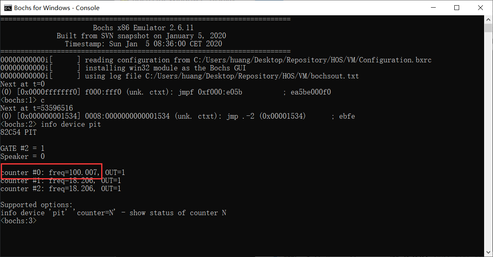

# （十）驱动管理框架


## 0. 更换编译工具链

由于开发过程中碰到的实际问题，编译工具链从先前的 `i386-elf-toolchain` 换成了 `i686-elf-tool`。

GitHub的Release版本为：[i868-elf-tool-windows.zip](https://github.com/alessandromrc/i686-elf-tools/releases/download/11.1.0/i686-elf-tools-windows.zip)

配置好环境变量之后，主Makefile指定编译器如下：

```makefile
# 主Makefile，用于整合各模块操作

# 汇编器和编译器、链接器等各种工具
NASM = nasm
# 编译工具链更换
GCC = i686-elf-gcc
AS = i686-elf-as
LD = i686-elf-ld
MAKE = make

```


## 1. 准备工作

### 1.1 把数据放到特定的段中

在嵌入式系统开发中，有时需要将特定的数据放置到特定的内存段中。可以使用 GCC 的 `__attribute__((section("section_name")))` 来实现这一目的。下面是一个示例，展示如何将数据放置到一个名为 `.custom_data` 的段中：

首先，在代码中使用 `__attribute__` 将变量或结构体实例放置到特定段中：

```c
// 将变量放置到 .custom_data 段中
__attribute__((section(".custom_data"))) int my_custom_data = 42;

// 将结构体实例放置到 .custom_data 段中
__attribute__((section(".custom_data"))) struct my_struct {
    int field1;
    char field2;
} my_struct_instance = {1, 'A'};
```

然后，在链接脚本中定义这个段：

```ld
SECTIONS
{
    . = 0x00001500;
    .text : { *(.text) }
    .data : { *(.data) }
    .bss : { *(.bss) }
    .custom_data : {
        __custom_data_start = .;
        KEEP(*(.custom_data))
        __custom_data_end = .;
    }
}
```

这种方式可以确保特定的数据被放置在我们希望的内存区域，便于管理和访问。


### 1.2 中断分发

在操作系统或底层驱动开发中，有时候我们希望少写点汇编，就可以尝试用一个汇编语言包装一个中断分发器，成为一个通用的中断处理程序，中断分发器根据中断号调用相应的中断处理逻辑。这么做不会增加多少开销，但是编程更加轻松了。

中断分发的基本步骤和普通的中断处理函数一致：

1. **保存上下文**：保存当前 CPU 状态（寄存器、标志等），以便中断处理完成后能恢复原状态。
2. **调用中断处理程序**：根据中断号，调用相应的中断处理程序。
3. **恢复上下文**：恢复之前保存的 CPU 状态，并返回中断前的执行点。

以下是一个典型的中断处理程序的汇编代码示例：

```asm
section .text
global interrupt_handler
; C中定义的中断分发器
extern interrupt_dispatcher
interrupt_handler:
    cli                     ; 禁用中断
    pusha                   ; 保存所有通用寄存器
    call interrupt_dispatcher ; 调用中断分发器
    popa                    ; 恢复所有通用寄存器
    sti                     ; 启用中断
    iretd                   ; 返回中断前的执行点

```

中断分发器在 C 语言中的实现示例：

```c
void (*interrupt_handlers[256])(void); // 中断处理程序数组

void interrupt_dispatcher() {
    uint32_t interrupt_number = get_interrupt_number(); // 获取中断号
    if (interrupt_handlers[interrupt_number]) {
        interrupt_handlers[interrupt_number](); // 调用对应的中断处理程序
    }
}

```

这些步骤确保中断处理程序能够正确处理硬件中断，并在处理完成后恢复系统的正常运行。通过这种方式，可以灵活地管理和处理各种硬件中断。


## 2. 具体实现

### 2.1 修改链接脚本

kernel_linker.ld

```ld
ENTRY(kernel_main)    /* 入口函数，这里将决定编出的程序入口是哪个地方 */

SECTIONS
{
    . = 0x00001500;  /* 内核加载地址，程序各个段物理地址的起算点，也是入口函数所在的地方 */
    .text : { *(.text) }
    .data : { *(.data) }
    .bss : { *(.bss) }
    .drivers : {    /* 这个段用于加载驱动 */
        __drivers_start = .;
        KEEP(*(.drivers))
        __drivers_end = .;
    }
}

```

### 2.2 实现中断分发

interrupt_handler文件夹下建立pic_irq_interrupt_handler.asm

```c
[bits 32]   ; 显式指定为32位汇编

TI_GDT equ 0
RPL0 equ 0
SELECTOR_CODE equ (0x0001 << 3) + TI_GDT + RPL0
SELECTOR_DATA equ (0x0002 << 3) + TI_GDT + RPL0
SELECTOR_VIDEO equ (0x0003 << 3) + TI_GDT + RPL0

section .text

global pic_irq_interrupt_handler

; 在C里面编写的逻辑处理代码，现在是中断分发器
extern pic_irq_interrupt_dispatcher

; void pic_irq_interrupt_handler();
pic_irq_interrupt_handler:
    cli                     ; 禁用中断，防止中断嵌套（eflag、cs、eip、错误码，四个，一共16字节）
    pushad                  ; 保存所有通用寄存器，也就是所谓的保存现场（8个寄存器，每个4字节，一共32字节）
    push ds                 ; 保存数据段寄存器（段寄存器一共四个，每个4字节，一共16字节）
    push es
    push fs
    push gs                 ; 保存视频段寄存器
    mov ax, SELECTOR_DATA   ; 加载数据段选择子
    mov ds, ax
    mov es, ax
    mov fs, ax
    mov ax, SELECTOR_VIDEO  ; 加载视频段选择子
    mov gs, ax

    call pic_irq_interrupt_dispatcher ; 调用C里面的中断分发器

    pop gs                  ; 恢复各个段寄存器
    pop fs
    pop es
    pop ds
    popad                   ; 恢复所有通用寄存器，也就是恢复现场
    sti                     ; 启用中断
    iretd                   ; 恢复调用前的cs、eflags、eip

```

该文件夹下的Makefile

```makefile
# 目录
KERNEL_DIR = ..
INTERRUPT_HANDLER = .

# 汇编标志
ASM_FLAGS = -f elf32

# 定义源文件和目标文件
SRCS = $(wildcard *.asm)
OBJS = $(SRCS:.asm=.o)

# 默认目标，编译所有的 .asm 文件
all: $(OBJS)

# 目标文件生成规则
%.o: %.asm
	$(NASM) $(ASM_FLAGS) -o $(KERNEL_DIR)/$@ $<

# 不在此处生成文件无需清理

```

kernel_idt文件夹中，进行修改。

kernel_idt.c

```c
//
// Created by huangcheng on 2024/5/25.
//

#include "kernel_idt.h"

#include "../kernel_interrupt/kernel_interrupt.h"

// 仅用于PIC的中断处理逻辑数组
void (*pic_irq_interrupt_handlers[16])(void) = { NULL };

// 仅用于PIC的中断分发器
void pic_irq_interrupt_dispatcher() {
    // 禁用中断
    intr_disable();
    // 设置OCW3结构体读取主PIC的ISR
    PIC_OCW3 ocw3 = {
        .ris = 1,
        .rr = 1,
        .p = 0,
        .reserved1 = 1,
        .reserved2 = 0,
        .smm = 0,
        .esmm = 0,
        .reserved3 = 0,
    };
    // 读取主PIC的ISR
    outb(PIC_M_CTRL, *(uint8_t*)&ocw3); // 写入命令
    uint8_t master_isr = inb(PIC_M_CTRL); // 读取ISR
    // 读取从PIC的ISR
    outb(PIC_S_CTRL, *(uint8_t*)&ocw3); // 写入命令
    uint8_t slave_isr = inb(PIC_S_CTRL); // 读取ISR

    // 遍历检查哪一个IRQ触发了中断
    uint32_t interrupt_number = 0;
    for (uint8_t i = 0; i < 8; i++) {
        //用位运算的原因是因为用结构体判断代码太长了
        if (master_isr & (1 << i)) {
            interrupt_number =  i; // 主 PIC 中断号从 0x20 开始
            break;
        } else if (slave_isr & (1 << i)) {
            interrupt_number = 8 + i; // 从 PIC 中断号从 0x28 开始
            break;
        }
    }

    if (pic_irq_interrupt_handlers[interrupt_number]) {
        pic_irq_interrupt_handlers[interrupt_number]();
    }

    // 发送 EOI 信号
    PIC_OCW2 ocw2 = {
        .irq_level = 0,
        .reserved = 0,
        .eoi = 1,
        .sl = 0,
        .r = 0,
    };
    // 发送EOI信号
    if (interrupt_number >= 0x28) {
        // 如果是从PIC引起的，不仅要给主PIC，还要发送给从PIC，
        // 发送 EOI 信号给从 PIC
        outb(PIC_S_CTRL, *(uint8_t*)&ocw2);
    }
    // 发送 EOI 信号给主 PIC
    outb(PIC_M_CTRL, *(uint8_t*)&ocw2);
    // 启用中断
    intr_enable();
}


// 包装PIC中断分发器的中断处理函数
extern void pic_irq_interrupt_handler();

void init_idt() {

    // 其他不变，就不写了，浪费长度

    // 注册PIC的这些中断处理函数为统一包装函数
    for(int i = 0x20; i < 0x30; i++) {
        set_interrupt_descriptor(i, pic_irq_interrupt_handler);
    }

    // 256 个中断描述符，8 * 256 - 1 = 2047，即0x7ff
    // 虚拟地址加载IDT
    load_idt( 256 * 8 - 1 ,IDT_BASE_ADDR + HIGH_ADDR_OFFSET);

}


```

其中，关于ISR，其结构体形式如下，和IMR一模一样

```c
// ISR 结构体
typedef struct {
    uint8_t irq0 : 1;    // IRQ 0
    uint8_t irq1 : 1;    // IRQ 1
    uint8_t irq2 : 1;    // IRQ 2
    uint8_t irq3 : 1;    // IRQ 3
    uint8_t irq4 : 1;    // IRQ 4
    uint8_t irq5 : 1;    // IRQ 5
    uint8_t irq6 : 1;    // IRQ 6
    uint8_t irq7 : 1;    // IRQ 7
} MASTER_ISR;
typedef struct {
    uint8_t irq8 : 1 ;          // IRQ 8
    uint8_t irq9 : 1 ;          // IRQ 9
    uint8_t irq10 : 1 ;         // IRQ 10
    uint8_t irq11 : 1 ;         // IRQ 11
    uint8_t irq12 : 1 ;         // IRQ 12
    uint8_t irq13 : 1 ;         // IRQ 13
    uint8_t irq14 : 1 ;         // IRQ 14
    uint8_t irq15 : 1 ;         // IRQ 15
} SLAVE_ISR;

```


### 2.3 设备驱动管理框架

创建kernel_device文件夹。分别创建kernel_device.h、kernel_device.c、Makefile。

kernel_device.h

```c
//
// Created by huangcheng on 2024/5/27.
//

#ifndef HOS_KERNEL_DEVICE_H
#define HOS_KERNEL_DEVICE_H

#include "../../lib/lib_kernel/lib_kernel.h"

// 统一的驱动接口结构体（这个结构体的实例一律放在驱动段）
struct driver {
    char driver_name[64];                       // 驱动名称
    void (*init)(void);                         // 初始化函数
    void (*exit)(void);                         // 退出函数
    int32_t irq;                                // IRQ 中断号（如果没有中断处理函数填-1）
    void (*irq_interrupt_handler)(void);            // 中断处理函数（可选）
    int32_t (*read)(void* buffer, int size);        // 读操作（可选）
    int32_t (*write)(const void* buffer, int size); // 写操作（可选）
    struct list_node node;                      // 用于串联到驱动链表上的链表结点
};

// 初始化所有设备
void init_all_devices();
// 移除所有设备
void exit_all_devices();
// 添加单个驱动并初始化
void driver_add(struct driver* drv);
// 移除单个驱动并卸载
void driver_remove(const char *driver_name);

// 这个注册宏的作用就是把数据放在驱动段（而且告诉编译器这个是被使用的，不能优化掉），它会定义一个驱动结构体实例
#define REGISTER_DRIVER(drv) \
    __attribute__((section(".drivers"), used)) struct driver drv =


#endif //HOS_KERNEL_DEVICE_H

```

kernel_device.c

```c
//
// Created by huangcheng on 2024/5/27.
//

#include "kernel_device.h"
#include "../kernel_interrupt/kernel_interrupt.h"

// 驱动链表头结点
struct list_node driver_list_head;

// 驱动段的起点和终点
extern struct driver __drivers_start[];
extern struct driver __drivers_end[];

// 仅用于PIC的中断处理逻辑数组
extern void (*pic_irq_interrupt_handlers[16])(void);

void init_all_devices() {
    // 初始化驱动链表头结点
    init_list_node(&driver_list_head);
    // 链接到驱动链表
    struct driver* drv;
    for (drv = __drivers_start; drv < __drivers_end; drv++) {
        driver_add(drv);
    }
}

void exit_all_devices() {
    // 禁用中断
    intr_disable();
    // 遍历驱动链表，执行每个驱动的退出函数
    struct list_node *pos, *n;
    list_for_each_safe(pos, n, &driver_list_head) {
        struct driver *drv = list_entry(pos, struct driver, node);
        if (drv->exit != NULL) {
            drv->exit();
        }
        // 如果中断号在有效范围内且匹配当前驱动的中断处理程序
        if (drv->irq >= 0 && drv->irq < 16 && pic_irq_interrupt_handlers[drv->irq] == drv->irq_interrupt_handler) {
            pic_irq_interrupt_handlers[drv->irq] = NULL;
        }
        // 从链表中移除该驱动
        list_del(pos);
    }
    // 启用中断
    intr_enable();
    // 初始化头结点
    init_list_node(&driver_list_head);
}

void driver_add(struct driver* drv) {
    if (drv == NULL) {
        return;
    }

    // 检查是否重复注册
    struct list_node *pos;
    list_for_each(pos, &driver_list_head) {
        if (strcmp(list_entry(pos, struct driver, node)->driver_name, drv->driver_name) == 0) {
            return;
        }
    }
    // 怕触发中断，所以先关闭中断
    intr_disable();

    // 如果要求注册中断处理函数，必须检查中断号范围
    if (drv->irq >= 0 && drv->irq < 16) {
        // 检查对应位置是否已被占用
        if (pic_irq_interrupt_handlers[drv->irq] != NULL) {
            return; // 中断处理程序冲突，不得挂载驱动
        } else {
            pic_irq_interrupt_handlers[drv->irq] = drv->irq_interrupt_handler;
        }
    } else if (drv->irq_interrupt_handler != NULL) {
        // IRQ 不在范围内但要求注册中断处理函数，不得挂载驱动
        return;
    }

    // 执行初始化函数
    if (drv->init != NULL) {
        drv->init();
    }

    // 现在不怕触发中断了就可以打开中断
    intr_enable();

    // 将驱动添加到驱动链表
    list_add_tail(&drv->node, &driver_list_head);
}

void driver_remove(const char *driver_name) {
    struct list_node *pos, *n;
    list_for_each_safe(pos, n, &driver_list_head) {
        struct driver *drv = list_entry(pos, struct driver, node);
        if (strcmp(drv->driver_name, driver_name) == 0) {
            // 首先禁止中断，怕又触发中断
            intr_disable();

            // 执行退出函数
            if (drv->exit != NULL) {
                drv->exit();
            }

            // 检查是否需要清除中断处理逻辑
            if (drv->irq >= 0 && drv->irq < 16 && pic_irq_interrupt_handlers[drv->irq] == drv->irq_interrupt_handler) {
                pic_irq_interrupt_handlers[drv->irq] = NULL;
            }

            // 清除干净，允许中断
            intr_enable();

            // 从链表中移除该驱动
            list_del(pos);
            return;
        }
    }
}

```

这就是我们现有的驱动管理框架的实现。

另外补充在kernel_interrupt中的两个中断相关的操作。

```c
// 禁用指定向量的中断（其实就是设置IMR，这里方便一点用位运算比较好）
void disable_interrupt(uint8_t irq) {
    uint16_t port;
    uint8_t value;

    if (irq < 8) {
        // IRQ 0-7 由主片控制
        port = 0x21;
    } else {
        // IRQ 8-15 由从片控制
        port = 0xa1;
        irq -= 8;
    }
    // 读取当前的中断屏蔽寄存器值
    value = inb(port);
    // 设置对应位来禁用中断
    value |= (1 << irq);
    // 写回中断屏蔽寄存器
    outb(port, value);
}

// 启用指定向量的中断（其实就是设置IMR，这里方便一点用位运算比较好）
void enable_interrupt(uint8_t irq) {
    uint16_t port;
    uint8_t value;

    if (irq < 8) {
        // IRQ 0-7 由主片控制
        port = 0x21;
    } else {
        // IRQ 8-15 由从片控制
        port = 0xa1;
        irq -= 8;
    }
    // 读取当前的中断屏蔽寄存器值
    value = inb(port);
    // 清除对应位来启用中断
    value &= ~(1 << irq);
    // 写回中断屏蔽寄存器
    outb(port, value);
}

```


## 3. 实际案例（PIT8253计时器驱动）

在Program目录下创建devices文件夹，在devices里面创建pit8253文件夹。

建立devices文件夹的Makefile

```makefile

# 所有设备目录
DEVICE_DIR = .
PIT8253_DIR = pit8253

# 标签标记所有的任务（输出什么文件），方便修改
DEVICE_OBJS = pit8253.o

.PHONY: all

all: $(DEVICE_OBJS)

# 执行各子模块编译
pit8253.o:
	$(MAKE) -C $(PIT8253_DIR) GCC=$(GCC) AS=$(AS)

# 清理规则
clean:
	@if exist $(DEVICE_DIR)\\*.o del $(DEVICE_DIR)\\*.o
	@if exist $(DEVICE_DIR)\\*.bin del $(DEVICE_DIR)\\*.bin

```

在pit8253文件夹下面建立pit8253.h和pit8253.c以及Makefile。

pit8253.h

```c
//
// Created by huangcheng on 2024/5/27.
//

#ifndef HOS_PIT8253_H
#define HOS_PIT8253_H

#include "../../kernel/kernel_device/kernel_device.h"

// pit8253初始化函数
void init_pit8253();
// pit8253退出函数
void exit_pit8253();
// pit8253中断处理函数
void interrupt_handler_pit8253();

#endif //HOS_PIT8253_H

```

pit8253.c

```c
//
// Created by huangcheng on 2024/5/27.
//

#include "pit8253.h"

// 注册宏，定义一个驱动结构体，把驱动结构体实例放到驱动段
REGISTER_DRIVER(pit8253_driver){
    .driver_name = "pit8253",
    .init = init_pit8253,
    .exit = exit_pit8253,
    .irq = 0,
    .irq_interrupt_handler = interrupt_handler_pit8253,
    .read = NULL,
    .write = NULL,
};

#define IRQ0_FREQUENCY	   100
#define INPUT_FREQUENCY	   1193180
#define COUNTER0_VALUE	   INPUT_FREQUENCY / IRQ0_FREQUENCY
#define CONTRER0_PORT	   0x40
#define COUNTER0_NO	   0
#define COUNTER_MODE	   2
#define READ_WRITE_LATCH   3
#define PIT_CONTROL_PORT   0x43

// 定义PIT8253控制字结构体
typedef struct {
    uint8_t bcd       : 1;  // 位0：BCD模式选择，0=16位二进制计数，1=4位BCD计数

    // 位1-3：工作模式选择，具体模式见下表
    // 000：模式0（中断在终端计数）
    // 001：模式1（可编程单次触发）
    // 010：模式2（计数器终端阵列）
    // 011：模式3（方波生成器）
    // 100：模式4（软件触发定时器）
    // 101：模式5（硬件触发定时器）
    // 110：未定义
    // 111：未定义
    uint8_t mode      : 3;

    // 位4-5：读/写计数器的LSB/MSB选择
    // 00：计数器停止（未定义）
    // 01：读/写计数器的最低有效字节（LSB）
    // 10：读/写计数器的最高有效字节（MSB）
    // 11：先读/写最低有效字节，然后读/写最高有效字节（先LSB后MSB）
    uint8_t rwl        : 2;

    // 位6-7：选择计数器
    // 00：选择计数器0
    // 01：选择计数器1
    // 10：选择计数器2
    // 11：读回控制字（不常用）
    uint8_t counter   : 2;
} PIT8253ControlWord;

// 用联合体分离高位低位
typedef union {
    uint16_t value;
    struct Part {
        uint8_t offset_low;
        uint8_t offset_high;
    } part ;
} CountValue ;


void init_pit8253() {
    put_str("pit8253 initialization.\n");
    // 设置8253的定时周期,也就是发中断的周期
    PIT8253ControlWord controlWord = {
            .bcd = 0,                   // 16位二进制计数
            .mode = COUNTER_MODE,       // 模式2（计数器终端阵列）
            .rwl = READ_WRITE_LATCH,    // 先读/写LSB，然后读/写MSB
            .counter = COUNTER0_NO      // 选择计数器0
    };
    outb(PIT_CONTROL_PORT, *((uint8_t *)&controlWord));

    CountValue value;
    value.value = COUNTER0_VALUE;
    // 设置计数初始值（分两次写入）
    outb(CONTRER0_PORT, value.part.offset_low);
    outb(CONTRER0_PORT, value.part.offset_high);
    put_str("pit8253 initialized.\n");
}

void exit_pit8253() {
    put_str("pit8253 exiting......\n");
    // 设置8253的定时周期为0为停止模式
    PIT8253ControlWord controlWord = {
            .bcd = 0,                   // 16位二进制计数
            .mode = 0,                  // 模式0（中断在终端计数）
            .rwl = 0,                   // 计数器停止（未定义）
            .counter = COUNTER0_NO      // 选择计数器0
    };
    outb(PIT_CONTROL_PORT, *((uint8_t *)&controlWord));

    // 复位计数器初始值为0
    CountValue value;
    value.value = 0;
    outb(CONTRER0_PORT, value.part.offset_low);
    outb(CONTRER0_PORT, value.part.offset_high);
    put_str("pit8253 has exited.\n");
}

void interrupt_handler_pit8253() {
    put_str("pit8253 irq.\n");
};

```

Makefile

```makefile

# 目录
DEVICE_DIR = ..
PIT8253_DIR = .

# 源文件
PIT8253_C_SRC = $(PIT8253_DIR)/pit8253.c

# C 编译标志
CFLAGS = -ffreestanding -nostdlib -Wall -Wextra

# 标签标记所有的任务（输出什么文件），方便修改
DEVICE_OBJS = $(DEVICE_DIR)/pit8253.o

.PHONY: all

all: $(DEVICE_OBJS)

# C 文件生成 汇编文件，再汇编生成.o，为什么这么做之前说过了，这个gcc的汇编器不知道什么问题
# 编出来放到模块文件夹devices去，别放在这里，方便主Makefile找
$(DEVICE_DIR)/pit8253.o: $(PIT8253_C_SRC)
	$(GCC) $(CFLAGS) -S -o $(PIT8253_DIR)/pit8253.asm $<
	$(AS) -o $@ $(PIT8253_DIR)/pit8253.asm
	del $(PIT8253_DIR)\\pit8253.asm

# 文件不生成于此，无需清理规则

```

主Makefile（Program下的Makefile）把devices包括进去，链接内容也包括进去。

```c
# 主Makefile，用于整合各模块操作

# 汇编器和编译器、链接器等各种工具
NASM = nasm
# 编译工具链更换
GCC = i686-elf-gcc
AS = i686-elf-as
LD = i686-elf-ld
MAKE = make

# 因为这个操作系统本质上是个宏内核，所有的组件都要打包在一个kernel.bin里面
# 这样烧写起来也方便，所以要在主Makefile这里统一链接

# 所有组件目录
BOOT_DIR = boot
KERNEL_DIR = kernel
LIB_DIR = lib
DEVICE_DIR = devices

# 输出文件
KERNEL_BIN = $(KERNEL_DIR)/kernel.bin

# 链接脚本位置
KERNEL_LINKER_SCRIPT = $(KERNEL_DIR)/kernel_linker.ld

# 链接标志
LDFLAGS = -T $(KERNEL_LINKER_SCRIPT) --oformat binary

.PHONY: all

# 编译各组件，要把工具参数传输过去，然后主Makefile汇总链接生成 kernel.bin
all: compile link

# 编译各组件
compile:
	$(MAKE) -C $(BOOT_DIR) NASM=$(NASM)
	$(MAKE) -C $(LIB_DIR) NASM=$(NASM) GCC=$(GCC) AS=$(AS) MAKE=$(MAKE)
	$(MAKE) -C $(KERNEL_DIR) NASM=$(NASM) GCC=$(GCC) AS=$(AS) MAKE=$(MAKE)
	$(MAKE) -C $(DEVICE_DIR) NASM=$(NASM) GCC=$(GCC) AS=$(AS) MAKE=$(MAKE)

# 链接生成 kernel.bin
link:
	$(LD) $(LDFLAGS) -o $(KERNEL_BIN) $(wildcard $(KERNEL_DIR)/*.o) $(wildcard $(LIB_DIR)/*.o) $(wildcard $(DEVICE_DIR)/*.o)


clean:
	$(MAKE) -C $(BOOT_DIR) clean
	$(MAKE) -C $(KERNEL_DIR) clean
	$(MAKE) -C $(LIB_DIR) clean
	$(MAKE) -C $(DEVICE_DIR) clean

```

kernel.c

```c
#include "../lib/lib_kernel/lib_kernel.h"
#include "kernel_page/kernel_page.h"
#include "kernel_gdt/kernel_gdt.h"
#include "kernel_idt/kernel_idt.h"
#include "kernel_device/kernel_device.h"
#include "kernel_memory/kernel_memory.h"

void kernel_main(void) {

    // 内存分页初始化
    init_paging();
    // 重新加载gdt
    setup_gdt();
    // 调整ESP，将栈指针切换到高地址
    switch_esp_virtual_addr() ;
    // 初始化idt
    init_idt();
    // 初始化内存管理
    init_memory();
    // 初始化所有的设备
    init_all_devices();
    put_str("start!\n");

    //打开IRQ 0
    //enable_interrupt(0);

    // 进入内核主循环或其它初始化代码
    for(;;) {

    }
}

```

烧写编译运行，可以看到


驱动已经初始化了。



可以看到pit8253的初始化已经完成，我们的中断频率已经到了每秒钟100次。

```c
    //打开IRQ 0
    enable_interrupt(0);
```

注释掉，重新编译烧写运行。


试试卸载驱动。

```c
#include "../lib/lib_kernel/lib_kernel.h"
#include "kernel_page/kernel_page.h"
#include "kernel_gdt/kernel_gdt.h"
#include "kernel_idt/kernel_idt.h"
#include "kernel_device/kernel_device.h"
#include "kernel_memory/kernel_memory.h"

void kernel_main(void) {

    // 内存分页初始化
    init_paging();
    // 重新加载gdt
    setup_gdt();
    // 调整ESP，将栈指针切换到高地址
    switch_esp_virtual_addr() ;
    // 初始化idt
    init_idt();
    // 初始化内存管理
    init_memory();
    // 初始化所有的设备
    init_all_devices();
    // 卸载驱动
    driver_remove("pit8253");

    put_str("start!\n");
    //打开IRQ 0
    enable_interrupt(0);

    // 进入内核主循环或其它初始化代码
    for(;;) {

    }
}

```

编译烧写运行。


可以看到什么反应都没有。


时钟频率变回原先了。