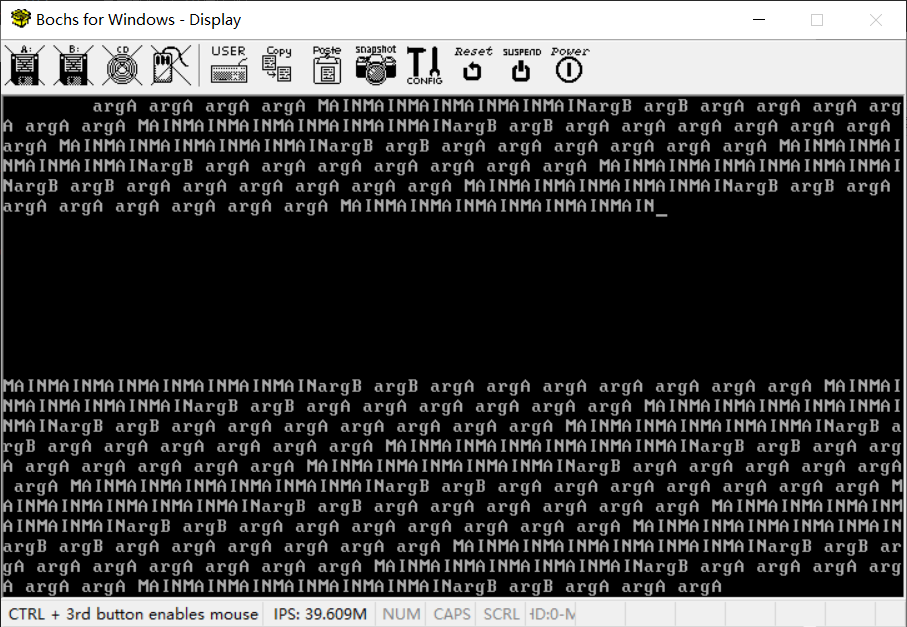
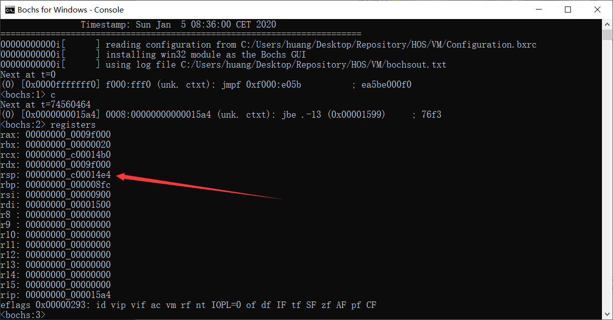
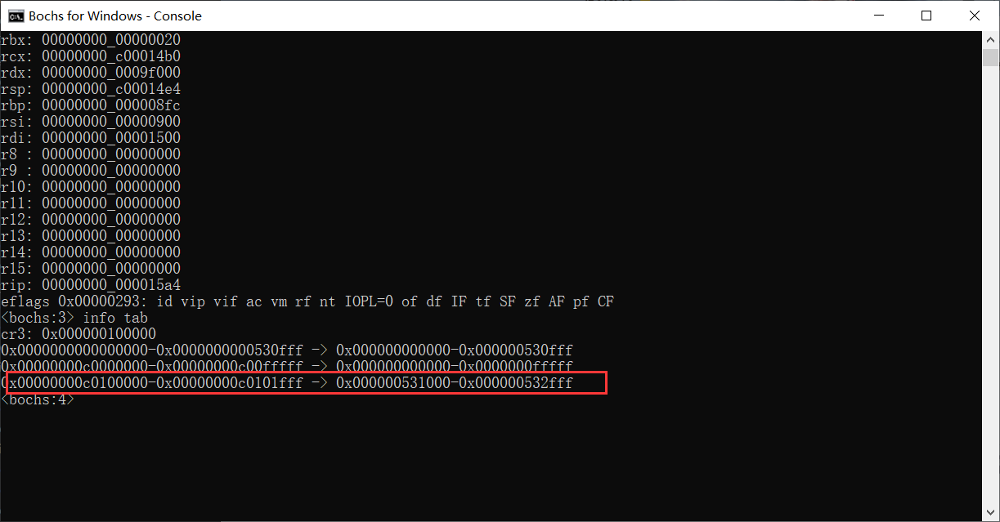
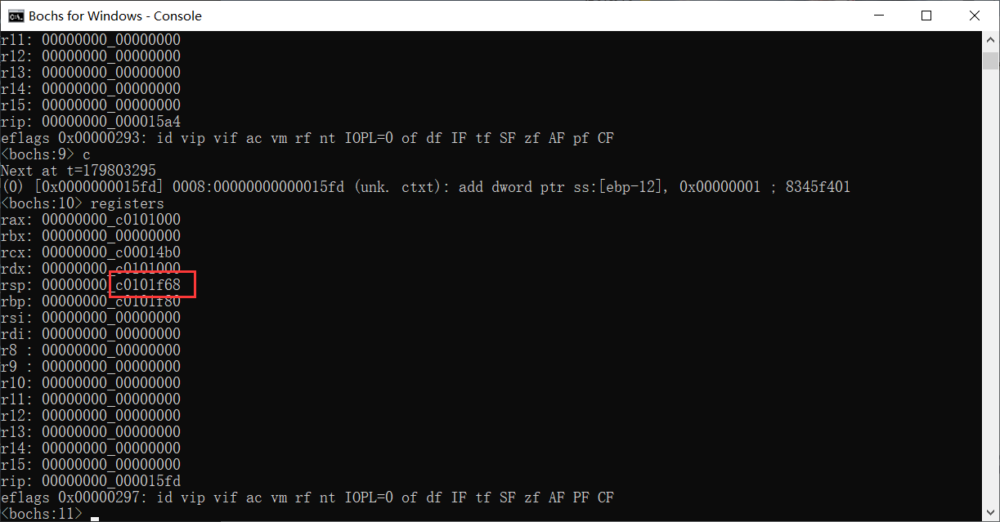

# （十一） 多任务机制的实现


## （0）补充调整

这部分纯粹是我的问题，之前忘了改了，开发的时候才发现的。

kernel_memory.c

```c
// 页表、位图结束的地方，就是内核堆内存开始的地方（物理位置）
#define KERNEL_PHYSICAL_ADDR_START 0x00531000
// 用户堆内存开始的地方就是内核堆内存结束的地方（物理位置）
#define USER_PHYSICAL_ADDR_START 0x00800000
// 内核虚拟地址起点（1MB以下全部被内核使用了，无法再用做堆内存了）
#define KERNEL_VIRTUAL_ADDR_START 0xc0100000

```


## 1. 多任务机制

多任务机制是操作系统能够同时运行多个任务（程序或进程）的能力。在多任务操作系统中，CPU 的时间被分割成很短的时间片，每个时间片可以分配给不同的任务。这种机制可以通过硬件支持和操作系统的软件调度来实现。

### 1.1 x86架构 CPU 原生机制 TSS

在 x86 架构的 CPU 中，任务状态段（Task State Segment, TSS）是一种硬件支持的多任务机制。TSS 是一个数据结构，包含了一个任务在执行时所有的寄存器状态、段选择子、栈指针等信息。当 CPU 切换任务时，可以通过加载和保存 TSS 来快速保存当前任务的状态并加载新任务的状态。

#### TSS 的主要特点包括：
- **硬件支持**：x86 CPU 原生支持 TSS，提供了任务切换的硬件机制。
- **状态保存与恢复**：TSS 包含了所有的任务状态信息，可以快速保存和恢复任务的执行状态。
- **中断处理**：TSS 可以用于处理硬件中断，通过 TSS 切换实现中断服务程序和原任务的无缝切换。

然而，TSS 也有一些局限性，例如复杂性高、灵活性不足，因此现代操作系统更倾向于使用软件实现的任务调度机制。

### 1.2 操作系统自行调度

操作系统自行调度是指操作系统通过软件实现的方式来管理和调度多个任务。这种方式通常不依赖于 CPU 的硬件支持，而是通过操作系统内核来控制任务切换和时间片分配。

#### 自行调度的主要特点包括：
- **灵活性高**：操作系统可以根据不同的策略（如时间片轮转、优先级调度等）来灵活地管理任务切换。
- **简化设计**：不依赖复杂的硬件机制，使得设计和实现更加简化和可控。
- **广泛应用**：大多数现代操作系统，包括 Linux、Windows 和 macOS，主要依靠软件调度来实现多任务管理。

#### 自行调度的实现方式：
1. **时间片轮转调度**：每个任务被分配一个固定的时间片，当时间片用完后，操作系统会将任务切换到下一个任务。这种方式可以确保所有任务都有机会获得 CPU 时间。
2. **优先级调度**：任务根据优先级进行调度，优先级高的任务优先获得 CPU 时间。操作系统可以动态调整任务的优先级以实现更灵活的调度策略。
3. **中断驱动调度**：通过硬件定时器中断来周期性地打断当前任务，触发操作系统进行任务调度。这种方式可以确保操作系统能够及时响应和处理任务切换。

通过操作系统自行调度，系统能够更高效地利用 CPU 资源，提供更好的用户体验和系统性能。这种方式也使得操作系统能够更好地适应不同的应用需求和硬件环境。


## 2. 多任务机制的实现

多任务机制的实现涉及设计和管理多个任务的调度和切换。本项目将采用软件调度的方式（操作系统自动调度的方式）进行。

在实现多任务机制时，首先需要设计任务的基本结构和状态管理。

创建kernel_task文件夹，其下创建kernel_task.h、kernel_task.c。Makefile这次我就不给了。

### 2.1 原型设计

任务控制块（Task Control Block, TCB）是操作系统用来描述任务的主要数据结构，包含任务的状态、栈指针、优先级等信息。在Linux中，对应的是struct task_struct。有一些操作系统中，进程用的叫 PCB ，即进程控制块，线程用的叫 TCB ，即线程控制块。我这不区分，类似于Linux，内核线程和进程是同一个东西，也就是task。

下面是TCB的原型：

```c
// 任务函数，等效于 void (*)(void*) 类型
typedef void task_function(void*);

// 最常用的五大任务状态（进线程通用）：正在运行、准备就绪、阻塞、等待、挂起、死亡
enum task_status {
    TASK_RUNNING,
    TASK_READY,
    TASK_BLOCKED,
    TASK_WAITING,
    TASK_HANGING,
    TASK_DIED
};

// TCB（任务控制块），表明这是一个任务（不管是进线程，都是任务）
struct task {
    uint8_t *self_stack;          // 各任务都用自己的栈（指向栈顶）
    enum task_status status;      // 任务状态
    char name[16];                // 任务名
    uint8_t priority;             // 优先级
    uint8_t ticks;                // 每次在处理器上执行的时间嘀嗒数
    uint32_t elapsed_ticks;       // 此任务自上CPU运行后至今占用的CPU嘀嗒数
    struct list_node general_tag; // 当前串在哪个调度队列上
    struct list_node all_task_tag;// 所有任务都串在一起
    uint32_t* pgdir;              // 页表的地址（进程特有）
    uint32_t stack_magic;         // 用于检测任务栈的溢出
};

```

中断栈用于保存中断发生时的CPU状态，而任务信息栈用于保存任务切换时的状态。

```c
// 中断栈数据
struct interrupt_stack {
    uint32_t interrupt_number;  // 中断号
    uint32_t manual_error_code; // 手动压栈的错误码 (如果没有错误码，这里存储0)
    uint32_t gs;         // 附加段寄存器 GS
    uint32_t fs;         // 附加段寄存器 FS
    uint32_t es;         // 额外段寄存器 ES
    uint32_t ds;         // 数据段寄存器 DS
    uint32_t edi;        // 目标变址寄存器 EDI
    uint32_t esi;        // 源变址寄存器 ESI
    uint32_t ebp;        // 基址指针寄存器 EBP
    uint32_t esp_dummy;  // 栈指针寄存器 ESP（不会真的恢复到ESP，所以只是个摆设）
    uint32_t ebx;        // 通用寄存器 EBX
    uint32_t edx;        // 通用寄存器 EDX
    uint32_t ecx;        // 通用寄存器 ECX
    uint32_t eax;        // 通用寄存器 EAX
    uint32_t error_code; // 错误码 (如果没有错误码，这里存储0)
    uint32_t eflags;     // 标志寄存器
    uint32_t cs;         // 代码段寄存器
    uint32_t eip;        // 指令指针寄存器
    uint32_t user_esp;   // 低特权级进入高特权级的时候CPU自动压的栈指针 ESP
    uint32_t user_ss;    // 低特权级进入高特权级的时候CPU自动压的栈段选择子 SS
};


// 任务信息栈，用于保存一个任务切换时候的状态
struct task_info_stack {
    // 这四个通用寄存器会被切换到新任务的数据，所以要在这里保存（我们手动压的）
    uint32_t ebp;        // 用于保存切换时的EBP寄存器值
    uint32_t ebx;        // 用于保存切换时的EBX寄存器值
    uint32_t edi;        // 用于保存切换时的EDI寄存器值
    uint32_t esi;        // 用于保存切换时的ESI寄存器值

    // 首次上CPU的时候需要设置，后面就自动调整了
    // 在栈里，这就是所谓的返回地址，pop掉上面四个之后，ret的时候直接jmp这个地址，以此实现任务切换
    // 也就是直接跳入function(func_arg)里面了
    void (*ret_addr) (task_function* func, void* func_arg);
    // 这个返回地址是调用function(func_arg)的时候的返回地址（其实就是这里本身），对我们没什么用
    void (*unused_ret_addr);     // 占位用，不实际使用
    // 说白了就是传参
    task_function *function;    // 首次执行时调用的函数
    void* func_arg;             // 首次执行时调用函数的参数
};

```

任务的创建、取消和调度需要通过特定的函数实现：

```c
// 创建任务，自动将其加入任务队列中，等待随时被调度
struct task *task_create(char *name, int priority, task_function function, void* func_arg);
// 取消任务，将任务从链表中删除
void task_cancel(struct task *task);
// 获取当前正在运行的任务
struct task* running_task(void);
// 任务调度器
void task_schedule(void);
// 任务切换
void task_switch(void);
// 多任务机制初始化
void init_multitasking(void);

```


### 2.2 任务切换

任务切换是多任务机制的核心，涉及保存当前任务的状态并恢复下一个任务的状态。

**任务信息栈结构体就是为了配合这个任务切换函数而刻意排列的。**

以下是任务切换函数的实现：

```asm
[bits 32]
section .text

global switch_to

switch_to:
   push esi
   push edi
   push ebx
   push ebp

   mov eax, [esp + 20]          ; 得到参数cur（4 * 4 + 返回地址4 = 20）
   mov [eax], esp               ; 解引用cur，得到第一个元素的值，也就是task的self_stack字段，栈顶指针
                                ; self_stack是struct task的第一个元素，所以不需要加偏移量
                                ; 直接对其写入esp的值即可，更新栈顶指针

;------------------  以上是备份当前任务的环境，下面是恢复下一个任务的环境  ----------------

   mov eax, [esp + 24]		    ; 得到栈中的参数next, next = [esp + 24]
   mov esp, [eax]		        ; pcb的第一个成员是self_kstack成员，记录栈顶指针
				               ; 从self_kstack中恢复到esp，恢复到这个任务的栈顶指针

				               ; 第一次上CPU执行的时候，栈顶在这里
				               ; pop四个都是0（最开始执行当然要清空）
   pop ebp
   pop ebx
   pop edi
   pop esi
   ret				           ; 此时，根据任务信息栈的设计，此时栈顶已经来到了上次执行到的入口地址
                                ; 就直接进入继续执行了
                                ; 如果是第一次上CPU的话，这里是我们初始化时候的包装函数入口地址
                                ; 所以ret就进入入口地址开始执行了

```


### 2.3 函数实现

```c
//
// Created by huangcheng on 2024/6/1.
//

#include "../kernel_task.h"
#include "../../kernel_interrupt/kernel_interrupt.h"
#include "../../kernel_memory/kernel_memory.h"

#define PG_SIZE 0x1000

// 内核任务 TCB 的固定位置和栈位置
#define KERNEL_TCB ((struct task*)0x9f000)

// 切换任务汇编
extern void switch_to(struct task *cur, struct task *next);

// 定义就绪队列和所有队列
static struct list_node ready_list;
static struct list_node all_task_list;

// 当前正在运行的任务
static struct task* current_task = NULL;
// 将要运行的任务（下一个任务）
static struct task* next_task = NULL;

// 初始化任务调度系统
void init_multitasking(void) {
    init_list_node(&ready_list);
    init_list_node(&all_task_list);

    // 初始化内核任务的 PCB（这一整页都直接清空）
    memset(KERNEL_TCB, 0, PG_SIZE);
    strcpy(KERNEL_TCB->name, "kernel");
    // 内核优先级为31，最高，运行时间也最长
    KERNEL_TCB->priority = 31;
    KERNEL_TCB->status = TASK_RUNNING;
    KERNEL_TCB->ticks = 31;
    KERNEL_TCB->elapsed_ticks = 0;
    // 内核栈位置固定的，之前设好了（现在假设是在栈底，后面调度的时候会自动更新的）
    KERNEL_TCB->self_stack = (uint8_t *)0xc0001500;
    // 魔数防止栈越界
    KERNEL_TCB->stack_magic = 0x1234abcd;
    // 因为现在肯定是内核在运行，所以不用加入到ready队列里面，加入到所有队列就行了
    init_list_node(&KERNEL_TCB->general_tag);
    list_add_tail(&KERNEL_TCB->all_task_tag, &all_task_list);
    // 将当前任务设置为内核任务
    current_task = KERNEL_TCB;
    // 还要运行很久，所以设置为下一个任务
    next_task = KERNEL_TCB;
}

// 函数包装器
void func_wrapper(task_function* func, void* arg) {
    func(arg);
}

// 创建任务
struct task* task_create(char* name, int priority, task_function function, void* func_arg) {
    struct task* new_task = (struct task*)malloc_page(KERNEL_FLAG, 1);
    if (new_task == NULL) {
        return NULL;  // 内存分配失败
    }
    // 清空整页，这样后面就不用清理了
    memset(new_task, 0, PG_SIZE);
    strcpy(new_task->name, name);
    new_task->priority = priority;
    new_task->status = TASK_READY;
    new_task->ticks = priority;
    new_task->elapsed_ticks = 0;
    new_task->stack_magic = 0x1234abcd;

    // 栈是从高地址往低地址发展的
    // 所以最开始的栈顶设置在栈底
    new_task->self_stack = ((uint8_t*)new_task + PG_SIZE);
    // 预留中断栈位置（栈顶往低地址移动），这么做最关键的目的就是预防没有足够空间保留上下文
    new_task->self_stack -= sizeof(struct interrupt_stack);
    // 预留任务信息栈位置，这里是为了第一次上CPU执行而做的，配合switch_to函数
    new_task->self_stack -= sizeof(struct task_info_stack);
    

    // 其他的都清空了，现在不用初始化

    // 这些说白了是任务第一次上CPU运行的时候需要设置的，后面就会自动保存新的
    ((struct task_info_stack*)new_task->self_stack)->ret_addr = &func_wrapper;
    ((struct task_info_stack*)new_task->self_stack)->function = function;
    ((struct task_info_stack*)new_task->self_stack)->func_arg = func_arg;

    // 将任务加入调度队列和所有队列
    list_add(&new_task->general_tag, &ready_list);
    list_add(&new_task->all_task_tag, &all_task_list);

    return new_task;
}

// 取消任务
void task_cancel(struct task* task) {
    if(task == current_task) {
        // 这里要等任务完成才能删除，不知道该怎么写，先return了
        return;
    }
    list_del(&task->general_tag);
    list_del(&task->all_task_tag);
    free_page(KERNEL_FLAG, task, 1);
}

// 通过名字获取任务
struct task* task_info(char *name) {
    LIST_NODE* pos;
    list_for_each(pos, &all_task_list) {
        struct task* task = list_entry(pos, struct task, all_task_tag);
        if (strcmp(task->name, name) == 0) {
            return task;
        }
    }
    return NULL;
}

// 当前正在运行的任务
struct task* running_task(void) {
    return current_task;
}

void task_schedule(void) {
    // 检查栈溢出
    if (current_task->stack_magic != 0x1234abcd) {
        // 处理栈溢出错误
        for(;;);
    }

    if (current_task->status == TASK_RUNNING) { // 若此线程只是cpu时间片到了,将其加入到就绪队列尾
        list_add_tail(&current_task->general_tag, &ready_list);
        current_task->ticks = current_task->priority;     // 重新将当前线程的ticks再重置为其priority;
        current_task->status = TASK_READY;
    } else {
        /* 若此线程需要某事件发生后才能继续上cpu运行,
        不需要将其加入队列,因为当前线程不在就绪队列中。*/
    }

    if(list_empty(&ready_list)) {
        // 没任务，继续运行，不要切换
        return;
    } else {
        // 取第一个结点
        next_task = list_entry(ready_list.next, struct task, general_tag);
        next_task->status = TASK_RUNNING;

        // 因为切换之后会直接跳出中断处理程序，所以绝不能在这里切换，必须要在内核主循环切换
    }
}

// 任务切换（在调度器切换会导致跳出中断处理程序，必须要在各个执行流主循环切换）
void task_switch(void){
    if (current_task == next_task) {
        // 无需切换，直接返回，不要浪费资源
        return;
    }
    // 从ready链表中删除结点
    list_del(&next_task->general_tag);
    // 如果不切换就跳不出来了，所以用一个临时变量来中继
    struct task *cur_task = current_task;
    current_task = next_task;

    // 真正切换任务了，进去就暂时出不来了
    switch_to(cur_task, next_task);
}

```


### 2.4 IRQ0中断处理调度

pit8253.c

```c
void interrupt_handler_pit8253() {

    struct task* cur_task = running_task();

    cur_task->elapsed_ticks++;	  // 记录此线程占用的cpu时间嘀

    ticks++;	  //从内核第一次处理时间中断后开始至今的滴哒数,内核态和用户态总共的嘀哒数

    if (cur_task->ticks == 0) {	  // 若进程时间片用完就开始调度新的进程上cpu
        task_schedule();
    } else {				  // 将当前进程的时间片-1
        cur_task->ticks--;
    }
}

```


### 2.5 成果检验

kernel.c

```c
#include "../lib/lib_kernel/lib_kernel.h"
#include "kernel_page/kernel_page.h"
#include "kernel_gdt/kernel_gdt.h"
#include "kernel_idt/kernel_idt.h"
#include "kernel_device/kernel_device.h"
#include "kernel_memory/kernel_memory.h"
#include "kernel_task/kernel_task.h"

/* 两个都是在线程中运行的函数 */
void k_thread_a(void* arg);
void k_thread_b(void* arg);

void kernel_main(void) {

    uint32_t total_physical_memory = *((uint32_t *)(0xa09));
    // 内存分页初始化
    init_paging();
    // 重新加载gdt
    setup_gdt();
    // 调整ESP，将栈指针切换到高地址（栈大小增加到0x1500）
    switch_esp_virtual_addr();
    // 初始化idt
    init_idt();
    // 初始化内存管理
    init_memory(total_physical_memory);
    // 初始化所有设备
    init_all_devices();
    // 初始化线程相关结构
    init_multitasking();

    task_create("k_thread_a", 31, k_thread_a, "argA ");
    task_create("k_thread_b", 8, k_thread_b, "argB ");

    // 允许PIC_IRQ0中断，才可以让定时器调度线程
    enable_interrupt(0);
    // 开启全局中断
    intr_enable();

    // 进入内核主循环或其它初始化代码
    for(;;) {
        task_switch();
        put_str("MAIN");
        for(uint32_t i = 0; i < UINT16_MAX; i++);
    }
    // 退出主循环卸载设备驱动
    exit_all_devices();
}

/* 在线程中运行的函数 */
void k_thread_a(void* arg) {
/* 用void*来通用表示参数,被调用的函数知道自己需要什么类型的参数,自己转换再用 */
    char* para = arg;
    while(1) {
        task_switch();
        put_str(para);
        for(uint32_t i = 0; i < UINT16_MAX; i++);
    }
}

/* 在线程中运行的函数 */
void k_thread_b(void* arg) {
/* 用void*来通用表示参数,被调用的函数知道自己需要什么类型的参数,自己转换再用 */
    char* para = arg;
    while(1) {
        task_switch();
        put_str(para);
        for(uint32_t i = 0; i < UINT16_MAX; i++);
    }
}

```

编译烧写运行。



输出的都有，MAIN 和 argB 、arg A都不少，说明我们的任务都调度到了。

看看栈指针。（Bochs按照64位CPU，栈指针都在RSP，ESP算是RSP的低32位了）



内核栈是 0xc0000000 到 0xc0001500，说明现在在内核。

用info tab看看页表映射。



很显然，两个任务申请的页表虚拟地址是 0xc0100000 到 0xc01001fff ，这也是其TCB存放的地方。只要 RSP 在这个范围内，就说明调度进入这个任务了。



显然，现在在任务B的范围内。我们的调度是成功的。


## 3. 问题与改进

```c
#include "../lib/lib_kernel/lib_kernel.h"
#include "kernel_page/kernel_page.h"
#include "kernel_gdt/kernel_gdt.h"
#include "kernel_idt/kernel_idt.h"
#include "kernel_device/kernel_device.h"
#include "kernel_memory/kernel_memory.h"
#include "kernel_task/kernel_task.h"

/* 两个都是在线程中运行的函数 */
void k_thread_a(void* arg);
void k_thread_b(void* arg);

void kernel_main(void) {

    uint32_t total_physical_memory = *((uint32_t *)(0xa09));
    // 内存分页初始化
    init_paging();
    // 重新加载gdt
    setup_gdt();
    // 调整ESP，将栈指针切换到高地址（栈大小增加到0x1500）
    switch_esp_virtual_addr();
    // 初始化idt
    init_idt();
    // 初始化内存管理
    init_memory(total_physical_memory);
    // 初始化所有设备
    init_all_devices();
    // 初始化线程相关结构
    init_multitasking();

    task_create("k_thread_a", 31, k_thread_a, "argA ");
    task_create("k_thread_b", 8, k_thread_b, "argB ");

    // 允许PIC_IRQ0中断，才可以让定时器调度线程
    enable_interrupt(0);
    // 开启全局中断
    intr_enable();

    // 进入内核主循环或其它初始化代码
    for(;;) {
        task_switch();
        put_str("MAIN");
        for(uint32_t i = 0; i < UINT16_MAX; i++);
    }
    // 退出主循环卸载设备驱动
    exit_all_devices();
}

/* 在线程中运行的函数 */
void k_thread_a(void* arg) {
/* 用void*来通用表示参数,被调用的函数知道自己需要什么类型的参数,自己转换再用 */
    char* para = arg;
    while(1) {
        task_switch();
        put_str(para);
        for(uint32_t i = 0; i < UINT16_MAX; i++);
    }
}

/* 在线程中运行的函数 */
void k_thread_b(void* arg) {
/* 用void*来通用表示参数,被调用的函数知道自己需要什么类型的参数,自己转换再用 */
    char* para = arg;
    while(1) {
        task_switch();
        put_str(para);
        for(uint32_t i = 0; i < UINT16_MAX; i++);
    }
}

```

一个最大的问题是：为什么每个函数的主循环都要 `task_switch();` ？

其实我被这件事困扰了三天，才想明白前因后果，发现《操作系统真象还原》的代码可能有问题。

```c
/* 实现任务调度 */
void schedule() {

   ASSERT(intr_get_status() == INTR_OFF);

   struct task_struct* cur = running_thread(); 
   if (cur->status == TASK_RUNNING) { // 若此线程只是cpu时间片到了,将其加入到就绪队列尾
      ASSERT(!elem_find(&thread_ready_list, &cur->general_tag));
      list_append(&thread_ready_list, &cur->general_tag);
      cur->ticks = cur->priority;     // 重新将当前线程的ticks再重置为其priority;
      cur->status = TASK_READY;
   } else { 
      /* 若此线程需要某事件发生后才能继续上cpu运行,
      不需要将其加入队列,因为当前线程不在就绪队列中。*/
   }

   ASSERT(!list_empty(&thread_ready_list));
   thread_tag = NULL;	  // thread_tag清空
/* 将thread_ready_list队列中的第一个就绪线程弹出,准备将其调度上cpu. */
   thread_tag = list_pop(&thread_ready_list);   
   struct task_struct* next = elem2entry(struct task_struct, general_tag, thread_tag);
   next->status = TASK_RUNNING;
   switch_to(cur, next);
}
```

这是《操作系统真象还原》的代码，任务调度那部分，最后就在这里直接切换任务了。

但是我运行这段代码的时候发现总是在一个执行流里面出不来，而且中断处理函数根本没执行完毕！后来发现问题出在 switch_to上。

研究switch_to的代码。

```assembly
[bits 32]
section .text

global switch_to

switch_to:
   push esi
   push edi
   push ebx
   push ebp

   mov eax, [esp + 20]          ; 得到参数cur（4 * 4 + 返回地址4 = 20）
   mov [eax], esp               ; 解引用cur，得到第一个元素的值，也就是task的self_stack字段，栈顶指针
                                ; self_stack是struct task的第一个元素，所以不需要加偏移量
                                ; 直接对其写入esp的值即可，更新栈顶指针

;------------------  以上是备份当前任务的环境，下面是恢复下一个任务的环境  ----------------

   mov eax, [esp + 24]		    ; 得到栈中的参数next, next = [esp + 24]
   mov esp, [eax]		        ; pcb的第一个成员是self_kstack成员，记录栈顶指针
				               ; 从self_kstack中恢复到esp，恢复到这个任务的栈顶指针

				               ; 第一次上CPU执行的时候，栈顶在这里
				               ; pop四个都是0（最开始执行当然要清空）
   pop ebp
   pop ebx
   pop edi
   pop esi
   ret				           ; 此时，根据任务信息栈的设计，此时栈顶已经来到了上次执行到的入口地址
                                ; 就直接进入继续执行了
                                ; 如果是第一次上CPU的话，这里是我们初始化时候的包装函数入口地址
                                ; 所以ret就进入入口地址开始执行了

```

这部分代码可以拆分成上下两部分。

上部我就不说了，就是保存上下文到栈的常规操作。

但是切换到了下一个任务之后，我们可以看到，esp换了之后，ret回到的是上次执行调用的位置。也就是说，**从原来的执行流的中途直接进入了新的执行流**。

**但是新的执行流进入之后，原来的还没有执行完毕，特别是我的中断处理函数，一直卡在那里，后面的发通知给PIC执行完毕这项操作一直没做。**

按照GPT的总结是：

> 这个函数将当前任务的栈顶指针保存到 `cur` 中，然后恢复 `next` 任务的栈顶指针，并通过 `ret` 返回到 `next` 任务的执行位置。但是，这意味着如果在中断处理程序中调用 `switch_to`，则中断处理程序将无法正确返回，导致中断处理程序未能完成其后续操作。

我发现，switch_to这项任务，绝对不能在中断处理函数里面做，必须是在中断处理函数结束之后做。

```c
// 任务切换（在调度器切换会导致跳出中断处理程序，必须要在各个执行流主循环切换）
void task_switch(void){
    if (current_task == next_task) {
        // 无需切换，直接返回，不要浪费资源
        return;
    }
    // 从ready链表中删除结点
    list_del(&next_task->general_tag);
    // 如果不切换就跳不出来了，所以用一个临时变量来中继
    struct task *cur_task = current_task;
    current_task = next_task;

    // 真正切换任务了，进去就暂时出不来了
    switch_to(cur_task, next_task);
}
```

因此我就放到了内核主循环里面，写了这个task_switch函数封装switch_to操作，只有调度器把next_task修改之后，才会加载任务。

放到内核主循环里面又发现，只能切换一次，进入了其他任务的执行流里面之后，中断处理函数是已经更改了。**但是执行流一直陷入在任务的死循环里面，完全出不来，来不到内核主循环里面，所以也不能switch自身了**。

没办法，我就用了这个土办法，直接在每个任务执行流里面都加这个task_switch。问题就这么解决了……

但是总不可能一直这样吧，所以我想，干脆在 IRQ0 中断处理函数结束的时候调用一下task_switch。

interrupt_handler 下的 total_interrupt_handler.asm

```assembly
[bits 32]   ; 显式指定为32位汇编

TI_GDT equ 0
RPL0 equ 0
SELECTOR_CODE equ (0x0001 << 3) + TI_GDT + RPL0
SELECTOR_DATA equ (0x0002 << 3) + TI_GDT + RPL0
SELECTOR_VIDEO equ (0x0003 << 3) + TI_GDT + RPL0

section .text

extern interrupt_dispatcher
; 任务切换函数
extern task_switch

%macro interrupt_handler 2
global interrupt_handler_%1

interrupt_handler_%1:
    cli                     ; 禁用中断，防止中断嵌套
    pushad                  ; 保存所有通用寄存器
    push ds                 ; 保存数据段寄存器
    push es
    push fs
    push gs                 ; 保存视频段寄存器
    mov ax, SELECTOR_DATA   ; 加载数据段选择子
    mov ds, ax
    mov es, ax
    mov fs, ax
    mov ax, SELECTOR_VIDEO  ; 加载视频段选择子
    mov gs, ax

    %if %2
        push dword [esp + 36] ; 错误码在esp+36（错误码，eflags，cs，eip，共16字节，之前压入的8个寄存器共32字节）
    %else
        push 0                ; 没有错误码则压入0
    %endif
    push %1                 ; 压入中断号
    call interrupt_dispatcher ; 调用C里面的中断分发器

    add esp, 8              ; 清理栈上的参数
    pop gs                  ; 恢复各个段寄存器
    pop fs
    pop es
    pop ds
    popad                   ; 恢复所有通用寄存器
    sti                     ; 启用中断

    %if %1 = 32
        call task_switch    ; 只有IRQ0中断（中断号0x20，即32）需要切换任务
    %endif

    iretd                   ; 恢复调用前的cs、eflags、eip
%endmacro

%assign i 0
%rep 48
    %if i = 8 || i = 10 || i = 11 || i = 12 || i = 13 || i = 14 || i = 17
        interrupt_handler i, 1 ; 这些中断有错误码
    %else
        interrupt_handler i, 0 ; 其他中断没有错误码
    %endif
    %assign i i+1
%endrep

```

在IRQ 0中断处理函数的末尾加了一句call task_switch。

问题解决，直接删除三个循环里面的 task_switch即可，这个函数我也不对外暴露了。效果和先前的是没区别的。


最后的问题是：我还是没想明白《操作系统真象还原》里面把 switch_to 放到任务调度器末尾是什么操作，他这么做怎么完成后续的中断处理上下文恢复，莫非作者的系统不用恢复上下文？不知道哪位佬可以给解答一下，感激不尽。