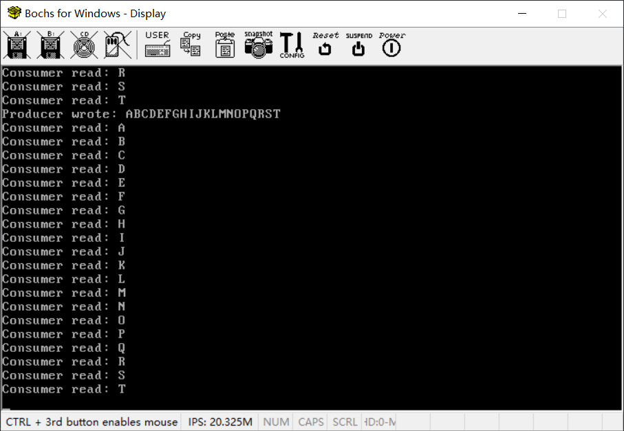

# （十二） 多任务同步机制及其应用


## 0. 调整

之前调整错了，再次调整，还是 kernel_memory.h 

```c
// 页表、位图结束的地方，就是内核堆内存开始的地方（物理位置）
// 由于不知道是不是页表位图后面还要放什么东西，干脆堆内存挪到0x00600000（6MB）开始
// 预留更多位置
#define KERNEL_PHYSICAL_ADDR_START 0x00600000
// 相应地，怕不太够用，不然连几个内核任务都开不了，所以内核保留物理内存扩大到16MB
// 16MB，有10MB的空余内存。一个内核任务的TCB要一页也就是4KB
// 1MB可以开 1024 / 4 = 256个内核任务，10MB足够开2560个了

// 用户堆内存开始的地方就是内核堆内存结束的地方（物理位置）
#define USER_PHYSICAL_ADDR_START 0x01000000
// 内核虚拟地址起点（1MB以下全部被内核使用了，无法再用做堆内存了）
#define KERNEL_VIRTUAL_ADDR_START 0xc0100000

```


## 1. 阻塞和解除阻塞

线程同步是怎么实现的？如果我们要求线程A和B按照先A后B的顺序执行，但是偏偏B又执行得比A快，怎么办？最简单的方法，让B停下来，等A执行完毕，再执行。这是一切多线程同步机制的基础。

HOS这个项目里面所说的任务，说白了就是一种内核线程，其同步机制的实现自然也要建立在这一基础上。

kernel_task.h

```c
// 阻塞当前调用的任务，并修改任务为指定状态（如果想不调度，就挂起、阻塞、等待）
void task_block(enum task_status stat);
// 将该任务状态修改为TASK_READY，并插入到调度队列最前，即解除阻塞并使其尽快进入工作状态
void task_unblock(struct task *task);

```

具体实现，kernel_task.c

```c
void task_schedule(void) {
    // 检查栈溢出
    if (current_task->stack_magic != 0x20000702) {
        // 处理栈溢出错误
        for(;;);
    }

    if (current_task->status == TASK_RUNNING) { // 若此线程只是cpu时间片到了,将其加入到就绪队列尾
        // 调度器我增加了这种特殊情况的特别处理
        if(list_empty(&ready_list)) {
            // 只有一个线程的特殊情况处理，只重置时间，减少开销
            // 重新将当前线程的ticks再重置为其priority;
            current_task->ticks = current_task->priority;
            // 其他的什么都不要变，直接return
            return;
        }
        list_add_tail(&current_task->general_tag, &ready_list);
        current_task->ticks = current_task->priority;     // 重新将当前线程的ticks再重置为其priority;
        current_task->status = TASK_READY;
    } else {
        // 我怕你没删除，所以我无论如何都要删除一遍
        // 总之你不是task_running，你就是其他的，那不准进入ready_list
        // 所以保证不得留在ready_list里面
        list_del(&current_task->general_tag);
    }

    if(list_empty(&ready_list)) {
        // 没任务，继续运行，不要切换
        return;
    } else {
        // 取第一个结点
        next_task = list_entry(ready_list.next, struct task, general_tag);
        next_task->status = TASK_RUNNING;

        // 因为切换之后会直接跳出中断处理程序，所以绝不能在这里切换，必须要在内核主循环切换
    }
}

// 阻塞当前调用的任务，并修改任务为指定状态（如果想不调度，就挂起、阻塞、等待）
void task_block(enum task_status stat) {
    // 关闭中断，保存先前状态
    enum intr_status old_status = intr_disable();
    // 获取现在正在进行的任务（可能更新不及时，注意）
    struct task *cur_task = current_task;
    // 修改状态
    cur_task->status = stat;
    // 调度新任务
    task_schedule();
    // 手动强行调度
    task_switch();
    // 任务阻塞解除才会调用这句重设状态语句
    intr_set_status(old_status);
}

void task_unblock(struct task *task) {
    // 惯例，关中断
    enum intr_status old_status = intr_disable();
    // 只要不是READY或者RUNNING（怕出意外），都重设为READY
    if (task->status != TASK_READY && task->status != TASK_RUNNING) {
        // 检查是否已经在ready_list中
        struct list_node *pos;
        list_for_each(pos, &ready_list) {
            if (pos == &task->general_tag) {
                put_str("Task already in ready_list\n");
                for(;;);
            }
        }

        // 我怕你没删除，所以我无论如何都要删除一遍
        list_del(&task->general_tag);
        // 插入任务到ready_list队头，尽快被调度
        list_add(&task->general_tag, &ready_list);
        task->status = TASK_READY;

    }
    // 操作完成重设状态（谁知道原来是不是也是关中断）
    intr_set_status(old_status);
}

```

通俗易懂地解释一下：

1. 阻塞一个任务的步骤：修改状态（为了让其不被调度器调度），强行切换到另一个任务；
2. 解除一个任务的阻塞的步骤：重设状态（为了让调度器能调度）。但是注意，解除阻塞不能直接切换到这个任务，应当让调度器调度。

这两个操作必须是原子操作，所以要用关闭中断，防止执行过程中被中断打断，当前任务被切换。


## 2. 最简单的同步工具——信号量

信号量是最简单的同步工具，常用的互斥锁、递归锁、读写锁就是建立在信号量的基础之上的。它的原理是P（减少）、V（增加）两个操作。具体原理我就不解释了，我放我的实现如下：

同样在kernel_task下，建立kernel_sync.h：

```c
//
// Created by huangcheng on 2024/6/3.
//

#ifndef HOS_KERNEL_SYNC_H
#define HOS_KERNEL_SYNC_H

#include "../../lib/lib_kernel/lib_kernel.h"

// 最基本的信号量结构
struct semaphore {
    uint32_t value;                 // 信号量的值
    struct list_node waiters;       // 等待队列，阻塞在此信号量上的任务
};

// 信号量初始化
void semaphore_init(struct semaphore *psema, uint32_t value);
// 信号量等待（P操作，减去1，获取控制权）
void semaphore_wait(struct semaphore *psema);
// 信号量增加（V操作，加上1，让出控制权）
void semaphore_signal(struct semaphore *psema);

#endif //HOS_KERNEL_SYNC_H

```

kernel_sync.c

```c
#include "kernel_sync.h"
#include "../kernel_interrupt/kernel_interrupt.h"
#include "kernel_task.h"

// 信号量等待者
struct semaphore_waiter {
    struct list_node tag;
    struct task *task;
};

// 初始化信号量
void semaphore_init(struct semaphore* psema, uint32_t value) {
    psema->value = value;
    init_list_node(&psema->waiters);
}

// 信号量的P操作（等待，信号量减1）
void semaphore_wait(struct semaphore *psema) {
    intr_disable(); // 关闭中断，防止上下文切换

    // 没有使用权，必须阻塞
    // 用循环的原因是害怕解锁之后还是没得到资源使用权（被抢走了）
    // 所以要再判断一次
    while (psema->value == 0) {
        struct task *current = running_task();
        // 将当前任务作为一个等待者，插入等待队列
        struct semaphore_waiter waiter;
        waiter.task = current;
        init_list_node(&waiter.tag);

        list_add_tail(&waiter.tag, &psema->waiters); // 添加到等待队列
        task_block(TASK_BLOCKED); // 阻塞当前任务

    }
    // 获取使用权
    psema->value--;
    // 开启中断（不开启中断的话，无法触发中断处理程序调度任务）
    intr_enable();
}


// 信号量的V操作（信号，信号量加1）
void semaphore_signal(struct semaphore* psema) {
    intr_disable(); // 关闭中断，防止上下文切换

    // 只要有
    if (!list_empty(&psema->waiters)) {
        // 解除第一个等待者的阻塞
        struct list_node *node = psema->waiters.next;
        struct semaphore_waiter *waiter = list_entry(node, struct semaphore_waiter, tag);
        list_del(node); // 从等待队列中删除

        // 结束阻塞，复活任务
        task_unblock(waiter->task);

    }

    // 释放使用权
    psema->value++;
    // 开启中断（不开启中断的话，无法触发中断处理程序调度任务）
    intr_enable();
}

```


## 3. 基于信号量实现的其他同步工具

kernel_sync.h

```c
// 互斥锁结构
struct mutex {
    struct semaphore sema;
};

// 互斥锁初始化
void mutex_init(struct mutex *pmutex);
// 互斥锁加锁
void mutex_lock(struct mutex *pmutex);
// 互斥锁解锁
void mutex_unlock(struct mutex *pmutex);


// 递归锁结构
struct recursive_mutex {
    struct semaphore sema;
    struct task *owner;
    uint32_t recursive_count;
};

// 递归锁初始化
void recursive_mutex_init(struct recursive_mutex *pmutex);
// 递归锁加锁
void recursive_mutex_lock(struct recursive_mutex *pmutex);
// 递归锁解锁
void recursive_mutex_unlock(struct recursive_mutex *pmutex);

// 读写锁结构
struct rwlock {
    struct semaphore read_lock;
    struct semaphore write_lock;
    int readers;
};

// 读写锁初始化
void rwlock_init(struct rwlock *rw);
// 请求读锁
void rwlock_acquire_read(struct rwlock *rw);
// 释放读锁
void rwlock_release_read(struct rwlock *rw);
// 请求写锁
void rwlock_acquire_write(struct rwlock *rw);
// 释放写锁
void rwlock_release_write(struct rwlock *rw);

```

kernel_sync.c

```c
// 互斥锁初始化
void mutex_init(struct mutex *pmutex) {
    semaphore_init(&pmutex->sema, 1);
}

// 互斥锁加锁
void mutex_lock(struct mutex *pmutex) {
    semaphore_wait(&pmutex->sema);
}

// 互斥锁解锁
void mutex_unlock(struct mutex *pmutex) {
    semaphore_signal(&pmutex->sema);
}

// 递归锁初始化
void recursive_mutex_init(struct recursive_mutex *pmutex) {
    semaphore_init(&pmutex->sema, 1);
    pmutex->owner = NULL;
    pmutex->recursive_count = 0;
}

// 递归锁加锁
void recursive_mutex_lock(struct recursive_mutex *pmutex) {
    struct task *current_task = running_task();
    if (pmutex->owner == current_task) {
        pmutex->recursive_count++;
    } else {
        semaphore_wait(&pmutex->sema);
        pmutex->owner = current_task;
        pmutex->recursive_count = 1;
    }
}

// 递归锁解锁
void recursive_mutex_unlock(struct recursive_mutex *pmutex) {
    if (pmutex->owner == running_task()) {
        if (--pmutex->recursive_count == 0) {
            pmutex->owner = NULL;
            semaphore_signal(&pmutex->sema);
        }
    }
}

// 读写锁初始化
void rwlock_init(struct rwlock *rw) {
    semaphore_init(&rw->read_lock, 1);
    semaphore_init(&rw->write_lock, 1);
    rw->readers = 0;
}

// 请求读锁
void rwlock_acquire_read(struct rwlock *rw) {
    semaphore_wait(&rw->read_lock);
    rw->readers++;
    if (rw->readers == 1) {
        semaphore_wait(&rw->write_lock);
    }
    semaphore_signal(&rw->read_lock);
}

// 释放读锁
void rwlock_release_read(struct rwlock *rw) {
    semaphore_wait(&rw->read_lock);
    rw->readers--;
    if (rw->readers == 0) {
        semaphore_signal(&rw->write_lock);
    }
    semaphore_signal(&rw->read_lock);
}

// 请求写锁
void rwlock_acquire_write(struct rwlock *rw) {
    semaphore_wait(&rw->write_lock);
}

// 释放写锁
void rwlock_release_write(struct rwlock *rw) {
    semaphore_signal(&rw->write_lock);
}

```


## 4. 具体应用

### 4.1 虚拟终端

虚拟终端的意义纯粹就是为了控制同时只有一个线程能在屏幕上输出，不然容易出现多线程同时读写显存的问题，开发过程中我碰到大概四次直接把显存写花了的情况。

按照《操作系统真象还原》的做法，虚拟终端是被抽象成一种设备。这里采用作者的做法。

在devices文件夹下面建立console文件夹，然后console文件夹下面建立console.h、console.c、Makefile。

console.h

```c
//
// Created by huangcheng on 2024/6/3.
//

#ifndef HOS_CONSOLE_H
#define HOS_CONSOLE_H

// 这是个虚拟设备
// 不是实际存在的设备，只是为了保证同步抽象出来的

// 终端打印字符串
void console_put_str(const char* str);

// 终端打印字符
void console_put_char(char char_asci);

// 终端打印16进制整数
void console_put_int(int num);


#endif //HOS_CONSOLE_H

```

console.c

```c
//
// Created by huangcheng on 2024/6/3.
//

#include "console.h"
#include "../../lib/lib_kernel/lib_kernel.h"
#include "../../kernel/kernel_task/kernel_sync.h"
#include "../../kernel/kernel_device/kernel_device.h"

// 作用域限制在终端范围内，其他地方不得使用，所以加上static
// 终端锁是用递归锁，因为一个线程可能要多次打印，多次获取同一个锁
static struct recursive_mutex console_lock;

// 初始化唯一终端（控制台）
void console_init() {
    recursive_mutex_init(&console_lock);
}

// 获取终端，进入临界区
void console_acquire() {
    recursive_mutex_lock(&console_lock);
}

// 释放终端，退出临界区
void console_release() {
    recursive_mutex_unlock(&console_lock);
}

// 终端打印字符串
void console_put_str(const char* str) {
    console_acquire();
    put_str(str);
    console_release();
}

// 终端打印字符
void console_put_char(char char_asci) {
    console_acquire();
    put_char(char_asci);
    console_release();
}

// 终端打印16进制整数
void console_put_int(int num) {
    console_acquire();
    put_int(num);
    console_release();
}

// 既然作为设备（哪怕是虚拟的），自然要接受设备管理模块的统一管理
// 注册宏，定义一个驱动结构体，把驱动结构体实例放到驱动段
REGISTER_DRIVER(console_driver){
        .driver_name = "console",
        .init = console_init,
        .exit = NULL,
        .irq = -1,
        .irq_interrupt_handler = NULL,
        .read = NULL,
        .write = NULL,
};

```

console下的Makefile

```makefile

# 目录
DEVICE_DIR = ..
CONSOLE_DIR = .

# 源文件
CONSOLE_C_SRC = $(CONSOLE_DIR)/console.c

# C 编译标志
CFLAGS = -ffreestanding -nostdlib -Wall -Wextra

# 标签标记所有的任务（输出什么文件），方便修改
DEVICE_OBJS = $(DEVICE_DIR)/console.o

.PHONY: all

all: $(DEVICE_OBJS)

# C 文件生成 汇编文件，再汇编生成.o，为什么这么做之前说过了，这个gcc的汇编器不知道什么问题
# 编出来放到模块文件夹devices去，别放在这里，方便主Makefile找
$(DEVICE_DIR)/console.o: $(CONSOLE_C_SRC)
	$(GCC) $(CFLAGS) -S -o $(CONSOLE_DIR)/console.asm $<
	$(AS) -o $@ $(CONSOLE_DIR)/console.asm
	del $(CONSOLE_DIR)\\console.asm

# 文件不生成于此，无需清理规则

```

devices文件夹下的Makefile

```makefile

# 所有设备目录
DEVICE_DIR = .
PIT8253_DIR = pit8253
CONSOLE_DIR = console

# 标签标记所有的任务（输出什么文件），方便修改
DEVICE_OBJS = pit8253.o console.o

.PHONY: all

all: $(DEVICE_OBJS)

# 执行各子模块编译
pit8253.o:
	$(MAKE) -C $(PIT8253_DIR) GCC=$(GCC) AS=$(AS)

console.o:
	$(MAKE) -C $(CONSOLE_DIR) GCC=$(GCC) AS=$(AS)

# 清理规则
clean:
	@if exist $(DEVICE_DIR)\\*.o del $(DEVICE_DIR)\\*.o
	@if exist $(DEVICE_DIR)\\*.bin del $(DEVICE_DIR)\\*.bin

```

在线程中打印，就可以直接用console_put系列的函数就可以了，初始化不用我们做，设备驱动管理模块已经自动做好了。


### 4.2 内核缓冲区

缓冲区的概念我就不多说了，就是一块暂存数据的内存区域。

我这个内核缓冲区是一个 **线程安全** 的 **环形数组** 的实现，基于生产者-消费者模型。同时间只能有一个生产者、一个消费者，生产者写数据的时候，消费者不能读，消费者读数据的时候，生产者不能写，如此保证线程安全。

在《操作系统真象还原》中，这东西叫做ioqueue，我个人感觉作者写得太乱了，不想用，就另起炉灶写了一个。

这里吐槽一下，我不理解为什么作者把缓冲区这种明显是内核自有的组件放到设备里面。

在kernel文件夹里面建立一个文件夹kernel_buffer，在里面建立kernel_buffer.h、kernel_buffer.c、Makefile。

kernel_buffer.h

```c
//
// Created by huangcheng on 2024/6/4.
//

#ifndef HOS_KERNEL_BUFFER_H
#define HOS_KERNEL_BUFFER_H

#include "../../lib/lib_kernel/lib_kernel.h"
#include "../kernel_task/kernel_sync.h"

// 这是一个基于生产者-消费者模型的 内核级 线程安全 环形 缓冲区的实现
// 生产者写入数据的时候，消费者被阻塞
// 消费者读数据的时候，生产者被阻塞
// 内核缓冲区的结构体
struct kernel_buffer {
    uint8_t *data;                // 实际的数据存储
    uint32_t size;             // 缓冲区大小
    uint32_t read_pos;         // 读位置
    uint32_t write_pos;        // 写位置

    struct mutex mutex;        // 互斥锁，保护缓冲区访问
    struct semaphore writable; // 可写信号量，表示空闲空间数量
    struct semaphore readable; // 可读信号量，表示已填充数据数量
};

// 获取一个初始化好的内核缓冲区
struct kernel_buffer* kernel_buffer_create(void);
// 回收缓冲区
void kernel_buffer_free(struct kernel_buffer *k_buf);
// 将data的数据写size个字节到内核缓冲区，size不得大于4000，建议在2048以内（由生产者调用，写时消费者被阻塞）
void kernel_buffer_write(struct kernel_buffer *k_buf, char *data, uint32_t size);
// 从内核缓冲区读取数据，读size个字节到data，size不得大于4000，建议在2048以内（由消费者调用，读时生产者被阻塞）
void kernel_buffer_read(struct kernel_buffer *k_buf, char *data, uint32_t size);


#endif //HOS_KERNEL_BUFFER_H

```

kernel_buffer.c

```c
//
// Created by huangcheng on 2024/6/4.
//

#include "kernel_buffer.h"
#include "../kernel_memory/kernel_memory.h"

#define PAGE_SIZE 0x1000

struct kernel_buffer* kernel_buffer_create(void) {
    // 申请一整页4KB内存，起始地址放缓冲区控制信息，剩下的都作为数据区使用
    void *page_addr = malloc_page(KERNEL_FLAG,1);
    if (page_addr == NULL) {
        return NULL; // 分配失败，返回NULL
    }

    struct kernel_buffer *k_buf = (struct kernel_buffer *)page_addr;
    k_buf->data = ((uint8_t *)page_addr + sizeof(struct kernel_buffer));
    k_buf->read_pos = 0;
    k_buf->write_pos = 0;
    k_buf->size = PAGE_SIZE - sizeof(struct kernel_buffer);
    mutex_init(&k_buf->mutex);
    semaphore_init(&k_buf->writable, k_buf->size);      // 初始空闲空间为缓冲区大小
    semaphore_init(&k_buf->readable, 0);        // 初始已填充数据为0

    return k_buf;
}

void kernel_buffer_free(struct kernel_buffer *k_buf) {
    // 用位运算方式取低12位，如果低12位全部是0，那么就是有效的，可以回收
    // NULL的情况，free_page里面有判断，不用再判断了
    if(((uint32_t)k_buf & 0xFFF) == 0) {
        free_page(KERNEL_FLAG,(void *)k_buf, 1);
    }
}

// 写入缓冲区
void kernel_buffer_write(struct kernel_buffer *k_buf, char *data, uint32_t size) {
    if (size > k_buf->size) {
        // 边界检查，一次性写不能超过缓冲区大小
        return;
    }
    for (uint32_t i = 0; i < size; i++) {
        semaphore_wait(&k_buf->writable);   // 等待可写空间
        mutex_lock(&k_buf->mutex);          // 锁定缓冲区

        k_buf->data[k_buf->write_pos] = data[i];
        k_buf->write_pos = (k_buf->write_pos + 1) % k_buf->size;

        mutex_unlock(&k_buf->mutex);        // 解锁缓冲区
        semaphore_signal(&k_buf->readable); // 通知有新数据可读
    }
}

// 读取缓冲区
void kernel_buffer_read(struct kernel_buffer *k_buf, char *data, uint32_t size) {
    if (size > k_buf->size) {
        // 边界检查，一次性读不能超过缓冲区大小
        return;
    }
    for (uint32_t i = 0; i < size; i++) {
        semaphore_wait(&k_buf->readable);   // 等待可读数据
        mutex_lock(&k_buf->mutex);          // 锁定缓冲区

        data[i] = k_buf->data[k_buf->read_pos];
        k_buf->read_pos = (k_buf->read_pos + 1) % k_buf->size;

        mutex_unlock(&k_buf->mutex);        // 解锁缓冲区
        semaphore_signal(&k_buf->writable); // 通知有可写空间
    }
}

```

我这个缓冲区是直接调用内存管理模块，直接分配一页（4KB）内存，来作为缓冲区，未来看情况可能会增加页数选项，但是估计是以页为单位的，开头写控制信息，写完了控制信息就全是缓冲区的可用区域。

kernel_buffer里的Makefile

```makefile

# 目录
KERNEL_DIR = ..
KERNEL_BUFFER_DIR = .

# 源文件
KERNEL_BUFFER_C_SRC = $(KERNEL_BUFFER_DIR)/kernel_buffer.c

# C 编译标志
CFLAGS = -ffreestanding -nostdlib -Wall -Wextra

# 标签标记所有的任务（输出什么文件），方便修改
KERNEL_OBJS = $(KERNEL_DIR)/kernel_buffer.o

.PHONY: all

all: $(KERNEL_OBJS)

# C 文件生成 汇编文件，再汇编生成.o，为什么这么做之前说过了，这个gcc的汇编器不知道什么问题
# 编出来放到模块文件夹kernel去，别放在这里，方便主Makefile找
$(KERNEL_DIR)/kernel_buffer.o: $(KERNEL_BUFFER_C_SRC)
	$(GCC) $(CFLAGS) -S -o $(KERNEL_BUFFER_DIR)/kernel_buffer.asm $<
	$(AS) -o $@ $(KERNEL_BUFFER_DIR)/kernel_buffer.asm
	del $(KERNEL_BUFFER_DIR)\\kernel_buffer.asm

# 文件不生成于此，无需清理规则

```

kernel文件夹里面的Makefile，增加kernel_buffer组件

```makefile

# 目录
KERNEL_DIR = .

# 所有组件目录
PAGE_DIR = kernel_page
GDT_DIR = kernel_gdt
IDT_DIR = kernel_idt
DEVICE_DIR = kernel_device
INTERRUPT_DIR = kernel_interrupt
INTERRUPT_HANDLER_DIR = interrupt_handler
MEMORY_DIR = kernel_memory
TASK_DIR = kernel_task
BUFFER_DIR = kernel_buffer

# 源文件
KERNEL_C_SRC = $(KERNEL_DIR)/kernel.c

# 汇编标志
ASM_FLAGS = -f elf32

# C 编译标志
CFLAGS = -ffreestanding -nostdlib -Wall -Wextra

# 标签标记所有的任务（输出什么文件），方便修改
KERNEL_OBJS = $(KERNEL_DIR)/kernel.o \
				$(KERNEL_DIR)/kernel_page.o \
				$(KERNEL_DIR)/kernel_gdt.o \
				$(KERNEL_DIR)/kernel_idt.o \
				$(KERNEL_DIR)/kernel_device.o \
				$(KERNEL_DIR)/kernel_interrupt.o \
				$(KERNEL_DIR)/interrupt_handler.o \
				$(KERNEL_DIR)/kernel_memory.o \
				$(KERNEL_DIR)/kernel_task.o \
				$(KERNEL_DIR)/kernel_buffer.o

.PHONY: all

all: $(KERNEL_OBJS)

# 执行各子模块编译
$(KERNEL_DIR)/kernel_page.o:
	$(MAKE) -C $(PAGE_DIR) GCC=$(GCC) AS=$(AS)

$(KERNEL_DIR)/kernel_gdt.o:
	$(MAKE) -C $(GDT_DIR) GCC=$(GCC) AS=$(AS)

$(KERNEL_DIR)/kernel_idt.o:
	$(MAKE) -C $(IDT_DIR) GCC=$(GCC) AS=$(AS)

$(KERNEL_DIR)/kernel_device.o:
	$(MAKE) -C $(DEVICE_DIR) GCC=$(GCC) AS=$(AS)

$(KERNEL_DIR)/kernel_interrupt.o:
	$(MAKE) -C $(INTERRUPT_DIR) GCC=$(GCC) AS=$(AS)

$(KERNEL_DIR)/interrupt_handler.o:
	$(MAKE) -C $(INTERRUPT_HANDLER_DIR) NASM=$(NASM)

$(KERNEL_DIR)/kernel_memory.o:
	$(MAKE) -C $(MEMORY_DIR) GCC=$(GCC) AS=$(AS)

$(KERNEL_DIR)/kernel_task.o:
	$(MAKE) -C $(TASK_DIR) GCC=$(GCC) AS=$(AS) NASM=$(NASM)

$(KERNEL_DIR)/kernel_buffer.o:
	$(MAKE) -C $(BUFFER_DIR) GCC=$(GCC) AS=$(AS)


# C 文件生成 汇编文件，再汇编生成.o，为什么这么做之前说过了，这个gcc的汇编器不知道什么问题
$(KERNEL_DIR)/kernel.o: $(KERNEL_C_SRC)
	$(GCC) $(CFLAGS) -S -o $(KERNEL_DIR)/kernel.asm $<
	$(AS) -o $@ $(KERNEL_DIR)/kernel.asm
	del $(KERNEL_DIR)\\kernel.asm

# 清理规则
clean:
	@if exist $(KERNEL_DIR)\\*.o del $(KERNEL_DIR)\\*.o
	@if exist $(KERNEL_DIR)\\*.bin del $(KERNEL_DIR)\\*.bin

```

编译烧写运行即可。

测试效果的话我这里可以提供两个函数，创建线程来看看效果。

kernel.c

```c
#include "../lib/lib_kernel/lib_kernel.h"
#include "kernel_page/kernel_page.h"
#include "kernel_gdt/kernel_gdt.h"
#include "kernel_idt/kernel_idt.h"
#include "kernel_device/kernel_device.h"
#include "kernel_memory/kernel_memory.h"
#include "kernel_task/kernel_task.h"
#include "../devices/console/console.h"
#include "kernel_buffer//kernel_buffer.h"

// 生产者线程
void producer_task(void* arg);
// 消费者线程
void consumer_task(void* arg);

void kernel_main(void) {

    uint32_t total_physical_memory = *((uint32_t *)(0xa09));
    // 内存分页初始化
    init_paging();
    // 重新加载gdt
    setup_gdt();
    // 调整ESP，将栈指针切换到高地址（栈大小增加到0x1500）
    switch_esp_virtual_addr();
    // 初始化idt
    init_idt();
    // 初始化内存管理
    init_memory(total_physical_memory);
    // 初始化所有设备
    init_all_devices();
    // 初始化线程相关结构
    init_multitasking();
    

    struct kernel_buffer *buffer = kernel_buffer_create();
    task_create("producer_task", 8, producer_task, buffer);
    task_create("consumer_task", 8, consumer_task, buffer);

    // 允许PIC_IRQ0中断，才可以让定时器调度线程
    enable_interrupt(0);

    // 开启全局中断
    intr_enable();

    // 进入内核主循环或其它初始化代码
    for(;;) {

    }
    // 退出主循环卸载设备驱动
    exit_all_devices();
}

void producer_task(void *arg) {
    struct kernel_buffer *k_buf = (struct kernel_buffer *)arg;
    char data[21] = { 0 } ; // 初始数据
    for(;;) {
        for (int i = 0; i < 20; i++) { // 生产20个数据
            data[i] = 'A' + i;
        }
        console_put_str("Producer wrote: ");
        console_put_str(data);
        console_put_char('\n');

        kernel_buffer_write(k_buf, data, 20);
        // 生产者不写了，消费者才能读，所以稍微停顿一下
        for(int i = 0; i < 16 * UINT16_MAX; i++);
    }

}

void consumer_task(void *arg) {
    struct kernel_buffer *k_buf = (struct kernel_buffer *)arg;
    char data;
    for(;;) {
        for (int i = 0; i < 20; i++) { // 消费20个数据
            kernel_buffer_read(k_buf, &data, 1);
            console_put_str("Consumer read: ");
            console_put_char(data);
            console_put_char('\n');
        }
    }
}

```

可以看到效果相当不错，完全符合我们的设想。




这里吐槽一下《操作系统真象还原》的作者写的缓冲区：

```c
#ifndef __DEVICE_IOQUEUE_H
#define __DEVICE_IOQUEUE_H
#include "stdint.h"
#include "thread.h"
#include "sync.h"

#define bufsize 64

/* 环形队列 */
struct ioqueue {
// 生产者消费者问题
    struct lock lock;
 /* 生产者,缓冲区不满时就继续往里面放数据,
  * 否则就睡眠,此项记录哪个生产者在此缓冲区上睡眠。*/
    struct task_struct* producer;

 /* 消费者,缓冲区不空时就继续从往里面拿数据,
  * 否则就睡眠,此项记录哪个消费者在此缓冲区上睡眠。*/
    struct task_struct* consumer;
    char buf[bufsize];			    // 缓冲区大小
    int32_t head;			    // 队首,数据往队首处写入
    int32_t tail;			    // 队尾,数据从队尾处读出
};

void ioqueue_init(struct ioqueue* ioq);
bool ioq_full(struct ioqueue* ioq);
bool ioq_empty(struct ioqueue* ioq);
char ioq_getchar(struct ioqueue* ioq);
void ioq_putchar(struct ioqueue* ioq, char byte);
#endif

```

说实话，我不太理解为什么作者会把缓冲区大小写死到64个字节，64个字节太小了，对很多设备来说完全不够用。这也是为什么我另起炉灶的原因之一。


### 4.3 设备驱动管理模块

之前已经实现了设备驱动管理，这里只是给每个设备加上缓冲区，以后就通过缓冲区与设备进行数据交互即可。

但是要考虑到，设备可能不需要缓冲区呢？比如计时器 `PIT 8253`，它要缓冲区干什么？

所以，让设备驱动决定自己要不要缓冲区，加一个判断标志就可以了。

kernel_device.h

```c
//
// Created by huangcheng on 2024/5/27.
//

#ifndef HOS_KERNEL_DEVICE_H
#define HOS_KERNEL_DEVICE_H

#include "../../lib/lib_kernel/lib_kernel.h"
#include "../kernel_buffer/kernel_buffer.h"

// 统一的驱动接口结构体（这个结构体的实例一律放在驱动段）
struct driver {
    char driver_name[64];                       // 驱动名称
    void (*init)(void);                         // 初始化函数
    void (*exit)(void);                         // 退出函数
    int32_t irq;                                // IRQ 中断号（如果没有中断处理函数填-1）
    void (*irq_interrupt_handler)(void);            // 中断处理函数（可选）
    uint8_t need_kernel_buffer;                 // 需要分配内核缓冲区就填1，不然填0
    struct kernel_buffer *buffer;               // 指向内核缓冲区的指针
    struct list_node node;                      // 用于串联到驱动链表上的链表结点
};

// 初始化所有设备
void init_all_devices();
// 移除所有设备
void exit_all_devices();
// 添加单个驱动并初始化
void driver_add(struct driver* drv);
// 移除单个驱动并卸载
void driver_remove(const char *driver_name);
// 获取设备驱动
struct driver* get_driver(const char *driver_name);
// 对设备（驱动）读，本质上就是读其缓冲区（成功返回读出数量（以字节计算），不成功返回-1）
int32_t device_read(struct driver *drv, char *data, uint32_t count);
// 对设备（驱动）写，本质上就是写其缓冲区（成功返回写入数量（以字节计算），不成功返回-1）
int32_t device_write(struct driver *drv, char *data, uint32_t count);

// 这个注册宏的作用就是把数据放在驱动段（而且告诉编译器这个是被使用的，不能优化掉），它会定义一个驱动结构体实例
#define REGISTER_DRIVER(drv) \
    __attribute__((section(".drivers"), used)) struct driver drv =


#endif //HOS_KERNEL_DEVICE_H

```


kernel_device.c

```c
//
// Created by huangcheng on 2024/5/27.
//

#include "kernel_device.h"
#include "../kernel_interrupt/kernel_interrupt.h"

// 驱动链表头结点
struct list_node driver_list_head;

// 驱动段的起点和终点
extern struct driver __drivers_start[];
extern struct driver __drivers_end[];

// 中断处理逻辑数组
extern void (*interrupt_handler_functions[256])(void);

void init_all_devices() {
    // 初始化驱动链表头结点
    init_list_node(&driver_list_head);
    // 链接到驱动链表
    struct driver* drv;
    for (drv = __drivers_start; drv < __drivers_end; drv++) {
        driver_add(drv);
    }
}

void exit_all_devices() {
    // 禁用中断
    intr_disable();
    // 遍历驱动链表，执行每个驱动的退出函数
    struct list_node *pos, *n;
    list_for_each_safe(pos, n, &driver_list_head) {
        struct driver *drv = list_entry(pos, struct driver, node);
        if (drv->exit != NULL) {
            drv->exit();
        }

        // 需要内核缓冲区，而且已经被分配了缓冲区的情况
        if (drv->need_kernel_buffer && drv->buffer) {
            // 回收缓冲区
            kernel_buffer_free(drv->buffer);
            // 清空指针
            drv->buffer = NULL;
        }

        // 如果中断号在有效范围内且匹配当前驱动的中断处理程序
        if (drv->irq >= 0 && drv->irq < 16 && interrupt_handler_functions[drv->irq + 0x20] == drv->irq_interrupt_handler) {
            interrupt_handler_functions[drv->irq + 0x20] = NULL;
        }

        // 从链表中移除该驱动
        list_del(pos);
    }
    // 启用中断
    intr_enable();
    // 初始化头结点
    init_list_node(&driver_list_head);
}

void driver_add(struct driver* drv) {
    if (drv == NULL) {
        return;
    }

    // 检查是否重复注册
    struct list_node *pos;
    list_for_each(pos, &driver_list_head) {
        if (strcmp(list_entry(pos, struct driver, node)->driver_name, drv->driver_name) == 0) {
            return;
        }
    }
    // 怕触发中断，所以先关闭中断
    intr_disable();

    if (drv->need_kernel_buffer) {
        // 需要内核缓冲区
        if(drv->buffer) {
            // 为什么你会有内核缓冲区？？无法处理直接return。
            // 重新开启中断
            intr_enable();
            return;
        }
        // 分配一个内核缓冲区
        drv->buffer = kernel_buffer_create();
    }

    // 如果要求注册中断处理函数，必须检查中断号范围
    if (drv->irq >= 0 && drv->irq < 16) {
        // 检查对应位置是否已被占用
        if (interrupt_handler_functions[drv->irq + 0x20] != NULL) {
            // 如果已经分配了缓冲区必须回滚
            if(drv->need_kernel_buffer && drv->buffer) {
                kernel_buffer_free(drv->buffer);
                // 清空指针
                drv->buffer = NULL;
            }
            // 重新开启中断
            intr_enable();
            // 中断处理程序冲突，不得挂载驱动，因而直接return
            return;
        } else {
            interrupt_handler_functions[drv->irq + 0x20] = drv->irq_interrupt_handler;
        }
    } else if (drv->irq_interrupt_handler != NULL) {
        // 如果已经分配了缓冲区必须回滚
        if(drv->need_kernel_buffer && drv->buffer) {
            kernel_buffer_free(drv->buffer);
            // 清空指针
            drv->buffer = NULL;
        }
        // 重新开启中断
        intr_enable();
        // IRQ 不在范围内但要求注册中断处理函数，不得挂载驱动，因而直接return
        return;
    }

    // 执行初始化函数
    if (drv->init != NULL) {
        drv->init();
    }

    // 现在不怕触发中断了就可以打开中断
    intr_enable();

    // 将驱动添加到驱动链表
    list_add_tail(&drv->node, &driver_list_head);
}

void driver_remove(const char *driver_name) {
    struct list_node *pos, *n;
    list_for_each_safe(pos, n, &driver_list_head) {
        struct driver *drv = list_entry(pos, struct driver, node);
        if (strcmp(drv->driver_name, driver_name) == 0) {
            // 首先禁止中断，怕又触发中断
            intr_disable();

            // 执行退出函数
            if (drv->exit != NULL) {
                drv->exit();
            }

            // 需要内核缓冲区，而且已经被分配了缓冲区的情况
            if (drv->need_kernel_buffer && drv->buffer) {
                // 回收缓冲区
                kernel_buffer_free(drv->buffer);
                // 清空指针
                drv->buffer = NULL;
            }

            // 检查是否需要清除中断处理逻辑
            if (drv->irq >= 0 && drv->irq < 16 && interrupt_handler_functions[drv->irq + 0x20] == drv->irq_interrupt_handler) {
                interrupt_handler_functions[drv->irq + 0x20] = NULL;
            }

            // 清除干净，允许中断
            intr_enable();

            // 从链表中移除该驱动
            list_del(pos);
            return;
        }
    }
}

// 获取设备驱动
struct driver* get_driver(const char *driver_name) {
    if(strlen(driver_name) > 63) {
        // 名字太长存不下，肯定找不到
        return NULL;
    }
    struct list_node *pos;
    list_for_each(pos, &driver_list_head) {
        if (strcmp(list_entry(pos, struct driver, node)->driver_name, driver_name) == 0) {
            // 找到驱动结构体实例，返回其指针
            return list_entry(pos, struct driver, node);
        }
    }
    // 找不到那就只能null了
    return NULL;
}
// 对设备（驱动）读，本质上就是读其缓冲区（成功返回读出数量（以字节计算），不成功返回-1）
int32_t device_read(struct driver *drv, char *data, uint32_t count) {
    if(!drv || !(drv->buffer)) {
        return -1;
    }
    kernel_buffer_read(drv->buffer, data, count);
    return count;
}
// 对设备（驱动）写，本质上就是写其缓冲区（成功返回写入数量（以字节计算），不成功返回-1）
int32_t device_write(struct driver *drv, char *data, uint32_t count) {
    if(!drv || !(drv->buffer)) {
        return -1;
    }
    kernel_buffer_write(drv->buffer, data, count);
    return count;
}

```


相应的，已有的两个驱动修改如下：

pit8253.c

```c
// 注册宏，定义一个驱动结构体，把驱动结构体实例放到驱动段
REGISTER_DRIVER(pit8253_driver){
    .driver_name = "pit8253",
    .init = init_pit8253,
    .exit = exit_pit8253,
    .irq = 0,
    .irq_interrupt_handler = interrupt_handler_pit8253,
    .need_kernel_buffer = 0,    // 明确不需要缓冲区，其实不写也行，初始值就是0
};

```

console.c

```c
// 注册宏，定义一个驱动结构体，把驱动结构体实例放到驱动段
REGISTER_DRIVER(console_driver){
        .driver_name = "console",
        .init = console_init,
        .exit = NULL,
        .irq = -1,
        .irq_interrupt_handler = NULL,
        .need_kernel_buffer = 0    // 明确不需要缓冲区，其实不写也行，初始值就是0
};

```

关于终端这个虚拟设备，其实它用缓冲区也可以，但是它本身就只是一个抽象的为了保证线程安全的虚拟设备，再用缓冲区的话有点画蛇添足了，缓冲区本身是要保证线程安全的，这就有点多余了。