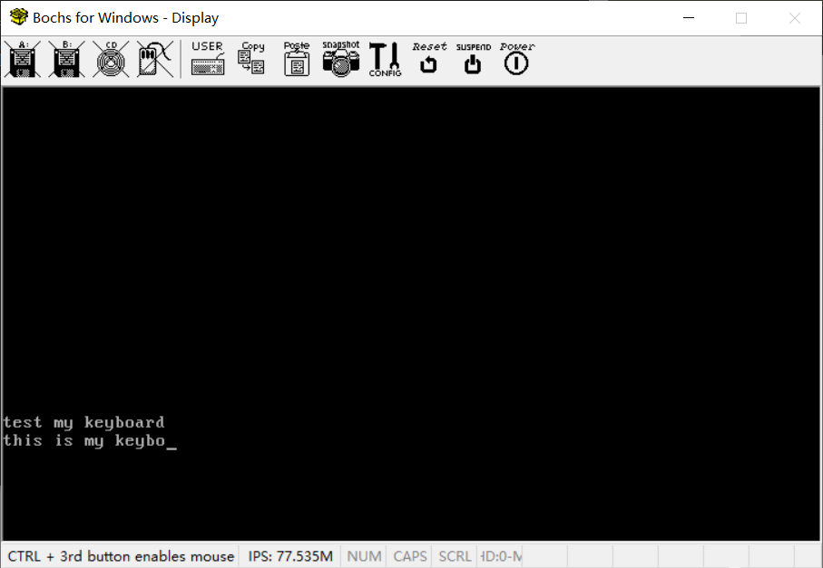

# （十二：补充）键盘驱动实现


在用内核缓冲区作为与设备之间数据交互的渠道之后，可以实现一个最简单的键盘驱动了。

我这里直接抄了《操作系统真象还原》里面的键盘驱动代码，改了原有的写缓冲区操作，直接就可以用了。

在devices文件夹下建立keyboard文件夹，建立keyboard.h、keyboard.c、Makefile

keyboard.h

```c
//
// Created by huangcheng on 2024/6/4.
//

#ifndef HOS_KEYBOARD_H
#define HOS_KEYBOARD_H

void keyboard_init();

#endif //HOS_KEYBOARD_H

```


keyboard.c

```c
//
// Created by huangcheng on 2024/6/4.
//

#include "keyboard.h"
#include "../../kernel/kernel_buffer/kernel_buffer.h"
#include "../../kernel/kernel_device/kernel_device.h"

// 它非要用bool，那我就搞一个枚举bool
typedef enum {
    false,
    true
}bool;

#define KBD_BUF_PORT 0x60	 // 键盘buffer寄存器端口号为0x60

/* 用转义字符定义部分控制字符 */
#define esc		'\033'	 // 八进制表示字符,也可以用十六进制'\x1b'
#define backspace	'\b'
#define tab		'\t'
#define enter		'\r'
#define delete		'\177'	 // 八进制表示字符,十六进制为'\x7f'

/* 以上不可见字符一律定义为0 */
#define char_invisible	0
#define ctrl_l_char	char_invisible
#define ctrl_r_char	char_invisible
#define shift_l_char	char_invisible
#define shift_r_char	char_invisible
#define alt_l_char	char_invisible
#define alt_r_char	char_invisible
#define caps_lock_char	char_invisible

/* 定义控制字符的通码和断码 */
#define shift_l_make	0x2a
#define shift_r_make 	0x36
#define alt_l_make   	0x38
#define alt_r_make   	0xe038
#define alt_r_break   	0xe0b8
#define ctrl_l_make  	0x1d
#define ctrl_r_make  	0xe01d
#define ctrl_r_break 	0xe09d
#define caps_lock_make 	0x3a

//struct ioqueue kbd_buf;	   // 定义键盘缓冲区

/* 定义以下变量记录相应键是否按下的状态,
 * ext_scancode用于记录makecode是否以0xe0开头 */
static bool ctrl_status, shift_status, alt_status, caps_lock_status, ext_scancode;

/* 以通码make_code为索引的二维数组 */
static char keymap[][2] = {
/* 扫描码   未与shift组合  与shift组合*/
/* ---------------------------------- */
/* 0x00 */	{0,	0},
/* 0x01 */	{esc,	esc},
/* 0x02 */	{'1',	'!'},
/* 0x03 */	{'2',	'@'},
/* 0x04 */	{'3',	'#'},
/* 0x05 */	{'4',	'$'},
/* 0x06 */	{'5',	'%'},
/* 0x07 */	{'6',	'^'},
/* 0x08 */	{'7',	'&'},
/* 0x09 */	{'8',	'*'},
/* 0x0A */	{'9',	'('},
/* 0x0B */	{'0',	')'},
/* 0x0C */	{'-',	'_'},
/* 0x0D */	{'=',	'+'},
/* 0x0E */	{backspace, backspace},
/* 0x0F */	{tab,	tab},
/* 0x10 */	{'q',	'Q'},
/* 0x11 */	{'w',	'W'},
/* 0x12 */	{'e',	'E'},
/* 0x13 */	{'r',	'R'},
/* 0x14 */	{'t',	'T'},
/* 0x15 */	{'y',	'Y'},
/* 0x16 */	{'u',	'U'},
/* 0x17 */	{'i',	'I'},
/* 0x18 */	{'o',	'O'},
/* 0x19 */	{'p',	'P'},
/* 0x1A */	{'[',	'{'},
/* 0x1B */	{']',	'}'},
/* 0x1C */	{enter,  enter},
/* 0x1D */	{ctrl_l_char, ctrl_l_char},
/* 0x1E */	{'a',	'A'},
/* 0x1F */	{'s',	'S'},
/* 0x20 */	{'d',	'D'},
/* 0x21 */	{'f',	'F'},
/* 0x22 */	{'g',	'G'},
/* 0x23 */	{'h',	'H'},
/* 0x24 */	{'j',	'J'},
/* 0x25 */	{'k',	'K'},
/* 0x26 */	{'l',	'L'},
/* 0x27 */	{';',	':'},
/* 0x28 */	{'\'',	'"'},
/* 0x29 */	{'`',	'~'},
/* 0x2A */	{shift_l_char, shift_l_char},
/* 0x2B */	{'\\',	'|'},
/* 0x2C */	{'z',	'Z'},
/* 0x2D */	{'x',	'X'},
/* 0x2E */	{'c',	'C'},
/* 0x2F */	{'v',	'V'},
/* 0x30 */	{'b',	'B'},
/* 0x31 */	{'n',	'N'},
/* 0x32 */	{'m',	'M'},
/* 0x33 */	{',',	'<'},
/* 0x34 */	{'.',	'>'},
/* 0x35 */	{'/',	'?'},
/* 0x36	*/	{shift_r_char, shift_r_char},
/* 0x37 */	{'*',	'*'},
/* 0x38 */	{alt_l_char, alt_l_char},
/* 0x39 */	{' ',	' '},
/* 0x3A */	{caps_lock_char, caps_lock_char}
/*其它按键暂不处理*/
};

// 键盘缓冲区
struct kernel_buffer* keyboard_buffer;

/* 键盘中断处理程序 */
static void interrupt_keyboard_handler(void) {

/* 这次中断发生前的上一次中断,以下任意三个键是否有按下 */
    bool ctrl_down_last = ctrl_status;
    bool shift_down_last = shift_status;
    bool caps_lock_last = caps_lock_status;

    bool break_code;
    uint16_t scancode = inb(KBD_BUF_PORT);

/* 若扫描码是e0开头的,表示此键的按下将产生多个扫描码,
 * 所以马上结束此次中断处理函数,等待下一个扫描码进来*/
    if (scancode == 0xe0) {
        ext_scancode = true;    // 打开e0标记
        return;
    }

/* 如果上次是以0xe0开头,将扫描码合并 */
    if (ext_scancode) {
        scancode = ((0xe000) | scancode);
        ext_scancode = false;   // 关闭e0标记
    }

    break_code = ((scancode & 0x0080) != 0);   // 获取break_code

    if (break_code) {   // 若是断码break_code(按键弹起时产生的扫描码)

        /* 由于ctrl_r 和alt_r的make_code和break_code都是两字节,
        所以可用下面的方法取make_code,多字节的扫描码暂不处理 */
        uint16_t make_code = (scancode &= 0xff7f);   // 得到其make_code(按键按下时产生的扫描码)

        /* 若是任意以下三个键弹起了,将状态置为false */
        if (make_code == ctrl_l_make || make_code == ctrl_r_make) {
            ctrl_status = false;
        } else if (make_code == shift_l_make || make_code == shift_r_make) {
            shift_status = false;
        } else if (make_code == alt_l_make || make_code == alt_r_make) {
            alt_status = false;
        } /* 由于caps_lock不是弹起后关闭,所以需要单独处理 */

        return;   // 直接返回结束此次中断处理程序

    }
        /* 若为通码,只处理数组中定义的键以及alt_right和ctrl键,全是make_code */
    else if ((scancode > 0x00 && scancode < 0x3b) || \
	       (scancode == alt_r_make) || \
	       (scancode == ctrl_r_make)) {
        bool shift = false;  // 判断是否与shift组合,用来在一维数组中索引对应的字符
        if ((scancode < 0x0e) || (scancode == 0x29) || \
	 (scancode == 0x1a) || (scancode == 0x1b) || \
	 (scancode == 0x2b) || (scancode == 0x27) || \
	 (scancode == 0x28) || (scancode == 0x33) || \
	 (scancode == 0x34) || (scancode == 0x35)) {
            /****** 代表两个字母的键 ********
                 0x0e 数字'0'~'9',字符'-',字符'='
                 0x29 字符'`'
                 0x1a 字符'['
                 0x1b 字符']'
                 0x2b 字符'\\'
                 0x27 字符';'
                 0x28 字符'\''
                 0x33 字符','
                 0x34 字符'.'
                 0x35 字符'/'
            *******************************/
            if (shift_down_last) {  // 如果同时按下了shift键
                shift = true;
            }
        } else {	  // 默认为字母键
            if (shift_down_last && caps_lock_last) {  // 如果shift和capslock同时按下
                shift = false;
            } else if (shift_down_last || caps_lock_last) { // 如果shift和capslock任意被按下
                shift = true;
            } else {
                shift = false;
            }
        }

        uint8_t index = (scancode &= 0x00ff);  // 将扫描码的高字节置0,主要是针对高字节是e0的扫描码.
        char cur_char = keymap[index][shift];  // 在数组中找到对应的字符

        /* 如果cur_char不为0,也就是ascii码为除'\0'外的字符就加入键盘缓冲区中 */
        if (cur_char) {

            /*****************  快捷键ctrl+l和ctrl+u的处理 *********************
             * 下面是把ctrl+l和ctrl+u这两种组合键产生的字符置为:
             * cur_char的asc码-字符a的asc码, 此差值比较小,
             * 属于asc码表中不可见的字符部分.故不会产生可见字符.
             * 我们在shell中将ascii值为l-a和u-a的分别处理为清屏和删除输入的快捷键*/
            if ((ctrl_down_last && cur_char == 'l') || (ctrl_down_last && cur_char == 'u')) {
                cur_char -= 'a';
            }
            /****************************************************************/

            /* 若kbd_buf中未满并且待加入的cur_char不为0,
             * 则将其加入到缓冲区kbd_buf中 */
//            if (!ioq_full(&kbd_buf)) {
//                ioq_putchar(&kbd_buf, cur_char);
//            }
            kernel_buffer_write(keyboard_buffer, &cur_char, 1);
            return;
        }

        /* 记录本次是否按下了下面几类控制键之一,供下次键入时判断组合键 */
        if (scancode == ctrl_l_make || scancode == ctrl_r_make) {
            ctrl_status = true;
        } else if (scancode == shift_l_make || scancode == shift_r_make) {
            shift_status = true;
        } else if (scancode == alt_l_make || scancode == alt_r_make) {
            alt_status = true;
        } else if (scancode == caps_lock_make) {
            /* 不管之前是否有按下caps_lock键,当再次按下时则状态取反,
             * 即:已经开启时,再按下同样的键是关闭。关闭时按下表示开启。*/
            caps_lock_status = !caps_lock_status;
        }
    } else {
        put_str("unknown key\n");
    }
}

// 注册宏，定义一个驱动结构体，把驱动结构体实例放到驱动段
REGISTER_DRIVER(keyboard_driver){
        .driver_name = "keyboard",
        .init = keyboard_init,
        .exit = NULL,
        .irq = 1,
        .irq_interrupt_handler = interrupt_keyboard_handler,
        .need_kernel_buffer = 1,    // 需要缓冲区，必须要分配缓冲区
        .buffer = NULL              // 需要分配缓冲区，所以直接清空，这也是是否分配缓冲区的判断条件
};

/* 键盘初始化 */
void keyboard_init() {
    keyboard_buffer = keyboard_driver.buffer;
    // 如果分配不到缓冲区，初始化失败
    if(!keyboard_buffer) {
        put_str("\nkeyboard_init_fail!\n");
        for(;;);
    }
}

```

Makefile

```makefile

# 目录
DEVICE_DIR = ..
KEYBOARD_DIR = .

# 源文件
KEYBOARD_C_SRC = $(KEYBOARD_DIR)/keyboard.c

# C 编译标志
CFLAGS = -ffreestanding -nostdlib -Wall -Wextra

# 标签标记所有的任务（输出什么文件），方便修改
DEVICE_OBJS = $(DEVICE_DIR)/keyboard.o

.PHONY: all

all: $(DEVICE_OBJS)

# C 文件生成 汇编文件，再汇编生成.o，为什么这么做之前说过了，这个gcc的汇编器不知道什么问题
# 编出来放到模块文件夹devices去，别放在这里，方便主Makefile找
$(DEVICE_DIR)/keyboard.o: $(KEYBOARD_C_SRC)
	$(GCC) $(CFLAGS) -S -o $(KEYBOARD_DIR)/keyboard.asm $<
	$(AS) -o $@ $(KEYBOARD_DIR)/keyboard.asm
	del $(KEYBOARD_DIR)\\keyboard.asm

# 文件不生成于此，无需清理规则

```

devices文件夹下的Makefile

```makefile

# 所有设备目录
DEVICE_DIR = .
PIT8253_DIR = pit8253
CONSOLE_DIR = console
KEYBOARD_DIR = keyboard

# 标签标记所有的任务（输出什么文件），方便修改
DEVICE_OBJS = pit8253.o console.o keyboard.o

.PHONY: all

all: $(DEVICE_OBJS)

# 执行各子模块编译
pit8253.o:
	$(MAKE) -C $(PIT8253_DIR) GCC=$(GCC) AS=$(AS)

console.o:
	$(MAKE) -C $(CONSOLE_DIR) GCC=$(GCC) AS=$(AS)

keyboard.o:
	$(MAKE) -C $(KEYBOARD_DIR) GCC=$(GCC) AS=$(AS)

# 清理规则
clean:
	@if exist $(DEVICE_DIR)\\*.o del $(DEVICE_DIR)\\*.o
	@if exist $(DEVICE_DIR)\\*.bin del $(DEVICE_DIR)\\*.bin

```


kernel.c

```c
#include "../lib/lib_kernel/lib_kernel.h"
#include "kernel_page/kernel_page.h"
#include "kernel_gdt/kernel_gdt.h"
#include "kernel_idt/kernel_idt.h"
#include "kernel_device/kernel_device.h"
#include "kernel_memory/kernel_memory.h"
#include "kernel_task/kernel_task.h"
#include "../devices/console/console.h"
#include "kernel_buffer//kernel_buffer.h"

// 键盘监视任务（实际上监视对象是分配给键盘的缓冲区）
void keyboard_task();

void kernel_main(void) {

    uint32_t total_physical_memory = *((uint32_t *)(0xa09));
    // 内存分页初始化
    init_paging();
    // 重新加载gdt
    setup_gdt();
    // 调整ESP，将栈指针切换到高地址（栈大小增加到0x1500）
    switch_esp_virtual_addr();
    // 初始化idt
    init_idt();
    // 初始化内存管理
    init_memory(total_physical_memory);
    // 初始化线程相关结构
    init_multitasking();
    // 初始化所有设备
    init_all_devices();


    // 开一个键盘监视任务，不然就要用内核主任务监视了
    task_create("keyboard_task", 31, keyboard_task, NULL);

    // 允许PIC_IRQ0中断，才可以让定时器调度线程
    enable_interrupt(0);
    // 允许PIC_IRQ1中断，才可以处理键盘输入
    enable_interrupt(1);
    // 开启全局中断
    intr_enable();

    // 进入内核主循环或其它初始化代码
    for(;;) {

    }
    // 退出主循环卸载设备驱动
    exit_all_devices();
}

// 键盘监视任务（实际上监视对象是分配给键盘的缓冲区）
void keyboard_task() {
    struct driver *keyboard_driver = get_driver("keyboard");
    char data;
    for(;;) {
        if(device_read(keyboard_driver, &data, 1) > 0) {
            // 有数据就全部打到屏幕上
            console_put_char(data);
        }
    }
}

```

一键编译烧写运行。



终于，内核第一次可以接收到我们自己输入的信息了，而不再是写死的信息。