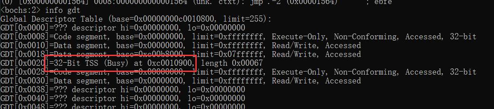
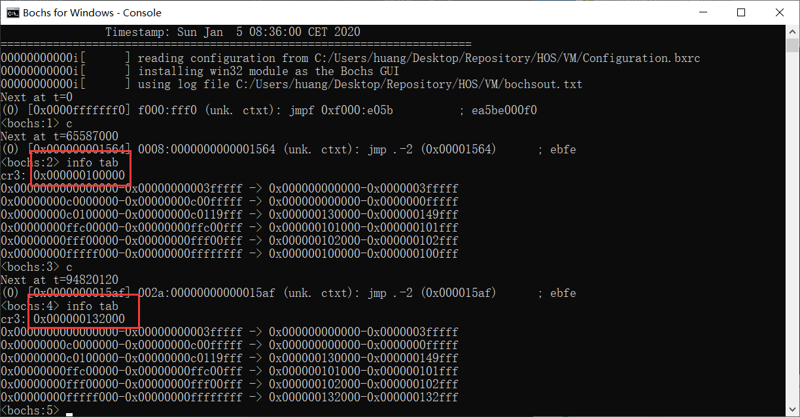
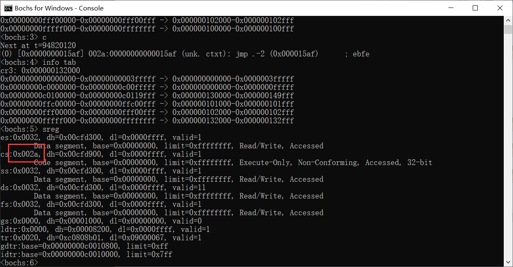
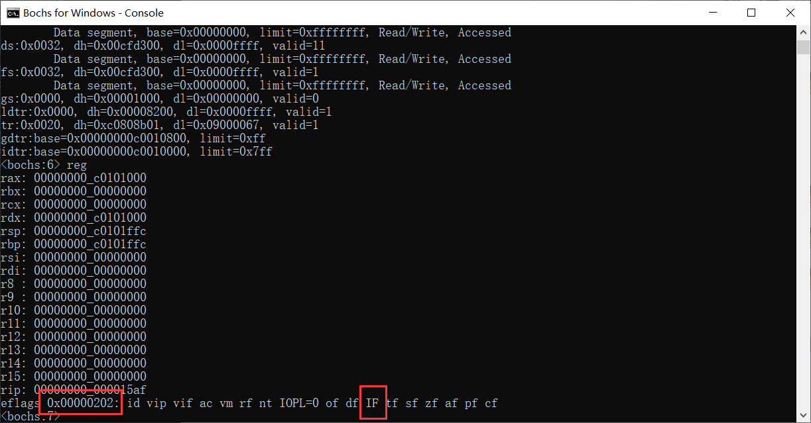

# （十三）用户态进程

## 1. TSS （Task Status Segment，任务状态段）

简单来说，TSS就是x86平台的CPU原生支持的多任务实现机制。

只不过现代操作系统基本不用了，因为它太慢，但是还是需要它做一些辅助工作。

TSS的加载函数

```assembly
[bits 32]   ; 显式指定为32位汇编

section .text

global load_tss

;void load_tss(uint16_t tss_selector);
load_tss:
    ; 将TSS段选择子保存到寄存器 bx 中
    mov bx, word [esp + 4]   ; 参数从堆栈中取出，偏移量为4
    ; 使用 ltr 指令加载TSS段选择子到 TR 寄存器
    ltr bx
    ret   ; 返回


```

一个标准的TSS结构体如下：

```c
// 定义 TSS 结构体
struct TSS {
    uint16_t previous_task_link;  // 前一个任务的 TSS 选择子，用于任务切换时保存前一个任务的 TSS
    uint16_t reserved0;           // 保留字段，未使用

    uint32_t esp0;                // 特权级 0 的栈指针，切换到内核态时使用
    uint16_t ss0;                 // 特权级 0 的栈段选择子
    uint16_t reserved1;           // 保留字段，未使用

    uint32_t esp1;                // 特权级 1 的栈指针，未使用
    uint16_t ss1;                 // 特权级 1 的栈段选择子
    uint16_t reserved2;           // 保留字段，未使用

    uint32_t esp2;                // 特权级 2 的栈指针，未使用
    uint16_t ss2;                 // 特权级 2 的栈段选择子
    uint16_t reserved3;           // 保留字段，未使用

    uint32_t cr3;                 // 页目录基地址寄存器，指向当前任务的页目录
    uint32_t eip;                 // 指令指针，保存任务执行时的指令地址
    uint32_t eflags;              // 标志寄存器，保存任务的状态标志
    uint32_t eax;                 // 通用寄存器，保存任务的 eax 寄存器值
    uint32_t ecx;                 // 通用寄存器，保存任务的 ecx 寄存器值
    uint32_t edx;                 // 通用寄存器，保存任务的 edx 寄存器值
    uint32_t ebx;                 // 通用寄存器，保存任务的 ebx 寄存器值
    uint32_t esp;                 // 栈指针，保存任务的 esp 寄存器值
    uint32_t ebp;                 // 基址指针，保存任务的 ebp 寄存器值
    uint32_t esi;                 // 源索引寄存器，保存任务的 esi 寄存器值
    uint32_t edi;                 // 目标索引寄存器，保存任务的 edi 寄存器值

    uint16_t es;                  // 段选择子，保存任务的 es 段选择子
    uint16_t reserved4;           // 保留字段，未使用
    uint16_t cs;                  // 段选择子，保存任务的 cs 段选择子
    uint16_t reserved5;           // 保留字段，未使用
    uint16_t ss;                  // 段选择子，保存任务的 ss 段选择子
    uint16_t reserved6;           // 保留字段，未使用
    uint16_t ds;                  // 段选择子，保存任务的 ds 段选择子
    uint16_t reserved7;           // 保留字段，未使用
    uint16_t fs;                  // 段选择子，保存任务的 fs 段选择子
    uint16_t reserved8;           // 保留字段，未使用
    uint16_t gs;                  // 段选择子，保存任务的 gs 段选择子
    uint16_t reserved9;           // 保留字段，未使用

    uint16_t ldt_segment_selector;  // 本地描述符表选择子，指向任务的 LDT
    uint16_t reserved10;            // 保留字段，未使用

    uint16_t debug_trap;            // 调试陷阱标志，如果设置则任务切换时产生调试陷阱
    uint16_t io_map_base_address;   // I/O 位图基址偏移，指向任务的 I/O 位图
} __attribute__((packed));          // 禁止编译器自动对齐，保证这个结构体紧凑

```

TSS必须要被一个段描述符表达，所以要先创建一个TSS段描述符。

正好，之后要创建用户态进程，顺便一并创建了用户态的代码段和数据段。

```c
// GDT有32条，每条8字节，一共是256字节，即0x100
// 则GDT的结束地址是0x108ff（映射高地址就是0xc00108ff）
// TSS暂时先放在这里
#define TSS_ADDR 0xc0010900

// 段选择子的计算过程
#define	 RPL0  0
#define	 RPL1  1
#define	 RPL2  2
#define	 RPL3  3

#define TI_GDT 0
#define TI_LDT 1

#define SELECTOR_K_CODE     ((1 << 3) + (TI_GDT << 2) + RPL0)   // 系统代码段
#define SELECTOR_K_DATA     ((2 << 3) + (TI_GDT << 2) + RPL0)   // 系统数据段
#define SELECTOR_K_STACK    SELECTOR_K_DATA                     // 系统堆栈段
#define SELECTOR_K_VIDEO    ((3 << 3) + (TI_GDT << 2) + RPL0)   // 系统视频段

#define SELECTOR_TSS        ((4 << 3) + (TI_GDT << 2) + RPL0)   // TSS段
#define SELECTOR_U_CODE     ((5 << 3) + (TI_GDT << 2) + RPL3)   // 用户代码段
#define SELECTOR_U_DATA     ((6 << 3) + (TI_GDT << 2) + RPL3)   // 用户数据段
#define SELECTOR_U_STACK    SELECTOR_U_DATA                     // 用户堆栈段


void setup_gdt() {

    // GDT表所在位置
    SegmentDescriptor *gdt = (SegmentDescriptor *)GDT_BASE_ADDR;

    // C语言编程惯例，用指针改，才能接管控制权，直接改内存，否则改不了
    // 改的是第四个描述符 视频段
    (gdt + 3)->limit_low = 0x7fff;
    (gdt + 3)->base_low = 0x8000;
    (gdt + 3)->base_mid = 0x0B;
    (gdt + 3)->type = DESC_TYPE_DATA;
    (gdt + 3)->s = DESC_S_CODE_OR_DATA;
    (gdt + 3)->dpl = DESC_DPL0;
    (gdt + 3)->p = DESC_PRESENT;
    (gdt + 3)->limit_high = 0;
    (gdt + 3)->avl = DESC_AVL;
    (gdt + 3)->l = DESC_LONG_MODE;
    (gdt + 3)->db = DESC_DB;
    (gdt + 3)->g = DESC_G_4K;
    (gdt + 3)->base_high = 0xc0;    // 加上偏移量0xc0000000，从虚拟内存可以映射到物理内存，这也是调整视频段的基址

    // GDT搬家
    SegmentDescriptor *new_gdt = (SegmentDescriptor *)NEW_GDT_BASE_ADDR;
    *(uint64_t *)(new_gdt + 0) = *(uint64_t *)(gdt + 0);
    *(uint64_t *)(new_gdt + 1) = *(uint64_t *)(gdt + 1);
    *(uint64_t *)(new_gdt + 2) = *(uint64_t *)(gdt + 2);
    *(uint64_t *)(new_gdt + 3) = *(uint64_t *)(gdt + 3);

    // 第四个放TSS段，这是所有任务共用的tss
    // 先清理干净TSS的位置
    memset((void *)TSS_ADDR, 0, sizeof(struct TSS));
    // 放内核态各个段寄存器的段选择子
    ((struct TSS *)TSS_ADDR)->cs = SELECTOR_K_CODE;

    ((struct TSS *)TSS_ADDR)->ds = SELECTOR_K_DATA;
    ((struct TSS *)TSS_ADDR)->es = SELECTOR_K_DATA;
    ((struct TSS *)TSS_ADDR)->fs = SELECTOR_K_DATA;
    ((struct TSS *)TSS_ADDR)->gs = SELECTOR_K_VIDEO;

    ((struct TSS *)TSS_ADDR)->ss = SELECTOR_K_STACK;

    // 内核态当然用内核堆栈段，其实也就是数据段
    ((struct TSS *)TSS_ADDR)->ss0 = SELECTOR_K_STACK;
    // 这是禁用IO位图
    ((struct TSS *)TSS_ADDR)->io_map_base_address = sizeof(struct TSS);

    // 因为现在还没有用户进程，所有的任务都是内核任务，都要运行在内核态
    // 所以特权级（DPL）是0
    // TSS段的性质类似于代码段
    new_gdt[4].base_low = ((TSS_ADDR) & 0xffff);                  // 段基址低16位
    new_gdt[4].base_mid = (((TSS_ADDR) >> 16) & 0xff);            // 段基址中间8位
    new_gdt[4].base_high = (((TSS_ADDR) >> 24) & 0xff);           // 段基址高8位
    new_gdt[4].limit_low = 0x67;            // 段界限低16位（104的16进制就是0x68，0x68 - 1 = 0x67）
    new_gdt[4].limit_high = 0x0;            // 段界限高16位
    new_gdt[4].type = 9;                    // 类型
    new_gdt[4].s = 0;                       // 描述符类型 (系统段)
    new_gdt[4].dpl = 0;                     // 特权级 0
    new_gdt[4].p = 1;                       // 段存在位
    new_gdt[4].avl = 0;                     // 可用位
    new_gdt[4].l = 0;                       // 64 位代码段
    new_gdt[4].db = 0;                      // 默认操作大小
    new_gdt[4].g = 1;                       // 粒度 (4KB)

    // 用户态的代码段和数据段和内核态的代码段和数据段，只有特权级dpl的不同。只需要修改这两个就可以了。
    // 用户态的代码段，先复制过来，然后修改
    *(uint64_t *)(new_gdt + 5) = *(uint64_t *)(new_gdt + 1);
    // 改成最低特权级就行了
    new_gdt[5].dpl = DESC_DPL3;
    // 用户态数据段一样
    *(uint64_t *)(new_gdt + 6) = *(uint64_t *)(new_gdt + 2);
    new_gdt[6].dpl = DESC_DPL3;

    // 用虚拟地址重新加载GDT
    load_gdt(32 * 8 - 1, NEW_GDT_BASE_ADDR + HIGH_ADDR_OFFSET);
    // 加载tss
    load_tss(SELECTOR_TSS);
    // 顺便清理一下原来的gdt，方便给内核作为栈使用
    memset(gdt, 0, 32 * 8 - 1);

}

```

编译烧写调试。



显示Busy，已经载入了TSS。

而后，修改一下kernel_task.c

```c
// 任务切换，在IRQ0中断处理函数末尾调用
void task_switch(void){
    if (current_task == next_task) {
        // 无需切换，直接返回，不要浪费资源
        return;
    }
    // 从ready链表中删除结点
    list_del(&next_task->general_tag);
    // 如果不切换就跳不出来了，所以用一个临时变量来中继
    struct task *cur_task = current_task;
    current_task = next_task;
    // 是否切换页目录表？
    if(next_task->pgdir && get_current_page() != next_task->pgdir) {
        // 下一个任务页目录表不为空，而且页目录表还不是当前cr3寄存器里的页目录表，才准许加载下一个任务的页目录表到cr3寄存器
        load_page_directory(next_task->pgdir);
    }
    // 内核线程用的是自己的任务信息栈存信息，不用怕改动tss的值
    // tss主要是用在进程的切换上，是要变动特权级的的时候才会起作用
    // 之前为了保证统一，内核线程初始化的时候把pgdir置为内核页表
    // 在这里，如果从内核线程切换到用户进程，变动tss是必要的
    // 如果从用户进程切换到内核线程，变动tss也是有必要的
    // 不变动特权级比如内核线程到内核线程，用户进程到用户进程，变动tss并无必要
    // 懒得区分，我又把pgdir都初始化了，干脆不管了，全都变动

    // 变动tss的esp0（特权级0的栈的指针到下一个内核任务的栈底，这是每个内核任务必然拥有的特权级0的栈
    ((struct TSS *)TSS_ADDR)->esp0 = (uint32_t)next_task + PG_SIZE;

    // 真正切换任务了，进去就暂时出不来了
    switch_to(cur_task, next_task);
}

```

真正需要用到的只有tss的esp0和ss0两个。ss0我们初始化已经设置成了SELECTOR_K_STACK，所以只需要在切换任务的时候变动esp0就行了。


## 2. 用户态进程的实现

在Program文件夹下新建user文件夹，这是用户态的实现工具。

在user中建立process文件夹，这里是用户态进程的实现。

process.h

```c
//
// Created by huangcheng on 2024/6/5.
//

#ifndef HOS_PROCESS_H
#define HOS_PROCESS_H
#include "../../kernel/kernel_task/kernel_task.h"

// 这些是默认的约定
// 用户栈的栈底是0xc0000000往前一页，保证绝对干涉不到内核虚拟地址
#define USER_STACK3_VADDR  (0xc0000000 - 0x1000)
// 0x8048000是Linux的ELF格式可执行文件的默认入口地址（本身已经是128MB处了）
// 所以以此作为进程虚拟空间的起点（其实定什么都行，避开已经使用的虚拟地址就行）
#define USER_VADDR_START 0x8048000


// 创建一个用户进程
// 参数为进程名和入口函数
struct task* process_create(char *name, uint32_t entry_function);

#endif //HOS_PROCESS_H

```

process.c

```c
//
// Created by huangcheng on 2024/6/5.
//

#include "process.h"

#include "../../kernel/kernel_gdt/kernel_gdt.h"
#include "../../kernel/kernel_page/kernel_page.h"
#include "../../devices/console/console.h"
#include "../../kernel/kernel_memory/kernel_memory.h"

#define PG_SIZE 0x1000

// 从虚拟地址获取物理地址
uint32_t virtual_to_physical_address(uint32_t virtual_addr) {

    /*
    // 在kernel_memory里面有用来分离的联合体结构，这里图方便用位运算直接分离
    uint32_t pde_index = (virtual_addr >> 22) & 0x3FF;  // 高10位：页目录索引
    uint32_t pte_index = (virtual_addr >> 12) & 0x3FF;  // 中10位：页表索引
    uint32_t offset = virtual_addr & 0xFFF;             // 低12位：页内偏移

    // 获取当前页目录表
    page_directory_entry_t *page_directory = (page_directory_entry_t *) PAGE_DIR_TABLE_POS;

    // 获取页表物理地址
    uint32_t page_table = page_directory[pde_index].table << 12;

    // 获取物理页框地址
    page_table_entry_t *pte = ((page_table_entry_t *) page_table + pte_index);
    uint32_t physical_page_addr = pte->frame << 12;

    // 计算实际物理地址
    uint32_t physical_addr = physical_page_addr | offset;

    // 返回结果
    return physical_addr;
     */

    // 以上是具体计算过程，以下是整合直接返回语句
    // 因为自引用之后0xfffff000就是当前页表位置，所以直接用0xfffff000来访问，不用记页表位置了
    return ((*(uint32_t *)( (*(uint32_t *)(0xfffff000 + (((virtual_addr >> 22) & 0x3ff) << 2)) & 0xfffff000)
                            + (((virtual_addr >> 12) & 0x3ff) << 2)) & 0xfffff000) | (virtual_addr & 0xfff));
}

// 创建用户空间页目录表（返回的是物理地址）
uint32_t create_user_page_dir(void) {
    // 这个函数是运行时候还是内核态，因此申请内核空间内存
    // 页表项本质上是一个4字节的无符号整数
    page_directory_entry_t *user_page_dir = malloc_page(KERNEL_FLAG, 1);

    if (user_page_dir == NULL) {
        return 0;
    }

    // 清理数据
    memset(user_page_dir, 0, PG_SIZE);

    // 初始化页目录表项
    // 低端映射是内核运行的必须，比如包括申请内存用到的位图，这部分必须全部包括在内
    // 这里映射第一个
    // 一个页目录表项管理4MB内存
    // 目前内核也就用到0x0012a000，足够覆盖了
    // 进程的虚拟地址是从128MB开始的，前面那么多足够用了
    // 如果图省事，直接映射前128MB低端内存，那就是32个页目录表项
    // 但是这个内核没有Linux那么大，需要的内存估计不会超过8MB，差不多得了

    // 只要最后一项自引用了，0xfffff000就是当前页目录表所在的地方，找页目录表地址就很方便了，直接变成了常量
    user_page_dir[0] = ((page_directory_entry_t *)0xfffff000)[0];

    // 复制768项到1024项，访问内核的全部资源
    // 这样子，每个进程的页表，虚拟地址0xc0000000到0xffffffff这部分，共享同样的映射
    // 这样不管是内核还是每个进程，都可以用同样的virtual_to_physical_address来转换虚拟地址到物理地址了

    for(int i = 768; i < 1024; i++) {
        // 只要最后一项自引用了，0xfffff000就是当前页目录表所在的地方，找页目录表地址就很方便了，直接变成了常量
        user_page_dir[i] = ((page_directory_entry_t *)0xfffff000)[i];
    }
    // 计算该页的物理地址
    uint32_t user_page_table_phy_addr = virtual_to_physical_address((uint32_t)user_page_dir);
    // 页目录表最后一项自引用
    // 其作用是快速寻址到页目录表
    // 只要最后一项自引用了，0xfffff000就是当前页目录表所在的地方，找页目录表地址就很方便了，直接变成了常量
    user_page_dir[1023].table = user_page_table_phy_addr >> 12;

    // 只有物理地址才能载入cr3，因此必须返回物理地址
    return user_page_table_phy_addr;
}

// 向上取整宏，将 x 向上取整到 align 的倍数
#define DIV_ROUND_UP(x, align) (((x) + (align) - 1) / (align))

// 创建并初始化用户进程虚拟地址位图（这个动作是在内核空间进行的，所以必须申请内核空间的页）
uint8_t init_user_virtual_addr(struct task *user_process) {
    if(user_process == NULL) {
        return 0;
    }

    // 计算要多少页才装得下
    //uint32_t bitmap_pg_cnt = DIV_ROUND_UP((0xc0000000 - USER_VADDR_START) / PG_SIZE / 8 , PG_SIZE);
    // 我这不用中间变量了，直接算
    user_process->process_virtual_address.bitmap_virtual_memory.bits = malloc_page(KERNEL_FLAG, DIV_ROUND_UP((0xc0000000 - USER_VADDR_START) / PG_SIZE / 8 , PG_SIZE));
    if(user_process->process_virtual_address.bitmap_virtual_memory.bits == NULL) {
        return 0;
    }
    // 对位图进行设置
    user_process->process_virtual_address.virtual_addr_start = USER_VADDR_START;
    // 位图长度
    user_process->process_virtual_address.bitmap_virtual_memory.btmp_bytes_len = (0xc0000000 - USER_VADDR_START) / PG_SIZE / 8;
    // 位图初始化
    bitmap_init(&user_process->process_virtual_address.bitmap_virtual_memory);

    return 1;
}

// 给出一个中断栈数据，跳入用户态
extern void switch_to_user_mode();

// x86平台从内核线程到用户进程，普遍做法是用iretd指令让CPU自动进入用户态
// switch_to_user_mode就是这么编写的
// 本质上和线程切换任务的方式类似，让iretd指令帮助我们自动跳进入口函数

struct task* process_create(char *name, uint32_t entry_function){
    // 关闭中断
    enum intr_status old_status = intr_disable();

    // 创建一个任务，这个任务其实就是跳进用户态
    // 真正的入口函数在中断栈里面
    // 默认进程和内核平等，内核优先级是31
    struct task* new_task = task_create(name, 31, switch_to_user_mode, NULL);
    if (new_task == NULL) {
        intr_set_status(old_status);
        return NULL;
    }

    // 设置用户进程的页目录表
    new_task->pgdir = create_user_page_dir();
    if (!new_task->pgdir) {
        task_cancel(new_task);
        intr_set_status(old_status);
        return NULL;
    }

    // 创建并初始化用户进程虚拟地址位图
    if(init_user_virtual_addr(new_task) == 0) {
        return NULL;
    }

    // 加载用户进程，设置入口点
    // 这么做是为了以后扩展到能从文件里面加载入口函数
    uint32_t entry_point = entry_function; // entry_function 作为入口函数
    if (entry_point == 0) {
        task_cancel(new_task);
        intr_set_status(old_status);
        return NULL;
    }

    // 设置中断栈
    // 因为创建任务的时候，先预留了中断栈，再预留了任务信息栈，所以现在self_stack指向的是任务信息栈的开头
    // 越过任务信息栈，才到中断栈
    struct interrupt_stack* int_stack = (struct interrupt_stack*)((uint32_t)(new_task->self_stack) + sizeof(struct task_info_stack));

    // 中断栈的意义就在于可以通过伪装成中断恢复的形式，从内核态跳入用户态
    int_stack->eip = entry_point; // iretd的时候，就会直接从这里跳进用户进程的入口函数了
    int_stack->cs = SELECTOR_U_CODE;
    int_stack->eflags = 0x202; // IF = 1, IOPL = 0

    int_stack->ds = SELECTOR_U_DATA;
    int_stack->es = SELECTOR_U_DATA;
    int_stack->fs = SELECTOR_U_DATA;
    int_stack->gs = 0;  // 用户态不需要这个，也不能有这个

    int_stack->esp = (uint32_t)int_stack + 14 * 4;  // 以防万一，我把这个esp的值设置到CPU自动压栈的错误码位置（这个其实cpu会自动调整）

    int_stack->user_ss = SELECTOR_U_STACK;   // 内核态和用户态的栈段选择子用的都是数据段选择子
    int_stack->user_esp = (uint32_t)new_task + PG_SIZE; // 与TSS保持一致

    // 恢复中断，等待调度
    intr_set_status(old_status);

    return new_task;
}

```

switch_to_user_mode.asm（我偷懒放到lib_kernel文件夹下了）

```assembly
[bits 32]   ; 显式指定为32位汇编

section .text

extern put_char
extern put_str
extern put_int

global switch_to_user_mode

; void switch_to_user_mode();

; C语言遵循cdecl调用约定标准
; 调用时候会按顺序压栈：参数（从右到左）、返回地址
switch_to_user_mode:
    ; 关闭中断，防止被切换
    cli
    ; 进入这里的时候，任务信息栈已经结束它的作用了
    ; 理论上此时esp位于中断栈的栈顶
    ; 实测结果，距离中断栈栈顶44个字节（我也不知道怎么回事，反正我是没搞明白）
    ; 实测进入switch_to_user_mode的时候，esp距离中断栈栈顶是44个字节

    ; 这里要使用中断栈里面的数据，通过iretd来跳入用户态
    ; 我也不知道为什么压了44个字节的也不知道是什么东西，反正就是到这地方才到中断栈的栈顶
    ; 任务信息栈也就32个字节大小，多出来的12个字节是怎么回事我也不懂了

    add esp, 44

    ; 跳过最开始的中断号和手动压栈错误码
    add esp, 8

    pop gs                  ; 恢复各个段寄存器
    pop fs
    pop es
    pop ds

    popad                   ; 恢复所有通用寄存器

    ; 从内核态跳入用户态，绝不可能有CPU压入的错误码，所以跳过错误码（切换到用户态错误码也没用）
    add esp, 4

    ; 先前已经做好了数据
    ; 不用使用sti开启中断，我们做好的数据里面eflags已经把中断的if位设置为1了，也就是打开中断
    ; 使用 iretd 指令切换到用户态（恢复到我们设置好的eip、cs、eflags、esp、ss）
    iretd

```

kernel_task.h里面关于中断栈的声明

```c
// 中断栈数据（叫中断栈，一个是因为它真的存储中断数据，而是用其模拟中断处理恢复上下文的手段进入用户态）
struct interrupt_stack {
    uint32_t interrupt_number;  // 中断号
    uint32_t manual_error_code; // 手动压栈的错误码 (如果没有错误码，这里存储0)
    uint32_t gs;         // 附加段寄存器 GS
    uint32_t fs;         // 附加段寄存器 FS
    uint32_t es;         // 额外段寄存器 ES
    uint32_t ds;         // 数据段寄存器 DS
    uint32_t edi;        // 目标变址寄存器 EDI
    uint32_t esi;        // 源变址寄存器 ESI
    uint32_t ebp;        // 基址指针寄存器 EBP
    uint32_t esp;        // 栈指针寄存器 ESP（这个没什么用，用不到的）
    uint32_t ebx;        // 通用寄存器 EBX
    uint32_t edx;        // 通用寄存器 EDX
    uint32_t ecx;        // 通用寄存器 ECX
    uint32_t eax;        // 通用寄存器 EAX
    uint32_t error_code; // CPU自动压栈的错误码 (可能有，也可能没有，但是从内核态跳入用户态的时候绝对没有)
    uint32_t eip;        // 指令指针寄存器
    uint32_t cs;         // 代码段寄存器
    uint32_t eflags;     // 标志寄存器
    uint32_t user_esp;   // 低特权级进入高特权级的时候CPU自动压的栈指针 ESP
    uint32_t user_ss;    // 低特权级进入高特权级的时候CPU自动压的栈段选择子 SS
};

```

switch_to_user_mode.asm完全就是中断栈的逆操作，到了eip的时候再iretd，实现从内核态到用户态的跳跃。


## 3. 在Bochs上遇到的问题

我实验了不下五十次，排查了各种可能都没发现有什么错，但是Bochs就是崩溃了。

我只能去看66KB长的调试输出。

然后发现这一句。

```bash
00017404781i[BIOS  ] Booting from 0000:7c00
00020213455e[CPU0  ] fetch_raw_descriptor: GDT: index (16df) 2db > limit (ff)
00020213486e[CPU0  ] check_cs(0x3d6e): non-conforming code seg descriptor dpl != cpl, dpl=3, cpl=2
```

真心给我整麻了，DPL是3不行，CPL是2，所以要调整DPL到2！

kernel_gdt.c

```c
    // 用户态的代码段和数据段和内核态的代码段和数据段，只有特权级dpl的不同。只需要修改这两个就可以了。
    // 用户态的代码段，先复制过来，然后修改
    *(uint64_t *)(new_gdt + 5) = *(uint64_t *)(new_gdt + 1);
    // 改成最低特权级就行了
    new_gdt[5].dpl = DESC_DPL2;
    // 用户态数据段一样
    *(uint64_t *)(new_gdt + 6) = *(uint64_t *)(new_gdt + 2);
    new_gdt[6].dpl = DESC_DPL2;

```

段特权级改成2，选择子的特权级也要改成2。

```c
#define SELECTOR_U_CODE     ((5 << 3) + (TI_GDT << 2) + RPL2)   // 用户代码段
#define SELECTOR_U_DATA     ((6 << 3) + (TI_GDT << 2) + RPL2)   // 用户数据段
#define SELECTOR_U_STACK    SELECTOR_U_DATA                     // 用户堆栈段
```

然后就诡异地能用了。。。。。。

kernel.c

```c
#include "../lib/lib_kernel/lib_kernel.h"
#include "kernel_page/kernel_page.h"
#include "kernel_gdt/kernel_gdt.h"
#include "kernel_idt/kernel_idt.h"
#include "kernel_device/kernel_device.h"
#include "kernel_memory/kernel_memory.h"
#include "kernel_task/kernel_task.h"
#include "../devices/console/console.h"
#include "kernel_buffer//kernel_buffer.h"
#include "../user/process/process.h"

// 测试进程
void test_user_process(void);

void kernel_main(void) {

    uint32_t total_physical_memory = *((uint32_t *)(0xa09));
    // 内存分页初始化
    init_paging();
    // 重新加载gdt
    setup_gdt();
    // 调整ESP，将栈指针切换到高地址（栈大小增加到0x1500）
    switch_esp_virtual_addr();
    // 初始化idt
    init_idt();
    // 先初始化任务管理结构（这样所有任务就能用统一的内存管理逻辑了）
    init_multitasking();
    // 初始化内存管理
    init_memory(total_physical_memory);
    // 初始化所有设备
    init_all_devices();

    process_create("test_user_process", (uint32_t)test_user_process);


    // 允许PIC_IRQ0中断，才可以让定时器调度线程
    enable_interrupt(0);
    // 开启全局中断
    intr_enable();

    // 进入内核主循环或其它初始化代码
    for(;;) {

    }
    // 退出主循环卸载设备驱动
    exit_all_devices();
}

// 测试作为用户进程开启的函数
void test_user_process(void) {
    for(;;);
}

```

一键编译烧写，调试。



从内核的页目录表切换到了进程的页目录表。



cs 寄存器里面的代码段选择子也变成了用户代码段的选择子（内核代码段的选择子是0x08），0x32则是用户数据段的选择子，可以自己试试位运算一下。



可以看到IF位被置为1，eflags寄存器的值就是我们之前做中断栈数据的时候设置的0x202，说明 iretd 指令真的把我们做的数据载入各个寄存器了。

总的来说这个测试进程现在运行在用户态了，但是它并不能直接使用内核的函数比如console_put_str，因为它特权不够，想要利用内核的功能，就要靠内核提供系统调用了。
