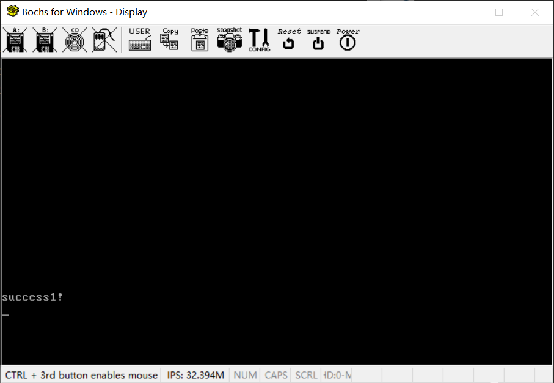

# （十四）系统调用的实现


因为特权级的存在，任务CPU都不允许低特权级的代码访问高特权级的资源。

所以这样，用户态进程就相当于与内核隔离了，所以必须要提供一种机制，让用户态进程可以访问内核的资源，这样用户态进程最起码才能在屏幕上put_str，这种机制就是系统调用。

其实系统调用就是利用了x86 CPU的一个机制，发生中断的时候自动进入最高特权级（内核态），处理完毕之后返回原特权级继续运行。

其实和先前实现跳入用户态进程差不多。

Linux常用0x80号中断来发起系统调用。

话不多说，直接开工。


## 1. 0x80号系统中断处理函数

### 1.1 编写中断处理函数

kernel下的interrupt_handler，total_interrupt_handler.asm

```assembly
[bits 32]   ; 显式指定为32位汇编

TI_GDT equ 0
RPL0 equ 0
SELECTOR_CODE equ (0x0001 << 3) + TI_GDT + RPL0
SELECTOR_DATA equ (0x0002 << 3) + TI_GDT + RPL0
SELECTOR_VIDEO equ (0x0003 << 3) + TI_GDT + RPL0

section .text

extern interrupt_dispatcher
; 任务切换函数
extern task_switch

%macro interrupt_handler 2
global interrupt_handler_%1

interrupt_handler_%1:
    cli                     ; 禁用中断，防止中断嵌套
    pushad                  ; 保存所有通用寄存器
    push ds                 ; 保存数据段寄存器
    push es
    push fs
    push gs                 ; 保存视频段寄存器
    mov ax, SELECTOR_DATA   ; 加载数据段选择子
    mov ds, ax
    mov es, ax
    mov fs, ax
    mov ax, SELECTOR_VIDEO  ; 加载视频段选择子
    mov gs, ax

    %if %2
        push dword [esp + 36] ; 错误码在esp+36（错误码，eflags，cs，eip，共16字节，之前压入的8个寄存器共32字节）
    %else
        push 0                ; 没有错误码则压入0
    %endif
    push %1                 ; 压入中断号
    call interrupt_dispatcher ; 调用C里面的中断分发器

    add esp, 8              ; 清理栈上的参数
    pop gs                  ; 恢复各个段寄存器
    pop fs
    pop es
    pop ds
    popad                   ; 恢复所有通用寄存器
    sti                     ; 启用中断

    %if %1 = 32
        call task_switch    ; 只有IRQ0中断（中断号0x20，即32）需要切换任务
    %endif

    iretd                   ; 恢复调用前的cs、eflags、eip
%endmacro

%assign i 0
%rep 48
    %if i = 8 || i = 10 || i = 11 || i = 12 || i = 13 || i = 14 || i = 17
        interrupt_handler i, 1 ; 这些中断有错误码
    %else
        interrupt_handler i, 0 ; 其他中断没有错误码
    %endif
    %assign i i+1
%endrep

; 定义0x80号系统调用中断处理程序
global syscall_handler

; C里面写的系统调用分发器（见syscall_dispatcher.c）
extern syscall_dispatcher

syscall_handler:
    ; 防止嵌套中断，要关闭中断
    cli

    pushad
    push ds
    push es
    push fs
    push gs
    ; 把这几个置换为内核态的段选择子
    mov ax, SELECTOR_DATA
    mov ds, ax
    mov es, ax
    mov fs, ax
    mov ax, SELECTOR_VIDEO
    mov gs, ax

    ; ---------    老规矩，中断开始处理前保存上下文，重新加载段选择子    ---------

    ; --------------- 这里是配合系统调用分发器的设计 ---------------

    push edi                ; 第四个参数
    push esi                ; 第三个参数
    push edx                ; 第二个参数
    push ecx                ; 第一个参数
    push ebx                ; 系统调用号

    call syscall_dispatcher ; 调用C里的系统调用分发器

    add esp, 20             ; 清理栈上的参数（五个，一共是20字节）

    ; 将返回值存到栈上先前保存eax的位置，这样等下就可以弹栈弹回来了
    ; 8个通用寄存器和4个段寄存器，一共12个都是4字节
    ; eax是第一个保存的（所以偏移11 * 4，它的低地址有11个寄存器的值，mov的方向是从低地址到高地址）
    mov [esp + 11 * 4], eax

   ; ---------    老规矩，中断处理完毕恢复上下文    ---------
    pop gs
    pop fs
    pop es
    pop ds
    popad

    sti

    ; 数据是CPU自动帮我们压栈的，直接iretd弹回去就是了
    ; 回到用户态
    iretd

```

interrupt_handler.h

```c
// 系统调用使用的0x80号中断处理函数
extern void syscall_handler();
```

解释一下。x86平台的系统调用一般是通过寄存器传参的，比起压栈传参更快。

syscall_dispatcher.c

```c
//
// Created by huangcheng on 2024/6/8.
//

// 可能要用到内核的全部功能，所以都要include
#include "../kernel_task/kernel_task.h"
#include "../kernel_task/kernel_sync.h"
#include "../kernel_memory/kernel_memory.h"
#include "../kernel_device/kernel_device.h"
#include "../kernel_buffer/kernel_buffer.h"
#include "../../devices/console/console.h"

// 理论上这些专属于内核，用户进程就不该能用
#include "../kernel_page/kernel_page.h"
#include "../kernel_gdt/kernel_gdt.h"
#include "../kernel_idt/kernel_idt.h"
#include "../kernel_interrupt/kernel_interrupt.h"
#include "../../devices/keyboard/keyboard.h"
#include "../../devices/pit8253/pit8253.h"


// 系统调用分发器
uint32_t syscall_dispatcher(uint32_t syscall_number, uint32_t arg1, uint32_t arg2, uint32_t arg3, uint32_t arg4) {

    // 根据约定的调用号来调用各个功能
    if(syscall_number == 0) {
        // 这是为了防止默认值，所以0设为无效
        return 0;
    }

    if(syscall_number == 1) {
        console_put_str((char *)arg1);
        return 1;
    }

    if(syscall_number == 2) {
        // 不管溢出，这是用户考虑的问题
        strcpy((char *)arg1, running_task()->name);
        return 1;
    }

    if(syscall_number == 3) {
        return (uint32_t)malloc_page(USER_FLAG, arg1);
    }

    if(syscall_number == 4) {
        free_page((void *)arg1, arg2);
    }

    return 0;
}

```

kernel_idt.c

```c
void init_idt() {
    // 前面都一样，省略
    
    // 注册系统调用的0x80号中断处理函数（这个不太一样，这个是要求用户进程也能发起的，所以需要修改dpl为用户级，允许用户发起中断）
    // Windows版本的Bochs不知道为什么，最低只能到特权级2，到了3死活不行
    set_interrupt_descriptor(0x80, syscall_handler);
    ((InterruptDescriptor *)IDT_BASE_ADDR + 0x80)->dpl = 2;

    // 256 个中断描述符，8 * 256 - 1 = 2047，即0x7ff
    // 虚拟地址加载IDT
    load_idt( 256 * 8 - 1 ,IDT_BASE_ADDR + HIGH_ADDR_OFFSET);

}

```


### 1.2 用户态进程发出系统调用

lib文件夹下建立lib_user，lib_user中建立intr_syscall.asm

```assembly
[bits 32]

section .text


; 通用系统调用接口
; 参数通过寄存器传递
; eax - 返回值
; ebx, ecx, edx, esi, edi - 各项参数
global intr_syscall

intr_syscall:
    mov ebx, [esp + 4]      ; 系统调用号
    mov ecx, [esp + 8]      ; 第一个参数
    mov edx, [esp + 12]     ; 第二个参数
    mov esi, [esp + 16]     ; 第三个参数
    mov edi, [esp + 20]     ; 第四个参数
    int 0x80                ; 发出0x80号系统调用中断
    ret                     ; 返回（如果有返回值，都会放在eax寄存器里面，正常读取返回值就行了）

```

这部分和遵照之前syscall_handler中的约定。

syscall.h

```c
//
// Created by huangcheng on 2024/6/8.
//

#ifndef HOS_SYSCALL_H
#define HOS_SYSCALL_H

#include "../type.h"

// 可以用枚举类型来列举定义具体是哪个系统调用，用整数也可以，总之约定好就行
// 枚举比如
/*
enum SYSCALL_TYPE {
    SYS_GETPID,
    SYS_WRITE,
    SYS_MALLOC,
    SYS_FREE
};
 */
// 我用整数，觉得比较方便，编个号就行了

// 用户版本的put_str
uint32_t write(char* str);
// 获得当前任务的名字
void get_process_name(char *buf);
// 申请内存（以页为单位）
void *user_malloc(uint32_t cnt);
// 释放内存（以页为单位）
void user_free(void *addr, uint32_t cnt);

#endif //HOS_SYSCALL_H

```

syscall.c

```c
//
// Created by huangcheng on 2024/6/9.
//

#include "syscall.h"

// 汇编写的发出中断开启系统调用函数
extern uint32_t intr_syscall(uint32_t syscall_number, uint32_t arg1, uint32_t arg2, uint32_t arg3, uint32_t arg4);

// 用户版本的put_str
uint32_t write(char* str) {
    return intr_syscall(1,(uint32_t)str,0,0,0);
}

void get_process_name(char *buf) {
    intr_syscall(2,(uint32_t)buf,0,0,0);
}

// 申请内存（以页为单位）
void *user_malloc(uint32_t cnt) {
    return (void *)intr_syscall(3,cnt,0,0,0);
}

// 释放内存（以页为单位）
void user_free(void *addr, uint32_t cnt) {
    intr_syscall(4,(uint32_t)addr,cnt,0,0);
}

```


### 1.3 实测

```c
#include "../lib/lib_kernel/lib_kernel.h"
#include "kernel_page/kernel_page.h"
#include "kernel_gdt/kernel_gdt.h"
#include "kernel_idt/kernel_idt.h"
#include "kernel_device/kernel_device.h"
#include "kernel_memory/kernel_memory.h"
#include "kernel_task/kernel_task.h"
#include "../devices/console/console.h"
#include "kernel_buffer/kernel_buffer.h"
#include "../user/process/process.h"

#include "../lib/lib_user/syscall.h"

// 键盘监视任务（实际上监视对象是分配给键盘的缓冲区）
void keyboard_task();
// 测试进程
void test_user_process(void);

void kernel_main(void) {

    uint32_t total_physical_memory = *((uint32_t *)(0xa09));
    // 内存分页初始化
    init_paging();
    // 重新加载gdt
    setup_gdt();
    // 调整ESP，将栈指针切换到高地址（栈大小增加到0x1500）
    switch_esp_virtual_addr();
    // 初始化idt
    init_idt();
    // 先初始化任务管理结构（这样所有任务就能用统一的内存管理逻辑了）
    init_multitasking();
    // 初始化内存管理
    init_memory(total_physical_memory);
    // 初始化所有设备
    init_all_devices();

    process_create("test_user_process", (uint32_t)test_user_process);

    // 允许PIC_IRQ0中断，才可以让定时器调度线程
    enable_pic_irq_interrupt(0);
    // 开启全局中断
    intr_enable();

    // 进入内核主循环或其它初始化代码
    for(;;) {

    }
    // 退出主循环卸载设备驱动
    exit_all_devices();
}

// 测试作为用户进程开启的函数
void test_user_process(void) {
    // 用户进程无权访问内核空间
    // 需要内核拷贝到用户空间，因为内核特权级高

    write("\nsuccess1!\n");
    write("\nsuccess2!\n");

    for(;;) {
    }
}

```

实测结果：



只能打一次系统调用，不能打第二次。

我排查了整整两天！！！！才发现栈结构不知道为什么变化了。

**第一次可以进入系统调用可以正常返回**。

**第二次进入系统调用的时候不知道为什么栈顶往低地址移动了8个字节（压栈了两个4字节的不知道从哪冒出来的0）！！！**

我排查了很久都没排查出问题。。。。

之前跳入用户态的时候也是，**不知道为什么进入switch_to_user_mode的时候被压栈44个字节！！！**

我到现在都没想明白，压一个返回地址正常，其他10个四字节的是什么东西？用Bochs的debug工具看又是一头雾水，栈顶是返回地址没错，然后跟着一堆0是什么东西？？？跟着一堆0了就到中断栈，很明显任务信息栈早就被用完了。

还有之前实现用户态的时候碰到的，用户态代码段和用户态数据段要设置dpl是2，不然Bochs报错说我dpl不等于cpl，cpl是2，我都不知道cpl = max (rpl, dpl)，我的段选择子rpl也是3，段的dpl也是3，你的cpl怎么给我算出来2的。。。。。。

现在买了arm的开发板，想赶紧让我的HOS上真机执行真实的任务（反正有内核任务也足够了），实在不想在Bochs上面浪费时间了。而且现在的问题我实在是解决不了了。

我只能说Windows上的Bochs真的坑多，Linux上的Bochs支持的它不支持也就算了，幺蛾子真不是一般多。

x86平台上的开发就到这里吧，该换 qemu 上arm了。


## 2. 修改

多任务机制里面，TCB的任务名字段大小扩大为64个字符

kernel_task.h

```c
//TCB（任务控制块），表明这是一个任务（不管是进线程，都是任务）
struct task {
    uint8_t *self_stack;	    // 各任务都用自己的栈（指向栈顶）

    enum task_status status;    // 任务状态，这个不用说
    char name[64];              // 任务名（未来可以改成全局唯一ID）
    uint8_t priority;           // 优先级
    uint8_t ticks;	            // 每次在处理器上执行的时间嘀嗒数（一个ticks即定时器IRQ0中断一次，决定什么时候调度任务）

    uint32_t elapsed_ticks;     // 此任务自上cpu运行后至今占用了多少cpu嘀嗒数,

    struct list_node general_tag;   // 当前串在哪个调度队列上
    struct list_node all_task_tag;  // 所有任务都串在一起，这是为了保证任何时候都能找到

    uint32_t pgdir;            // 页表的物理地址（单独分配这个资源的时候就是进程了）
    Virtual_Addr process_virtual_address;  // 用户进程的虚拟地址资源，申请内存的时候需要
    uint32_t stack_magic;	    // 用这串数字做栈的边界标记,用于检测任务栈的溢出
};

```

为了更好地保存任务上下文，任务状态保存范围扩大到八个通用寄存器。

kernel_task.h

```c
// 任务信息栈，用于保存一个任务切换时候的状态
struct task_info_stack {
    // 为了保存用户状态，需要保存八个通用寄存器的值
    uint32_t edi;        // 用于保存切换时的EDI寄存器值
    uint32_t esi;        // 用于保存切换时的ESI寄存器值
    uint32_t ebp;        // 用于保存切换时的EBP寄存器值
    uint32_t esp;        // 用于保存切换时的ESP寄存器值（这个没什么用，cpu会自动调整）
    uint32_t ebx;        // 用于保存切换时的EBX寄存器值
    uint32_t edx;        // 用于保存切换时的EDX寄存器值
    uint32_t ecx;        // 用于保存切换时的ECX寄存器值
    uint32_t eax;        // 用于保存切换时的EAX寄存器值

    // 首次上CPU的时候需要设置，后面就自动调整了
    // 在栈里，这就是所谓的返回地址，pop掉上面四个之后，ret的时候直接jmp这个地址，以此实现任务切换
    // 也就是直接跳入function(func_arg)里面了
    void (*ret_addr) (task_function* func, void* func_arg);
    // 这个返回地址是调用function(func_arg)的时候的返回地址（其实就是这里本身），对我们没什么用
    void (*unused_ret_addr);     // 占位用，不实际使用
    // 说白了就是传参
    task_function *function;    // 首次执行时调用的函数
    void* func_arg;             // 首次执行时调用函数的参数
};

```

对应的switch_to.asm

```assembly
[bits 32]
section .text

global switch_to

switch_to:
   pushad

   mov eax, [esp + 36]          ; 得到参数cur（8 * 4 + 返回地址4 = 36）
   mov [eax], esp               ; 解引用cur，得到第一个元素的值，也就是task的self_stack字段，栈顶指针
                                ; self_stack是struct task的第一个元素，所以不需要加偏移量
                                ; 直接对其写入esp的值即可，更新栈顶指针

;------------------  以上是备份当前任务的环境，下面是恢复下一个任务的环境  ----------------

   mov eax, [esp + 40]		    ; 得到栈中的参数next, next = [esp + 40]
   mov esp, [eax]		        ; tcb的第一个成员是self_kstack成员，记录栈顶指针
				                ; 从self_kstack中恢复到esp，恢复到这个任务的栈顶指针

				                ; 第一次上CPU执行的时候，栈顶在这里
				                ; pop八个都是0（最开始执行当然要清空）

   popad
   ret				            ; 此时，根据任务信息栈的设计，此时栈顶已经来到了上次执行到的入口地址
                                ; 就直接进入继续执行了
                                ; 如果是第一次上CPU的话，这里是我们初始化时候的包装函数入口地址
                                ; 所以ret就进入入口地址开始执行了

```

另外，实现了完整的task_cancel逻辑

kernel_task.c

```c
//
// Created by huangcheng on 2024/6/1.
//

#include "kernel_task.h"
#include "../kernel_interrupt/kernel_interrupt.h"
#include "../kernel_memory/kernel_memory.h"
#include "../kernel_page/kernel_page.h"
#include "../kernel_gdt/kernel_gdt.h"

#define PG_SIZE 0x1000

// 内核任务 TCB 的固定位置和栈位置
#define KERNEL_TCB ((struct task*)0x9f000)

// 切换任务汇编
extern void switch_to(struct task *cur, struct task *next);

// 定义就绪队列和所有队列
static struct list_node ready_list;
static struct list_node all_task_list;

// 死亡任务队列（暂时还没关闭的任务都在里面）
static struct list_node died_list;

// 当前正在运行的任务
static struct task* current_task = NULL;
// 将要运行的任务（下一个任务）
static struct task* next_task = NULL;

// 初始化任务调度系统
void init_multitasking(void) {
    init_list_node(&ready_list);
    init_list_node(&all_task_list);
    init_list_node(&died_list);
    
    // 其他都一样
}

// 取消任务（线程不回收资源，页表和位图进程自己回收）
void task_cancel(struct task* task) {
    if(task == NULL) {
        return;
    }
    if(task == current_task) {
        // 这里要等任务完成才能删除
        // 标记其等待删除，让任务调度器删掉
        task->status = TASK_DIED;
        // current_task本来就不应该在ready_list里面
        // 但是怕了，还是先删一遍
        list_del(&task->general_tag);
        // 加入到死亡队列
        list_add_tail(&task->general_tag, &died_list);
        return;
    }
    if(task == KERNEL_TCB) {
        // 内核任务不得删除
        return;
    }
    // 关闭中断防止切换
    enum intr_status old_status = intr_disable();
    if(next_task == task) {
        // 碰上这种情况，直接切成current
        next_task = current_task;
    }
    list_del(&task->general_tag);
    list_del(&task->all_task_tag);
    free_page(task, 1);
    // 恢复先前状态
    intr_set_status(old_status);
}

void task_schedule(void) {
    // 检查栈溢出
    if (current_task->stack_magic != 0x20000702) {
        // 处理栈溢出错误
        for(;;);
    }

    // 清理死亡队列里的任务
    struct list_node *pos;
    struct task* tmp_task;
    list_for_each(pos, &died_list) {
        tmp_task = list_entry(pos, struct task, general_tag);
        list_del(&tmp_task->general_tag);
        list_del(&tmp_task->all_task_tag);
        // 释放TCB
        free_page(tmp_task, 1);
    }

    // 其他都一样
}

```

增加了一个died_list，这次能保证所有任务都会被正常关闭了。

同步机制里面信号量的实现修改，之前搞错了一直忘了改了。

```c
// 信号量的P操作（等待，信号量减1）
void semaphore_wait(struct semaphore *psema) {
    // 关闭中断，防止上下文切换
    enum intr_status old_status = intr_disable();

    // 没有使用权，必须阻塞
    // 用循环的原因是害怕解锁之后还是没得到资源使用权（被抢走了）
    // 所以要再判断一次
    while (psema->value == 0) {
        struct task *current = running_task();
        // 将当前任务作为一个等待者，插入等待队列
        struct semaphore_waiter waiter;
        waiter.task = current;
        init_list_node(&waiter.tag);

        list_add_tail(&waiter.tag, &psema->waiters); // 添加到等待队列
        task_block(TASK_BLOCKED); // 阻塞当前任务

    }
    // 获取使用权
    psema->value--;
    // 恢复先前状态
    intr_set_status(old_status);
}


// 信号量的V操作（信号，信号量加1）
void semaphore_signal(struct semaphore* psema) {
    // 关闭中断，防止上下文切换
    enum intr_status old_status = intr_disable();

    // 只要有
    if (!list_empty(&psema->waiters)) {
        // 解除第一个等待者的阻塞
        struct list_node *node = psema->waiters.next;
        struct semaphore_waiter *waiter = list_entry(node, struct semaphore_waiter, tag);
        list_del(node); // 从等待队列中删除

        // 结束阻塞，复活任务
        task_unblock(waiter->task);

    }

    // 释放使用权
    psema->value++;
    // 恢复先前状态
    intr_set_status(old_status);
}

```

kernel_interrupt.h，两个函数名的修正（之前的名字太容易混淆了）

```c
// 启用指定向量的中断
void enable_pic_irq_interrupt(uint8_t irq);
// 禁用指定向量的中断
void disable_pic_irq_interrupt(uint8_t irq);

```

内核缓冲区修改，增加了判空逻辑。

kernel_buffer.h

```c
//
// Created by huangcheng on 2024/6/4.
//

#ifndef HOS_KERNEL_BUFFER_H
#define HOS_KERNEL_BUFFER_H

#include "../../lib/lib_kernel/lib_kernel.h"
#include "../kernel_task/kernel_sync.h"

// 这是一个基于生产者-消费者模型的 内核级 线程安全 环形 缓冲区的实现
// 生产者写入数据的时候，消费者被阻塞
// 消费者读数据的时候，生产者被阻塞
// 内核缓冲区的结构体
struct kernel_buffer {
    uint8_t *data;                // 实际的数据存储
    uint32_t size;             // 缓冲区大小
    uint32_t read_pos;         // 读位置
    uint32_t write_pos;        // 写位置

    uint8_t is_full;              // 缓冲区是否已满的标志位

    struct mutex mutex;        // 互斥锁，保护缓冲区访问
    struct semaphore writable; // 可写信号量，表示空闲空间数量
    struct semaphore readable; // 可读信号量，表示已填充数据数量
};

// 获取一个初始化好的内核缓冲区
struct kernel_buffer* kernel_buffer_create(void);
// 回收缓冲区
void kernel_buffer_free(struct kernel_buffer *k_buf);
// 将data的数据写size个字节到内核缓冲区，size不得大于4000，建议在2048以内（由生产者调用，写时消费者被阻塞）
void kernel_buffer_write(struct kernel_buffer *k_buf, char *data, uint32_t size);
// 从内核缓冲区读取数据，读size个字节到data，size不得大于4000，建议在2048以内（由消费者调用，读时生产者被阻塞）
void kernel_buffer_read(struct kernel_buffer *k_buf, char *data, uint32_t size);
// 判断缓冲区是否为空
uint8_t kernel_buffer_is_empty(struct kernel_buffer *k_buf);


#endif //HOS_KERNEL_BUFFER_H

```

kernel_buffer.c

```c
//
// Created by huangcheng on 2024/6/4.
//

#include "kernel_buffer.h"
#include "../kernel_memory/kernel_memory.h"

#define PAGE_SIZE 0x1000

struct kernel_buffer* kernel_buffer_create(void) {
    // 申请一整页4KB内存，起始地址放缓冲区控制信息，剩下的都作为数据区使用
    void *page_addr = malloc_page(KERNEL_FLAG,1);
    if (page_addr == NULL) {
        return NULL; // 分配失败，返回NULL
    }

    struct kernel_buffer *k_buf = (struct kernel_buffer *)page_addr;
    k_buf->data = ((uint8_t *)page_addr + sizeof(struct kernel_buffer));
    k_buf->read_pos = 0;
    k_buf->write_pos = 0;
    k_buf->is_full = 0;
    k_buf->size = PAGE_SIZE - sizeof(struct kernel_buffer);
    mutex_init(&k_buf->mutex);
    semaphore_init(&k_buf->writable, k_buf->size);      // 初始空闲空间为缓冲区大小
    semaphore_init(&k_buf->readable, 0);        // 初始已填充数据为0

    return k_buf;
}

void kernel_buffer_free(struct kernel_buffer *k_buf) {
    // 用位运算方式取低12位，如果低12位全部是0，那么就是有效的，可以回收
    // NULL的情况，free_page里面有判断，不用再判断了
    if(((uint32_t)k_buf & 0xFFF) == 0) {
        free_page((void *)k_buf, 1);
    }
}

// 写入缓冲区
void kernel_buffer_write(struct kernel_buffer *k_buf, char *data, uint32_t size) {
    if (size > k_buf->size) {
        // 边界检查，一次性写不能超过缓冲区大小
        return;
    }
    for (uint32_t i = 0; i < size; i++) {
        semaphore_wait(&k_buf->writable);   // 等待可写空间
        mutex_lock(&k_buf->mutex);          // 锁定缓冲区

        k_buf->data[k_buf->write_pos] = data[i];
        k_buf->write_pos = (k_buf->write_pos + 1) % k_buf->size;

        k_buf->is_full = (k_buf->write_pos == k_buf->read_pos); // 更新is_full标志

        mutex_unlock(&k_buf->mutex);        // 解锁缓冲区
        semaphore_signal(&k_buf->readable); // 通知有新数据可读
    }
}

// 读取缓冲区
void kernel_buffer_read(struct kernel_buffer *k_buf, char *data, uint32_t size) {
    if (size > k_buf->size) {
        // 边界检查，一次性读不能超过缓冲区大小
        return;
    }
    for (uint32_t i = 0; i < size; i++) {
        semaphore_wait(&k_buf->readable);   // 等待可读数据
        mutex_lock(&k_buf->mutex);          // 锁定缓冲区

        data[i] = k_buf->data[k_buf->read_pos];
        k_buf->read_pos = (k_buf->read_pos + 1) % k_buf->size;

        k_buf->is_full = 0; // 更新is_full标志

        mutex_unlock(&k_buf->mutex);        // 解锁缓冲区
        semaphore_signal(&k_buf->writable); // 通知有可写空间
    }
}

// 判断缓冲区是否为空
uint8_t kernel_buffer_is_empty(struct kernel_buffer *k_buf) {
    return (k_buf->read_pos == k_buf->write_pos && !k_buf->is_full);
}

```


设备驱动管理框架：

kernel_device.h

```c
//
// Created by huangcheng on 2024/5/27.
//

#ifndef HOS_KERNEL_DEVICE_H
#define HOS_KERNEL_DEVICE_H

#include "../../lib/lib_kernel/lib_kernel.h"
#include "../kernel_buffer/kernel_buffer.h"

// 统一的驱动接口结构体（这个结构体的实例一律放在驱动段）
struct driver {
    char driver_name[64];                       // 驱动名称
    void (*init)(void);                         // 初始化函数
    void (*exit)(void);                         // 退出函数
    int32_t irq;                                // IRQ 中断号（如果没有中断处理函数填-1）
    void (*irq_interrupt_handler)(void);        // 中断处理函数（可选）

    // 因为注册宏里面改了四字节对齐，这里用uint_8_t也是四字节，干脆用uint_32_t填满

    uint32_t need_input_buffer;                 // 需要分配输入缓冲区就填1，不然填0
    uint32_t need_output_buffer;                // 需要分配输出缓冲区就填1，不然填0

    struct kernel_buffer *input_buffer;         // 指向输入缓冲区的指针
    struct kernel_buffer *output_buffer;        // 指向输出缓冲区的指针

    struct list_node node;                      // 用于串联到驱动链表上的链表结点

    void *driver_task_function;                 // 用于创建内核任务的函数入口
                                                // 这个内核任务负责具体的对设备读写，与缓冲区进行交互
                                                // 依赖于设备驱动的实现，没有也无所谓

    void *driver_task_function_args;            // 理论上应该不用传参，实际上不知道，多冗余一些好
};

// 初始化所有设备
void init_all_devices();
// 移除所有设备
void exit_all_devices();
// 添加单个驱动并初始化
void driver_add(struct driver* drv);
// 移除单个驱动并卸载
void driver_remove(const char *driver_name);
// 获取设备驱动
struct driver* get_driver(const char *driver_name);
// 对设备（驱动）读，本质上就是读其输入缓冲区（成功返回读出数量（以字节计算），不成功返回-1）
int32_t device_read(struct driver *drv, char *data, uint32_t count);
// 对设备（驱动）写，本质上就是写其输出缓冲区（成功返回写入数量（以字节计算），不成功返回-1）
int32_t device_write(struct driver *drv, char *data, uint32_t count);

// 这个注册宏的作用就是把数据放在驱动段（而且告诉编译器这个是被使用的，不能优化掉），它会定义一个驱动结构体实例（增加4字节对齐）
#define REGISTER_DRIVER(drv) \
    __attribute__((section(".drivers"), used, aligned(4))) struct driver drv =


#endif //HOS_KERNEL_DEVICE_H

```

kernel_device.c

```c
//
// Created by huangcheng on 2024/5/27.
//

#include "kernel_device.h"
#include "../kernel_interrupt/kernel_interrupt.h"
#include "../kernel_task/kernel_task.h"

// 驱动链表头结点
struct list_node driver_list_head;

// 驱动段的起点和终点
extern struct driver __drivers_start[];
extern struct driver __drivers_end[];

// 中断处理逻辑数组
extern void (*interrupt_handler_functions[256])(void);

// 回收缓冲区
void free_driver_buffer(struct driver *drv) {

    // 需要内核缓冲区，而且已经被分配了缓冲区的情况
    if (drv->need_input_buffer && drv->input_buffer) {
        // 回收缓冲区
        kernel_buffer_free(drv->input_buffer);
        // 清空指针
        drv->input_buffer = NULL;
    }

    // 需要内核缓冲区，而且已经被分配了缓冲区的情况
    if (drv->need_output_buffer && drv->output_buffer) {
        // 回收缓冲区
        kernel_buffer_free(drv->output_buffer);
        // 清空指针
        drv->output_buffer = NULL;
    }

}

// 分配缓冲区，原子操作，失败回滚，返回1为成功，0为失败
uint8_t alloc_driver_buffer(struct driver *drv) {
    struct kernel_buffer *input_buf = NULL;
    struct kernel_buffer *output_buf = NULL;

    // 尝试分配输入缓冲区
    if (drv->need_input_buffer) {
        if (drv->input_buffer) {
            // 如果已经存在输入缓冲区，直接返回，不做任何更改
            return 0;
        } else {
            input_buf = kernel_buffer_create();
            if (!input_buf) {
                // 分配失败，直接返回，不做任何更改
                return 0;
            }
        }
    }

    // 尝试分配输出缓冲区
    if (drv->need_output_buffer) {
        if (drv->output_buffer) {
            // 如果已经存在输出缓冲区，先释放已分配的输入缓冲区（如果有的话）
            if (input_buf) {
                kernel_buffer_free(input_buf);
            }
            // 直接返回，不做任何更改
            return 0;
        } else {
            output_buf = kernel_buffer_create();
            if (!output_buf) {
                // 分配失败，回滚已分配的输入缓冲区（如果有的话）
                if (input_buf) {
                    kernel_buffer_free(input_buf);
                }
                // 直接返回，不做任何更改
                return 0;
            }
        }
    }

    // 如果成功分配了缓冲区，更新驱动的缓冲区指针
    // 这里的指针如果不为空，肯定说明要求分配了，所以直接更新即可，不用再次判定是否要求分配了
    if (input_buf) {
        drv->input_buffer = input_buf;
    }
    if (output_buf) {
        drv->output_buffer = output_buf;
    }

    return 1;
}

void init_all_devices() {
    // 初始化驱动链表头结点
    init_list_node(&driver_list_head);
    // 链接到驱动链表
    struct driver* drv;
    for (drv = __drivers_start; drv < __drivers_end; drv++) {
        driver_add(drv);
    }
}

void exit_all_devices() {
    // 禁用中断
    intr_disable();
    // 遍历驱动链表，执行每个驱动的退出函数
    struct list_node *pos, *n;
    list_for_each_safe(pos, n, &driver_list_head) {
        struct driver *drv = list_entry(pos, struct driver, node);
        if (drv->exit != NULL) {
            drv->exit();
        }

        // 需要内核缓冲区，而且已经被分配了缓冲区的情况
        free_driver_buffer(drv);

        // 如果中断号在有效范围内且匹配当前驱动的中断处理程序
        if (drv->irq >= 0 && drv->irq < 16 && interrupt_handler_functions[drv->irq + 0x20] == drv->irq_interrupt_handler) {
            interrupt_handler_functions[drv->irq + 0x20] = NULL;
        }

        if(drv->driver_task_function != NULL) {
            // 回收内核任务
            task_cancel(task_info(drv->driver_name));
        }

        // 从链表中移除该驱动
        list_del(pos);
    }
    // 启用中断
    intr_enable();
    // 初始化头结点
    init_list_node(&driver_list_head);
}

void driver_add(struct driver* drv) {
    if (drv == NULL) {
        return;
    }

    // 检查是否重复注册
    struct list_node *pos;
    list_for_each(pos, &driver_list_head) {
        if (strcmp(list_entry(pos, struct driver, node)->driver_name, drv->driver_name) == 0) {
            return;
        }
    }

    // 分配缓冲区，失败就直接退出
    if(alloc_driver_buffer(drv) == 0) {
        return;
    }

    // 怕触发中断，所以先关闭中断
    intr_disable();

    // 如果要求注册中断处理函数，必须检查中断号范围
    if (drv->irq >= 0 && drv->irq < 16) {
        // 检查对应位置是否已被占用
        if (interrupt_handler_functions[drv->irq + 0x20] != NULL) {
            // 如果已经分配了缓冲区必须回滚
            free_driver_buffer(drv);
            // 重新开启中断
            intr_enable();
            // 中断处理程序冲突，不得挂载驱动，因而直接return
            return;
        } else {
            interrupt_handler_functions[drv->irq + 0x20] = drv->irq_interrupt_handler;
        }
    } else if (drv->irq_interrupt_handler != NULL) {
        // 如果已经分配了缓冲区必须回滚
        free_driver_buffer(drv);
        // 重新开启中断
        intr_enable();
        // IRQ 不在范围内但要求注册中断处理函数，不得挂载驱动，因而直接return
        return;
    }

    // 执行初始化函数
    if (drv->init != NULL) {
        drv->init();
    }

    if(drv->driver_task_function != NULL) {
        // 以设备名建立一个任务（反正是两个不同的体系，不怕冲突）
        task_create(drv->driver_name, 31, drv->driver_task_function, drv->driver_task_function_args);
    }

    // 现在不怕触发中断了就可以打开中断
    intr_enable();

    // 将驱动添加到驱动链表
    list_add_tail(&drv->node, &driver_list_head);
}

void driver_remove(const char *driver_name) {
    if(strlen(driver_name) > 63) {
        // 名字太长存不下，肯定找不到
        return;
    }

    struct list_node *pos, *n;
    list_for_each_safe(pos, n, &driver_list_head) {
        struct driver *drv = list_entry(pos, struct driver, node);
        if (strcmp(drv->driver_name, driver_name) == 0) {
            // 首先禁止中断，怕又触发中断
            intr_disable();

            // 执行退出函数
            if (drv->exit != NULL) {
                drv->exit();
            }

            // 需要内核缓冲区，而且已经被分配了缓冲区的情况
            alloc_driver_buffer(drv);

            // 检查是否需要清除中断处理逻辑
            if (drv->irq >= 0 && drv->irq < 16 && interrupt_handler_functions[drv->irq + 0x20] == drv->irq_interrupt_handler) {
                interrupt_handler_functions[drv->irq + 0x20] = NULL;
            }

            if(drv->driver_task_function != NULL) {
                // 回收内核任务
                task_cancel(task_info(drv->driver_name));
            }

            // 清除干净，允许中断
            intr_enable();

            // 从链表中移除该驱动
            list_del(pos);
            return;
        }
    }
}

// 获取设备驱动
struct driver* get_driver(const char *driver_name) {
    if(strlen(driver_name) > 63) {
        // 名字太长存不下，肯定找不到
        return NULL;
    }
    struct list_node *pos;
    list_for_each(pos, &driver_list_head) {
        if (strcmp(list_entry(pos, struct driver, node)->driver_name, driver_name) == 0) {
            // 找到驱动结构体实例，返回其指针
            return list_entry(pos, struct driver, node);
        }
    }
    // 找不到那就只能null了
    return NULL;
}
// 对设备（驱动）读，本质上就是读其输入缓冲区（成功返回读出数量（以字节计算），不成功返回-1）
int32_t device_read(struct driver *drv, char *data, uint32_t count) {
    if(!drv || !(drv->input_buffer)) {
        return -1;
    }
    kernel_buffer_read(drv->input_buffer, data, count);
    return count;
}
// 对设备（驱动）写，本质上就是写其输出缓冲区（成功返回写入数量（以字节计算），不成功返回-1）
int32_t device_write(struct driver *drv, char *data, uint32_t count) {
    if(!drv || !(drv->output_buffer)) {
        return -1;
    }
    kernel_buffer_write(drv->output_buffer, data, count);
    return count;
}

```

这里再次吐槽一下Bochs，我之前用得好好的，增加了一个字段就不行，我花了一整天排查都找不出问题，结果后来加了一个强制四字节对齐就好了，可我把每个字段都改成四字节的也不行。。。。非得加上一个aligned(4)才行，我都不知道到底是编译器的问题还是Bochs的问题。。。

实在是无力吐槽，我还是早点转arm吧，早上真机脱离苦海。