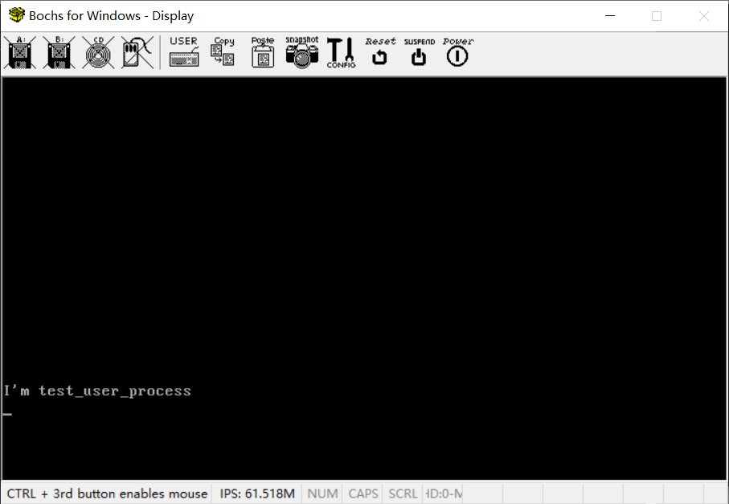
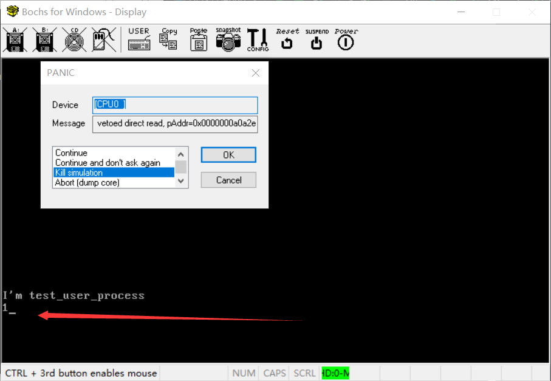

# （十四：补充）关于用户态进程系统调用的问题


total_interrupt_handler.asm

```assembly
; 定义0x80号系统调用中断处理程序
global syscall_handler

; C里面写的系统调用分发器（见syscall_dispatcher.c）
extern syscall_dispatcher

syscall_handler:
    ; 防止嵌套中断，要关闭中断
    cli

    pushad
    push ds
    push es
    push fs
    push gs
    ; 把这几个置换为内核态的段选择子
    mov ax, SELECTOR_DATA
    mov ds, ax
    mov es, ax
    mov fs, ax
    mov ax, SELECTOR_VIDEO
    mov gs, ax

    ; ---------    老规矩，中断开始处理前保存上下文，重新加载段选择子    ---------

    ; --------------- 这里是配合系统调用分发器的设计 ---------------

    push edi                ; 第四个参数
    push esi                ; 第三个参数
    push edx                ; 第二个参数
    push ecx                ; 第一个参数
    push ebx                ; 系统调用号

    call syscall_dispatcher ; 调用C里的系统调用分发器

    add esp, 20             ; 清理栈上的参数（五个，一共是20字节）

    ; 将返回值存到栈上先前保存eax的位置，这样等下就可以弹栈弹回来了
    ; 8个通用寄存器和4个段寄存器，一共12个都是4字节
    ; eax是第一个保存的（所以偏移11 * 4，它的低地址有11个寄存器的值，mov的方向是从低地址到高地址）
    mov [esp + 11 * 4], eax

   ; ---------    老规矩，中断处理完毕恢复上下文    ---------
    pop gs
    pop fs
    pop es
    pop ds
    popad

    jmp $

    ; 数据是CPU自动帮我们压栈的，直接iretd弹回去就是了
    ; 回到用户态
    iretd

```

把 `sti` 改成 `jmp $` 让它停在此处。

开启Bochs的调试器运行到此处之后会陷入死循环，用Ctrl + C打断死循环。

```bash
<bochs:1> c
Next at t=107533806
(0) [0x0000000044b3] 0008:00000000000044b3 (unk. ctxt): jmp .-2 (0x000044b3)      ; ebfe

```

可以定位这句 `jmp $` 的位置是 0x44b3，考虑到这个就2字节，起始位置是 0x44b2，如果sti还在的话，iretd的位置应该是0x44b4，打断点应该打在0x44b4这个位置。

```bash
<bochs:3> reg
rax: 00000000_00000001
rbx: 00000000_00000001
rcx: 00000000_000055e3
rdx: 00000000_00000000
rsp: 00000000_c0101fec
rbp: 00000000_c0101fdc
rsi: 00000000_00000000
rdi: 00000000_00000000
r8 : 00000000_00000000
r9 : 00000000_00000000
r10: 00000000_00000000
r11: 00000000_00000000
r12: 00000000_00000000
r13: 00000000_00000000
r14: 00000000_00000000
r15: 00000000_00000000
rip: 00000000_000044b3
eflags 0x00000082: id vip vif ac vm rf nt IOPL=0 of df if tf SF zf af pf cf

```

这是寄存器。

其中rax（eax是rax的低32位）存放的是返回值，这个没问题，write的返回值就是1，我试了一下返回0x99，rax也是这个值，说明这是没问题的。

看rsp，现在栈顶位置在 `0xc0101fec` 处，这是个虚拟地址，需要找页表来定位物理地址。

```bash
<bochs:4> info tab
cr3: 0x000000132000
0x0000000000000000-0x00000000003fffff -> 0x000000000000-0x0000003fffff
0x00000000c0000000-0x00000000c00fffff -> 0x000000000000-0x0000000fffff
0x00000000c0100000-0x00000000c0119fff -> 0x000000130000-0x000000149fff
0x00000000ffc00000-0x00000000ffc00fff -> 0x000000101000-0x000000101fff
0x00000000fff00000-0x00000000fff00fff -> 0x000000102000-0x000000102fff
0x00000000fffff000-0x00000000ffffffff -> 0x000000132000-0x000000132fff

```

吐槽一下，我的页表我都看过数据都是对的，我也不知道为什么自引用之后会出现

```
0x00000000ffc00000-0x00000000ffc00fff -> 0x000000101000-0x000000101fff
0x00000000fff00000-0x00000000fff00fff -> 0x000000102000-0x000000102fff

```

这两段奇怪的值，我看了一下对应的地方我都清空了，真是Windows上Bochs的未解之谜。

话说回来，定位到这个范围：

```
0x00000000c0100000-0x00000000c0119fff -> 0x000000130000-0x000000149fff
```

简单计算，对应的物理地址是 `0x13fec` 。

打连续12个4字节值看看。

```c
<bochs:6> xp /12xw 0x131fec
[bochs]:
0x0000000000131fec <bogus+       0>:    0x00004886      0x0000002a      0x00000292      0xc0101fb0
0x0000000000131ffc <bogus+      16>:    0x00000032      0x00101023      0x00000000      0x00000000
0x000000000013200c <bogus+      32>:    0x00000000      0x00000000      0x00000000      0x00000000
    
```

栈顶是0x4486，这是返回地址没错，0x2a是用户态代码段的段选择子，0x292是中断处理前的eflags，0x32是用户态数据段的段选择子，也是用户态栈段的段选择子，0x00101023的范围落在页表里面，这张页表是记录低端一对一映射的范围。

把 `jmp $` 改回来，改成 `sti` ，看看是否iretd成功。

intr_syscall.asm

```assembly
[bits 32]

section .text


; 通用系统调用接口
; 参数通过寄存器传递
; eax - 返回值
; ebx, ecx, edx, esi, edi - 各项参数
global intr_syscall

intr_syscall:
    mov ebx, [esp + 4]      ; 系统调用号
    mov ecx, [esp + 8]      ; 第一个参数
    mov edx, [esp + 12]     ; 第二个参数
    mov esi, [esp + 16]     ; 第三个参数
    mov edi, [esp + 20]     ; 第四个参数
    int 0x80                ; 发出0x80号系统调用中断
    cli
    jmp $
    ret                     ; 返回（如果有返回值，都会放在eax寄存器里面，正常读取返回值就行了）

```

报错：

```bash
[CPU0  ]
prefetch: getHostMemAddr vetoed direct read, pAddr=0x0000000a0a2e
```

查看输出文件：

```bash
00005349300i[BIOS  ] IDE time out
00017404781i[BIOS  ] Booting from 0000:7c00
00020174585e[CPU0  ] check_cs(0x4886): not a valid code segment !
00020174616e[CPU0  ] check_cs(0x3e7f): not a valid code segment !
00020174647e[CPU0  ] check_cs(0x3e7f): not a valid code segment !
```

麻了，打断点0x4886看看是什么（因为代码指令增删的原因，前后多打几个）。

```c
(0) [0x0000fffffff0] f000:fff0 (unk. ctxt): jmpf 0xf000:e05b          ; ea5be000f0
<bochs:1> b 0x4886
<bochs:2> b 0x4888
<bochs:3> b 0x488a
<bochs:4> b 0x4884
<bochs:5> b 0x4882
<bochs:6> c
(0) Breakpoint 4, 0x0000000000004884 in ?? ()
Next at t=20173638
(0) [0x000000004884] 002a:0000000000004884 (unk. ctxt): int 0x80                  ; cd80
<bochs:7> next
Next at t=20174554
(0) [0x000000004886] 002a:0000000000004886 (unk. ctxt): ret                       ; c3
<bochs:8>
Next at t=20174555
(0) [0x000000000000] 002a:0000000000000000 (unk. ctxt): (invalid)                 ; ffff
<bochs:9>
Next at t=60374747
(0) [0x000000001564] 0008:0000000000001564 (unk. ctxt): jmp .-2 (0x00001564)      ; ebfe

```

看起来没问题啊。

0x4886就是

```assembly
[bits 32]

section .text


; 通用系统调用接口
; 参数通过寄存器传递
; eax - 返回值
; ebx, ecx, edx, esi, edi - 各项参数
global intr_syscall

intr_syscall:
    mov ebx, [esp + 4]      ; 系统调用号
    mov ecx, [esp + 8]      ; 第一个参数
    mov edx, [esp + 12]     ; 第二个参数
    mov esi, [esp + 16]     ; 第三个参数
    mov edi, [esp + 20]     ; 第四个参数
    int 0x80                ; 发出0x80号系统调用中断
    ret                     ; 返回（如果有返回值，都会放在eax寄存器里面，正常读取返回值就行了）

```

其中 `int 0x80` 是0x4884，`ret` 是0x4886。返回是没问题。

把断点打到0x4886上看看，此时是否回到用户态了。

```bash
<bochs:1> b 0x4886
<bochs:2> c
(0) Breakpoint 1, 0x0000000000004886 in ?? ()
Next at t=20174554
(0) [0x000000004886] 002a:0000000000004886 (unk. ctxt): ret                       ; c3
<bochs:3> sreg
es:0x0032, dh=0x00cfd300, dl=0x0000ffff, valid=1
        Data segment, base=0x00000000, limit=0xffffffff, Read/Write, Accessed
cs:0x002a, dh=0x00cfd900, dl=0x0000ffff, valid=1
        Code segment, base=0x00000000, limit=0xffffffff, Execute-Only, Non-Conforming, Accessed, 32-bit
ss:0x0032, dh=0x00cfd300, dl=0x0000ffff, valid=1
        Data segment, base=0x00000000, limit=0xffffffff, Read/Write, Accessed
ds:0x0032, dh=0x00cfd300, dl=0x0000ffff, valid=1
        Data segment, base=0x00000000, limit=0xffffffff, Read/Write, Accessed
fs:0x0032, dh=0x00cfd300, dl=0x0000ffff, valid=1
        Data segment, base=0x00000000, limit=0xffffffff, Read/Write, Accessed
gs:0x0000, dh=0x00001000, dl=0x00000000, valid=0
ldtr:0x0000, dh=0x00008200, dl=0x0000ffff, valid=1
tr:0x0020, dh=0xc0808b01, dl=0x09000067, valid=1
gdtr:base=0x00000000c0010800, limit=0xff
idtr:base=0x00000000c0010000, limit=0x7ff

```

显然是回到用户态了，cs都是0x2a了。

```bash
<bochs:4> reg
rax: 00000000_00000001
rbx: 00000000_00000001
rcx: 00000000_000055e3
rdx: 00000000_00000000
rsp: 00000000_c0101fb0
rbp: 00000000_c0101fdc
rsi: 00000000_00000000
rdi: 00000000_00000000
r8 : 00000000_00000000
r9 : 00000000_00000000
r10: 00000000_00000000
r11: 00000000_00000000
r12: 00000000_00000000
r13: 00000000_00000000
r14: 00000000_00000000
r15: 00000000_00000000
rip: 00000000_00004886
eflags 0x00000292: id vip vif ac vm rf nt IOPL=0 of df IF tf SF zf AF pf cf
```

eflags也恢复原状了，那就看看栈顶，物理地址是0x131fb0。

```bash
<bochs:5> xp /12xw 0x131fb0
[bochs]:
0x0000000000131fb0 <bogus+       0>:    0x00000000      0x00000000      0x00000000      0x00000000
0x0000000000131fc0 <bogus+      16>:    0x00000032      0x00000032      0x00000032      0x00000000
0x0000000000131fd0 <bogus+      32>:    0x00000000      0xc0101fdc      0xc0101fec      0x00000001
```

得，比之前还乱。

我之前想过是不是没给进程分配用户级栈的原因（《操作系统真象还原》里面给每个进程都分配了两个栈，一个是内核线程都自带的PCB所在的栈，一个是单独分配的用户栈），之前做过，但是实现起来没效果，就删掉了，再试试吧。

process.c

```c
// 给出一个中断栈数据，跳入用户态
extern void switch_to_user_mode();

// x86平台从内核线程到用户进程，普遍做法是用iretd指令让CPU自动进入用户态
// switch_to_user_mode就是这么编写的
// 本质上和线程切换任务的方式类似，让iretd指令帮助我们自动跳进入口函数

// 用一个包装函数，来做初始化工作，辅助进入用户态
void wrap_task_to_process() {

    // 先禁止中断，我怕设置不完成
    enum intr_status old_status = intr_disable();
    // 把之前没完成的设置完成了，申请一个页作为用户态进程栈
    struct interrupt_stack* int_stack = (struct interrupt_stack*)((uint32_t)(running_task()) + PG_SIZE - sizeof(struct task_info_stack));

    void *user_stack = malloc_page(USER_FLAG, 1);
    if(!user_stack) {
        // 申请不了，回滚
        task_cancel(running_task());
        intr_set_status(old_status);
        return;
    }
    int_stack->user_esp = (uint32_t)user_stack + PG_SIZE;
    // 把这个设置完成了之后就可以进入用户态了
    switch_to_user_mode();
}

struct task* process_create(char *name, uint32_t entry_function){
    // 关闭中断
    enum intr_status old_status = intr_disable();

    // 创建一个任务，这个任务其实就是跳进用户态
    // 真正的入口函数在中断栈里面
    // 默认进程和内核平等，内核优先级是31
    struct task* new_task = task_create(name, 31, wrap_task_to_process, NULL);
    if (new_task == NULL) {
        intr_set_status(old_status);
        return NULL;
    }

    // 设置用户进程的页目录表
    new_task->pgdir = create_user_page_dir();
    if (!new_task->pgdir) {
        task_cancel(new_task);
        intr_set_status(old_status);
        return NULL;
    }

    // 创建并初始化用户进程虚拟地址位图
    if(init_user_virtual_addr(new_task) == 0) {
        return NULL;
    }

    // 加载用户进程，设置入口点
    // 这么做是为了以后扩展到能从文件里面加载入口函数
    uint32_t entry_point = entry_function; // entry_function 作为入口函数
    if (entry_point == 0) {
        task_cancel(new_task);
        intr_set_status(old_status);
        return NULL;
    }

    // 设置中断栈
    // 因为创建任务的时候，先预留了中断栈，再预留了任务信息栈，所以现在self_stack指向的是任务信息栈的开头
    // 越过任务信息栈，才到中断栈
    struct interrupt_stack* int_stack = (struct interrupt_stack*)((uint32_t)(new_task->self_stack) + sizeof(struct task_info_stack));

    // 中断栈的意义就在于可以通过伪装成中断恢复的形式，从内核态跳入用户态
    int_stack->eip = entry_point; // iretd的时候，就会直接从这里跳进用户进程的入口函数了
    int_stack->cs = SELECTOR_U_CODE;
    int_stack->eflags = 0x202; // IF = 1, IOPL = 0

    int_stack->ds = SELECTOR_U_DATA;
    int_stack->es = SELECTOR_U_DATA;
    int_stack->fs = SELECTOR_U_DATA;
    int_stack->gs = 0;  // 用户态不需要这个，也不能有这个

    int_stack->esp = (uint32_t)int_stack + 14 * 4;  // 以防万一，我把这个esp的值设置到CPU自动压栈的错误码位置（这个其实cpu会自动调整）

    int_stack->user_ss = SELECTOR_U_STACK;   // 内核态和用户态的栈段选择子用的都是数据段选择子
    // 这个操作挪到进程包装函数里面了
    //int_stack->user_esp = (uint32_t)new_task + PG_SIZE; // 与TSS保持一致

    // 恢复中断，等待调度
    intr_set_status(old_status);

    return new_task;
}

```

switch_to_user_mode.asm

```assembly
[bits 32]   ; 显式指定为32位汇编

section .text

extern put_char
extern put_str
extern put_int

global switch_to_user_mode

; void switch_to_user_mode();

; C语言遵循cdecl调用约定标准
; 调用时候会按顺序压栈：参数（从右到左）、返回地址
switch_to_user_mode:
    ; 关闭中断，防止被切换
    cli
    jmp $
    ; 进入这里的时候，任务信息栈已经结束它的作用了
    ; 理论上此时esp位于中断栈的栈顶
    ; 实测结果，距离中断栈栈顶44个字节（我也不知道怎么回事，反正我是没搞明白）
    ; 实测进入switch_to_user_mode的时候，esp距离中断栈栈顶是44个字节

    ; 这里要使用中断栈里面的数据，通过iretd来跳入用户态
    ; 我也不知道为什么压了44个字节的也不知道是什么东西，反正就是到这地方才到中断栈的栈顶
    ; 任务信息栈也就32个字节大小，多出来的12个字节是怎么回事我也不懂了

    add esp, 44

    ; 跳过最开始的中断号和手动压栈错误码
    add esp, 8

    pop gs                  ; 恢复各个段寄存器
    pop fs
    pop es
    pop ds

    popad                   ; 恢复所有通用寄存器

    ; 从内核态跳入用户态，绝不可能有CPU压入的错误码，所以跳过错误码（切换到用户态错误码也没用）
    add esp, 4

    ; 先前已经做好了数据
    ; 不用使用sti开启中断，我们做好的数据里面eflags已经把中断的if位设置为1了，也就是打开中断
    ; 使用 iretd 指令切换到用户态（恢复到我们设置好的eip、cs、eflags、esp、ss）
    iretd

```

用 `jmp $` 来阻塞，看看现在栈顶在哪。

中断栈的结构是。

```c
// 中断栈数据（叫中断栈，一个是因为它真的存储中断数据，而是用其模拟中断处理恢复上下文的手段进入用户态）
struct interrupt_stack {
    uint32_t interrupt_number;  // 中断号
    uint32_t manual_error_code; // 手动压栈的错误码 (如果没有错误码，这里存储0)
    uint32_t gs;         // 附加段寄存器 GS
    uint32_t fs;         // 附加段寄存器 FS
    uint32_t es;         // 额外段寄存器 ES
    uint32_t ds;         // 数据段寄存器 DS
    uint32_t edi;        // 目标变址寄存器 EDI
    uint32_t esi;        // 源变址寄存器 ESI
    uint32_t ebp;        // 基址指针寄存器 EBP
    uint32_t esp;        // 栈指针寄存器 ESP（这个没什么用，用不到的）
    uint32_t ebx;        // 通用寄存器 EBX
    uint32_t edx;        // 通用寄存器 EDX
    uint32_t ecx;        // 通用寄存器 ECX
    uint32_t eax;        // 通用寄存器 EAX
    uint32_t error_code; // CPU自动压栈的错误码 (可能有，也可能没有，但是从内核态跳入用户态的时候绝对没有)
    uint32_t eip;        // 指令指针寄存器
    uint32_t cs;         // 代码段寄存器
    uint32_t eflags;     // 标志寄存器
    uint32_t user_esp;   // 低特权级进入高特权级的时候CPU自动压的栈指针 ESP
    uint32_t user_ss;    // 低特权级进入高特权级的时候CPU自动压的栈段选择子 SS
};

```

一共是20个数据，都是4字节。用16进制计算器可以算出来。

0x1000(16) - 80(10) = 4096 - 80 = 4016(10) = 0xfb0(16)。

```bash
<bochs:2> reg
rax: 00000000_c0101fd0
rbx: 00000000_00000000
rcx: 00000000_01000000
rdx: 00000000_08049000
rsp: 00000000_c0101f64
rbp: 00000000_c0101f80
rsi: 00000000_00000000
rdi: 00000000_00000000
r8 : 00000000_00000000
r9 : 00000000_00000000
r10: 00000000_00000000
r11: 00000000_00000000
r12: 00000000_00000000
r13: 00000000_00000000
r14: 00000000_00000000
r15: 00000000_00000000
rip: 00000000_00004e01
eflags 0x00000006: id vip vif ac vm rf nt IOPL=0 of df if tf sf zf af PF cf

```

现在rsp是0xc0101f64，对应的物理地址应该是0x131f64，对应的中断栈虚拟地址位置应该是0xc0101fb0。

16进制计算器计算的结果是：0xc0101fb0 - 0xc0101f64 = 0x4c = 76(10)。

所以要先add esp, 76。

这个栈里面到底存了什么东西才用了76个4字节的位置？

```bash
<bochs:3> xp /76xw 0x131f64
[bochs]:
0x0000000000131f64 <bogus+       0>:    0x000054e7      0x00000000      0x08048000      0xc0101fd0
0x0000000000131f74 <bogus+      16>:    0x00000001      0x00000000      0x00000000      0xc0101fa0
0x0000000000131f84 <bogus+      32>:    0x0000366f      0x00000000      0x00000000      0x00000000
0x0000000000131f94 <bogus+      48>:    0x00000000      0x00000000      0x00000000      0x00000000
0x0000000000131fa4 <bogus+      64>:    0x00000000      0x0000547f      0x00000000      0x00000000
0x0000000000131fb4 <bogus+      80>:    0x00000000      0x00000000      0x00000032      0x00000032
0x0000000000131fc4 <bogus+      96>:    0x00000032      0x00000000      0x00000000      0x00000000
0x0000000000131fd4 <bogus+     112>:    0xc0101fe8      0x00000000      0x00000000      0x00000000
0x0000000000131fe4 <bogus+     128>:    0x00000000      0x00000000      0x00001566      0x0000002a
0x0000000000131ff4 <bogus+     144>:    0x00000202      0x00000000      0x00000032      0x00101023
0x0000000000132004 <bogus+     160>:    0x00000000      0x00000000      0x00000000      0x00000000
0x0000000000132014 <bogus+     176>:    0x00000000      0x08049000      0x00000000      0x00000000
0x0000000000132024 <bogus+     192>:    0x00000000      0x00000000      0x00000000      0x00000000
0x0000000000132034 <bogus+     208>:    0x00000000      0x00000000      0x00000000      0x00000000
0x0000000000132044 <bogus+     224>:    0x00000000      0x00000000      0x00000000      0x00000000
0x0000000000132054 <bogus+     240>:    0x00000000      0x00000000      0x00000000      0x00000000
0x0000000000132064 <bogus+     256>:    0x00000000      0x00000000      0x00000000      0x00000000
0x0000000000132074 <bogus+     272>:    0x00000000      0x00000000      0x00000000      0x0014a003
0x0000000000132084 <bogus+     288>:    0x00000000      0x00000000      0x00000000      0x00000000

```

我看不懂，但我大为震撼。任务信息栈早就用完了，这些东西属实是让我没想到（我知道包装函数里面有操作，但是能搞出76个4字节，我也是震撼）。

```assembly
[bits 32]   ; 显式指定为32位汇编

section .text

extern put_char
extern put_str
extern put_int

global switch_to_user_mode

; void switch_to_user_mode();

; C语言遵循cdecl调用约定标准
; 调用时候会按顺序压栈：参数（从右到左）、返回地址
switch_to_user_mode:
    ; 关闭中断，防止被切换
    cli
    ; 进入这里的时候，任务信息栈已经结束它的作用了
    ; 理论上此时esp位于中断栈的栈顶
    ; 实测结果，距离中断栈栈顶44个字节（我也不知道怎么回事，反正我是没搞明白）
    ; 实测进入switch_to_user_mode的时候，esp距离中断栈栈顶是44个字节

    ; 这里要使用中断栈里面的数据，通过iretd来跳入用户态
    ; 操作过程一团乱麻，不看了，反正实测就是76个字节就得了

    add esp, 76

    ; 跳过最开始的中断号和手动压栈错误码
    add esp, 8

    pop gs                  ; 恢复各个段寄存器
    pop fs
    pop es
    pop ds

    popad                   ; 恢复所有通用寄存器

    ; 从内核态跳入用户态，绝不可能有CPU压入的错误码，所以跳过错误码（切换到用户态错误码也没用）
    add esp, 4

    ; 先前已经做好了数据
    ; 不用使用sti开启中断，我们做好的数据里面eflags已经把中断的if位设置为1了，也就是打开中断
    ; 使用 iretd 指令切换到用户态（恢复到我们设置好的eip、cs、eflags、esp、ss）
    iretd

```

好吧，这次尝试成功了！



代码：

```c
#include "../lib/lib_kernel/lib_kernel.h"
#include "kernel_page/kernel_page.h"
#include "kernel_gdt/kernel_gdt.h"
#include "kernel_idt/kernel_idt.h"
#include "kernel_device/kernel_device.h"
#include "kernel_memory/kernel_memory.h"
#include "kernel_task/kernel_task.h"
#include "../devices/console/console.h"
#include "kernel_buffer/kernel_buffer.h"
#include "../user/process/process.h"

#include "../lib/lib_user/syscall.h"

// 测试进程
void test_user_process(void);

void kernel_main(void) {

    uint32_t total_physical_memory = *((uint32_t *)(0xa09));
    // 内存分页初始化
    init_paging();
    // 重新加载gdt
    setup_gdt();
    // 调整ESP，将栈指针切换到高地址（栈大小增加到0x1500）
    switch_esp_virtual_addr();
    // 初始化idt
    init_idt();
    // 先初始化任务管理结构（这样所有任务就能用统一的内存管理逻辑了）
    init_multitasking();
    // 初始化内存管理
    init_memory(total_physical_memory);
    // 初始化所有设备
    init_all_devices();

    process_create("test_user_process", (uint32_t)test_user_process);

    // 允许PIC_IRQ0中断，才可以让定时器调度线程
    enable_pic_irq_interrupt(0);
    // 开启全局中断
    intr_enable();

    // 进入内核主循环或其它初始化代码
    for(;;) {

    }
    // 退出主循环卸载设备驱动
    exit_all_devices();
}

// 测试作为用户进程开启的函数
void test_user_process(void) {
    // 用户进程无权访问内核空间
    // 需要内核拷贝到用户空间，因为内核特权级高
    char name[64] = { 0 };

    get_process_name(name);
    write("\nI'm ");
    write(name);
    write("\n");

    for(;;) {
    }
}

```

实验看看有什么问题：

syscall.c，增加一个系统调用。

```c
// 用户版本的put_int
uint32_t print_int(uint32_t num) {
    return intr_syscall(5,num,0,0,0);
}

```

syscall_dispatcher.c增加一个分发

```c
    if(syscall_number == 5) {
        console_put_int(arg1);
        return 1;
    }
```

kernel.c

```c
// 测试作为用户进程开启的函数
void test_user_process(void) {
    // 用户进程无权访问内核空间
    // 需要内核拷贝到用户空间，因为内核特权级高
    char name[64] = { 0 };

    get_process_name(name);
    write("\nI'm ");
    write(name);
    write("\n");

    uint32_t count = 0;

    for(;;) {
        count++;
        print_int(count);
        for(uint32_t i = 0; i < 16 * UINT16_MAX; i++);
    }
}

```



行吧，旧问题刚解决，新问题又出来了。

**思来想去，我上次设置了用户进程栈之后，也是走到这一步失败的，那次我也是把系统调用放到进程的for循环里面用的。**

还是先看看报错吧。

```bash
00017404781i[BIOS  ] Booting from 0000:7c00
00022733460e[CPU0  ] check_cs(0x163c): not a valid code segment !
00022733491e[CPU0  ] check_cs(0x3f7e): non-conforming code seg descriptor dpl != cpl, dpl=3, cpl=2
00022733522e[CPU0  ] check_cs(0x3f4f): not a valid code segment !

```

我人都麻了，怎么又是dpl=3，cpl=2！！！！

这是真没办法了，这个问题我真的解决不了，Windows上的Bochs太坑了。