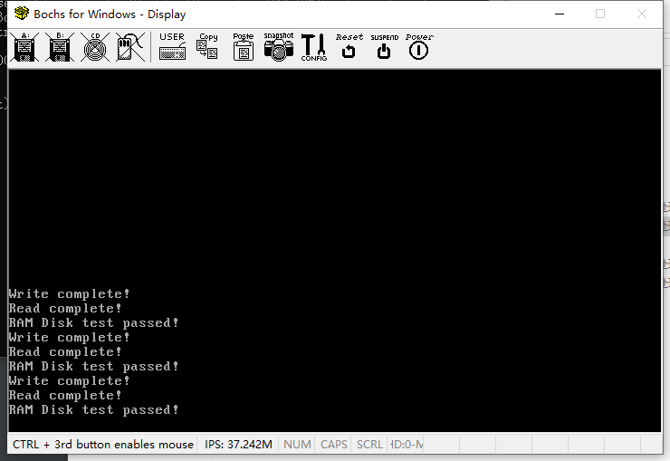

# （十五）虚拟外存设备RAMDISK

文件系统，有外存存在才有意义。但是外存驱动没那么好弄。

我就糊弄糊弄，做了个简单的用内存模拟外存的RAMDISK出来，这样避免操作硬件的各种麻烦。

## 1. 虚拟机配置和页表调整

我用的Bochs配置更新一下，Configuration.bxrc

```ini
memory: host=64, guest=64
# 内存：主机和客户机均分配64MB内存
```

kernel_page.c

```c
//
// Created by huangcheng on 2024/5/23.
//

#include "kernel_page.h"

void setup_page_directory(page_directory_entry_t* page_directory) {
    // 清空整个页目录表
    memset(page_directory, 0, 0x1000);

    // 第一个页表放低端4MB映射
    page_table_entry_t* first_page_table = (page_table_entry_t*) ((uint32_t)page_directory + 0x1000);

    // 初始化1024个页表条目（覆盖低端4MB，包括了整个位图的区域）
    for (int i = 0; i < 1024; ++i) {
        // 设置页表项 (PTE)
        first_page_table[i].present = 1;     // 页表项存在
        first_page_table[i].rw = 1;          // 页表项可读写
        first_page_table[i].us = 0;          // 页表项为超级用户权限

        first_page_table[i].frame = (i * 0x1000) >> 12;       // 页框地址，物理地址右移12位
        // 等效于 first_page_table[i].frame = i，但这才是完整的计算逻辑
    }
    // 设置页目录表项
    page_directory[0].present = 1;     // 页目录表项存在
    page_directory[0].rw = 1;          // 页目录表项可读写
    page_directory[0].us = 0;          // 页目录表项为超级用户权限
    page_directory[0].table = (uint32_t)first_page_table >> 12;       // 页表地址，物理地址右移12位

    // 设置页目录表的第768个条目，映射高地址内存 (从3GB开始)
    // 说清楚就是，768 * 1024 = 3GB = 0xc0000000，从这里开始，低地址和高地址可以很轻易计算了
    // 这里需要再用一页
    page_table_entry_t* second_page_table = (page_table_entry_t*) ((uint32_t)first_page_table + 0x1000);
    // 初始化256个页表条目（对应低端1MB）
    for (int i = 0; i < 256; ++i) {
        // 设置页表项 (PTE)
        second_page_table[i].present = 1;     // 页表项存在
        second_page_table[i].rw = 1;          // 页表项可读写
        second_page_table[i].us = 0;          // 页表项为超级用户权限

        second_page_table[i].frame = (i * 0x1000) >> 12;       // 页框地址，物理地址右移12位
    }
    page_directory[768].present = 1;     // 页目录表项存在
    page_directory[768].rw = 1;          // 页目录表项可读写
    page_directory[768].us = 0;          // 页目录表项为超级用户权限
    page_directory[768].table = ((uint32_t)second_page_table) >> 12;  // 页表地址

    // 页目录表最后一项自引用
    // 其作用是快速寻址到页目录表
    // 只要最后一项自引用了，0xfffff000就是当前页目录表所在的地方，找页目录表地址就很方便了，直接变成了常量
    page_directory[1023].present = 1;     // 页表项存在
    page_directory[1023].rw = 1;          // 页表项可读写
    page_directory[1023].us = 0;          // 页表项为超级用户权限
    page_directory[1023].table = (uint32_t)page_directory >> 12;  // 页表地址

    // 添加新的页表，映射48MB到64MB的物理内存到0xA0000000处（用于虚拟设备ramdisk）
    // 由于需要映射ramdisk设备的内存，需要建立4页的页表。
    // 怕冲突其他的，所以塞在0x122000之后，0x130000之前，又不干涉内核虚拟位图（内核虚拟位图从0x122000开始连续8页），所以起点为0x12a000，满四页正好到0x12efff
    page_table_entry_t* ramdisk_page_table = (page_table_entry_t*)0x12a000;
    for (int i = 0; i < 4096; ++i) { // 16MB / 4KB = 4096 个页表项，一个页表项4字节，需要4页
        ramdisk_page_table[i].present = 1;     // 页表项存在
        ramdisk_page_table[i].rw = 1;          // 页表项可读写
        ramdisk_page_table[i].us = 0;          // 页表项为超级用户权限
        ramdisk_page_table[i].frame = (0x03000000 >> 12) + i; // 页框地址，物理地址右移12位
    }

    // 设置页目录表项，将其映射到0xA0000000
    for (int i = 0; i < 4; i++) {
        page_directory[640 + i].present = 1;     // 页目录表项存在
        page_directory[640 + i].rw = 1;          // 页目录表项可读写
        page_directory[640 + i].us = 0;          // 页目录表项为超级用户权限
        page_directory[640 + i].table = ((0x12a000 + i * 0x1000) >> 12); // 页表地址
    }
}


void init_paging() {
    // 明确页目录表的起始地址是0x100000（1MB处）
    page_directory_entry_t* page_directory = (page_directory_entry_t*) PAGE_DIR_TABLE_POS;
    // 设置页目录表
    setup_page_directory(page_directory);
    // 载入内核的页目录表，这里要寄存器操作，需要用汇编写
    load_page_directory(PAGE_DIR_TABLE_POS);
    // 启用分页
    enable_paging();
}

```

kernel_memory.c，内存管理范围限制在48MB以内。

```c
// 内存管理初始化
void init_memory(uint32_t total_physical_memory) {
    // 物理地址位图，一页是一位，一字节8位
    global_bitmap_physical_memory->bits = (uint8_t *)GLOBAL_BITMAP_PHYSICAL_BASE;
    // 这里做个临时修改，把最后的16MB留出给ramdisk，其他的就是给内存管理自由发挥
    global_bitmap_physical_memory->btmp_bytes_len = (total_physical_memory - 0x01000000) / PG_SIZE / 8;
    bitmap_init(global_bitmap_physical_memory);
    // 物理地址上已经占据了的置为1
    // 低端1MB全部被内核占据了，还有页表和页目录表、位图
    bitmap_set_range(global_bitmap_physical_memory, 0, 0x12a000 / PG_SIZE, 1);

    // 虚拟地址管理的设置（内核虚拟地址写在线程的TCB里面）
    KERNEL_TCB->process_virtual_address.virtual_addr_start = KERNEL_VIRTUAL_ADDR_START;
    // 内核虚拟地址上限
    KERNEL_TCB->process_virtual_address.bitmap_virtual_memory.btmp_bytes_len = KERNEL_BITMAP_VIRTUAL_BYTE_LENGTH;
    bitmap_init(&KERNEL_TCB->process_virtual_address.bitmap_virtual_memory);
}
```


## 2. 设备管理框架调整

其实就是把 `input_buffer` 和 `output_buffer` 改名了，改成了 `data_buffer` 和 `command_buffer` ，**模拟PIC设置时的数据端口和命令端口**。其中命令缓冲区用于内核对设备下达指令以及写入数据（注意，如果内核要对设备写入数据的话，数据在命令缓冲区里），数据缓冲区存放的则是设备对内核传输的数据。

kernel_device.h

```c
//
// Created by huangcheng on 2024/5/27.
//

#ifndef HOS_KERNEL_DEVICE_H
#define HOS_KERNEL_DEVICE_H

#include "../../lib/lib_kernel/lib_kernel.h"
#include "../kernel_buffer/kernel_buffer.h"

// 统一的驱动接口结构体（这个结构体的实例一律放在驱动段）
struct driver {
    char driver_name[64];                       // 驱动名称
    void (*init)(void);                         // 初始化函数
    void (*exit)(void);                         // 退出函数
    int32_t irq;                                // IRQ 中断号（如果没有中断处理函数填-1）
    void (*irq_interrupt_handler)(void);        // 中断处理函数（可选）

    // 因为注册宏里面改了四字节对齐，这里用uint_8_t也是四字节，干脆用uint_32_t填满

    uint32_t need_data_buffer;                  // 需要分配数据缓冲区就填1，不然填0
    uint32_t need_command_buffer;               // 需要分配命令缓冲区就填1，不然填0

    struct kernel_buffer *data_buffer;          // 指向数据缓冲区的指针
    struct kernel_buffer *command_buffer;       // 指向命令缓冲区的指针

    struct list_node node;                      // 用于串联到驱动链表上的链表结点

    void *driver_task_function;                 // 用于创建内核任务的函数入口
    // 这个内核任务负责具体的对设备读写，与缓冲区进行交互
    // 依赖于设备驱动的实现，没有也无所谓

    void *driver_task_function_args;            // 理论上应该不用传参，实际上不知道，多冗余一些好
};

// 初始化所有设备
void init_all_devices();
// 移除所有设备
void exit_all_devices();
// 添加单个驱动并初始化
void driver_add(struct driver* drv);
// 移除单个驱动并卸载
void driver_remove(const char *driver_name);
// 获取设备驱动
struct driver* get_driver(const char *driver_name);
// 对设备（驱动）读，本质上就是读其数据缓冲区（成功返回读出数量（以字节计算），不成功返回-1）
int32_t device_read(struct driver *drv, char *data, uint32_t count);
// 对设备（驱动）写，本质上就是写其命令缓冲区（成功返回写入数量（以字节计算），不成功返回-1）
int32_t device_write(struct driver *drv, char *data, uint32_t count);

// 这个注册宏的作用就是把数据放在驱动段（而且告诉编译器这个是被使用的，不能优化掉），它会定义一个驱动结构体实例（增加4字节对齐）
#define REGISTER_DRIVER(drv) \
    __attribute__((section(".drivers"), used, aligned(4))) struct driver drv =


#endif //HOS_KERNEL_DEVICE_H

```

kernel_device.c

```c
// 回收缓冲区
void free_driver_buffer(struct driver *drv) {

    // 需要内核缓冲区，而且已经被分配了缓冲区的情况
    if (drv->need_data_buffer && drv->data_buffer) {
        // 回收缓冲区
        kernel_buffer_free(drv->data_buffer);
        // 清空指针
        drv->data_buffer = NULL;
    }

    // 需要内核缓冲区，而且已经被分配了缓冲区的情况
    if (drv->need_command_buffer && drv->command_buffer) {
        // 回收缓冲区
        kernel_buffer_free(drv->command_buffer);
        // 清空指针
        drv->command_buffer = NULL;
    }

}

// 分配缓冲区，原子操作，失败回滚，返回1为成功，0为失败
uint8_t alloc_driver_buffer(struct driver *drv) {
    struct kernel_buffer *data_buf = NULL;
    struct kernel_buffer *command_buf = NULL;

    // 尝试分配数据缓冲区
    if (drv->need_data_buffer) {
        if (drv->data_buffer) {
            // 如果已经存在数据缓冲区，直接返回，不做任何更改
            return 0;
        } else {
            data_buf = kernel_buffer_create();
            if (!data_buf) {
                // 分配失败，直接返回，不做任何更改
                return 0;
            }
        }
    }

    // 尝试分配命令缓冲区
    if (drv->need_command_buffer) {
        if (drv->command_buffer) {
            // 如果已经存在命令缓冲区，先释放已分配的数据缓冲区（如果有的话）
            if (data_buf) {
                kernel_buffer_free(data_buf);
            }
            // 直接返回，不做任何更改
            return 0;
        } else {
            command_buf = kernel_buffer_create();
            if (!command_buf) {
                // 分配失败，回滚已分配的数据缓冲区（如果有的话）
                if (data_buf) {
                    kernel_buffer_free(data_buf);
                }
                // 直接返回，不做任何更改
                return 0;
            }
        }
    }

    // 如果成功分配了缓冲区，更新驱动的缓冲区指针
    // 这里的指针如果不为空，肯定说明要求分配了，所以直接更新即可，不用再次判定是否要求分配了
    if (data_buf) {
        drv->data_buffer = data_buf;
    }
    if (command_buf) {
        drv->command_buffer = command_buf;
    }

    return 1;
}

// 其他不变

// 对设备（驱动）读，本质上就是读其数据缓冲区（成功返回读出数量（以字节计算），不成功返回-1）
int32_t device_read(struct driver *drv, char *data, uint32_t count) {
    if(!drv || !(drv->data_buffer)) {
        return -1;
    }

    uint32_t total_read = 0;
    uint32_t to_read = 0;
    uint32_t chunk_size = 3072; // 限制一次性读3KB

    while (total_read < count) {
        to_read = (count - total_read > chunk_size) ? chunk_size : count - total_read;
        kernel_buffer_read(drv->data_buffer, data + total_read, to_read);
        total_read += to_read;
    }

    return total_read;
}
// 对设备（驱动）写，本质上就是写其命令缓冲区（成功返回写入数量（以字节计算），不成功返回-1）
int32_t device_write(struct driver *drv, char *data, uint32_t count) {
    if(!drv || !(drv->command_buffer)) {
        return -1;
    }

    uint32_t total_written = 0;
    uint32_t to_write = 0;
    uint32_t chunk_size = 3072; // 限制一次性写3KB

    while (total_written < count) {
        to_write = (count - total_written > chunk_size) ? chunk_size : count - total_written;
        kernel_buffer_write(drv->command_buffer, data + total_written, to_write);
        total_written += to_write;
    }

    return total_written;
}

```

对应的，keyboard驱动的结构体需要改一改。

```c
// 注册宏，定义一个驱动结构体，把驱动结构体实例放到驱动段
REGISTER_DRIVER(keyboard_driver){
        .driver_name = "keyboard",
        .init = keyboard_init,
        .exit = NULL,
        .irq = 1,
        .irq_interrupt_handler = interrupt_keyboard_handler,
        .need_data_buffer = 1,    // 需要输入缓冲区
        .data_buffer = NULL,
};

/* 键盘初始化 */
void keyboard_init() {
    keyboard_buffer = keyboard_driver.data_buffer;
    // 如果分配不到缓冲区，初始化失败
    if(!keyboard_buffer) {
        put_str("\nkeyboard_init_fail!\n");
        for(;;);
    }
}

```


## 3. 虚拟外存设备RAM的实现

在devices文件夹下新建ramdisk文件夹，建立ramdisk.h和ramdisk.c，以及Makefile

ramdisk.h

```c
//
// Created by Administrator on 2024/6/16.
//

#ifndef HOS_RAMDISK_H
#define HOS_RAMDISK_H

#include "../../lib/lib_kernel/lib_kernel.h"

// 设备大小
#define RAMDISK_SIZE (16 * 1024 * 1024) // 16MB
// 一个扇区的大小
#define SECTOR_SIZE 512

// 读取和写入操作标志
#define READ_CMD 0x52454144 // ASCII "READ"
#define WRITE_CMD 0x57524954 // ASCII "WRIT"
#define DELETE_CMD 0x44454C45 // ASCII "DELE"

int32_t ramdisk_read(int sector, void *buffer, uint32_t size);
int32_t ramdisk_write(int sector, const void *buffer, uint32_t size);
void ramdisk_task_function();

#endif //HOS_RAMDISK_H

```

ramdisk.c

```c
//
// Created by Administrator on 2024/6/16.
//

#include "ramdisk.h"
#include "../../kernel/kernel_device/kernel_device.h"
#include "../console/console.h"
#include "../../kernel/kernel_task/kernel_task.h"

// 注册驱动结构体
REGISTER_DRIVER(ramdisk_driver) {
        .driver_name = "ramdisk",
        .init = NULL,
        .exit = NULL,
        .irq = -1, // 没有中断处理
        .irq_interrupt_handler = NULL,
        .need_data_buffer = 1,
        .need_command_buffer = 1,
        .data_buffer = NULL,
        .command_buffer = NULL,
        .driver_task_function = ramdisk_task_function,
        .driver_task_function_args = NULL,
};

// 仅限此处使用，所以要用static，限制作用域在此文件中
static uint8_t *ramdisk = (uint8_t *)0xA0000000; // 定义RAM Disk的存储空间

int32_t ramdisk_read(int sector, void *buffer, uint32_t size) {
    if (sector * SECTOR_SIZE + size > RAMDISK_SIZE) {
        return -1; // 超出范围
    }
    memcpy(buffer, ramdisk + sector * SECTOR_SIZE, size);
    return size;
}

int32_t ramdisk_write(int sector, const void *buffer, uint32_t size) {
    if (sector * SECTOR_SIZE + size > RAMDISK_SIZE) {
        return -1; // 超出范围
    }
    memcpy(ramdisk + sector * SECTOR_SIZE, buffer, size);
    return size;
}


// 操作约定，最前12个字节，分别是三个四字节数
// 代表扇区号、操作长度、操作命令
void ramdisk_task_function() {
    uint32_t sector, size, command;
    uint32_t bytes_processed;
    char buffer[1024];

    for(;;) {
        // 每次循环先清空
        sector = 0;
        size = 0;
        command = 0;
        // 先处理命令缓冲区中的数据

        // 读取扇区、大小和命令标志，这是事先约定好的命令数据规格，每个操作都必备的
        kernel_buffer_read(ramdisk_driver.command_buffer, (char *)&sector, sizeof(uint32_t));
        kernel_buffer_read(ramdisk_driver.command_buffer, (char *)&size, sizeof(uint32_t));
        kernel_buffer_read(ramdisk_driver.command_buffer, (char *)&command, sizeof(uint32_t));

        // 根据命令执行相应操作
        switch (command) {
            case WRITE_CMD:
                // 处理写请求

                // 写入数据
                bytes_processed = 0;
                while (bytes_processed < size) {
                    uint32_t chunk_size = (size - bytes_processed > 1024) ? 1024 : (size - bytes_processed);
                    // 命令缓冲区中剩余的数据就是要写入的实际数据
                    kernel_buffer_read(ramdisk_driver.command_buffer, buffer, chunk_size);

                    ramdisk_write(sector + (bytes_processed / SECTOR_SIZE), buffer, chunk_size);
                    bytes_processed += chunk_size;
                }
                break;

            case READ_CMD:
                // 处理读请求

                bytes_processed = 0;
                while (bytes_processed < size) {
                    uint32_t chunk_size = (size - bytes_processed > 1024) ? 1024 : (size - bytes_processed);
                    ramdisk_read(sector + (bytes_processed / SECTOR_SIZE), buffer, chunk_size);
                    // 读出来的数据写到数据缓冲区
                    kernel_buffer_write(ramdisk_driver.data_buffer, buffer, chunk_size);
                    bytes_processed += chunk_size;
                }
                break;

            case DELETE_CMD:
                // 处理删除请求
                memset(ramdisk + sector * SECTOR_SIZE, 0, size);
                break;

            default:
                // 处理未知命令
                console_put_str("Unknown command received!\n");
                break;
        }
    }
}

```

如果命令缓冲区中没有相关的命令，这个任务将会一直被阻塞，不会浪费CPU资源。

Makefile

```makefile

# 目录
DEVICE_DIR = ..
RAMDISK_DIR = .

# 源文件
RAMDISK_C_SRC = $(RAMDISK_DIR)/ramdisk.c

# C 编译标志
CFLAGS = -ffreestanding -nostdlib -Wall -Wextra

# 标签标记所有的任务（输出什么文件），方便修改
DEVICE_OBJS = $(DEVICE_DIR)/ramdisk.o

.PHONY: all

all: $(DEVICE_OBJS)

# C 文件生成 汇编文件，再汇编生成.o，为什么这么做之前说过了，这个gcc的汇编器不知道什么问题
# 编出来放到模块文件夹devices去，别放在这里，方便主Makefile找
$(DEVICE_DIR)/ramdisk.o: $(RAMDISK_C_SRC)
	$(GCC) $(CFLAGS) -S -o $(RAMDISK_DIR)/ramdisk.asm $<
	$(AS) -o $@ $(RAMDISK_DIR)/ramdisk.asm
	del $(RAMDISK_DIR)\\ramdisk.asm

# 文件不生成于此，无需清理规则

```

devices文件夹中的Makefile就不放了，把ramdisk加上就行了。

测试如下：

kernel.c

```c
#include "../lib/lib_kernel/lib_kernel.h"
#include "kernel_page/kernel_page.h"
#include "kernel_gdt/kernel_gdt.h"
#include "kernel_idt/kernel_idt.h"
#include "kernel_device/kernel_device.h"
#include "kernel_memory/kernel_memory.h"
#include "kernel_task/kernel_task.h"
#include "../devices/console/console.h"
#include "kernel_buffer/kernel_buffer.h"
#include "../user/process/process.h"
#include "../devices/ramdisk/ramdisk.h"

#include "../lib/lib_user/syscall.h"

void ramdisk_test();

void kernel_main(void) {

    uint32_t total_physical_memory = *((uint32_t *)(0xa09));
    // 内存分页初始化
    init_paging();
    // 重新加载gdt
    setup_gdt();
    // 调整ESP，将栈指针切换到高地址（栈大小增加到0x1500）
    switch_esp_virtual_addr();
    // 初始化idt
    init_idt();
    // 先初始化任务管理结构（这样所有任务就能用统一的内存管理逻辑了）
    init_multitasking();
    // 初始化内存管理
    init_memory(total_physical_memory);
    // 初始化所有设备
    init_all_devices();

    // 允许PIC_IRQ0中断，才可以让定时器调度线程
    enable_pic_irq_interrupt(0);
    // 开启全局中断
    intr_enable();

    // 进入内核主循环之前来几次验证
    ramdisk_test();
    ramdisk_test();
    ramdisk_test();

    // 进入内核主循环或其它初始化代码
    for(;;) {

    }
    // 退出主循环卸载设备驱动
    exit_all_devices();
}

void ramdisk_test() {
    // 获取ramdisk驱动
    struct driver *ramdisk_drv = get_driver("ramdisk");
    if (!ramdisk_drv) {
        console_put_str("RAM Disk driver not found!\n");
        return;
    }

    // 测试数据
    char write_data[1024];
    for (int i = 0; i < 1024; i++) {
        write_data[i] = i % 256;
    }

    // 写入数据到RAM Disk
    uint32_t sector = 0;
    uint32_t size = sizeof(write_data);
    uint32_t command = WRITE_CMD;

    device_write(ramdisk_drv, (char *)&sector, sizeof(sector));
    device_write(ramdisk_drv, (char *)&size, sizeof(size));
    device_write(ramdisk_drv, (char *)&command, sizeof(command));

    device_write(ramdisk_drv, write_data, 1024);

    console_put_str("Write complete!\n");


    char read_data[1024];

    // 读取数据从RAM Disk
    memset(read_data, 0, sizeof(read_data));

    command = READ_CMD;

    device_write(ramdisk_drv, (char *)&sector, sizeof(sector));
    device_write(ramdisk_drv, (char *)&size, sizeof(size));
    device_write(ramdisk_drv, (char *)&command, sizeof(command));

    device_read(ramdisk_drv, read_data, 1024);

    console_put_str("Read complete!\n");

    // 验证数据

    if (memcmp(write_data, read_data, sizeof(write_data)) == 0) {
        console_put_str("RAM Disk test passed!\n");
    } else {
        console_put_str("RAM Disk test failed!\n");
    }
}

```

调试运行：




可以看到验证通过。通过缓冲区和设备进行交互的方法是有效的。


## 4. 一些说明

其实我知道，通过封装函数接口来提供对设备的读写远比通过缓冲区高效率。这么做其实说白了就为了两件事，一是方便统一管理，二是给内核缓冲区找点应用场景。

用了缓冲区，`device_read` 和 `device_write` 就是彻底统一了的，具体怎么实现完全看各设备的驱动任务怎么做。

其实缓冲区的效率很低下，大部分情况下驱动也不是这么开发的。我这么做只能说学习成分偏多。

至于说Linux，Linux把设备抽象成文件，对文件读写就是对设备读写。但是Linux的代码水平比我这个HOS高了不知道多少倍，而且用户接触到的是VFS（虚拟文件系统），具体应用挂到哪个FS上谁知道？在VFS的层面上自然大家都是一样的，都可以open、read、write、close，但是到具体的FS，那可就千差万别了。

如果用C实现的话，可以类似于用结构体搞封装，用函数指针指定到open、read、write、close的具体实现，这也是面向对象编程所说的多态，C实现多态最常用的方法就是函数指针。

但我发愁的就是，怎么传参。别的不说，就说read和write两个最常用的吧。你要read硬盘，那你肯定要传参第几扇区开始、长度多少这些最基本的参数。

但是你按照硬盘写的驱动框架，又没法套用到闪存的框架上，闪存直接给你不分扇区这东西了，人家用的是页，还有的闪存比如NOR（NOR直接线性地址映射、可任意访问），直接给你和内存一样读了。

所以，这个read的函数指针怎么写？我的设备驱动管理框架为什么不用函数指针指定方法的具体实现的做法就是这么个原因。

这种情况下，实现统一的 `device_read` 和 `device_write` 真的非常困难了，套一层缓冲区反而是最直观的方式。。。。。。

或者还可以用一种暴力方式，read和write全都不带参数，通过命令缓冲区传参，这应该是全网最奇葩的解决方案了。

或许可以统一参数，具体怎么解读参数由驱动的具体实现承担， `device_read` 和 `device_write` 的职责就是单纯转发（就类似于缓冲区的做法）。

具体的参数全部写在data里面，count确定data的大小，这样可能是一个解决方法。

在这个方面做探究也是个好问题。缓冲区用多了容易死锁问题。

主要原因是现在一个驱动就有两个缓冲区，而且它们是平级关系。如果信号量通知驱动任务可写了，结果驱动任务被可读一直阻塞线程，中断又屏蔽了，因为驱动任务没写，内核又不写，驱动任务更没的读，这就直接死锁了，永远无法切换任务。

归根到底，现在这个驱动管理框架就没法用资源有序分配法来规避死锁问题，也许抛弃缓冲区才是一个正确的选择。


## 5. 改进实现

kernel_device.h

```c
//
// Created by huangcheng on 2024/5/27.
//

#ifndef HOS_KERNEL_DEVICE_H
#define HOS_KERNEL_DEVICE_H

#include "../../lib/lib_kernel/lib_kernel.h"
#include "../kernel_buffer/kernel_buffer.h"

// 统一的驱动接口结构体（这个结构体的实例一律放在驱动段）
struct driver {
    char driver_name[64];                       // 驱动名称
    void (*init)(void);                         // 初始化函数
    void (*exit)(void);                         // 退出函数

    // 驱动提供的读写函数（如果没有就读写缓冲区）

    int32_t (*read)(char *args, uint32_t args_size);    // 读设备函数（具体参数写在args里面）
    int32_t (*write)(char *args, uint32_t args_size);   // 写设备函数（具体参数写在args里面）


    int32_t irq;                                // IRQ 中断号（如果没有中断处理函数填-1）
    void (*irq_interrupt_handler)(void);        // 中断处理函数（可选）

    // 因为注册宏里面改了四字节对齐，这里用uint_8_t也是四字节，干脆用uint_32_t填满

    uint32_t need_data_buffer;                  // 需要分配数据缓冲区就填1，不然填0
    uint32_t need_command_buffer;               // 需要分配命令缓冲区就填1，不然填0

    struct kernel_buffer *data_buffer;          // 指向数据缓冲区的指针
    struct kernel_buffer *command_buffer;       // 指向命令缓冲区的指针

    struct list_node node;                      // 用于串联到驱动链表上的链表结点

    void *driver_task_function;                 // 用于创建内核任务的函数入口
    // 这个内核任务负责具体的对设备读写，与缓冲区进行交互
    // 依赖于设备驱动的实现，没有也无所谓

    void *driver_task_function_args;            // 理论上应该不用传参，实际上不知道，多冗余一些好
};

// 初始化所有设备
void init_all_devices();
// 移除所有设备
void exit_all_devices();
// 添加单个驱动并初始化
void driver_add(struct driver* drv);
// 移除单个驱动并卸载
void driver_remove(const char *driver_name);
// 获取设备驱动
struct driver* get_driver(const char *driver_name);
// 对设备（驱动）读，如果设备驱动提供了read就转发（返回结果设备驱动read的结果），不然读其数据缓冲区（成功返回读出数量（以字节计算），不成功返回-1）
int32_t device_read(struct driver *drv, char *data, uint32_t count);
// 对设备（驱动）写，如果设备驱动提供了write就转发（返回结果设备驱动write的结果），不然写其命令缓冲区（成功返回写入数量（以字节计算），不成功返回-1）
int32_t device_write(struct driver *drv, char *data, uint32_t count);

// 这个注册宏的作用就是把数据放在驱动段（而且告诉编译器这个是被使用的，不能优化掉），它会定义一个驱动结构体实例（增加4字节对齐）
#define REGISTER_DRIVER(drv) \
    __attribute__((section(".drivers"), used, aligned(4))) struct driver drv =


#endif //HOS_KERNEL_DEVICE_H

```

kernel_device.c

```c
// 对设备（驱动）读，如果设备驱动提供了read就转发（返回结果设备驱动read的结果），不然读其数据缓冲区（成功返回读出数量（以字节计算），不成功返回-1）
int32_t device_read(struct driver *drv, char *data, uint32_t count) {
    if(!drv) {
        return -1;
    }
    // 什么都不提供，自然要失败
    if(drv->read == NULL && drv->data_buffer == NULL) {
        return -1;
    }

    // 驱动提供的函数优先级更高
    if(drv->read) {
        // 直接转发，拆包参数由驱动自行解决
        return drv->read(data, count);
    }
    
    // 没提供函数的情况下，直接读缓冲区了
    if(drv->data_buffer) {
        uint32_t total_read = 0;
        uint32_t to_read = 0;
        uint32_t chunk_size = 3072; // 限制一次性读3KB

        while (total_read < count) {
            to_read = (count - total_read > chunk_size) ? chunk_size : count - total_read;
            kernel_buffer_read(drv->data_buffer, data + total_read, to_read);
            total_read += to_read;
        }

        return total_read;
    }
    // 理论上应该不可能跳到这里，还是预防万一
    return -1;
}
// 对设备（驱动）写，如果设备驱动提供了write就转发（返回结果设备驱动write的结果），不然写其命令缓冲区（成功返回写入数量（以字节计算），不成功返回-1）
int32_t device_write(struct driver *drv, char *data, uint32_t count) {
    if(!drv) {
        return -1;
    }

    // 什么都不提供，自然要失败
    if(drv->write == NULL && drv->command_buffer == NULL) {
        return -1;
    }

    // 驱动提供的函数优先级更高
    if(drv->write) {
        // 直接转发，拆包参数由驱动自行解决
        return drv->write(data, count);
    }

    // 没提供函数的情况下，直接读缓冲区了
    if(drv->command_buffer) {
        uint32_t total_written = 0;
        uint32_t to_write = 0;
        uint32_t chunk_size = 3072; // 限制一次性写3KB

        while (total_written < count) {
            to_write = (count - total_written > chunk_size) ? chunk_size : count - total_written;
            kernel_buffer_write(drv->command_buffer, data + total_written, to_write);
            total_written += to_write;
        }

        return total_written;
    }
    // 理论上应该不可能跳到这里，还是预防万一
    return -1;
}

```

ramdisk.h

```c
//
// Created by Administrator on 2024/6/16.
//

#ifndef HOS_RAMDISK_H
#define HOS_RAMDISK_H

#include "../../lib/lib_kernel/lib_kernel.h"

// 设备大小
#define RAMDISK_SIZE (16 * 1024 * 1024) // 16MB
// 一个扇区的大小
#define SECTOR_SIZE 512


int32_t ramdisk_read(char *args, uint32_t args_size);
int32_t ramdisk_write(char *args, uint32_t args_size);

#endif //HOS_RAMDISK_H

```

ramdisk.c

```c
//
// Created by Administrator on 2024/6/16.
//

#include "ramdisk.h"
#include "../../kernel/kernel_device/kernel_device.h"
#include "../console/console.h"
#include "../../kernel/kernel_task/kernel_task.h"

// 注册驱动结构体
REGISTER_DRIVER(ramdisk_driver) {
        .driver_name = "ramdisk",
        .init = NULL,
        .exit = NULL,
        .read = ramdisk_read,
        .write = ramdisk_write,
        .irq = -1, // 没有中断处理
        .irq_interrupt_handler = NULL,
};

// 仅限此处使用，所以要用static，限制作用域在此文件中
static uint8_t *ramdisk = (uint8_t *)0xA0000000; // 定义RAM Disk的存储空间

struct ramdisk_io_request {
    uint32_t sector;
    uint32_t size;
    char *buffer;   // 指向具体数据的指针
};

int32_t ramdisk_read(char *args, uint32_t args_size) {
    if(args_size != sizeof(struct ramdisk_io_request)) {
        // 简单校验是否是本设备能使用的参数包
        return -1;
    }
    // 拆包参数
    struct ramdisk_io_request *request = (struct ramdisk_io_request *)args;

    if (request->sector * SECTOR_SIZE + request->size > RAMDISK_SIZE) {
        return -1; // 超出范围
    }
    // 具体操作数据
    memcpy(request->buffer, ramdisk + request->sector * SECTOR_SIZE, request->size);
    return request->size;
}

int32_t ramdisk_write(char *args, uint32_t args_size) {
    if(args_size != sizeof(struct ramdisk_io_request)) {
        // 简单校验是否是本设备能使用的参数包
        return -1;
    }
    // 拆包参数
    struct ramdisk_io_request *request = (struct ramdisk_io_request *)args;

    if (request->sector * SECTOR_SIZE + request->size > RAMDISK_SIZE) {
        return -1; // 超出范围
    }
    // 具体操作数据
    memcpy(ramdisk + request->sector * SECTOR_SIZE, request->buffer, request->size);
    return request->size;
}

```

kernel中的测试函数相应修改如下：

```c
void ramdisk_test() {
    // 获取ramdisk驱动
    struct driver *ramdisk_drv = get_driver("ramdisk");
    if (!ramdisk_drv) {
        console_put_str("RAM Disk driver not found!\n");
        return;
    }

    // 测试数据
    char write_data[1024];
    for (int i = 0; i < 1024; i++) {
        write_data[i] = i % 256;
    }

    // 写入数据到RAM Disk，将这些参数打包成一个数据包
//    uint32_t sector = 0;
//    uint32_t size = sizeof(write_data);
//    uint32_t command = WRITE_CMD;

    uint32_t args[3] = {0};
    // 排布是根据ramdisk的参数顺序来的
    args[0] = 0;                        // sector
    args[1] = sizeof(write_data);       // size
    args[2] = (uint32_t)write_data;     // buffer

    // 让device_write转发就是了
    device_write(ramdisk_drv, (char *)&args, sizeof(args));

    console_put_str("Write complete!\n");


    char read_data[1024];

    // 读取数据从RAM Disk
    memset(read_data, 0, sizeof(read_data));

    // 排布是根据ramdisk的参数顺序来的
    args[0] = 0;                        // sector
    args[1] = sizeof(read_data);        // size
    args[2] = (uint32_t)read_data;      // buffer

    device_read(ramdisk_drv, (char *)&args, sizeof(args));

    console_put_str("Read complete!\n");

    // 验证数据

    if (memcmp(write_data, read_data, sizeof(write_data)) == 0) {
        console_put_str("RAM Disk test passed!\n");
    } else {
        console_put_str("RAM Disk test failed!\n");
    }
}

```

经实测同样可以顺利运行，通过数据验证。