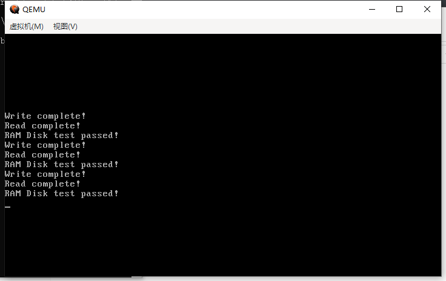
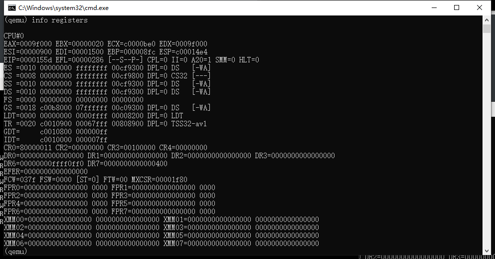

# （十六）更换虚拟机到QEMU


## 1. 更换的原因

- 实测在我的 `Bochs for Windows  2.6.11` 上，读取扇区数量不能超过52，我到现在都没找出来原因是什么。随着开发的进度，现在已经用到40个扇区了，还是未雨绸缪的好。
- Bochs 总有那个奇怪的 cpl != dpl 问题，对后续接着开发用户进程的其他功能不利。
- Bochs 的Windows版本不能用gdb，只能用自己的内部调试器，而 QEMU 天然支持 gdb，可以学习gdb这种最通用的调试工具的用法。
- QEMU 有支持多种平台的虚拟，切换到QEMU的x86平台，后续转移到QEMU的arm平台上也不用重新学习操作。


## 2. 更换过程

### 2.1 利用BIOS的0x13中断的0x02功能读扇区

需要注意的是，**所有的BIOS中断功能都必须在16位实模式下完成，进入保护模式之后无法使用！**

这是最传统的CHS（柱面-磁头-扇区）方式读扇区的方式，只要有BIOS都支持，对于所有外设都支持。

```assembly
    ; BIOS 0x13中断0x02功能的参数列表

    ; AH: 设置为0x02，表示读取扇区功能。
    ; AL: 要读取的扇区数（必须在1到128之间）。
    ; CH: 柱面号（0-1023，标准CHS模式）。
    ; CL: 扇区号（1-63）| ((柱面号 >> 2) & 0xC0)。
    ; DH: 磁头号（0-255）。
    ; DL: 驱动器号（通常第一个硬盘为0x80）。
    ; ES:BX: 数据缓冲区的段:偏移指针，用于存储读取的数据。

    ; 16位下寻址方式是段 * 16 + 偏移量。所以是 es * 16 + bx。
    ; 起始地址 0x1500（主要看KERNEL_BASE_ADDR） ，其段就是0x150，偏移量就是00

    ; 初始化目标地址段
    mov ax, KERNEL_BASE_ADDR
    shr ax, 4
    mov es, ax
    xor ax, ax

    mov ax, KERNEL_START_SECTOR ; 读取起始扇区号 (LBA)

    ; 计算LBA扇区号到CHS各项参数
    ; 计算步骤:
    ; 1. 扇区号 (Sector)   = (LBA 扇区号 % 每磁头扇区数) + 1
    ; 2. 磁头号 (Head)     = (LBA 扇区号 / 每磁头扇区数) % 磁头数每柱面
    ; 3. 柱面号 (Cylinder) = (LBA 扇区号 / 每磁头扇区数) / 磁头数每柱面

    ; 建立硬盘文件的参数，共计130个柱面，每个柱面16个磁头，每个磁头63个扇区
    ; 每个柱面总计63 * 16 = 1008 个扇区

    ; 现在是16位实模式，用16位除法，也就是dx:ax 组合成一个32位的被除数，除法运算之后，商在 ax，余数在 dx。

    ; 清空bx，用来存放计算结果
    xor bx, bx

    ; 计算扇区号、磁头号（用低位就行了，因为真没那么多）
    xor dx, dx                  ; 清除高16位为0
    mov di, 63                  ; 每磁头有63个扇区
    div di                      ; 商: ax (磁头号), 余数: dx (扇区号)
    mov bl, dl                  ; 扇区号 (0-62)
    add bl, 1                   ; 扇区号从1开始
    mov bh, al                  ; 磁头号 (0-15)

    ; 本来还要计算柱面号，但是也每那么多，直接写死算了，柱面号肯定是0，根本没那么多扇区
    ; 所以cx组合起来，只需要解决扇区号的问题就行了
    xor dx, dx                  ; 清除数据
    mov dh, bh                  ; 转移磁头号信息
    ; 前面也说了柱面号的问题，柱面号肯定是0，所以清空ch
    xor ch, ch
    ; cl的问题只要保证高2位是0就行了
    and bl, 0x3f                ; 清除 bl 的高 2 位，保留原 bl 的低 6 位 (扇区号)
    or cl, bl                   ; 位运算直接赋值

    xor ax, ax

    ; 设置BIOS中断0x13的参数
    mov al, 50                  ; 读取50个扇区
    mov ah, 0x02                ; 读扇区命令
    mov dl, 0x80                ; 驱动器号，第一个硬盘

    ; 设置开始的时候是16进制下的整数，偏移量就永远是0
    xor bx, bx
    int 0x13                    ; 调用BIOS中断
    ; 检查是否成功
    jc error                    ; 如果出错，跳转到错误处理

    jmp enable_p_mode           ; 进行后续设置

error:
    jmp $                       ; 错误处理，死循环

```

这里更正一个很久之前的错误。在Configuration.bxrc中。

```ini
ata0-master: type=disk, path="C:/Users/Administrator/Desktop/Repository/HOS/VM/HOS.raw", mode=flat, cylinders=130, heads=16, spt=63, sect_size=512, model="Generic 1234", biosdetect=auto, translation=auto
# ATA控制器0主设备：类型为磁盘，路径为HOS.raw，扁平模式，130个柱面，16个磁头，每磁头63个扇区，扇区大小512字节，型号为"Generic 1234"，BIOS检测为自动，转换方式为自动

```


### 2.2 利用BIOS的0x13中断的0x42扩展功能读扇区

0x42不是一个BIOS必备功能，是现代BIOS支持的扩展功能，本来需要先验证是否支持扩展功能，我懒，就不验证了，现代BIOS基本上都支持，qemu更不用说。

```assembly
    ; 设置磁盘地址包
    mov byte [disk_address_packet], 16              ; 包大小
    mov byte [disk_address_packet + 1], 0           ; 保留字段
    mov word [disk_address_packet + 2], 50          ; 要读取的扇区数
    mov word [disk_address_packet + 4], 0           ; 缓冲区偏移量（数值是整数，自然可以写死为0）
    ; 计算目标地址段
    mov ax, KERNEL_BASE_ADDR
    shr ax, 4
    mov word [disk_address_packet + 6], ax          ; 缓冲区段
    xor ax, ax
    mov word [disk_address_packet + 8], KERNEL_START_SECTOR      ; 起始LBA地址（低32位）主要是因为KERNEL_START_SECTOR小，所以可以直接写到低位，不然就要拆分了
    mov word [disk_address_packet + 12], 0                       ; 起始LBA地址（高32位）

    ; 设置BIOS中断0x13的参数
    mov ah, 0x42                       ; 扩展读取功能
    mov dl, 0x80                       ; 驱动器号，第一个硬盘
    lea si, [disk_address_packet]      ; 磁盘地址包指针
    int 0x13                           ; 调用BIOS中断
    jc error                           ; 如果出错，跳转到错误处理

    jmp enable_p_mode           ; 进行后续设置

error:
    jmp $                       ; 错误处理，死循环


; 地址包，所谓DAP，这是BIOS 0x13号中断的0x42功能所需的参数列表
disk_address_packet:
    db 16                          ; 包大小
    db 0                           ; 保留字段
    dw 0                           ; 要读取的扇区数
    dw 0                           ; 缓冲区偏移量（这两个值和0x02功能里面的bx、es同义）
    dw 0                           ; 缓冲区段
    dd 0                           ; 起始LBA地址（低32位）
    dd 0                           ; 起始LBA地址（高32位）

```

地址包的指针存放在si寄存器中，0x42功能就通过这个寄存器获取地址包的数据。

实际开发中我后来选用了0x42功能，因为它是LBA方式的，用起来更容易，CHS方式要计算实在太痛苦了。

不过需要注意的是，0x42功能一次性最多读取127个扇区，实际使用中建议控制在120个就行了，我在qemu上实测能到124个，剩下三个不行也不知道为什么。


### 2.3 修改MBR和Loader

需要具体说明的是，经过我的实测，Windows 版本上的QEMU虽然没有限制死一次性只能读取50个扇区，但是它居然只允许读一次性，第二次死活不行了。。。。。。我试了试第一次读1个扇区成功了，第二次直接不行了直接失败，进入错误处理error了。。。

不过还好，总比Bochs上五十个好。我说明一下，Bochs那个是限制总数，分批次读取也一样，我还试过一次一个扇区地读，结果到了第52个直接炸锅了。

修改MBR和Loader如下：

mbr.asm

```assembly
%include "boot.inc"
; 加载配置，这样以后调整都方便
SECTION MBR vstart=0x7c00
; 入口地址0x7c00是MBR的惯例，BIOS只要发现MBR，一律加载到这个地址
; 在开始就设置每个寄存器的初始值
    mov ax,cs
    mov ds,ax
    mov es,ax
    mov ss,ax
    mov fs,ax
; cs一开始是0，设置ds、es、ss、fs四个都是0
    mov sp,0x7c00
; sp存储的是栈顶指针，在MBR一开始必须是0x7c00（这本身也是MBR的加载位置，栈是向低地址处生长的，所以不会覆盖MBR的数据）
    mov ax,0xb800
; 0xb800，VGA时代对应显存的起始位置，放到gs寄存器里面
    mov gs,ax

; 清屏
    mov     ax, 0600h
    mov     bx, 0700h
    mov     cx, 0
    mov     dx, 184fh
    int     10h

; 读入Loader和内核

    ; 设置磁盘地址包
    mov byte [disk_address_packet], 16              ; 包大小
    mov byte [disk_address_packet + 1], 0           ; 保留字段
    mov word [disk_address_packet + 2], 120         ; 要读取的扇区数
    mov word [disk_address_packet + 4], 0           ; 缓冲区偏移量（数值是整数，自然可以写死为0）
    ; 计算目标地址段
    mov ax, LOADER_BASE_ADDR
    shr ax, 4
    mov word [disk_address_packet + 6], ax          ; 缓冲区段
    xor ax, ax
    mov word [disk_address_packet + 8], LOADER_START_SECTOR      ; 起始LBA地址（低32位）主要是因为LOADER_START_SECTOR小，所以可以直接写到低位，不然就要拆分了
    mov word [disk_address_packet + 12], 0                       ; 起始LBA地址（高32位）

    ; 设置BIOS中断0x13的参数
    mov ah, 0x42                       ; 扩展读取功能
    mov dl, 0x80                       ; 驱动器号，第一个硬盘
    lea si, [disk_address_packet]      ; 磁盘地址包指针
    int 0x13                           ; 调用BIOS中断
    jc error                           ; 如果出错，跳转到错误处理

    jmp LOADER_BASE_ADDR               ; 进入Loader进行后续设置

error:
    jmp $                       ; 错误处理，死循环


; 地址包，所谓DAP，这是BIOS 0x13号中断的0x42功能所需的参数列表
disk_address_packet:
    db 16                          ; 包大小
    db 0                           ; 保留字段
    dw 0                           ; 要读取的扇区数
    dw 0                           ; 缓冲区偏移量（这两个值和0x02功能里面的bx、es同义）
    dw 0                           ; 缓冲区段
    dd 0                           ; 起始LBA地址（低32位）
    dd 0                           ; 起始LBA地址（高32位）

times 510-($-$$) db 0
; 这行代码的作用是填充当前代码段，使其总长度达到510字节。
; MBR的总大小是512字节，其中最后两个字节是固定的引导标识符 0x55 和 0xAA，所以需要填充前面的字节。
; $ 表示当前地址，$$ 表示当前段的起始地址，($-$$) 计算出当前代码段的大小，然后 510-($-$$) 计算出需要填充的字节数。
; 用 db 0 填充这些字节。

db 0x55,0xaa		; 这两个字节是引导记录的标识符，表示这是一个有效的MBR。

```

loader.asm

```assembly
;------------------- loader.inc -------------------

%include "boot.inc"

;------------------- loader代码段 -------------------
section loader vstart=LOADER_BASE_ADDR

; 补充说明，栈的生长是向低位生长，所以栈顶指针设在高位并不会导致栈的数据覆盖Loader，因为二者写的方向都不一样
LOADER_STACK_TOP equ LOADER_BASE_ADDR

; jmp 指令在 x86 汇编中有多种形式，常见的形式有：
; jmp short：2 字节，距离范围为 -128 到 +127 字节。（jmp本身1字节，距离1字节）
; jmp near： 3 字节，距离范围为 -32768 到 +32767 字节。（jmp本身1字节，距离2字节）
; jmp far：  5 字节，用于跳转到绝对地址，通常是跨段跳转，即改变段寄存器的值。
; jmp far 不仅需要改变 eip，还需要改变段选择子，因此需要 4 字节的目标地址（段选择子 + 偏移量）。
; 编译器会自动计算你的距离，从而决定要用哪个，你也可以强制指定

; 在这里很显然我们的jmp是near，3字节大小
jmp loader_start
; 用jmp的原因是因为我不知道为什么下面的GDT会被当成代码执行，人都麻了

;------------------- 构建GDT及其内部的描述符 -------------------
GDT_BASE:   
    dd 0x00000000  ; 第一个描述符（空描述符）
    dd 0x00000000

CODE_DESC:  
    dd 0x0000FFFF  ; 代码段基址低16位和段限制低16位
    dd DESC_CODE_HIGH4  ; 代码段的高32位描述符属性

DATA_STACK_DESC:  
    dd 0x0000FFFF  ; 数据段基址低16位和段限制低16位
    dd DESC_DATA_HIGH4  ; 数据段的高32位描述符属性

VIDEO_DESC: 
    dd 0x80000007  ; 视频段基址低16位和段限制低16位 (limit=(0xbffff-0xb8000)/4k=0x7)
    dd DESC_VIDEO_HIGH4  ; 视频段的高32位描述符属性，此时DPL已改为0

GDT_SIZE equ $ - GDT_BASE
GDT_LIMIT equ GDT_SIZE - 1 
times 28 dq 0  ; 预留28个描述符空位，加上已有的4个，一共是32个描述符，每个描述符8个字节，总共是32 * 8 = 256字节

; 选择子
SELECTOR_CODE equ (0x0001 << 3) + TI_GDT + RPL0  ; 代码段选择子
SELECTOR_DATA equ (0x0002 << 3) + TI_GDT + RPL0  ; 数据段选择子
SELECTOR_VIDEO equ (0x0003 << 3) + TI_GDT + RPL0  ; 视频段选择子

; 首先，equ指令相当于C的define，就是简单的替换，编译的时候就会清理掉，不占空间
; jmp刚刚说了是3字节
; 很明显GDT位置从0x903开始起算
; GDT之前计算过了 256 字节
; 起始地址是0x900，对应十进制数字是2304，2304 + 3 + 256 = 2563，对应16进制是0xa03
; 也就是说0xa02是gdt空位结束，gdt_ptr的起始地址是下一个字节0xa03，读0xa03指向的值，就知道GDT指针信息

; 定义GDT指针，前2字节是GDT界限，后4字节是GDT起始地址
gdt_ptr:
    dw GDT_LIMIT
    dd GDT_BASE


; gdt_ptr是一个dw和一个dd，dw是2字节，对应C语言的unsigned char，dw是4字节，对应C语言里的unsigned int，一共是6字节空间
; 2563 + 6 = 2569，十六进制为0xa09
; total_mem_bytes的起始地址就是0xa09
total_mem_bytes dd 0

loader_start:
; MBR已经读完了
enable_p_mode:
    ; 不屏蔽中断，进不去QEMU，会无限重启，本来要屏蔽中断就是一个必备流程，bochs里面能用不代表qemu或者真机能用
    cli
;----------------------------------------   开启保护模式   ------------------------------------------
; 1. 打开A20
; 2. 加载GDT
; 3. 将CR0的PE位的值置为1

;-----------------  打开A20  ----------------
    ; 打开A20的方法有好几种，有直接用BIOS中断打开的，还有用键盘控制器打开的
    ; 《30天自制操作系统》里面就是用键盘控制器打开的
    in al,0x92  ; 从端口0x92读取当前值到AL
    or al,0000_0010B  ; 设置A20启用位（第1位）
    out 0x92,al  ; 写回到端口0x92

;-----------------  加载GDT  ----------------
    lgdt [gdt_ptr]  ; 加载GDT指针到GDTR寄存器

;-----------------  将CR0第0位置1  ----------------
    mov eax, cr0  ; 读取CR0寄存器的值到EAX
    or eax, 0x00000001  ; 设置CR0的PE位（第0位）
    mov cr0, eax  ; 写回CR0寄存器，启用保护模式

    jmp SELECTOR_CODE:p_mode_start  ; 远跳转到保护模式代码段，刷新流水线，避免分支预测的影响


[bits 32]  ; 进入32位模式
p_mode_start:
    mov ax, SELECTOR_DATA  ; 加载数据段选择子到AX
    mov ds, ax  ; 设置DS段寄存器
    mov es, ax  ; 设置ES段寄存器
    mov ss, ax  ; 设置SS段寄存器
    mov esp, LOADER_STACK_TOP  ; 设置ESP为栈顶地址
    mov ax, SELECTOR_VIDEO  ; 加载视频段选择子到AX
    mov gs, ax  ; 设置GS段寄存器

    call get_memory
    ;mov byte [gs:160], 'P'  ; 在屏幕位置(0,10)处写入字符'P'
    
    jmp KERNEL_BASE_ADDR


; 《30天自制操作系统》里面的内存容量获取方式，完全不用BIOS，但是必须进入32位之后才能执行
[bits 32]
get_memory:
    ; 保存当前的寄存器值
    push edi                     ; 保存 edi 寄存器的值到堆栈
    push esi                     ; 保存 esi 寄存器的值到堆栈
    push ebx                     ; 保存 ebx 寄存器的值到堆栈

    ; 设置测试模式的两个模式字
    mov esi, 0xaa55aa55          ; 将第一个模式字 0xaa55aa55 存入 esi
    mov edi, 0x55aa55aa          ; 将第二个模式字 0x55aa55aa 存入 edi

    ; 开始地址设置为1MB，前1MB也就是0到0x000fffff分配给MBR、Loader、Kernel
    ; 内存小于1MB建议直接写裸机算了要什么操作系统
    mov eax, 0x00100000

.get_memory_loop:
    ; 计算当前测试的内存地址
    mov ebx, eax                 ; 将当前地址复制到 ebx
    add ebx, 0xffc               ; 将 ebx 增加 0xffc（测试 4KB 内存块的最后 4 字节）

    ; 保存当前内存值，并写入测试模式值
    mov edx, [ebx]               ; 将当前内存值存入 edx
    mov [ebx], esi               ; 将第一个模式字写入内存
    xor dword [ebx], 0xffffffff  ; 将内存中的值进行按位取反

    ; 检查是否匹配第一个模式
    cmp edi, [ebx]               ; 将内存值与第二个模式字进行比较
    jne .get_memory_fail         ; 如果不匹配，则跳转到失败处理
    xor dword [ebx], 0xffffffff  ; 如果匹配，则恢复到原始模式字

    ; 检查是否匹配第二个模式
    cmp esi, [ebx]               ; 将内存值与第一个模式字进行比较
    jne .get_memory_fail         ; 如果不匹配，则跳转到失败处理

    ; 恢复原始内存值，并继续测试下一个地址
    mov [ebx], edx               ; 将原始内存值恢复到内存
    add eax, 0x00001000          ; 将地址增加 4KB
    cmp eax, 0x0fffffff          ; 将当前地址与结束地址比较，结束地址设置为4G - 1，也就是0xffffffff
    jbe .get_memory_loop         ; 如果当前地址小于或等于结束地址，则继续测试下一个内存块

    ; 测试成功，恢复寄存器并返回
    pop ebx                      ; 恢复 ebx 寄存器的值
    pop esi                      ; 恢复 esi 寄存器的值
    pop edi                      ; 恢复 edi 寄存器的值
    mov [total_mem_bytes], eax	 ; 将最终的内存容量保存到total_mem_bytes中
    clc                          ; 清除错误标志，表示内存测试成功
    ret                          ; 返回调用者

.get_memory_fail:
    ; 测试失败，保存当前地址到total_mem_bytes，并恢复原始内存值
    mov [total_mem_bytes], eax   ; 将当前地址保存到total_mem_bytes
    pop ebx                      ; 恢复 ebx 寄存器的值
    pop esi                      ; 恢复 esi 寄存器的值
    pop edi                      ; 恢复 edi 寄存器的值
    stc                          ; 设置错误标志，表示内存测试失败
    ret                          ; 返回调用者

```

QEMU不知道为什么只允许读扇区一次，这属实是给我整麻了。

我就想了个办法，既然loader是从0x900开始加载的，连续加载几个扇区不就到了内核入口地址0x1500吗。

0x1500 - 0x900 = 0xc00，c就是十进制的12。

一个扇区512字节，换算成十六进制就是0x200，那么间隔就是6个扇区。

目前loader在扇区2（扇区号从0开始），我们的Loader又不大，最多占据一个扇区，只要内核从扇区8开始，连续读下去就行了呗。

只需要修改一下一键编译烧写脚本w.bat，把内核烧写位置改一下。

```bash
dd if=%KERNEL_BIN% of=%HD_IMG% bs=512 count=200 seek=8 conv=notrunc
```

内核从扇区8开始烧写。

这样就可以在进入保护模式之前加载整个内核了。


## 3. 实际测试结果

我已经安装了 QEMU，并且加入到环境变量，这是我写的一键开启脚本 `start_qemu.bat` ，放在VM目录下。

```bash
qemu-system-i386 -M pc -m 64M -monitor stdio -hda HOS.raw -boot c
```

实际测试结果：

- 用户代码段和用户数据段还是不能将DPL设置为3，同样的段选择子也不能设置RPL为3，不知道为什么一这么设置还是出事。但是DPL = 2，RPL = 2就没问题了。
- 多次发出系统中断可以正常打印了，没有了Bochs里面那个奇怪的突然蹦出来的 cpl != dpl 问题了。
- 一次性可以加载120个扇区没任何问题，顺利进入。




可以顺利运行驱动。

监视器查看各项数据也很正常。




打开GDB调试也很简单。

`debug_qemu.bat` 

```bash
qemu-system-i386 -M pc -m 64M -monitor stdio -hda HOS.raw -boot c -S -s
```

这样就会自动打开一个端口号为1234的调试，gdb可以从1234端口连接，而且在qemu执行第一条指令之前就停下来，等待调试器的指令。

gdb的用法我就不多说了。