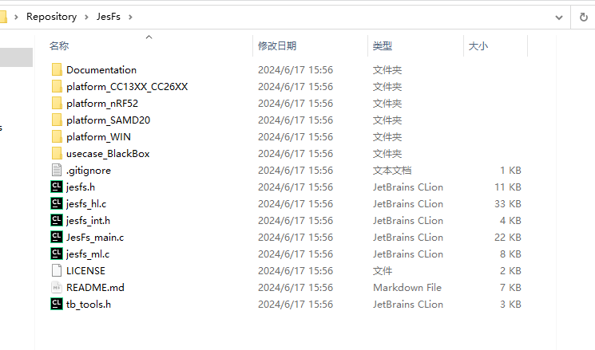
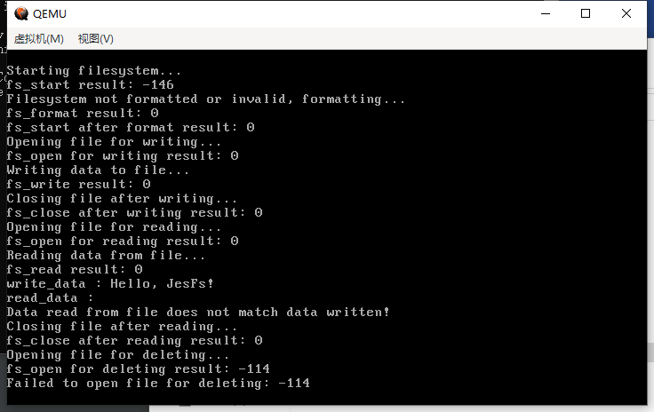
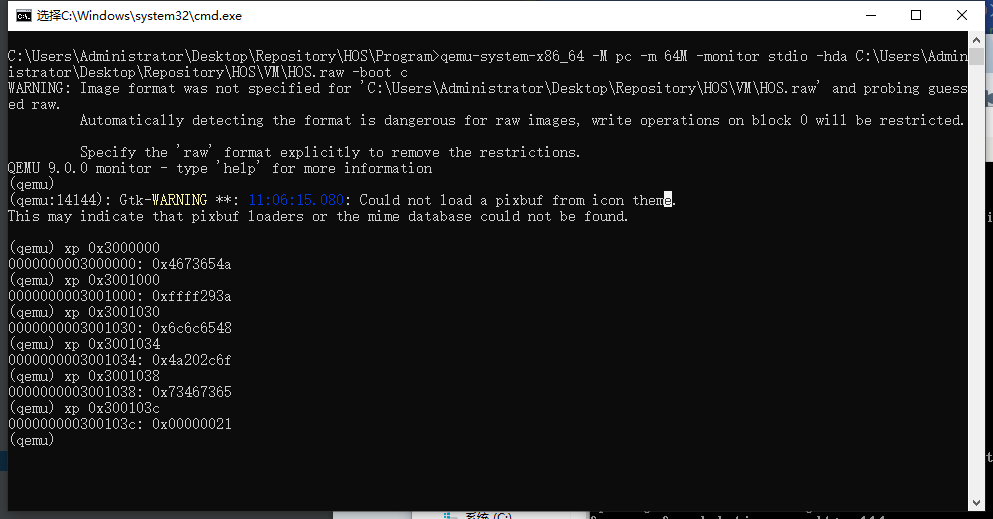

# （十七）移植嵌入式文件系统项目JesFs

## JesFs项目：

[joembedded/JesFs: Jo's Embedded Serial File System (for Standard Serial NOR-Flash) (github.com)](https://github.com/joembedded/JesFs)

## 1. 修改RAMDISK的实现

主要是为了适配JesFs的要求，增加了一个粒度为4K的擦除函数。

ramdisk.h

```c
//
// Created by Administrator on 2024/6/16.
//

#ifndef HOS_RAMDISK_H
#define HOS_RAMDISK_H

#include "../../lib/lib_kernel/lib_kernel.h"

// 用ramdisk模拟nor闪存的行为


#define RAMDISK_SIZE (16 * 1024 * 1024) // 16MB
#define BLOCK_SIZE (64 * 1024) // NOR闪存块大小，通常为64KB
#define WRITE_GRANULARITY 4 // 写入粒度为4字节（一个字）

// 擦除块操作
int32_t erase_block(uint32_t block_number);
// 粒度4KB的擦除块操作
int32_t erase_block_4K(uint32_t addr);
int32_t ramdisk_read(char *args, uint32_t args_size);
int32_t ramdisk_write(char *args, uint32_t args_size);

#endif //HOS_RAMDISK_H

```

ramdisk.c

```c
//
// Created by Administrator on 2024/6/16.
//

#include "ramdisk.h"
#include "../../kernel/kernel_device/kernel_device.h"
#include "../console/console.h"
#include "../../kernel/kernel_task/kernel_task.h"

// 注册驱动结构体
REGISTER_DRIVER(ramdisk_driver) {
        .driver_name = "ramdisk",
        .init = NULL,
        .exit = NULL,
        .read = ramdisk_read,
        .write = ramdisk_write,
        .irq = -1, // 没有中断处理
        .irq_interrupt_handler = NULL,
};

// 仅限此处使用，所以要用static，限制作用域在此文件中
static uint8_t *ramdisk = (uint8_t *)0xA0000000; // 定义RAM Disk的存储空间

struct ramdisk_io_request {
    uint32_t address; // 以字节为单位的地址（nor闪存没有扇区的概念，直接以线性地址读写）
    uint32_t size;
    char *buffer;
};

// 擦除块，这是nor闪存特有的操作，nor闪存写之前，必须要擦除该块，然后才能写
int32_t erase_block(uint32_t block_number) {
    if (block_number * BLOCK_SIZE >= RAMDISK_SIZE) {
        return -1; // 超出范围
    }
    memset(ramdisk + block_number * BLOCK_SIZE, 0xFF, BLOCK_SIZE); // 模拟NOR闪存的擦除操作（一次性擦除一个块，就是每一位都用1填充）
    return 0;
}

// 文件系统的擦除要求是4KB，适配
int32_t erase_block_4K(uint32_t addr) {
    if(addr > RAMDISK_SIZE - 0x1000) {
        return -1;
    }
    memset((char *)addr, 0xff, 0x1000);
    return 0;
}

int32_t ramdisk_read(char *args, uint32_t args_size) {
    if(args_size != sizeof(struct ramdisk_io_request)) {
        return -1;
    }
    struct ramdisk_io_request *request = (struct ramdisk_io_request *)args;

    if (request->address + request->size > RAMDISK_SIZE) {
        return -1;
    }
    memcpy(request->buffer, ramdisk + request->address, request->size);
    return request->size;
}

int32_t ramdisk_write(char *args, uint32_t args_size) {
    if(args_size != sizeof(struct ramdisk_io_request)) {
        return -1;
    }
    struct ramdisk_io_request *request = (struct ramdisk_io_request *)args;

    if (request->address + request->size > RAMDISK_SIZE) {
        return -1; // 超出范围
    }

    // 不擦除了，直接写
    memcpy(ramdisk + request->address, request->buffer, request->size);

    return request->size;
}

```


## 2. 实现cmos驱动

rtc_cmos.h

```c
//
// Created by huangcheng on 2024/6/19.
//

#ifndef HOS_RTC_CMOS_H
#define HOS_RTC_CMOS_H

#include "../../lib/lib_kernel/lib_kernel.h"

// rtc时间结构体
typedef struct {
    uint8_t second;
    uint8_t minute;
    uint8_t hour;
    uint8_t day;
    uint8_t month;
    uint16_t year;
} rtc_time_t;

// RTC CMOS 获取当前时间
void rtc_get_time(rtc_time_t *time);
// 时间转换为时间戳
uint32_t get_unix_timestamp(rtc_time_t* time);
// 取现行时间戳
uint32_t _time_get(void);

#endif //HOS_RTC_CMOS_H

```

rtc_cmos.c

```c
//
// Created by huangcheng on 2024/6/19.
//

// 这个设备是内置在CPU里面的，根本不需要初始化也不需要退出

#include "rtc_cmos.h"
#include "../../kernel/kernel_device/kernel_device.h"

// 注册宏，定义一个驱动结构体，把驱动结构体实例放到驱动段
REGISTER_DRIVER(rtc_cmos_driver) {
        .driver_name = "rtc_cmos",
        .init = NULL,
        .exit = NULL,
        .irq = -1, // 没有中断处理
};

#define CMOS_ADDRESS    0x70
#define CMOS_DATA       0x71

static inline uint8_t cmos_read(uint8_t reg) {
    outb(CMOS_ADDRESS, reg);
    return inb(CMOS_DATA);
}

static inline void cmos_write(uint8_t reg, uint8_t value) {
    outb(CMOS_ADDRESS, reg);
    outb(CMOS_DATA, value);
}

uint8_t bcd_to_bin(uint8_t bcd) {
    return ((bcd / 16) * 10) + (bcd & 0xf);
}

void rtc_get_time(rtc_time_t *time) {
    time->second = bcd_to_bin(cmos_read(0x00));
    time->minute = bcd_to_bin(cmos_read(0x02));
    time->hour = bcd_to_bin(cmos_read(0x04));
    time->day = bcd_to_bin(cmos_read(0x07));
    time->month = bcd_to_bin(cmos_read(0x08));
    time->year = bcd_to_bin(cmos_read(0x09)) + 2000;  // Assuming the RTC gives year as two-digit BCD
}

uint32_t get_unix_timestamp(rtc_time_t *time) {
    // Convert rtc_time_t to Unix timestamp
    // This is a simplified example and might not handle leap years and other details correctly
    // A more robust implementation would be needed for production use

    uint32_t days = (time->year - 1970) * 365 + (time->year - 1969) / 4;
    days += (time->month - 1) * 30 + time->day;

    return days * 86400 + time->hour * 3600 + time->minute * 60 + time->second;
}

// 取现行时间戳
uint32_t _time_get(void) {
    rtc_time_t time;
    rtc_get_time(&time);
    return get_unix_timestamp(&time);
}

```


## 3. JesFs移植




让ChatGPT帮忙解释一下这个项目的文件构成。

- `jesfs.h`

这个文件是JesFs项目的公共头文件，定义了所有公开的接口函数、常量和结构体。这个文件主要用于：

- 定义错误码。
- 提供文件系统的配置选项。
- 定义文件描述符和统计描述符结构体。
- 定义高层次的文件系统操作接口函数，如`fs_start`、`fs_open`、`fs_read`、`fs_write`、`fs_close`等。

这个文件本身不涉及具体的硬件实现，但它声明的函数在其他文件中会与硬件交互。

- `jesfs_int.h`

这个文件是内部头文件，用于定义JesFs项目的内部使用的常量、结构体和函数。它主要用于：

- 定义内部使用的魔术数和宏。
- 声明内部SPI Flash交互的低层函数，如`sflash_spi_init`、`sflash_spi_close`、`sflash_select`、`sflash_deselect`等。

这个文件涉及具体硬件实现的声明，但具体实现是在其他文件中。

- `jesfs_hl.c`

这个文件实现了高层次的文件系统操作。它主要用于：

- 实现文件系统的启动、格式化、文件读写等高层次操作。
- 包含一些辅助函数用于字符串处理、内存操作和CRC32计算。

这个文件部分地涉及硬件实现，因为这些高层次操作依赖于底层SPI Flash操作函数来与硬件交互。

-  `jesfs_ml.c`

这个文件实现了中层次的SPI Flash管理操作。它主要用于：

- 实现SPI Flash的初始化、读写、擦除等操作。
- 处理SPI Flash的ID读取和解释。
- 包含对SPI Flash的低层次命令，如`CMD_RDID`、`CMD_STATUSREG`、`CMD_WRITEENABLE`等。

这个文件涉及具体的硬件实现，因为它直接与SPI Flash硬件进行交互。

- `jesfs_ll.c`

`ll`后缀文件表示“低层次”，即直接与硬件交互的实现。这个文件通常会包含具体硬件平台的实现细节，如SPI接口的实现、GPIO控制等。

总结来说，`jesfs.h`和`jesfs_int.h`主要是声明和定义，`jesfs_hl.c`实现了高层次的文件系统操作，`jesfs_ml.c`实现了与SPI Flash的中层次管理操作，这些文件部分地涉及具体的硬件实现，尤其是在与SPI Flash交互时。低层次的硬件具体实现通常会在一个单独的文件中进行，如`jesfs_ll.c`。

总的来说就是，只需要实现jesfs_ll.c就行了，让它适配HOS里面虚拟的外存设备RAMDISK。

不过对于其他的文件，也要注意引入本项目的type.h，替换为HOS的类型别名，反正都是从stddef和stdint里面来的，都一样。

jes_int.h里面要求的接口。

```c
/*******************************************************************************
* JesFs_int.h - internal headers
*
* JesFs - Jo's Embedded Serial File System
*
* The following parts are only relevant for
* the (internal) medium/low level drivers
*
* (C) joembedded@gmail.com - www.joembedded.de
* Version: see Header Files
*
*******************************************************************************/

#ifdef __cplusplus
extern "C"{
#endif
//------------------- Internal JesFS Defines ------------------------

// For Debugging/Stress tests: If defined, treat SPI as very small disk. Size must be Sectorsize^x and
// at least 2 Sectors (=8kB) Maximum is 2GB, for 3-Byte SPI-Flash: Maximum 16MB
// #define DEBUG_FORCE_MINIDISK_DENSITY 0x0F // (1<<x), but >= 2 Sectors, here 0xF: 32kB = 8 Sectors

// 把类型定义载入
#include "../lib/type.h"

#define MIN_DENSITY 0x0D   	// 0x13: 512k, smaller doesn not make sense, except for tests, 0x0D is the minimum
#define MAX_DENSITY 0x18    // 0x18: 16 MB is the maximum for 3-byte addressed Flash. (But up to 2GB is possible)


// Header of each sector
#define HEADER_SIZE_L   3  // equals 12 Bytes
#define HEADER_SIZE_B   (HEADER_SIZE_L*4)
// addition header at start of file
#define FINFO_SIZE_B    36

//------------------- Internal JesFS Functions ------------------------

#define HEADER_MAGIC                0x4673654A   //'JesF'
#define SECTOR_MAGIC_HEAD_ACTIVE    0xFFFF293A
#define SECTOR_MAGIC_HEAD_DELETED   0xFFFF2130
#define SECTOR_MAGIC_DATA           0xFFFF5D5B
#define SECTOR_MAGIC_TODELETE       0xFFFF4040

// Easy Access B W L
typedef union{
	uint8_t     u8[4];
	uint16_t    u16[2];
	uint32_t    u32;
} SF_LONGWORDBYTE;  // Structure for byte/word/long access

//------------------- LowLevel SPI Functions Depending on Hardware! -------
void sflash_wait_usec(uint32_t usec);

int16_t sflash_spi_init(void);
void sflash_spi_close(void);

void sflash_select(void);
void sflash_deselect(void);
void sflash_spi_read(uint8_t *buf, uint16_t len); // len is 16Bit!
void sflash_spi_write(const uint8_t *buf, uint16_t len); // len is 16Bit!

//---------------- Little helpers for MediumLevel ------------------
uint32_t fs_strlen(char *s);
void fs_strncpy(char *d, char *s, uint8_t maxchar);
void fs_memset(uint8_t *p, uint8_t v, uint32_t n);
int16_t fs_strcmp(char *s1, char *s2);
uint32_t fs_track_crc32(uint8_t *pdata, uint32_t wlen, uint32_t crc_run);
uint32_t fs_get_secs(void); // Unix-Secs

//------------------- MediumLevel SPI Functions ------------------------
void sflash_bytecmd(uint8_t cmd, uint8_t more);
uint32_t sflash_QuickScanIdentification(void);
int16_t sflash_interpret_id(uint32_t id);
void sflash_DeepPowerDown(void);
void sflash_ReleaseFromDeepPowerDown(void);
void sflash_read(uint32_t sadr, uint8_t* sbuf, uint16_t len);
uint8_t sflash_ReadStatusReg(void);
void sflash_WriteEnable(void);
void sflash_PageWrite(uint32_t sadr, uint8_t* sbuf, uint16_t len);
void sflash_BulkErase(void);
void sflash_llSectorErase4k(uint32_t sadr); // LowLevel, bezogen auf 4K
int16_t sflash_WaitBusy(uint32_t msec);
int16_t sflash_WaitWriteEnabled(void);
int16_t sflash_SectorWrite(uint32_t sflash_adr, uint8_t* sbuf, uint32_t len);
int16_t sflash_SectorErase(uint32_t sadr); // High-Level
#ifdef __cplusplus
}
#endif
//--------------End of Internal JesFS Functions ------------------------

```

ll就是要实现这些

```c
//------------------- LowLevel SPI Functions Depending on Hardware! -------
void sflash_wait_usec(uint32_t usec);

int16_t sflash_spi_init(void);
void sflash_spi_close(void);

void sflash_select(void);
void sflash_deselect(void);
void sflash_spi_read(uint8_t *buf, uint16_t len); // len is 16Bit!
void sflash_spi_write(const uint8_t *buf, uint16_t len); // len is 16Bit!

```

JesFs_ll_HOS_ramdisk.c

```c
/*******************************************************************************
* JesFs_ll_HOS_ramdisk.c: 用于 RAM 磁盘虚拟设备的低级适配（适配到HOS的虚拟外存设备RAMDISK的驱动）
*
* JesFs - Jo's Embedded Serial File System
*
* 本文件提供了在基于 RAM 的虚拟设备上运行 JesFs 文件系统的低级实现。
* 通过将必要的 JesFs 函数映射到 RAM 磁盘操作，使文件系统能够在没有物理存储硬件的
* 模拟环境中运行。
*
* 由于底层硬件是虚拟的，因此不需要 tb_tools。这些操作通过 RAM 磁盘驱动完成
* 文件系统直接通过RAMDISK驱动对设备操作。
*
* 说白了这个文件就是为了适配jesfs_ml.c
*
* (C) 2024 huangcheng
* 版本: 1.0 / 2024-06-19
*
*******************************************************************************/

#include "jesfs.h"
#include "jesfs_int.h"

// 不用驱动链表转发了
// 直接用设备接口
#include "../devices/ramdisk/ramdisk.h"

// 当前操作地址
uint32_t current_address = 0;
// 当前操作命令
uint8_t current_command = 0;
// 当前闪存寄存器值
uint8_t status_register = 0x00;

// RAMDISK 读写请求参数
uint32_t args[3];

// 初始化 RAMDISK
int16_t sflash_spi_init(void) {
    return 1;
}

void sflash_spi_close(void) {
    // 对于 RAMDISK 不需要任何操作
}

void sflash_wait_usec(uint32_t usec) {
    // 如果需要可以在这里实现延迟，对于 RAMDISK 可以留空
    (void)usec; // 防止编译器报错
}

void sflash_select(void) {
    // 对于唯一的RAMDISK 不需要任何操作
}

void sflash_deselect(void) {
    // 对于 RAMDISK 不需要任何操作
}

// 更新地址
void update_current_address(const uint8_t *cmd) {
    current_address = 0;
    current_address |= (uint32_t)cmd[1] << 16;
    current_address |= (uint32_t)cmd[2] << 8;
    current_address |= (uint32_t)cmd[3];
}

void handle_command(uint8_t cmd, const uint8_t *buf, uint16_t len) {
    current_command = cmd;
    if (len == 4) {
        update_current_address(buf);
    }

    if (cmd == 0x06) { // CMD_WRITEENABLE
        status_register |= 0x02;
    } else if (cmd == 0x05) { // CMD_STATUSREG
        // 不需要在此处处理（写了不在这里读，不用处理）
    } else if (cmd == 0xB9) { // CMD_DEEPPOWERDOWN
        // 模拟深度睡眠，不需要额外处理
    } else if (cmd == 0xAB) { // CMD_RELEASEDPD
        // 模拟唤醒，不需要额外处理
    } else if (cmd == 0xC7) { // CMD_BULKERASE
        // 模拟设备4MB，擦除4MB，即64个块
        for (uint32_t i = 0; i < 64; i++) {
            erase_block(i);
        }
    } else if (cmd == 0x9F) { // CMD_RDID
        // 读设备ID，不用管
    } else if (cmd == 0x20) {
        // 进行粒度为4KB的擦除操作
        erase_block_4K(current_address);
    }
}

void sflash_spi_read(uint8_t *buf, uint16_t len) {
    if (current_command == 0x05) { // CMD_STATUSREG
        buf[0] = status_register;
    } else if (current_command == 0x9F) {
        // 给RAMDISK写一个识别码
        // 我这里用随便一个，MACRONIX_MANU_TYP_RX，0xc228
        // 主要是觉得这个看着顺眼
        // 其含义是，制造商字节 0xC2，设备类型字节 0x28
        // 密度字节 0x12 表示 4MB（方便测试）
        buf[0] = 0xc2;
        buf[1] = 0x28;
        buf[2] = 0x12;
    } else {
        args[0] = current_address;
        args[1] = len;
        args[2] = (uint32_t)buf;

        ramdisk_read((char *)args, sizeof(uint32_t) * 3);

        // 结束之后清理参数
        args[0] = 0;
        args[1] = 0;
        args[2] = 0;
    }
}

void sflash_spi_write(const uint8_t *buf, uint16_t len) {
    if (len == 1) {
        handle_command(buf[0], buf, len);
    } else if (len == 4) {
        handle_command(buf[0], buf, len);
    } else {
        args[0] = current_address;
        args[1] = len;
        args[2] = (uint32_t)buf;

        ramdisk_write((char *)args, sizeof(uint32_t) * 3);;

        // 结束之后清理参数
        args[0] = 0;
        args[1] = 0;
        args[2] = 0;
    }
}

```

看起来简单，过程真折磨。主要是作者用命令字的这个做法和我的ramdisk差太大了，他的命令字又多，让ChatGPT帮忙review都漏了好多。

适配之后，就可以试试这个文件系统了。

kernel.c

```c
#include "../lib/lib_kernel/lib_kernel.h"
#include "kernel_page/kernel_page.h"
#include "kernel_gdt/kernel_gdt.h"
#include "kernel_idt/kernel_idt.h"
#include "kernel_device/kernel_device.h"
#include "kernel_memory/kernel_memory.h"
#include "kernel_task/kernel_task.h"
#include "../devices/console/console.h"
#include "kernel_buffer/kernel_buffer.h"
#include "../user/process/process.h"
#include "../devices/ramdisk/ramdisk.h"

#include "../lib/lib_user/syscall.h"

#include "../fs/jesfs.h"

// 文件系统测试函数
void test_jesfs();

void kernel_main(void) {

    uint32_t total_physical_memory = *((uint32_t *)(0xa09));
    // 内存分页初始化
    init_paging();
    // 重新加载gdt
    setup_gdt();
    // 调整ESP，将栈指针切换到高地址（栈大小增加到0x1500）
    switch_esp_virtual_addr();
    // 初始化idt
    init_idt();
    // 先初始化任务管理结构（这样所有任务就能用统一的内存管理逻辑了）
    init_multitasking();
    // 初始化内存管理
    init_memory(total_physical_memory);
    // 初始化所有设备
    init_all_devices();

    // 允许PIC_IRQ0中断，才可以让定时器调度线程
    enable_pic_irq_interrupt(0);
    // 开启全局中断
    intr_enable();

    // 测试文件系统
    test_jesfs();

    // 进入内核主循环或其它初始化代码
    for(;;) {
    }
    // 退出主循环卸载设备驱动
    exit_all_devices();
}

void test_jesfs() {
    FS_DESC file_desc;
    char test_filename[] = "testfile.txt";
    char write_data[32] = {0};
    strcpy(write_data, "Hello, JesFs!");
    char read_data[32] = {0};
    int16_t result;

    // 启动文件系统
    console_printf("Starting filesystem...\n");
    result = fs_start(FS_START_NORMAL);
    console_printf("fs_start result: %d\n", result);

    // 如果是新闪存则格式化
    if (result == -108 || result == -146) {
        console_printf("Filesystem not formatted or invalid, formatting...\n");
        result = fs_format(FS_FORMAT_FULL);
        console_printf("fs_format result: %d\n", result);
        if (result < 0) {
            console_printf("Failed to format filesystem: %d\n", result);
            return;
        }
        result = fs_start(FS_START_NORMAL);
        console_printf("fs_start after format result: %d\n", result);
    }

    if (result < 0) {
        console_printf("Failed to start filesystem: %d\n", result);
        return;
    }

    // 打开文件（如果不存在则创建）
    console_printf("Opening file for writing...\n");
    result = fs_open(&file_desc, test_filename, SF_OPEN_CREATE | SF_OPEN_WRITE);
    console_printf("fs_open for writing result: %d\n", result);
    if (result < 0) {
        console_printf("Failed to open file for writing: %d\n", result);
        return;
    }

    // 写入数据到文件
    console_printf("Writing data to file...\n");
    result = fs_write(&file_desc, write_data, sizeof(write_data));
    console_printf("fs_write result: %d\n", result);
    if (result < 0) {
        console_printf("Failed to write data to file: %d\n", result);
        fs_close(&file_desc);
        return;
    }

    // 关闭文件
    console_printf("Closing file after writing...\n");
    result = fs_close(&file_desc);
    console_printf("fs_close after writing result: %d\n", result);
    if (result < 0) {
        console_printf("Failed to close file after writing: %d\n", result);
        return;
    }

    // 打开文件读取
    console_printf("Opening file for reading...\n");
    result = fs_open(&file_desc, test_filename, SF_OPEN_READ);
    console_printf("fs_open for reading result: %d\n", result);
    if (result < 0) {
        console_printf("Failed to open file for reading: %d\n", result);
        return;
    }

    // 读取数据
    console_printf("Reading data from file...\n");
    result = fs_read(&file_desc, read_data, sizeof(read_data));
    console_printf("fs_read result: %d\n", result);
    if (result < 0) {
        console_printf("Failed to read data from file: %d\n", result);
        fs_close(&file_desc);
        return;
    }

    console_printf("write_data : %s\n", write_data);
    console_printf("read_data : %s\n", read_data);

    // 验证读取的数据是否正确
    if (memcmp(write_data, read_data, sizeof(write_data)) != 0) {
        console_printf("Data read from file does not match data written!\n");
    } else {
        console_printf("Data read from file matches data written.\n");
    }

    // 关闭文件
    console_printf("Closing file after reading...\n");
    result = fs_close(&file_desc);
    console_printf("fs_close after reading result: %d\n", result);
    if (result < 0) {
        console_printf("Failed to close file after reading: %d\n", result);
        return;
    }

    // 删除文件
    console_printf("Opening file for deleting...\n");
    result = fs_open(&file_desc, test_filename, SF_OPEN_READ);
    console_printf("fs_open for deleting result: %d\n", result);
    if (result < 0) {
        console_printf("Failed to open file for deleting: %d\n", result);
        return;
    }

    console_printf("Deleting file...\n");
    result = fs_delete(&file_desc);
    console_printf("fs_delete result: %d\n", result);
    if (result < 0) {
        console_printf("Failed to delete file: %d\n", result);
    } else {
        console_printf("File deleted successfully.\n");
    }
}

```

测试结果：



用监视器打内存看看。



这些值是怎么回事呢？

看看jesfs_int.h

```c
//------------------- Internal JesFS Functions ------------------------

#define HEADER_MAGIC                0x4673654A   //'JesF'
#define SECTOR_MAGIC_HEAD_ACTIVE    0xFFFF293A
#define SECTOR_MAGIC_HEAD_DELETED   0xFFFF2130
#define SECTOR_MAGIC_DATA           0xFFFF5D5B
#define SECTOR_MAGIC_TODELETE       0xFFFF4040

```

至于说0x3001030开始的值，其实就是用的测试字符串 `Hello, JesFs!`

为什么它能写读不出来，我也不知道。。。

我查过，似乎是高级层也就是hl的问题，写的起点是0x30（扇区内偏移量），它读的起点是0x2f。。。。我也不敢改，算了，验证能用一部分功能也行了。
