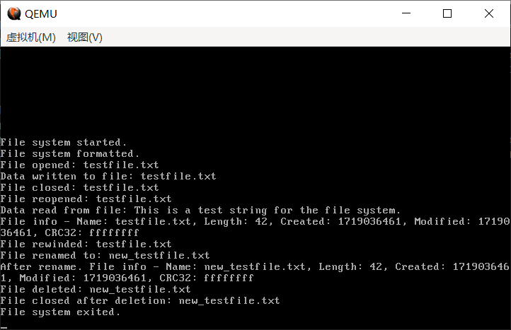

# （二十）文件系统的实现（下）


## 1. 文件元信息相关操作的实现

fs_hl.c

```c
// 校验是否是一个有效的文件元信息
bool is_valid_fileMetaInfo(uint32_t sector_idx) {
    if(sector_idx == 0) {
        return false;
    }
    if(is_used_sector(sector_idx) == false) {
        return false;
    }
    read_sector(sector_idx);
    FileMetaInfo *fmi = (FileMetaInfo *)fs_buffer;
    if(strcmp("HCFSFileMetaMgc", fmi->magic_header) == 0 && fmi->sector_idx == sector_idx) {
        return true;
    }
    return false;
}

// 读出文件元信息到给定的存储文件元信息的空间，参数是存储文件元信息的空间和文件元信息所在扇区，返回值是是否读出一个有效的文件元信息
bool file_read_fileMetaInfo(FileMetaInfo *fmi_buffer, uint32_t fileMetaSector_idx) {
    // 无效的文件元信息，无法处理
    if (is_valid_fileMetaInfo(fileMetaSector_idx) == false) {
        return false;
    }
    // 读取文件元信息
    read_sector(fileMetaSector_idx);
    FileMetaInfo *fmi = (FileMetaInfo *)fs_buffer;
    // 数据复制过去
    memcpy(fmi_buffer, fmi, sizeof(FileMetaInfo));
    return true;
}

// 写出给定的文件元信息到指定的扇区，参数是存储文件元信息的空间和文件元信息所在扇区，返回值是是否写出成功
bool file_write_fileMetaInfo(FileMetaInfo *fmi_buffer, uint32_t fileMetaSector_idx) {
    // 检查给定的是不是一个有效的文件元信息
    if(strcmp("HCFSFileMetaMgc", fmi_buffer->magic_header) != 0) {
        return false;
    }
    if(fmi_buffer->sector_idx != fileMetaSector_idx) {
        return false;
    }
    // 是一个有效的文件元信息，可以写出

    // 读出扇区数据到缓冲区
    read_sector(fileMetaSector_idx);
    // 把开头替换为指定的文件元信息
    memcpy(fs_buffer, fmi_buffer, sizeof(FileMetaInfo));
    // 其他数据不变，写出到外存
    write_sector(fileMetaSector_idx);
    return true;
}

// 常用操作：文件元信息目录计数器+1，传入参数是文件元信息所在的扇区索引，返回是操作是否成功
bool fileMetaInfo_directoryCounter_Increment(uint32_t fileMetaSector_idx) {
    // 无效的文件元信息，无法处理
    if (is_valid_fileMetaInfo(fileMetaSector_idx) == false) {
        return false;
    }
    // 读取文件元信息
    read_sector(fileMetaSector_idx);
    FileMetaInfo *fmi = (FileMetaInfo *)fs_buffer;
    // 数据变更
    fmi->directoryCounter++;
    // 写出
    write_sector(fileMetaSector_idx);
    return true;
}

// 常用操作：文件元信息目录计数器-1，传入参数是文件元信息所在的扇区索引，返回是操作是否成功
bool fileMetaInfo_directoryCounter_Decrement(uint32_t fileMetaSector_idx) {
    // 无效的文件元信息，无法处理
    if (is_valid_fileMetaInfo(fileMetaSector_idx) == false) {
        return false;
    }
    // 读取文件元信息
    read_sector(fileMetaSector_idx);
    FileMetaInfo *fmi = (FileMetaInfo *)fs_buffer;
    // 数据变更
    fmi->directoryCounter--;
    // 记录计数器
    uint32_t directoryCounter = fmi->directoryCounter;
    // 写出
    write_sector(fileMetaSector_idx);
    // 如果引用其的目录已经变成了0，尝试删除
    if (directoryCounter == 0) {
        return file_delete(fileMetaSector_idx);
    }

    return true;
}

```


## 2. 文件相关操作的实现

fs_hl.c

```c
// 校验这个扇区开头是否是一个有效的文件信息
bool is_valid_fileInfo(uint32_t sector_idx) {
    if(sector_idx == 0) {
        return false;
    }
    if(is_used_sector(sector_idx) == false) {
        return false;
    }
    read_sector(sector_idx);
    FileInfo *fileInfo = (FileInfo *)fs_buffer;
    if(fileInfo->magic_number == 0x66697331 && fileInfo->sector_idx == sector_idx) {
        return true;
    }
    return false;
}

// 文件创建，创建一个空文件的文件元信息，返回文件元信息所在的扇区
uint32_t file_create() {
    // 文件元信息结构体
    FileMetaInfo fmi;
    // 清空
    memset(&fmi, 0, sizeof(FileMetaInfo));
    // 申请扇区
    uint32_t sector_idx = acquire_file_sector(1);
    if(sector_idx == 0) {
        // 创建失败，什么都做不了
        return sector_idx;
    }
    // 创建成功就设置各项值
    // 刚创建什么都没有很正常
    // 计数器肯定是0，下一个扇区是0，末尾扇区也是0

    // 魔数头加上
    strcpy(fmi.magic_header, "HCFSFileMetaMgc");
    // 扇区索引加上
    fmi.sector_idx = sector_idx;
    // 计数器（文件元信息就占了一个扇区）
    fmi.sector_count = 1;
    // 时间戳加上
    fmi.creationTime = get_unix_timestamp_now();
    fmi.modificationTime = fmi.creationTime;
    // 文件crc32加上（什么都没有，初始值就是0xffffffff）
    fmi.fileCrc32 = 0xffffffff;
    // 其他都是0，直接写出到外存
    memcpy(fs_buffer, &fmi, sizeof(FileMetaInfo));
    // 写出到外存
    write_sector(fmi.sector_idx);
    // 返回fmi的扇区索引
    return fmi.sector_idx;
}

// 文件删除，返回是否成功，参数是文件元信息所在扇区
bool file_delete(uint32_t fileMetaSector_idx) {
    // 无效的文件元信息，无法处理
    if(is_valid_fileMetaInfo(fileMetaSector_idx) == false) {
        return false;
    }
    read_sector(fileMetaSector_idx);
    FileMetaInfo *fmi = (FileMetaInfo *)fs_buffer;
    if(fmi->directoryCounter > 0) {
        // 有目录还在使用这个文件元信息，不得删除
        return false;
    }
    // 把所有的位图置为未使用即可
    // 这里要用链表操作
    // 逐个release_file_sector

    // 记录文件元信息中的扇区计数和下一个文件扇区索引
    uint32_t sector_count = fmi->sector_count;
    uint32_t current_sector_idx = fmi->next_file_sector_idx;
    uint32_t next_sector_idx;

    // 释放文件元信息所在的扇区
    release_file_sector(fileMetaSector_idx, 1);

    // 循环释放文件数据扇区（i为1是因为文件元信息占据了一个扇区，而且已经被release了）
    for (uint32_t i = 1; i < sector_count; i++) {
        if (current_sector_idx == 0) {
            // 如果意外遇到链表末尾，退出循环
            break;
        }
        // 读取当前扇区的数据
        read_sector(current_sector_idx);
        FileInfo *file_info = (FileInfo *)fs_buffer;
        // 获取下一个文件扇区索引
        next_sector_idx = file_info->next_file_sector_idx;
        // 释放当前扇区
        release_file_sector(current_sector_idx, 1);
        // 移动到下一个扇区
        current_sector_idx = next_sector_idx;
    }

    return true;
}

// 读入文件数据到给定的buffer，参数是文件元信息所在扇区索引，开始读取位置，buffer，读取长度，返回值是读出数据的长度（以字节计算）
uint32_t file_read_context(uint32_t fileMetaSector_idx, uint32_t pos, void *buffer, uint32_t len) {
    if (!is_valid_fileMetaInfo(fileMetaSector_idx)) {
        return 0; // 无效的文件元信息，无法处理
    }

    // 读取文件元信息
    read_sector(fileMetaSector_idx);
    FileMetaInfo *fmi = (FileMetaInfo *)fs_buffer;

    // 检查读取位置是否超出文件长度
    if (pos >= fmi->fileLength) {
        return 0; // 起始位置超出文件长度，无法读取
    }

    // 调整读取长度，确保不会超出文件末尾
    if (pos + len > fmi->fileLength) {
        len = fmi->fileLength - pos;
    }

    // 当前读取的位置和长度
    uint32_t current_pos = pos;
    // 还要读多少字节
    uint32_t bytes_to_read = len;
    uint32_t bytes_read = 0;
    uint8_t *buffer_ptr = (uint8_t *)buffer;

    // 找出第一个文件扇区
    uint32_t current_sector_idx = fmi->next_file_sector_idx;
    // 下一个文件扇区
    uint32_t next_sector_idx;
    // 一共多少个扇区
    uint32_t total_sector_count = fmi->sector_count;

    // 开始读取文件数据
    // 用for循环记录现在读的第几个扇区
    for (uint32_t current_sector = 1; current_sector < total_sector_count && bytes_to_read > 0; current_sector++) {
        // 校验是否是一个文件扇区
        if( !is_valid_fileInfo(current_sector_idx) ) {
            // 如果不是，直接返回已读的字节数
            return bytes_read;
        }
        // 确实是一个文件扇区
        read_sector(current_sector_idx);
        FileInfo *file_info = (FileInfo *)fs_buffer;

        // 读入到缓冲区之后先更新下标
        next_sector_idx = file_info->next_file_sector_idx;

        // 判断是否在这个扇区内（就是current_pos是否在这个扇区内）
        // 因为之前计算好了，一个扇区有512个字节，一个文件扇区前12个字节都给了记录信息，后500字节是数据
        // 假设扇区开头是0，那么结束位置就是499，一共500个
        // 此时current_sector = 1，在那么500就是下一个扇区的位置
        // 因此current_pos >= 0 且 current_pos < 500，那么就在这个扇区中
        // 因为都是从0开始，所以只需要判断current_pos < 500即可命中

        // 所以写条件 current_pos < current_sector * 500
        // 记住current_pos要变动

        if(current_pos < current_sector * 500) {
            // 在这个扇区范围内
            // 先计算偏移量和读取数量
            uint32_t sector_data_offset = current_pos % 500;
            uint32_t sector_bytes_to_read = 500 - sector_data_offset;
            // 防止最后一个扇区的特殊情况（数据不满整个扇区）
            if (sector_bytes_to_read > bytes_to_read) {
                sector_bytes_to_read = bytes_to_read;
            }
            // 从这个偏移量开始读到末尾
            memcpy(buffer_ptr, file_info->data + sector_data_offset, sector_bytes_to_read);
            // 指针步进
            buffer_ptr += sector_bytes_to_read;
            // 读取位置变动
            current_pos += sector_bytes_to_read;
            // 已经读取的字节数变动
            bytes_read += sector_bytes_to_read;
            // 还要读多少字节
            bytes_to_read -= sector_bytes_to_read;
        }

        // 读取完毕，步进到下一个扇区
        current_sector_idx = next_sector_idx;
    }

    return bytes_read;
}

// 将给定的数据写出到文件某个位置之后，参数是文件元信息所在扇区索引，开始写出位置（注意，该位置之后的数据将会永久丢失），buffer，读取长度，返回值是读出数据的长度（以字节计算）
uint32_t file_write_context(uint32_t fileMetaSector_idx, uint32_t pos, void *buffer, uint32_t len) {
    if (!is_valid_fileMetaInfo(fileMetaSector_idx)) {
        return 0; // 无效的文件元信息，无法处理
    }

    // 读取文件元信息
    FileMetaInfo fmi;
    read_sector(fileMetaSector_idx);
    memcpy(&fmi, fs_buffer, sizeof(FileMetaInfo));

    // 不得越界写
    if(pos > fmi.fileLength) {
        return 0;
    }

    // 当前写入的位置和长度
    uint32_t current_pos = pos;
    uint32_t bytes_to_write = len;
    uint32_t bytes_written = 0;
    uint8_t *buffer_ptr = (uint8_t *)buffer;

    // 找出第一个文件扇区
    uint32_t current_sector_idx = fmi.next_file_sector_idx;

    // 通用逻辑，其实可以特化处理写入文件末尾的情况，能提高不少效率

    // 文件扇区数据（用于保存当前的信息）
    FileInfo fileInfo;
    // 上一个扇区的索引
    uint32_t prev_file_sector_idx = 0;
    // 记录现在是第几个扇区
    uint32_t current_sector = 1;

    // 写入数据要用while循环，因为不知道有多长
    while(bytes_to_write > 0) {

        // 判断要不要申请一个文件扇区
        if(current_sector_idx == 0) {
            // 相当于写入空文件了，申请一个扇区
            uint32_t sector_idx = acquire_file_sector(1);
            if(sector_idx == 0) {
                // 申请不了，直接return
                return bytes_written;
            }
            // 清空缓冲区，直接写出
            memset(fs_buffer, 0, sizeof(FileInfo));
            ((FileInfo *)fs_buffer)->magic_number = 0x66697331;
            ((FileInfo *)fs_buffer)->sector_idx = sector_idx;
            write_sector(sector_idx);

            // 如果前一个是0，说明是写入空文件
            if(prev_file_sector_idx == 0) {
                fmi.next_file_sector_idx = sector_idx;
            } else {
                // 接续链表
                // 读入直接写出，节省时间
                read_sector(prev_file_sector_idx);
                ((FileInfo *)fs_buffer)->next_file_sector_idx = sector_idx;
                write_sector(prev_file_sector_idx);
            }
            // 统一操作，fmi的扇区计数器增加
            fmi.sector_count++;
            // 更新current_sector_idx
            current_sector_idx = sector_idx;
        }

        if(!is_valid_fileInfo(current_sector_idx)) {
            // 碰上这种情况说明文件损坏
            return bytes_written;
        }

        // 读入扇区
        read_sector(current_sector_idx);
        memcpy(&fileInfo, fs_buffer, sizeof(FileInfo));

        // 仿照read的逻辑，只要 current_pos < current_sector * 500 即可命中
        if(current_pos < current_sector * 500) {
            // 在这个扇区范围内
            // 先计算偏移量和写出数量
            uint32_t sector_data_offset = current_pos % 500;
            uint32_t sector_bytes_to_write = 500 - sector_data_offset;
            // 防止最后一个扇区的特殊情况（数据不满整个扇区）
            if (sector_bytes_to_write > bytes_to_write) {
                sector_bytes_to_write = bytes_to_write;
            }
            // 之前扇区已经被读入到fileInfo中了，修改fileInfo的内容即可
            // 从这个偏移量开始读到末尾
            memcpy(fileInfo.data + sector_data_offset, buffer_ptr, sector_bytes_to_write);
            // 写出到外存
            memcpy(fs_buffer, &fileInfo, sizeof(FileInfo));
            write_sector(fileInfo.sector_idx);
            // 指针步进
            buffer_ptr += sector_bytes_to_write;
            // 读取位置变动
            current_pos += sector_bytes_to_write;
            // 已经读取的字节数变动
            bytes_written += sector_bytes_to_write;
            // 还要读多少字节
            bytes_to_write -= sector_bytes_to_write;
        }

        // 更新索引
        prev_file_sector_idx = current_sector_idx;
        current_sector_idx = fileInfo.next_file_sector_idx;
        current_sector++;
    }

    // 更新文件元信息
    fmi.fileLength = current_pos;
    fmi.modificationTime = get_unix_timestamp_now();
    fmi.fileCrc32 = fileCrc32(&fmi);

    // 写出文件元信息
    memcpy(fs_buffer, &fmi, sizeof(FileMetaInfo));
    write_sector(fmi.sector_idx);
    return bytes_written;
}

```


## 3. 其余工具函数的实现

fs_hl.c

```c
// 将目录转变为文件，该目录不能有子目录，否则会被认为是目录而非文件（其实就是修改，把文件元信息扇区加上去而已）
bool convert_dir_to_file(uint32_t dir_sector_idx, uint32_t fileMetaSector_idx) {
    if(!is_valid_directory(dir_sector_idx)) {
        // 目录无效不操作
        return false;
    }
    if(!is_valid_fileMetaInfo(fileMetaSector_idx)) {
        // 文件元信息无效不操作
        return false;
    }
    read_sector(dir_sector_idx);
    if(((DirectoryInfo *)fs_buffer)->subdirectory_count != 0 || ((DirectoryInfo *)fs_buffer)->subdirectory_sector_idx != 0) {
        // 有子目录说明这是个目录，不能成为文件
        return false;
    }
    ((DirectoryInfo *)fs_buffer)->fileMetadata_sector_idx = fileMetaSector_idx;
    write_sector(dir_sector_idx);
    return true;
}


// 下面是通过查表法速算crc32摘要算法

// 查找表（限制作用域在本文件范围内）
static uint32_t crc32_table[256];

// 初始化crc32查找表
void init_crc32_table() {
    uint32_t polynomial = 0xedb88320;
    for (uint32_t i = 0; i < 256; i++) {
        uint32_t crc = i;
        for (uint32_t j = 8; j > 0; j--) {
            if (crc & 1) {
                crc = (crc >> 1) ^ polynomial;
            } else {
                crc = crc >> 1;
            }
        }
        crc32_table[i] = crc;
    }
}

// 计算文件的crc32，参数是文件元信息指针
uint32_t fileCrc32(FileMetaInfo *fmi){

    // 初始化 CRC32 值
    uint32_t crc = 0xffffffff;

    // 获取第一个文件扇区索引
    uint32_t current_sector_idx = fmi->next_file_sector_idx;

    // 遍历文件扇区链表
    while (current_sector_idx != 0) {
        // 校验文件扇区
        if (!is_valid_fileInfo(current_sector_idx)) {
            return 0xffffffff; // 无效的文件扇区
        }

        // 读取文件扇区
        read_sector(current_sector_idx);
        FileInfo *file_info = (FileInfo *)fs_buffer;

        // 计算当前扇区数据的 CRC32
        for (uint32_t i = 0; i < sizeof(file_info->data); i++) {
            uint8_t byte = file_info->data[i];
            uint32_t lookupIndex = (crc ^ byte) & 0xff;
            crc = (crc >> 8) ^ crc32_table[lookupIndex];
        }

        // 获取下一个文件扇区索引
        current_sector_idx = file_info->next_file_sector_idx;
    }

    // 返回最终的 CRC32 值
    return crc ^ 0xffffffff;
}

```


## 4. 文件系统对外接口实现

fs.c

```c
//
// Created by huangcheng on 2024/6/21.
//

#include "fs.h"
#include "fs_int.h"

// 本来这部分也属于hl
// 我是觉得写在同一个文件里面太多了

// 文件系统启动
int16_t fs_start(void) {
    // 读入超级块
    // 正常情况下这里分很多模式，比如检查，扫盘之类的，Linux在这方面卡得很严
    // 我这里没那么多讲究，我连盘都是虚拟的，直接读超级块就得了

    // 判断超级块是否有效
    // 如果超级块无效的话，要格式化

    if(is_valid_superblock()) {
        read_superblock();
        return 0;
    } else {
        return fs_format(FS_FORMAT_SOFT);
    }
}
// 文件系统退出
int16_t fs_exit(void) {
    // 要把超级块写出到外存
    write_superblock();
    return 0;
}
// 格式化文件系统
int16_t fs_format(uint8_t fmode) {
    if(fmode == FS_FORMAT_FULL) {
        // 完全格式化要清盘，太浪费时间了，不模仿了

        // 传入多少个扇区，初始化超级块
        init_superblock(DISK_SIZE / 512);
        // 建立根目录
        create_root_directory();
        // 写出超级块
        write_superblock();

        return 0;
    }

    if(fmode == FS_FORMAT_SOFT) {
        // 软格式化就是重建超级块和位图而已

        // 传入多少个扇区，初始化超级块
        init_superblock(DISK_SIZE / 512);
        // 建立根目录
        create_root_directory();
        // 写出超级块
        write_superblock();

        return 0;
    }
    return -1;
}

// 打开文件
int16_t fs_open(FS_DESC *pdesc, char* pname) {
    // 查找目录信息
    uint32_t dir_sector = find_directory(pname, SBlk->root_dir_sector);
    // 如果没找到的话就创建新的
    if (dir_sector == 0) {
        // 创建新文件
        // 现在还没想好怎么解决目录路径的问题，直接全部建立在根目录下
        if (create_directory(pname, SBlk->root_dir_sector, 0) == false) {
            return -2; // 创建目录失败
        }
    }

    // 再次查找
    dir_sector = find_directory(pname, SBlk->root_dir_sector);

    // 读取目录信息
    DirectoryInfo dir_info;
    if (read_directory(&dir_info, dir_sector) == false) {
        return -1; // 读取目录信息失败
    }

    // 初始化文件描述符
    pdesc->dir_sector_idx = dir_sector;
    pdesc->fmi_sector_idx = dir_info.fileMetadata_sector_idx;
    pdesc->file_pos = 0;

    return 0;
}

// 关闭文件
int16_t fs_close(FS_DESC *pdesc) {
    if(!pdesc || !pdesc->dir_sector_idx) {
        return -1;
    }
    // 因为内容保存工作都被其他操作做了
    // 所以这里直接不做任何操作
    return 0;
}

// 读取文件
int32_t fs_read(FS_DESC *pdesc, uint8_t *pdest, uint32_t anz) {
    if(!pdesc || !pdesc->dir_sector_idx || !pdesc->fmi_sector_idx) {
        return -1;
    }
    if(file_read_context(pdesc->fmi_sector_idx, pdesc->file_pos, pdest, anz) > 0) {
        pdesc->file_pos += anz;
        return 0;
    }
    return -1;
}

// 写入文件
int16_t fs_write(FS_DESC *pdesc, uint8_t *pdata, uint32_t len) {
    if(!pdesc || !pdesc->dir_sector_idx) {
        return -1;
    }
    if(pdesc->fmi_sector_idx == 0) {
        // 建立一个文件元信息
        uint32_t fmi_sector_idx = file_create();
        if(fmi_sector_idx == 0) {
            // 创建文件元信息失败
            return -2;
        }
        // 把目录转变为文件
        if (convert_dir_to_file(pdesc->dir_sector_idx, fmi_sector_idx) == false ) {
            // 转变失败，说明有问题
            // 销毁文件元信息
            file_delete(fmi_sector_idx);
            return -3;
        }
        pdesc->fmi_sector_idx = fmi_sector_idx;
    }

    uint32_t byte_written = file_write_context(pdesc->fmi_sector_idx, pdesc->file_pos, pdata, len);
    if(byte_written > 0) {
        pdesc->file_pos += byte_written;
        return 0;
    }
    return -1;
}

// 重置文件位置
int16_t fs_rewind(FS_DESC *pdesc) {
    if(!pdesc || !pdesc->dir_sector_idx) {
        return -1;
    }

    if(pdesc->file_pos > 0 && pdesc->fmi_sector_idx == 0) {
        // 这是什么情况我没搞明白
        return -1;
    }

    pdesc->file_pos = 0;

    return 0;
}

// 删除文件
int16_t fs_delete(FS_DESC *pdesc) {
    if(!pdesc || !pdesc->dir_sector_idx) {
        return -1;
    }
    if(delete_directory(pdesc->dir_sector_idx)) {
        return 0;
    }
    return -1;
}

// 重命名文件
int16_t fs_rename(FS_DESC *pdesc, const char *pname) {
    if(!pdesc || !pdesc->dir_sector_idx) {
        return -1;
    }
    if(rename_directory(pdesc->dir_sector_idx, pname)) {
        return 0;
    }
    return -1;
}

// 获取文件的 CRC32 值
uint32_t fs_get_crc32(FS_DESC *pdesc) {
    if(!pdesc || !pdesc->dir_sector_idx) {
        // 文件不存在的话要返回0xffffffff
        return 0xffffffff;
    }
    if(pdesc->fmi_sector_idx == 0) {
        // 文件不存在的话要返回0xffffffff
        return 0xffffffff;
    }
    read_sector(pdesc->fmi_sector_idx);
    return ((FileMetaInfo *)fs_buffer)->fileCrc32;
}

// 获取文件统计信息
int16_t fs_info(FS_DESC *pdesc,FS_STAT *stat) {
    if(!pdesc || !pdesc->dir_sector_idx) {
        return -1;
    }
    if(!is_valid_directory(pdesc->dir_sector_idx)) {
        // 这是一个无效的目录
        return -1;
    }
    memset(stat, 0, sizeof(FS_STAT));
    read_sector(pdesc->dir_sector_idx);
    strcpy(stat->fname, ((DirectoryInfo *)fs_buffer)->directoryName);
    // 目录的时间戳为0，crc32为0xffffffff
    stat->file_crc32 = 0xffffffff;
    // 如果是文件就接着读
    if(pdesc->fmi_sector_idx) {
        // fmi不是0的情况下可以试试接着读
        if(!is_valid_fileMetaInfo(pdesc->fmi_sector_idx)) {
            // 这是一个有效的目录，但不是一个有效的文件
            return -1;
        }
        read_sector(pdesc->fmi_sector_idx);
        stat->file_len = ((FileMetaInfo *)fs_buffer)->fileLength;
        stat->file_ctime = ((FileMetaInfo *)fs_buffer)->creationTime;
        stat->file_mtime = ((FileMetaInfo *)fs_buffer)->modificationTime;
        stat->file_crc32 = ((FileMetaInfo *)fs_buffer)->fileCrc32;
    }

    return 0;
}


// 为了实现时间戳的工具宏定义、数组、函数

#define SECONDS_PER_MINUTE 60
#define MINUTES_PER_HOUR 60
#define HOURS_PER_DAY 24
#define SECONDS_PER_HOUR (SECONDS_PER_MINUTE * MINUTES_PER_HOUR)
#define SECONDS_PER_DAY (SECONDS_PER_HOUR * HOURS_PER_DAY)
#define DAYS_PER_YEAR 365
#define DAYS_PER_LEAP_YEAR 366

static const uint16_t days_in_month[12] = { 31, 28, 31, 30, 31, 30, 31, 31, 30, 31, 30, 31 };

// 判断是否是闰年
int is_leap_year(int year) {
    if (year % 4 == 0) {
        if (year % 100 == 0) {
            if (year % 400 == 0) {
                return 1;
            } else {
                return 0;
            }
        } else {
            return 1;
        }
    } else {
        return 0;
    }
}


// 将时间戳转换为日期
void fs_timestamp_to_date(uint32_t asecs, FS_DATE *pd) {
    uint32_t days = asecs / SECONDS_PER_DAY;
    uint32_t seconds_in_day = asecs % SECONDS_PER_DAY;

    // 计算小时、分钟和秒
    pd->hour = seconds_in_day / SECONDS_PER_HOUR;
    pd->minute = (seconds_in_day % SECONDS_PER_HOUR) / SECONDS_PER_MINUTE;
    pd->second = seconds_in_day % SECONDS_PER_MINUTE;

    uint32_t year = 1970;
    while (1) {
        uint32_t days_in_year = is_leap_year(year) ? DAYS_PER_LEAP_YEAR : DAYS_PER_YEAR;
        if (days >= days_in_year) {
            days -= days_in_year;
            year++;
        } else {
            break;
        }
    }
    pd->year = year;

    uint32_t month = 0;
    while (1) {
        uint32_t days_in_month_current = days_in_month[month];
        if (month == 1 && is_leap_year(year)) {
            days_in_month_current++; // 闰年的二月
        }
        if (days >= days_in_month_current) {
            days -= days_in_month_current;
            month++;
        } else {
            break;
        }
    }
    pd->month = month + 1; // 月份是从1开始
    pd->day = days + 1;    // 日期是从1开始
}

// 将日期转换为时间戳
uint32_t fs_date_to_timestamp(FS_DATE *pd) {
    uint32_t total_days = 0;

    // 计算从1970年到目标年份的总天数
    for (uint32_t year = 1970; year < pd->year; year++) {
        total_days += is_leap_year(year) ? DAYS_PER_LEAP_YEAR : DAYS_PER_YEAR;
    }

    // 计算目标年份中，从1月到目标月份的总天数
    for (uint32_t month = 0; month < pd->month - 1; month++) {
        total_days += days_in_month[month];
        if (month == 1 && is_leap_year(pd->year)) {
            total_days++; // 闰年的二月
        }
    }

    // 加上目标月份中的天数
    total_days += pd->day - 1;

    // 计算总秒数
    uint32_t total_seconds = total_days * SECONDS_PER_DAY;
    total_seconds += pd->hour * SECONDS_PER_HOUR;
    total_seconds += pd->minute * SECONDS_PER_MINUTE;
    total_seconds += pd->second;

    return total_seconds;
}

```


## 5. 文件系统测试

kernel.c

```c
#include "../lib/lib_kernel/lib_kernel.h"
#include "kernel_page/kernel_page.h"
#include "kernel_gdt/kernel_gdt.h"
#include "kernel_idt/kernel_idt.h"
#include "kernel_device/kernel_device.h"
#include "kernel_memory/kernel_memory.h"
#include "kernel_task/kernel_task.h"
#include "../devices/console/console.h"
#include "kernel_buffer/kernel_buffer.h"
#include "../user/process/process.h"
#include "../devices/ramdisk/ramdisk.h"

#include "../lib/lib_user/syscall.h"

#include "../fs/fs.h"

// 文件系统测试函数
void test_fs();

void kernel_main(void) {

    uint32_t total_physical_memory = *((uint32_t *)(0xa09));
    // 内存分页初始化
    init_paging();
    // 重新加载gdt
    setup_gdt();
    // 调整ESP，将栈指针切换到高地址（栈大小增加到0x1500）
    switch_esp_virtual_addr();
    // 初始化idt
    init_idt();
    // 先初始化任务管理结构（这样所有任务就能用统一的内存管理逻辑了）
    init_multitasking();
    // 初始化内存管理
    init_memory(total_physical_memory);
    // 初始化所有设备
    init_all_devices();

    // 允许PIC_IRQ0中断，才可以让定时器调度线程
    enable_pic_irq_interrupt(0);
    // 开启全局中断
    intr_enable();

    // 测试文件系统
    test_fs();

    // 进入内核主循环或其它初始化代码
    for(;;) {
    }
    // 退出主循环卸载设备驱动
    exit_all_devices();
}

// 文件系统测试函数
void test_fs() {
    FS_DESC fileDesc;
    FS_STAT fileStat;
    uint8_t readBuffer[512];
    const char *testFilename = "testfile.txt";
    const char *testData = "This is a test string for the file system.";
    int16_t result;

    // 启动文件系统
    result = fs_start();
    if (result != 0) {
        console_printf("Failed to start file system.\n");
        return;
    }
    console_printf("File system started.\n");

    // 格式化文件系统（完全格式化）
    result = fs_format(FS_FORMAT_FULL);
    if (result != 0) {
        console_printf("Failed to format file system.\n");
        fs_exit();
        return;
    }
    console_printf("File system formatted.\n");

    // 打开文件（创建并写入）
    result = fs_open(&fileDesc, (char *)testFilename);
    if (result < 0) {
        console_printf("%d Failed to open file: %s\n", result, testFilename);
        fs_exit();
        return;
    }
    console_printf("File opened: %s\n", testFilename);

    // 写入文件
    result = fs_write(&fileDesc, (uint8_t *)testData, strlen(testData));
    if (result < 0) {
        console_printf("%d Failed to write file: %s\n", result, testFilename);
        fs_close(&fileDesc);
        fs_exit();
        return;
    }
    console_printf("Data written to file: %s\n", testFilename);

    // 关闭文件
    result = fs_close(&fileDesc);
    if (result != 0) {
        console_printf("Failed to close file: %s\n", testFilename);
        fs_exit();
        return;
    }
    console_printf("File closed: %s\n", testFilename);

    // 重新打开文件（读取）
    result = fs_open(&fileDesc, (char *)testFilename);
    if (result != 0) {
        console_printf("Failed to reopen file: %s\n", testFilename);
        fs_exit();
        return;
    }
    console_printf("File reopened: %s\n", testFilename);

    // 读取文件
    result = fs_read(&fileDesc, readBuffer, sizeof(readBuffer) - 1);
    if (result < 0) {
        console_printf("Failed to read from file: %s\n", testFilename);
        fs_close(&fileDesc);
        fs_exit();
        return;
    }
    console_printf("Data read from file: %s\n", readBuffer);

    // 获取文件信息
    result = fs_info(&fileDesc, &fileStat);
    if (result != 0) {
        console_printf("Failed to get file info: %s\n", testFilename);
        fs_close(&fileDesc);
        fs_exit();
        return;
    }
    console_printf("File info - Name: %s, Length: %u, Created: %u, Modified: %u, CRC32: %08x\n",
           fileStat.fname, fileStat.file_len, fileStat.file_ctime, fileStat.file_mtime, fileStat.file_crc32);

    // 重置文件位置
    result = fs_rewind(&fileDesc);
    if (result != 0) {
        console_printf("Failed to rewind file: %s\n", testFilename);
        fs_close(&fileDesc);
        fs_exit();
        return;
    }
    console_printf("File rewinded: %s\n", testFilename);

    // 重命名文件
    const char *newFilename = "new_testfile.txt";
    result = fs_rename(&fileDesc, newFilename);
    if (result < 0) {
        console_printf("Failed to rename file: %s to %s\n", testFilename, newFilename);
        fs_close(&fileDesc);
        fs_exit();
        return;
    }
    console_printf("File renamed to: %s\n", newFilename);

    // 重命名后再次获取文件信息
    result = fs_info(&fileDesc, &fileStat);
    if (result != 0) {
        console_printf("Failed to get file info: %s\n", testFilename);
        fs_close(&fileDesc);
        fs_exit();
        return;
    }
    console_printf("After rename. File info - Name: %s, Length: %u, Created: %u, Modified: %u, CRC32: %08x\n",
                   fileStat.fname, fileStat.file_len, fileStat.file_ctime, fileStat.file_mtime, fileStat.file_crc32);

    // 删除文件
    result = fs_delete(&fileDesc);
    if (result < 0) {
        console_printf("Failed to delete file: %s\n", newFilename);
        fs_close(&fileDesc);
        fs_exit();
        return;
    }
    console_printf("File deleted: %s\n", newFilename);

    // 关闭文件
    result = fs_close(&fileDesc);
    if (result != 0) {
        console_printf("Failed to close file after deletion: %s\n", newFilename);
        fs_exit();
        return;
    }
    console_printf("File closed after deletion: %s\n", newFilename);

    // 退出文件系统
    result = fs_exit();
    if (result != 0) {
        console_printf("Failed to exit file system.\n");
        return;
    }
    console_printf("File system exited.\n");
}

```

测试结果：



测试通过，总算有一个能用的文件系统了。
