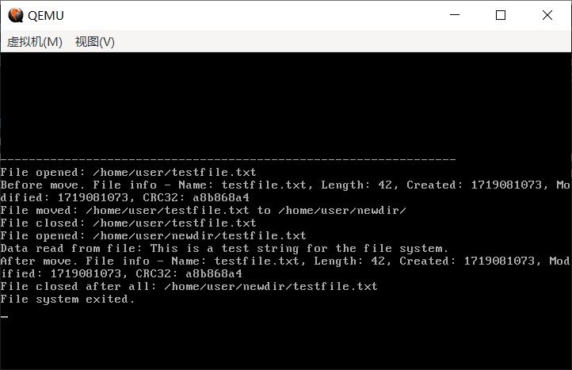

# （二十一）文件系统补正


## 1. 发现的问题

fs_hl.c

```c
// 查找目录（查找起点目录包括所有子目录，因此要递归查找）
uint32_t find_directory(const char* name, uint32_t sector_idx) {
    if (!is_valid_directory(sector_idx)) {
        // 都不是一个有效的目录，直接返回0
        return 0;
    }

    read_sector(sector_idx);
    DirectoryInfo *dir_info = (DirectoryInfo*)fs_buffer;

    // 检查当前目录是否匹配（起点目录本身，因为父目录保存的子目录索引是有信息的）
    if (strcmp(dir_info->directoryName, name) == 0) {
        return sector_idx;
    }

    // 父目录所保存的子目录结点
    // 如果起点目录不匹配，就开始往下递归找子目录
    uint32_t current_sector_idx = dir_info->subdirectory_sector_idx;

    // 如果已经到达文件树最深处，下面已经没有子目录了
    // 那么subdirectory_count必定是0，无法进入这个循环，也就无法递归
    // 也就有了递归结束条件

    // 父目录保存了子目录的数量，可以通过这个写一个for循环
    // 防止while循环造成的无限循环问题（因为每个新目录都设了自环）
    uint32_t subdirectory_count = dir_info->subdirectory_count;

    for(uint32_t i = 0; i < subdirectory_count; i++) {
        // 递归查找，深度优先
        uint32_t found_idx = find_directory(name, current_sector_idx);
        if (found_idx != 0) {
            return found_idx;
        }
        // 更换结点
        read_sector(current_sector_idx);
        // 取后兄弟
        // dir_info是个指针，重读数据之后，值也会跟着变动
        current_sector_idx = dir_info->nextSiblingDirectory_sector_idx;
    }

    // 返回0就意味着没成功，因为扇区0是超级块，很容易判断出来
    return 0;
}

```

这个find_directory的实现逻辑，我查了好久都没查出来有什么问题。但是就很奇怪，刚刚create出来的目录用这个查不到！！！

第二次查又能查到了！真把我整麻了，算了。不研究了。


然后是create_directory和move_directory共有的把自身加入到新父目录的子目录链表中的逻辑代码，之前写的时候没注意到，今晚上测试才发现错了。

主要是要保存下来tail_node_sector_idx，不然会丢失。move_directory也是相同的做法。

fs_hl.c

```c
    if (parent_dir.subdirectory_sector_idx == 0) {
        // 父目录没有子目录，直接将新目录设置为父目录保存的子目录结点
        parent_dir.subdirectory_sector_idx = new_dir_sector_idx;
    } else {
        // 父目录有子目录，需要使用子目录结点的prevSiblingDirectory_sector_idx找到链表尾部
        // 父目录的子目录结点是当前目录的兄弟，作为头结点存在
        read_sector(parent_dir.subdirectory_sector_idx);
        DirectoryInfo sibling_dir;
        memcpy(&sibling_dir, fs_buffer, sizeof(DirectoryInfo));

        // 为了节省栈内存，sibling_dir要前后代表两个不同的值
        // 其实如果是只有单独一个兄弟的情况可以特殊处理，少读一个tail_sibling_dir，这里懒，为了统一，直接全读了

        // 之前已经固定每个新目录的前后兄弟目录都指向自己
        // 然后就是双向链表标准流程了

        // 先记录下尾结点的扇区索引，不然修改之后就丢失了（必须要保存！）
        uint32_t tail_node_sector_idx = sibling_dir.prevSiblingDirectory_sector_idx;

        sibling_dir.prevSiblingDirectory_sector_idx = new_dir.sector_idx;       // 头结点的prev指向新加入的结点
        new_dir.nextSiblingDirectory_sector_idx = sibling_dir.sector_idx;       // 新结点的next指向头结点

        // 更新头结点校验和，写出到外存
        update_checksum(&sibling_dir);
        memcpy(fs_buffer, &sibling_dir, sizeof(DirectoryInfo));
        write_sector(sibling_dir.sector_idx);

        // 读最后一个结点（尾结点），此时内存中sibling_dir还是头结点的值
        read_sector(tail_node_sector_idx);
        memcpy(&sibling_dir, fs_buffer, sizeof(DirectoryInfo));
        // 此时sibling_dir是尾结点tail
        sibling_dir.nextSiblingDirectory_sector_idx = new_dir.sector_idx;       // 原先tail的next指向新结点
        new_dir.prevSiblingDirectory_sector_idx = sibling_dir.sector_idx;       // 新结点的prev指向原先的tail

        // 更新尾结点校验和，写出到外存
        update_checksum(&sibling_dir);
        memcpy(fs_buffer, &sibling_dir, sizeof(DirectoryInfo));
        write_sector(sibling_dir.sector_idx);
    }

```

而后就是因为第一个find_directory的问题，实在没办法，只能用create来了个投机取巧的方法。

fs_hl.c

```c
// 创建目录（如果是一个文件的话，file_metadata_sector_idx不得为0），返回操作是否成功
bool create_directory(const char *name, uint32_t parent_sector_idx, uint32_t file_metadata_sector_idx) {
    // 没有父目录必须return，创建root目录有专门的函数
    if(parent_sector_idx == 0) {
        return false;
    }
    // file_metadata_sector_idx不是0必须校验
    if (file_metadata_sector_idx > 0 && !is_valid_fileMetaInfo(file_metadata_sector_idx)) {
        return false;
    }

    // 把父目录信息从缓冲区保存到临时变量，等下要用到
    read_sector(parent_sector_idx);
    DirectoryInfo parent_dir;
    memcpy(&parent_dir, fs_buffer, sizeof(DirectoryInfo));

    // 这里还应该加一套保护措施
    // 如果发现已有就返回true
    // 意为不用创建
    uint32_t tempidx = parent_dir.subdirectory_sector_idx;
    for(uint32_t i = 0; i < parent_dir.subdirectory_count; i++) {
        // 检查每一个兄弟目录
        if(is_valid_directory(tempidx)) {
            read_sector(tempidx);
            if( strcmp(((DirectoryInfo*)fs_buffer)->directoryName, name) == 0) {
                // 已有，不用创建
                return true;
            }
            tempidx = ((DirectoryInfo*)fs_buffer)->nextSiblingDirectory_sector_idx;
        } else {
            // 如果不过关的话，直接不检查了，这也不懂怎么回事
            break;
        }
    }

    // 申请一个新扇区
    uint32_t new_dir_sector_idx = acquire_directory_sector();

    // 没空余扇区放目录了，返回创建失败
    if (new_dir_sector_idx == 0) {
        return false;
    }

    // 全新的512字节的目录信息
    DirectoryInfo new_dir;
    // 先清空
    memset(&new_dir, 0, sizeof(DirectoryInfo));
    // 设置各项信息
    strcpy(new_dir.magic_header, "HCFileSystemDir");
    strcpy(new_dir.directoryName, name);
    // 记录自己在哪个扇区，方便操作
    new_dir.sector_idx = new_dir_sector_idx;
    new_dir.parentDirectory_sector_idx = parent_sector_idx;
    new_dir.fileMetadata_sector_idx = file_metadata_sector_idx;
    strcpy(new_dir.magic_header2, "ThisDirIsValid_");

    // 因为视为双向链表的结点
    // 先把兄弟目录扇区号设置为自己
    new_dir.prevSiblingDirectory_sector_idx = new_dir_sector_idx;
    new_dir.nextSiblingDirectory_sector_idx = new_dir_sector_idx;

    // 子目录也是0，新目录哪来的子目录
    new_dir.subdirectory_count = 0;
    new_dir.subdirectory_sector_idx = 0;

    //接下来的操作
    // 1. 更新父目录的子目录计数器
    // 2. 如果父目录没有子目录（子目录扇区索引为0），则将这个目录作为父目录的子目录扇区索引
    // 3. 如果父目录有子目录索引，则将父目录保存的子目录索引视为双向链表的头结点（只不过这个头结点还保存信息，注意！！），把当前结点插入到这个链表中！
    // 4. 因此还要更新父目录保存的那个作为头结点的子目录的值

    if (parent_dir.subdirectory_sector_idx == 0) {
        // 父目录没有子目录，直接将新目录设置为父目录保存的子目录结点
        parent_dir.subdirectory_sector_idx = new_dir_sector_idx;
    } else {
        // 父目录有子目录，需要使用子目录结点的prevSiblingDirectory_sector_idx找到链表尾部
        // 父目录的子目录结点是当前目录的兄弟，作为头结点存在
        read_sector(parent_dir.subdirectory_sector_idx);
        DirectoryInfo sibling_dir;
        memcpy(&sibling_dir, fs_buffer, sizeof(DirectoryInfo));

        // 为了节省栈内存，sibling_dir要前后代表两个不同的值
        // 其实如果是只有单独一个兄弟的情况可以特殊处理，少读一个tail_sibling_dir，这里懒，为了统一，直接全读了

        // 之前已经固定每个新目录的前后兄弟目录都指向自己
        // 然后就是双向链表标准流程了

        // 先记录下尾结点的扇区索引，不然修改之后就丢失了
        uint32_t tail_node_sector_idx = sibling_dir.prevSiblingDirectory_sector_idx;

        sibling_dir.prevSiblingDirectory_sector_idx = new_dir.sector_idx;       // 头结点的prev指向新加入的结点
        new_dir.nextSiblingDirectory_sector_idx = sibling_dir.sector_idx;       // 新结点的next指向头结点

        // 更新头结点校验和，写出到外存
        update_checksum(&sibling_dir);
        memcpy(fs_buffer, &sibling_dir, sizeof(DirectoryInfo));
        write_sector(sibling_dir.sector_idx);

        // 读最后一个结点（尾结点），此时内存中sibling_dir还是头结点的值
        read_sector(tail_node_sector_idx);
        memcpy(&sibling_dir, fs_buffer, sizeof(DirectoryInfo));
        // 此时sibling_dir是尾结点tail
        sibling_dir.nextSiblingDirectory_sector_idx = new_dir.sector_idx;       // 原先tail的next指向新结点
        new_dir.prevSiblingDirectory_sector_idx = sibling_dir.sector_idx;       // 新结点的prev指向原先的tail

        // 更新尾结点校验和，写出到外存
        update_checksum(&sibling_dir);
        memcpy(fs_buffer, &sibling_dir, sizeof(DirectoryInfo));
        write_sector(sibling_dir.sector_idx);
    }

    // 更新父目录的子目录计数器
    parent_dir.subdirectory_count++;
    // 更新父目录校验和
    update_checksum(&parent_dir);
    // 写出父目录
    memcpy(fs_buffer, &parent_dir, sizeof(DirectoryInfo));
    write_sector(parent_dir.sector_idx);


    // 更新创建目录的校验和，写出这个新目录到新分配的扇区
    update_checksum(&new_dir);
    memcpy(fs_buffer, &new_dir, sizeof(DirectoryInfo));
    write_sector(new_dir.sector_idx);

    // 更新文件元信息的计数器
    fileMetaInfo_directoryCounter_Increment(file_metadata_sector_idx);

    return true;
}

```

只要发现父目录的子目录链表里面有同名，直接返回true，保证唯一性。


## 2. 实现路径解析的fs_open

fs.c

```c
// 打开文件
int16_t fs_open(FS_DESC *pdesc, char* pname) {
    if(strlen(pname) == 0) {
        return -1;
    }
    if(pname[0] != '/') {
        // 路径必须是/开头的绝对路径
        return -1;
    }
    // 解析路径
    char dir_name[FS_FILENAME_MAX_LEN + 1] = { 0 };
    // 因为第一个字符肯定是/，所以从第二个字符开始扫
    uint32_t idx_start = 0, idx_end = 1 , len = strlen(pname);

    // 起点是root目录
    uint32_t parentDirSector = SBlk->root_dir_sector;
    // 记录当前的目录扇区
    uint32_t dir_sector;

    // 路径约定格式，类似于Linux
    // /home/username/123.txt

    // 双指针法解析目录
    for(; idx_end <= len; idx_end++) {
        if(pname[idx_end] == '/' || pname[idx_end] == '\0') {
            if(idx_end - idx_start < 2) {
                // 处理连续的/
                continue;
            }

            memset(dir_name, 0, FS_FILENAME_MAX_LEN + 1);
            // 如果是/a/这种的，start = 0，end = 2，复制从a开始，复制一个字符
            // 因为之前清零了，所以不需要加上\0
            memcpy(dir_name, pname + idx_start + 1, idx_end - idx_start - 1);

            dir_sector = find_directory(dir_name, parentDirSector);

            if(dir_sector == 0) {
                // 创建新目录
                if (create_directory(dir_name, parentDirSector, 0) == false) {
                    return -2; // 创建目录失败
                }
                // 再次查找目录信息
                dir_sector = find_directory(dir_name, parentDirSector);
                if(dir_sector == 0) {
                    // 理论上来说这绝不可能，如果真的出现，说明文件系统坏了
                    return -3;
                }
            }
            // 无论如何都要更换父结点
            parentDirSector = dir_sector;
            // 更新指针
            idx_start = idx_end;
        }
    }

    // 读取目录信息
    DirectoryInfo dir_info;
    if (read_directory(&dir_info, dir_sector) == false) {
        return -1; // 读取目录信息失败
    }

    // 初始化文件描述符
    pdesc->dir_sector_idx = dir_sector;
    pdesc->fmi_sector_idx = dir_info.fileMetadata_sector_idx;
    pdesc->file_pos = 0;

    return 0;
}

```

这个倒是不难，双指针法操作字符串而已，写力扣的基本操作。


## 3. 文件移动fs_move的实现

fs.h

```c
// 移动文件
int16_t fs_move(FS_DESC *pdesc, char* pname);
```

fs.c

```c
// 移动文件（理论上来说没目录不行，我把这个改成了可以一路创建了）
int16_t fs_move(FS_DESC *pdesc, char* pname) {
    if(strlen(pname) == 0) {
        return -1;
    }
    if(pname[0] != '/') {
        // 路径必须是/开头的绝对路径
        return -1;
    }
    // 解析路径
    char dir_name[FS_FILENAME_MAX_LEN + 1] = { 0 };
    // 因为第一个字符肯定是/，所以从第二个字符开始扫
    uint32_t idx_start = 0, idx_end = 1 , len = strlen(pname);

    // 起点是root目录
    uint32_t parentDirSector = SBlk->root_dir_sector;
    // 记录当前的目录扇区
    uint32_t dir_sector;

    // 路径约定格式，类似于Linux
    // /home/username/123.txt

    // 双指针法解析目录
    for(; idx_end <= len; idx_end++) {
        if(pname[idx_end] == '/' || pname[idx_end] == '\0') {
            if(idx_end - idx_start < 2) {
                // 处理连续的/
                continue;
            }

            memset(dir_name, 0, FS_FILENAME_MAX_LEN + 1);
            // 如果是/a/这种的，start = 0，end = 2，复制从a开始，复制一个字符
            // 因为之前清零了，所以不需要加上\0
            memcpy(dir_name, pname + idx_start + 1, idx_end - idx_start - 1);

            dir_sector = find_directory(dir_name, parentDirSector);

            if(dir_sector == 0) {
                // 创建新目录
                if (create_directory(dir_name, parentDirSector, 0) == false) {
                    return -2; // 创建目录失败
                }
                // 再次查找目录信息
                dir_sector = find_directory(dir_name, parentDirSector);
                if(dir_sector == 0) {
                    // 理论上来说这绝不可能，如果真的出现，说明文件系统坏了
                    return -3;
                }
            }
            // 无论如何都要更换父结点
            parentDirSector = dir_sector;
            // 更新指针
            idx_start = idx_end;
        }
    }

    // 读取目录信息
    bool res = move_directory(pdesc->dir_sector_idx, dir_sector);

    if(res) {
        return 0;
    }

    return -1;
}

```


## 4. 测试

kernel.c

```c
#include "../lib/lib_kernel/lib_kernel.h"
#include "kernel_page/kernel_page.h"
#include "kernel_gdt/kernel_gdt.h"
#include "kernel_idt/kernel_idt.h"
#include "kernel_device/kernel_device.h"
#include "kernel_memory/kernel_memory.h"
#include "kernel_task/kernel_task.h"
#include "../devices/console/console.h"
#include "kernel_buffer/kernel_buffer.h"
#include "../user/process/process.h"
#include "../devices/ramdisk/ramdisk.h"

#include "../lib/lib_user/syscall.h"

#include "../fs/fs.h"

// 文件系统测试函数
void test_fs();

void kernel_main(void) {

    uint32_t total_physical_memory = *((uint32_t *)(0xa09));
    // 内存分页初始化
    init_paging();
    // 重新加载gdt
    setup_gdt();
    // 调整ESP，将栈指针切换到高地址（栈大小增加到0x1500）
    switch_esp_virtual_addr();
    // 初始化idt
    init_idt();
    // 先初始化任务管理结构（这样所有任务就能用统一的内存管理逻辑了）
    init_multitasking();
    // 初始化内存管理
    init_memory(total_physical_memory);
    // 初始化所有设备
    init_all_devices();

    // 允许PIC_IRQ0中断，才可以让定时器调度线程
    enable_pic_irq_interrupt(0);
    // 开启全局中断
    intr_enable();

    // 测试文件系统
    test_fs();

    // 进入内核主循环或其它初始化代码
    for(;;) {
    }
    // 退出主循环卸载设备驱动
    exit_all_devices();
}

// 文件系统测试函数
void test_fs() {
    FS_DESC fileDesc;
    FS_STAT fileStat;
    uint8_t readBuffer[512];
    const char *testData = "This is a test string for the file system.";
    int16_t result;

    // 启动文件系统
    result = fs_start();
    if (result != 0) {
        return;
    }

    // 格式化文件系统（完全格式化）
    result = fs_format(FS_FORMAT_FULL);
    if (result != 0) {
        fs_exit();
        return;
    }

    // 打开文件（创建并写入）
    result = fs_open(&fileDesc, "/home/user/testfile.txt");
    if (result < 0) {
        fs_exit();
        return;
    }

    // 写入文件
    result = fs_write(&fileDesc, (uint8_t *)testData, strlen(testData));
    if (result < 0) {
        fs_close(&fileDesc);
        fs_exit();
        return;
    }

    // 关闭文件
    result = fs_close(&fileDesc);
    if (result != 0) {
        fs_exit();
        return;
    }

    console_printf("----------------------------------------------------------------\n");

    // 重新打开/home/user/testfile.txt 文件
    result = fs_open(&fileDesc, "/home/user/testfile.txt");
    if (result < 0) {
        console_printf("Failed to open file: /home/user/testfile.txt\n");
        fs_exit();
        return;
    }
    console_printf("File opened: /home/user/testfile.txt\n");

    // 移动前获取文件信息
    result = fs_info(&fileDesc, &fileStat);
    if (result != 0) {
        console_printf("Failed to get file info: /home/user/testfile.txt\n");
        fs_close(&fileDesc);
        fs_exit();
        return;
    }
    console_printf("Before move. File info - Name: %s, Length: %u, Created: %u, Modified: %u, CRC32: %08x\n",
                   fileStat.fname, fileStat.file_len, fileStat.file_ctime, fileStat.file_mtime, fileStat.file_crc32);

    // 并将其移动到 /home/user/newdir/ 目录
    result = fs_move(&fileDesc, "/home/user/newdir/");
    if (result != 0) {
        console_printf("Failed to move file to directory: /home/user/newdir/\n");
        return;
    }
    console_printf("File moved: /home/user/testfile.txt to /home/user/newdir/\n");

    // 关闭文件
    result = fs_close(&fileDesc);
    if (result != 0) {
        console_printf("Failed to close file: /home/user/testfile.txt\n");
        fs_exit();
        return;
    }
    console_printf("File closed: /home/user/testfile.txt\n");

    // 检查文件是否成功移动

    // 以新路径打开
    result = fs_open(&fileDesc, "/home/user/newdir/testfile.txt");
    if (result != 0) {
        console_printf("%d Failed to opened file: /home/user/newdir/testfile.txt\n", result);
        fs_exit();
        return;
    }
    console_printf("File opened: /home/user/newdir/testfile.txt\n");

    // 读取文件
    result = fs_read(&fileDesc, readBuffer, sizeof(readBuffer) - 1);
    if (result < 0) {
        console_printf("Failed to read from file: /home/user/newdir/testfile.txt\n");
        fs_close(&fileDesc);
        fs_exit();
        return;
    }
    console_printf("Data read from file: %s\n", readBuffer);

    // 获取文件信息
    result = fs_info(&fileDesc, &fileStat);
    if (result != 0) {
        console_printf("Failed to get file info: /home/user/newdir/testfile.txt\n");
        fs_close(&fileDesc);
        fs_exit();
        return;
    }
    console_printf("After move. File info - Name: %s, Length: %u, Created: %u, Modified: %u, CRC32: %08x\n",
           fileStat.fname, fileStat.file_len, fileStat.file_ctime, fileStat.file_mtime, fileStat.file_crc32);

    // 关闭文件
    result = fs_close(&fileDesc);
    if (result != 0) {
        console_printf("Failed to close file after all: /home/user/newdir/testfile.txt\n");
        fs_exit();
        return;
    }
    console_printf("File closed after all: /home/user/newdir/testfile.txt\n");

    // 退出文件系统
    result = fs_exit();
    if (result != 0) {
        console_printf("Failed to exit file system.\n");
        return;
    }
    console_printf("File system exited.\n");
}

```




可以看到，完全符合我们的要求。后续的copy相对而言要复杂一些，因为要连同子目录一起递归复制，操作难度大，我是懒得再完成了。