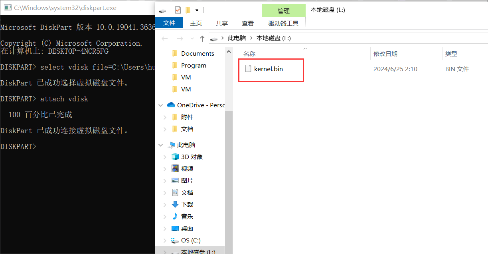
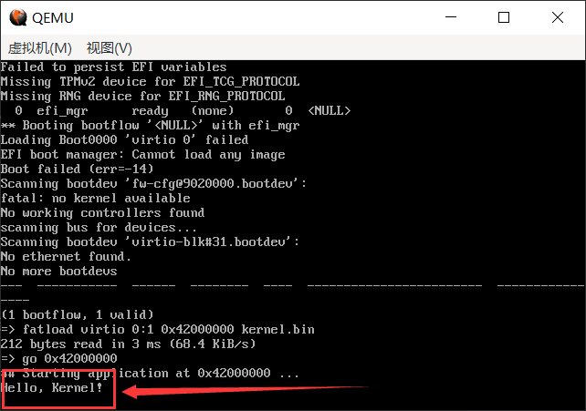

# （二十三）迁移到ARM平台


## 1. 使用u-boot

这个必须要用Linux了，我用的Ubuntu。

编译U-boot要配置的环境挺杂。具体我的也不太清楚，我是 `Ubuntu 18.04` ，主要是懒得再下，这是我好久之前下的了。

```bash
sudo apt update
sudo apt install python3-setuptools swig python3-dev python3-pip
pip3 install importlib_resources
sudo apt-get install gcc-arm-linux-gnueabi

```

这是我安装编译u-boot所需环境用的，实测可用。

qemu的arm平台机器有：

```bash
C:\Users\huang\Desktop\Repository\HOS\VM>qemu-system-arm -M help
Supported machines are:
akita                Sharp SL-C1000 (Akita) PDA (PXA270) (deprecated)
ast1030-evb          Aspeed AST1030 MiniBMC (Cortex-M4)
ast2500-evb          Aspeed AST2500 EVB (ARM1176)
ast2600-evb          Aspeed AST2600 EVB (Cortex-A7)
b-l475e-iot01a       B-L475E-IOT01A Discovery Kit (Cortex-M4)
bletchley-bmc        Facebook Bletchley BMC (Cortex-A7)
borzoi               Sharp SL-C3100 (Borzoi) PDA (PXA270) (deprecated)
bpim2u               Bananapi M2U (Cortex-A7)
canon-a1100          Canon PowerShot A1100 IS (ARM946)
cheetah              Palm Tungsten|E aka. Cheetah PDA (OMAP310) (deprecated)
collie               Sharp SL-5500 (Collie) PDA (SA-1110)
connex               Gumstix Connex (PXA255) (deprecated)
cubieboard           cubietech cubieboard (Cortex-A8)
emcraft-sf2          SmartFusion2 SOM kit from Emcraft (M2S010)
fby35-bmc            Facebook fby35 BMC (Cortex-A7)
fby35                Meta Platforms fby35
fp5280g2-bmc         Inspur FP5280G2 BMC (ARM1176)
fuji-bmc             Facebook Fuji BMC (Cortex-A7)
g220a-bmc            Bytedance G220A BMC (ARM1176)
highbank             Calxeda Highbank (ECX-1000)
imx25-pdk            ARM i.MX25 PDK board (ARM926)
integratorcp         ARM Integrator/CP (ARM926EJ-S)
kudo-bmc             Kudo BMC (Cortex-A9)
kzm                  ARM KZM Emulation Baseboard (ARM1136)
lm3s6965evb          Stellaris LM3S6965EVB (Cortex-M3)
lm3s811evb           Stellaris LM3S811EVB (Cortex-M3)
mainstone            Mainstone II (PXA27x) (deprecated)
mcimx6ul-evk         Freescale i.MX6UL Evaluation Kit (Cortex-A7)
mcimx7d-sabre        Freescale i.MX7 DUAL SABRE (Cortex-A7)
microbit             BBC micro:bit (Cortex-M0)
midway               Calxeda Midway (ECX-2000)
mori-bmc             Mori BMC (Cortex-A9)
mps2-an385           ARM MPS2 with AN385 FPGA image for Cortex-M3
mps2-an386           ARM MPS2 with AN386 FPGA image for Cortex-M4
mps2-an500           ARM MPS2 with AN500 FPGA image for Cortex-M7
mps2-an505           ARM MPS2 with AN505 FPGA image for Cortex-M33
mps2-an511           ARM MPS2 with AN511 DesignStart FPGA image for Cortex-M3
mps2-an521           ARM MPS2 with AN521 FPGA image for dual Cortex-M33
mps3-an524           ARM MPS3 with AN524 FPGA image for dual Cortex-M33
mps3-an536           ARM MPS3 with AN536 FPGA image for Cortex-R52
mps3-an547           ARM MPS3 with AN547 FPGA image for Cortex-M55
musca-a              ARM Musca-A board (dual Cortex-M33)
musca-b1             ARM Musca-B1 board (dual Cortex-M33)
musicpal             Marvell 88w8618 / MusicPal (ARM926EJ-S)
n800                 Nokia N800 tablet aka. RX-34 (OMAP2420) (deprecated)
n810                 Nokia N810 tablet aka. RX-44 (OMAP2420) (deprecated)
netduino2            Netduino 2 Machine (Cortex-M3)
netduinoplus2        Netduino Plus 2 Machine (Cortex-M4)
none                 empty machine
npcm750-evb          Nuvoton NPCM750 Evaluation Board (Cortex-A9)
nuri                 Samsung NURI board (Exynos4210)
olimex-stm32-h405    Olimex STM32-H405 (Cortex-M4)
orangepi-pc          Orange Pi PC (Cortex-A7)
palmetto-bmc         OpenPOWER Palmetto BMC (ARM926EJ-S)
qcom-dc-scm-v1-bmc   Qualcomm DC-SCM V1 BMC (Cortex A7)
qcom-firework-bmc    Qualcomm DC-SCM V1/Firework BMC (Cortex A7)
quanta-gbs-bmc       Quanta GBS (Cortex-A9)
quanta-gsj           Quanta GSJ (Cortex-A9)
quanta-q71l-bmc      Quanta-Q71l BMC (ARM926EJ-S)
rainier-bmc          IBM Rainier BMC (Cortex-A7)
raspi0               Raspberry Pi Zero (revision 1.2)
raspi1ap             Raspberry Pi A+ (revision 1.1)
raspi2b              Raspberry Pi 2B (revision 1.1)
realview-eb          ARM RealView Emulation Baseboard (ARM926EJ-S)
realview-eb-mpcore   ARM RealView Emulation Baseboard (ARM11MPCore)
realview-pb-a8       ARM RealView Platform Baseboard for Cortex-A8
realview-pbx-a9      ARM RealView Platform Baseboard Explore for Cortex-A9
romulus-bmc          OpenPOWER Romulus BMC (ARM1176)
sabrelite            Freescale i.MX6 Quad SABRE Lite Board (Cortex-A9)
smdkc210             Samsung SMDKC210 board (Exynos4210)
sonorapass-bmc       OCP SonoraPass BMC (ARM1176)
spitz                Sharp SL-C3000 (Spitz) PDA (PXA270) (deprecated)
stm32vldiscovery     ST STM32VLDISCOVERY (Cortex-M3)
supermicro-x11spi-bmc Supermicro X11 SPI BMC (ARM1176)
supermicrox11-bmc    Supermicro X11 BMC (ARM926EJ-S)
sx1                  Siemens SX1 (OMAP310) V2
sx1-v1               Siemens SX1 (OMAP310) V1
tacoma-bmc           OpenPOWER Tacoma BMC (Cortex-A7)
terrier              Sharp SL-C3200 (Terrier) PDA (PXA270) (deprecated)
tiogapass-bmc        Facebook Tiogapass BMC (ARM1176)
tosa                 Sharp SL-6000 (Tosa) PDA (PXA255) (deprecated)
verdex               Gumstix Verdex Pro XL6P COMs (PXA270) (deprecated)
versatileab          ARM Versatile/AB (ARM926EJ-S)
versatilepb          ARM Versatile/PB (ARM926EJ-S)
vexpress-a15         ARM Versatile Express for Cortex-A15
vexpress-a9          ARM Versatile Express for Cortex-A9
virt-2.10            QEMU 2.10 ARM Virtual Machine
virt-2.11            QEMU 2.11 ARM Virtual Machine
virt-2.12            QEMU 2.12 ARM Virtual Machine
virt-2.6             QEMU 2.6 ARM Virtual Machine
virt-2.7             QEMU 2.7 ARM Virtual Machine
virt-2.8             QEMU 2.8 ARM Virtual Machine
virt-2.9             QEMU 2.9 ARM Virtual Machine
virt-3.0             QEMU 3.0 ARM Virtual Machine
virt-3.1             QEMU 3.1 ARM Virtual Machine
virt-4.0             QEMU 4.0 ARM Virtual Machine
virt-4.1             QEMU 4.1 ARM Virtual Machine
virt-4.2             QEMU 4.2 ARM Virtual Machine
virt-5.0             QEMU 5.0 ARM Virtual Machine
virt-5.1             QEMU 5.1 ARM Virtual Machine
virt-5.2             QEMU 5.2 ARM Virtual Machine
virt-6.0             QEMU 6.0 ARM Virtual Machine
virt-6.1             QEMU 6.1 ARM Virtual Machine
virt-6.2             QEMU 6.2 ARM Virtual Machine
virt-7.0             QEMU 7.0 ARM Virtual Machine
virt-7.1             QEMU 7.1 ARM Virtual Machine
virt-7.2             QEMU 7.2 ARM Virtual Machine
virt-8.0             QEMU 8.0 ARM Virtual Machine
virt-8.1             QEMU 8.1 ARM Virtual Machine
virt-8.2             QEMU 8.2 ARM Virtual Machine
virt                 QEMU 9.0 ARM Virtual Machine (alias of virt-9.0)
virt-9.0             QEMU 9.0 ARM Virtual Machine
witherspoon-bmc      OpenPOWER Witherspoon BMC (ARM1176)
xilinx-zynq-a9       Xilinx Zynq Platform Baseboard for Cortex-A9
yosemitev2-bmc       Facebook YosemiteV2 BMC (ARM1176)
z2                   Zipit Z2 (PXA27x) (deprecated)

```

实测，用U-boot比较好用的也就是 `virt` 和 `vexpress-a9` 这些，其他的烂事真的好多。

我自己有个树莓派Zero，我折腾了好几天，才发现树莓派不能直接用U-boot，它有自己的启动代码，想用U-boot，只能用它自己的标准启动流程来启动U-boot，然后用U-boot来启动内核，qemu上也是这一套流程，操作下来太痛苦了。。。算了我还不如直接启动内核吧。。

我选了virt作为arm平台上的机器，这个是qemu官方开发的，比较通用，各种奇奇怪怪的烂事也少。

所以，我编译u-boot的命令：（首先要cd进入从GitHub上clone下来的u-boot文件夹，Git操作我就不说了）

```bash
make mrproper
make qemu_arm_defconfig
make CROSS_COMPILE=arm-linux-gnueabi-

```

等待编译结果，然后把u-boot文件（不要已经脱掉符号表的二进制文件u-boot.bin，QEMU对ELF的支持更好，二进制的话折腾起来更麻烦）下载到宿主机上项目文件夹里面的VM文件夹，我改了个名字叫做 `u-boot_qemu_arm.elf`。

```bash
qemu-system-arm -M virt -m 128M -monitor stdio -kernel u-boot_qemu_arm.elf

```

这样就可以用u-boot了。


## 2. 建立虚拟磁盘

Windows上建立和挂载虚拟磁盘倒是比Linux方便多了。。

用diskpart工具，这是Windows自带的，挺好用。

```bash
diskpart

```

直接启动工具，然后这一套流程：

```bash
create vdisk file=C:\Users\huang\Desktop\Repository\HOS\VM\HOS.vhd maximum=64

attach vdisk

create partition primary

select partition 1

format fs=fat32 quick

assign letter=L

```

路径必须是绝对路径，这样就可以迅速建立一个64MB大小的虚拟磁盘，而且用FAT32文件系统格式化过了。直接像操作磁盘那样把文件拖拽粘贴进去就行了。

如果要退出的话。

```bash
detach vdisk

exit

```

即可卸载磁盘并退出diskpart工具。这么创建之后的vhd虚拟硬盘，网上还有不少方法挂载的，Windows在操作上确实比Linxu舒服很多。

以后再挂载就简单了。打开diskpart。

```bash
select vdisk file=C:\Users\huang\Desktop\Repository\HOS\VM\HOS.vhd

attach vdisk

```

自动弹出L盘，然后就可以操作了。卸载磁盘和退出工具同上。


## 3. 建立arm项目

简单来说，给Program文件夹改名为Program_x86，然后再建立一个Program_arm。

Program_arm上目前有：

boot文件夹，start.asm（这个主要是设置内核初始运行环境，在x86里面是在mbr和Loader里面已经设置好了）

```assembly
.section .text
.global _start

_start:
    // 设置栈指针
    ldr sp, =stack_top

    // 跳转到内核主函数
    bl kernel_main

hang:
    // 无限循环，防止返回
    b hang

// 定义堆栈
.section .bss
.align 12
stack_top:
    .space 0x6000  // 分配24KB的内核栈

```

之所以要分配24KB，而不是28KB，是因为之前我也试过0x7000，然后爆了，不知道那里是不是保留内存，反正24KB已经很够用了。

boot文件夹，Makefile

```makefile

# 目录
BOOT_DIR = .

# 源文件
START_SRC = $(BOOT_DIR)/start.asm

# 输出文件
START_O = $(BOOT_DIR)/start.o

# 汇编标志
ASM_FLAGS = -o

.PHONY: all

all: $(START_O)

# 编译 start.o
$(START_O): $(START_SRC)
	$(AS) $(ASM_FLAGS) $@ $<

# 清理规则
clean:
	@if exist $(BOOT_DIR)\\*.o del $(BOOT_DIR)\\*.o

```

kernel文件夹，kernel.c

```c
//
// Created by huangcheng on 2024/6/24.
//

// 这是根据环境写的（环境变量里面UART0映射范围就在这两个内存地址上）
#define UART0_BASE 0x9000000
// UARTDR (Data Register)：发送和接收数据。
#define UARTDR     (*(volatile unsigned int *)(UART0_BASE + 0x000))
// UARTFR (Flag Register)：包含各种状态标志，包括串口是否忙碌。
#define UARTFR     (*(volatile unsigned int *)(UART0_BASE + 0x018))

void uart_send_char(char c) {
    // 等待串口不忙碌的时候，才能发送消息
    while (UARTFR & (1 << 5)) {
        // 这里采用轮询的方法，实际上可以做一些别的事情
    }
    // 写一个字符到数据寄存器映射的内存地址
    UARTDR = c;
}

void uart_send_string(const char *str) {
    while (*str) {
        uart_send_char(*str++);
    }
}

void kernel_main(void) {
    uart_send_string("Hello, Kernel!\n");
    for(;;);
}

```

kernel文件夹，kernel_linker.ld

```ld
ENTRY(_start)    /* arm入口要设置栈指针，建立C运行环境，这个在x86里面是在MBR和Loader里面完成的 */

SECTIONS
{
    . = 0x42000000;  /* 内核加载地址，程序各个段物理地址的起算点，也是入口函数所在的地方 */
    .text : { *(.text) }
    .data : { *(.data) }
    .bss : { *(.bss) }
    .drivers : {    /* 这个段用于加载驱动 */
        __drivers_start = .;
        KEEP(*(.drivers))
        __drivers_end = .;
    }
}

```

kernel文件夹，Makefile

```makefile

# 目录
KERNEL_DIR = .

# 源文件
KERNEL_C_SRC = $(KERNEL_DIR)/kernel.c

# C 编译标志
CFLAGS = -ffreestanding -nostdlib -Wall -Wextra

.PHONY: all

all: $(KERNEL_DIR)/kernel.o

# arm交叉编译工具链的gcc没问题了，可以直接编目标文件.o
$(KERNEL_DIR)/kernel.o: $(KERNEL_C_SRC)
	$(GCC) $(CFLAGS) -c -o $@ $<

# 清理规则
clean:
	@if exist $(KERNEL_DIR)\\*.o del $(KERNEL_DIR)\\*.o
	@if exist $(KERNEL_DIR)\\*.elf del $(KERNEL_DIR)\\*.elf

```

Program_arm文件夹下的主Makefile

```makefile
# 主Makefile，用于整合各模块操作

# 全套arm编译工具链
GCC = arm-none-eabi-gcc
AS = arm-none-eabi-as
LD = arm-none-eabi-ld
OBJCOPY = arm-none-eabi-objcopy

# 项目构建工具make
MAKE = make

# 因为这个操作系统本质上是个宏内核，所有的组件都要打包在一个kernel.bin里面
# 这样烧写起来也方便，所以要在主Makefile这里统一链接

# 所有组件目录
BOOT_DIR = boot
KERNEL_DIR = kernel

# ARM需要的中间文件
KERNEL_ELF = $(KERNEL_DIR)/kernel.elf

# 输出文件
KERNEL_BIN = kernel.bin

# 链接脚本位置
KERNEL_LINKER_SCRIPT = $(KERNEL_DIR)/kernel_linker.ld

# 链接标志
LDFLAGS = -T $(KERNEL_LINKER_SCRIPT)

.PHONY: all

# 编译各组件，要把工具参数传输过去，然后主Makefile汇总链接生成 kernel.bin
all: compile link bin

# 编译各组件
compile:
	$(MAKE) -C $(BOOT_DIR) GCC=$(GCC) AS=$(AS) MAKE=$(MAKE)
	$(MAKE) -C $(KERNEL_DIR) GCC=$(GCC) AS=$(AS) MAKE=$(MAKE)

# 链接生成 kernel.elf
link:
	$(LD) $(LDFLAGS) -o $(KERNEL_ELF) $(wildcard $(KERNEL_DIR)/*.o) \
										$(wildcard $(BOOT_DIR)/*.o)

# 提取二进制文件kernel.bin
bin:
	$(OBJCOPY) -O binary $(KERNEL_ELF) $(KERNEL_BIN)

clean:
	$(MAKE) -C $(BOOT_DIR) clean
	$(MAKE) -C $(KERNEL_DIR) clean

```

由于不能直接烧写，所以也不用dd了，一键编译烧写脚本w.bat就没啥用了，我就改成了只有make和make clean的版本，其实手动make和clean也没什么。

```bash
@echo off

rem 先执行make操作
make all

rem 执行clean操作
make clean

pause

```

编译，连接，把kernel.bin放到L盘里面，然后卸载L盘，不然qemu用不了。




## 4. 实际使用

在VM文件夹下建立start_qemu_arm.bat，内容如下：

```bash
qemu-system-arm -M virt -m 128M -monitor stdio -kernel u-boot_qemu_arm.elf -drive if=none,file=HOS.vhd,format=raw,id=hd -device virtio-blk-device,drive=hd

```

可以一键启动。

挂载的硬盘被虚拟机识别为 `virtio 0` 。

我是在串口这里和虚拟机通信的，所以注意打字的时候慢点，复制粘贴容易直接吞一大半字符，这串口看起来效率真不行。

```bash
fatload virtio 0:1 0x42000000 kernel.bin
go 0x42000000

```

这样就可以进入内核了。

效果：



成功进入了内核。


## 5. 解释和说明

### 5.1 为什么选择0x42000000这个奇怪的地址

把串口输出重定向到stdio，看看怎么回事。

```bash
qemu-system-arm -M virt -m 128M -monitor none -kernel u-boot_qemu_arm.elf -drive if=none,file=HOS.vhd,format=raw,id=hd -device virtio-blk-device,drive=hd -serial stdio

```

用u-boot常用的bdinfo和printenv看看。

```bash
U-Boot 2024.07-rc4 (Jun 24 2024 - 08:50:54 +0000)

DRAM:  128 MiB
Core:  51 devices, 14 uclasses, devicetree: board
Flash: 64 MiB
Loading Environment from Flash... *** Warning - bad CRC, using default environment

In:    serial,usbkbd
Out:   serial,vidconsole
Err:   serial,vidconsole
No working controllers found
Net:   No ethernet found.

starting USB...
No working controllers found
Hit any key to stop autoboot:  0
Scanning for bootflows in all bootdevs
Seq  Method       State   Uclass    Part  Name                      Filename
---  -----------  ------  --------  ----  ------------------------  ----------------
Scanning global bootmeth 'efi_mgr':
No EFI system partition
No EFI system partition
Failed to persist EFI variables
No EFI system partition
Failed to persist EFI variables
No EFI system partition
Failed to persist EFI variables
Missing TPMv2 device for EFI_TCG_PROTOCOL
Missing RNG device for EFI_RNG_PROTOCOL
  0  efi_mgr      ready   (none)       0  <NULL>
** Booting bootflow '<NULL>' with efi_mgr
Loading Boot0000 'virtio 0' failed
EFI boot manager: Cannot load any image
Boot failed (err=-14)
Scanning bootdev 'fw-cfg@9020000.bootdev':
fatal: no kernel available
No working controllers found
scanning bus for devices...
Scanning bootdev 'virtio-blk#31.bootdev':
No ethernet found.
No more bootdevs
---  -----------  ------  --------  ----  ------------------------  ----------------
(1 bootflow, 1 valid)
=> bdinfo
boot_params = 0x00000000
DRAM bank   = 0x00000000
-> start    = 0x40000000
-> size     = 0x08000000
flashstart  = 0x00000000
flashsize   = 0x04000000
flashoffset = 0x000dbb8c
baudrate    = 115200 bps
relocaddr   = 0x4771d000
reloc off   = 0x4771d000
Build       = 32-bit
current eth = unknown
eth-1addr   = (not set)
IP addr     = <NULL>
fdt_blob    = 0x465dcea0
new_fdt     = 0x465dcea0
fdt_size    = 0x00100000
lmb_dump_all:
 memory.cnt = 0x1 / max = 0x10
 memory[0]      [0x40000000-0x47ffffff], 0x08000000 bytes flags: 0
 reserved.cnt = 0x1 / max = 0x10
 reserved[0]    [0x455af000-0x47ffffff], 0x02a51000 bytes flags: 0
devicetree  = board
arch_number = 0x00000000
TLB addr    = 0x47ff0000
irq_sp      = 0x465dce90
sp start    = 0x465dce80
Early malloc usage: 2c0 / 2000
=> printenv
arch=arm
baudrate=115200
board=qemu-arm
board_name=qemu-arm
boot_targets=qfw usb scsi virtio nvme dhcp
bootcmd=bootflow scan -lb
bootdelay=2
cpu=armv7
fdt_addr=0x40000000
fdt_high=0xffffffff
fdtcontroladdr=465dcea0
initrd_high=0xffffffff
kernel_addr_r=0x40400000
loadaddr=0x40200000
preboot=usb start
pxefile_addr_r=0x40300000
ramdisk_addr_r=0x44000000
scriptaddr=0x40200000
stderr=serial,vidconsole
stdin=serial,usbkbd
stdout=serial,vidconsole
usb_ignorelist=0x1050:*,
vendor=emulation

Environment size: 488/262140 bytes
```

主要是DRAM的起始位置就在0x40000000，太靠后了，还有一大堆保留内存位置，我就取了个整数放在0x42000000这里。


### 5.2 为什么串口通信要访问0x9000000

virt这机器就是映射到这里的，其实可以看u-boot的源代码（这是qemu出的虚拟arm平台，没有硬件手册，如果有硬件手册直接看手册就得了，手册上面肯定有）。

u-boot项目的configs文件夹下的qemu_arm_defconfig配置，这是我们编译u-boot的时候用的。

里面有：

```ini
CONFIG_DEFAULT_DEVICE_TREE="qemu-arm"
CONFIG_TARGET_QEMU_ARM_32BIT=y
CONFIG_DEBUG_UART_BASE=0x9000000
CONFIG_DEBUG_UART_CLOCK=0
CONFIG_ARMV7_LPAE=y
CONFIG_SYS_LOAD_ADDR=0x40200000
CONFIG_ENV_ADDR=0x4000000
```

CONFIG_DEBUG_UART_BASE就说明了一切。