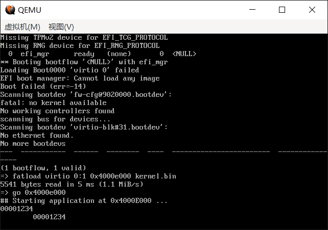
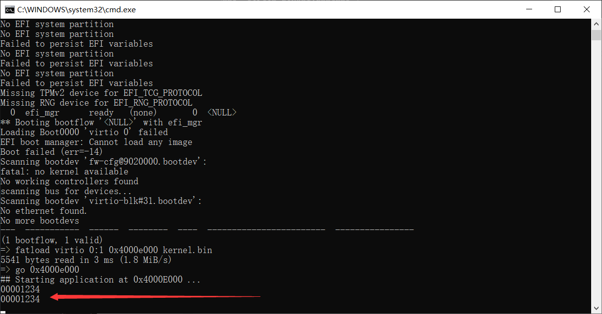

# （二十四）实现arm机制下的内存分页


## 0. 错误更正

`（二十三）迁移到ARM平台` 之前这部分我写的Makefile的链接操作是错的，链接顺序搞反了。

```makefile
# 链接生成 kernel.elf
link:
	$(LD) $(LDFLAGS) -o $(KERNEL_ELF) $(wildcard $(BOOT_DIR)/*.o) \
										$(wildcard $(KERNEL_DIR)/*.o)
```

必须要把入口函数所在的目标文件放在第一个，不然无法执行。


## 1. 准备工作

### 1.1 基于串口通信实现print

在x86下，这是一个print.asm的汇编，直接操作VGA显存模式，给显存写字符实现屏幕打印。

在arm下，因为还没实现arm用的LCD，所以只能先通过串口来进行。

在lib文件夹下建立lib_kernel文件夹，同时把type.h从x86文件夹里面复制一份到arm这边的lib文件夹下，lib_kernel下建立lib_kernel.h，并建立print文件夹，print文件夹下建立print.h和print.c。（就是照抄x86项目版本中的文件布局）。

print.h

```c
//
// Created by huangcheng on 2024/6/27.
//

#ifndef HOS_PRINT_H
#define HOS_PRINT_H

// 将一个字符打印在光标处
void put_char(char c);
//在光标位置打印字符串（长度不要超过屏幕一行能容纳的最多字符数80）
void put_str(const char *str);
//将整数以16进制形式打印在屏幕上，不打印前缀0x。
void put_int(int n);

#endif //HOS_PRINT_H

```

print.c

```c
//
// Created by huangcheng on 2024/6/27.
//

#include "print.h"

// 这是根据环境写的（环境变量里面UART0映射范围就在这两个内存地址上）
#define UART0_BASE 0x9000000
// UARTDR (Data Register)：发送和接收数据。
#define UARTDR     (*(volatile unsigned int *)(UART0_BASE + 0x000))
// UARTFR (Flag Register)：包含各种状态标志，包括串口是否忙碌。
#define UARTFR     (*(volatile unsigned int *)(UART0_BASE + 0x018))

void uart_send_char(char c) {
    // 等待串口不忙碌的时候，才能发送消息
    while (UARTFR & (1 << 5)) {
        // 这里采用轮询的方法，实际上可以做一些别的事情
    }
    // 写一个字符到数据寄存器映射的内存地址
    UARTDR = c;
}

// 基于uart_send_char，重写老三样

// 将一个字符打印在光标处
void put_char(char c) {
    uart_send_char(c);
}

void put_str(const char *str) {
    while (*str) {
        uart_send_char(*str++);
    }
}

void put_int(int n) {
    char hex_chars[] = "0123456789ABCDEF";
    for (int i = 28; i >= 0; i -= 4) {
        uart_send_char(hex_chars[(n >> i) & 0xF]);
    }
}

```

print下的Makefile

```makefile

# 目录
LIB_DIR = ../..
LIB_KERNEL_DIR = ..
PRINT_DIR = .

# 源文件
PRINT_C_SRC = $(PRINT_DIR)/print.c

# C 编译标志
CFLAGS = -ffreestanding -nostdlib -Wall -Wextra

# 标签标记所有的任务（输出什么文件），方便修改
OBJS = $(LIB_DIR)/print.o

.PHONY: all

all: $(OBJS)

# 编出来放到模块文件夹kernel去，别放在这里，方便主Makefile找
$(LIB_DIR)/print.o: $(PRINT_C_SRC)
	$(GCC) $(CFLAGS) -c -o $@ $<

# 文件不生成于此，无需清理规则

```

lib_kernel文件夹下的Makefile（把x86下的链表、位图、字符串操作也移植过来）

```makefile
# 目录
LIB_DIR = ..
LIB_KERNEL = .
PRINT_DIR = print
STRING_DIR = string
BITMAP_DIR = bitmap
LIST_DIR = list

# 汇编标志
ASM_FLAGS = -o

# 定义源文件和目标文件
SRCS = $(wildcard *.asm)
OBJS = $(SRCS:.asm=.o)

# 默认目标，编译所有的 .asm 文件
all: $(OBJS) print.o string.o bitmap.o list.o

# 目标文件生成规则
%.o: %.asm
	$(AS) $(ASM_FLAGS) $(LIB_DIR)/$@ $<

print.o:
	$(MAKE) -C $(PRINT_DIR) GCC=$(GCC) AS=$(AS) MAKE=$(MAKE)

string.o:
	$(MAKE) -C $(STRING_DIR) GCC=$(GCC) AS=$(AS)

bitmap.o:
	$(MAKE) -C $(BITMAP_DIR) GCC=$(GCC) AS=$(AS)

list.o:
	$(MAKE) -C $(LIST_DIR) GCC=$(GCC) AS=$(AS)

# 文件不在这里生成，无需清理

```

用arm汇编重写的paging_ops.asm

```assembly
.section .text

.global enable_paging
.global load_page_directory
.global get_current_page

// uint32_t get_current_page(void);
get_current_page:
    mrc p15, 0, r0, c2, c0, 0    // 读取TTBR0寄存器
    bx lr

```

lib_kernel.h

```c
//
// Created by huangcheng on 2024/5/23.
//

#ifndef HOS_LIB_H
#define HOS_LIB_H

#include "../type.h"
#include "print/print.h"
#include "string/string.h"

// 这个文件存在的意义主要就是为了声明汇编暴露的函数，加上type.h可以为系统各组件提供统一的支持

// 获取ttbr0寄存器中的当前页表，paging_ops.asm
extern uint32_t get_current_page(void);


#endif //HOS_LIB_H

```

lib下的Makefile就不写了。Program_arm的主文件夹下的Makefile改改x86里面的就能用。

kernel_linker.ld修改，实测可以和x86保持一致，内核起点都在0xe000的地方，也不会覆盖到u-boot的数据：

```ld
ENTRY(kernel_main)

SECTIONS
{
    . = 0x4000e000;  /* 内核加载地址，程序各个段物理地址的起算点，也是入口函数所在的地方 */
    .text : { *(.text) }
    .data : { *(.data) }
    .bss : { *(.bss) }
    .drivers : {    /* 这个段用于加载驱动 */
        __drivers_start = .;
        KEEP(*(.drivers))
        __drivers_end = .;
    }
}

```

由于一些原因，我决定把栈指针放到C中切换，因为arm上C语言传参不太一样（在paging_ops.asm中说了），只要不涉及局部变量，完全可以通过寄存器完成全部操作。

switch_sp.asm

```assembly
.section .text

.global switch_sp

// 切换栈指针
// void switch_sp(uint32_t new_sp);
switch_sp:
    // 第一个参数通过r0传参
    mov sp, r0
    bx lr

```

lib_kernel.h中增加函数声明

```c
// 切换栈指针
extern void switch_sp(uint32_t new_sp);
```

kernel.c

```c
//
// Created by huangcheng on 2024/6/24.
//

#include "../lib/lib_kernel/lib_kernel.h"
#include "kernel_page/kernel_page.h"

// 工具函数
void print_mapping(uint32_t virt_addr_start, uint32_t virt_addr_end, uint32_t phys_addr_start, uint32_t phys_addr_end);
void get_page_table_mappings();
void setup_page_table();

void kernel_main(void) {

    // 打印初始化前的页表
    put_str("TTBR0: 0x");
    put_int(get_current_page());
    put_char('\n');
    get_page_table_mappings();

    for(;;);
}

void print_mapping(uint32_t virt_addr_start, uint32_t virt_addr_end, uint32_t phys_addr_start, uint32_t phys_addr_end) {
    put_str("0x");
    put_int(virt_addr_start);
    put_str("-0x");
    put_int(virt_addr_end);
    put_str(" -> 0x");
    put_int(phys_addr_start);
    put_str("-0x");
    put_int(phys_addr_end);
    put_char('\n');
}


// 获取当前页表的映射关系并合并连续的范围
void get_page_table_mappings() {
    uint32_t *page_table = (uint32_t *)get_current_page();
    uint32_t virt_start = 0, phys_start = 0, virt_end = 0, phys_end = 0;
    int in_range = 0;

    for (uint32_t i = 0; i < 4096; ++i) {
        uint32_t l1_entry = page_table[i];
        if (l1_entry & 0x1) { // 一级页表项有效
            uint32_t *l2_page_table = (uint32_t *)(l1_entry & 0xFFFFFC00); // 取得二级页表的基址
            uint32_t virt_addr_base = i << 20; // 一级页表项的基址

            for (uint32_t j = 0; j < 256; ++j) {
                uint32_t l2_entry = l2_page_table[j];
                if (l2_entry & 0x2) { // 二级页表项有效
                    uint32_t current_virt_start = virt_addr_base + (j << 12);
                    uint32_t current_phys_start = l2_entry & 0xFFFFF000;
                    uint32_t current_virt_end = current_virt_start + 0xFFF;
                    uint32_t current_phys_end = current_phys_start + 0xFFF;

                    if (!in_range) {
                        // 开始新的映射范围
                        virt_start = current_virt_start;
                        phys_start = current_phys_start;
                        virt_end = current_virt_end;
                        phys_end = current_phys_end;
                        in_range = 1;
                    } else {
                        // 检查是否与前一个范围连续
                        if (current_phys_start == (phys_end + 1)) {
                            virt_end = current_virt_end;
                            phys_end = current_phys_end;
                        } else {
                            // 输出之前的范围
                            print_mapping(virt_start, virt_end, phys_start, phys_end);
                            // 开始新的映射范围
                            virt_start = current_virt_start;
                            phys_start = current_phys_start;
                            virt_end = current_virt_end;
                            phys_end = current_phys_end;
                        }
                    }
                } else if (in_range) {
                    // 输出之前的范围
                    print_mapping(virt_start, virt_end, phys_start, phys_end);
                    in_range = 0;
                }
            }
        }
    }

    // 输出最后一个范围
    if (in_range) {
        print_mapping(virt_start, virt_end, phys_start, phys_end);
    }
}

```

这样就可以像Bochs调试器里面的 `info tab` 操作一样打印页表了。

打印效果不太好，把串口重定向到stdio，效果会好不少，反正现在不用监视器输出什么，需要来再改回来就是了。

可以直接把脚本start_qemu.bat改成：

```bash
qemu-system-arm -M virt -kernel u-boot_qemu_arm.elf -drive if=none,file=HOS.vhd,format=raw,id=hd -device virtio-blk-device,drive=hd -serial stdio

```

最开始的页表并不是传统的二级页表，我查了应该是超级段，搞不太明白怎么回事，u-boot怎么会用上超级段这么大的。


## 2. 实现arm的内存分页

kernel_page.h

```c
//
// Created by huangcheng on 2024/5/23.
//

#ifndef HOS_KERNEL_PAGE_H
#define HOS_KERNEL_PAGE_H

#include "../../lib/lib_kernel/lib_kernel.h"

// 这部分所有内容都来自arm官网文档，网址如下
// https://developer.arm.com/documentation/ddi0406/b/Appendices/ARMv4-and-ARMv5-Differences/System-level-memory-model/Virtual-memory-support?lang=en
// https://developer.arm.com/documentation/ddi0601/2024-03/AArch32-Registers/TTBCR--Translation-Table-Base-Control-Register?lang=en
// https://developer.arm.com/documentation/ddi0601/2024-03/AArch32-Registers/SCTLR--System-Control-Register?lang=en

// 在 ARMv7 架构的页表描述符中，描述符类型是用两位来表示的，可以有四种类型。
// 以下是描述符类型及其含义：
// 1. 0b00(0)：无效描述符（Fault）
// 2. 0b01(1)：粗页表（Coarse Page Table），或者指向二级页表（粗页表一级页表是4096条，二级页表是256条，二级页表项目每条同x86，管理4KB大小内存）
// 3. 0b10(2)：段描述符（Section），直接映射1MB内存，也被称为主页表项（Master）
// 4. 0b11(3)：超级段描述符（Supersection），映射16MB内存（仅在LPAE中使用）或细页表（Fine Page Table，1KB页，现在已经不用了）

// ARM 一级页表项

// 粗页表
typedef struct {
    uint32_t DescriptorType :2;            // 位0-1: 描述符类型，段描述符为1（二进制为01）
    uint32_t ShouldBeZero : 3;             // 位2-4: 必须为零
    uint32_t Domain : 4;                   // 位5-8: 域，用作内存保护机制，16个可能的域
    uint32_t ImplementationDefined : 1;    // 位9: 实现定义
    uint32_t BaseAddress : 22;             // 位10-31: 页表基地址，必须1KB对齐（地址右移10位）
} CoarsePageTableEntry;

// 段描述符
typedef struct {
    uint32_t DescriptorType :2;            // 位0-1: 描述符类型，段描述符为2（二进制为10）
    uint32_t Bufferable : 1;               // 位2: 缓冲位
    uint32_t Cacheable : 1;                // 位3: 缓存位
    uint32_t ShouldBeZero0 : 1;            // 位4: 应为0
    uint32_t Domain : 4;                   // 位5-8: 域，用作内存保护机制，16个可能的域
    uint32_t ImplementationDefined : 1;    // 位9: 实现定义（应为0）
    uint32_t AccessPermission : 2;         // 位10-11: 访问权限位1:0（0是禁止任何访问，1是特权读写，2是特权读写用户只读，3是全权）
    uint32_t TypeExtension : 3;            // 位12-14: 类型扩展位
    uint32_t ShouldBeZero1 : 1;            // 位15: 应为0
    uint32_t Shared : 1;                   // 位16: 共享位
    uint32_t ShouldBeZero2 : 1;            // 位17: 应为0
    uint32_t PresentHigh : 1;              // 位18: 存在更高的，段描述符不存在更高的，应当为0
    uint32_t ShouldBeZero3 : 1;            // 位19: 非安全位，用于安全扩展
    uint32_t BaseAddress : 12;             // 位20-31: 段基地址，必须1MB对齐（地址右移20位）
} SectionDescriptor;

// 超级段描述符
typedef struct {
    uint32_t DescriptorType :2;            // 位0-1: 描述符类型，超级段描述符为2（二进制为10）
    uint32_t Bufferable : 1;               // 位2: 缓冲位
    uint32_t Cacheable : 1;                // 位3: 缓存位
    uint32_t ShouldBeZero0 : 1;            // 位4: 应为0
    uint32_t BaseAddressHigh : 4;          // 位5-8: 超段基地址，支持时的[39:36]位
    uint32_t ImplementationDefined : 1;    // 位9: 实现定义
    uint32_t AccessPermission : 2;         // 位10-11: 访问权限位1:0
    uint32_t TypeExtension : 3;            // 位12-14: 类型扩展位
    uint32_t ShouldBeZero1 : 1;            // 位15: 应为0
    uint32_t Shared : 1;                   // 位16: 共享位
    uint32_t ShouldBeZero2 : 1;            // 位17: 应为0
    uint32_t PresentHigh : 1;              // 位18: 必须为1（存在更高的，说明这是超级段）
    uint32_t ShouldBeZero3 : 1;            // 位19: 应为0
    uint32_t BaseAddressMedium : 4;        // 位20-23: 超段基地址，支持时的[35:32]位
    uint32_t BaseAddress : 8;              // 位24-31: 超段基地址，必须16MB对齐
} SuperSectionDescriptor;

// 关于AP：0是禁止任何访问，1是特权读写，2是特权读写用户只读，3是特权和用户都是全权

// 在 ARMv7 架构中，域 (Domain) 是一种访问控制机制，用于管理对内存的访问。
// 每个域包含一组页表条目，系统可以对这些域施加不同的访问控制策略。
// 域访问控制寄存器 (DACR) 用于控制每个域的访问权限。
// 每个域可以设置为以下三种状态之一：
// 1. No Access (无访问权限): 任何尝试访问该域的内存都会导致访问权限错误。
// 2. Client (客户端): 访问权限由页表条目的访问权限字段决定。
// 3. Manager (管理): 允许对该域的所有访问，无需检查页表条目的访问权限字段。
// 每个页目录项包含一个 4 位的域字段，这个字段用于指定页表条目所属的域。域的数量最多为 16 (0-15)。

// 域控制器用结构体位域的表示方法
typedef struct {
    uint32_t domain0  : 2;  // 0，二进制00，无访问权；1，二进制01，Client，由页表条目的访问权限字段决定；3，二进制11，Manager，允许对该域所有访问，完全不检查权限
    uint32_t domain1  : 2;  // 0，二进制00，无访问权；1，二进制01，Client，由页表条目的访问权限字段决定；3，二进制11，Manager，允许对该域所有访问，完全不检查权限
    uint32_t domain2  : 2;  // 0，二进制00，无访问权；1，二进制01，Client，由页表条目的访问权限字段决定；3，二进制11，Manager，允许对该域所有访问，完全不检查权限
    uint32_t domain3  : 2;  // 0，二进制00，无访问权；1，二进制01，Client，由页表条目的访问权限字段决定；3，二进制11，Manager，允许对该域所有访问，完全不检查权限
    uint32_t domain4  : 2;  // 0，二进制00，无访问权；1，二进制01，Client，由页表条目的访问权限字段决定；3，二进制11，Manager，允许对该域所有访问，完全不检查权限
    uint32_t domain5  : 2;  // 0，二进制00，无访问权；1，二进制01，Client，由页表条目的访问权限字段决定；3，二进制11，Manager，允许对该域所有访问，完全不检查权限
    uint32_t domain6  : 2;  // 0，二进制00，无访问权；1，二进制01，Client，由页表条目的访问权限字段决定；3，二进制11，Manager，允许对该域所有访问，完全不检查权限
    uint32_t domain7  : 2;  // 0，二进制00，无访问权；1，二进制01，Client，由页表条目的访问权限字段决定；3，二进制11，Manager，允许对该域所有访问，完全不检查权限
    uint32_t domain8  : 2;  // 0，二进制00，无访问权；1，二进制01，Client，由页表条目的访问权限字段决定；3，二进制11，Manager，允许对该域所有访问，完全不检查权限
    uint32_t domain9  : 2;  // 0，二进制00，无访问权；1，二进制01，Client，由页表条目的访问权限字段决定；3，二进制11，Manager，允许对该域所有访问，完全不检查权限
    uint32_t domain10 : 2;  // 0，二进制00，无访问权；1，二进制01，Client，由页表条目的访问权限字段决定；3，二进制11，Manager，允许对该域所有访问，完全不检查权限
    uint32_t domain11 : 2;  // 0，二进制00，无访问权；1，二进制01，Client，由页表条目的访问权限字段决定；3，二进制11，Manager，允许对该域所有访问，完全不检查权限
    uint32_t domain12 : 2;  // 0，二进制00，无访问权；1，二进制01，Client，由页表条目的访问权限字段决定；3，二进制11，Manager，允许对该域所有访问，完全不检查权限
    uint32_t domain13 : 2;  // 0，二进制00，无访问权；1，二进制01，Client，由页表条目的访问权限字段决定；3，二进制11，Manager，允许对该域所有访问，完全不检查权限
    uint32_t domain14 : 2;  // 0，二进制00，无访问权；1，二进制01，Client，由页表条目的访问权限字段决定；3，二进制11，Manager，允许对该域所有访问，完全不检查权限
    uint32_t domain15 : 2;  // 0，二进制00，无访问权；1，二进制01，Client，由页表条目的访问权限字段决定；3，二进制11，Manager，允许对该域所有访问，完全不检查权限
} DACR_t;

// 获取DACR寄存器的值并存储到结构体中，paging_ops.asm
extern void get_dacr(DACR_t *dacr);
// 从结构体中读取并设置DACR寄存器的值，paging_ops.asm
extern void set_dacr(DACR_t *dacr);

// 还用页目录表这个名字，知道是一级页表就行了，反正x86也是没页目录表这个说法，只是约定俗成

// 一级页表用粗页表
typedef struct {
    uint32_t DescriptorType :2;            // 位0-1: 描述符类型，段描述符为1（二进制为01）
    uint32_t ShouldBeZero : 3;             // 位2-4: 必须为零
    uint32_t Domain : 4;                   // 位5-8: 域，用作内存保护机制，16个可能的域
    uint32_t ImplementationDefined : 1;    // 位9: 实现定义
    uint32_t BaseAddress : 22;             // 位10-31: 页表基地址，必须1KB对齐（地址右移10位）
} page_directory_entry_t;

// ARM 二级页表（分大页、小页、细页三种，大页64KB，小页4KB，细页1KB，细页现在基本上不用了）

// 大页，64KB
typedef struct {
    uint32_t PageType : 2;                     // 位0-1: 页类型，大页为1（二进制为01）
    uint32_t Bufferable : 1;                   // 位2: 缓冲位
    uint32_t Cacheable : 1;                    // 位3: 缓存位
    uint32_t AccessPermission0 : 2;            // 位4-5: 第一个4KB的访问权限，以此类推
    uint32_t AccessPermission1 : 2;            // 位6-8: 从上类推
    uint32_t AccessPermission2 : 2;            // 位9-10: 从上类推
    uint32_t AccessPermission3 : 2;            // 位10-11: 从上类推
    uint32_t TypeExtension : 3;                // 位12-14: 类型扩展位
    uint32_t ShouldBeZero : 1;                 // 位15: 应为0
    uint32_t BaseAddress : 16;                 // 位16-31: 大页基地址，必须64KB对齐（地址右移16位）
} LargePageDescriptor;

// 小页，4KB
typedef struct {
    uint32_t PageType : 2;                     // 位0-1: 页类型，小页为2（二进制为10）
    uint32_t Bufferable : 1;                   // 位2: 缓冲位
    uint32_t Cacheable : 1;                    // 位3: 缓存位
    uint32_t AccessPermission0 : 2;            // 位4-5: 第一个1KB的访问权限，以此类推
    uint32_t AccessPermission1 : 2;            // 位6-8: 从上类推
    uint32_t AccessPermission2 : 2;            // 位9-10: 从上类推
    uint32_t AccessPermission3 : 2;            // 位10-11: 从上类推
    uint32_t BaseAddress : 20;                 // 位12-31: 小页基地址，必须4KB对齐（地址右移12位）
} SmallPageDescriptor;

// 二级页表用小页
typedef struct {
    uint32_t PageType : 2;                     // 位0-1: 页类型，小页为2（二进制为10）
    uint32_t Bufferable : 1;                   // 位2: 缓冲位
    uint32_t Cacheable : 1;                    // 位3: 缓存位
    uint32_t AccessPermission0 : 2;            // 位4-5: 第一个1KB的访问权限，以此类推
    uint32_t AccessPermission1 : 2;            // 位6-8: 从上类推
    uint32_t AccessPermission2 : 2;            // 位9-10: 从上类推
    uint32_t AccessPermission3 : 2;            // 位10-11: 从上类推
    uint32_t BaseAddress : 20;                 // 位12-31: 小页基地址，必须4KB对齐（地址右移12位）
} page_table_entry_t;

// #define PAGE_DIR_TABLE_POS 0x100000  // 页目录表的起始物理地址
// 因为virt的DRAM映射范围是0x40000000到0x47ffffff，要加上偏移量0x40000000才行

#define DRAM_OFFSET 0x40000000          // 内存偏移地址

#define PAGE_DIR_TABLE_POS 0x100000     // 页目录表的起始物理地址

#define PAGE_TABLE_ENTRIES 256          // 每个页表中的页表项数量
#define PAGE_DIR_ENTRIES 4096           // 页目录中的页目录项数量

// Linux分三个域，我只分两个（域只是个编号，没有高低之分，区分开就行）
#define KERNEL_DOMAIN 0     // 内核域
#define USER_DOMAIN 15      // 用户域

// 定义TTBCR寄存器的结构体
typedef struct {
    uint32_t N         : 3;   // 位0-2: 指示 TTBR0 中基地址的宽度。基地址字段为 bits[31:14-N]。当 N 的值为 0 时，TTBR0表基地址与 ARMv5 和 ARMv6 兼容。
    uint32_t Reserved0 : 1;   // 位3: 保留，必须为0
    uint32_t PD0       : 1;   // 位4: 使用 TTBR0 进行地址翻译时，是否在 TLB 未命中时执行页表遍历
    uint32_t PD1       : 1;   // 位5: 使用 TTBR1 进行地址翻译时，是否在 TLB 未命中时执行页表遍历
    uint32_t Reserved1 : 25;  // 位6-30: 保留，必须为0
    uint32_t EAE       : 1;   // 位31: 开启扩展地址 (Extended Address Enable)，可以使用4GB以上的地址，如果使用的话，结构体不一样，因此此处固定为0
} TTBCR_t;

// 关于N的说明
// N = 1：TTBR0 翻译低 2GB 地址空间，TTBR1 翻译高 2GB 地址空间。
// N = 2：TTBR0 翻译低 1GB 地址空间，TTBR1 翻译高 3GB 地址空间。
// N = 3：TTBR0 翻译低 512MB 地址空间，TTBR1 翻译高 3.5GB 地址空间。
// 依此类推，N = 7 时，TTBR0 翻译低 32MB 地址空间，TTBR1 翻译高 3.968GB 地址空间。

// 获取TTBCR寄存器的值并存储到结构体中，paging_ops.asm
extern void get_ttbcr(TTBCR_t *ttbcr);
// 从结构体中读取并设置TTBCR寄存器的值，paging_ops.asm
extern void set_ttbcr(TTBCR_t *ttbcr);

// 定义SCTLR寄存器的结构体
typedef struct {
    uint32_t M              : 1;   // 位0: MMU使能 (MMU enable for EL1 and EL0 stage 1 address translation)
    uint32_t A              : 1;   // 位1: 对齐检查使能 (Alignment check enable)
    uint32_t C              : 1;   // 位2: 数据访问的可缓存性控制 (Cacheability control for data accesses at EL1 and EL0)
    uint32_t nTLSMD         : 1;   // 位3: 不捕获加载/存储多个到设备内存的指令 (No Trap Load Multiple and Store Multiple to Device-nGRE/Device-nGnRE/Device-nGnRnE memory)
    uint32_t LSMAOE         : 1;   // 位4: 加载/存储多个的原子性和排序使能 (Load Multiple and Store Multiple Atomicity and Ordering Enable)
    uint32_t CP15BEN        : 1;   // 位5: 系统指令内存屏障使能 (System instruction memory barrier enable)
    uint32_t UNK            : 1;   // 位6: 未知 (Unknown, writes ignored, reads return unknown value)
    uint32_t ITD            : 1;   // 位7: IT指令禁用 (IT Disable)
    uint32_t SED            : 1;   // 位8: SETEND指令禁用 (SETEND instruction disable)
    uint32_t Reserved0      : 1;   // 位9: 保留，必须为0 (Reserved, RES0)
    uint32_t EnRCTX         : 1;   // 位10: 使能EL0访问特定系统指令 (Enable EL0 access to specific System instructions)
    uint32_t Reserved1      : 1;   // 位11: 保留，必须为1 (Reserved, RES1)
    uint32_t I              : 1;   // 位12: 指令访问的可缓存性控制 (Instruction access Cacheability control)
    uint32_t V              : 1;   // 位13: 矢量位 (Vectors bit, selects base address of the exception vectors)
    uint32_t Reserved2      : 2;   // 位14-15: 保留，必须为0 (Reserved, RES0)
    uint32_t nTWI           : 1;   // 位16: 捕获EL0执行的WFI指令 (Traps EL0 execution of WFI instructions)
    uint32_t Reserved3      : 1;   // 位17: 保留，必须为0 (Reserved, RES0)
    uint32_t nTWE           : 1;   // 位18: 捕获EL0执行的WFE指令 (Traps EL0 execution of WFE instructions)
    uint32_t WXN            : 1;   // 位19: 写权限意味着XN (Write permission implies Execute-never)
    uint32_t UWXN           : 1;   // 位20: 非特权写权限意味着PL1 XN (Unprivileged write permission implies PL1 XN)
    uint32_t Reserved4      : 1;   // 位21: 保留，必须为0 (Reserved, RES0)
    uint32_t Reserved5      : 1;   // 位22: 保留，必须为1 (Reserved, RES1)
    uint32_t SPAN           : 1;   // 位23: 设定特权访问从不 (Set Privileged Access Never)
    uint32_t Reserved6      : 1;   // 位24: 保留，必须为0 (Reserved, RES0)
    uint32_t EE             : 1;   // 位25: 例外向量分支时的PSTATE.E值和字节序 (PSTATE.E value on branch to an exception vector and endianness of stage 1 translation table walks)
    uint32_t Reserved7      : 2;   // 位26-27: 保留，必须为0 (Reserved, RES0)
    uint32_t TRE            : 1;   // 位28: TEX重新映射使能 (TEX remap enable)
    uint32_t AFE            : 1;   // 位29: 访问标志使能 (Access Flag Enable)
    uint32_t TE             : 1;   // 位30: T32例外使能 (T32 Exception Enable)
    uint32_t DSSBS          : 1;   // 位31: 默认PSTATE.SSBS值 (Default PSTATE.SSBS value on Exception Entry)
} SCTLR_t;

// 获取SCTLR寄存器的值并存储到结构体中，paging_ops.asm
extern void get_sctlr(SCTLR_t *sctlr);
// 从结构体中读取并设置SCTLR寄存器的值，paging_ops.asm
extern void set_sctlr(SCTLR_t *sctlr);

// 刷新TLB，使TLB无效
extern void invalidate_tlbs();

// 内存分页功能初始化
void init_paging();


#endif //HOS_KERNEL_PAGE_H

```

其中所有的内容全部来源于arm官网的手册：

https://developer.arm.com/documentation/ddi0406/b/Appendices/ARMv4-and-ARMv5-Differences/System-level-memory-model/Virtual-memory-support?lang=en

https://developer.arm.com/documentation/ddi0601/2024-03/AArch32-Registers/TTBCR--Translation-Table-Base-Control-Register?lang=en

https://developer.arm.com/documentation/ddi0601/2024-03/AArch32-Registers/SCTLR--System-Control-Register?lang=en


吐槽一下，还是要学好英语，我英语不好，看这些内容能看个大概但是太慢了，只能靠ChatGPT，我是Plus会员，以为4o可以了，结果没想到GPT真的坑，它的知识库里面真不知道都是什么东西，几乎都是错的，我被它误导了好久，最后看着官网文档一点点磨，才调通。

到最后还是自己最可靠。网上arm裸机开发的资料少，GPT就是习惯不懂也给你装懂，各种误导人，一言难尽。

之前还觉得AI能完全代替开发了，现在看，算了吧，它不坑人都不错了。好几次它居然把C语言结构体里面，在高地址的成员放到开头，我人都麻了，这还是GPT 4o，我还是Plus会员！

paging_ops.asm

```assembly
.section .text

.global load_page_directory
.global get_current_page
.global get_ttbcr
.global set_ttbcr
.global get_sctlr
.global set_sctlr
.global get_dacr
.global set_dacr
.global invalidate_tlbs

// x86的C调用约定完全通过栈传参
// arm不一样，前四个参数通过r0到r3四个寄存器传参，多余的参数通过栈传参
// 第一个参数就是r0
// 所以直接加载就行了

// void load_page_directory(uint32_t page_directory_addr);
load_page_directory:
    // 设置TTBR0
    mcr p15, 0, r0, c2, c0, 0    // 设置TTBR0，r0包含页表基地址
    // 设置TTBR1
    mcr p15, 0, r0, c2, c0, 1    // 设置TTBR1，r0包含页表基地址

    bx lr                        // 返回调用者

// uint32_t get_current_page(void);
get_current_page:
    mrc p15, 0, r0, c2, c0, 0    // 读取TTBR0寄存器
    bx lr

// 获取TTBCR寄存器的值并存储到结构体中
// void get_ttbcr(TTBCR_t *ttbcr);
get_ttbcr:
    // 读取TTBCR寄存器的值到r1
    mrc p15, 0, r1, c2, c0, 2
    // 将r1的值存储到结构体中
    str r1, [r0]
    // 返回
    bx lr

// 从结构体中读取并设置TTBCR寄存器的值
// void set_ttbcr(TTBCR_t *ttbcr);
set_ttbcr:
    // 从结构体中加载值到r1
    ldr r1, [r0]
    // 将r1的值写入TTBCR寄存器
    mcr p15, 0, r1, c2, c0, 2
    // 返回
    bx lr

// 获取SCTLR寄存器的值并存储到结构体中
// void get_sctlr(SCTLR_t *sctlr);
get_sctlr:
    // 读取SCTLR寄存器的值到r1
    mrc p15, 0, r1, c1, c0, 0
    // 将r1的值存储到结构体中
    str r1, [r0]
    // 返回
    bx lr

// 从结构体中读取并设置SCTLR寄存器的值
// void set_sctlr(SCTLR_t *sctlr);
set_sctlr:
    // 从结构体中加载值到r1
    ldr r1, [r0]
    // 将r1的值写入SCTLR寄存器
    mcr p15, 0, r1, c1, c0, 0
    // 返回
    bx lr

// 获取DACR寄存器的值并存储到结构体中
// void get_dacr(DACR_t *dacr);
get_dacr:
    // 读取DACR寄存器的值到r1
    mrc p15, 0, r1, c3, c0, 0
    // 将r1的值存储到结构体中
    str r1, [r0]
    // 返回
    bx lr

// 从结构体中读取并设置DACR寄存器的值
// void set_dacr(DACR_t *dacr);
set_dacr:
    // 从结构体中加载值到r1
    ldr r1, [r0]
    // 将r1的值写入DACR寄存器
    mcr p15, 0, r1, c3, c0, 0
    // 返回
    bx lr

// 刷新TLB，使TLB无效
invalidate_tlbs:
    mov r2, #0
    mcr p15, 0, r2, c8, c7, 0    // 使TLB无效
    //mcr p15, 0, r2, c7, c10, 4   // 数据同步屏障（DSB）
    dsb
    bx lr

```


kernel_page.c

```c
//
// Created by huangcheng on 2024/5/23.
//

#include "kernel_page.h"

// 注意，和x86不同的是，页目录表是4096条，需要16KB，也就是0x4000

void setup_page_directory() {

    page_directory_entry_t *page_directory = (page_directory_entry_t *)(PAGE_DIR_TABLE_POS + DRAM_OFFSET);

    // 清空整个页目录表（4096条，要16KB）
    memset(page_directory, 0, 0x4000);

    // 一级页表用粗页表，二级页表用小页表
    // 因为0x9000000处是uart的映射，这里也需要做一对一映射

    // 4个页表放低端4MB映射
    page_table_entry_t* first_page_table = (page_table_entry_t*)(PAGE_DIR_TABLE_POS + DRAM_OFFSET + 0x4000);

    // 4MB就是0x00400000，则是0x400页，这么多个描述符
    for(uint32_t i = 0; i < 0x400; i++) {
        first_page_table[i].PageType = 2;
        first_page_table[i].Bufferable = 1;
        first_page_table[i].Cacheable = 1;
        // 低端的访问权应当是全权，不然用户怎么操作
        first_page_table[i].AccessPermission0 = 3;
        first_page_table[i].AccessPermission1 = 3;
        first_page_table[i].AccessPermission2 = 3;
        first_page_table[i].AccessPermission3 = 3;
        first_page_table[i].BaseAddress = ((DRAM_OFFSET + i * 0x1000) >> 12);
    }

    // 把四条一级页表赋值了
    // 256个二级页表是1024字节，也就是0x400
    // 低端一对一映射（DRAM地址从0x40000000开始）
    // 0x40000000 / 0x100000 = 0x400
    for(uint32_t i = 0; i < 4; i++) {
        page_directory[i + 0x400].DescriptorType = 1;
        page_directory[i + 0x400].ShouldBeZero = 0;
        page_directory[i + 0x400].Domain = USER_DOMAIN;
        page_directory[i + 0x400].ImplementationDefined = 0;
        page_directory[i + 0x400].BaseAddress = (((uint32_t)(first_page_table) + i * 0x400) >> 10);
    }


    // 1条页表放高端1MB映射
    page_table_entry_t* second_page_table = (page_table_entry_t*)(PAGE_DIR_TABLE_POS + DRAM_OFFSET + 0x4000 + 0x400 * sizeof(page_table_entry_t));

    // 1MB就是0x00100000，则是0x100页
    for(uint32_t i = 0; i < 0x100; i++) {
        second_page_table[i].PageType = 2;
        second_page_table[i].Bufferable = 1;
        second_page_table[i].Cacheable = 1;
        // 高端的访问权应当是特权读写、用户只读，所以用2合适
        second_page_table[i].AccessPermission0 = 2;
        second_page_table[i].AccessPermission1 = 2;
        second_page_table[i].AccessPermission2 = 2;
        second_page_table[i].AccessPermission3 = 2;
        second_page_table[i].BaseAddress = ((DRAM_OFFSET + i * 0x1000) >> 12);
    }

    // 从0xc0000000开始
    page_directory[0xc00].DescriptorType = 1;
    page_directory[0xc00].ShouldBeZero = 0;
    page_directory[0xc00].Domain = KERNEL_DOMAIN;
    page_directory[0xc00].ImplementationDefined = 0;
    page_directory[0xc00].BaseAddress = ((uint32_t)(second_page_table) >> 10);


    // 0x09000000处放一对一映射一页，要不然没法用串口输出
    page_table_entry_t* third_page_table = (page_table_entry_t*)(PAGE_DIR_TABLE_POS + DRAM_OFFSET + 0x4000 + 0x500 * sizeof(page_table_entry_t));

    third_page_table->PageType = 2;
    third_page_table->Bufferable = 1;
    third_page_table->Cacheable = 1;
    // 这里的访问权肯定要全开
    third_page_table->AccessPermission0 = 3;
    third_page_table->AccessPermission1 = 3;
    third_page_table->AccessPermission2 = 3;
    third_page_table->AccessPermission3 = 3;
    third_page_table->BaseAddress = (0x09000000 >> 12);

    page_directory[0x90].DescriptorType = 1;
    page_directory[0x90].ShouldBeZero = 0;
    page_directory[0x90].Domain = USER_DOMAIN;
    page_directory[0x90].ImplementationDefined = 0;
    page_directory[0x90].BaseAddress = (((uint32_t)third_page_table) >> 10);

    // ramdisk暂时不管，用到了再说
}

void init_paging() {
    // 设置页目录表
    setup_page_directory();

    // 先禁用MMU
    // 获取当前SCTLR寄存器值
    SCTLR_t sctlr;
    get_sctlr(&sctlr);
    // 禁用MMU
    sctlr.M = 0; // 禁用MMU
    sctlr.A = 0; // 禁用对齐检查
    sctlr.C = 0; // 禁用数据缓存
    // 更新SCTLR寄存器
    set_sctlr(&sctlr);

    // 域控制器设置
    DACR_t dacr;
    memset(&dacr, 0, sizeof(DACR_t));
    dacr.domain0 = 1;   // 内核域允许必须是由页表条目控制访问权
    dacr.domain15 = 3;  // 用户域可以不检查访问权（不知道为什么一检查就不能访问了，AP全部3也不行）
    set_dacr(&dacr);

    // 设置TTBCR寄存器，使用TTBR0和TTBR1
    TTBCR_t ttbcr;
    // 取当前TTBCR值
    get_ttbcr(&ttbcr);
    ttbcr.N = 1;
    ttbcr.Reserved0 = 0;
    ttbcr.PD0 = 0;
    ttbcr.PD1 = 0;
    ttbcr.Reserved1 = 0;
    ttbcr.EAE = 0;
    // 设置TTBCR寄存器
    set_ttbcr(&ttbcr);

    // 载入页目录表
    load_page_directory(PAGE_DIR_TABLE_POS + DRAM_OFFSET);

    // 无效化TLB
    invalidate_tlbs();

    // 启用MMU
    get_sctlr(&sctlr);
    sctlr.M = 1; // 启用MMU
    sctlr.A = 1; // 启用对齐检查
    sctlr.C = 1; // 启用数据缓存
    // 更新SCTLR寄存器
    set_sctlr(&sctlr);
}

```

这一套流程是arm的内存分页标准流程，x86切cr3不需要你重新启用内存分页或者关闭。arm必须要关闭之后才能改，不然就容易出事。

kernel.c修改一下，测试分页是否成功。

```c
//
// Created by huangcheng on 2024/6/24.
//

#include "../lib/lib_kernel/lib_kernel.h"
#include "kernel_page/kernel_page.h"

void kernel_main(void) {
    // 切换栈指针
    switch_sp(0x40007000);

    // 测试分页后能不能用
    *((uint32_t *)0x40004000) = 0x1234;
    put_int(*((uint32_t *)0x40004000));
    put_char('\n');

    // 页表初始化
    init_paging();

    // 查看是否分页成功
    put_int(*((uint32_t *)0xc0004000));
    put_char('\n');

    for(;;);
}

```

kernel文件夹下的Makefile

```makefile

# 目录
KERNEL_DIR = .

# 所有组件目录
PAGE_DIR = kernel_page

# 源文件
KERNEL_C_SRC = $(KERNEL_DIR)/kernel.c

# 标签标记所有的任务（输出什么文件），方便修改
KERNEL_OBJS = $(KERNEL_DIR)/kernel.o \
				$(KERNEL_DIR)/kernel_page.o

# C 编译标志
CFLAGS = -ffreestanding -nostdlib -Wall -Wextra

.PHONY: all

all: $(KERNEL_OBJS)

# arm交叉编译工具链的gcc没问题了，可以直接编目标文件.o
$(KERNEL_DIR)/kernel.o: $(KERNEL_C_SRC)
	$(GCC) $(CFLAGS) -c -o $@ $<

# 执行各子模块编译
$(KERNEL_DIR)/kernel_page.o:
	$(MAKE) -C $(PAGE_DIR) GCC=$(GCC) AS=$(AS) MAKE=$(MAKE)

# 清理规则
clean:
	@if exist $(KERNEL_DIR)\\*.o del $(KERNEL_DIR)\\*.o
	@if exist $(KERNEL_DIR)\\*.elf del $(KERNEL_DIR)\\*.elf

```

编译，挂载虚拟磁盘，然后把kernel.bin放进去，卸载磁盘，运行qemu。

效果如下：



显示效果不好，串口输出重定向到stdio看看。



这就对了。

解释一下为什么物理内存是0x40000000开始，主要是因为`（二十三）迁移到ARM平台` 打印了bdinfo（平台信息）

```bash
DRAM bank   = 0x00000000
-> start    = 0x40000000
-> size     = 0x08000000
```

其中也提到了，内存的范围就是从这里开始的，所以物理内存要从此处起算。之前用u-boot加载内核也要加载到0x4000e000，而不是直接加载到0xe000。


## 3. 感想

这几天全部被GPT误导，最后才认清现实，官方文档才是最可靠了，只能上arm官网，哪怕英语不好也只能一点点看，还好起码四级也拿了500，不至于完全不行，又用GPT翻译，才终于搞清楚32位arm（arm v7架构）的内存分页是怎么做的。

还是自己最可靠。

GPT这东西，你只能让它给你打工，让它给你指引方向基本上不可能，我问的问题越深入它就越开始胡言乱语，它完全不知道它自己在说什么，我因为之前开发应用的经历，对它过于信任，结果被误导了好久，也怪我自己懒，不肯翻官方文档。

不管做什么软件开发，最应该做的事情就是学英语和看官方文档，没有之一！

后悔本科期间没好好学英语了，六级都没过。
