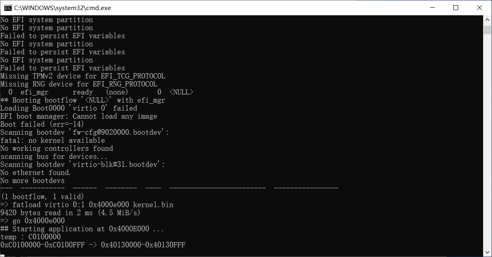
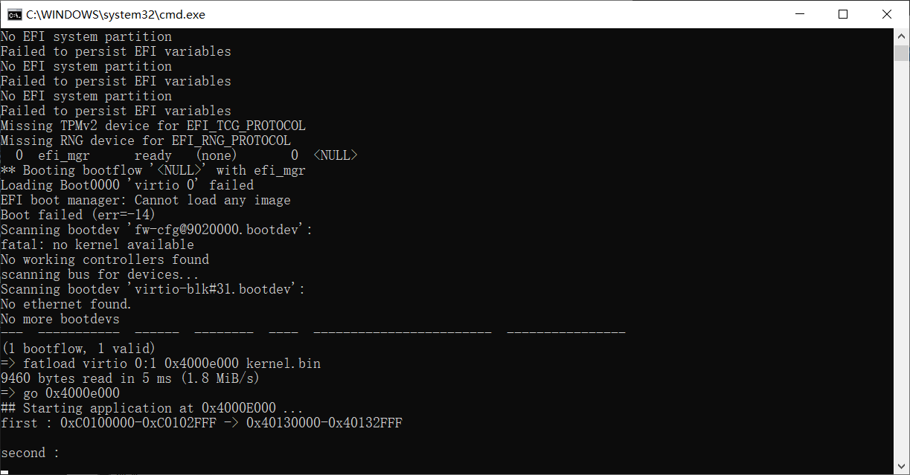

# （二十五）移植x86内存管理模块


## 1. 补充说明

之前 `（二十四）实现arm机制下的内存分页` 中，发现只要域控制器设置了Client，一级页表用粗页表，二级页表用小页表的这一套做法，就只能读不能写了。**但是段描述符不受影响！！！**我到现在还没想明白到底怎么回事。。。。

这真给我整麻了。

所以只能修改如下：

kernel_page.h，修改部分注释，还有删掉页目录表和页表这两个结构体。

```c
//
// Created by huangcheng on 2024/5/23.
//

#ifndef HOS_KERNEL_PAGE_H
#define HOS_KERNEL_PAGE_H

#include "../../lib/lib_kernel/lib_kernel.h"

// 这部分所有内容都来自arm官网文档，网址如下
// https://developer.arm.com/documentation/ddi0406/b/Appendices/ARMv4-and-ARMv5-Differences/System-level-memory-model/Virtual-memory-support?lang=en
// https://developer.arm.com/documentation/ddi0601/2024-03/AArch32-Registers/TTBCR--Translation-Table-Base-Control-Register?lang=en
// https://developer.arm.com/documentation/ddi0406/b/Appendices/ARMv4-and-ARMv5-Differences/System-Control-coprocessor--CP15--support/c1--System-control-register-support?lang=en#CHDHBEDB

// 在 ARMv7 架构的页表描述符中，描述符类型是用两位来表示的，可以有四种类型。
// 以下是描述符类型及其含义：
// 1. 0b00(0)：无效描述符（Fault）
// 2. 0b01(1)：粗页表（Coarse Page Table），或者指向二级页表（粗页表一级页表是4096条，二级页表是256条，二级页表项目每条同x86，管理4KB大小内存）
// 3. 0b10(2)：段描述符（Section），直接映射1MB内存，也被称为主页表项（Master）
// 4. 0b11(3)：超级段描述符（Supersection），映射16MB内存（仅在LPAE中使用）或细页表（Fine Page Table，1KB页，现在已经不用了）

// ARM 一级页表项

// 粗页表
typedef struct {
    uint32_t DescriptorType :2;            // 位0-1: 描述符类型，粗页表为1（二进制为01）
    uint32_t ShouldBeZero : 3;             // 位2-4: 必须为零
    uint32_t Domain : 4;                   // 位5-8: 域，用作内存保护机制，16个可能的域
    uint32_t ImplementationDefined : 1;    // 位9: 实现定义
    uint32_t BaseAddress : 22;             // 位10-31: 页表基地址，必须1KB对齐（地址右移10位）
} CoarsePageTableEntry;

// 段描述符
typedef struct {
    uint32_t DescriptorType :2;            // 位0-1: 描述符类型，段描述符为2（二进制为10）
    uint32_t Bufferable : 1;               // 位2: 缓冲位
    uint32_t Cacheable : 1;                // 位3: 缓存位
    uint32_t ShouldBeZero0 : 1;            // 位4: 应为0
    uint32_t Domain : 4;                   // 位5-8: 域，用作内存保护机制，16个可能的域
    uint32_t ImplementationDefined : 1;    // 位9: 实现定义（应为0）
    uint32_t AccessPermission : 2;         // 位10-11: 访问权限位1:0（0是禁止任何访问，1是特权读写，2是特权读写用户只读，3是全权）
    uint32_t TypeExtension : 3;            // 位12-14: 类型扩展位
    uint32_t ShouldBeZero1 : 1;            // 位15: 应为0
    uint32_t Shared : 1;                   // 位16: 共享位
    uint32_t ShouldBeZero2 : 1;            // 位17: 应为0
    uint32_t PresentHigh : 1;              // 位18: 存在更高的，段描述符不存在更高的，应当为0
    uint32_t ShouldBeZero3 : 1;            // 位19: 非安全位，用于安全扩展
    uint32_t BaseAddress : 12;             // 位20-31: 段基地址，必须1MB对齐（地址右移20位）
} SectionDescriptor;

// 超级段描述符
typedef struct {
    uint32_t DescriptorType :2;            // 位0-1: 描述符类型，超级段描述符为2（二进制为10）
    uint32_t Bufferable : 1;               // 位2: 缓冲位
    uint32_t Cacheable : 1;                // 位3: 缓存位
    uint32_t ShouldBeZero0 : 1;            // 位4: 应为0
    uint32_t BaseAddressHigh : 4;          // 位5-8: 超段基地址，支持时的[39:36]位
    uint32_t ImplementationDefined : 1;    // 位9: 实现定义
    uint32_t AccessPermission : 2;         // 位10-11: 访问权限位1:0
    uint32_t TypeExtension : 3;            // 位12-14: 类型扩展位
    uint32_t ShouldBeZero1 : 1;            // 位15: 应为0
    uint32_t Shared : 1;                   // 位16: 共享位
    uint32_t ShouldBeZero2 : 1;            // 位17: 应为0
    uint32_t PresentHigh : 1;              // 位18: 必须为1（存在更高的，说明这是超级段）
    uint32_t ShouldBeZero3 : 1;            // 位19: 应为0
    uint32_t BaseAddressMedium : 4;        // 位20-23: 超段基地址，支持时的[35:32]位
    uint32_t BaseAddress : 8;              // 位24-31: 超段基地址，必须16MB对齐
} SuperSectionDescriptor;

// 关于AP：0是禁止任何访问，1是特权读写，2是特权读写用户只读，3是特权和用户都是全权

// 在 ARMv7 架构中，域 (Domain) 是一种访问控制机制，用于管理对内存的访问。
// 每个域包含一组页表条目，系统可以对这些域施加不同的访问控制策略。
// 域访问控制寄存器 (DACR) 用于控制每个域的访问权限。
// 每个域可以设置为以下三种状态之一：
// 1. No Access (无访问权限): 任何尝试访问该域的内存都会导致访问权限错误。
// 2. Client (客户端): 访问权限由页表条目的访问权限字段决定。
// 3. Manager (管理): 允许对该域的所有访问，无需检查页表条目的访问权限字段。
// 每个页目录项包含一个 4 位的域字段，这个字段用于指定页表条目所属的域。域的数量最多为 16 (0-15)。

// 域控制器用结构体位域的表示方法
typedef struct {
    uint32_t domain0  : 2;  // 0，二进制00，无访问权；1，二进制01，Client，由页表条目的访问权限字段决定；3，二进制11，Manager，允许对该域所有访问，完全不检查权限
    uint32_t domain1  : 2;  // 0，二进制00，无访问权；1，二进制01，Client，由页表条目的访问权限字段决定；3，二进制11，Manager，允许对该域所有访问，完全不检查权限
    uint32_t domain2  : 2;  // 0，二进制00，无访问权；1，二进制01，Client，由页表条目的访问权限字段决定；3，二进制11，Manager，允许对该域所有访问，完全不检查权限
    uint32_t domain3  : 2;  // 0，二进制00，无访问权；1，二进制01，Client，由页表条目的访问权限字段决定；3，二进制11，Manager，允许对该域所有访问，完全不检查权限
    uint32_t domain4  : 2;  // 0，二进制00，无访问权；1，二进制01，Client，由页表条目的访问权限字段决定；3，二进制11，Manager，允许对该域所有访问，完全不检查权限
    uint32_t domain5  : 2;  // 0，二进制00，无访问权；1，二进制01，Client，由页表条目的访问权限字段决定；3，二进制11，Manager，允许对该域所有访问，完全不检查权限
    uint32_t domain6  : 2;  // 0，二进制00，无访问权；1，二进制01，Client，由页表条目的访问权限字段决定；3，二进制11，Manager，允许对该域所有访问，完全不检查权限
    uint32_t domain7  : 2;  // 0，二进制00，无访问权；1，二进制01，Client，由页表条目的访问权限字段决定；3，二进制11，Manager，允许对该域所有访问，完全不检查权限
    uint32_t domain8  : 2;  // 0，二进制00，无访问权；1，二进制01，Client，由页表条目的访问权限字段决定；3，二进制11，Manager，允许对该域所有访问，完全不检查权限
    uint32_t domain9  : 2;  // 0，二进制00，无访问权；1，二进制01，Client，由页表条目的访问权限字段决定；3，二进制11，Manager，允许对该域所有访问，完全不检查权限
    uint32_t domain10 : 2;  // 0，二进制00，无访问权；1，二进制01，Client，由页表条目的访问权限字段决定；3，二进制11，Manager，允许对该域所有访问，完全不检查权限
    uint32_t domain11 : 2;  // 0，二进制00，无访问权；1，二进制01，Client，由页表条目的访问权限字段决定；3，二进制11，Manager，允许对该域所有访问，完全不检查权限
    uint32_t domain12 : 2;  // 0，二进制00，无访问权；1，二进制01，Client，由页表条目的访问权限字段决定；3，二进制11，Manager，允许对该域所有访问，完全不检查权限
    uint32_t domain13 : 2;  // 0，二进制00，无访问权；1，二进制01，Client，由页表条目的访问权限字段决定；3，二进制11，Manager，允许对该域所有访问，完全不检查权限
    uint32_t domain14 : 2;  // 0，二进制00，无访问权；1，二进制01，Client，由页表条目的访问权限字段决定；3，二进制11，Manager，允许对该域所有访问，完全不检查权限
    uint32_t domain15 : 2;  // 0，二进制00，无访问权；1，二进制01，Client，由页表条目的访问权限字段决定；3，二进制11，Manager，允许对该域所有访问，完全不检查权限
} DACR_t;

// 获取DACR寄存器的值并存储到结构体中，paging_ops.asm
extern void get_dacr(DACR_t *dacr);
// 从结构体中读取并设置DACR寄存器的值，paging_ops.asm
extern void set_dacr(DACR_t *dacr);

// ARM 二级页表（分大页、小页、细页三种，大页64KB，小页4KB，细页1KB，细页现在基本上不用了）

// 大页，64KB
typedef struct {
    uint32_t PageType : 2;                     // 位0-1: 页类型，大页为1（二进制为01）
    uint32_t Bufferable : 1;                   // 位2: 缓冲位
    uint32_t Cacheable : 1;                    // 位3: 缓存位
    uint32_t AccessPermission0 : 2;            // 位4-5: 第一个4KB的访问权限，以此类推
    uint32_t AccessPermission1 : 2;            // 位6-8: 从上类推
    uint32_t AccessPermission2 : 2;            // 位9-10: 从上类推
    uint32_t AccessPermission3 : 2;            // 位10-11: 从上类推
    uint32_t TypeExtension : 3;                // 位12-14: 类型扩展位
    uint32_t ShouldBeZero : 1;                 // 位15: 应为0
    uint32_t BaseAddress : 16;                 // 位16-31: 大页基地址，必须64KB对齐（地址右移16位）
} LargePageDescriptor;

// 小页，4KB
typedef struct {
    uint32_t PageType : 2;                     // 位0-1: 页类型，小页为2（二进制为10）
    uint32_t Bufferable : 1;                   // 位2: 缓冲位
    uint32_t Cacheable : 1;                    // 位3: 缓存位
    uint32_t AccessPermission0 : 2;            // 位4-5: 第一个1KB的访问权限，以此类推
    uint32_t AccessPermission1 : 2;            // 位6-8: 从上类推
    uint32_t AccessPermission2 : 2;            // 位9-10: 从上类推
    uint32_t AccessPermission3 : 2;            // 位10-11: 从上类推
    uint32_t BaseAddress : 20;                 // 位12-31: 小页基地址，必须4KB对齐（地址右移12位）
} SmallPageDescriptor;

// #define PAGE_DIR_TABLE_POS 0x100000  // 页目录表的起始物理地址
// 因为virt的DRAM映射范围是0x40000000到0x47ffffff，要加上偏移量0x40000000才行

#define DRAM_OFFSET 0x40000000          // 内存偏移地址

#define PAGE_DIR_TABLE_POS 0x100000     // 页目录表的起始物理地址

#define PAGE_TABLE_ENTRIES 256          // 每个页表中的页表项数量
#define PAGE_DIR_ENTRIES 4096           // 页目录中的页目录项数量

// Linux分三个域，我只分两个（域只是个编号，没有高低之分，区分开就行）
#define KERNEL_DOMAIN 0     // 内核域
#define USER_DOMAIN 15      // 用户域

// 定义TTBCR寄存器的结构体
typedef struct {
    uint32_t N         : 3;   // 位0-2: 指示 TTBR0 中基地址的宽度。基地址字段为 bits[31:14-N]。当 N 的值为 0 时，TTBR0表基地址与 ARMv5 和 ARMv6 兼容。
    uint32_t Reserved0 : 1;   // 位3: 保留，必须为0
    uint32_t PD0       : 1;   // 位4: 使用 TTBR0 进行地址翻译时，是否在 TLB 未命中时执行页表遍历
    uint32_t PD1       : 1;   // 位5: 使用 TTBR1 进行地址翻译时，是否在 TLB 未命中时执行页表遍历
    uint32_t Reserved1 : 25;  // 位6-30: 保留，必须为0
    uint32_t EAE       : 1;   // 位31: 开启扩展地址 (Extended Address Enable)，可以使用4GB以上的地址，如果使用的话，结构体不一样，因此此处固定为0
} TTBCR_t;

// 关于N的说明
// N = 1：TTBR0 翻译低 2GB 地址空间，TTBR1 翻译高 2GB 地址空间。
// N = 2：TTBR0 翻译低 1GB 地址空间，TTBR1 翻译高 3GB 地址空间。
// N = 3：TTBR0 翻译低 512MB 地址空间，TTBR1 翻译高 3.5GB 地址空间。
// 依此类推，N = 7 时，TTBR0 翻译低 32MB 地址空间，TTBR1 翻译高 3.968GB 地址空间。

// 获取TTBCR寄存器的值并存储到结构体中，paging_ops.asm
extern void get_ttbcr(TTBCR_t *ttbcr);
// 从结构体中读取并设置TTBCR寄存器的值，paging_ops.asm
extern void set_ttbcr(TTBCR_t *ttbcr);

// 定义SCTLR寄存器的结构体
typedef struct {
    unsigned int M : 1;             // 位0: 内存控制位：0表示禁用MMU或MPU，1表示启用
    unsigned int A : 1;             // 位1: 对齐检查使能位：0表示禁用对齐故障检查，1表示启用
    unsigned int C : 1;             // 位2: 缓存使能位：0表示禁用数据和统一缓存，1表示启用
    unsigned int W : 1;             // 位3: 写缓冲区使能位：0表示禁用写缓冲区，1表示启用
    unsigned int reserved1 : 3;     // 位4-6: 保留，RAO/SBOP
    unsigned int B : 1;             // 位7: 大小端配置位：0表示小端，1表示大端（BE-32）
    unsigned int S : 1;             // 位8: 系统保护位，向后兼容
    unsigned int R : 1;             // 位9: ROM保护位，向后兼容
    unsigned int F : 1;             // 位10: 实现定义
    unsigned int Z : 1;             // 位11: 分支预测使能位：0表示禁用，1表示启用
    unsigned int I : 1;             // 位12: 指令缓存使能位：0表示禁用，1表示启用
    unsigned int V : 1;             // 位13: 向量表基址选择位：0表示0x00000000，1表示0xFFFF0000
    unsigned int RR : 1;            // 位14: 轮替策略选择位：0表示普通替换策略，1表示可预测策略
    unsigned int L4 : 1;            // 位15: ARMv5T Thumb互操作行为抑制位
    unsigned int reserved2 : 16;    // 位16-31: 保留
} SCTLR_t;

// 获取SCTLR寄存器的值并存储到结构体中，paging_ops.asm
extern void get_sctlr(SCTLR_t *sctlr);
// 从结构体中读取并设置SCTLR寄存器的值，paging_ops.asm
extern void set_sctlr(SCTLR_t *sctlr);

// 刷新TLB，使TLB无效
extern void invalidate_tlbs();

// 内存分页功能初始化
void init_paging();


#endif //HOS_KERNEL_PAGE_H

```

kernel_page.c，换用了段描述符，比较方便，又不用二级页表，这比起x86好多了，再增加自引用，方便后续操作。

```c
//
// Created by huangcheng on 2024/5/23.
//

#include "kernel_page.h"

// 注意，和x86不同的是，页目录表是4096条，需要16KB，也就是0x4000

void setup_page_directory() {

    SectionDescriptor *page_directory = (SectionDescriptor *)(PAGE_DIR_TABLE_POS + DRAM_OFFSET);

    // 清空整个页目录表（4096条，要16KB）
    memset(page_directory, 0, 0x4000);

    // 低端一对一映射（DRAM地址从0x40000000开始，不仅是内存，还有uart，还有可能的其他组件，因此全部用段描述符映射）
    // 0x40000000 / 0x100000 = 0x400
    // 0x48000000 / 0x100000 = 0x480
    for(uint32_t i = 0; i < 0x480; i++) {
        page_directory[i].DescriptorType = 2;
        page_directory[i].Bufferable = 1;
        page_directory[i].Cacheable = 1;
        page_directory[i].ShouldBeZero0 = 0;
        page_directory[i].Domain = USER_DOMAIN;
        page_directory[i].ImplementationDefined = 0;
        page_directory[i].AccessPermission = 3; // 用户域不检查，但还是以防万一
        page_directory[i].TypeExtension = 0;
        page_directory[i].ShouldBeZero1 = 0;
        page_directory[i].Shared = 0;
        page_directory[i].ShouldBeZero2 = 0;
        page_directory[i].PresentHigh = 0;
        page_directory[i].ShouldBeZero3 = 0;
        // page_directory[i].BaseAddress = ((i * 0x100000) >> 20);
        // 简化为：
        page_directory[i].BaseAddress = i;
    }


    // 1条页表放高端1MB映射
    // 从0xc0000000开始
    page_directory[0xc00].DescriptorType = 2;
    page_directory[0xc00].Bufferable = 1;
    page_directory[0xc00].Cacheable = 1;
    page_directory[0xc00].ShouldBeZero0 = 0;
    page_directory[0xc00].Domain = KERNEL_DOMAIN;
    page_directory[0xc00].ImplementationDefined = 0;
    page_directory[0xc00].AccessPermission = 2;     // 当然要特权读写用户只读
    page_directory[0xc00].TypeExtension = 0;
    page_directory[0xc00].ShouldBeZero1 = 0;
    page_directory[0xc00].Shared = 0;
    page_directory[0xc00].ShouldBeZero2 = 0;
    page_directory[0xc00].PresentHigh = 0;
    page_directory[0xc00].ShouldBeZero3 = 0;
    page_directory[0xc00].BaseAddress = (DRAM_OFFSET >> 20);


    // 增加自引用（偷懒所以用段描述符，实际上为了权限控制的话，应该用粗页表，把范围定死在这16KB里面）
    // 这样访问的地址就是0xfff00000
    // 但是注意，范围很大，有1MB，别越界
    page_directory[0xfff].DescriptorType = 2;
    page_directory[0xfff].Bufferable = 1;
    page_directory[0xfff].Cacheable = 1;
    page_directory[0xfff].ShouldBeZero0 = 0;
    page_directory[0xfff].Domain = KERNEL_DOMAIN;
    page_directory[0xfff].ImplementationDefined = 0;
    page_directory[0xfff].AccessPermission = 2;     // 当然要特权读写用户只读
    page_directory[0xfff].TypeExtension = 0;
    page_directory[0xfff].ShouldBeZero1 = 0;
    page_directory[0xfff].Shared = 0;
    page_directory[0xfff].ShouldBeZero2 = 0;
    page_directory[0xfff].PresentHigh = 0;
    page_directory[0xfff].ShouldBeZero3 = 0;
    page_directory[0xfff].BaseAddress = ((PAGE_DIR_TABLE_POS + DRAM_OFFSET) >> 20);

    // ramdisk暂时不管，用到了再说
}

void init_paging() {
    // 设置页目录表
    setup_page_directory();

    // 先禁用MMU
    // 获取当前SCTLR寄存器值
    SCTLR_t sctlr;
    get_sctlr(&sctlr);
    // 禁用MMU
    sctlr.M = 0; // 禁用MMU
    sctlr.A = 0; // 禁用对齐检查
    sctlr.C = 0; // 禁用数据缓存
    // 更新SCTLR寄存器
    set_sctlr(&sctlr);

    // 域控制器设置
    DACR_t dacr;
    memset(&dacr, 0, sizeof(DACR_t));
    // 实测，一旦开启权限检查
    // 用粗页表和小页表的二级映射体系直接无法写，只能读
    // 为了避免权限问题，只能一律全权
    dacr.domain0 = 3;
    dacr.domain15 = 3;
    set_dacr(&dacr);

    // 设置TTBCR寄存器，只使用TTBR0，类似于x86的cr3，兼容先前的ARMv5和ARMv6架构
    TTBCR_t ttbcr;
    // 取当前TTBCR值
    get_ttbcr(&ttbcr);
    ttbcr.N = 0;
    ttbcr.Reserved0 = 0;
    ttbcr.PD0 = 0;
    ttbcr.PD1 = 0;
    ttbcr.Reserved1 = 0;
    ttbcr.EAE = 0;
    // 设置TTBCR寄存器
    set_ttbcr(&ttbcr);

    // 载入页目录表
    load_page_directory(PAGE_DIR_TABLE_POS + DRAM_OFFSET);

    // 无效化TLB
    invalidate_tlbs();

    // 启用MMU
    get_sctlr(&sctlr);
    sctlr.M = 1; // 启用MMU
    sctlr.A = 1; // 启用对齐检查
    sctlr.C = 1; // 启用数据缓存
    // 更新SCTLR寄存器
    set_sctlr(&sctlr);
}

```

这样的话，基本上和x86没区别了，直接把TTBR0当成cr3用，因此汇编修改如下：

paging_ops.asm

```assembly
// void load_page_directory(uint32_t page_directory_addr);
load_page_directory:
    // 设置TTBR0
    mcr p15, 0, r0, c2, c0, 0    // 设置TTBR0，r0包含页表基地址
    // 配合只使用TTBR0，所以就不要加载到TTBR1了

    bx lr                        // 返回调用者
```


## 2. 移植TASK

内核任务这部分，主要是用到内核的TCB中存放的虚拟地址位图结构体信息，所以移植得不多，因为x86的任务切换机制和arm并不一样，需要重写。

kernel_task文件夹下kernel_task.h

```c
//
// Created by huangcheng on 2024/6/1.
//

#ifndef HOS_KERNEL_TASK_H
#define HOS_KERNEL_TASK_H

#include "../../lib/lib_kernel/lib_kernel.h"
#include "../kernel_memory/kernel_memory.h"

// 只是为了初始化内核的TCB和任务管理机制
// 所以其他的暂时不移植

// 最常用的五大任务状态（进线程通用），正在运行，准备就绪，阻塞，等待，挂起，死亡
enum task_status {
    TASK_RUNNING,
    TASK_READY,
    TASK_BLOCKED,
    TASK_WAITING,
    TASK_HANGING,
    TASK_DIED
};

//TCB（任务控制块），表明这是一个任务（不管是进线程，都是任务）
struct task {
    uint8_t *self_stack;	    // 各任务都用自己的栈（指向栈顶）

    enum task_status status;    // 任务状态，这个不用说
    char name[64];              // 任务名（未来可以改成全局唯一ID）
    uint8_t priority;           // 优先级
    uint8_t ticks;	            // 每次在处理器上执行的时间嘀嗒数（一个ticks即定时器IRQ0中断一次，决定什么时候调度任务）

    uint32_t elapsed_ticks;     // 此任务自上cpu运行后至今占用了多少cpu嘀嗒数,

    struct list_node general_tag;   // 当前串在哪个调度队列上
    struct list_node all_task_tag;  // 所有任务都串在一起，这是为了保证任何时候都能找到

    uint32_t pgdir;            // 页表的物理地址（单独分配这个资源的时候就是进程了）
    Virtual_Addr process_virtual_address;  // 用户进程的虚拟地址资源，申请内存的时候需要
    uint32_t stack_magic;	    // 用这串数字做栈的边界标记,用于检测任务栈的溢出
};

// 多任务机制初始化
void init_multitasking(void);
// 通过名字获取任务
struct task *task_info(char *name);
// 当前正在运行的任务是哪个
struct task* running_task(void);

#endif //HOS_KERNEL_TASK_H

```

kernel_task.c

```c
//
// Created by huangcheng on 2024/6/1.
//

#include "kernel_task.h"

#define PG_SIZE 0x1000

// 内核任务 TCB 的固定位置和栈位置
#define KERNEL_TCB ((struct task*)0x4009f000)

// 定义就绪队列和所有队列
static struct list_node ready_list;
static struct list_node all_task_list;

// 死亡任务队列（暂时还没关闭的任务都在里面）
static struct list_node died_list;

// 当前正在运行的任务
static struct task* current_task = NULL;
// 将要运行的任务（下一个任务）
static struct task* next_task = NULL;

// 初始化任务调度系统
void init_multitasking(void) {
    // 初始化三个队列
    init_list_node(&ready_list);
    init_list_node(&all_task_list);
    init_list_node(&died_list);

    // 初始化内核任务的 PCB（这一整页都直接清空）
    memset(KERNEL_TCB, 0, PG_SIZE);
    strcpy(KERNEL_TCB->name, "kernel");
    // 内核优先级为31，最高，运行时间也最长
    KERNEL_TCB->priority = 31;
    KERNEL_TCB->status = TASK_RUNNING;
    KERNEL_TCB->ticks = 31;
    KERNEL_TCB->elapsed_ticks = 0;
    // 内核栈位置固定的，之前设好了（现在假设是在栈底，后面调度的时候会自动更新的）
    KERNEL_TCB->self_stack = (uint8_t *)0xc0007000;
    // 魔数防止栈越界
    KERNEL_TCB->stack_magic = 0x20000702;
    // 因为现在肯定是内核在运行，所以不用加入到ready队列里面，加入到所有队列就行了
    init_list_node(&KERNEL_TCB->general_tag);
    list_add_tail(&KERNEL_TCB->all_task_tag, &all_task_list);

    // 内核的页表所在（为了方便切换）
    KERNEL_TCB->pgdir = PAGE_DIR_TABLE_POS + DRAM_OFFSET;
    // 内核的虚拟位图信息在内存管理初始化的时候写入

    // 将当前任务设置为内核任务
    current_task = KERNEL_TCB;
    // 还要运行很久，所以设置为下一个任务
    next_task = KERNEL_TCB;
}

// 通过名字获取任务
struct task* task_info(char *name) {
    LIST_NODE* pos;
    list_for_each(pos, &all_task_list) {
        struct task* task = list_entry(pos, struct task, all_task_tag);
        if (strcmp(task->name, name) == 0) {
            return task;
        }
    }
    return NULL;
}

// 当前正在运行的任务
struct task* running_task(void) {
    return current_task;
}

```

kernel_task下的Makefile

```makefile

# 目录
KERNEL_DIR = ..
KERNEL_TASK_DIR = .

# 源文件
KERNEL_TASK_C_SRC = $(KERNEL_TASK_DIR)/kernel_task.c

# C 编译标志
CFLAGS = -ffreestanding -nostdlib -Wall -Wextra

# 汇编标志
ASM_FLAGS = -f elf32

# 标签标记所有的任务（输出什么文件），方便修改
OBJS = $(KERNEL_DIR)/kernel_task.o

.PHONY: all

all: $(OBJS)

# 编出来放到模块文件夹kernel去，别放在这里，方便主Makefile找
$(KERNEL_DIR)/kernel_task.o: $(KERNEL_TASK_C_SRC)
	$(GCC) $(CFLAGS) -c -o $@ $<

# 不生成文件于此，无需清理

```


## 3. 移植内存管理模块

kernel_memory文件夹下。

kernel_memory.h

```c
//
// Created by huangcheng on 2024/5/28.
//

#ifndef HOS_KERNEL_MEMORY_H
#define HOS_KERNEL_MEMORY_H

#include "../kernel_page/kernel_page.h"
#include "../../lib/lib_kernel/lib_kernel.h"

// 区分申请的是内核内存池还是用户内存池
typedef enum {
    KERNEL_FLAG = 1,
    USER_FLAG = 2
}MemoryRequesterType;

// 管理所有进程（包括内核的）虚拟地址的结构
typedef struct {
    uint32_t virtual_addr_start;    // 该虚拟地址池管理的虚拟内存起始地址
    BitMap bitmap_virtual_memory;   // 虚拟地址位图
} Virtual_Addr;

// 内存管理初始化
void init_memory(uint32_t total_physical_memory);
// 申请以页为单位的内存
void* malloc_page(MemoryRequesterType type, uint32_t pg_cnt);
// 以页为单位归还内存
void free_page(void* vaddr, uint32_t pg_cnt);


#endif //HOS_KERNEL_MEMORY_H

```

kernel_memory.c

```c
//
// Created by huangcheng on 2024/5/28.
//

#include "kernel_memory.h"

#include "../kernel_page/kernel_page.h"
#include "../kernel_task/kernel_task.h"

// 这里和x86的内存分配计划类似
// 只是直接把DRAM偏移量0x40000000加上了

// 一页大小4096字节，4KB
#define PG_SIZE 0x1000

// 全局物理地址位图结构地址
#define GLOBAL_BITMAP_PHYSICAL_ADDR 0x4009f800
// 全局物理地址位图基址（因为arm的一级页表占0x4000，现在又没有二级页表）
#define GLOBAL_BITMAP_PHYSICAL_BASE 0x40104000
// 管理4G内存时位图占据的内存最大长度（128KB）
#define GLOBAL_BITMAP_PHYSICAL_BYTE_LENGTH 0x20000

// 内核虚拟地址起点（注意，和x86一样，1MB以下全部被内核使用了，无法再用做堆内存了）
#define KERNEL_VIRTUAL_ADDR_START 0xc0000000
// 内核虚拟地址位图基址
#define KERNEL_BITMAP_VIRTUAL_BASE 0x40124000
// 内核只占据高端1GB的内存，所以最多只需要32KB内存就行了
// GLOBAL_BITMAP_PHYSICAL_BYTE_LENGTH / 4 = 0x8000 即可
// 之前在x86中，因为多了1MB的问题，就把内核虚拟地址大小缩减到了512MB
// 可以直接设置为已经占据，这样起算就方便了
#define KERNEL_BITMAP_VIRTUAL_BYTE_LENGTH 0x4000

// 全局物理内存位图，结构在0x9f800处
BitMap *global_bitmap_physical_memory = (BitMap *)GLOBAL_BITMAP_PHYSICAL_ADDR;

// 页表、位图结束的地方，就是内核堆内存开始的地方（物理位置，放在0x130000这里开始是为了取整，这里不加上偏移量是为了位图计算）
#define KERNEL_PHYSICAL_ADDR_START 0x130000
// 相应地，怕不太够用，不然连几个内核任务都开不了，所以内核保留物理内存扩大到16MB
// 16MB，有超过14MB的空余内存。一个内核任务的TCB要一页也就是4KB
// 1MB可以开 1024 / 4 = 256个内核任务
// 这么多下来足够了

// 用户堆内存开始的地方就是内核堆内存结束的地方（物理位置，这里不加上偏移量是为了位图计算）
#define USER_PHYSICAL_ADDR_START 0x1000000

// 内核任务 TCB 的固定位置和栈位置
#define KERNEL_TCB ((struct task*)0x4009f000)

// 32位x86的虚拟地址拆分方式不适合32位arm
// 32位arm的虚拟地址拆分方式如下：
typedef union {
    uint32_t addr_value;
    struct Part {
        uint32_t offset : 12;       // 低12位：页内偏移
        uint32_t pte_index : 8;     // 中8位：页表索引，其实就是二级页表索引，这里我只不过是懒得换名字了
        uint32_t pde_index : 12;    // 高12位：页目录索引，其实就是一级页表索引，这里我只不过是懒得换名字了
    }part;
}VaddrPart;

// 内存管理初始化
void init_memory(uint32_t total_physical_memory) {
    // 物理地址位图，一页是一位，一字节8位
    global_bitmap_physical_memory->bits = (uint8_t *)GLOBAL_BITMAP_PHYSICAL_BASE;
    global_bitmap_physical_memory->btmp_bytes_len = total_physical_memory / PG_SIZE / 8;
    bitmap_init(global_bitmap_physical_memory);
    // 物理地址上已经占据了的置为1
    // 低端1MB全部被内核占据了，还有页表、位图（按照上面取整，直接按0x130000计算，以下全部当作被占据）
    bitmap_set_range(global_bitmap_physical_memory, 0, 0x130000 / PG_SIZE, 1);

    // 虚拟地址管理的设置（内核虚拟地址写在线程的TCB里面）
    KERNEL_TCB->process_virtual_address.virtual_addr_start = KERNEL_VIRTUAL_ADDR_START;
    // 内核虚拟地址的地址
    KERNEL_TCB->process_virtual_address.bitmap_virtual_memory.bits = (uint8_t *)KERNEL_BITMAP_VIRTUAL_BASE;
    // 内核虚拟地址上限
    KERNEL_TCB->process_virtual_address.bitmap_virtual_memory.btmp_bytes_len = KERNEL_BITMAP_VIRTUAL_BYTE_LENGTH;
    // 初始化内核虚拟位图
    bitmap_init(&(KERNEL_TCB->process_virtual_address.bitmap_virtual_memory));
    // 设置最开始的1MB全部被内核占据了
    bitmap_set_range(&(KERNEL_TCB->process_virtual_address.bitmap_virtual_memory), 0, 0x100000 / PG_SIZE, 1);
}

// 获取一个物理页
// 参数为起始地址，结束地址，在这个范围内搜寻（这里不做太多处理了，总而言之就是不要越界）
void* alloc_physical_pages(uint32_t start_addr, uint32_t end_addr) {
    if(start_addr >= end_addr) {
        return NULL;
    }

    int32_t bit_idx = bitmap_scan_in_range(global_bitmap_physical_memory, start_addr / PG_SIZE, end_addr / PG_SIZE ,1);    // 找一个物理页面

    if (bit_idx == -1 ) {
        return NULL;
    }

    bitmap_set(global_bitmap_physical_memory, bit_idx, 1);	// 将此位bit_idx置1
    // 这里要加上DRAM偏移量
    uint32_t page_phyaddr = (bit_idx * PG_SIZE + DRAM_OFFSET);

    return (void*)page_phyaddr;
}

// 释放一个物理页
void free_physical_pages(void *page_phyaddr) {
    if(page_phyaddr == NULL) {
        return;
    }
    // 这里要减去DRAM偏移量
    uint32_t bit_idx = ((uint32_t)page_phyaddr - DRAM_OFFSET) / PG_SIZE;
    if (bit_idx >= global_bitmap_physical_memory->btmp_bytes_len * 8 ) {
        // 越界处理
        return;
    }
    bitmap_set(global_bitmap_physical_memory, bit_idx, 0);	// 将此位bit_idx置0
}

// 根据虚拟地址位图分配连续的虚拟页
void* alloc_virtual_pages(Virtual_Addr *virtualaddr , uint32_t pg_cnt){

    int32_t bit_idx_start = bitmap_scan(&virtualaddr->bitmap_virtual_memory, pg_cnt);  // 扫描位图，找到连续的空闲页
    if (bit_idx_start == -1) {
        return NULL;  // 没有足够的连续空闲页
    }
    bitmap_set_range(&virtualaddr->bitmap_virtual_memory, bit_idx_start, pg_cnt, 1); // 标记这些页为已使用

    uint32_t vaddr_start = bit_idx_start * PG_SIZE + virtualaddr->virtual_addr_start;  // 计算虚拟地址

    return (void*)vaddr_start;
}

// 根据虚拟地址位图释放虚拟页
void free_virtual_pages(Virtual_Addr *virtualaddr, void* vaddr, uint32_t pg_cnt){
    if(vaddr == NULL || pg_cnt == 0) {
        return;
    }
    // 更新虚拟地址位图，将虚拟页标记为未使用
    uint32_t bit_idx_start = ((uint32_t)vaddr - virtualaddr->virtual_addr_start) / PG_SIZE;
    bitmap_set_range(&virtualaddr->bitmap_virtual_memory, bit_idx_start, pg_cnt, 0);
}

// 添加映射
int8_t add_page_mapping(uint32_t virtual_address, uint32_t physical_address) {

    VaddrPart info = {.addr_value = virtual_address};
    // 因为用的是段描述符，所以自引用地址变成0xfff00000
    // 要按照4KB粒度内存分配的话，只能按照一级粗页表和二级小页表的方式来做
    CoarsePageTableEntry *pde = ((CoarsePageTableEntry *)0xfff00000 + info.part.pde_index);
    // 检查是否还没有建立
    if(pde->DescriptorType == 0 || pde->BaseAddress == 0) {
        // 首先，解释一下逻辑
        // 尽可能像x86一样做，不要浪费页表项
        // 但是arm的一级页表是4096条，二级页表是256条
        // 所以为了不浪费，如果这条没有，就要以连续四条页表同时指定
        // 因为先前没有
        // 进入这个逻辑的时候，如果pde_index是0，那么就连续指定0、1、2、3
        // 下次进入这个逻辑的时候，pde_index就是4
        // 以此类推

        // 还没有建立的话，要给它建立对应的页表
        // 页表项无论如何都必须放在内核空间，不管你是用户进程还是内核
        SmallPageDescriptor *page_table =  alloc_physical_pages(KERNEL_PHYSICAL_ADDR_START, USER_PHYSICAL_ADDR_START);
        if(page_table == NULL) {
            // 这里还没什么资源，就做了个转换而已，不用回收资源
            return 0;
        }
        // 清空内存空间
        memset(page_table, 0, PG_SIZE);

        // 连续设置4条粗页表
        for(uint32_t i = 0; i < 4; i++) {
            pde[i].DescriptorType = 1;
            pde[i].ShouldBeZero = 0;
            // 域控制器设置了两个域都是全权，也没区别了
            // 如果要精细控制的话，需要加参数确定当前是什么角色，指定什么域
            pde[i].Domain = USER_DOMAIN;
            pde[i].ImplementationDefined = 0;
            pde[i].BaseAddress = (((uint32_t)(page_table) + i * 0x400) >> 10);
        }
    }

    SmallPageDescriptor *pte = ((SmallPageDescriptor *)(pde->BaseAddress << 10) + info.part.pte_index);

    // 任何一个不为0说明已有映射
    if(pte->PageType || pte->BaseAddress) {
        // 已有的映射才会失败，那是不需要回滚的
        // 前面申请空间，已经清空，不可能到这里
        return 0;
    }

    // 还没有映射，直接建立映射项目
    pte->PageType = 2;
    pte->Bufferable = 1;
    pte->Cacheable = 1;
    pte->AccessPermission0 = 3;
    pte->AccessPermission1 = 3;
    pte->AccessPermission2 = 3;
    pte->AccessPermission3 = 3;
    pte->BaseAddress = physical_address >> 12;  // 写入物理地址，建立映射

    return 1;
}

// 移除映射，返回对应的物理页表地址
void *remove_page_mapping(uint32_t virtual_address) {
    VaddrPart info = {.addr_value = virtual_address};

    // 因为用的是段描述符，所以自引用地址变成0xfff00000
    // 获取页目录项
    CoarsePageTableEntry *pde = ((CoarsePageTableEntry *)0xfff00000 + info.part.pde_index);

    // 如果页目录项不存在，直接返回NULL
    if (pde->DescriptorType == 0 || pde->BaseAddress == 0) {
        return NULL;
    }

    // 获取页表项
    SmallPageDescriptor *pte = ((SmallPageDescriptor *)(pde->BaseAddress << 10) + info.part.pte_index);

    // 如果页表项不存在，直接返回NULL
    if (pte->PageType == 0 || pte->BaseAddress == 0) {
        return NULL;
    }

    // 获取物理地址
    uint32_t physical_address = pte->BaseAddress << 12;
    // 清除页表项
    memset(pte, 0, sizeof(SmallPageDescriptor));

    // 注意：要回收的话，意味着一次性要回收四个粗页表项
    // 因此需要额外计算

    // 找到这四个粗页表项的开头，并取出它的页表项
    // 用整数除法，移除小数只留下整数结果，再乘以4就能得到这组粗页表项的开头索引了
    CoarsePageTableEntry * page_directory = (CoarsePageTableEntry *)0xfff00000 + ((info.part.pde_index / 4) * 4);
    SmallPageDescriptor *page_table = (SmallPageDescriptor *)(page_directory->BaseAddress << 10);

    // 检查页表中是否还有有效的页表项
    uint8_t page_table_empty = 1;
    for (int i = 0; i < 1024; i++) {
        if (page_table[i].PageType || pte->BaseAddress) {
            // 任何一个有都说明有效
            page_table_empty = 0;
            break;
        }
    }

    // 如果页表为空，释放整张页表并清空连续四个页目录项
    if (page_table_empty) {
        free_physical_pages(page_table);
        memset(page_directory, 0, 4 * sizeof(CoarsePageTableEntry));
    }

    return (void *)physical_address;
}

// 申请以页为单位的内存
void* malloc_page(MemoryRequesterType type, uint32_t pg_cnt) {
    uint32_t start_addr, end_addr;

    if(type == KERNEL_FLAG) {
        // 设置内核物理内存范围
        start_addr = KERNEL_PHYSICAL_ADDR_START;
        end_addr = USER_PHYSICAL_ADDR_START;
    } else {
        // 设置用户物理内存范围
        start_addr = USER_PHYSICAL_ADDR_START;
        end_addr = (uint32_t)(global_bitmap_physical_memory->btmp_bytes_len * 8 * PG_SIZE);
    }

    // 获取当前任务
    Virtual_Addr *virtual_addr = &running_task()->process_virtual_address;

    // 首先申请虚拟页
    void *vaddr = alloc_virtual_pages(virtual_addr, pg_cnt);
    if(vaddr == NULL) {
        return NULL;
    }

    // 然后再一个个申请物理页做映射
    // 因为要做到原子操作，所以申请失败必须全部回滚
    // 我这里用时间换空间，直接用数组把页数据存起来，如果执行不了就全部回滚
    // 再用一个标记记录是否失败，一旦失败全部回滚先前操作
    uint8_t success = 1;

    // 存储物理页数据的数组，清空待用
    void *pages[pg_cnt];
    for(uint32_t i = 0; i < pg_cnt; i++) {
        pages[i] = NULL;
    }

    for(uint32_t i = 0; i < pg_cnt; i++) {
        pages[i] = alloc_physical_pages(start_addr, end_addr);
        if(pages[i] == NULL) {
            success = 0;
            break;
        }
    }
    if (!success) {
        // 失败回滚
        free_virtual_pages(virtual_addr, vaddr, pg_cnt);
        for (uint32_t i = 0; i < pg_cnt; i++) {
            if (pages[i] != NULL) {
                free_physical_pages(pages[i]);
            }
        }
        return NULL;
    }
    // 逐个映射
    for (uint32_t i = 0; i < pg_cnt; i++) {
        success = add_page_mapping((uint32_t)vaddr + i * PG_SIZE, (uint32_t)pages[i]);
        if (!success) {
            // 一个失败，全部回滚
            for (uint32_t j = 0; j < i; j++) {
                remove_page_mapping((uint32_t)vaddr + j * PG_SIZE);
                free_physical_pages(pages[j]);
            }
            free_virtual_pages(virtual_addr, vaddr, pg_cnt);
            return NULL;
        }
    }

    return vaddr;
}

void free_page(void* vaddr, uint32_t pg_cnt) {
    if (vaddr == NULL || pg_cnt == 0) {
        return;
    }

    Virtual_Addr *virtual_addr = &running_task()->process_virtual_address;

    // 逐个释放页表中的物理页
    for (uint32_t i = 0; i < pg_cnt; i++) {
        // 计算虚拟地址
        uint32_t virtual_address = (uint32_t)vaddr + i * PG_SIZE;
        // 移除映射关系
        void* page_phyaddr = remove_page_mapping(virtual_address);
        // 释放物理页
        if (page_phyaddr != NULL) {
            free_physical_pages(page_phyaddr);
        }
    }

    // 释放虚拟页
    free_virtual_pages(virtual_addr, vaddr, pg_cnt);
}

```

主要修改的是添加映射和移除映射这部分，以及DRAM偏移量的问题（在申请物理页和释放物理页中）。

添加映射和移除映射这部分，为了适配arm的逻辑，改成一次性添加四条或者移除四条一级页表项。


kernel文件夹中的Makefile

```makefile

# 目录
KERNEL_DIR = .

# 所有组件目录
PAGE_DIR = kernel_page
TASK_DIR = kernel_task
MEMORY_DIR = kernel_memory

# 源文件
KERNEL_C_SRC = $(KERNEL_DIR)/kernel.c

# 标签标记所有的任务（输出什么文件），方便修改
KERNEL_OBJS = $(KERNEL_DIR)/kernel.o \
				$(KERNEL_DIR)/kernel_page.o \
				$(KERNEL_DIR)/kernel_task.o \
				$(KERNEL_DIR)/kernel_memory.o

# C 编译标志
CFLAGS = -ffreestanding -nostdlib -Wall -Wextra

.PHONY: all

all: $(KERNEL_OBJS)

# arm交叉编译工具链的gcc没问题了，可以直接编目标文件.o
$(KERNEL_DIR)/kernel.o: $(KERNEL_C_SRC)
	$(GCC) $(CFLAGS) -c -o $@ $<

# 执行各子模块编译
$(KERNEL_DIR)/kernel_page.o:
	$(MAKE) -C $(PAGE_DIR) GCC=$(GCC) AS=$(AS) MAKE=$(MAKE)

$(KERNEL_DIR)/kernel_task.o:
	$(MAKE) -C $(TASK_DIR) GCC=$(GCC) AS=$(AS) MAKE=$(MAKE)

$(KERNEL_DIR)/kernel_memory.o:
	$(MAKE) -C $(MEMORY_DIR) GCC=$(GCC) AS=$(AS) MAKE=$(MAKE)

# 清理规则
clean:
	@if exist $(KERNEL_DIR)\\*.o del $(KERNEL_DIR)\\*.o
	@if exist $(KERNEL_DIR)\\*.elf del $(KERNEL_DIR)\\*.elf

```


## 4. 测试效果

kernel.c

```c
//
// Created by huangcheng on 2024/6/24.
//

#include "../lib/lib_kernel/lib_kernel.h"
#include "kernel_page/kernel_page.h"
#include "kernel_task/kernel_task.h"

void print_mapping(uint32_t virt_addr_start, uint32_t virt_addr_end, uint32_t phys_addr_start, uint32_t phys_addr_end);
void get_page_table_mappings();
void setup_page_table();

void kernel_main(void) {
    // u-boot已经给我们设置了管理模式
    // 一进来就已经是管理模式了

    // 页表初始化
    init_paging();

    // 因为覆盖了整个内存区域，所以还可以用u-boot的栈
    // 到这里再切换也没问题

    // 切换栈指针到虚拟地址，这样就可以顺利使用内核栈了
    switch_sp(0xc0007000);
    // 初始化task
    init_multitasking();
    // 初始化内存管理（本来这里应该从环境里面获取内存大小，我懒，直接写死了算了）
    init_memory(0x8000000);

    // 获取一页内存
    uint32_t * temp = malloc_page(KERNEL_FLAG, 1);
    put_str("temp : ");
    put_int((uint32_t)temp);
    put_char('\n');

    temp[0] = 0x123456;
    temp[1] = 0xabcdef;

    get_page_table_mappings();


    for(;;);
}

void print_mapping(uint32_t virt_addr_start, uint32_t virt_addr_end, uint32_t phys_addr_start, uint32_t phys_addr_end) {
    put_str("0x");
    put_int(virt_addr_start);
    put_str("-0x");
    put_int(virt_addr_end);
    put_str(" -> 0x");
    put_int(phys_addr_start);
    put_str("-0x");
    put_int(phys_addr_end);
    put_char('\n');
}


// 获取当前页表的映射关系并合并连续的范围
void get_page_table_mappings() {
    uint32_t *page_table = (uint32_t *)get_current_page();
    uint32_t virt_start = 0, phys_start = 0, virt_end = 0, phys_end = 0;
    int in_range = 0;

    for (uint32_t i = 0; i < 4096; ++i) {
        uint32_t l1_entry = page_table[i];
        if (l1_entry & 0x1) { // 一级页表项有效
            uint32_t *l2_page_table = (uint32_t *)(l1_entry & 0xFFFFFC00); // 取得二级页表的基址
            uint32_t virt_addr_base = i << 20; // 一级页表项的基址

            for (uint32_t j = 0; j < 256; ++j) {
                uint32_t l2_entry = l2_page_table[j];
                if (l2_entry & 0x2) { // 二级页表项有效
                    uint32_t current_virt_start = virt_addr_base + (j << 12);
                    uint32_t current_phys_start = l2_entry & 0xFFFFF000;
                    uint32_t current_virt_end = current_virt_start + 0xFFF;
                    uint32_t current_phys_end = current_phys_start + 0xFFF;

                    if (!in_range) {
                        // 开始新的映射范围
                        virt_start = current_virt_start;
                        phys_start = current_phys_start;
                        virt_end = current_virt_end;
                        phys_end = current_phys_end;
                        in_range = 1;
                    } else {
                        // 检查是否与前一个范围连续
                        if (current_phys_start == (phys_end + 1)) {
                            virt_end = current_virt_end;
                            phys_end = current_phys_end;
                        } else {
                            // 输出之前的范围
                            print_mapping(virt_start, virt_end, phys_start, phys_end);
                            // 开始新的映射范围
                            virt_start = current_virt_start;
                            phys_start = current_phys_start;
                            virt_end = current_virt_end;
                            phys_end = current_phys_end;
                        }
                    }
                } else if (in_range) {
                    // 输出之前的范围
                    print_mapping(virt_start, virt_end, phys_start, phys_end);
                    in_range = 0;
                }
            }
        }
    }

    // 输出最后一个范围
    if (in_range) {
        print_mapping(virt_start, virt_end, phys_start, phys_end);
    }
}

```

编译放到虚拟磁盘里，上qemu-system-arm，用u-boot载入。



可以看到，映射被建立起来了。


用GDB直接查看对应的物理内存位置，发现完全可以读写。

再试试释放内存。

```c
void kernel_main(void) {
    // u-boot已经给我们设置了管理模式
    // 一进来就已经是管理模式了

    // 页表初始化
    init_paging();

    // 因为覆盖了整个内存区域，所以还可以用u-boot的栈
    // 到这里再切换也没问题

    // 切换栈指针到虚拟地址，这样就可以顺利使用内核栈了
    switch_sp(0xc0007000);
    // 初始化task
    init_multitasking();
    // 初始化内存管理（本来这里应该从环境里面获取内存大小，我懒，直接写死了算了）
    init_memory(0x8000000);

    // 获取三页内存
    uint32_t * temp = malloc_page(KERNEL_FLAG, 3);

    put_str("first : ");
    get_page_table_mappings();
    put_char('\n');

    // 回收内存
    free_page(temp, 3);

    // 再次打印
    put_str("second : ");
    get_page_table_mappings();
    put_char('\n');


    for(;;);
}

```

可以看到申请的内存的映射被全部移除。



移植x86中的内存管理模块成功了。
