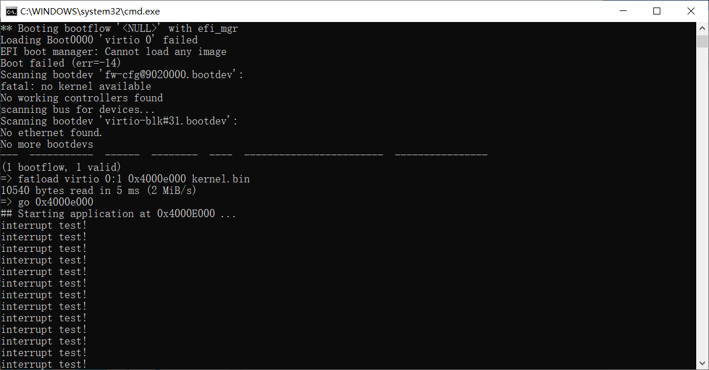
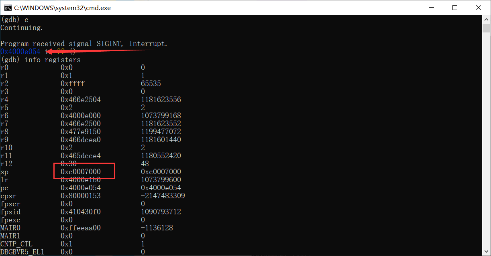

# （二十七）IRQ中断配置

这部分算是开发到现在给我感觉最恶心的一部分了，浪费的时间最多。

倒是也不怪arm，主要是我自己英语不好，没办法直接看arm的文档，GPT 4o也是半真半假忽悠我，真心整麻了，还是要好好学英语，尽量看官方文档。

最需要感谢的项目是：

[NienfengYao/armv8-bare-metal (github.com)](https://github.com/NienfengYao/armv8-bare-metal)

这个项目终于让我搞清楚arm的GIC是怎么配置的。


## 1. 中断向量表

中断向量表，也叫异常向量表，在这里异常和中断是同一个词，都是exception。arm不用IDT，用中断向量表取代IDT的作用。

让GPT 4o解释一下：

ARM的中断向量表（Interrupt Vector Table）是一个数据结构，用于处理异常和中断。当处理器遇到异常或中断时，会跳转到中断向量表中指定的地址去执行相应的处理程序。

在ARM架构中，中断向量表通常位于内存的固定位置，具体位置取决于处理器模式和系统配置。中断向量表包含了一组地址，这些地址对应于不同类型的异常和中断。常见的异常和中断类型包括：

1. **复位（Reset）**：当系统复位时，处理器会跳转到复位向量地址执行初始化代码。
2. **未定义指令（Undefined Instruction）**：当处理器遇到未定义的指令时，会跳转到该向量地址。
3. **软件中断（Software Interrupt, SWI）**：由软件发出的中断，用于调用操作系统服务。
4. **预取指令中止（Prefetch Abort）**：当指令预取阶段出现异常时，会跳转到该向量地址。
5. **数据中止（Data Abort）**：当数据访问阶段出现异常时，会跳转到该向量地址。
6. **IRQ（普通中断请求，Interrupt Request）**：用于普通的硬件中断。
7. **FIQ（快速中断请求，Fast Interrupt Request）**：用于紧急的硬件中断，优先级比IRQ高。

通常，中断向量表的布局如下（假设在地址0x00000000）：

| 向量偏移量 | 异常类型     | 向量地址   |
| ---------- | ------------ | ---------- |
| 0x00       | 复位         | 0x00000000 |
| 0x04       | 未定义指令   | 0x00000004 |
| 0x08       | 软件中断     | 0x00000008 |
| 0x0C       | 预取指令中止 | 0x0000000C |
| 0x10       | 数据中止     | 0x00000010 |
| 0x14       | 保留         | 0x00000014 |
| 0x18       | IRQ          | 0x00000018 |
| 0x1C       | FIQ          | 0x0000001C |

每个向量地址存储的是一个跳转指令，用于跳转到相应的异常或中断处理程序。中断处理程序需要保存处理器状态、处理中断或异常，并恢复处理器状态以继续正常执行。

在实际应用中，中断向量表可能会被重定位到内存的其他位置，具体取决于系统设计和配置。


需要注意的是，arm v7开始，中断向量表可以放到内存其他地方了，VBAR寄存器存放的地址是当前中断向量表所在位置。

u-boot其实已经配置了一个完整的中断向量表。

```c
// 读取VBAR的结果：
//(gdb) info registers VBAR
//VBAR           0x4771d000          1198641152
//(gdb) x /64xw 0x4771d000
//0x4771d000:     0xea0000b8      0xe59ff014      0xe59ff014      0xe59ff014
//0x4771d010:     0xe59ff014      0xe59ff014      0xe59ff014      0xe59ff014
//0x4771d020:     0x4771d060      0x4771d0c0      0x4771d120      0x4771d180
//0x4771d030:     0x4771d1e0      0x4771d240      0x4771d2a0      0xdeadbeef
//0x4771d040:     0x465dce98      0xe320f000      0xe320f000      0xe320f000
//0x4771d050:     0xe320f000      0xe320f000      0xe320f000      0xe320f000
//0x4771d060:     0xe51fd028      0xe58de000      0xe14fe000      0xe58de004
//0x4771d070:     0xe3a0d013      0xe169f00d      0xe1a0e00f      0xe1b0f00e
//0x4771d080:     0xe24dd048      0xe88d1fff      0xe51f2050      0xe892000c
//0x4771d090:     0xe28d0048      0xe28d5034      0xe1a0100e      0xe885000f
//0x4771d0a0:     0xe1a0000d      0xeb000906      0xe320f000      0xe320f000
//0x4771d0b0:     0xe320f000      0xe320f000      0xe320f000      0xe320f000
//0x4771d0c0:     0xe24dd004      0xe58d0000      0xe51f0090      0xe580e000
//0x4771d0d0:     0xe14fe000      0xe580e004      0xe590e000      0xe59d0000
//0x4771d0e0:     0xe28dd004      0xe24dd048      0xe88d1fff      0xe51f20b4
//0x4771d0f0:     0xe892000c      0xe28d0048      0xe28d5034      0xe1a0100e

```

这是我用GDB打的结果。

```c
//0x4771d000:     0xea0000b8      0xe59ff014      0xe59ff014      0xe59ff014
//0x4771d010:     0xe59ff014      0xe59ff014      0xe59ff014      0xe59ff014
```

这部分就是所谓的中断向量表，就八个元素。

0xe59ff014，翻译成汇编指令是 LDR PC, [PC, #0x14]，也就是加载pc寄存器向高地址偏移0x14（20个字节）处的值。

配置中断向量表的经过我就直接上代码了，注释很详细。

kernel_interrupt.h中添加：

```c
// 这个函数主要工作类似于init_idt
// 修改中断向量表中的IRQ处理函数，初始化GIC
void init_interrupt();
```

kernel_interrupt.c

```c
// 新的的irq处理函数
extern void irq_handler(void);

// 这个函数主要工作类似于init_idt
// 修改中断向量表中的IRQ处理函数，初始化GIC
void init_interrupt() {
    // 由于我自己懒，加上不太清楚中断向量表的玩法，所以只能在u-boot的中断向量表基础上修改
    // 先读取寄存器，确定基址
    uint32_t vbar;
    asm volatile("mrc p15, 0, %0, c12, c0, 0" : "=r" (vbar));

    // 在分页中，内存部分已经全部一对一映射完毕，可以直接原地址访问
    uint32_t *vector_table = (uint32_t *)vbar;
    // 0xe320f000是NOP
    // 从上面打出来的内存数据可以看到，0x44处是一个NOP，可以替换为我们的IRQ中断处理函数地址
    // 数一下就知道下标是17，计算的话可以0x44 / sizeof(uint32_t)（下标从0起算）
    vector_table[17] = (uint32_t)irq_handler;

    // 然后修改IRQ向量的值，也就是vector_table[6]处
    // 该处原值为：0xe59ff014，翻译成汇编指令是 LDR PC, [PC, #0x14]，也就是加载pc寄存器向高地址偏移0x14（20个字节）处的值
    // 执行指令的时候，arm的CPU会指令预取（arm官方资料说预读取后面两条），pc已经 +8 了，需要注意，所以是从当前位置往后偏移 28个 字节
    // 以最前面的未定义中断（忽略复位，那个不关后面的事）为例，指令位置是0x4，那么0xe59ff014就会直接往后偏移28个字节，直接偏移到0x20处
    // 如果要从IRQ向量到0x44处，那就是(17 - 6) * 4 - 8 = 36（十六进制为0x24）
    vector_table[6] = 0xe59ff024; // LDR PC, [PC, #0x24]

}

```


## 2. 配置GIC

在x86上用的是PIC，这东西只支持15个中断，配置也比较简单。ARM的GIC直接内置在CPU里面了，这个配置比较麻烦。

用u-boot打印设备树。

```bash
=> bdinfo
boot_params = 0x00000000
DRAM bank   = 0x00000000
-> start    = 0x40000000
-> size     = 0x08000000
flashstart  = 0x00000000
flashsize   = 0x04000000
flashoffset = 0x000dbb8c
baudrate    = 115200 bps
relocaddr   = 0x4771d000
reloc off   = 0x4771d000
Build       = 32-bit
current eth = unknown
eth-1addr   = (not set)
IP addr     = <NULL>
fdt_blob    = 0x465dcea0
new_fdt     = 0x465dcea0
fdt_size    = 0x00100000
lmb_dump_all:
 memory.cnt = 0x1 / max = 0x10
 memory[0]      [0x40000000-0x47ffffff], 0x08000000 bytes flags: 0
 reserved.cnt = 0x1 / max = 0x10
 reserved[0]    [0x455af000-0x47ffffff], 0x02a51000 bytes flags: 0
devicetree  = board
arch_number = 0x00000000
TLB addr    = 0x47ff0000
irq_sp      = 0x465dce90
sp start    = 0x465dce80
Early malloc usage: 2c0 / 2000
```

设备树地址为：

```bash
fdt_blob    = 0x465dcea0
```

输入命令定位设备树，然后打印：

```c
=> fdt addr 0x465dcea0
Working FDT set to 465dcea0
=> fdt print
```

打印结果（太长了，只取了GIC的部分）：

```c
intc@8000000 {
                phandle = <0x00008002>;
                reg = <0x00000000 0x08000000 0x00000000 0x00010000 0x00000000 0x08010000 0x00000000 0x00010000>;
                compatible = "arm,cortex-a15-gic";
                ranges;
                #size-cells = <0x00000002>;
                #address-cells = <0x00000002>;
                interrupt-controller;
                #interrupt-cells = <0x00000003>;
                v2m@8020000 {
                        phandle = <0x00008003>;
                        reg = <0x00000000 0x08020000 0x00000000 0x00001000>;
                        msi-controller;
                        compatible = "arm,gic-v2m-frame";
                };
        };
```

GIC用的是物理地址映射。

kernel_interrupt.c，以下是需要用到的GIC的映射地址。

```c
// ARM用的是GIC（通用中断控制器）

// GIC Distributor（分发器）的基址（看设备树能看到）
// GIC Distributor 是一个负责管理和分配中断的模块。它将中断分发到对应的CPU接口
#define GIC_DIST_BASE 0x08000000

// GIC CPU Interface（CPU接口）的基址（看设备树能看到）
// GIC CPU Interface 是一个处理和响应分配到该CPU的中断的模块
#define GIC_CPU_BASE  0x08010000

// GICD_CTLR：GIC分发器控制寄存器
// 这个寄存器用于启用或禁用GIC分发器。写入1启用GIC分发器，写入0禁用它。
#define GICD_CTLR      (*(volatile uint32_t *)(GIC_DIST_BASE + 0x000))

// GICD_ISENABLER：中断启用寄存器
// 这个寄存器用于启用特定的中断源。每个比特位对应一个中断源，写入1启用相应中断。
#define GICD_ISENABLER ((volatile uint32_t *)(GIC_DIST_BASE + 0x100))

// GICD_ICENABLER：中断禁用用寄存器
// 这个寄存器用于禁用特定的中断源。每个比特位对应一个中断源，写入1禁用相应中断。
#define GICD_ICENABLER ((volatile uint32_t *)(GIC_DIST_BASE + 0x180))

// GICD_IPRIORITYR：中断优先级寄存器
// 这个寄存器用于指定中断的优先级。每个字节对应一个中断源。这个和PMR配套，最低0x0，最高0xff。
#define GICD_IPRIORITYR ((volatile uint8_t *)(GIC_DIST_BASE + 0x400))

// GICD_ITARGETSR：中断目标CPU寄存器
// 这个寄存器用于指定中断的目标CPU。每个中断源有一个目标CPU寄存器，用于确定哪个CPU将处理该中断。
#define GICD_ITARGETSR ((volatile uint8_t *)(GIC_DIST_BASE + 0x800))

// GICD_ICFGR：中断触发方式寄存器
// 这个寄存器用于指定中断触发方式，每个比特位表示一种中断的触发方式，0为电平触发（Level Triggered，保持一定的电平值期间触发），1为边缘触发（Edge Triggered，电平变化触发）。
#define GICD_ICFGR ((volatile uint8_t *)(GIC_DIST_BASE + 0xc00))

// GICC_CTLR：GIC CPU接口控制寄存器
// 这个寄存器用于启用或禁用GIC CPU接口。写入1启用GIC CPU接口，写入0禁用它。
#define GICC_CTLR      (*(volatile uint32_t *)(GIC_CPU_BASE + 0x000))

// GICC_PMR：优先级屏蔽寄存器
// 这个寄存器用于设置中断的优先级屏蔽值。只有优先级数值低于该值的中断才会被处理。优先级数值最高为0xff，最低为0，优先级值高的，优先权低，后被处理。
#define GICC_PMR       (*(volatile uint32_t *)(GIC_CPU_BASE + 0x004))

// GICC_BRP：二进制点寄存器
// 这个寄存器用于设置中断优先级的分辨率。确定优先级中的组优先级和子优先级，设置为0可以直接将指定全部是组优先级（只有一组了）
#define GICC_BRP       (*(volatile uint32_t *)(GIC_CPU_BASE + 0x008))

// GICC_IAR：中断确认寄存器
// 这个寄存器用于读取当前待处理的中断ID。当一个中断发生时，CPU通过读取这个寄存器来获取中断ID。
#define GICC_IAR       (*(volatile uint32_t *)(GIC_CPU_BASE + 0x00C))

// GICC_EOIR：中断结束寄存器
// 这个寄存器用于通知GIC中断处理已经完成。写入中断ID表示中断处理结束。
#define GICC_EOIR      (*(volatile uint32_t *)(GIC_CPU_BASE + 0x010))

```

如果要全面了解GIC，文档如下：

[Arm Generic Interrupt Controller (GIC) Architecture Specification](https://developer.arm.com/documentation/ihi0069/hb?lang=en)

也可以直接看CPU的手册，里面也有相关内容。

[Cortex-A15 MPCore Processor Technical Reference Manual r4p0 (arm.com)](https://developer.arm.com/documentation/ddi0438/i?lang=en)

千万不要直接问GPT，它给的答案真的让人发疯。

配置过程如下：

kernel_interrupt.c

```c
// 这个函数主要工作类似于init_idt
// 修改中断向量表中的IRQ处理函数，初始化GIC
void init_interrupt() {
    // 省略配置中断向量表的内容

    // 启用GIC分配器
    GICD_CTLR = 1;
    // 启用GIC CPU接口
    GICC_CTLR = 1;
    // 设置 GICC_PMR 寄存器为0xff，表示允许所有优先级的中断
    GICC_PMR = 0xff;
    // 所有中断都在一个组中
    GICC_BRP = 0;

    // 设置所有中断优先级
    // 理论上比较重要的要优先，设置更小
    // 普通外设要设置更大
    // 简化这种情况，0x20以下全部是0（默认值），以上全部是0xff
    for(uint32_t i = 0x20; i < 1020; i++) {
        GICD_IPRIORITYR[i] = 0xff;
    }

    // 设置目标CPU，单核系统只有CPU0
    // 所有中断目标CPU都是CPU0
    // 每一个字节代表一个中断寄存器
    for(uint32_t i = 0; i < 1020; i++) {
        // 0x01代表中断指向CPU0
        GICD_ITARGETSR[i] = 0x01;
    }
    // 所有中断触发方式默认都是水平触发（键盘鼠标这些常见外设很多都是边缘触发，后续可能需要重新配置）

}

```

增加两个函数：

kernel_interrupt.h

```c
// 启用GIC指定的中断
void enable_gic_irq_interrupt(uint8_t irq);
// 禁用GIC指定的中断
void disable_gic_irq_interrupt(uint8_t irq);
```

kernel_interrupt.c

```c
// 禁用GIC指定的中断
void disable_gic_irq_interrupt(uint8_t irq) {
    uint32_t reg_index = irq / 32;
    uint32_t bit_offset = irq % 32;

    // GICD_ICENABLER: 中断禁用寄存器（写1禁用）
    volatile uint32_t *GICD_ICENABLER_REG = GICD_ICENABLER + reg_index;
    // GICD_ISENABLER: 中断启用寄存器
    volatile uint32_t *GICD_ISENABLER_REG = GICD_ISENABLER + reg_index;

    // 写1到对应位禁用中断（用位或防止干扰其他）
    *GICD_ICENABLER_REG |= (1 << bit_offset);

    // 确保启用寄存器中该位被清除（读取-修改-写入）
    uint32_t enable_reg_value = *GICD_ISENABLER_REG;
    enable_reg_value &= ~(1 << bit_offset);
    *GICD_ISENABLER_REG = enable_reg_value;
}

// 启用GIC指定的中断
void enable_gic_irq_interrupt(uint8_t irq) {
    uint32_t reg_index = irq / 32;
    uint32_t bit_offset = irq % 32;

    // GICD_ISENABLER: 中断启用寄存器（写1启用）
    volatile uint32_t *GICD_ISENABLER_REG = GICD_ISENABLER + reg_index;
    // GICD_ICENABLER: 中断禁用寄存器
    volatile uint32_t *GICD_ICENABLER_REG = GICD_ICENABLER + reg_index;

    // 写1到对应位启用中断（用位或防止干扰其他）
    *GICD_ISENABLER_REG |= (1 << bit_offset);

    // 确保禁用寄存器中该位被清除（读取-修改-写入）
    uint32_t disable_reg_value = *GICD_ICENABLER_REG;
    disable_reg_value &= ~(1 << bit_offset);
    *GICD_ICENABLER_REG = disable_reg_value;
}

```


## 3. 中断处理函数和中断分发器

irq_handler.asm

```assembly
.section .text
.global irq_handler
.extern irq_interrupt_dispatcher

// 关于arm的模式
// 0b10000 或 0x10：用户模式（User Mode）
// 0b10001 或 0x11：快速中断模式（FIQ Mode）
// 0b10010 或 0x12：中断模式（IRQ Mode）
// 0b10011 或 0x13：管理模式（Supervisor Mode）
// 0b10111 或 0x17：中止模式（Abort Mode）
// 0b11011 或 0x1B：未定义模式（Undefined Mode）
// 0b11111 或 0x1F：系统模式（System Mode，ARMv4以上）

irq_handler:
    // 进入的时候已经为IRQ模式
    // 进入该模式的时候，自动保存中断前cpsr到spsr寄存器（准确来说是spsr_irq，这是irq模式下才能读写的）
    // 此时lr是中断前pc + 4（下一条指令地址，CPU自动保存）
    cpsid i                 // 禁用IRQ中断
    // irq模式有irq模式自己的栈（u-boot设置过了，栈底直接在0xffffffff处）
    // 如果图方便的话就在此时进入管理模式，这样就可以用管理模式下的栈了
    // 一般来说还是推荐分离，分离的话在初始化的时候使用
    // 如果用管理模式栈的话，在这里切换管理模式即可
    // 但是那样就没法获取spsr中的值了

    push    {r0-r12, lr}    // 由于我担心可能用到的寄存器多，所以我保存了所有的通用寄存器以及lr（不然无法返回）

    mrs     r0, spsr        // 保存中断前的cpsr
    push    {r0}

    cps     #0x13           // 不管什么模式，都要切换到管理模式以处理中断（切换到内核态）

    // C语言是压栈传参的，但是这里没参数
    bl irq_interrupt_dispatcher // 调用IRQ中断分发器，bl指令会自动保存lr，能回得来

    cps     #0x12           // 切换回IRQ模式，要不然就无法获取这些值了

    pop     {r0}            // 恢复cpsr的时候也恢复了原来的模式
    msr     spsr_cxsf, r0

    // _cxsf后缀意义如下：
    // c（Condition flags）：
    // 条件标志，包括N（负）、Z（零）、C（进位/溢出）和V（溢出）。
    // 这些标志位用于条件执行指令的判断，例如比较和分支。
    // x（Extension flags）：
    // 扩展标志，包含J（Jazelle状态）和GE[3:0]（Greater than or Equal flags）。
    // 这些标志位在一些特定的处理器模式和扩展中使用，例如Jazelle模式和高级SIMD（NEON）操作。
    // s（State flags）：
    // 状态标志，包括T（Thumb状态）、E（字节序）和IT[7:0]（If-Then状态）。
    // 这些标志位用于指示处理器当前的执行状态，如是Thumb指令集还是ARM指令集，或者当前的字节序设置。
    // f（Flags field）：
    // 标志字段，包括中断屏蔽标志I（IRQ禁用）、F（FIQ禁用）和A（异步中止禁用）。
    // 这些标志位用于控制中断的使能和屏蔽状态。
    // 加上这个标志表示全部修改，不加的话等效于spsr_c，只能修改条件标志

    pop     {r0-r12, lr}    // 恢复保存的寄存器
    cpsie i                 // 启用IRQ中断
    subs    pc, lr, #4      // 返回中断前的位置（CPU会自动恢复spsr_irq到cpsr）

```

中断分发器实现起来就比x86简单多了。

kernel_interrupt.c

```c
// 真正的中断处理逻辑数组（用于分发）
// GICv2架构中，中断ID范围从0到1019，其中ID 0-31为SGI（软件生成中断）和PPI（私有外围设备中断），ID 32-1019为SPI（共享外围设备中断）
// GICv3最多支持多达1020个外部中断（SPI）和多达960个LPI（本地性可编程中断），具体取决于实现
void (*interrupt_handler_functions[1020])(void) = { NULL };


// 统一IRQ中断处理分发器
void irq_interrupt_dispatcher(){
    // 读取中断确认寄存器，知道当前中断号是哪个
    uint32_t interrupt_id = GICC_IAR;

    if (interrupt_id < 1020 && interrupt_handler_functions[interrupt_id]) {
        // 如果中断处理逻辑存在，就执行
        interrupt_handler_functions[interrupt_id]();
    }
    // 通知GIC，中断已经执行完毕
    GICC_EOIR = interrupt_id;
}

```

添加两个函数：

kernel_interrrupt.h

```c
// 添加中断处理函数，参数为中断号，中断处理函数，中断触发方式(0为电平触发，1为边缘触发)
bool add_interrupt_handler(uint32_t interrupt_id, void (*handler)(void), uint8_t trigger_mode);
// 删除中断处理函数，参数为中断号
bool remove_interrupt_handler(uint32_t interrupt_id);
```

kernel_interrrupt.c

```c
// 添加中断处理函数，参数为中断号，中断处理函数，中断触发方式
bool add_interrupt_handler(uint32_t interrupt_id, void (*handler)(void), uint8_t trigger_mode) {
    if(interrupt_id > 1019 || handler == NULL || trigger_mode > 1) {
        return false;
    }
    if(interrupt_handler_functions[interrupt_id] != NULL) {
        // 该位置已有处理函数，不得再添加
        return false;
    }
    interrupt_handler_functions[interrupt_id] = handler;
    // 然后修改触发方式
    // 找相应的位
    uint32_t reg_idx = interrupt_id / 8;
    uint32_t bit_idx = interrupt_id % 8;

    if(trigger_mode) {
        // 已经排除了大于1的问题，所以这里trigger_mode肯定是1
        // 修改该位为1，用位或
        GICD_ICFGR[reg_idx] |= (1 << bit_idx);
    } else {
        // 已经排除了大于1的问题，所以这里trigger_mode肯定是0
        // 修改该位为0，按位取反然后位与即可
        GICD_ICFGR[reg_idx] &= (~(1 << bit_idx));
    }
    return true;
}

// 删除中断处理函数，参数为中断号
bool remove_interrupt_handler(uint32_t interrupt_id) {
    if(interrupt_id > 1019) {
        return false;
    }
    interrupt_handler_functions[interrupt_id] = NULL;
    return (bool)(interrupt_handler_functions[interrupt_id] == NULL);
}

```


## 4. 实现定时器中断

arm的不少CPU都自带定时器，我的QEMU virt虚拟机是基于Cortex-A15的，这个CPU每个核心都有一个定时器，都可以打中断。

kernel.c

```c
//
// Created by huangcheng on 2024/6/24.
//

#include "../lib/lib_kernel/lib_kernel.h"
#include "../kernel/kernel_page/kernel_page.h"
#include "../kernel/kernel_task/kernel_task.h"
#include "../kernel/kernel_interrupt/kernel_interrupt.h"

// 关于定时器：
// https://developer.arm.com/documentation/ddi0438/i/generic-timer/generic-timer-programmers-model?lang=en
// https://developer.arm.com/documentation/ddi0406/cd/?lang=en

void set_cntfrq(uint32_t value);
void set_cntp_tval(uint32_t value);
void enable_cntp_timer();
void disable_cntp_timer();
uint32_t read_cntpct();

// 用于测试通用中断控制器GIC和中断处理函数是否正常使用
void test();

void kernel_main(void) {
    // u-boot已经给我们设置了管理模式
    // 一进来就已经是管理模式了

    // 页表初始化
    init_paging();

    // 因为覆盖了整个内存区域，所以还可以用u-boot的栈
    // 到这里再切换也没问题

    // 切换栈指针到虚拟地址，这样就可以顺利使用内核栈了
    switch_sp(0xc0007000);
    // 初始化task
    init_multitasking();
    // 初始化内存管理（本来这里应该从环境里面获取内存大小，我懒，直接写死了算了）
    init_memory(0x8000000);
    // 初始化中断管理和GIC
    init_interrupt();

    // 关于定时器的设备树片段：
    // timer {
    //         interrupts = <0x00000001 0x0000000d 0x00000104 0x00000001 0x0000000e 0x00000104 0x00000001 0x0000000b 0x00000104 0x00000001 0x0000000a 0x00000104>;
    //         always-on;
    //         compatible = "arm,armv7-timer";
    // };

    // 解读如下：
    // 这个timer节点定义了4个中断。
    // 每个中断的格式是 <type number> <interrupt number> <flags>，每个中断由3个值组成：
    // 0x00000001 0x0000000d 0x00000104
    // 0x00000001 0x0000000e 0x00000104
    // 0x00000001 0x0000000b 0x00000104
    // 0x00000001 0x0000000a 0x00000104
    // 每个中断的中断号如下：
    // 第一个中断：0x0000000d
    // 第二个中断：0x0000000e
    // 第三个中断：0x0000000b
    // 第四个中断：0x0000000a

    // 总结：
    // 该timer节点定义了4个中断。
    // 中断号分别是0x0d, 0x0e, 0x0b, 和0x0a。
    // 中断标志0x00000104表示这些中断是上升沿触发的。

    // 上升沿触发是一种边缘触发，所以要额外重新配置
    // 但是我试过，这些都没法用
    // 定时器中断id就是30，还是水平触发的

    add_interrupt_handler(30, test, 0);
    enable_gic_irq_interrupt(30);


    // 使用的是硬件定时器
    // 设置计数器，单位是Hz（赫兹，每秒钟计时多少次）
    // 一般都是设置为 1MHz（一百万赫兹）
    set_cntfrq(1000000);
    // 计时器的值，每次操作就-1，减到0就打一次中断
    // 理论上set_cntp_tval(1000000)设置应该是1s，在qemu上实测快得多，差不多是100毫秒
    // 之前x86设置是一秒一百次，在这里设置成500000就行了，没必要那么快
    set_cntp_tval(500000);
    // 启用定时器
    enable_cntp_timer();

    // 开启IRQ中断
    intr_enable();

    for(;;);
}

// 定义寄存器访问宏
#define CP15_WRITE_REG32(reg, val) \
    __asm__ __volatile__("mcr p15, 0, %0, " reg : : "r"(val))

#define CP15_READ_REG32(reg, val) \
    __asm__ __volatile__("mrc p15, 0, %0, " reg : "=r"(val))

// CP15 寄存器定义
#define CNTFRQ     "c14, c0, 0"  // Counter Frequency Register
#define CNTP_TVAL  "c14, c2, 0"  // Physical Timer Value Register
#define CNTP_CTL   "c14, c2, 1"  // Physical Timer Control Register
#define CNTP_CVAL  "c14, c2, 2"  // Physical Timer Compare Value Register
#define CNTPCT     "c14, c0, 1"  // Physical Count Register

void set_cntfrq(uint32_t value) {
    CP15_WRITE_REG32(CNTFRQ, value);
}

void set_cntp_tval(uint32_t value) {
    CP15_WRITE_REG32(CNTP_TVAL, value);
}

void enable_cntp_timer() {
    uint32_t value;
    CP15_READ_REG32(CNTP_CTL, value);
    value |= 1;  // Set the enable bit
    CP15_WRITE_REG32(CNTP_CTL, value);
}

void disable_cntp_timer() {
    uint32_t value;
    CP15_READ_REG32(CNTP_CTL, value);
    value &= ~1;  // Clear the enable bit
    CP15_WRITE_REG32(CNTP_CTL, value);
}

uint32_t read_cntpct() {
    uint32_t value;
    CP15_READ_REG32(CNTPCT, value);
    return value;
}

// 用于测试通用中断控制器GIC和中断处理函数是否正常使用
void test() {

    // 逻辑代码
    put_str("interrupt test!\n");

    // 停用定时器
    disable_cntp_timer();
    // 设置计时器初始值
    set_cntp_tval(500000);
    // 启用定时器以生成下一次中断
    enable_cntp_timer();
}

```

注释中提到的两个网页：

[Cortex-A15 MPCore Processor Technical Reference Manual r4p0 (arm.com)](https://developer.arm.com/documentation/ddi0438/i/generic-timer/generic-timer-programmers-model?lang=en)

[Documentation – Arm Developer](https://developer.arm.com/documentation/ddi0406/cd/?lang=en)


这个硬件定时器比起x86上的稍微麻烦一些，但是也不算麻烦太多。

尝试运行，效果如下：





能连续输出，能回到内核主循环，可以移植后续的任务管理功能了。