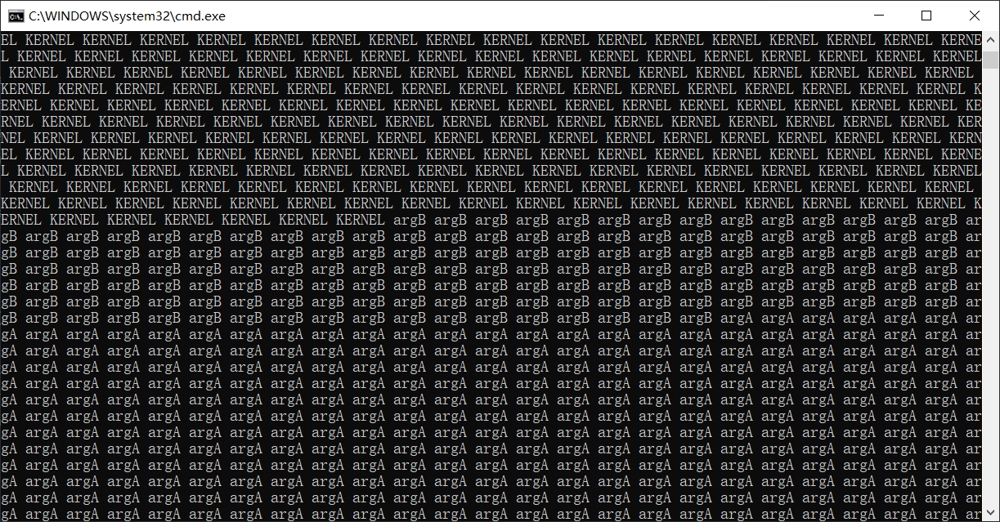
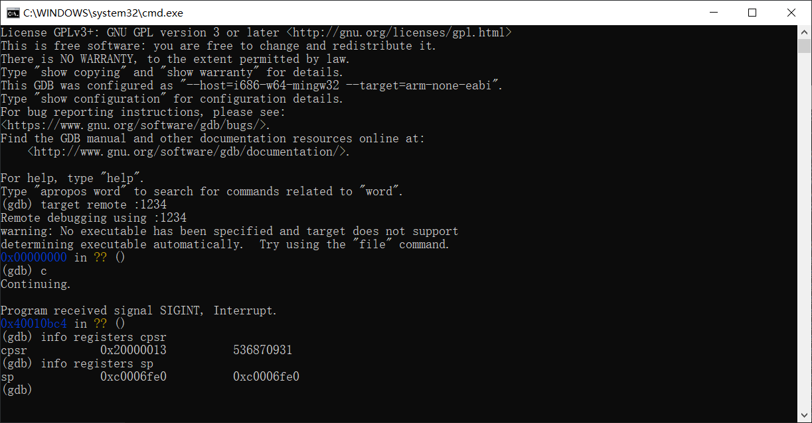

# （二十八）移植x86多任务


主要是怪自己比较懒，不肯学，只想着复用x86实现的逻辑，所以搞了很多弯弯绕，浪费了不少精力，还是要多学新路子，不要老是想着曲线救国。

## 1. 补充的函数和声明

kernel_task.h，补充arm下的任务信息栈结构和函数声明

```c
// 任务信息栈，用于保存一个任务切换时候的状态
struct task_info_stack {
    // 上次执行到的任务所有状态（返回地址，任务条件状态）
    uint32_t lr;     // 用于保存切换时的LR寄存器值
    uint32_t cpsr;   // 用于保存切换时的CPSR寄存器值

    // 首次上cpu的时候需要设置，因为arm的C调用约定前四个参数是寄存器传参
    // 使用函数包装器要使用前两个寄存器也就是r0和r1
    // 这两个要分别恢复到对应的寄存器才能传参成功，后续就不用管了（会自动保存）
    uint32_t r0;     // 用于保存切换时的R0寄存器值
    uint32_t r1;     // 用于保存切换时的R1寄存器值

    // 其他通用寄存器的值（按照压栈弹栈顺序）
    uint32_t r2;     // 用于保存切换时的R2寄存器值
    uint32_t r3;     // 用于保存切换时的R3寄存器值
    uint32_t r4;     // 用于保存切换时的R4寄存器值
    uint32_t r5;     // 用于保存切换时的R5寄存器值
    uint32_t r6;     // 用于保存切换时的R6寄存器值
    uint32_t r7;     // 用于保存切换时的R7寄存器值
    uint32_t r8;     // 用于保存切换时的R8寄存器值
    uint32_t r9;     // 用于保存切换时的R9寄存器值
    uint32_t r10;    // 用于保存切换时的R10寄存器值
    uint32_t r11;    // 用于保存切换时的R11寄存器值
    uint32_t r12;    // 用于保存切换时的R12寄存器值
};

// 创建任务，自动将其加入任务队列中，等待随时被调度（名字是全局唯一标识符，不得冲突）
struct task *task_create(char *name, int priority, task_function function, void* func_arg);
// 取消任务，将任务从链表中删除
void task_cancel(struct task *task);
// 任务调度器
void task_schedule(void);
// 阻塞当前调用的任务，并修改任务为指定状态（如果想不调度，就挂起、阻塞、等待）
void task_block(enum task_status stat);
// 将该任务状态修改为TASK_READY，并插入到调度队列最前，即解除阻塞并使其尽快进入工作状态
void task_unblock(struct task *task);
// 让出CPU时间，但不阻塞
void task_yield(void);
```

中断栈呢？中断栈是用来跳入用户态进程用的，现在不需要。

kernel_task.c

```c
// 函数包装器
void func_wrapper(task_function* func, void* arg) {
    func(arg);
}

// 创建任务
struct task* task_create(char* name, int priority, task_function function, void* func_arg) {
    struct task* new_task = (struct task*)malloc_page(KERNEL_FLAG, 1);
    if (new_task == NULL) {
        return NULL;  // 内存分配失败
    }
    // 清空整页，这样后面就不用清理了
    memset(new_task, 0, PG_SIZE);
    strcpy(new_task->name, name);
    new_task->priority = priority;
    new_task->status = TASK_READY;
    new_task->ticks = priority;
    new_task->elapsed_ticks = 0;
    new_task->stack_magic = 0x20000702;

    // 栈是从高地址往低地址发展的
    // 所以最开始的栈顶设置在栈底
    new_task->self_stack = ((uint8_t*)new_task + PG_SIZE);
    // 中断栈是用来跳入用户态用的，离得还远，先放一边去，说不定也不用

    // 预留任务信息栈位置
    new_task->self_stack -= sizeof(struct task_info_stack);

    // 内核线程默认为和内核用同样的资源（如果要创建为用户进程分配新的资源，再自己修改）
    new_task->pgdir = KERNEL_TCB->pgdir;
    // 位图也复制内核的位图（结构体等于运算直接浅拷贝）
    new_task->process_virtual_address = KERNEL_TCB->process_virtual_address;

    // 这些说白了是任务第一次上CPU运行的时候需要设置的，后面就会自动保存新的
    // 寄存器传参，所以要设置r0和r1（函数包装器的参数），其他寄存器都是0即可
    ((struct task_info_stack*)new_task->self_stack)->r0 = (uint32_t)function;
    ((struct task_info_stack*)new_task->self_stack)->r1 = (uint32_t)func_arg;
    // 任务的返回地址就是自己（因为切换命令是subs    pc, lr, #4，为了保险可以加上4，反正只用一次，第二次就是自动保存的了）
    ((struct task_info_stack*)new_task->self_stack)->lr = (uint32_t)(&func_wrapper) + 4;
    // cpsr指定为管理模式（内核态）
    ((struct task_info_stack*)new_task->self_stack)->cpsr = 0x13;

    // 将任务加入调度队列和所有队列
    list_add(&new_task->general_tag, &ready_list);
    list_add(&new_task->all_task_tag, &all_task_list);

    return new_task;
}

// 取消任务（线程不回收资源，页表和位图进程自己回收）
void task_cancel(struct task* task) {
    if(task == NULL) {
        return;
    }
    if(task == current_task) {
        // 这里要等任务完成才能删除
        // 标记其等待删除，让任务调度器删掉
        task->status = TASK_DIED;
        // current_task本来就不应该在ready_list里面
        // 但是怕了，还是先删一遍
        list_del(&task->general_tag);
        // 加入到死亡队列
        list_add_tail(&task->general_tag, &died_list);
        return;
    }
    if(task == KERNEL_TCB) {
        // 内核任务不得删除
        return;
    }
    // 关闭中断防止切换
    enum intr_status old_status = intr_disable();
    if(next_task == task) {
        // 碰上这种情况，直接切成current
        next_task = current_task;
    }
    list_del(&task->general_tag);
    list_del(&task->all_task_tag);
    free_page(task, 1);
    // 恢复先前状态
    intr_set_status(old_status);
}

void task_schedule(void) {
    // 检查栈溢出
    if (current_task->stack_magic != 0x20000702) {
        // 处理栈溢出错误
        for(;;);
    }

    // 清理死亡队列里的任务
    struct list_node *pos;
    struct task* tmp_task;
    list_for_each(pos, &died_list) {
        tmp_task = list_entry(pos, struct task, general_tag);
        list_del(&tmp_task->general_tag);
        list_del(&tmp_task->all_task_tag);
        // 释放TCB
        free_page(tmp_task, 1);
    }

    if (current_task->status == TASK_RUNNING) { // 若此线程只是cpu时间片到了,将其加入到就绪队列尾
        if(list_empty(&ready_list)) {
            // 只有一个线程的特殊情况处理，只重置时间，减少开销
            // 重新将当前线程的ticks再重置为其priority;
            current_task->ticks = current_task->priority;
            // 其他的什么都不要变，直接return
            return;
        }
        list_add_tail(&current_task->general_tag, &ready_list);
        current_task->ticks = current_task->priority;     // 重新将当前线程的ticks再重置为其priority;
        current_task->status = TASK_READY;
    } else {
        // 我怕你没删除，所以我无论如何都要删除一遍
        // 总之你不是task_running，你就是其他的，那不准进入ready_list
        // 所以保证不得留在ready_list里面
        list_del(&current_task->general_tag);
    }

    if(list_empty(&ready_list)) {
        // 没任务，继续运行，不要切换
        return;
    } else {
        // 取第一个结点
        next_task = list_entry(ready_list.next, struct task, general_tag);
        next_task->status = TASK_RUNNING;

        // 因为切换之后会直接跳出中断处理程序，所以绝不能在这里切换，必须要在中断切换
    }
}

// 任务切换，在IRQ0中断处理函数末尾调用
void task_switch(void){
    if ( current_task == next_task ) {
        // 无需切换，直接返回，不要浪费资源
        return;
    }
    // 从ready链表中删除结点
    list_del(&next_task->general_tag);
    // 如果不切换就跳不出来了，所以用一个临时变量来中继
    struct task *cur_task = current_task;
    current_task = next_task;

    // 还没移植进程，切换页表的事情先放一边

    // 真正切换任务了，进去就暂时出不来了
    switch_to(cur_task, next_task);
}

// 阻塞当前调用的任务，并修改任务为指定状态（如果想不调度，就挂起、阻塞、等待）
void task_block(enum task_status stat) {
    // 关闭中断，保存先前状态
    enum intr_status old_status = intr_disable();
    // 获取现在正在进行的任务（可能更新不及时，注意）
    struct task *cur_task = current_task;
    // 修改状态
    cur_task->status = stat;
    // 调度新任务
    task_schedule();
    // 手动强行调度
    task_switch();
    // 任务阻塞解除才会调用这句重设状态语句
    intr_set_status(old_status);
}

void task_unblock(struct task *task) {
    // 惯例，关中断
    enum intr_status old_status = intr_disable();
    // 只要不是READY或者RUNNING（怕出意外），都重设为READY
    if (task->status != TASK_READY && task->status != TASK_RUNNING) {
        // 检查是否已经在ready_list中
        struct list_node *pos;
        list_for_each(pos, &ready_list) {
            if (pos == &task->general_tag) {
                put_str("Task already in ready_list\n");
                for(;;);
            }
        }

        // 我怕你没删除，所以我无论如何都要删除一遍
        list_del(&task->general_tag);
        // 插入任务到ready_list队头，尽快被调度
        list_add(&task->general_tag, &ready_list);
        task->status = TASK_READY;

    }
    // 操作完成重设状态（谁知道原来是不是也是关中断）
    intr_set_status(old_status);
}

// 让出CPU时间，但不阻塞
void task_yield() {
    // 关闭中断，防止任务切换过程中出现竞态条件
    enum intr_status old_status = intr_disable();

    // 当前任务重新加入到就绪队列的队尾
    if (current_task->status == TASK_RUNNING) {
        list_add_tail(&current_task->general_tag, &ready_list);
        current_task->status = TASK_READY;
    }

    // 调度下一个任务
    task_schedule();
    // 执行任务切换
    task_switch();
    // 恢复中断状态
    intr_set_status(old_status);
}

```

相应实现基本上照抄x86。

改动主要是两个地方。

```c
// 任务切换，在IRQ0中断处理函数末尾调用
void task_switch(void){
    if ( current_task == next_task ) {
        // 无需切换，直接返回，不要浪费资源
        return;
    }
    // 从ready链表中删除结点
    list_del(&next_task->general_tag);
    // 如果不切换就跳不出来了，所以用一个临时变量来中继
    struct task *cur_task = current_task;
    current_task = next_task;

    // 还没移植进程，切换页表的事情先放一边

    // 真正切换任务了，进去就暂时出不来了
    switch_to(cur_task, next_task);
}

```

把切换页表的逻辑删掉，还有TSS，arm没这东西，删掉。

```c
// 创建任务
struct task* task_create(char* name, int priority, task_function function, void* func_arg) {
    struct task* new_task = (struct task*)malloc_page(KERNEL_FLAG, 1);
    if (new_task == NULL) {
        return NULL;  // 内存分配失败
    }
    // 清空整页，这样后面就不用清理了
    memset(new_task, 0, PG_SIZE);
    strcpy(new_task->name, name);
    new_task->priority = priority;
    new_task->status = TASK_READY;
    new_task->ticks = priority;
    new_task->elapsed_ticks = 0;
    new_task->stack_magic = 0x20000702;

    // 栈是从高地址往低地址发展的
    // 所以最开始的栈顶设置在栈底
    new_task->self_stack = ((uint8_t*)new_task + PG_SIZE);
    // 中断栈是用来跳入用户态用的，离得还远，先放一边去，说不定也不用

    // 预留任务信息栈位置
    new_task->self_stack -= sizeof(struct task_info_stack);

    // 内核线程默认为和内核用同样的资源（如果要创建为用户进程分配新的资源，再自己修改）
    new_task->pgdir = KERNEL_TCB->pgdir;
    // 位图也复制内核的位图（结构体等于运算直接浅拷贝）
    new_task->process_virtual_address = KERNEL_TCB->process_virtual_address;

    // 这些说白了是任务第一次上CPU运行的时候需要设置的，后面就会自动保存新的
    // 寄存器传参，所以要设置r0和r1（函数包装器的参数），其他寄存器都是0即可
    ((struct task_info_stack*)new_task->self_stack)->r0 = (uint32_t)function;
    ((struct task_info_stack*)new_task->self_stack)->r1 = (uint32_t)func_arg;
    // 任务的返回地址就是自己（因为切换命令是subs    pc, lr, #4，为了保险可以加上4，反正只用一次，第二次就是自动保存的了）
    ((struct task_info_stack*)new_task->self_stack)->lr = (uint32_t)(&func_wrapper) + 4;
    // cpsr指定为管理模式（内核态）
    ((struct task_info_stack*)new_task->self_stack)->cpsr = 0x13;

    // 将任务加入调度队列和所有队列
    list_add(&new_task->general_tag, &ready_list);
    list_add(&new_task->all_task_tag, &all_task_list);

    return new_task;
}

```

第一次上CPU的时候执行的东西需要设置，因为arm的C语言调用约定是前4个参数用寄存器传参，所以函数包装器的参数就放在r0和r1。因此r0设置为function的地址，r1设置为参数地址。lr后面再说，cpsr因为一开始运行，肯定没什么状态，所以直接设置为管理模式（内核态）就行了，这样也不会屏蔽中断。


## 2. IRQ中断处理函数

IRQ中断处理函数改写如下：irq_handler.asm

```assembly
.section .text
.global irq_handler
.extern irq_interrupt_dispatcher
.extern task_switch

// 关于arm的模式
// 0b10000 或 0x10：用户模式（User Mode）
// 0b10001 或 0x11：快速中断模式（FIQ Mode）
// 0b10010 或 0x12：中断模式（IRQ Mode）
// 0b10011 或 0x13：管理模式（Supervisor Mode）
// 0b10111 或 0x17：中止模式（Abort Mode）
// 0b11011 或 0x1B：未定义模式（Undefined Mode）
// 0b11111 或 0x1F：系统模式（System Mode，ARMv4以上）

irq_handler:
    // 进入的时候已经为IRQ模式
    // 进入该模式的时候，自动保存中断前cpsr到spsr寄存器（准确来说是spsr_irq，这是irq模式下才能读写的）
    // 此时lr是中断前pc + 4（下一条指令地址，CPU自动保存）
    cpsid i                 // 禁用IRQ中断
    // irq模式有irq模式自己的栈（u-boot设置过了，栈底直接在0xffffffff处）

    // 从arm v6开始，arm提供了两条汇编指令，专门用于中断上下文保存
    // srsdb，直接把spsr和lr保存到指定位置，还可以切换到其他模式，一般是srsdb sp!, #0x13（保存到当前模式栈，然后切换到管理模式）
    // rfeia，从指定位置恢复spsr和lr，并且直接跳转回lr指向的指令，直接恢复中断处理前的模式，一般是rfeia sp!
    // srsdb压栈顺序是先spsr，后lr，rfeia弹栈顺序相反，这两个函数不需要寄存器中继

    // 统一IRQ栈地址，这样就不用考虑清理IRQ栈的问题了
    ldr     sp, =0x40008000

    // 直接保存所有通用寄存器到IRQ栈（中断发生时所有上下文都被保存了）
    push    {r0-r12}

    // IRQ模式的栈和管理模式的栈分离，完全没办法用x86下的做法了
    // 我又一时间发明不了新的做法
    // 只能尝试约定一个位置专门存放这两个元素，直接放在IRQ栈，位置固定，好解决

    // 从arm v2开始，arm支持stmdb和ldmia指令，这两个指令可以直接把寄存器列表保存到指定地方
    // push和pop相当于限定死了目的地是栈，这两个指令比较自由，但是这两个指令好像不能保存spsr
    // 为了可读性还是用push和pop吧，这两个一看就知道

    mrs     r0, spsr            // 保存中断前的cpsr
    push    {r0}                // 压栈保存spsr
    push    {lr}                // 压栈保存lr

    // IRQ模式也算是特权模式，可以视为内核态，反正也能处理就是了

    bl irq_interrupt_dispatcher // 调用IRQ中断分发器，bl指令会自动保存lr，能回得来

    // 尝试切换任务
    // 这时候尝试切换，如果回得来，不怕数据丢失
    // 如果回不来，重入中断的时候栈指针又是重设的，不怕栈没清空
    // 至于CPSR，状态问题更不用担心了，哪个进入中断之前都是允许中断的
    bl      task_switch

    pop     {lr}                // 恢复lr
    pop     {r0}                // 恢复spsr
    msr     spsr_cxsf, r0

    pop     {r0-r12}            // 恢复其他上下文


    cpsie i                     // 启用IRQ中断
    subs    pc, lr, #4          // 返回中断前的位置（CPU会自动恢复spsr_irq到cpsr）

```

该说的都在注释中了。


## 3. 任务切换函数switch_to

switch_to.asm

```assembly
.section .text
.global switch_to

// 按照arm上C的调用约定
// r0是cur_task
// r1是next_task

switch_to:
    // 先前是在irq模式中运行task_switch函数的
    // 由于每次进入irq模式都统一栈地址，所以也不需要清理了
    // 每个任务中断时的信息都必须保存在其内核栈中
    cps     #0x13               // 切换到管理模式，使用当前任务的内核栈

    // 之前IRQ栈中有任务发生时状态的相关信息，直接将其复制过来然后压栈到内核栈
    // 经过先前的执行，寄存器的值可能和任务中断时的不同了
    // 所以才要考虑从IRQ栈里面取，而不是直接push

    ldr     r4, =0x40007ffc     // r12寄存器
    ldr     r5, [r4]
    push    {r5}

    sub     r4, r4, #4          // r11寄存器
    ldr     r5, [r4]
    push    {r5}

    sub     r4, r4, #4          // r10寄存器
    ldr     r5, [r4]
    push    {r5}

    sub     r4, r4, #4          // r9寄存器
    ldr     r5, [r4]
    push    {r5}

    sub     r4, r4, #4          // r8寄存器
    ldr     r5, [r4]
    push    {r5}

    sub     r4, r4, #4          // r7寄存器
    ldr     r5, [r4]
    push    {r5}

    sub     r4, r4, #4          // r6寄存器
    ldr     r5, [r4]
    push    {r5}

    sub     r4, r4, #4          // r5寄存器
    ldr     r5, [r4]
    push    {r5}

    sub     r4, r4, #4          // r4寄存器
    ldr     r5, [r4]
    push    {r5}

    sub     r4, r4, #4          // r3寄存器
    ldr     r5, [r4]
    push    {r5}

    sub     r4, r4, #4          // r2寄存器
    ldr     r5, [r4]
    push    {r5}

    sub     r4, r4, #4          // r1寄存器
    ldr     r5, [r4]
    push    {r5}

    sub     r4, r4, #4          // r0寄存器
    ldr     r5, [r4]
    push    {r5}

    sub     r4, r4, #4          // cpsr寄存器
    ldr     r5, [r4]
    push    {r5}

    sub     r4, r4, #4          // lr寄存器
    ldr     r5, [r4]
    push    {r5}

    // 保存任务环境之后就该更新栈指针（task结构体的self_stack字段，栈顶指针）
    str sp, [r0]                // str是将数据存储到内存地址，mov是寄存器之间传递数据

// ------------------  以上是备份当前任务的环境，下面是恢复下一个任务的环境  ----------------

    ldr sp, [r1]                // ldr是将数据从内存地址加载到寄存器

    // 然后就是恢复数据了
    pop     {lr}                // 恢复lr
    pop     {r4}                // 把下一个任务的cpsr弹出到r4，然后恢复到cpsr
    msr     cpsr_cxsf, r4       // 恢复下一个任务的cpsr
    pop     {r0-r12}            // 恢复这13个寄存器

    subs    pc, lr, #4          // 返回中断前的位置（CPU会自动恢复spsr_irq到cpsr）

```

注释中已经解释得很清楚了。


## 4. 实现与测试

kernel.c

```c
//
// Created by huangcheng on 2024/6/24.
//

#include "../lib/lib_kernel/lib_kernel.h"
#include "../kernel/kernel_page/kernel_page.h"
#include "../kernel/kernel_task/kernel_task.h"
#include "../kernel/kernel_interrupt/kernel_interrupt.h"

// 关于定时器：
// https://developer.arm.com/documentation/ddi0438/i/generic-timer/generic-timer-programmers-model?lang=en
// https://developer.arm.com/documentation/ddi0406/cd/?lang=en

void set_cntfrq(uint32_t value);
void set_cntp_tval(uint32_t value);
void enable_cntp_timer();
void disable_cntp_timer();
uint32_t read_cntpct();

// 用于测试通用中断控制器GIC和中断处理函数是否正常使用
void test();

/* 两个都是在线程中运行的函数 */
void k_thread_a(void* arg);
void k_thread_b(void* arg);

void kernel_main(void) {
    // u-boot已经给我们设置了管理模式
    // 一进来就已经是管理模式了

    // 页表初始化
    init_paging();

    // 因为覆盖了整个内存区域，所以还可以用u-boot的栈
    // 到这里再切换也没问题

    // 切换栈指针到虚拟地址，这样就可以顺利使用内核栈了
    switch_sp(0xc0007000);
    // 初始化task
    init_multitasking();
    // 初始化内存管理（本来这里应该从环境里面获取内存大小，我懒，直接写死了算了）
    init_memory(0x8000000);
    // 初始化中断管理和GIC
    init_interrupt();

    // 关于定时器的设备树片段：
    // timer {
    //         interrupts = <0x00000001 0x0000000d 0x00000104 0x00000001 0x0000000e 0x00000104 0x00000001 0x0000000b 0x00000104 0x00000001 0x0000000a 0x00000104>;
    //         always-on;
    //         compatible = "arm,armv7-timer";
    // };

    // 解读如下：
    // 这个timer节点定义了4个中断。
    // 每个中断的格式是 <type number> <interrupt number> <flags>，每个中断由3个值组成：
    // 0x00000001 0x0000000d 0x00000104
    // 0x00000001 0x0000000e 0x00000104
    // 0x00000001 0x0000000b 0x00000104
    // 0x00000001 0x0000000a 0x00000104
    // 每个中断的中断号如下：
    // 第一个中断：0x0000000d
    // 第二个中断：0x0000000e
    // 第三个中断：0x0000000b
    // 第四个中断：0x0000000a

    // 总结：
    // 该timer节点定义了4个中断。
    // 中断号分别是0x0d, 0x0e, 0x0b, 和0x0a。
    // 中断标志0x00000104表示这些中断是上升沿触发的。

    // 上升沿触发是一种边缘触发，所以要额外重新配置
    // 但是我试过，这些都没法用
    // 定时器中断id就是30，还是水平触发的

    add_interrupt_handler(30, test, 0);
    enable_gic_irq_interrupt(30);

    task_create("k_thread_a", 31, k_thread_a, "argA ");
    task_create("k_thread_b", 8, k_thread_b, "argB ");


    // 使用的是硬件定时器
    // 设置计数器，单位是Hz（赫兹，每秒钟计时多少次）
    // 一般都是设置为 1MHz（一百万赫兹）
    set_cntfrq(1000000);
    // 计时器的值，每次操作就-1，减到0就打一次中断
    // 理论上set_cntp_tval(1000000)设置应该是1s，在qemu上实测快得多，差不多是100毫秒
    // 之前x86设置是一秒一百次，在这里设置成500000就行了，没必要那么快
    set_cntp_tval(500000);
    // 启用定时器
    enable_cntp_timer();

    // 开启IRQ中断
    intr_enable();

    for(;;) {
        put_str("KERNEL ");
        for(uint32_t i = 0; i < UINT16_MAX; i++);
    }
}

// 定义寄存器访问宏
#define CP15_WRITE_REG32(reg, val) \
    __asm__ __volatile__("mcr p15, 0, %0, " reg : : "r"(val))

#define CP15_READ_REG32(reg, val) \
    __asm__ __volatile__("mrc p15, 0, %0, " reg : "=r"(val))

// CP15 寄存器定义
#define CNTFRQ     "c14, c0, 0"  // Counter Frequency Register
#define CNTP_TVAL  "c14, c2, 0"  // Physical Timer Value Register
#define CNTP_CTL   "c14, c2, 1"  // Physical Timer Control Register
#define CNTP_CVAL  "c14, c2, 2"  // Physical Timer Compare Value Register
#define CNTPCT     "c14, c0, 1"  // Physical Count Register

void set_cntfrq(uint32_t value) {
    CP15_WRITE_REG32(CNTFRQ, value);
}

void set_cntp_tval(uint32_t value) {
    CP15_WRITE_REG32(CNTP_TVAL, value);
}

void enable_cntp_timer() {
    uint32_t value;
    CP15_READ_REG32(CNTP_CTL, value);
    value |= 1;  // Set the enable bit
    CP15_WRITE_REG32(CNTP_CTL, value);
}

void disable_cntp_timer() {
    uint32_t value;
    CP15_READ_REG32(CNTP_CTL, value);
    value &= ~1;  // Clear the enable bit
    CP15_WRITE_REG32(CNTP_CTL, value);
}

uint32_t read_cntpct() {
    uint32_t value;
    CP15_READ_REG32(CNTPCT, value);
    return value;
}

// 用于测试通用中断控制器GIC和中断处理函数是否正常使用
void test() {

    // 逻辑代码
    struct task* cur_task = running_task();
    cur_task->elapsed_ticks++;	  // 记录此线程占用的cpu时间嘀
    if (cur_task->ticks == 0) {	  // 若任务时间片用完就开始调度新的任务上cpu
        task_schedule();
    } else {				  // 将当前任务的时间片-1
        cur_task->ticks--;
    }

    // 停用定时器
    disable_cntp_timer();
    // 设置计时器初始值
    set_cntp_tval(500000);
    // 启用定时器以生成下一次中断
    enable_cntp_timer();
}

/* 在线程中运行的函数 */
void k_thread_a(void* arg) {
/* 用void*来通用表示参数,被调用的函数知道自己需要什么类型的参数,自己转换再用 */
    char* para = arg;
    while(1) {
        put_str(para);
        for(uint32_t i = 0; i < UINT16_MAX; i++);
    }
}

/* 在线程中运行的函数 */
void k_thread_b(void* arg) {
/* 用void*来通用表示参数,被调用的函数知道自己需要什么类型的参数,自己转换再用 */
    char* para = arg;
    while(1) {
        put_str(para);
        for(uint32_t i = 0; i < UINT16_MAX; i++);
    }
}

```

改动主要是这里：

```c
// 用于测试通用中断控制器GIC和中断处理函数是否正常使用
void test() {

    // 逻辑代码
    struct task* cur_task = running_task();
    cur_task->elapsed_ticks++;	  // 记录此线程占用的cpu时间嘀
    if (cur_task->ticks == 0) {	  // 若任务时间片用完就开始调度新的任务上cpu
        task_schedule();
    } else {				  // 将当前任务的时间片-1
        cur_task->ticks--;
    }

    // 停用定时器
    disable_cntp_timer();
    // 设置计时器初始值
    set_cntp_tval(500000);
    // 启用定时器以生成下一次中断
    enable_cntp_timer();
}

```

另外就是主循环也参与打印了。

测试结果：



运气好捕捉到切换任务的瞬间（当前位于switch_to函数中）



基于此，可以直接移植x86中的多任务同步机制，这部分完全是上层建筑，多任务机制移植了，同步机制就是自然而然地。