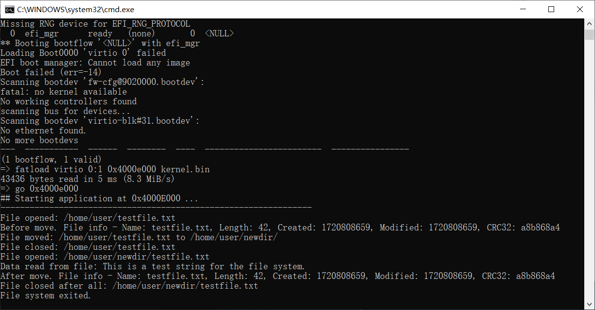

# （二十九）移植过程


成功移植了多任务机制之后，剩下来的就简单多了，有一些简单的问题，但是都很容易克服，一个小时多一点，进度比之前都快不少。

## 1. 多任务同步机制

直接复制粘贴x86下的kernel_sync.h和kernel_sync.c，完美适配。

## 2. 内核缓冲区

直接从x86那边复制粘贴过来就行了。需要修改的地方如下：

kernel_buffer.c

```c
// 写入缓冲区
void kernel_buffer_write(struct kernel_buffer *k_buf, char *data, uint32_t size) {
    if (size > k_buf->size) {
        // 边界检查，一次性写不能超过缓冲区大小
        return;
    }
    for (uint32_t i = 0; i < size; i++) {
        semaphore_wait(&k_buf->writable);   // 等待可写空间
        mutex_lock(&k_buf->mutex);          // 锁定缓冲区

        k_buf->data[k_buf->write_pos] = data[i];
        // 因为这里不知道arm的gcc编译器发什么神经病
        // 我的求余操作被要求使用arm的除法库，简直有毒
        // 我之前在interrupt里面用求余也没见它要求
        // 干脆我自己实现

        // k_buf->write_pos = (k_buf->write_pos + 1) % k_buf->size;

        k_buf->write_pos++;
        if(k_buf->write_pos >= k_buf->size) {
            // 懒得优化逻辑了，这样看起来比较直观
            k_buf->write_pos -= k_buf->size;
        }

        k_buf->is_full = (k_buf->write_pos == k_buf->read_pos); // 更新is_full标志

        mutex_unlock(&k_buf->mutex);        // 解锁缓冲区
        semaphore_signal(&k_buf->readable); // 通知有新数据可读
    }
}

// 读取缓冲区
void kernel_buffer_read(struct kernel_buffer *k_buf, char *data, uint32_t size) {
    if (size > k_buf->size) {
        // 边界检查，一次性读不能超过缓冲区大小
        return;
    }
    for (uint32_t i = 0; i < size; i++) {
        semaphore_wait(&k_buf->readable);   // 等待可读数据
        mutex_lock(&k_buf->mutex);          // 锁定缓冲区

        data[i] = k_buf->data[k_buf->read_pos];
        // 因为这里不知道arm的gcc编译器发什么神经病
        // 我的求余操作被要求使用arm的除法库，简直有毒
        // 我之前在interrupt里面用求余也没见它要求
        // 干脆我自己实现

        // k_buf->read_pos = (k_buf->read_pos + 1) % k_buf->size;

        k_buf->read_pos++;
        if(k_buf->read_pos >= k_buf->size) {
            // 懒得优化逻辑了，这样看起来比较直观
            k_buf->read_pos -= k_buf->size;
        }

        k_buf->is_full = 0; // 更新is_full标志

        mutex_unlock(&k_buf->mutex);        // 解锁缓冲区
        semaphore_signal(&k_buf->writable); // 通知有可写空间
    }
}

```

## 3. 设备驱动管理

需要修改，结构体里面增加触发方式，实现里面把原来自己实现的插入IRQ中断处理逻辑删掉，用之前在kernel_interrupt里面提供的。

kernel_device.h

```c
//
// Created by huangcheng on 2024/5/27.
//

#ifndef HOS_KERNEL_DEVICE_H
#define HOS_KERNEL_DEVICE_H

#include "../../lib/lib_kernel/lib_kernel.h"
#include "../kernel_buffer/kernel_buffer.h"

// 统一的驱动接口结构体（这个结构体的实例一律放在驱动段）
struct driver {
    char driver_name[64];                       // 驱动名称
    void (*init)(void);                         // 初始化函数
    void (*exit)(void);                         // 退出函数

    // 驱动提供的读写函数（如果没有就读写缓冲区）

    int32_t (*read)(char *args, uint32_t args_size);    // 读设备函数（具体参数写在args里面）
    int32_t (*write)(char *args, uint32_t args_size);   // 写设备函数（具体参数写在args里面）


    int32_t irq;                                // IRQ 中断号（如果没有中断处理函数填-1）
    uint32_t trigger_mode;                      // 触发方式，电平触发为0（默认为电平触发），边缘触发为1
    void (*irq_interrupt_handler)(void);        // 中断处理函数（可选）

    // 因为注册宏里面改了四字节对齐，这里用uint_8_t也是四字节，干脆用uint_32_t填满

    uint32_t need_data_buffer;                  // 需要分配数据缓冲区就填1，不然填0
    uint32_t need_command_buffer;               // 需要分配命令缓冲区就填1，不然填0

    struct kernel_buffer *data_buffer;          // 指向数据缓冲区的指针
    struct kernel_buffer *command_buffer;       // 指向命令缓冲区的指针

    struct list_node node;                      // 用于串联到驱动链表上的链表结点

    void *driver_task_function;                 // 用于创建内核任务的函数入口
    // 这个内核任务负责具体的对设备读写，与缓冲区进行交互
    // 依赖于设备驱动的实现，没有也无所谓

    void *driver_task_function_args;            // 理论上应该不用传参，实际上不知道，多冗余一些好
};

// 初始化所有设备
void init_all_devices();
// 移除所有设备
void exit_all_devices();
// 添加单个驱动并初始化
void driver_add(struct driver* drv);
// 移除单个驱动并卸载
void driver_remove(const char *driver_name);
// 获取设备驱动
struct driver* get_driver(const char *driver_name);
// 对设备（驱动）读，如果设备驱动提供了read就转发（返回结果设备驱动read的结果），不然读其数据缓冲区（成功返回读出数量（以字节计算），不成功返回-1）
int32_t device_read(struct driver *drv, char *data, uint32_t count);
// 对设备（驱动）写，如果设备驱动提供了write就转发（返回结果设备驱动write的结果），不然写其命令缓冲区（成功返回写入数量（以字节计算），不成功返回-1）
int32_t device_write(struct driver *drv, char *data, uint32_t count);

// 这个注册宏的作用就是把数据放在驱动段（而且告诉编译器这个是被使用的，不能优化掉），它会定义一个驱动结构体实例（增加4字节对齐）
#define REGISTER_DRIVER(drv) \
    __attribute__((section(".drivers"), used, aligned(4))) struct driver drv =


#endif //HOS_KERNEL_DEVICE_H

```

kernel_device.c

```c
//
// Created by huangcheng on 2024/5/27.
//

#include "kernel_device.h"
#include "../kernel_interrupt/kernel_interrupt.h"
#include "../kernel_task/kernel_task.h"

// 驱动链表头结点
struct list_node driver_list_head;

// 驱动段的起点和终点
extern struct driver __drivers_start[];
extern struct driver __drivers_end[];

// 回收缓冲区
void free_driver_buffer(struct driver *drv) {

    // 需要内核缓冲区，而且已经被分配了缓冲区的情况
    if (drv->need_data_buffer && drv->data_buffer) {
        // 回收缓冲区
        kernel_buffer_free(drv->data_buffer);
        // 清空指针
        drv->data_buffer = NULL;
    }

    // 需要内核缓冲区，而且已经被分配了缓冲区的情况
    if (drv->need_command_buffer && drv->command_buffer) {
        // 回收缓冲区
        kernel_buffer_free(drv->command_buffer);
        // 清空指针
        drv->command_buffer = NULL;
    }

}

// 分配缓冲区，原子操作，失败回滚，返回1为成功，0为失败
uint8_t alloc_driver_buffer(struct driver *drv) {
    struct kernel_buffer *data_buf = NULL;
    struct kernel_buffer *command_buf = NULL;

    // 尝试分配数据缓冲区
    if (drv->need_data_buffer) {
        if (drv->data_buffer) {
            // 如果已经存在数据缓冲区，直接返回，不做任何更改
            return 0;
        } else {
            data_buf = kernel_buffer_create();
            if (!data_buf) {
                // 分配失败，直接返回，不做任何更改
                return 0;
            }
        }
    }

    // 尝试分配命令缓冲区
    if (drv->need_command_buffer) {
        if (drv->command_buffer) {
            // 如果已经存在命令缓冲区，先释放已分配的数据缓冲区（如果有的话）
            if (data_buf) {
                kernel_buffer_free(data_buf);
            }
            // 直接返回，不做任何更改
            return 0;
        } else {
            command_buf = kernel_buffer_create();
            if (!command_buf) {
                // 分配失败，回滚已分配的数据缓冲区（如果有的话）
                if (data_buf) {
                    kernel_buffer_free(data_buf);
                }
                // 直接返回，不做任何更改
                return 0;
            }
        }
    }

    // 如果成功分配了缓冲区，更新驱动的缓冲区指针
    // 这里的指针如果不为空，肯定说明要求分配了，所以直接更新即可，不用再次判定是否要求分配了
    if (data_buf) {
        drv->data_buffer = data_buf;
    }
    if (command_buf) {
        drv->command_buffer = command_buf;
    }

    return 1;
}

void init_all_devices() {
    // 初始化驱动链表头结点
    init_list_node(&driver_list_head);
    // 链接到驱动链表
    struct driver* drv;
    for (drv = __drivers_start; drv < __drivers_end; drv++) {
        driver_add(drv);
    }
}

void exit_all_devices() {
    // 禁用中断
    intr_disable();
    // 遍历驱动链表，执行每个驱动的退出函数
    struct list_node *pos, *n;
    list_for_each_safe(pos, n, &driver_list_head) {
        struct driver *drv = list_entry(pos, struct driver, node);
        if (drv->exit != NULL) {
            drv->exit();
        }

        // 需要内核缓冲区，而且已经被分配了缓冲区的情况
        free_driver_buffer(drv);

        // 如果中断号在有效范围内就移除中断处理函数
        if(drv->irq >= 0) {
            remove_interrupt_handler(drv->irq);
        }

        if(drv->driver_task_function != NULL) {
            // 回收内核任务
            task_cancel(task_info(drv->driver_name));
        }

        // 从链表中移除该驱动
        list_del(pos);
    }
    // 启用中断
    intr_enable();
    // 初始化头结点
    init_list_node(&driver_list_head);
}

void driver_add(struct driver* drv) {
    if (drv == NULL) {
        return;
    }

    // 检查是否重复注册
    struct list_node *pos;
    list_for_each(pos, &driver_list_head) {
        if (strcmp(list_entry(pos, struct driver, node)->driver_name, drv->driver_name) == 0) {
            return;
        }
    }

    // 分配缓冲区，失败就直接退出
    if(alloc_driver_buffer(drv) == 0) {
        return;
    }

    // 怕触发中断，所以先关闭中断
    intr_disable();

    // 如果要求注册中断处理函数，必须检查中断号范围
    if (drv->irq >= 0) {
        // 尝试注册中断处理函数
        if(add_interrupt_handler(drv->irq, drv->irq_interrupt_handler, drv->trigger_mode) == false) {
            // 失败了就要回滚
            free_driver_buffer(drv);    // 回滚缓冲区
            // 重新开启中断
            intr_enable();
            // 中断处理程序冲突，不得挂载驱动，因而直接return
            return;
        }
    }

    // 执行初始化函数
    if (drv->init != NULL) {
        drv->init();
    }

    if(drv->driver_task_function != NULL) {
        // 以设备名建立一个任务（反正是两个不同的体系，不怕冲突）
        task_create(drv->driver_name, 31, drv->driver_task_function, drv->driver_task_function_args);
    }

    // 现在不怕触发中断了就可以打开中断
    intr_enable();

    // 将驱动添加到驱动链表
    list_add_tail(&drv->node, &driver_list_head);
}

void driver_remove(const char *driver_name) {
    if(strlen(driver_name) > 63) {
        // 名字太长存不下，肯定找不到
        return;
    }

    struct list_node *pos, *n;
    list_for_each_safe(pos, n, &driver_list_head) {
        struct driver *drv = list_entry(pos, struct driver, node);
        if (strcmp(drv->driver_name, driver_name) == 0) {
            // 首先禁止中断，怕又触发中断
            intr_disable();

            // 执行退出函数
            if (drv->exit != NULL) {
                drv->exit();
            }

            // 需要内核缓冲区，而且已经被分配了缓冲区的情况
            free_driver_buffer(drv);

            // 尝试移除中断处理逻辑
            if (drv->irq >= 0) {
                remove_interrupt_handler(drv->irq);
            }

            if(drv->driver_task_function != NULL) {
                // 回收内核任务
                task_cancel(task_info(drv->driver_name));
            }

            // 清除干净，允许中断
            intr_enable();

            // 从链表中移除该驱动
            list_del(pos);
            return;
        }
    }
}

// 获取设备驱动
struct driver* get_driver(const char *driver_name) {
    if(strlen(driver_name) > 63) {
        // 名字太长存不下，肯定找不到
        return NULL;
    }
    struct list_node *pos;
    list_for_each(pos, &driver_list_head) {
        if (strcmp(list_entry(pos, struct driver, node)->driver_name, driver_name) == 0) {
            // 找到驱动结构体实例，返回其指针
            return list_entry(pos, struct driver, node);
        }
    }
    // 找不到那就只能null了
    return NULL;
}
// 对设备（驱动）读，如果设备驱动提供了read就转发（返回结果设备驱动read的结果），不然读其数据缓冲区（成功返回读出数量（以字节计算），不成功返回-1）
int32_t device_read(struct driver *drv, char *data, uint32_t count) {
    if(!drv) {
        return -1;
    }
    // 什么都不提供，自然要失败
    if(drv->read == NULL && drv->data_buffer == NULL) {
        return -1;
    }

    // 驱动提供的函数优先级更高
    if(drv->read) {
        // 直接转发，拆包参数由驱动自行解决
        return drv->read(data, count);
    }

    // 没提供函数的情况下，直接读缓冲区了
    if(drv->data_buffer) {
        uint32_t total_read = 0;
        uint32_t to_read = 0;
        uint32_t chunk_size = 3072; // 限制一次性读3KB

        while (total_read < count) {
            to_read = (count - total_read > chunk_size) ? chunk_size : count - total_read;
            kernel_buffer_read(drv->data_buffer, data + total_read, to_read);
            total_read += to_read;
        }

        return total_read;
    }
    // 理论上应该不可能跳到这里，还是预防万一
    return -1;
}
// 对设备（驱动）写，如果设备驱动提供了write就转发（返回结果设备驱动write的结果），不然写其命令缓冲区（成功返回写入数量（以字节计算），不成功返回-1）
int32_t device_write(struct driver *drv, char *data, uint32_t count) {
    if(!drv) {
        return -1;
    }

    // 什么都不提供，自然要失败
    if(drv->write == NULL && drv->command_buffer == NULL) {
        return -1;
    }

    // 驱动提供的函数优先级更高
    if(drv->write) {
        // 直接转发，拆包参数由驱动自行解决
        return drv->write(data, count);
    }

    // 没提供函数的情况下，直接读缓冲区了
    if(drv->command_buffer) {
        uint32_t total_written = 0;
        uint32_t to_write = 0;
        uint32_t chunk_size = 3072; // 限制一次性写3KB

        while (total_written < count) {
            to_write = (count - total_written > chunk_size) ? chunk_size : count - total_written;
            kernel_buffer_write(drv->command_buffer, data + total_written, to_write);
            total_written += to_write;
        }

        return total_written;
    }
    // 理论上应该不可能跳到这里，还是预防万一
    return -1;
}

```


## 4. 实现定时器驱动

其实就是把之前写在kernel.c里面的定时器逻辑放到一个文件夹里。

devices文件夹下建立timer文件夹，建立timer.h

```c
//
// Created by huangcheng on 2024/7/13.
//

#ifndef HOS_TIMER_H
#define HOS_TIMER_H

#include "../../lib/lib_kernel/lib_kernel.h"

// timer初始化函数
void init_timer();
// timer退出函数
void exit_timer();
// timer中断处理函数
void interrupt_handler_timer();

// ticks是内核自中断开启以来总共的嘀嗒数
extern uint32_t total_ticks;

#endif //HOS_TIMER_H

```

timer.c

```c
//
// Created by huangcheng on 2024/7/13.
//

#include "timer.h"

#include "../../kernel/kernel_device/kernel_device.h"
#include "../../kernel/kernel_task/kernel_task.h"

// 注册宏，定义一个驱动结构体，把驱动结构体实例放到驱动段
REGISTER_DRIVER(timer_driver){
        .driver_name = "timer",
        .init = init_timer,
        .exit = exit_timer,
        .irq = 30,
        .trigger_mode = 0,
        .irq_interrupt_handler = interrupt_handler_timer,
};

// 关于定时器：
// https://developer.arm.com/documentation/ddi0438/i/generic-timer/generic-timer-programmers-model?lang=en
// https://developer.arm.com/documentation/ddi0406/cd/?lang=en

// 定义寄存器访问宏
#define CP15_WRITE_REG32(reg, val) \
    __asm__ __volatile__("mcr p15, 0, %0, " reg : : "r"(val))

#define CP15_READ_REG32(reg, val) \
    __asm__ __volatile__("mrc p15, 0, %0, " reg : "=r"(val))

// CP15 寄存器定义
#define CNTFRQ     "c14, c0, 0"  // Counter Frequency Register
#define CNTP_TVAL  "c14, c2, 0"  // Physical Timer Value Register
#define CNTP_CTL   "c14, c2, 1"  // Physical Timer Control Register
#define CNTP_CVAL  "c14, c2, 2"  // Physical Timer Compare Value Register
#define CNTPCT     "c14, c0, 1"  // Physical Count Register

void set_cntfrq(uint32_t value) {
    CP15_WRITE_REG32(CNTFRQ, value);
}

void set_cntp_tval(uint32_t value) {
    CP15_WRITE_REG32(CNTP_TVAL, value);
}

void enable_cntp_timer() {
    uint32_t value;
    CP15_READ_REG32(CNTP_CTL, value);
    value |= 1;  // Set the enable bit
    CP15_WRITE_REG32(CNTP_CTL, value);
}

void disable_cntp_timer() {
    uint32_t value;
    CP15_READ_REG32(CNTP_CTL, value);
    value &= ~1;  // Clear the enable bit
    CP15_WRITE_REG32(CNTP_CTL, value);
}

uint32_t read_cntpct() {
    uint32_t value;
    CP15_READ_REG32(CNTPCT, value);
    return value;
}

// timer初始化函数
void init_timer() {

    // 关于定时器的设备树片段：
    // timer {
    //         interrupts = <0x00000001 0x0000000d 0x00000104 0x00000001 0x0000000e 0x00000104 0x00000001 0x0000000b 0x00000104 0x00000001 0x0000000a 0x00000104>;
    //         always-on;
    //         compatible = "arm,armv7-timer";
    // };

    // 解读如下：
    // 这个timer节点定义了4个中断。
    // 每个中断的格式是 <type number> <interrupt number> <flags>，每个中断由3个值组成：
    // 0x00000001 0x0000000d 0x00000104
    // 0x00000001 0x0000000e 0x00000104
    // 0x00000001 0x0000000b 0x00000104
    // 0x00000001 0x0000000a 0x00000104
    // 每个中断的中断号如下：
    // 第一个中断：0x0000000d
    // 第二个中断：0x0000000e
    // 第三个中断：0x0000000b
    // 第四个中断：0x0000000a

    // 总结：
    // 该timer节点定义了4个中断。
    // 中断号分别是0x0d, 0x0e, 0x0b, 和0x0a。
    // 中断标志0x00000104表示这些中断是上升沿触发的。

    // 上升沿触发是一种边缘触发，所以要额外重新配置
    // 但是我试过，这些都没法用
    // 定时器中断id就是30，还是水平触发的

    // 使用的是硬件定时器
    // 设置计数器，单位是Hz（赫兹，每秒钟计时多少次）
    // 一般都是设置为 1MHz（一百万赫兹）
    set_cntfrq(1000000);
    // 计时器的值，每次操作就-1，减到0就打一次中断
    // 理论上set_cntp_tval(1000000)设置应该是1s，在qemu上实测快得多，差不多是100毫秒
    // 之前x86设置是一秒一百次，在这里设置成500000就行了，没必要那么快
    set_cntp_tval(500000);
    // 启用定时器
    enable_cntp_timer();
}

// timer退出函数
void exit_timer() {
    // 直接禁用定时器就行了
    disable_cntp_timer();
}

// 初始化
uint32_t total_ticks = 0;

// timer中断处理函数
void interrupt_handler_timer() {
    // 逻辑代码
    struct task* cur_task = running_task();
    cur_task->elapsed_ticks++;	  // 记录此线程占用的cpu时间嘀嗒数

    total_ticks++;                // 总时长增加

    if (cur_task->ticks == 0) {	  // 若任务时间片用完就开始调度新的任务上cpu
        task_schedule();
    } else {				  // 将当前任务的时间片-1
        cur_task->ticks--;
    }

    // 停用定时器
    disable_cntp_timer();
    // 设置计时器初始值
    set_cntp_tval(500000);
    // 启用定时器以生成下一次中断
    enable_cntp_timer();
}

```

这样设备驱动管理框架就能自动初始化并注册中断处理逻辑了。


## 5. string

lib_kernel中的string直接复制粘贴x86版本的string.c和string.h即可，不过有个问题。

```c
/*

// 因为arm的gcc又发疯了，非要用库函数操作double类型数据
// 没办法只能用定点数代替浮点数，它爱发疯就发疯吧，不奉陪
// 这个版本是GPT 4o写的替代版
void double_to_str_int(int int_part, int frac_part, char* buffer, int precision) {
    if (precision < 0) {
        precision = 6;
    }

    // 把整数部分转换为字符串
    int_to_str(int_part, buffer);
    while (*buffer) buffer++;

    *buffer++ = '.';

    // 将小数部分按精度进行处理
    for (int i = 0; i < precision; ++i) {
        frac_part *= 10;
    }

    // 把小数部分转换为字符串
    char frac_buffer[20];
    int_to_str(frac_part, frac_buffer);

    // 补齐前导零
    int frac_length = strlen(frac_buffer);
    for (int i = 0; i < precision - frac_length; ++i) {
        *buffer++ = '0';
    }

    // 将小数部分拷贝到 buffer
    strcpy(buffer, frac_buffer);
}

// 包装函数
// 经过测试，只要是double一律调库，double任何运算全部调库，受不了了，弃用
void double_to_str(double num, char* buffer, int precision) {
    // 处理负数
    if (num < 0) {
        *buffer++ = '-';
        num = -num;
    }

    // 提取整数部分和小数部分
    int int_part = (int)num;
    int frac_part = (int)((num - int_part) * 1000000); // 使用 10^6 来保留小数部分

    // 调用整数处理的函数
    double_to_str_int(int_part, frac_part, buffer, precision);
}

*/

int sprintf(char* buffer, const char* format, ...) {
    const char* p = format;
    int* arg = (int*)(void*)(&format + 1);
    char* buf_ptr = buffer;
    char temp_buffer[32];

    while (*p) {
        if (*p == '%' && *(p + 1) != '\0') {
            p++;
            int width = 0;
            int precision = -1;

            while (*p >= '0' && *p <= '9') {
                width = width * 10 + (*p - '0');
                p++;
            }

            if (*p == '.') {
                p++;
                precision = 0;
                while (*p >= '0' && *p <= '9') {
                    precision = precision * 10 + (*p - '0');
                    p++;
                }
            }

            switch (*p) {
                case 'd':
                    int_to_str(*arg++, temp_buffer);
                    break;
                case 'u':
                    uint_to_str(*arg++, temp_buffer);
                    break;
                case 'x':
                    hex_to_str(*arg++, temp_buffer);
                    break;
                case 'c':
                    *temp_buffer = (char)*arg++;
                    temp_buffer[1] = '\0';
                    break;
                case 's': {
                    char* str = (char*)*arg++;
                    while (*str) {
                        *buf_ptr++ = *str++;
                    }
                    continue;
                }
                case 'p':
                    ptr_to_str((void*)*arg++, temp_buffer);
                    break;
//                case 'f':         // 原因我也在上面说了，实在不行
//                    double_to_str(*(double*)arg++, temp_buffer, precision);
//                    break;
                default:
                    *buf_ptr++ = '%';
                    *buf_ptr++ = *p;
                    continue;
            }

            char* temp_ptr = temp_buffer;
            while (*temp_ptr) {
                *buf_ptr++ = *temp_ptr++;
            }
        } else {
            *buf_ptr++ = *p;
        }
        p++;
    }
    *buf_ptr = '\0';
    return buf_ptr - buffer;
}

```

这个问题我实在解决不了，没办法。


## 6. 虚拟设备驱动console

直接复制粘贴x86中的就行，但是console_printf函数一样，需要避免double类型。

```c
// 终端打印格式化字符串
void console_printf(const char* format, ...) {
    console_acquire();

    struct kernel_buffer* buffer = (struct kernel_buffer*)console_driver.data_buffer;
    char temp_buffer[256];
    const char *p;
    int int_temp;
    unsigned int uint_temp;
    char char_temp;
    char *str_temp;
    void* ptr_temp;
//    double double_temp;
    // 讽刺，出现double类型都不行，我甚至都没运算

    // 获取可变参数列表的起始地址
    char* arg_ptr = (char*)(&format + 1);

    for(p = format; *p != '\0'; p++) {
        if(*p != '%') {
            kernel_buffer_write(buffer, (char *)p, 1);
            continue;
        }
        p++;
        int width = 0;
        int precision = -1;

        // 读取宽度
        while (*p >= '0' && *p <= '9') {
            width = width * 10 + (*p - '0');
            p++;
        }

        // 读取精度
        if (*p == '.') {
            p++;
            precision = 0;
            while (*p >= '0' && *p <= '9') {
                precision = precision * 10 + (*p - '0');
                p++;
            }
        }

        switch(*p) {
            case 'd':
                int_temp = *((int*)arg_ptr);
                arg_ptr += sizeof(int);
                int_to_str(int_temp, temp_buffer);
                break;
            case 'u':
                uint_temp = *((unsigned int*)arg_ptr);
                arg_ptr += sizeof(unsigned int);
                uint_to_str(uint_temp, temp_buffer);
                break;
            case 'x':
                uint_temp = *((unsigned int*)arg_ptr);
                arg_ptr += sizeof(unsigned int);
                hex_to_str(uint_temp, temp_buffer);
                break;
            case 'p':
                ptr_temp = *((void**)arg_ptr);
                arg_ptr += sizeof(void*);
                ptr_to_str(ptr_temp, temp_buffer);
                break;
//            case 'f':     // 这个真没办法，只能弃用，原因我在string里面有说
//                double_temp = *((double*)arg_ptr);
//                arg_ptr += sizeof(double);
//                double_to_str(double_temp, temp_buffer, precision == -1 ? 6 : precision); // 默认精度为6
//                break;
            case 's':
                str_temp = *((char**)arg_ptr);
                arg_ptr += sizeof(char*);
                kernel_buffer_write(buffer, str_temp, strlen(str_temp));
                continue;
            case 'c':
                char_temp = *((char*)arg_ptr);
                arg_ptr += sizeof(char);
                kernel_buffer_write(buffer, &char_temp, 1);
                continue;
            case '%':
                kernel_buffer_write(buffer, (char *)p, 1);
                continue;
            default:
                kernel_buffer_write(buffer, (char *)p, 1);
                continue;
        }

        int len = strlen(temp_buffer);
        int pad_len = width - len;
        if (pad_len > 0) {
            while (pad_len-- > 0) {
                kernel_buffer_write(buffer, " ", 1);
            }
        }
        kernel_buffer_write(buffer, temp_buffer, len);

        // 输出缓冲区中的内容
        while (!kernel_buffer_is_empty(buffer)) {
            char output_char;
            kernel_buffer_read(buffer, &output_char, 1);
            put_char(output_char);
        }
    }

    // 将剩余的缓冲区内容打印到控制台
    while (!kernel_buffer_is_empty(buffer)) {
        char output_char;
        kernel_buffer_read(buffer, &output_char, 1);
        put_char(output_char);
    }

    console_release();
}

```


## 7. 实时时钟驱动

arm上不用RTC，用的是一个叫PL031的东西，看设备树能看到。

这里还是叫rtc，容易记。

rtc_cmos.h

```c
//
// Created by huangcheng on 2024/6/19.
//

#ifndef HOS_RTC_CMOS_H
#define HOS_RTC_CMOS_H

#include "../../lib/lib_kernel/lib_kernel.h"

// rtc时间结构体
typedef struct {
    uint8_t second;
    uint8_t minute;
    uint8_t hour;
    uint8_t day;
    uint8_t month;
    uint16_t year;
} rtc_time_t;

// 将RTC时间转换为时间戳
uint32_t get_unix_timestamp(rtc_time_t* time);
// 将时间戳转换为RTC时间
void unix_to_rtc_time(uint32_t timestamp, rtc_time_t *time);
// 取现行时间戳
uint32_t get_unix_timestamp_now(void);

#endif //HOS_RTC_CMOS_H

```

rtc_cmos.c

```c
//
// Created by huangcheng on 2024/6/19.
//

// arm上用的是PL031，看设备树可以看到

#include "rtc_cmos.h"
#include "../../kernel/kernel_device/kernel_device.h"

// 注册宏，定义一个驱动结构体，把驱动结构体实例放到驱动段
REGISTER_DRIVER(rtc_cmos_driver) {
        .driver_name = "rtc_cmos",
        .init = NULL,
        .exit = NULL,
        .irq = -1, // 没有中断处理
};

#define PL031_BASE_ADDR 0x09010000
#define PL031_DR (*(volatile uint32_t *)(PL031_BASE_ADDR)) // 数据寄存器地址（读这个地址，会提供当前时间戳）

// 每个月的天数数组
static const uint8_t days_in_month[] = { 31, 28, 31, 30, 31, 30, 31, 31, 30, 31, 30, 31 };

// 将RTC时间转换为时间戳
uint32_t get_unix_timestamp(rtc_time_t *time) {
    uint32_t days = 0;
    uint32_t year = time->year;
    uint32_t month = time->month;
    uint32_t day = time->day;

    // 计算从1970年到当前年份的总天数
    for (uint32_t y = 1970; y < year; y++) {
        days += (y % 4 == 0 && (y % 100 != 0 || y % 400 == 0)) ? 366 : 365;
    }

    // 计算当前年份中从1月到当前月份的总天数
    for (uint32_t m = 1; m < month; m++) {
        days += days_in_month[m - 1];
        if (m == 2 && (year % 4 == 0 && (year % 100 != 0 || year % 400 == 0))) {
            days += 1; // 闰年二月增加一天
        }
    }

    // 加上当前月份的天数
    days += day - 1;

    // 计算总秒数
    uint32_t total_seconds = days * 86400;
    total_seconds += time->hour * 3600;
    total_seconds += time->minute * 60;
    total_seconds += time->second;

    return total_seconds;
}

// 判断是否是闰年
static int is_leap_year(int year) {
    return ((year % 4 == 0 && year % 100 != 0) || (year % 400 == 0));
}

// 将UNIX时间戳转换为RTC时间
void unix_to_rtc_time(uint32_t timestamp, rtc_time_t *time) {
    uint32_t days = timestamp / 86400;
    uint32_t remaining_seconds = timestamp % 86400;

    time->hour = remaining_seconds / 3600;
    remaining_seconds %= 3600;
    time->minute = remaining_seconds / 60;
    time->second = remaining_seconds % 60;

    // 从1970年1月1日开始计算
    uint32_t year = 1970;
    while (days >= (is_leap_year(year) ? 366 : 365)) {
        days -= is_leap_year(year) ? 366 : 365;
        year++;
    }
    time->year = year;

    uint32_t month = 1;
    while (days >= days_in_month[month - 1]) {
        if (month == 2 && is_leap_year(year)) {
            if (days >= 29) {
                days -= 29;
            } else {
                break;
            }
        } else {
            days -= days_in_month[month - 1];
        }
        month++;
    }
    time->month = month;
    time->day = days + 1;
}

// 取现行时间戳
uint32_t get_unix_timestamp_now(void) {
    uint32_t res = PL031_DR;
    return res;
}

```


## 8. 移植虚拟外存RAMDISK

kernel_page.c在setup_page_directory函数的最后那句

```c
// ramdisk暂时不管，用到了再说
```

这里，替换为以下代码：

```c
    // 移植虚拟外存所需的16条段页表（16MB）
    for(uint32_t i = 0; i < 16; i++) {
        page_directory[0xa00 + i].DescriptorType = 2;
        page_directory[0xa00 + i].Bufferable = 1;
        page_directory[0xa00 + i].Cacheable = 1;
        page_directory[0xa00 + i].ShouldBeZero0 = 0;
        page_directory[0xa00 + i].Domain = KERNEL_DOMAIN;
        page_directory[0xa00 + i].ImplementationDefined = 0;
        page_directory[0xa00 + i].AccessPermission = 2;     // 当然要特权读写用户只读
        page_directory[0xa00 + i].TypeExtension = 0;
        page_directory[0xa00 + i].ShouldBeZero1 = 0;
        page_directory[0xa00 + i].Shared = 0;
        page_directory[0xa00 + i].ShouldBeZero2 = 0;
        page_directory[0xa00 + i].PresentHigh = 0;
        page_directory[0xa00 + i].ShouldBeZero3 = 0;
        // 128MB的最后16MB
        // 0x8000000 - 0x1000000 = 0x7000000
        // 1MB为0x100000
        page_directory[0xa00 + i].BaseAddress = ((DRAM_OFFSET + 0x7000000 + i * 0x100000) >> 20);
    }

```

kernel_memory.c，修改init_memory函数，设置RAMDISK的位置已经被占据。

```c
// 内存管理初始化
void init_memory(uint32_t total_physical_memory) {
    // 物理地址位图，一页是一位，一字节8位
    global_bitmap_physical_memory->bits = (uint8_t *)GLOBAL_BITMAP_PHYSICAL_BASE;
    global_bitmap_physical_memory->btmp_bytes_len = total_physical_memory / PG_SIZE / 8;
    bitmap_init(global_bitmap_physical_memory);
    // 物理地址上已经占据了的置为1
    // 低端1MB全部被内核占据了，还有页表、位图（按照上面取整，直接按0x130000计算，以下全部当作被占据）
    bitmap_set_range(global_bitmap_physical_memory, 0, 0x130000 / PG_SIZE, 1);
    // RAMDISK占据了最后16MB，因此这里也要设置位图为已占据
    bitmap_set_range(global_bitmap_physical_memory, 0x7000000 / PG_SIZE, 0x1000000 / PG_SIZE, 1);

    // 虚拟地址管理的设置（内核虚拟地址写在线程的TCB里面）
    KERNEL_TCB->process_virtual_address.virtual_addr_start = KERNEL_VIRTUAL_ADDR_START;
    // 内核虚拟地址的地址
    KERNEL_TCB->process_virtual_address.bitmap_virtual_memory.bits = (uint8_t *)KERNEL_BITMAP_VIRTUAL_BASE;
    // 内核虚拟地址上限
    KERNEL_TCB->process_virtual_address.bitmap_virtual_memory.btmp_bytes_len = KERNEL_BITMAP_VIRTUAL_BYTE_LENGTH;
    // 初始化内核虚拟位图
    bitmap_init(&(KERNEL_TCB->process_virtual_address.bitmap_virtual_memory));
    // 设置最开始的1MB全部被内核占据了
    bitmap_set_range(&(KERNEL_TCB->process_virtual_address.bitmap_virtual_memory), 0, 0x100000 / PG_SIZE, 1);
}

```

这样直接粘贴ramdisk就行。


## 9. 移植文件系统

从x86那边复制粘贴，只需要改fs_ml.c即可

```c
// 长期驻留在内存中的超级块
SuperBlock *SBlk = (SuperBlock *)0x40040000;
// 因为以512个字节为基本操作单位，所以文件系统缓冲区大小设计为512个字节
uint8_t *fs_buffer = (uint8_t *)0x40042000;

```

这里的位置相应调整。


## 10. 测试

kernel.c

```c
//
// Created by huangcheng on 2024/6/24.
//

#include "../lib/lib_kernel/lib_kernel.h"
#include "../kernel/kernel_page/kernel_page.h"
#include "../kernel/kernel_task/kernel_task.h"
#include "../kernel/kernel_interrupt/kernel_interrupt.h"
#include "../kernel/kernel_device/kernel_device.h"
#include "../devices/console/console.h"
#include "../devices/rtc_cmos/rtc_cmos.h"
#include "../fs/fs.h"

// 文件系统测试函数
void test_fs();

        void kernel_main(void) {
    // u-boot已经给我们设置了管理模式
    // 一进来就已经是管理模式了

    // 页表初始化
    init_paging();

    // 因为覆盖了整个内存区域，所以还可以用u-boot的栈
    // 到这里再切换也没问题

    // 切换栈指针到虚拟地址，这样就可以顺利使用内核栈了
    switch_sp(0xc0007000);
    // 初始化task
    init_multitasking();
    // 初始化内存管理（本来这里应该从环境里面获取内存大小，我懒，直接写死了算了）
    init_memory(0x8000000);
    // 初始化中断管理和GIC
    init_interrupt();
    // 初始化设备驱动管理
    init_all_devices();

    // 开启IRQ中断
    intr_enable();

    // 允许定时器中断
    enable_gic_irq_interrupt(30);

    // 测试文件系统
    test_fs();

    for(;;);

    // 以防万一，退出时退出所有设备
    exit_all_devices();
}

// 文件系统测试函数
void test_fs() {
    FS_DESC fileDesc;
    FS_STAT fileStat;
    uint8_t readBuffer[512];
    const char *testData = "This is a test string for the file system.";
    int16_t result;

    // 启动文件系统
    result = fs_start();
    if (result != 0) {
        return;
    }

    // 格式化文件系统（完全格式化）
    result = fs_format(FS_FORMAT_FULL);
    if (result != 0) {
        fs_exit();
        return;
    }

    // 打开文件（创建并写入）
    result = fs_open(&fileDesc, "/home/user/testfile.txt");
    if (result < 0) {
        fs_exit();
        return;
    }

    // 写入文件
    result = fs_write(&fileDesc, (uint8_t *)testData, strlen(testData));
    if (result < 0) {
        fs_close(&fileDesc);
        fs_exit();
        return;
    }

    // 关闭文件
    result = fs_close(&fileDesc);
    if (result != 0) {
        fs_exit();
        return;
    }

    console_printf("----------------------------------------------------------------\n");

    // 重新打开/home/user/testfile.txt 文件
    result = fs_open(&fileDesc, "/home/user/testfile.txt");
    if (result < 0) {
        console_printf("Failed to open file: /home/user/testfile.txt\n");
        fs_exit();
        return;
    }
    console_printf("File opened: /home/user/testfile.txt\n");

    // 移动前获取文件信息
    result = fs_info(&fileDesc, &fileStat);
    if (result != 0) {
        console_printf("Failed to get file info: /home/user/testfile.txt\n");
        fs_close(&fileDesc);
        fs_exit();
        return;
    }
    console_printf("Before move. File info - Name: %s, Length: %u, Created: %u, Modified: %u, CRC32: %08x\n",
                   fileStat.fname, fileStat.file_len, fileStat.file_ctime, fileStat.file_mtime, fileStat.file_crc32);

    // 并将其移动到 /home/user/newdir/ 目录
    result = fs_move(&fileDesc, "/home/user/newdir/");
    if (result != 0) {
        console_printf("Failed to move file to directory: /home/user/newdir/\n");
        return;
    }
    console_printf("File moved: /home/user/testfile.txt to /home/user/newdir/\n");

    // 关闭文件
    result = fs_close(&fileDesc);
    if (result != 0) {
        console_printf("Failed to close file: /home/user/testfile.txt\n");
        fs_exit();
        return;
    }
    console_printf("File closed: /home/user/testfile.txt\n");

    // 检查文件是否成功移动

    // 以新路径打开
    result = fs_open(&fileDesc, "/home/user/newdir/testfile.txt");
    if (result != 0) {
        console_printf("%d Failed to opened file: /home/user/newdir/testfile.txt\n", result);
        fs_exit();
        return;
    }
    console_printf("File opened: /home/user/newdir/testfile.txt\n");

    // 读取文件
    result = fs_read(&fileDesc, readBuffer, sizeof(readBuffer) - 1);
    if (result < 0) {
        console_printf("Failed to read from file: /home/user/newdir/testfile.txt\n");
        fs_close(&fileDesc);
        fs_exit();
        return;
    }
    console_printf("Data read from file: %s\n", readBuffer);

    // 获取文件信息
    result = fs_info(&fileDesc, &fileStat);
    if (result != 0) {
        console_printf("Failed to get file info: /home/user/newdir/testfile.txt\n");
        fs_close(&fileDesc);
        fs_exit();
        return;
    }
    console_printf("After move. File info - Name: %s, Length: %u, Created: %u, Modified: %u, CRC32: %08x\n",
                   fileStat.fname, fileStat.file_len, fileStat.file_ctime, fileStat.file_mtime, fileStat.file_crc32);

    // 关闭文件
    result = fs_close(&fileDesc);
    if (result != 0) {
        console_printf("Failed to close file after all: /home/user/newdir/testfile.txt\n");
        fs_exit();
        return;
    }
    console_printf("File closed after all: /home/user/newdir/testfile.txt\n");

    // 退出文件系统
    result = fs_exit();
    if (result != 0) {
        console_printf("Failed to exit file system.\n");
        return;
    }
    console_printf("File system exited.\n");
}

```

编译运行看看。



十分顺利，组件环环相扣，能输出这些说明这些组件全部正常运行。