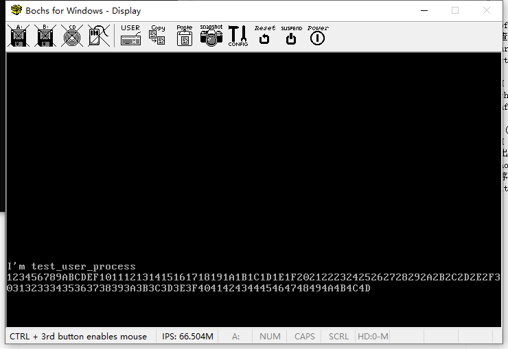
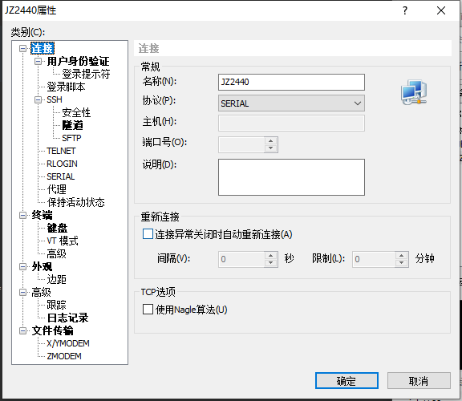
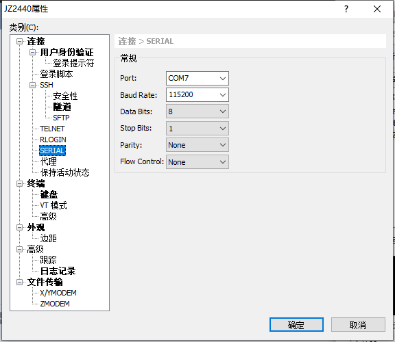
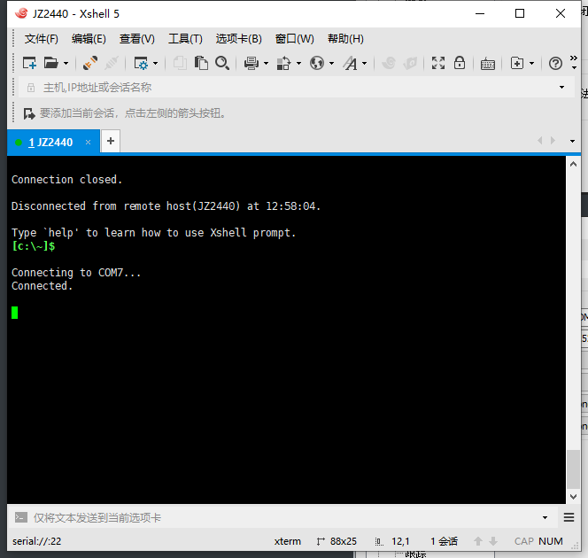
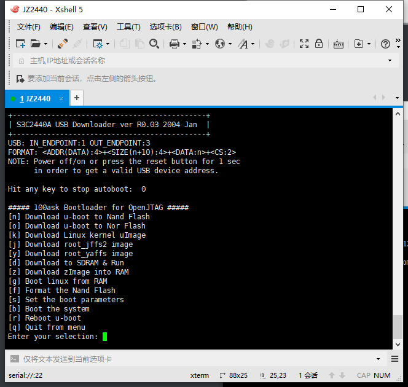
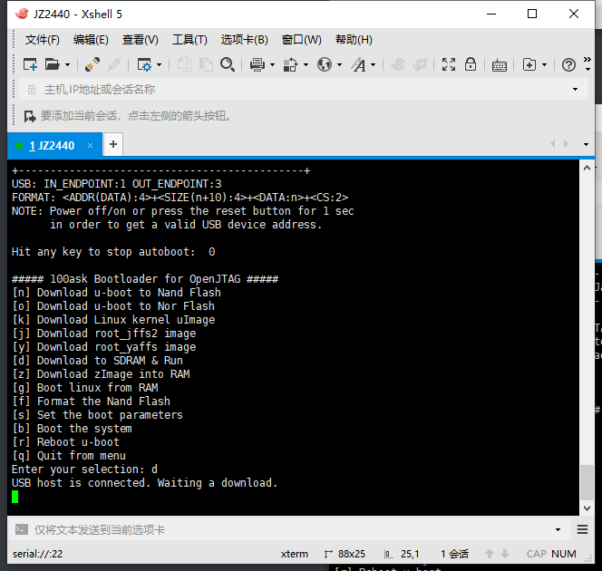
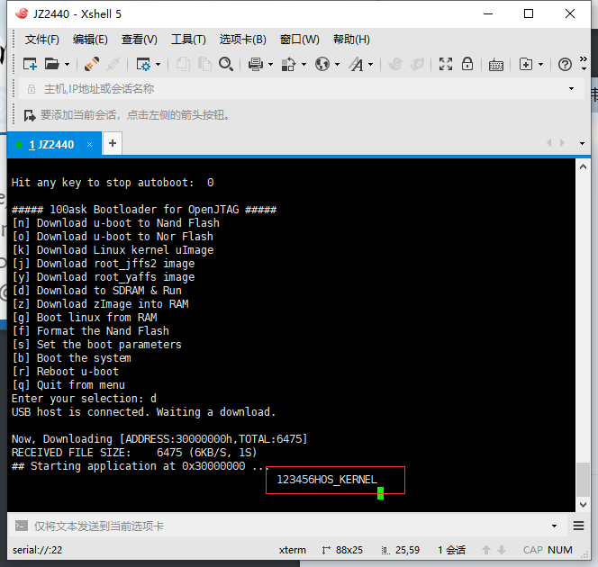

# （三十）移植到JZ2440开发板上

买的开发板之前放朋友家那边，昨天刚寄到，摸索了一晚上刚搞清楚该怎么用。

JZ2440就是韦东山老师的百问网的产品，我在海鲜市场上买的二手，在移植了系统之后将会基于JZ2440的开发板开发HOS的LCD驱动，这个项目也就告一段落了。

开发板装驱动的过程我就不说了，卖家和我说JZ2440买到的时候就已经刷好了百问网出的u-boot，卖家自己又刷到了NOR闪存上，两个都有了，我就不用再移植了，省下不少力气。


## 0. 修改和改进

虽然到现在为止我还是没成功实现用户态进程（主要是不知道为什么跳不进进程入口函数），但是排查过程中还是发现了一些问题。

首先是x86下的用户态进程，现在发现之前为什么一直报错cpl != dpl的问题了，是我代码写错了。

process.c

```c
// 用一个包装函数，来做初始化工作，辅助进入用户态
void wrap_task_to_process() {

    // 先禁止中断，我怕设置不完成
    enum intr_status old_status = intr_disable();
    // 把之前没完成的设置完成了，申请一个页作为用户态进程栈
    struct interrupt_stack* int_stack = (struct interrupt_stack*)((uint32_t)(running_task()) + PG_SIZE - sizeof(struct interrupt_stack));

    // 之前把这个操作完善了，这会在用户内存池（16MB以后申请内存空间，并且映射到用户进程自己的页表上）
    void *user_stack = malloc_page(USER_FLAG, 1);
    if(!user_stack) {
        // 申请不了，回滚
        task_cancel(running_task());
        intr_set_status(old_status);
        return;
    }
    int_stack->user_esp = (uint32_t)user_stack + PG_SIZE;
    // 把这个设置完成了之后就可以进入用户态了
    switch_to_user_mode();
}

```

原先是

```c
struct interrupt_stack* int_stack = (struct interrupt_stack*)((uint32_t)(running_task()) + PG_SIZE - sizeof(struct task_info_stack));
```

其实说白了就是我的位移计算错误，这个问题解决之后，用Bochs也能顺利运行了。



然后是arm下的，关于任务切换的问题。

irq_handler.asm

```assembly
.section .text
.global irq_handler
.extern irq_interrupt_dispatcher
.extern task_switch

// 关于arm的模式
// 0b10000 或 0x10：用户模式（User Mode）
// 0b10001 或 0x11：快速中断模式（FIQ Mode）
// 0b10010 或 0x12：中断模式（IRQ Mode）
// 0b10011 或 0x13：管理模式（Supervisor Mode）
// 0b10111 或 0x17：中止模式（Abort Mode）
// 0b11011 或 0x1B：未定义模式（Undefined Mode）
// 0b11111 或 0x1F：系统模式（System Mode，ARMv4以上）

irq_handler:
    // 进入的时候已经为IRQ模式
    // 进入该模式的时候，自动保存中断前cpsr到spsr寄存器（准确来说是spsr_irq，这是irq模式下才能读写的）
    // 此时lr是中断前pc + 4（下一条指令地址，CPU自动保存）
    cpsid i                 // 禁用IRQ中断
    // irq模式有irq模式自己的栈（u-boot设置过了，栈底直接在0xffffffff处）

    // 从arm v6开始，arm提供了两条汇编指令，专门用于中断上下文保存
    // srsdb，直接把spsr和lr保存到指定位置，还可以切换到其他模式，一般是srsdb sp!, #0x13（保存到当前模式栈，然后切换到管理模式）
    // rfeia，从指定位置恢复spsr和lr，并且直接跳转回lr指向的指令，直接恢复中断处理前的模式，一般是rfeia sp!
    // srsdb压栈顺序是先spsr，后lr，rfeia弹栈顺序相反，这两个函数不需要寄存器中继

    // 统一IRQ栈地址，这样就不用考虑清理IRQ栈的问题了
    // 使用内核高端映射地址比较好（不管是否切换页表，高端映射这部分肯定是完全相同的，为后面实现用户态进程服务）
    ldr     sp, =0xc0008000

    // 直接保存所有通用寄存器到IRQ栈（中断发生时所有上下文都被保存了）
    push    {r0-r12}

    // IRQ模式的栈和管理模式的栈分离，完全没办法用x86下的做法了
    // 我又一时间发明不了新的做法
    // 只能尝试约定一个位置专门存放这两个元素，直接放在IRQ栈，位置固定，好解决

    // 从arm v2开始，arm支持stmdb和ldmia指令，这两个指令可以直接把寄存器列表保存到指定地方
    // push和pop相当于限定死了目的地是栈，这两个指令比较自由，但是这两个指令好像不能保存spsr
    // 为了可读性还是用push和pop吧，这两个一看就知道

    mrs     r0, spsr            // 保存中断前的cpsr
    push    {r0}                // 压栈保存spsr
    push    {lr}                // 压栈保存lr

    // IRQ模式也算是特权模式，可以视为内核态，反正也能处理就是了

    bl irq_interrupt_dispatcher // 调用IRQ中断分发器，bl指令会自动保存lr，能回得来

    // 尝试切换任务
    // 这时候尝试切换，如果回得来，不怕数据丢失
    // 如果回不来，重入中断的时候栈指针又是重设的，不怕栈没清空
    // 至于CPSR，状态问题更不用担心了，哪个进入中断之前都是允许中断的
    bl      task_switch

    pop     {lr}                // 恢复lr
    pop     {r0}                // 恢复spsr
    msr     spsr_cxsf, r0

    pop     {r0-r12}            // 恢复其他上下文


    cpsie i                     // 启用IRQ中断
    subs    pc, lr, #4          // 返回中断前的位置（CPU会自动恢复spsr_irq到cpsr）

```

switch_to.asm

```assembly
.section .text
.global switch_to

// 按照arm上C的调用约定
// r0是cur_task
// r1是next_task

switch_to:
    // 先前是在irq模式中运行task_switch函数的
    // 由于每次进入irq模式都统一栈地址，所以也不需要清理了
    // 每个任务中断时的信息都必须保存在其内核栈中
    cps     #0x13               // 切换到管理模式，使用当前任务的内核栈

    // 之前IRQ栈中有任务发生时状态的相关信息，直接将其复制过来然后压栈到内核栈
    // 经过先前的执行，寄存器的值可能和任务中断时的不同了
    // 所以才要考虑从IRQ栈里面取，而不是直接push

    // 统一使用高端映射（如果是进程的话，用的页表里面肯定没有内核的低端部分）
    // 统一用地址，出错好检查

    ldr     r4, =0xc0007fc4     // lr寄存器
    ldr     r5, [r4]
    push    {r5}

    ldr     r4, =0xc0007fc8     // 中断前的cpsr寄存器
    ldr     r5, [r4]
    push    {r5}

    ldr     r4, =0xc0007ffc     // r12寄存器
    ldr     r5, [r4]
    push    {r5}

    ldr     r4, =0xc0007ff8     // r11寄存器
    ldr     r5, [r4]
    push    {r5}

    ldr     r4, =0xc0007ff4     // r10寄存器
    ldr     r5, [r4]
    push    {r5}

    ldr     r4, =0xc0007ff0     // r9寄存器
    ldr     r5, [r4]
    push    {r5}

    ldr     r4, =0xc0007fec     // r8寄存器
    ldr     r5, [r4]
    push    {r5}

    ldr     r4, =0xc0007fe8     // r7寄存器
    ldr     r5, [r4]
    push    {r5}

    ldr     r4, =0xc0007fe4     // r6寄存器
    ldr     r5, [r4]
    push    {r5}

    ldr     r4, =0xc0007fe0     // r5寄存器
    ldr     r5, [r4]
    push    {r5}

    ldr     r4, =0xc0007fdc     // r4寄存器
    ldr     r5, [r4]
    push    {r5}

    ldr     r4, =0xc0007fd8     // r3寄存器
    ldr     r5, [r4]
    push    {r5}

    ldr     r4, =0xc0007fd4     // r2寄存器
    ldr     r5, [r4]
    push    {r5}

    ldr     r4, =0xc0007fd0     // r1寄存器
    ldr     r5, [r4]
    push    {r5}

    ldr     r4, =0xc0007fcc     // r0寄存器
    ldr     r5, [r4]
    push    {r5}

    // 保存任务环境之后就该更新栈指针（task结构体的self_stack字段，栈顶指针）
    str sp, [r0]                // str是将数据存储到内存地址，mov是寄存器之间传递数据

// ------------------  以上是备份当前任务的环境，下面是恢复下一个任务的环境  ----------------

    ldr sp, [r1]                // ldr是将数据从内存地址加载到寄存器

    pop     {r0-r9}             // 恢复这10个通用寄存器，剩下的三个有用

    // 用内核的高端映射部分，这部分是所有进程（包括内核）共享的资源，肯定都能用

    ldr     r11, =0xc0008000    // 保存r10寄存器
    pop     {r12}
    str     r12, [r11]

    ldr     r11, =0xc0008004    // 保存r11寄存器
    pop     {r12}
    str     r12, [r11]

    ldr     r11, =0xc0008008    // 保存r12寄存器
    pop     {r12}
    str     r12, [r11]

    pop     {r10}               // cpsr

    ldr     r11, =0xc000800c    // 保存lr寄存器
    pop     {r12}
    str     r12, [r11]

    ldr     r11, =0xc0008010    // 保存sp寄存器
    str     sp, [r11]

    // sp和lr都是模式变动就会失效，每个模式都有自己独立的sp和lr，只有通用寄存器不会失效
    // 所以必须重设cpsr之后，才能恢复sp和lr
    msr     cpsr_cxsf, r10       // 恢复下一个任务的cpsr

    // 恢复sp和lr
    ldr     r11, =0xc000800c    // 恢复lr寄存器
    ldr     r12, [r11]
    mov     lr, r12

    ldr     r11, =0xc0008010    // 恢复sp寄存器（目前想法是进程一样用内核栈，不再单独开设用户进程栈了，所以这么做）
    ldr     r12, [r11]
    mov     sp, r12

    ldr     r11, =0xc0008000    // 恢复r10寄存器
    ldr     r10, [r11]

    ldr     r11, =0xc0008004    // 恢复r11寄存器
    ldr     r11, [r11]

    ldr     r12, =0xc0008008    // 恢复r12寄存器
    ldr     r12, [r12]

    subs    pc, lr, #4          // 返回中断前的位置

```

kernel_task.h

```c
// 任务信息栈，用于保存一个任务切换时候的状态
struct task_info_stack {
    // 首次上cpu的时候需要设置，因为arm的C调用约定前四个参数是寄存器传参
    // 使用函数包装器要使用前两个寄存器也就是r0和r1
    // 这两个要分别恢复到对应的寄存器才能传参成功，后续就不用管了（会自动保存）
    uint32_t r0;     // 用于保存切换时的R0寄存器值
    uint32_t r1;     // 用于保存切换时的R1寄存器值

    // 其他通用寄存器的值（按照压栈弹栈顺序）
    uint32_t r2;     // 用于保存切换时的R2寄存器值
    uint32_t r3;     // 用于保存切换时的R3寄存器值
    uint32_t r4;     // 用于保存切换时的R4寄存器值
    uint32_t r5;     // 用于保存切换时的R5寄存器值
    uint32_t r6;     // 用于保存切换时的R6寄存器值
    uint32_t r7;     // 用于保存切换时的R7寄存器值
    uint32_t r8;     // 用于保存切换时的R8寄存器值
    uint32_t r9;     // 用于保存切换时的R9寄存器值
    uint32_t r10;    // 用于保存切换时的R10寄存器值
    uint32_t r11;    // 用于保存切换时的R11寄存器值
    uint32_t r12;    // 用于保存切换时的R12寄存器值

    // 上次执行到的任务所有状态（返回地址，任务条件状态）
    uint32_t cpsr;   // 用于保存切换时的CPSR寄存器值
    uint32_t lr;     // 用于保存切换时的LR寄存器值
};

```

kernel_task.c（这个在x86里面也要改）

```c
void task_schedule(void) {
    // 检查栈溢出
    if (current_task->stack_magic != 0x20000702) {
        // 处理栈溢出错误
        for(;;);
    }

    // 清理死亡队列里的任务
    struct list_node *pos;
    struct task* tmp_task;
    list_for_each(pos, &died_list) {
        tmp_task = list_entry(pos, struct task, general_tag);
        list_del(&tmp_task->general_tag);
        list_del(&tmp_task->all_task_tag);
        // 释放TCB
        free_page(tmp_task, 1);
    }

    if (current_task->status == TASK_RUNNING) { // 若此线程只是cpu时间片到了,将其加入到就绪队列尾
        if(list_empty(&ready_list)) {
            // 只有一个线程的特殊情况处理，只重置时间，减少开销
            // 重新将当前线程的ticks再重置为其priority;
            current_task->ticks = current_task->priority;
            // 其他的什么都不要变，直接return
            return;
        }
        list_add_tail(&current_task->general_tag, &ready_list);
        current_task->ticks = current_task->priority;     // 重新将当前线程的ticks再重置为其priority;
        current_task->status = TASK_READY;
    } else {
        // 我怕你没删除，所以我无论如何都要删除一遍
        // 总之你不是task_running，你就是其他的，那不准进入ready_list
        // 所以保证不得留在ready_list里面

        // 这里发现问题了，task_yield里面本来已经插到末尾了，这里如果不判断的话，会出问题，彻底丢失无法调度了
        if(current_task->status != TASK_READY) {
            list_del(&current_task->general_tag);
        }
        // 主动让出使用权不得删除
        // 其实不删除也行，但我觉得还是删除比较保险
    }

    if(list_empty(&ready_list)) {
        // 没任务，继续运行，不要切换
        return;
    } else {
        // 取第一个结点
        next_task = list_entry(ready_list.next, struct task, general_tag);
        next_task->status = TASK_RUNNING;

        // 因为切换之后会直接跳出中断处理程序，所以绝不能在这里切换，必须要在中断切换
    }
}

```

解决这两个问题之后，增加一个空闲任务，非常简单。

task_idle.asm

```c
.section .text
.global task_idle

task_idle:
    // 因为GCC老是报处理器不支持处理器模式
    // 干脆直接写汇编
    wfi
    b task_idle
```

在kernel_task.h中增加声明

```c
// 让处理器进入低功耗模式等待中断发生
void task_idle();

```

修改kernel_task的Makefile

```makefile

# 目录
KERNEL_DIR = ..
KERNEL_TASK_DIR = .

# 源文件
KERNEL_TASK_C_SRC = $(KERNEL_TASK_DIR)/kernel_task.c
KERNEL_TASK_SWITCH_TO_ASM = $(KERNEL_TASK_DIR)/switch_to.asm
KERNEL_SYNC_C_SRC = $(KERNEL_TASK_DIR)/kernel_sync.c
KERNEL_TASK_IDLE_ASM = $(KERNEL_TASK_DIR)/task_idle.asm

# C 编译标志
CFLAGS = -ffreestanding -nostdlib -Wall -Wextra

# 汇编标志
ASM_FLAGS = -o

# 标签标记所有的任务（输出什么文件），方便修改
OBJS = $(KERNEL_DIR)/kernel_task.o $(KERNEL_DIR)/switch_to.o $(KERNEL_DIR)/kernel_sync.o $(KERNEL_DIR)/task_idle.o

.PHONY: all

all: $(OBJS)

# 编出来放到模块文件夹kernel去，别放在这里，方便主Makefile找
$(KERNEL_DIR)/kernel_task.o: $(KERNEL_TASK_C_SRC)
	$(GCC) $(CFLAGS) -c -o $@ $<

$(KERNEL_DIR)/switch_to.o: $(KERNEL_TASK_SWITCH_TO_ASM)
	$(AS) $(ASM_FLAGS) $@ $<

$(KERNEL_DIR)/kernel_sync.o: $(KERNEL_SYNC_C_SRC)
	$(GCC) $(CFLAGS) -c -o $@ $<

$(KERNEL_DIR)/task_idle.o: $(KERNEL_TASK_IDLE_ASM)
	$(AS) $(ASM_FLAGS) $@ $<

# 不生成文件于此，无需清理

```

kernel.c中增加空闲任务。

```c
//
// Created by huangcheng on 2024/6/24.
//

#include "../lib/lib_kernel/lib_kernel.h"
#include "../kernel/kernel_page/kernel_page.h"
#include "../kernel/kernel_task/kernel_task.h"
#include "../kernel/kernel_interrupt/kernel_interrupt.h"
#include "../kernel/kernel_device/kernel_device.h"
#include "../devices/console/console.h"
#include "../devices/rtc_cmos/rtc_cmos.h"

void kernel_main(void) {
    // u-boot已经给我们设置了管理模式
    // 一进来就已经是管理模式了

    // 页表初始化
    init_paging();

    // 因为覆盖了整个内存区域，所以还可以用u-boot的栈
    // 到这里再切换也没问题

    // 切换栈指针到虚拟地址，这样就可以顺利使用内核栈了
    switch_sp(0xc0007000);
    // 初始化task
    init_multitasking();
    // 初始化内存管理（本来这里应该从环境里面获取内存大小，我懒，直接写死了算了）
    init_memory(0x8000000);
    // 初始化中断管理和GIC
    init_interrupt();
    // 初始化设备驱动管理
    init_all_devices();

    // 创建一个任务，这个任务主要的作用是让CPU休息，进入低功耗状态
    task_create("task_idle", 31, task_idle, NULL);

    // 开启IRQ中断
    intr_enable();

    // 允许定时器中断
    enable_gic_irq_interrupt(30);

    for(;;) {
        // 内核没什么事就尽量让出CPU时间给其他任务，可不敢让内核wfi
        task_yield();
    }

    // 以防万一，退出时退出所有设备
    exit_all_devices();
}

```

这样能极大减少CPU占用，省电，延长使用寿命。


## 1. 开发板初始化

首先，我也不知道为什么，百问网的开发板手册里面不知道为什么没有写出来硬件映射的地址范围，它的映射范围是出厂就写死的，还好韦东山老师讲课的例程有（这部分是在arm裸机开发里面的，这个项目写的是操作系统，自然也是裸机开发的范畴），罗列如下：

s3c24xx.h

```c
/* WOTCH DOG register */
#define     WTCON           (*(volatile unsigned long *)0x53000000)
#define     WTDAT           (*(volatile unsigned long *)0x53000004)
#define     WTCNT           (*(volatile unsigned long *)0x53000008)

/* SDRAM regisers */
#define     MEM_CTL_BASE    0x48000000
#define     SDRAM_BASE      0x30000000

/* NAND Flash registers */
#ifdef S3C2410
#define NFCONF              (*(volatile unsigned int  *)0x4e000000)
#define NFCMD               (*(volatile unsigned char *)0x4e000004)
#define NFADDR              (*(volatile unsigned char *)0x4e000008)
#define NFDATA              (*(volatile unsigned char *)0x4e00000c)
#define NFSTAT              (*(volatile unsigned char *)0x4e000010)
#else   /* S3C2440 */
#define NFCONF		        (*(volatile unsigned int  *)0x4e000000)
#define NFCONT		        (*(volatile unsigned short *)0x4e000004)
#define NFCMD		        (*(volatile unsigned char *)0x4e000008)
#define NFADDR		        (*(volatile unsigned short *)0x4e00000C)
#define NFDATA		        (*(volatile unsigned short *)0x4e000010)
#define NFSTAT		        (*(volatile unsigned char *)0x4e000020)
#endif

/* GPIO registers */
#define GPACON              (*(volatile unsigned long *)0x56000000)
#define GPADAT              (*(volatile unsigned long *)0x56000004)

#define GPBCON              (*(volatile unsigned long *)0x56000010)
#define GPBDAT              (*(volatile unsigned long *)0x56000014)
#define GPBUP               (*(volatile unsigned long *)0x56000018)

#define GPCCON              (*(volatile unsigned long *)0x56000020)
#define GPCDAT              (*(volatile unsigned long *)0x56000024)
#define GPCUP               (*(volatile unsigned long *)0x56000028)

#define GPDCON              (*(volatile unsigned long *)0x56000030)
#define GPDDAT              (*(volatile unsigned long *)0x56000034)
#define GPDUP               (*(volatile unsigned long *)0x56000038)

#define GPECON    			(*(volatile unsigned long *)0x56000040)
#define GPEDAT    		    (*(volatile unsigned long *)0x56000044)
#define GPEUP     			(*(volatile unsigned long *)0x56000048)

#define GPFCON              (*(volatile unsigned long *)0x56000050)
#define GPFDAT              (*(volatile unsigned long *)0x56000054)
#define GPFUP               (*(volatile unsigned long *)0x56000058)

#define GPGCON              (*(volatile unsigned long *)0x56000060)
#define GPGDAT              (*(volatile unsigned long *)0x56000064)
#define GPGUP               (*(volatile unsigned long *)0x56000068)

#define GPHCON              (*(volatile unsigned long *)0x56000070)
#define GPHDAT              (*(volatile unsigned long *)0x56000074)
#define GPHUP               (*(volatile unsigned long *)0x56000078)


/*UART registers*/
#define ULCON0              (*(volatile unsigned long *)0x50000000)
#define UCON0               (*(volatile unsigned long *)0x50000004)
#define UFCON0              (*(volatile unsigned long *)0x50000008)
#define UMCON0              (*(volatile unsigned long *)0x5000000c)
#define UTRSTAT0            (*(volatile unsigned long *)0x50000010)
#define UTXH0               (*(volatile unsigned char *)0x50000020)
#define URXH0               (*(volatile unsigned char *)0x50000024)
#define UBRDIV0             (*(volatile unsigned long *)0x50000028)


/*interrupt registes*/
#define SRCPND              (*(volatile unsigned long *)0x4A000000)
#define INTMOD              (*(volatile unsigned long *)0x4A000004)
#define INTMSK              (*(volatile unsigned long *)0x4A000008)
#define PRIORITY            (*(volatile unsigned long *)0x4A00000c)
#define INTPND              (*(volatile unsigned long *)0x4A000010)
#define INTOFFSET           (*(volatile unsigned long *)0x4A000014)
#define SUBSRCPND           (*(volatile unsigned long *)0x4A000018)
#define INTSUBMSK           (*(volatile unsigned long *)0x4A00001c)

/*external interrupt registers*/
#define EINTMASK            (*(volatile unsigned long *)0x560000a4)
#define EINTPEND            (*(volatile unsigned long *)0x560000a8)

/*clock registers*/
#define	LOCKTIME		(*(volatile unsigned long *)0x4c000000)
#define	MPLLCON		(*(volatile unsigned long *)0x4c000004)
#define	UPLLCON		(*(volatile unsigned long *)0x4c000008)
#define	CLKCON		(*(volatile unsigned long *)0x4c00000c)
#define	CLKSLOW		(*(volatile unsigned long *)0x4c000010)
#define	CLKDIVN		(*(volatile unsigned long *)0x4c000014)


/*PWM & Timer registers*/
#define	TCFG0		(*(volatile unsigned long *)0x51000000)
#define	TCFG1		(*(volatile unsigned long *)0x51000004)
#define	TCON		(*(volatile unsigned long *)0x51000008)
#define	TCNTB0		(*(volatile unsigned long *)0x5100000c)
#define	TCMPB0		(*(volatile unsigned long *)0x51000010)
#define	TCNTO0		(*(volatile unsigned long *)0x51000014)

/* I2C registers */
#define IICCON  	(*(volatile unsigned char *)0x54000000) // IIC control
#define IICSTAT 	(*(volatile unsigned char *)0x54000004) // IIC status
#define IICADD  	(*(volatile unsigned char *)0x54000008) // IIC address
#define IICDS   	(*(volatile unsigned char *)0x5400000c) // IIC data shift

// LCD CONTROLLER
#define LCDCON1     (*(volatile unsigned long *)0x4d000000) //LCD control 1
#define LCDCON2     (*(volatile unsigned long *)0x4d000004) //LCD control 2
#define LCDCON3     (*(volatile unsigned long *)0x4d000008) //LCD control 3
#define LCDCON4     (*(volatile unsigned long *)0x4d00000c) //LCD control 4
#define LCDCON5     (*(volatile unsigned long *)0x4d000010) //LCD control 5
#define LCDSADDR1   (*(volatile unsigned long *)0x4d000014) //STN/TFT Frame buffer start address 1
#define LCDSADDR2   (*(volatile unsigned long *)0x4d000018) //STN/TFT Frame buffer start address 2
#define LCDSADDR3   (*(volatile unsigned long *)0x4d00001c) //STN/TFT Virtual screen address set
#define REDLUT      (*(volatile unsigned long *)0x4d000020) //STN Red lookup table
#define GREENLUT    (*(volatile unsigned long *)0x4d000024) //STN Green lookup table 
#define BLUELUT     (*(volatile unsigned long *)0x4d000028) //STN Blue lookup table
#define DITHMODE    (*(volatile unsigned long *)0x4d00004c) //STN Dithering mode
#define TPAL        (*(volatile unsigned long *)0x4d000050) //TFT Temporary palette
#define LCDINTPND   (*(volatile unsigned long *)0x4d000054) //LCD Interrupt pending
#define LCDSRCPND   (*(volatile unsigned long *)0x4d000058) //LCD Interrupt source
#define LCDINTMSK   (*(volatile unsigned long *)0x4d00005c) //LCD Interrupt mask
#define LPCSEL      (*(volatile unsigned long *)0x4d000060) //LPC3600 Control
#define PALETTE     0x4d000400                              //Palette start address

#define ISR_EINT0_OFT     0
#define ISR_EINT1_OFT     1
#define ISR_EINT2_OFT     2
#define ISR_EINT3_OFT     3
#define ISR_EINT4_7_OFT   4
#define ISR_EINT8_23_OFT  5
#define ISR_NOTUSED6_OFT  6
#define ISR_BAT_FLT_OFT   7
#define ISR_TICK_OFT      8
#define ISR_WDT_OFT       9
#define ISR_TIMER0_OFT    10
#define ISR_TIMER1_OFT    11
#define ISR_TIMER2_OFT    12
#define ISR_TIMER3_OFT    13
#define ISR_TIMER4_OFT    14
#define ISR_UART2_OFT     15
#define ISR_LCD_OFT       16
#define ISR_DMA0_OFT      17
#define ISR_DMA1_OFT      18
#define ISR_DMA2_OFT      19
#define ISR_DMA3_OFT      20
#define ISR_SDI_OFT       21
#define ISR_SPI0_OFT      22
#define ISR_UART1_OFT     23
#define ISR_NOTUSED24_OFT 24
#define ISR_USBD_OFT      25
#define ISR_USBH_OFT      26
#define ISR_IIC_OFT       27
#define ISR_UART0_OFT     28
#define ISR_SPI1_OFT      29
#define ISR_RTC_OFT       30
#define ISR_ADC_OFT       31


// PENDING BIT
#define BIT_EINT0		(0x1)
#define BIT_EINT1		(0x1<<1)
#define BIT_EINT2		(0x1<<2)
#define BIT_EINT3		(0x1<<3)
#define BIT_EINT4_7		(0x1<<4)
#define BIT_EINT8_23	(0x1<<5)
#define BIT_CAM			(0x1<<6)		// Added for 2440.
#define BIT_BAT_FLT		(0x1<<7)
#define BIT_TICK		(0x1<<8)
#define BIT_WDT_AC97	(0x1<<9)
#define BIT_TIMER0		(0x1<<10)
#define BIT_TIMER1		(0x1<<11)
#define BIT_TIMER2		(0x1<<12)
#define BIT_TIMER3		(0x1<<13)
#define BIT_TIMER4		(0x1<<14)
#define BIT_UART2		(0x1<<15)
#define BIT_LCD			(0x1<<16)
#define BIT_DMA0		(0x1<<17)
#define BIT_DMA1		(0x1<<18)
#define BIT_DMA2		(0x1<<19)
#define BIT_DMA3		(0x1<<20)
#define BIT_SDI			(0x1<<21)
#define BIT_SPI0		(0x1<<22)
#define BIT_UART1		(0x1<<23)
#define BIT_NFCON		(0x1<<24)		// Added for 2440.
#define BIT_USBD		(0x1<<25)
#define BIT_USBH		(0x1<<26)
#define BIT_IIC			(0x1<<27)
#define BIT_UART0		(0x1<<28)
#define BIT_SPI1		(0x1<<29)
#define BIT_RTC			(0x1<<30)
#define BIT_ADC			(0x1<<31)
#define BIT_ALLMSK		(0xffffffff)

#define BIT_SUB_ALLMSK	(0x7fff)
#define BIT_SUB_AC97 	(0x1<<14)
#define BIT_SUB_WDT 	(0x1<<13)
#define BIT_SUB_CAM_S	(0x1<<12)		// Added for 2440.
#define BIT_SUB_CAM_C	(0x1<<11)		// Added for 2440.
#define BIT_SUB_ADC		(0x1<<10)
#define BIT_SUB_TC		(0x1<<9)
#define BIT_SUB_ERR2	(0x1<<8)
#define BIT_SUB_TXD2	(0x1<<7)
#define BIT_SUB_RXD2	(0x1<<6)
#define BIT_SUB_ERR1	(0x1<<5)
#define BIT_SUB_TXD1	(0x1<<4)
#define BIT_SUB_RXD1	(0x1<<3)
#define BIT_SUB_ERR0	(0x1<<2)
#define BIT_SUB_TXD0	(0x1<<1)
#define BIT_SUB_RXD0	(0x1<<0)

#define GSTATUS1    (*(volatile unsigned long *)0x560000B0)
```

实际初始化用的不多，但是还是要写汇编。

新建一个文件夹Program_JZ2440，复制arm里面的文件和文件夹过来，删掉不用的，现在只用到入口文件夹entry。

建立head.asm，这里是真正的入口配置

```assembly
// 这里就是初始化的地方，设置中断向量表和初始化操作，并进入内核
.text

.global _start
.extern disable_watch_dog
.extern memsetup
.extern disable_watch_dog
.extern kernel_main

_start:
// 0x00：直接重启
    b   Reset

// 0x04：未定义异常处理
HandleUndef:
    b   HandleUndef

// 0x08：软件异常（用SWI指令打出来的）处理
HandleSWI:
    b   HandleSWI

// 0x0c: 指令预取终止导致的异常处理
HandlePrefetchAbort:
    b   HandlePrefetchAbort

// 0x10: 数据访问终止导致的异常处理
HandleDataAbort:
    b   HandleDataAbort

// 0x14: 保留，不使用
HandleNotUsed:
    b   HandleNotUsed

// 0x18: 中断异常处理
HandleIRQ:
    b   HandleIRQ

// 0x1c: 快中断模式的向量地址
HandleFIQ:
    b   HandleFIQ

Reset:
    ldr sp, =0x1000                     // 设置栈指针，调用C函数之前要设置栈，才有C语言运行环境
    bl  disable_watch_dog               // 关看门狗
    bl  memsetup                        // 设置存储控制器以使用SDRAM
    bl  copy_steppingstone_to_sdram     // 复制这部分资源代码到SDRAM中
    ldr pc, =on_sdram                   // 跳到SDRAM中继续执行
on_sdram:
    ldr sp, =0x30007000                 // 设置新栈
    bl  kernel_main
halt_loop:
    b   halt_loop

```

建立init.c

```c
//
// Created by huangcheng on 2024/7/21.
//

// 这个文件主要是配合head.asm对板子进行初始化，可以用SDRAM，不然加载不了内核
// 初始内存就4KB，只允许用4KB，要先完成这些设置，才能使用SDRAM
// 初始这块4KB内存就是所谓的steppingstone

#include "../lib/type.h"

// 看门狗寄存器地址
#define WTCON   (*(volatile uint32_t *)0x53000000)
#define WTDAT   (*(volatile uint32_t *)0x53000004)
#define WTCNT   (*(volatile uint32_t *)0x53000008)

// 关掉看门狗，不然看门狗会让板子直接重启
void disable_watch_dog(void) {
    WTCON = 0;  // 关闭看门狗，往这个寄存器写0即可
}

// 设置存储控制器，才能使用SDRAM
void memsetup(void) {
    volatile uint32_t *p = (volatile uint32_t *)(0x48000000);

    // 存储控制器设置
    p[0] = 0x22011110;     // BWSCON
    p[1] = 0x00000700;     // BANKCON0
    p[2] = 0x00000700;     // BANKCON1
    p[3] = 0x00000700;     // BANKCON2
    p[4] = 0x00000700;     // BANKCON3
    p[5] = 0x00000700;     // BANKCON4
    p[6] = 0x00000700;     // BANKCON5
    p[7] = 0x00018005;     // BANKCON6
    p[8] = 0x00018005;     // BANKCON7

    /* 韦东山老师的源代码里面给的刷新率数据是：
     * HCLK=12MHz:  0x008C07A3,
     * HCLK=100MHz: 0x008C04F4
     * 他用的是100MHz，我就不改了
     */
    p[9]  = 0x008C04F4;
    p[10] = 0x000000B1;     // BANKSIZE
    p[11] = 0x00000030;     // MRSRB6
    p[12] = 0x00000030;     // MRSRB7
}

// 把4KB的这部分资源复制到SDRAM去
void copy_steppingstone_to_sdram(void) {
    uint32_t *pdwSrc  = (uint32_t *)0;
    uint32_t *pdwDest = (uint32_t *)0x30000000;

    while (pdwSrc < (uint32_t *)0x1000) {
        *pdwDest = *pdwSrc;
        pdwDest++;
        pdwSrc++;
    }
}

```

kernel.c

```c
//
// Created by huangcheng on 2024/6/24.
//

#include "../lib/lib_kernel/lib_kernel.h"

/*GPIO registers*/
#define GPBCON              (*(volatile unsigned long *)0x56000010)
#define GPBDAT              (*(volatile unsigned long *)0x56000014)

#define GPFCON              (*(volatile unsigned long *)0x56000050)
#define GPFDAT              (*(volatile unsigned long *)0x56000054)
#define GPFUP               (*(volatile unsigned long *)0x56000058)

#define GPGCON              (*(volatile unsigned long *)0x56000060)
#define GPGDAT              (*(volatile unsigned long *)0x56000064)
#define GPGUP               (*(volatile unsigned long *)0x56000068)

#define GPHCON              (*(volatile unsigned long *)0x56000070)
#define GPHDAT              (*(volatile unsigned long *)0x56000074)
#define GPHUP               (*(volatile unsigned long *)0x56000078)

/*UART registers*/
#define ULCON0              (*(volatile unsigned long *)0x50000000)
#define UCON0               (*(volatile unsigned long *)0x50000004)
#define UFCON0              (*(volatile unsigned long *)0x50000008)
#define UMCON0              (*(volatile unsigned long *)0x5000000c)
#define UTRSTAT0            (*(volatile unsigned long *)0x50000010)
#define UTXH0               (*(volatile unsigned char *)0x50000020)
#define URXH0               (*(volatile unsigned char *)0x50000024)
#define UBRDIV0             (*(volatile unsigned long *)0x50000028)

#define TXD0READY   (1<<2)
#define RXD0READY   (1)

#define PCLK            50000000    // 设置时钟频率
#define UART_CLK        PCLK        // UART0的时钟源设为PCLK
#define UART_BAUD_RATE  115200      // 波特率
#define UART_BRD        ((UART_CLK  / (UART_BAUD_RATE * 16)) - 1)

/*
 * 初始化UART0
 * 115200,8N1,无流控
 */
void uart0_init(void) {
    GPHCON  |= 0xa0;    // GPH2,GPH3用作TXD0,RXD0
    GPHUP   = 0x0c;     // GPH2,GPH3内部上拉

    ULCON0  = 0x03;     // 8N1(8个数据位，无较验，1个停止位)
    UCON0   = 0x05;     // 查询方式，UART时钟源为PCLK
    UFCON0  = 0x00;     // 不使用FIFO
    UMCON0  = 0x00;     // 不使用流控
    UBRDIV0 = UART_BRD; // 波特率为115200
}


void kernel_main(void) {
    uart0_init();   // 波特率115200，8N1(8个数据位，无校验位，1个停止位)
    put_str("123456HOS_KERNEL\n");

    for(;;);
}

```

Makefile修改如下：

```makefile

# 目录
ENTRY_DIR = .

# 源文件
HEAD_ASM = $(ENTRY_DIR)/head.asm
INIT_C_SRC = $(ENTRY_DIR)/init.c
KERNEL_C_SRC = $(ENTRY_DIR)/kernel.c

# C 编译标志
CFLAGS = -ffreestanding -nostdlib -Wall -Wextra

# 汇编标志
ASM_FLAGS = -o

.PHONY: all

all: head.o init.o kernel.o

# arm交叉编译工具链的gcc没问题了，可以直接编目标文件.o
kernel.o: $(KERNEL_C_SRC)
	$(GCC) $(CFLAGS) -c -o $@ $<

init.o: $(INIT_C_SRC)
	$(GCC) $(CFLAGS) -c -o $@ $<

head.o: $(HEAD_ASM)
	$(AS) $(ASM_FLAGS) $@ $<

# 清理规则
clean:
	@if exist $(ENTRY_DIR)\\*.o del $(ENTRY_DIR)\\*.o
	@if exist $(ENTRY_DIR)\\*.elf del $(ENTRY_DIR)\\*.elf

```

然后修改lib中print.c的实现

```c
//
// Created by huangcheng on 2024/6/27.
//

#include "print.h"

// 状态寄存器
#define UTRSTAT0            (*(volatile unsigned long *)0x50000010)
// 数据寄存器
#define UTXH0               (*(volatile unsigned char *)0x50000020)

#define TXD0READY   (1 << 2)
#define RXD0READY   (1)

void uart_send_char(char c) {
    // 等待，直到发送缓冲区中的数据已经全部发送出去
    while (!(UTRSTAT0 & TXD0READY));

    // 向UTXH0寄存器中写入数据，UART即自动将它发送出去
    UTXH0 = c;
}

// 基于uart_send_char，重写老三样

// 将一个字符打印在光标处
void put_char(char c) {
    uart_send_char(c);
}

void put_str(const char *str) {
    while (*str) {
        uart_send_char(*str++);
    }
}

void put_int(int n) {
    char hex_chars[] = "0123456789ABCDEF";
    for (int i = 28; i >= 0; i -= 4) {
        uart_send_char(hex_chars[(n >> i) & 0xF]);
    }
}

```

链接脚本修改，kernel_linker.ld

```ld
ENTRY(_start)

SECTIONS
{
    . = 0x30000000;
    .text : { *(.text) }
    .data : { *(.data) }
    .bss : { *(.bss) }
    .drivers : {
        __drivers_start = .;
        KEEP(*(.drivers))
        __drivers_end = .;
    }
}

```

主Makefile注释掉一些暂时用不到的就行。


## 2. 实际效果

首先把两根usb先分别插usb口和com1转usb口，因为我已经按照百问网的教程装了全部的驱动，所以可以直接连接了，我比较喜欢用xshell。





倒是没必要解释太多，就是要跟JZ2440的串口通信约定保持一致即可。

连接上之后就是这样。



然后上电，还没有进入系统的时候就按空格，让u-boot停下来等待命令。



选择d，直接把内核下载到SDRAM中，用百问网给的那个程序发送。




效果很快就出来了。



我们在内核主循环打印的字符串出来了。只不过效果似乎不太好，不知道是不是XShell的问题。