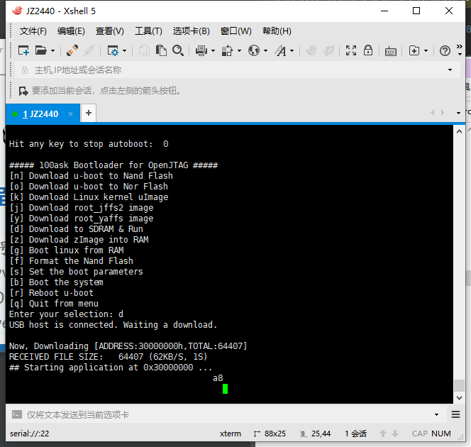
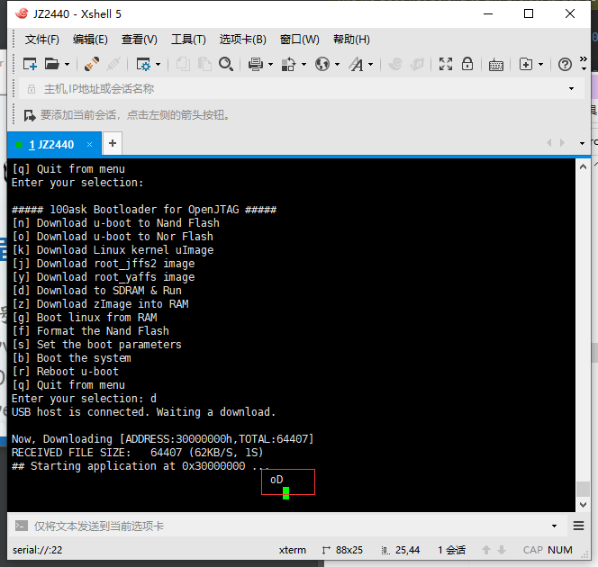

# （三十一）移植内存分页到JZ2440


JZ2440用的芯片是SAMSUNG S3C2410，这东西是arm 920t的CPU。

arm官网上关于这款CPU的资料：

[ARM920T Technical Reference Manual](https://developer.arm.com/documentation/ddi0151/c/?lang=en)


## 1. 增加启动段

说白了就要把启动初始化代码放到最前面，内核部分放到0x3000e000以后，和之前保持一致。

修改链接脚本如下：

kernel_linker.ld

```ld
ENTRY(_start)

SECTIONS
{
    . = 0x30000000;
    .startup : {
        *(.text.startup)   /* 把启动段的代码放在这里，这样就能保证这些东西在最前面了 */
        *(.data.startup)
        *(.bss.startup)
    }
    . = 0x3000e000;        /* 内核段起始地址 */
    .text : { *(.text) }
    .data : { *(.data) }
    .bss : { *(.bss) }
    .drivers : {
        __drivers_start = .;
        KEEP(*(.drivers))
        __drivers_end = .;
    }
}

```

head.asm

```assembly
.section .text.startup

.global _start
.extern disable_watch_dog
.extern memsetup
.extern disable_watch_dog
.extern kernel_main

_start:
// 0x00：直接重启
    b   Reset

// 0x04：未定义异常处理
HandleUndef:
    b   HandleUndef

// 0x08：软件异常（用SWI指令打出来的）处理
HandleSWI:
    b   HandleSWI

// 0x0c: 指令预取终止导致的异常处理
HandlePrefetchAbort:
    b   HandlePrefetchAbort

// 0x10: 数据访问终止导致的异常处理
HandleDataAbort:
    b   HandleDataAbort

// 0x14: 保留，不使用
HandleNotUsed:
    b   HandleNotUsed

// 0x18: 中断异常处理
HandleIRQ:
    b   HandleIRQ

// 0x1c: 快中断模式的向量地址
HandleFIQ:
    b   HandleFIQ

Reset:
    ldr sp, =0x1000                     // 设置栈指针，调用C函数之前要设置栈，才有C语言运行环境
    bl  disable_watch_dog               // 关看门狗
    bl  memsetup                        // 设置存储控制器以使用SDRAM
    bl  copy_steppingstone_to_sdram     // 复制这部分资源代码到SDRAM中
    ldr pc, =on_sdram                   // 跳到SDRAM中继续执行
on_sdram:
    ldr sp, =0x30007000                 // 设置新栈
    bl  kernel_main
halt_loop:
    b   halt_loop

```

init.c

```c
//
// Created by huangcheng on 2024/7/21.
//

// 这个文件主要是配合head.asm对板子进行初始化，可以用SDRAM，不然加载不了内核
// 初始内存就4KB，只允许用4KB，要先完成这些设置，才能使用SDRAM
// 初始这块内存就是所谓的steppingstone

#include "../lib/type.h"

// 看门狗寄存器地址
#define WTCON   (*(volatile uint32_t *)0x53000000)
#define WTDAT   (*(volatile uint32_t *)0x53000004)
#define WTCNT   (*(volatile uint32_t *)0x53000008)

// 关掉看门狗，不然看门狗会让板子直接重启
void disable_watch_dog(void) __attribute__((section(".text.startup")));
void disable_watch_dog(void) {
    WTCON = 0;  // 关闭看门狗，往这个寄存器写0即可
}

// 设置存储控制器，才能使用SDRAM
void memsetup(void) __attribute__((section(".text.startup")));
void memsetup(void) {
    volatile uint32_t *p = (volatile uint32_t *)(0x48000000);

    // 存储控制器设置
    p[0] = 0x22011110;     // BWSCON
    p[1] = 0x00000700;     // BANKCON0
    p[2] = 0x00000700;     // BANKCON1
    p[3] = 0x00000700;     // BANKCON2
    p[4] = 0x00000700;     // BANKCON3
    p[5] = 0x00000700;     // BANKCON4
    p[6] = 0x00000700;     // BANKCON5
    p[7] = 0x00018005;     // BANKCON6
    p[8] = 0x00018005;     // BANKCON7

    /* 韦东山老师的源代码里面给的刷新率数据是：
     * HCLK=12MHz:  0x008C07A3,
     * HCLK=100MHz: 0x008C04F4
     * 他用的是100MHz，我就不改了
     */
    p[9]  = 0x008C04F4;
    p[10] = 0x000000B1;     // BANKSIZE
    p[11] = 0x00000030;     // MRSRB6
    p[12] = 0x00000030;     // MRSRB7
}

// 把4KB的这部分资源复制到SDRAM去
void copy_steppingstone_to_sdram(void) __attribute__((section(".text.startup")));
void copy_steppingstone_to_sdram(void) {
    uint32_t *pdwSrc  = (uint32_t *)0;
    uint32_t *pdwDest = (uint32_t *)0x30000000;

    while (pdwSrc < (uint32_t *)0x1000) {
        *pdwDest = *pdwSrc;
        pdwDest++;
        pdwSrc++;
    }
}

```

其他的就不用变，内核的部分就被移到0x3000e000以后了。


## 1. 移植内存分页

arm v4T架构和arm v7架构的内存分页有一些不同。

- 没有TTBR0和TTBR1之分，只有一个单独的TTBR（读写方式同arm v7的TTBR0）
- 因为没有两个TTBR，所以也没有TTBCR
- 不支持dsb指令，需要手动实现dsb
- 一级页表和二级页表的格式和arm v7中略有不同

具体直接看代码：

paging_ops.asm

```assembly
.section .text

.global load_page_directory
.global get_current_page
.global get_sctlr
.global set_sctlr
.global get_dacr
.global set_dacr
.global invalidate_tlbs

// x86的C调用约定完全通过栈传参
// arm不一样，前四个参数通过r0到r3四个寄存器传参，多余的参数通过栈传参
// 第一个参数就是r0
// 所以直接加载就行了

// void load_page_directory(uint32_t page_directory_addr);
load_page_directory:
    // 设置TTBR
    mcr p15, 0, r0, c2, c0, 0    // 设置TTBR，r0包含页表基地址
    bx lr                        // 返回调用者

// uint32_t get_current_page(void);
get_current_page:
    mrc p15, 0, r0, c2, c0, 0    // 读取TTBR寄存器
    bx lr

// 获取SCTLR寄存器的值并存储到结构体中
// void get_sctlr(SCTLR_t *sctlr);
get_sctlr:
    // 读取SCTLR寄存器的值到r1
    mrc p15, 0, r1, c1, c0, 0
    // 将r1的值存储到结构体中
    str r1, [r0]
    // 返回
    bx lr

// 从结构体中读取并设置SCTLR寄存器的值
// void set_sctlr(SCTLR_t *sctlr);
set_sctlr:
    // 从结构体中加载值到r1
    ldr r1, [r0]
    // 将r1的值写入SCTLR寄存器
    mcr p15, 0, r1, c1, c0, 0
    // 返回
    bx lr

// 获取DACR寄存器的值并存储到结构体中
// void get_dacr(DACR_t *dacr);
get_dacr:
    // 读取DACR寄存器的值到r1
    mrc p15, 0, r1, c3, c0, 0
    // 将r1的值存储到结构体中
    str r1, [r0]
    // 返回
    bx lr

// 从结构体中读取并设置DACR寄存器的值
// void set_dacr(DACR_t *dacr);
set_dacr:
    // 从结构体中加载值到r1
    ldr r1, [r0]
    // 将r1的值写入DACR寄存器
    mcr p15, 0, r1, c3, c0, 0
    // 返回
    bx lr

// 刷新TLB，使TLB无效
invalidate_tlbs:
    mov r2, #0
    mcr p15, 0, r2, c8, c7, 0    // 使TLB无效
    mcr p15, 0, r2, c7, c10, 4   // 数据同步屏障（DSB）
    bx lr

```


kernel_page.h

```c
//
// Created by huangcheng on 2024/5/23.
//

#ifndef HOS_KERNEL_PAGE_H
#define HOS_KERNEL_PAGE_H

#include "../../lib/lib_kernel/lib_kernel.h"

// JZ2440用的CPU是SAMSUNG S3C2410
// 架构是arm v4T架构，和arm v7架构很不一样
// 主要是粗页表和段页表的结构要改，而且arm v4T也没有超级段这种东西
// 其次是根本没有TTBCR，这部分完全可以取消掉

// 一级页表的资料
//https://developer.arm.com/documentation/ddi0151/c/memory-management-unit/address-translation/level-one-descriptor?lang=en

// 粗页表
typedef struct {
    uint32_t DescriptorType :2;            // 位0-1: 描述符类型，粗页表为1（二进制为01）
    uint32_t ShouldBeZero : 2;             // 位2-3: 必须为0
    uint32_t ShouldBeOne : 1;              // 位4: 必须为1
    uint32_t Domain : 4;                   // 位5-8: 域，用作内存保护机制，16个可能的域
    uint32_t ShouldBeZero2 : 1;            // 位9: 必须为0
    uint32_t BaseAddress : 22;             // 位10-31: 页表基地址，必须1KB对齐（地址右移10位）
} CoarsePageTableEntry;

// 段描述符
typedef struct {
    uint32_t DescriptorType :2;            // 位0-1: 描述符类型，段描述符为2（二进制为10）
    uint32_t Bufferable : 1;               // 位2: 缓冲位
    uint32_t Cacheable : 1;                // 位3: 缓存位
    uint32_t ShouldBeOne : 1;              // 位4: 必须为1
    uint32_t Domain : 4;                   // 位5-8: 域，用作内存保护机制，16个可能的域
    uint32_t ShouldBeZero : 1;             // 位9: 必须为0
    uint32_t AccessPermission : 2;         // 位10-11: 访问权限位1:0（0是禁止任何访问，1是特权读写，2是特权读写用户只读，3是全权）
    uint32_t ShouldBeZero2 : 8;            // 位12-19： 必须为0
    uint32_t BaseAddress : 12;             // 位20-31: 段基地址，必须1MB对齐（地址右移20位）
} SectionDescriptor;

// 关于AP：0是禁止任何访问，1是特权读写，2是特权读写用户只读，3是特权和用户都是全权

// 在 ARMv7 架构中，域 (Domain) 是一种访问控制机制，用于管理对内存的访问。
// 每个域包含一组页表条目，系统可以对这些域施加不同的访问控制策略。
// 域访问控制寄存器 (DACR) 用于控制每个域的访问权限。
// 每个域可以设置为以下三种状态之一：
// 1. No Access (无访问权限): 任何尝试访问该域的内存都会导致访问权限错误。
// 2. Client (客户端): 访问权限由页表条目的访问权限字段决定。
// 3. Manager (管理): 允许对该域的所有访问，无需检查页表条目的访问权限字段。
// 每个页目录项包含一个 4 位的域字段，这个字段用于指定页表条目所属的域。域的数量最多为 16 (0-15)。

// 域控制器用结构体位域的表示方法
typedef struct {
    uint32_t domain0  : 2;  // 0，二进制00，无访问权；1，二进制01，Client，由页表条目的访问权限字段决定；3，二进制11，Manager，允许对该域所有访问，完全不检查权限
    uint32_t domain1  : 2;  // 0，二进制00，无访问权；1，二进制01，Client，由页表条目的访问权限字段决定；3，二进制11，Manager，允许对该域所有访问，完全不检查权限
    uint32_t domain2  : 2;  // 0，二进制00，无访问权；1，二进制01，Client，由页表条目的访问权限字段决定；3，二进制11，Manager，允许对该域所有访问，完全不检查权限
    uint32_t domain3  : 2;  // 0，二进制00，无访问权；1，二进制01，Client，由页表条目的访问权限字段决定；3，二进制11，Manager，允许对该域所有访问，完全不检查权限
    uint32_t domain4  : 2;  // 0，二进制00，无访问权；1，二进制01，Client，由页表条目的访问权限字段决定；3，二进制11，Manager，允许对该域所有访问，完全不检查权限
    uint32_t domain5  : 2;  // 0，二进制00，无访问权；1，二进制01，Client，由页表条目的访问权限字段决定；3，二进制11，Manager，允许对该域所有访问，完全不检查权限
    uint32_t domain6  : 2;  // 0，二进制00，无访问权；1，二进制01，Client，由页表条目的访问权限字段决定；3，二进制11，Manager，允许对该域所有访问，完全不检查权限
    uint32_t domain7  : 2;  // 0，二进制00，无访问权；1，二进制01，Client，由页表条目的访问权限字段决定；3，二进制11，Manager，允许对该域所有访问，完全不检查权限
    uint32_t domain8  : 2;  // 0，二进制00，无访问权；1，二进制01，Client，由页表条目的访问权限字段决定；3，二进制11，Manager，允许对该域所有访问，完全不检查权限
    uint32_t domain9  : 2;  // 0，二进制00，无访问权；1，二进制01，Client，由页表条目的访问权限字段决定；3，二进制11，Manager，允许对该域所有访问，完全不检查权限
    uint32_t domain10 : 2;  // 0，二进制00，无访问权；1，二进制01，Client，由页表条目的访问权限字段决定；3，二进制11，Manager，允许对该域所有访问，完全不检查权限
    uint32_t domain11 : 2;  // 0，二进制00，无访问权；1，二进制01，Client，由页表条目的访问权限字段决定；3，二进制11，Manager，允许对该域所有访问，完全不检查权限
    uint32_t domain12 : 2;  // 0，二进制00，无访问权；1，二进制01，Client，由页表条目的访问权限字段决定；3，二进制11，Manager，允许对该域所有访问，完全不检查权限
    uint32_t domain13 : 2;  // 0，二进制00，无访问权；1，二进制01，Client，由页表条目的访问权限字段决定；3，二进制11，Manager，允许对该域所有访问，完全不检查权限
    uint32_t domain14 : 2;  // 0，二进制00，无访问权；1，二进制01，Client，由页表条目的访问权限字段决定；3，二进制11，Manager，允许对该域所有访问，完全不检查权限
    uint32_t domain15 : 2;  // 0，二进制00，无访问权；1，二进制01，Client，由页表条目的访问权限字段决定；3，二进制11，Manager，允许对该域所有访问，完全不检查权限
} DACR_t;

// 获取DACR寄存器的值并存储到结构体中，paging_ops.asm
extern void get_dacr(DACR_t *dacr);
// 从结构体中读取并设置DACR寄存器的值，paging_ops.asm
extern void set_dacr(DACR_t *dacr);

// ARM 二级页表（分大页、小页、细页三种，大页64KB，小页4KB，细页1KB，细页现在基本上不用了）

// 二级页表的资料
//https://developer.arm.com/documentation/ddi0151/c/memory-management-unit/address-translation/level-two-descriptor?lang=en

// 大页，64KB
typedef struct {
    uint32_t PageType : 2;                     // 位0-1: 页类型，大页为1（二进制为01）
    uint32_t Bufferable : 1;                   // 位2: 缓冲位
    uint32_t Cacheable : 1;                    // 位3: 缓存位
    uint32_t AccessPermission0 : 2;            // 位4-5: 第一个4KB的访问权限，以此类推
    uint32_t AccessPermission1 : 2;            // 位6-8: 从上类推
    uint32_t AccessPermission2 : 2;            // 位9-10: 从上类推
    uint32_t AccessPermission3 : 2;            // 位10-11: 从上类推
    uint32_t ShouldBeZero : 4;                 // 位12-15: 应为0
    uint32_t BaseAddress : 16;                 // 位16-31: 大页基地址，必须64KB对齐（地址右移16位）
} LargePageDescriptor;

// 小页，4KB
typedef struct {
    uint32_t PageType : 2;                     // 位0-1: 页类型，小页为2（二进制为10）
    uint32_t Bufferable : 1;                   // 位2: 缓冲位
    uint32_t Cacheable : 1;                    // 位3: 缓存位
    uint32_t AccessPermission0 : 2;            // 位4-5: 第一个1KB的访问权限，以此类推
    uint32_t AccessPermission1 : 2;            // 位6-8: 从上类推
    uint32_t AccessPermission2 : 2;            // 位9-10: 从上类推
    uint32_t AccessPermission3 : 2;            // 位10-11: 从上类推
    uint32_t BaseAddress : 20;                 // 位12-31: 小页基地址，必须4KB对齐（地址右移12位）
} SmallPageDescriptor;

// 这个看s3c24xx.h可以看到

#define DRAM_OFFSET 0x30000000          // 内存偏移地址

#define PAGE_DIR_TABLE_POS 0x100000     // 页目录表的起始物理地址

#define PAGE_TABLE_ENTRIES 256          // 每个页表中的页表项数量
#define PAGE_DIR_ENTRIES 4096           // 页目录中的页目录项数量

// Linux分三个域，我只分两个（域只是个编号，没有高低之分，区分开就行）
#define KERNEL_DOMAIN 0     // 内核域
#define USER_DOMAIN 15      // 用户域

// 定义SCTLR寄存器的结构体
typedef struct {
    unsigned int M : 1;             // 位0: 内存控制位：0表示禁用MMU或MPU，1表示启用
    unsigned int A : 1;             // 位1: 对齐检查使能位：0表示禁用对齐故障检查，1表示启用
    unsigned int C : 1;             // 位2: 缓存使能位：0表示禁用数据和统一缓存，1表示启用
    unsigned int W : 1;             // 位3: 写缓冲区使能位：0表示禁用写缓冲区，1表示启用
    unsigned int reserved1 : 3;     // 位4-6: 保留，RAO/SBOP
    unsigned int B : 1;             // 位7: 大小端配置位：0表示小端，1表示大端（BE-32）
    unsigned int S : 1;             // 位8: 系统保护位，向后兼容
    unsigned int R : 1;             // 位9: ROM保护位，向后兼容
    unsigned int F : 1;             // 位10: 实现定义
    unsigned int Z : 1;             // 位11: 分支预测使能位：0表示禁用，1表示启用
    unsigned int I : 1;             // 位12: 指令缓存使能位：0表示禁用，1表示启用
    unsigned int V : 1;             // 位13: 向量表基址选择位：0表示0x00000000，1表示0xFFFF0000
    unsigned int RR : 1;            // 位14: 轮替策略选择位：0表示普通替换策略，1表示可预测策略
    unsigned int L4 : 1;            // 位15: ARMv5T Thumb互操作行为抑制位
    unsigned int reserved2 : 16;    // 位16-31: 保留
} SCTLR_t;

// 获取SCTLR寄存器的值并存储到结构体中，paging_ops.asm
extern void get_sctlr(SCTLR_t *sctlr);
// 从结构体中读取并设置SCTLR寄存器的值，paging_ops.asm
extern void set_sctlr(SCTLR_t *sctlr);

// 刷新TLB，使TLB无效
extern void invalidate_tlbs();

// 内存分页功能初始化
void init_paging();


#endif //HOS_KERNEL_PAGE_H

```


kernel_page.c

```c
//
// Created by huangcheng on 2024/5/23.
//

#include "kernel_page.h"

// 注意，和x86不同的是，页目录表是4096条，需要16KB，也就是0x4000

void setup_page_directory() {

    SectionDescriptor *page_directory = (SectionDescriptor *)(PAGE_DIR_TABLE_POS + DRAM_OFFSET);

    // 清空整个页目录表（4096条，要16KB）
    memset(page_directory, 0, 0x4000);

    // 根据s3c24xx.h，低端映射范围至少包括到0x560
    // 我也实在没搞清楚它到底映射范围多大，所以扩大一点到0x600
    for(uint32_t i = 0; i < 0x600; i++) {
        page_directory[i].DescriptorType = 2;
        page_directory[i].Bufferable = 1;
        page_directory[i].Cacheable = 1;
        page_directory[i].ShouldBeOne = 1;
        page_directory[i].Domain = KERNEL_DOMAIN;
        page_directory[i].ShouldBeZero = 0;
        page_directory[i].AccessPermission = 3;
        page_directory[i].ShouldBeZero2 = 0;
        page_directory[i].BaseAddress = i;
    }


    // 1条页表放高端1MB映射
    // 从0xc0000000开始
    page_directory[0xc00].DescriptorType = 2;
    page_directory[0xc00].Bufferable = 1;
    page_directory[0xc00].Cacheable = 1;
    page_directory[0xc00].ShouldBeOne = 1;
    page_directory[0xc00].Domain = KERNEL_DOMAIN;
    page_directory[0xc00].ShouldBeZero = 0;
    page_directory[0xc00].AccessPermission = 3;
    page_directory[0xc00].ShouldBeZero2 = 0;
    page_directory[0xc00].BaseAddress = (DRAM_OFFSET >> 20);


    // 增加自引用（偷懒所以用段描述符，实际上为了权限控制的话，应该用粗页表，把范围定死在这16KB里面）
    // 这样访问的地址就是0xfff00000
    // 但是注意，范围很大，有1MB，别越界
    page_directory[0xfff].DescriptorType = 2;
    page_directory[0xfff].Bufferable = 1;
    page_directory[0xfff].Cacheable = 1;
    page_directory[0xfff].ShouldBeOne = 1;
    page_directory[0xfff].Domain = KERNEL_DOMAIN;
    page_directory[0xfff].ShouldBeZero = 0;
    page_directory[0xfff].AccessPermission = 3;
    page_directory[0xfff].ShouldBeZero2 = 0;
    page_directory[0xfff].BaseAddress = ((PAGE_DIR_TABLE_POS + DRAM_OFFSET) >> 20);

}

void init_paging() {
    // 设置页目录表
    setup_page_directory();

    // 先禁用MMU
    // 获取当前SCTLR寄存器值
    SCTLR_t sctlr;
    get_sctlr(&sctlr);
    // 禁用MMU
    sctlr.M = 0; // 禁用MMU
    sctlr.A = 0; // 禁用对齐检查
    sctlr.C = 0; // 禁用数据缓存
    // 更新SCTLR寄存器
    set_sctlr(&sctlr);

    // 域控制器设置
    DACR_t dacr;
    memset(&dacr, 0, sizeof(DACR_t));
    // 实测，一旦开启权限检查
    // 用粗页表和小页表的二级映射体系直接无法写，只能读
    // 为了避免权限问题，只能一律全权
    dacr.domain0 = 3;
    dacr.domain15 = 3;
    set_dacr(&dacr);

    // 载入页目录表
    load_page_directory(PAGE_DIR_TABLE_POS + DRAM_OFFSET);

    // 无效化TLB
    invalidate_tlbs();

    // 启用MMU
    get_sctlr(&sctlr);
    sctlr.M = 1; // 启用MMU
    sctlr.A = 1; // 启用对齐检查
    sctlr.C = 1; // 启用数据缓存
    // 更新SCTLR寄存器
    set_sctlr(&sctlr);
}

```

说明一下，SCTLR的结构我没找到。。。所以我也不敢乱动，但是能确认的是前三个是一样的，其他我就不动了。

修改Makefile，编译链接发送到板子上运行即可。


## 2. 运行效果

kernel.c

```c
//
// Created by huangcheng on 2024/6/24.
//

#include "../lib/lib_kernel/lib_kernel.h"
#include "../kernel/kernel_page/kernel_page.h"

/*GPIO registers*/
#define GPBCON              (*(volatile unsigned long *)0x56000010)
#define GPBDAT              (*(volatile unsigned long *)0x56000014)

#define GPFCON              (*(volatile unsigned long *)0x56000050)
#define GPFDAT              (*(volatile unsigned long *)0x56000054)
#define GPFUP               (*(volatile unsigned long *)0x56000058)

#define GPGCON              (*(volatile unsigned long *)0x56000060)
#define GPGDAT              (*(volatile unsigned long *)0x56000064)
#define GPGUP               (*(volatile unsigned long *)0x56000068)

#define GPHCON              (*(volatile unsigned long *)0x56000070)
#define GPHDAT              (*(volatile unsigned long *)0x56000074)
#define GPHUP               (*(volatile unsigned long *)0x56000078)

/*UART registers*/
#define ULCON0              (*(volatile unsigned long *)0x50000000)
#define UCON0               (*(volatile unsigned long *)0x50000004)
#define UFCON0              (*(volatile unsigned long *)0x50000008)
#define UMCON0              (*(volatile unsigned long *)0x5000000c)
#define UTRSTAT0            (*(volatile unsigned long *)0x50000010)
#define UTXH0               (*(volatile unsigned char *)0x50000020)
#define URXH0               (*(volatile unsigned char *)0x50000024)
#define UBRDIV0             (*(volatile unsigned long *)0x50000028)

#define TXD0READY   (1<<2)
#define RXD0READY   (1)

#define PCLK            50000000    // 设置时钟频率
#define UART_CLK        PCLK        // UART0的时钟源设为PCLK
#define UART_BAUD_RATE  115200      // 波特率
#define UART_BRD        ((UART_CLK  / (UART_BAUD_RATE * 16)) - 1)

/*
 * 初始化UART0
 * 115200,8N1,无流控
 */
void uart0_init(void) {
    GPHCON  |= 0xa0;    // GPH2,GPH3用作TXD0,RXD0
    GPHUP   = 0x0c;     // GPH2,GPH3内部上拉

    ULCON0  = 0x03;     // 8N1(8个数据位，无较验，1个停止位)
    UCON0   = 0x05;     // 查询方式，UART时钟源为PCLK
    UFCON0  = 0x00;     // 不使用FIFO
    UMCON0  = 0x00;     // 不使用流控
    UBRDIV0 = UART_BRD; // 波特率为115200
}


void kernel_main(void) {
    uart0_init();   // 波特率115200，8N1(8个数据位，无校验位，1个停止位)
    // 内存分页初始化
    init_paging();
    // 重新加载内核栈
    switch_sp(0xc0007000);

    // 测试分页后能不能用
    *((uint32_t *)0x30004000) = 0x12345678;
    put_int(*((uint32_t *)0xc0004000));
    put_char('\n');

    for(;;);
}

```

运行结果为：



奇了怪了，为什么打印了一个a，出现好多次了，又只打印了最后的数字8？

换一个数字再试试

```c
    *((uint32_t *)0x30004000) = 0xabcd;
```



麻了，看起来能用是能用，就是只能打印数字的最后一个字符。。。。

也不知道这串口通信到底是什么问题，尽量早点实现LCD驱动吧，打在LCD屏幕上应该就没这问题了。