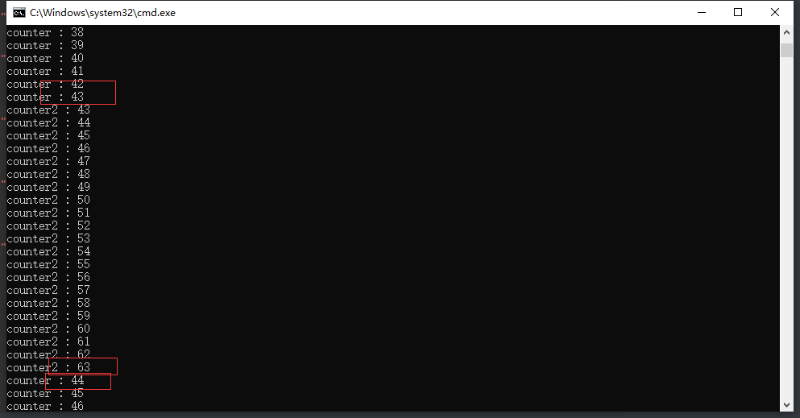
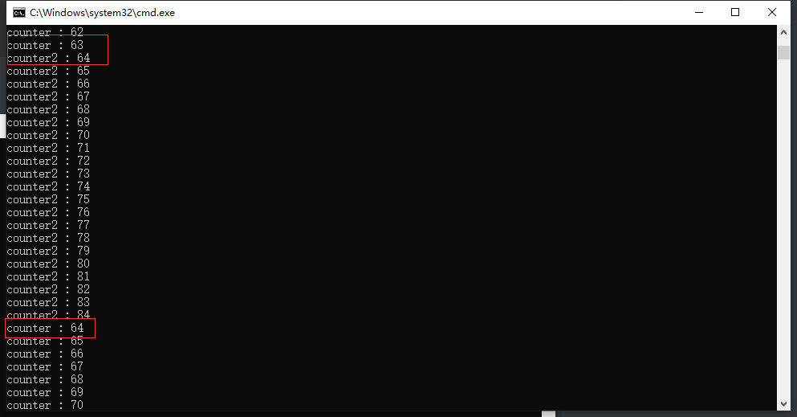
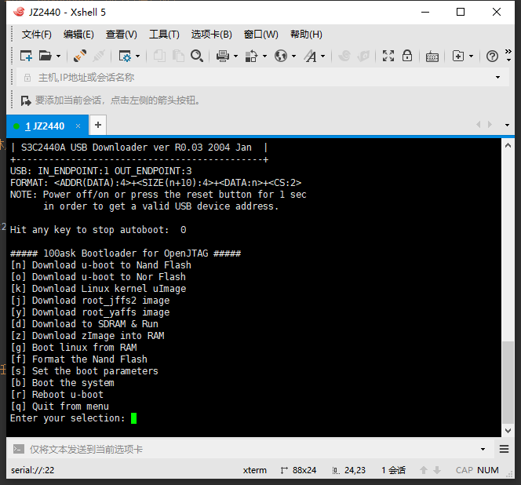
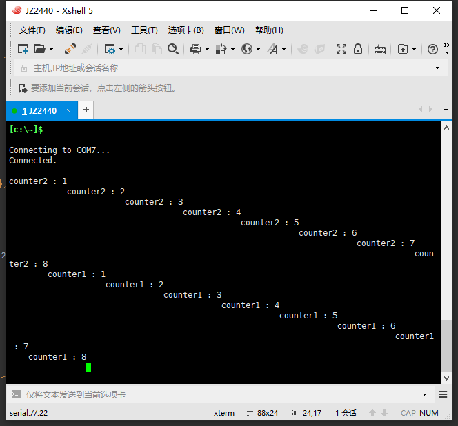

# （三十三）移植内存管理和多任务（部分成功）


说是部分成功，在虚拟机上是完全成功了，但是在板子上也不知道咋回事，居然只能切换一轮，无法再次执行第二次，人都麻了。

一言难尽，放到后面说。

## 0. 多任务关键问题修正

怪我自己从小到大不细心，这么久才发现问题。

Program_arm下的kernel_task文件夹的switch_to.asm

```assembly
.section .text
.global switch_to

// 按照arm上C的调用约定
// r0是cur_task
// r1是next_task

switch_to:
    // 先前是在irq模式中运行task_switch函数的
    // 由于每次进入irq模式都统一栈地址，所以也不需要清理了
    // 每个任务中断时的信息都必须保存在其内核栈中
    cps     #0x13               // 切换到管理模式，使用当前任务的内核栈

    // 因为task_yield和task_block都手动switch，而且都还用了新栈（其实就是懒得清理）
    // 用0xc0008080保存了栈地址，所以要从中取值

    ldr     r4, =0xc0008080    // 加载地址0xc0008080到r4
    ldr     r5, [r4]           // 加载地址0xc0008080处的值到r5
    cmp     r5, #0             // 比较r5和0
    beq     continue_switch_to // 如果r5为0，跳转到continue_switch_to
    mov     sp, r5             // 如果r5不为0，将r5的值加载到sp
    mov     r5, #0             // 将0加载到r5
    str     r5, [r4]           // 将0存储到地址0xc0008080

continue_switch_to:
    // 之前IRQ栈中有任务发生时状态的相关信息，直接将其复制过来然后压栈到内核栈
    // 经过先前的执行，寄存器的值可能和任务中断时的不同了
    // 所以才要考虑从IRQ栈里面取，而不是直接push

    // 统一使用高端映射（如果是进程的话，用的页表里面肯定没有内核的低端部分）
    // 统一用地址，出错好检查

    ldr     r4, =0xc0007fc4     // lr寄存器
    ldr     r5, [r4]
    push    {r5}

    ldr     r4, =0xc0007fc8     // 中断前的cpsr寄存器
    ldr     r5, [r4]
    push    {r5}

    ldr     r4, =0xc0007ffc     // r12寄存器
    ldr     r5, [r4]
    push    {r5}

    ldr     r4, =0xc0007ff8     // r11寄存器
    ldr     r5, [r4]
    push    {r5}

    ldr     r4, =0xc0007ff4     // r10寄存器
    ldr     r5, [r4]
    push    {r5}

    ldr     r4, =0xc0007ff0     // r9寄存器
    ldr     r5, [r4]
    push    {r5}

    ldr     r4, =0xc0007fec     // r8寄存器
    ldr     r5, [r4]
    push    {r5}

    ldr     r4, =0xc0007fe8     // r7寄存器
    ldr     r5, [r4]
    push    {r5}

    ldr     r4, =0xc0007fe4     // r6寄存器
    ldr     r5, [r4]
    push    {r5}

    ldr     r4, =0xc0007fe0     // r5寄存器
    ldr     r5, [r4]
    push    {r5}

    ldr     r4, =0xc0007fdc     // r4寄存器
    ldr     r5, [r4]
    push    {r5}

    ldr     r4, =0xc0007fd8     // r3寄存器
    ldr     r5, [r4]
    push    {r5}

    ldr     r4, =0xc0007fd4     // r2寄存器
    ldr     r5, [r4]
    push    {r5}

    ldr     r4, =0xc0007fd0     // r1寄存器
    ldr     r5, [r4]
    push    {r5}

    ldr     r4, =0xc0007fcc     // r0寄存器
    ldr     r5, [r4]
    push    {r5}

    // 保存任务环境之后就该更新栈指针（task结构体的self_stack字段，栈顶指针）
    str sp, [r0]                // str是将数据存储到内存地址，mov是寄存器之间传递数据

// ------------------  以上是备份当前任务的环境，下面是恢复下一个任务的环境  ----------------

    ldr sp, [r1]                // ldr是将数据从内存地址加载到寄存器

    pop     {r0-r9}             // 恢复这10个通用寄存器，剩下的三个有用

    // 用内核的高端映射部分，这部分是所有进程（包括内核）共享的资源，肯定都能用

    ldr     r11, =0xc0008000    // 保存r10寄存器
    pop     {r12}
    str     r12, [r11]

    ldr     r11, =0xc0008004    // 保存r11寄存器
    pop     {r12}
    str     r12, [r11]

    ldr     r11, =0xc0008008    // 保存r12寄存器
    pop     {r12}
    str     r12, [r11]

    pop     {r10}               // cpsr

    ldr     r11, =0xc000800c    // 保存lr寄存器
    pop     {r12}
    str     r12, [r11]

    ldr     r11, =0xc0008010    // 保存sp寄存器
    str     sp, [r11]

    // sp和lr都是模式变动就会失效，每个模式都有自己独立的sp和lr，只有通用寄存器不会失效
    // 所以必须重设cpsr之后，才能恢复sp和lr
    msr     cpsr_cxsf, r10       // 恢复下一个任务的cpsr

    // 恢复sp和lr
    ldr     r11, =0xc000800c    // 恢复lr寄存器
    ldr     r12, [r11]
    mov     lr, r12

    ldr     r11, =0xc0008010    // 恢复sp寄存器（目前想法是进程一样用内核栈，不再单独开设用户进程栈了，所以这么做）
    ldr     r12, [r11]
    mov     sp, r12

    ldr     r11, =0xc0008000    // 恢复r10寄存器
    ldr     r10, [r11]

    ldr     r11, =0xc0008004    // 恢复r11寄存器
    ldr     r11, [r11]

    ldr     r12, =0xc0008008    // 恢复r12寄存器
    ldr     r12, [r12]

    sub     pc, lr, #4          // 返回中断前的位置（不能用subs，那样会恢复spsr的值到cpsr，之前我们已经手动恢复cpsr了，所以不能这么做）

```

问题在于最后一句。

然后是相应改动的kernel_task.c

```c
// 阻塞当前调用的任务，并修改任务为指定状态（如果想不调度，就挂起、阻塞、等待）
void task_block(enum task_status stat) {
    // 为了配合新的switch_to函数
    // 要在这里保存上下文到指定位置，也就是IRQ栈位置（这里没进入中断，只能手动更新，不然就是先前的）
    // 不能调用函数，怕lr改变，只能用内联汇编写
    // 因为怕cpsr的条件状态改变，所以直接ldr，这样不会有条件状态位改变的问题
    // 进入这里的时候，lr保存的位置是调用task_yield命令的下一条（也就是pc + 4）
    // 因为切换命令是subs    pc, lr, #4，就会无限进入task_yield
    // 所以需要修改，再增加一个偏移量
    // 因为进入switch_to之前会经过几个函数，有不少临时变量都在栈上
    // 也可以直接用新的栈，每次都是新栈，这样就不怕出事了，类似于irq_handler，而且还不用清理

    // 这里先记录到约定位置，注意arm的C语言调用约定寄存器传参问题
    asm volatile("push  {r12}\n"
                 "ldr   r12, =0xc0007ff8\n"
                 "str   r11, [r12]\n"
                 "ldr   r12, =0xc0007ff4\n"
                 "str   r10, [r12]\n"
                 "ldr   r12, =0xc0007ff0\n"
                 "str   r9, [r12]\n"
                 "ldr   r12, =0xc0007fec\n"
                 "str   r8, [r12]\n"
                 "ldr   r12, =0xc0007fe8\n"
                 "str   r7, [r12]\n"
                 "ldr   r12, =0xc0007fe4\n"
                 "str   r6, [r12]\n"
                 "ldr   r12, =0xc0007fe0\n"
                 "str   r5, [r12]\n"
                 "ldr   r12, =0xc0007fdc\n"
                 "str   r4, [r12]\n"
                 "ldr   r12, =0xc0007fd8\n"
                 "str   r3, [r12]\n"
                 "ldr   r12, =0xc0007fd4\n"
                 "str   r2, [r12]\n"
                 "ldr   r12, =0xc0007fd0\n"
                 "str   r1, [r12]\n"
                 "ldr   r12, =0xc0007fcc\n"
                 "str   r0, [r12]\n"
                 "ldr   r11, =0xc0007ffc\n"
                 "pop   {r12}\n"
                 "str   r12, [r11]\n"
                 "ldr   r12, =0xc0007fc8\n"
                 "mrs   r11, cpsr\n"
                 "str   r11, [r12]\n"
                 "ldr   r12, =0xc0007fc4\n"
                 "add   r11, lr, #4\n"
                 "str   r11, [r12]\n"
                 "ldr   r12, =0xc0008080\n"
                 "str   sp, [r12]\n"
                 "ldr   sp, =0xc0007800\n"
    );

    // 其他不变
}

// 让出CPU时间，但不阻塞
void task_yield() {
    // 为了配合新的switch_to函数
    // 要在这里保存上下文到指定位置，也就是IRQ栈位置（这里没进入中断，只能手动更新，不然就是先前的）
    // 不能调用函数，怕lr改变，只能用内联汇编写
    // 因为怕cpsr的条件状态改变，所以直接ldr，这样不会有条件状态位改变的问题
    // 进入这里的时候，lr保存的位置是调用task_yield命令的下一条（也就是pc + 4）
    // 因为切换命令是subs    pc, lr, #4，就会无限进入task_yield
    // 所以需要修改，再增加一个偏移量
    // 因为进入switch_to之前会经过几个函数，有不少临时变量都在栈上
    // 也可以直接用新的栈，每次都是新栈，这样就不怕出事了，类似于irq_handler，而且还不用清理

    // 这里先记录到约定位置，注意arm的C语言调用约定寄存器传参问题
    asm volatile("push  {r12}\n"
                 "ldr   r12, =0xc0007ff8\n"
                 "str   r11, [r12]\n"
                 "ldr   r12, =0xc0007ff4\n"
                 "str   r10, [r12]\n"
                 "ldr   r12, =0xc0007ff0\n"
                 "str   r9, [r12]\n"
                 "ldr   r12, =0xc0007fec\n"
                 "str   r8, [r12]\n"
                 "ldr   r12, =0xc0007fe8\n"
                 "str   r7, [r12]\n"
                 "ldr   r12, =0xc0007fe4\n"
                 "str   r6, [r12]\n"
                 "ldr   r12, =0xc0007fe0\n"
                 "str   r5, [r12]\n"
                 "ldr   r12, =0xc0007fdc\n"
                 "str   r4, [r12]\n"
                 "ldr   r12, =0xc0007fd8\n"
                 "str   r3, [r12]\n"
                 "ldr   r12, =0xc0007fd4\n"
                 "str   r2, [r12]\n"
                 "ldr   r12, =0xc0007fd0\n"
                 "str   r1, [r12]\n"
                 "ldr   r12, =0xc0007fcc\n"
                 "str   r0, [r12]\n"
                 "ldr   r11, =0xc0007ffc\n"
                 "pop   {r12}\n"
                 "str   r12, [r11]\n"
                 "ldr   r12, =0xc0007fc8\n"
                 "mrs   r11, cpsr\n"
                 "str   r11, [r12]\n"
                 "ldr   r12, =0xc0007fc4\n"
                 "add   r11, lr, #4\n"
                 "str   r11, [r12]\n"
                 "ldr   r12, =0xc0008080\n"
                 "str   sp, [r12]\n"
                 "ldr   sp, =0xc0007800\n"
    );

    // 其他不变
}

```

要改动的起始就是这里，增加了一个把sp存到指定位置的，这样就可以恢复相应的栈了。

效果如下：

kernel.c

```c
//
// Created by huangcheng on 2024/6/24.
//

#include "../lib/lib_kernel/lib_kernel.h"
#include "../kernel/kernel_page/kernel_page.h"
#include "../kernel/kernel_task/kernel_task.h"
#include "../kernel/kernel_interrupt/kernel_interrupt.h"
#include "../kernel/kernel_device/kernel_device.h"
#include "../devices/console/console.h"
#include "../devices/rtc_cmos/rtc_cmos.h"
void task_test(void *args);
void task_test2(void *args);
void kernel_main(void) {
    // u-boot已经给我们设置了管理模式
    // 一进来就已经是管理模式了

    // 页表初始化
    init_paging();

    // 因为覆盖了整个内存区域，所以还可以用u-boot的栈
    // 到这里再切换也没问题

    // 切换栈指针到虚拟地址，这样就可以顺利使用内核栈了
    switch_sp(0xc0007000);
    // 初始化task
    init_multitasking();
    // 初始化内存管理（本来这里应该从环境里面获取内存大小，我懒，直接写死了算了）
    init_memory(0x8000000);
    // 初始化中断管理和GIC
    init_interrupt();
    // 初始化设备驱动管理
    init_all_devices();

    // 创建一个任务，这个任务主要的作用是让CPU休息，进入低功耗状态
    task_create("task_idle", 31, task_idle, NULL);
    task_create("task_test", 16, task_test, NULL);
    task_create("task_test2", 16, task_test2, NULL);

    // 开启IRQ中断
    intr_enable();

    // 允许定时器中断
    enable_gic_irq_interrupt(30);

    for(;;) {
        // 内核没什么事就尽量让出CPU时间给其他任务，可不敢让内核wfi
        task_yield();
    }

    // 以防万一，退出时退出所有设备
    exit_all_devices();
}

void task_test(void *args) {
    uint32_t counter = 0;
    for (;;) {
        counter++;
        console_printf("counter : %d\n", counter);
        for(uint32_t i = 0; i < 32 * UINT16_MAX; i++);
    }
}

void task_test2(void *args) {
    uint32_t counter = 0;
    for (;;) {
        counter++;
        console_printf("counter2 : %d\n", counter);
        for(uint32_t i = 0; i < 32 * UINT16_MAX; i++);
    }
}

```

上qemu。





证明了这是完全可以用的，可以完美切换。


## 1. 移植多任务和内存管理

这个直接从更正后的Program_arm里面复制粘贴就行了。

需要修改的是，因为用不到RAMDISK，所以内存管理那部分删掉RAMDISK占用的16MB物理内存。其次是JZ2440的物理内存偏移地址是0x30000000，修改相应的地址就行了。还有就是，kernel_memory.c中建立映射的时候要把BC两个位禁用，这个在第三十二篇有说明原因。

kernel_task.c

```c
// 内核任务 TCB 的固定位置和栈位置（注意JZ2440的SDRAM偏移量是0x30000000）
#define KERNEL_TCB ((struct task*)0x3009f000)

```

kernel_memory.c

```c
// JZ2440的偏移量是0x30000000
// 基于此进行修改
// 映射的建立也要根据kernel_page.h中的页表结构进行修改

// 一页大小4096字节，4KB
#define PG_SIZE 0x1000

// 全局物理地址位图结构地址
#define GLOBAL_BITMAP_PHYSICAL_ADDR 0x3009f800
// 全局物理地址位图基址（因为arm的一级页表占0x4000，现在又没有二级页表）
#define GLOBAL_BITMAP_PHYSICAL_BASE 0x30104000
// 管理4G内存时位图占据的内存最大长度（128KB）
#define GLOBAL_BITMAP_PHYSICAL_BYTE_LENGTH 0x20000

// 内核虚拟地址起点（注意，和x86一样，1MB以下全部被内核使用了，无法再用做堆内存了）
#define KERNEL_VIRTUAL_ADDR_START 0xc0000000
// 内核虚拟地址位图基址
#define KERNEL_BITMAP_VIRTUAL_BASE 0x30124000
// 内核只占据高端1GB的内存，所以最多只需要32KB内存就行了
// GLOBAL_BITMAP_PHYSICAL_BYTE_LENGTH / 4 = 0x8000 即可
// 之前在x86中，因为多了1MB的问题，就把内核虚拟地址大小缩减到了512MB
// 可以直接设置为已经占据，这样起算就方便了
#define KERNEL_BITMAP_VIRTUAL_BYTE_LENGTH 0x4000

// 全局物理内存位图，结构在0x9f800处
BitMap *global_bitmap_physical_memory = (BitMap *)GLOBAL_BITMAP_PHYSICAL_ADDR;

// 页表、位图结束的地方，就是内核堆内存开始的地方（物理位置，放在0x130000这里开始是为了取整，这里不加上偏移量是为了位图计算）
#define KERNEL_PHYSICAL_ADDR_START 0x130000
// 相应地，怕不太够用，不然连几个内核任务都开不了，所以内核保留物理内存扩大到16MB
// 16MB，有超过14MB的空余内存。一个内核任务的TCB要一页也就是4KB
// 1MB可以开 1024 / 4 = 256个内核任务
// 这么多下来足够了

// 用户堆内存开始的地方就是内核堆内存结束的地方（物理位置，这里不加上偏移量是为了位图计算）
#define USER_PHYSICAL_ADDR_START 0x1000000

// 内核任务 TCB 的固定位置和栈位置
#define KERNEL_TCB ((struct task*)0x3009f000)

// 内存管理初始化
void init_memory(uint32_t total_physical_memory) {
    // 物理地址位图，一页是一位，一字节8位
    global_bitmap_physical_memory->bits = (uint8_t *)GLOBAL_BITMAP_PHYSICAL_BASE;
    global_bitmap_physical_memory->btmp_bytes_len = total_physical_memory / PG_SIZE / 8;
    bitmap_init(global_bitmap_physical_memory);
    // 物理地址上已经占据了的置为1
    // 低端1MB全部被内核占据了，还有页表、位图（按照上面取整，直接按0x130000计算，以下全部当作被占据）
    bitmap_set_range(global_bitmap_physical_memory, 0, 0x130000 / PG_SIZE, 1);

    // 虚拟地址管理的设置（内核虚拟地址写在线程的TCB里面）
    KERNEL_TCB->process_virtual_address.virtual_addr_start = KERNEL_VIRTUAL_ADDR_START;
    // 内核虚拟地址的地址
    KERNEL_TCB->process_virtual_address.bitmap_virtual_memory.bits = (uint8_t *)KERNEL_BITMAP_VIRTUAL_BASE;
    // 内核虚拟地址上限
    KERNEL_TCB->process_virtual_address.bitmap_virtual_memory.btmp_bytes_len = KERNEL_BITMAP_VIRTUAL_BYTE_LENGTH;
    // 初始化内核虚拟位图
    bitmap_init(&(KERNEL_TCB->process_virtual_address.bitmap_virtual_memory));
    // 设置最开始的1MB全部被内核占据了
    bitmap_set_range(&(KERNEL_TCB->process_virtual_address.bitmap_virtual_memory), 0, 0x100000 / PG_SIZE, 1);
}

// 添加映射
int8_t add_page_mapping(uint32_t virtual_address, uint32_t physical_address) {

    // 其他都一样，修改这里的BC两个位
    pte->PageType = 2;
    pte->Bufferable = 0;
    pte->Cacheable = 0;
    pte->AccessPermission0 = 3;
    pte->AccessPermission1 = 3;
    pte->AccessPermission2 = 3;
    pte->AccessPermission3 = 3;
    pte->BaseAddress = physical_address >> 12;  // 写入物理地址，建立映射

    return 1;
}

```

kernel_page.h中已经把DRAM_OFFSET改为了0x30000000，所以其他的就不需要修改了。

还有就是arm v4t架构不支持wfi指令，这个是arm v6才开始支持的。

task_idle.asm修改为

```asm
.section .text
.global task_idle

task_idle:
    // 因为GCC老是报处理器不支持处理器模式
    // 干脆直接写汇编
    mcr p15, 0, r0, c7, c0, 4   //arm v4T架构不支持直接的wfi指令，只能自己实现进入低功耗模式等待中断
    b task_idle
```


## 2. 移植中断管理

删掉了irq_handler.asm，这个放到启动设置那里去实现了。

kernel_interrupt.c

```c
//
// Created by huangcheng on 2024/5/27.
//

#include "kernel_interrupt.h"

// JZ2440用的是什么我也没搞清楚，看起来好像也不是GIC，或者是已经固定好的GIC
// 连哪个中断号代表什么中断都写好了
// 韦东山老师的例程有32个中断

/*interrupt registes*/
#define SRCPND              (*(volatile unsigned long *)0x4A000000)
#define INTMOD              (*(volatile unsigned long *)0x4A000004)
#define INTMSK              (*(volatile unsigned long *)0x4A000008)
#define PRIORITY            (*(volatile unsigned long *)0x4A00000c)
#define INTPND              (*(volatile unsigned long *)0x4A000010)
#define INTOFFSET           (*(volatile unsigned long *)0x4A000014)
#define SUBSRCPND           (*(volatile unsigned long *)0x4A000018)
#define INTSUBMSK           (*(volatile unsigned long *)0x4A00001c)

#define ISR_EINT0_OFT     0
#define ISR_EINT1_OFT     1
#define ISR_EINT2_OFT     2
#define ISR_EINT3_OFT     3
#define ISR_EINT4_7_OFT   4
#define ISR_EINT8_23_OFT  5
#define ISR_NOTUSED6_OFT  6
#define ISR_BAT_FLT_OFT   7
#define ISR_TICK_OFT      8
#define ISR_WDT_OFT       9
#define ISR_TIMER0_OFT    10
#define ISR_TIMER1_OFT    11
#define ISR_TIMER2_OFT    12
#define ISR_TIMER3_OFT    13
#define ISR_TIMER4_OFT    14
#define ISR_UART2_OFT     15
#define ISR_LCD_OFT       16
#define ISR_DMA0_OFT      17
#define ISR_DMA1_OFT      18
#define ISR_DMA2_OFT      19
#define ISR_DMA3_OFT      20
#define ISR_SDI_OFT       21
#define ISR_SPI0_OFT      22
#define ISR_UART1_OFT     23
#define ISR_NOTUSED24_OFT 24
#define ISR_USBD_OFT      25
#define ISR_USBH_OFT      26
#define ISR_IIC_OFT       27
#define ISR_UART0_OFT     28
#define ISR_SPI1_OFT      29
#define ISR_RTC_OFT       30
#define ISR_ADC_OFT       31


// PENDING BIT
#define BIT_EINT0		(0x1)
#define BIT_EINT1		(0x1<<1)
#define BIT_EINT2		(0x1<<2)
#define BIT_EINT3		(0x1<<3)
#define BIT_EINT4_7		(0x1<<4)
#define BIT_EINT8_23	(0x1<<5)
#define BIT_CAM			(0x1<<6)		// Added for 2440.
#define BIT_BAT_FLT		(0x1<<7)
#define BIT_TICK		(0x1<<8)
#define BIT_WDT_AC97	(0x1<<9)
#define BIT_TIMER0		(0x1<<10)
#define BIT_TIMER1		(0x1<<11)
#define BIT_TIMER2		(0x1<<12)
#define BIT_TIMER3		(0x1<<13)
#define BIT_TIMER4		(0x1<<14)
#define BIT_UART2		(0x1<<15)
#define BIT_LCD			(0x1<<16)
#define BIT_DMA0		(0x1<<17)
#define BIT_DMA1		(0x1<<18)
#define BIT_DMA2		(0x1<<19)
#define BIT_DMA3		(0x1<<20)
#define BIT_SDI			(0x1<<21)
#define BIT_SPI0		(0x1<<22)
#define BIT_UART1		(0x1<<23)
#define BIT_NFCON		(0x1<<24)		// Added for 2440.
#define BIT_USBD		(0x1<<25)
#define BIT_USBH		(0x1<<26)
#define BIT_IIC			(0x1<<27)
#define BIT_UART0		(0x1<<28)
#define BIT_SPI1		(0x1<<29)
#define BIT_RTC			(0x1<<30)
#define BIT_ADC			(0x1<<31)
#define BIT_ALLMSK		(0xffffffff)

#define BIT_SUB_ALLMSK	(0x7fff)
#define BIT_SUB_AC97 	(0x1<<14)
#define BIT_SUB_WDT 	(0x1<<13)
#define BIT_SUB_CAM_S	(0x1<<12)		// Added for 2440.
#define BIT_SUB_CAM_C	(0x1<<11)		// Added for 2440.
#define BIT_SUB_ADC		(0x1<<10)
#define BIT_SUB_TC		(0x1<<9)
#define BIT_SUB_ERR2	(0x1<<8)
#define BIT_SUB_TXD2	(0x1<<7)
#define BIT_SUB_RXD2	(0x1<<6)
#define BIT_SUB_ERR1	(0x1<<5)
#define BIT_SUB_TXD1	(0x1<<4)
#define BIT_SUB_RXD1	(0x1<<3)
#define BIT_SUB_ERR0	(0x1<<2)
#define BIT_SUB_TXD0	(0x1<<1)
#define BIT_SUB_RXD0	(0x1<<0)

/*external interrupt registers*/
#define EINTMASK            (*(volatile unsigned long *)0x560000a4)
#define EINTPEND            (*(volatile unsigned long *)0x560000a8)

// 真正的中断处理逻辑数组（用于分发）
// S3C2410芯片手册上说控制器只有60个中断，还都固定好用途了
void (*interrupt_handler_functions[60])(void) = { NULL };

// 统一IRQ中断处理分发器
void irq_interrupt_dispatcher(){
    // 读取当前中断号是哪个
    uint32_t interrupt_id = INTOFFSET;

    if (interrupt_id < 60 && interrupt_handler_functions[interrupt_id]) {
        // 如果中断处理逻辑存在，就执行
        interrupt_handler_functions[interrupt_id]();
    }

    // 清除可能的外部中断
    if (interrupt_id == 4) {
        //EINT4-7合用IRQ4，注意EINTPEND[3:0]保留未用，向这些位写入1可能导致未知结果
        EINTPEND = 1 << 7;
    }
    // 清除当前中断
    SRCPND = 1 << interrupt_id;
    // 我也不知道为什么，这是我从韦东山老师的例程里面抄的
    INTPND = INTPND;
}

// 这个函数主要工作是初始化中断控制器
void init_interrupt() {
    // 这里也是直接从韦东山老师的源码里面抄的

    INTMOD = 0x0;	      // 所有中断都设为IRQ模式
    INTMSK = BIT_ALLMSK;  // 先屏蔽所有中断
}

// 这么大费周章的主要原因其实就一个，防止多次开/关中断
// 如果开了中断就不要开了，如果关了中断就不要关了

// 封装了arm的禁止中断指令，类似于x86的cli，在clisti.asm中
extern void disable_interrupts();
// 封装了arm的开启中断指令，类似于x86的sti，在clisti.asm中
extern void enable_interrupts();

// 开中断,并且返回开中断前的状态，即允许中断
enum intr_status intr_enable() {
    enum intr_status old_status;
    if (INTR_ON == intr_get_status()) {
        old_status = INTR_ON;
        return old_status;
    } else {
        old_status = INTR_OFF;
        enable_interrupts();    // 开启中断
        return old_status;
    }
}

// 关中断,并且返回关中断前的状态，即不允许中断
enum intr_status intr_disable() {
    enum intr_status old_status;
    if (INTR_ON == intr_get_status()) {
        old_status = INTR_ON;
        disable_interrupts();   // 关闭中断
        return old_status;
    } else {
        old_status = INTR_OFF;
        return old_status;
    }
}

// 将中断状态设置为status
enum intr_status intr_set_status(enum intr_status status) {
    return status & INTR_ON ? intr_enable() : intr_disable();
}

// 获取当前中断状态
enum intr_status intr_get_status() {
    // arm没有eflags寄存器
    // 是CPSR寄存器
    // 直接读这个寄存器然后判断就行了

    // 在ARM架构中，CPSR寄存器中的I位和F位的作用如下：
    //
    // I位（位7）控制IRQ（普通中断）：
    // 当I位为1时，IRQ中断被屏蔽（禁用）
    // 当I位为0时，IRQ中断被开启（启用）
    //
    // F位（位6）控制FIQ（快速中断）：
    // 当F位为1时，FIQ中断被屏蔽（禁用）
    // 当F位为0时，FIQ中断被开启（启用）

    uint32_t cpsr;
    // 使用内联汇编读取CPSR寄存器
    asm volatile ("mrs %0, cpsr" : "=r" (cpsr) : : "memory");
    // 判断IRQ中断是否开启（I位是IRQ，F位是FIQ）
    return (cpsr & (1 << 7)) ? INTR_OFF : INTR_ON;
}

// 添加中断处理函数，参数为中断号，中断处理函数，中断触发方式
bool add_interrupt_handler(uint32_t interrupt_id, void (*handler)(void)) {
    if(interrupt_id > 59 || handler == NULL) {
        return false;
    }
    if(interrupt_handler_functions[interrupt_id] != NULL) {
        // 该位置已有处理函数，不得再添加
        return false;
    }
    interrupt_handler_functions[interrupt_id] = handler;
    return true;
}

// 删除中断处理函数，参数为中断号
bool remove_interrupt_handler(uint32_t interrupt_id) {
    if(interrupt_id > 59) {
        return false;
    }
    interrupt_handler_functions[interrupt_id] = NULL;
    return (bool)(interrupt_handler_functions[interrupt_id] == NULL);
}

// 禁用GIC指定的中断
void disable_gic_irq_interrupt(uint8_t irq) {
    // 屏蔽位写1
    INTMSK |= (1 << irq);
}

// 启用GIC指定的中断
void enable_gic_irq_interrupt(uint8_t irq) {
    // 这个做法倒是简单，只要把屏蔽位写0就行
    INTMSK &= (~(1 << irq));
}

```

剩下的内核缓冲区和设备驱动管理不涉及底层实现，从Program_arm中复制粘贴即可。

因为有了启动设置部分，所以kernel.c也不再是入口文件，移回kernel文件夹中。

kernel下的Makefile

```makefile

# 目录
KERNEL_DIR = .

# 所有组件目录
PAGE_DIR = kernel_page
TASK_DIR = kernel_task
MEMORY_DIR = kernel_memory
INTERRUPT_DIR = kernel_interrupt
BUFFER_DIR = kernel_buffer
DEVICE_DIR = kernel_device

# 源文件
KERNEL_C_SRC = $(KERNEL_DIR)/kernel.c

# 标签标记所有的任务（输出什么文件），方便修改
KERNEL_OBJS = $(KERNEL_DIR)/kernel_page.o \
				$(KERNEL_DIR)/kernel_task.o \
				$(KERNEL_DIR)/kernel_memory.o \
				$(KERNEL_DIR)/kernel_interrupt.o \
				$(KERNEL_DIR)/kernel_buffer.o \
				$(KERNEL_DIR)/kernel_device.o \
				$(KERNEL_DIR)/kernel.o

# C 编译标志
CFLAGS = -ffreestanding -nostdlib -Wall -Wextra

.PHONY: all

all: $(KERNEL_OBJS)

# 执行各子模块编译
$(KERNEL_DIR)/kernel_page.o:
	$(MAKE) -C $(PAGE_DIR) GCC=$(GCC) AS=$(AS) MAKE=$(MAKE)

$(KERNEL_DIR)/kernel_task.o:
	$(MAKE) -C $(TASK_DIR) GCC=$(GCC) AS=$(AS) MAKE=$(MAKE)

$(KERNEL_DIR)/kernel_memory.o:
	$(MAKE) -C $(MEMORY_DIR) GCC=$(GCC) AS=$(AS) MAKE=$(MAKE)

$(KERNEL_DIR)/kernel_interrupt.o:
	$(MAKE) -C $(INTERRUPT_DIR) GCC=$(GCC) AS=$(AS) MAKE=$(MAKE)

$(KERNEL_DIR)/kernel_buffer.o:
	$(MAKE) -C $(BUFFER_DIR) GCC=$(GCC) AS=$(AS) MAKE=$(MAKE)

$(KERNEL_DIR)/kernel_device.o:
	$(MAKE) -C $(DEVICE_DIR) GCC=$(GCC) AS=$(AS) MAKE=$(MAKE)

$(KERNEL_DIR)/kernel.o: $(KERNEL_C_SRC)
	$(GCC) $(CFLAGS) -c -o $@ $<

# 清理规则
clean:
	@if exist $(KERNEL_DIR)\\*.o del $(KERNEL_DIR)\\*.o
	@if exist $(KERNEL_DIR)\\*.elf del $(KERNEL_DIR)\\*.elf

```


## 3. 定时器驱动

这个跟虚拟机上arm v7的又不一样，arm v7的每个CPU核心都自带一个定时器，JZ2440用的是外设定时器。

devices目录下的timer文件夹的timer.c

```c
//
// Created by huangcheng on 2024/7/13.
//

#include "timer.h"

#include "../../kernel/kernel_device/kernel_device.h"
#include "../../kernel/kernel_task/kernel_task.h"

// 注册宏，定义一个驱动结构体，把驱动结构体实例放到驱动段
REGISTER_DRIVER(timer_driver){
        .driver_name = "timer",
        .init = init_timer,
        .exit = exit_timer,
        .irq = 10,
        .irq_interrupt_handler = interrupt_handler_timer,
        .need_data_buffer = 0,
        .need_command_buffer = 0,
        .driver_task_function = NULL,
        .driver_task_function_args = NULL,
};
// 韦东山老师的例程里面，定时器的中断号设定为10，我估计出厂的时候就已经写死了

/*PWM & Timer registers*/
#define	TCFG0		(*(volatile unsigned long *)0x51000000)
#define	TCFG1		(*(volatile unsigned long *)0x51000004)
#define	TCON		(*(volatile unsigned long *)0x51000008)
#define	TCNTB0		(*(volatile unsigned long *)0x5100000c)
#define	TCMPB0		(*(volatile unsigned long *)0x51000010)
#define	TCNTO0		(*(volatile unsigned long *)0x51000014)

// timer初始化函数
void init_timer() {
    TCFG0  = 99;        // 预分频器0 = 99
    TCFG1  = 0x03;      // 选择16分频
    TCNTB0 = 6250;      // 0.1秒钟触发一次中断
    TCON   |= (1<<1);   // 手动更新
    TCON   = 0x09;      // 自动加载，清“手动更新”位，启动定时器0
}

// timer退出函数
void exit_timer() {
    // 没什么需要做的，直接设置为空函数
    return;
}

// 初始化
uint32_t total_ticks = 0;

#define GPFDAT              (*(volatile unsigned long *)0x56000054)

// timer中断处理函数
void interrupt_handler_timer() {
    // 逻辑代码
    struct task* cur_task = running_task();
    cur_task->elapsed_ticks++;	  // 记录此线程占用的cpu时间嘀嗒数

    total_ticks++;                // 总时长增加

    if (cur_task->ticks == 0) {	  // 若任务时间片用完就开始调度新的任务上cpu
        task_schedule();
    } else {				  // 将当前任务的时间片-1
        cur_task->ticks--;
    }
}

```

频率设置得低，是因为串口通信效率太低，传输太慢，如果不设置中断慢一点，直接输出不了完整的数据。

console不受影响，可以直接移植。


## 4. 测试效果

kernel.c

```c
//
// Created by huangcheng on 2024/6/24.
//

#include "../lib/lib_kernel/lib_kernel.h"
#include "kernel_page/kernel_page.h"
#include "kernel_task/kernel_task.h"
#include "kernel_interrupt/kernel_interrupt.h"
#include "kernel_device/kernel_device.h"
#include "../devices/console/console.h"

/*GPIO registers*/
#define GPBCON              (*(volatile unsigned long *)0x56000010)
#define GPBDAT              (*(volatile unsigned long *)0x56000014)

#define GPFCON              (*(volatile unsigned long *)0x56000050)
#define GPFDAT              (*(volatile unsigned long *)0x56000054)
#define GPFUP               (*(volatile unsigned long *)0x56000058)

#define GPGCON              (*(volatile unsigned long *)0x56000060)
#define GPGDAT              (*(volatile unsigned long *)0x56000064)
#define GPGUP               (*(volatile unsigned long *)0x56000068)

#define GPHCON              (*(volatile unsigned long *)0x56000070)
#define GPHDAT              (*(volatile unsigned long *)0x56000074)
#define GPHUP               (*(volatile unsigned long *)0x56000078)

/*UART registers*/
#define ULCON0              (*(volatile unsigned long *)0x50000000)
#define UCON0               (*(volatile unsigned long *)0x50000004)
#define UFCON0              (*(volatile unsigned long *)0x50000008)
#define UMCON0              (*(volatile unsigned long *)0x5000000c)
#define UTRSTAT0            (*(volatile unsigned long *)0x50000010)
#define UTXH0               (*(volatile unsigned char *)0x50000020)
#define URXH0               (*(volatile unsigned char *)0x50000024)
#define UBRDIV0             (*(volatile unsigned long *)0x50000028)

#define TXD0READY   (1<<2)
#define RXD0READY   (1)

#define PCLK            50000000    // 设置时钟频率
#define UART_CLK        PCLK        // UART0的时钟源设为PCLK
#define UART_BAUD_RATE  115200      // 波特率
#define UART_BRD        ((UART_CLK  / (UART_BAUD_RATE * 16)) - 1)

/*
 * 初始化UART0
 * 115200,8N1,无流控
 */
void uart0_init(void) {
    GPHCON  |= 0xa0;    // GPH2,GPH3用作TXD0,RXD0
    GPHUP   = 0x0c;     // GPH2,GPH3内部上拉

    ULCON0  = 0x03;     // 8N1(8个数据位，无较验，1个停止位)
    UCON0   = 0x05;     // 查询方式，UART时钟源为PCLK
    UFCON0  = 0x00;     // 不使用FIFO
    UMCON0  = 0x00;     // 不使用流控
    UBRDIV0 = UART_BRD; // 波特率为115200
}

void task_test(void *args) {
    uint32_t counter = 0;
    for (;;) {
        counter++;
        console_printf("counter1 : %d\n", counter);
        for(uint32_t i = 0; i < 4 * UINT16_MAX; i++);
    }
}

void task_test2(void *args) {
    uint32_t counter = 0;
    for (;;) {
        counter++;
        console_printf("counter2 : %d\n", counter);
        for(uint32_t i = 0; i < 4 * UINT16_MAX; i++);
    }
}


void kernel_main(void) {
    uart0_init();   // 波特率115200，8N1(8个数据位，无校验位，1个停止位)
    // 内存分页初始化
    init_paging();
    // 重新加载内核栈
    switch_sp(0xc0007000);
    // 初始化task
    init_multitasking();
    // 初始化内存管理（JZ2440的内存大小是64MB，也就是0x4000000，可以直接写死）
    init_memory(0x4000000);
    // 初始化中断管理和GIC
    init_interrupt();
    // 初始化设备驱动管理
    init_all_devices();

    // 创建一个任务，这个任务主要的作用是让CPU休息，进入低功耗状态
    task_create("task_idle", 31, task_idle, NULL);

    task_create("task_test", 16, task_test, NULL);
    task_create("task_test2", 16, task_test2, NULL);

    enable_gic_irq_interrupt(10);
    // 开启IRQ中断
    intr_enable();

    for(;;) {
        // 内核没什么事就尽量让出CPU时间给其他任务，可不敢让内核wfi
        task_yield();
    }

    // 以防万一，退出时退出所有设备
    exit_all_devices();
}

```

编译为kernel.bin之后，用串口连接JZ2440，开关拨到NOR闪存，进入百问网u-boot，按下空格出现选项。



选择第一个，也就是n，把kernel.bin作为裸机程序烧写到nand中，过程和之前讲的一样。

然后关掉电源，拨片拨到nand闪存，串口重连（清屏也行，不然显示效果不好），重新上电。



很好，一直卡在这里不动了，人都麻了，也不报错，也不切换。我把task_idle都注释掉了也不行，麻。

我试过打flag，但是已经进行到switch_to的最后一句sub pc, lr, #4之前了，还是不行，直接不切换了。

我又换了LED去试，还是不行，我实在是想不明白了，实在是我解决不了的问题，qemu上能循环切换无数轮，这里只有一轮，真心麻。
