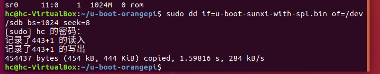

# （三十四）移植到Orange Pi One上


移植到JZ2440上效果不好，我又上拼多多看，看到个买二手的店，低价买了一块成色不算很好（往好了说九成新，往差了说八成五新）的香橙派1（一看就知道模仿树莓派的），有点脏，不过不影响使用，卖家送了电源线和8GB的TF卡，我自己有杜邦线和USB转TTL的转换器，也可以用串口通信了，而且这块香橙派1居然是arm v7架构的CPU！和QEMU的virt虚拟机用的是同一个架构（型号不一样），这就太爽了！


## 1. 烧写u-boot

卡里已经刷过官方镜像，官方镜像带的u-boot实在是难以修改环境变量，干脆推倒重来，直接装新的。

首先把TF卡（新卡或者厂家送的卡都行）格式化了（如果电脑没自带TF卡口，需要买一个读卡器），把东西删光了，用Windows自带的磁盘管理工具，把TF卡的分区全部删除。

按Win键 + R键，输入

```bash
diskmgmt.msc
```

打开磁盘管理工具即可。


打开之后如下，找到TF卡，别刷到硬盘上了，那就麻烦大了。


TF卡不管有多少分区，选中，鼠标右键菜单 `删除卷` 全删光了，搞成未分配。


像这样就行了。

然后启动Linux虚拟机，因为编U-boot也要虚拟机，所以还不如用Linux来顺便烧写，Windows版本的dd工具烧写设备特别难用。


添加一个USB控制器设备（因为我用读卡器插在USB口），这样Linux系统就能识别到这个TF卡了。Linux配置我就不再说了，等下还要从GitHub上下载u-boot（现在U-boot主项目已经把香橙派的版本merge过去了，但是还是推荐下香橙派官方的版本，因为小）。

```bash
git clone https://github.com/orangepi-xunlong/u-boot-orangepi.git
```

这样就可以下载项目到系统里了，之前移植到arm上的时候我已经编过u-boot了，工具都还在。

进入u-boot-orangepi目录，直接清理目录、编译配置、用工具链开始编译三件套。

```bash
make mrproper
make orangepi_one_defconfig
make CROSS_COMPILE=arm-linux-gnueabi-

```

这倒是没什么问题。编好之后就可以烧写了。


烧写到TF卡上用的是这个。

把读卡器（带着TF卡）拔出再插，这样虚拟机才能直接占用，否则就被Windows宿主系统一直占用。

输入命令，列出所有的块设备（TF卡是个块设备）。

```bash
lsblk

```


找到这个，那么TF卡在Linux系统中的路径就是 /dev/sdb。烧写命令：

```bash
sudo dd if=u-boot-sunxi-with-spl.bin of=/dev/sdb bs=1024 seek=8

```



这样就好了。然后就可以退虚拟机了，退虚拟机之后Windows系统会自动接管TF卡的操控权。再次打开磁盘管理，选中TF卡，右键新建简单卷，给TF卡建立两个简单卷。

第一个卷的简单卷大小为16MB，里面其实就是u-boot，所以坚决不能格式化这个卷。


第二个卷，有多少就建立多少吧，格式化为FAT32文件系统格式，因为u-boot没法用微软自己专用的NTFS，但是它能用FAT32文件系统（后面就和在qemu里面一样，直接用fatload来加载内核了）。


这样就完成了u-boot的烧写和分区，接下来插卡上机。

连接串口通信的问题我这里就不说了，这个网上有很多教程，百度都能找到，都不用谷歌的。

串口连接香橙派本身也需要装驱动，我之前用 `zadig-2.3` 全部装了。


这个就是香橙派，所以XShell里面再建立一个香橙派的连接，端口是COM9，波特率依然是经典115200。


这就连接上了。

香橙派没有电源开关，一旦上电就会直接启动。


可以看到，FAT32格式的是第二个分区。之后加载内核就可以从这个分区加载进入了。


## 2. 移植arm内存分页功能

创建新的Program_OrangePiOne文件夹，全部复制Program_arm中的文件过来，但是要修改Makefile，不能全编译，先编译内存分页这部分。

### 2.1 修改Makefile

主Makefile，只链接部分。

```makefile
# 主Makefile，用于整合各模块操作

# 全套arm编译工具链
GCC = arm-none-eabi-gcc
AS = arm-none-eabi-as
LD = arm-none-eabi-ld
OBJCOPY = arm-none-eabi-objcopy

# 项目构建工具make
MAKE = make

# 因为这个操作系统本质上是个宏内核，所有的组件都要打包在一个kernel.bin里面
# 这样烧写起来也方便，所以要在主Makefile这里统一链接

# 所有组件目录
ENTRY_DIR = entry
KERNEL_DIR = kernel
LIB_DIR = lib
DEVICE_DIR = devices
FS_DIR = fs

# ARM需要的中间文件
KERNEL_ELF = $(KERNEL_DIR)/kernel.elf

# 输出文件
KERNEL_BIN = kernel.bin

# 链接脚本位置
KERNEL_LINKER_SCRIPT = $(KERNEL_DIR)/kernel_linker.ld

# 链接标志
LDFLAGS = -T $(KERNEL_LINKER_SCRIPT)

.PHONY: all

# 编译各组件，要把工具参数传输过去，然后主Makefile汇总链接生成 kernel.bin
all: compile link bin

# 编译各组件
compile:
	$(MAKE) -C $(ENTRY_DIR) GCC=$(GCC) AS=$(AS) MAKE=$(MAKE)
	$(MAKE) -C $(LIB_DIR) GCC=$(GCC) AS=$(AS) MAKE=$(MAKE)
	$(MAKE) -C $(KERNEL_DIR) GCC=$(GCC) AS=$(AS) MAKE=$(MAKE)
	$(MAKE) -C $(DEVICE_DIR) GCC=$(GCC) AS=$(AS) MAKE=$(MAKE)
	$(MAKE) -C $(FS_DIR) GCC=$(GCC) AS=$(AS) MAKE=$(MAKE)

# 链接生成 kernel.elf
link:
	$(LD) $(LDFLAGS) -o $(KERNEL_ELF) $(wildcard $(ENTRY_DIR)/*.o) \
										$(wildcard $(KERNEL_DIR)/*.o) \
										$(wildcard $(LIB_DIR)/*.o)
#										$(wildcard $(DEVICE_DIR)/*.o) \
#										$(wildcard $(FS_DIR)/*.o)

# 提取二进制文件kernel.bin
bin:
	$(OBJCOPY) -O binary $(KERNEL_ELF) $(KERNEL_BIN)

clean:
	$(MAKE) -C $(ENTRY_DIR) clean
	$(MAKE) -C $(KERNEL_DIR) clean
	$(MAKE) -C $(LIB_DIR) clean
	$(MAKE) -C $(DEVICE_DIR) clean
	$(MAKE) -C $(FS_DIR) clean

```

kernel的Makefile，只编译kernel_page。

```c

# 目录
KERNEL_DIR = .

# 所有组件目录
PAGE_DIR = kernel_page
TASK_DIR = kernel_task
MEMORY_DIR = kernel_memory
INTERRUPT_DIR = kernel_interrupt
BUFFER_DIR = kernel_buffer
DEVICE_DIR = kernel_device

# 标签标记所有的任务（输出什么文件），方便修改
KERNEL_OBJS = $(KERNEL_DIR)/kernel_page.o
#				$(KERNEL_DIR)/kernel_task.o \
#				$(KERNEL_DIR)/kernel_memory.o \
#				$(KERNEL_DIR)/kernel_interrupt.o \
#				$(KERNEL_DIR)/kernel_buffer.o \
#				$(KERNEL_DIR)/kernel_device.o

# C 编译标志
CFLAGS = -ffreestanding -nostdlib -Wall -Wextra

.PHONY: all

all: $(KERNEL_OBJS)

# 执行各子模块编译
$(KERNEL_DIR)/kernel_page.o:
	$(MAKE) -C $(PAGE_DIR) GCC=$(GCC) AS=$(AS) MAKE=$(MAKE)

$(KERNEL_DIR)/kernel_task.o:
	$(MAKE) -C $(TASK_DIR) GCC=$(GCC) AS=$(AS) MAKE=$(MAKE)

$(KERNEL_DIR)/kernel_memory.o:
	$(MAKE) -C $(MEMORY_DIR) GCC=$(GCC) AS=$(AS) MAKE=$(MAKE)

$(KERNEL_DIR)/kernel_interrupt.o:
	$(MAKE) -C $(INTERRUPT_DIR) GCC=$(GCC) AS=$(AS) MAKE=$(MAKE)

$(KERNEL_DIR)/kernel_buffer.o:
	$(MAKE) -C $(BUFFER_DIR) GCC=$(GCC) AS=$(AS) MAKE=$(MAKE)

$(KERNEL_DIR)/kernel_device.o:
	$(MAKE) -C $(DEVICE_DIR) GCC=$(GCC) AS=$(AS) MAKE=$(MAKE)

# 清理规则
clean:
	@if exist $(KERNEL_DIR)\\*.o del $(KERNEL_DIR)\\*.o
	@if exist $(KERNEL_DIR)\\*.elf del $(KERNEL_DIR)\\*.elf

```


### 2.2 修改print.c

用u-boot打印设备树或者是直接查看官方给的手册 `Allwinner_H3_Datasheet_v1.2.pdf`，都能看到uart0的地址，我这里列设备树的。

```bash
		serial@01c28000 {
			compatible = "snps,dw-apb-uart";
			reg = <0x01c28000 0x00000400>;
			interrupts = <0x00000000 0x00000000 0x00000004>;
			reg-shift = <0x00000002>;
			reg-io-width = <0x00000004>;
			clocks = <0x00000005 0x0000003e>;
			resets = <0x00000005 0x00000031>;
			dmas = <0x0000000b 0x00000006 0x0000000b 0x00000006>;
			dma-names = "rx", "tx";
			status = "okay";
			pinctrl-names = "default";
			pinctrl-0 = <0x0000000c>;
		};
```

print.c修改如下：

```c
#define UART0_BASE 0x01c28000
#define UARTDR     (*(volatile unsigned int *)(UART0_BASE + 0x000))
#define UARTFR     (*(volatile unsigned int *)(UART0_BASE + 0x018))

```

只需要改基址就行了。


### 2.3 修改kernel_page

u-boot的bdinfo：

```bash
U-Boot 2018.05-orangepi (Mar 16 2021 - 14:33:36 +0800) Allwinner Technology

CPU:   Allwinner H3 (SUN8I 1680)
Model: Xunlong Orange Pi One
DRAM:  512 MiB
MMC:   SUNXI SD/MMC: 0
Loading Environment from FAT... Unable to use mmc 0:1... Failed (-5)
In:    serial@01c28000
Out:   serial@01c28000
Err:   serial@01c28000
Net:   phy interface0
eth0: ethernet@1c30000
starting USB...
USB0:   USB EHCI 1.00
USB1:   USB OHCI 1.0
scanning bus 0 for devices... 1 USB Device(s) found
       scanning usb for storage devices... 0 Storage Device(s) found
Autoboot in 1 seconds, press <Space> to stop
=> bdinfo
arch_number = 0x00001029
boot_params = 0x40000100
DRAM bank   = 0x00000000
-> start    = 0x40000000
-> size     = 0x20000000
baudrate    = 115200 bps
TLB addr    = 0x5FFF0000
relocaddr   = 0x5FF76000
reloc off   = 0x15F76000
irq_sp      = 0x5BF51E10
sp start    = 0x5BF51E00
Early malloc usage: 118 / 400
fdt_blob = 5bf51e20

```

和qemu上的一样，物理内存从0x40000000起算。

这倒是轻松了，稍加改动即可。只改动了映射范围、禁用缓冲缓存位（之前JZ2440的时候就发现串口通信应该禁用这两个才对），删掉了RAMDISK。

```c
void setup_page_directory() {

    SectionDescriptor *page_directory = (SectionDescriptor *)(PAGE_DIR_TABLE_POS + DRAM_OFFSET);

    // 清空整个页目录表（4096条，要16KB）
    memset(page_directory, 0, 0x4000);

    // 低端一对一映射（DRAM地址从0x40000000开始，不仅是内存，还有uart，还有可能的其他组件，因此全部用段描述符映射）
    for(uint32_t i = 0; i < 0x600; i++) {
        page_directory[i].DescriptorType = 2;
        page_directory[i].Bufferable = 0;
        page_directory[i].Cacheable = 0;
        page_directory[i].ShouldBeZero0 = 0;
        page_directory[i].Domain = USER_DOMAIN;
        page_directory[i].ImplementationDefined = 0;
        page_directory[i].AccessPermission = 3; // 用户域不检查，但还是以防万一
        page_directory[i].TypeExtension = 0;
        page_directory[i].ShouldBeZero1 = 0;
        page_directory[i].Shared = 0;
        page_directory[i].ShouldBeZero2 = 0;
        page_directory[i].PresentHigh = 0;
        page_directory[i].ShouldBeZero3 = 0;
        // page_directory[i].BaseAddress = ((i * 0x100000) >> 20);
        // 简化为：
        page_directory[i].BaseAddress = i;
    }


    // 1条页表放高端1MB映射
    // 从0xc0000000开始
    page_directory[0xc00].DescriptorType = 2;
    page_directory[0xc00].Bufferable = 0;
    page_directory[0xc00].Cacheable = 0;
    page_directory[0xc00].ShouldBeZero0 = 0;
    page_directory[0xc00].Domain = KERNEL_DOMAIN;
    page_directory[0xc00].ImplementationDefined = 0;
    page_directory[0xc00].AccessPermission = 2;     // 当然要特权读写用户只读
    page_directory[0xc00].TypeExtension = 0;
    page_directory[0xc00].ShouldBeZero1 = 0;
    page_directory[0xc00].Shared = 0;
    page_directory[0xc00].ShouldBeZero2 = 0;
    page_directory[0xc00].PresentHigh = 0;
    page_directory[0xc00].ShouldBeZero3 = 0;
    page_directory[0xc00].BaseAddress = (DRAM_OFFSET >> 20);


    // 增加自引用（偷懒所以用段描述符，实际上为了权限控制的话，应该用粗页表，把范围定死在这16KB里面）
    // 这样访问的地址就是0xfff00000
    // 但是注意，范围很大，有1MB，别越界
    page_directory[0xfff].DescriptorType = 2;
    page_directory[0xfff].Bufferable = 0;
    page_directory[0xfff].Cacheable = 0;
    page_directory[0xfff].ShouldBeZero0 = 0;
    page_directory[0xfff].Domain = KERNEL_DOMAIN;
    page_directory[0xfff].ImplementationDefined = 0;
    page_directory[0xfff].AccessPermission = 2;     // 当然要特权读写用户只读
    page_directory[0xfff].TypeExtension = 0;
    page_directory[0xfff].ShouldBeZero1 = 0;
    page_directory[0xfff].Shared = 0;
    page_directory[0xfff].ShouldBeZero2 = 0;
    page_directory[0xfff].PresentHigh = 0;
    page_directory[0xfff].ShouldBeZero3 = 0;
    page_directory[0xfff].BaseAddress = ((PAGE_DIR_TABLE_POS + DRAM_OFFSET) >> 20);

}

```


### 2.4 修改kernel.c

经典检验能不能用。

```c
//
// Created by huangcheng on 2024/6/24.
//

#include "../lib/lib_kernel/lib_kernel.h"
#include "../kernel/kernel_page/kernel_page.h"

void kernel_main(void) {
    // 测试分页后能不能用
    *((uint32_t *)0x40004000) = 0x12345678;
    put_int(*((uint32_t *)0x40004000));
    put_char('\n');

    // 页表初始化
    init_paging();

    // 查看是否分页成功
    put_int(*((uint32_t *)0xc0004000));
    put_char('\n');

    for(;;);
}

```


## 3. 上机实测

编译，插卡上读卡器，直接复制到TF卡的第二个能用的分区里面就行了。

进入u-boot之后按空格，输入命令：

```bash
fatls mmc 0:2

```


能看到我们放进卡里的内核了，然后直接加载吧。

```bash
fatload mmc 0:2 0x4000e000 kernel.bin
go 0x4000e000

```


顺利走出第一步，内存分页成功。