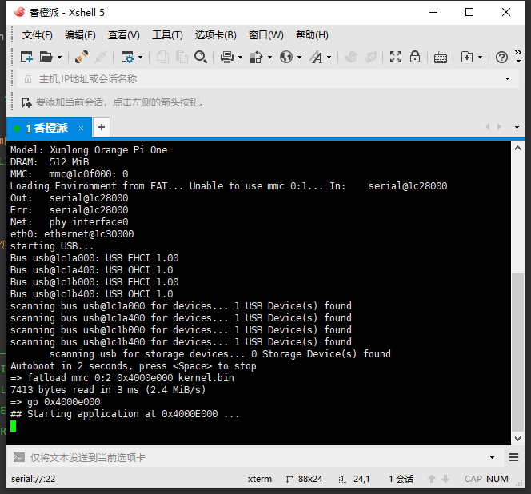
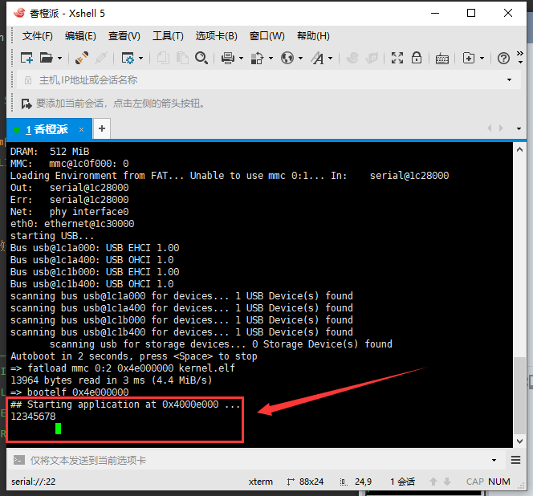
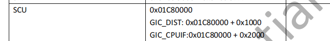

# （三十五）解决内存分页问题继续移植


## 0. 更正错误

之前脑子发昏，内存分页根本没成功，今天更正错误。

这些天一直在调试，debug，最后总算慢慢锁定问题了，问题确实让我很无语，唉，不说了，先发出来就知道了。

最需要感谢的项目，这些项目的参考让我找到并解决了问题，感谢项目的作者们，我都打了Star：

[trebisky/orangepi: Down and dirty hardware programming on Orange Pi boards (github.com)](https://github.com/trebisky/orangepi)

[trebisky/Kyu: Kyu real time operating system for the BBB (Beaglebone Black), Orange Pi, and Nanopi Fire3 boards (github.com)](https://github.com/trebisky/Kyu)

[catphish/allwinner-bare-metal: A simple framework to boot an Allwinner H3 SoC and run bare metal code (github.com)](https://github.com/catphish/allwinner-bare-metal)

[hexi8511/H3_noOS_examples: Allwinner H3 example codes (github.com)](https://github.com/hexi8511/H3_noOS_examples)

### 0.1 代码更正

kernel.c

```c
//
// Created by huangcheng on 2024/6/24.
//

#include "../lib/lib_kernel/lib_kernel.h"
#include "../kernel/kernel_page/kernel_page.h"

void kernel_main(void) {
    // 页表初始化
    // 实测，由于u-boot的页表设置了扩展地址和很多东西（缓存缓冲等）
    // 导致必须关掉MMU之后才能进行页表的初始化（要不然直接写不进真正的物理内存）
    // 排查那么多天排除出这么个结果我也是没话说了
    // 我非常想把禁用MMU和启用MMU写入init_paging中，但是这样的话直接跳不回来，会直接进入数据错误异常处理程序
    // 果然虚拟机还是不靠谱

    // 先禁用MMU
    // 获取当前SCTLR寄存器值
    SCTLR_t sctlr;
    get_sctlr(&sctlr);
    // 禁用MMU
    sctlr.M = 0; // 禁用MMU
    sctlr.A = 0; // 禁用对齐检查
    sctlr.C = 0; // 禁用数据缓存
    // 更新SCTLR寄存器
    set_sctlr(&sctlr);

    // 现在开始才能初始化页表
    init_paging();

    // 启用MMU
    get_sctlr(&sctlr);
    sctlr.M = 1; // 启用MMU
    sctlr.A = 1; // 启用对齐检查
    sctlr.C = 1; // 启用数据缓存
    // 更新SCTLR寄存器
    set_sctlr(&sctlr);

    // 加载内核栈
    switch_sp(0xc0007000);

    // 查看是否分页成功
    *((uint32_t *)0x40004000) = 0x12345678;
    put_int(*((uint32_t *)0xc0004000));
    put_char('\n');

    for(;;);
}

```

kernel_page.c，init_paging相应修改。

```c

void init_paging() {
    // 设置页目录表
    setup_page_directory();

    // 域控制器设置
    DACR_t dacr;
    memset(&dacr, 0, sizeof(DACR_t));
    // 实测，一旦开启权限检查
    // 用粗页表和小页表的二级映射体系直接无法写，只能读
    // 为了避免权限问题，只能一律全权
    dacr.domain0 = 3;
    dacr.domain15 = 3;
    set_dacr(&dacr);

    // 设置TTBCR寄存器，只使用TTBR0，类似于x86的cr3，兼容先前的ARMv5和ARMv6架构
    TTBCR_t ttbcr;
    // 取当前TTBCR值
    get_ttbcr(&ttbcr);
    ttbcr.N = 0;
    ttbcr.Reserved0 = 0;
    ttbcr.PD0 = 0;
    ttbcr.PD1 = 0;
    ttbcr.Reserved1 = 0;
    ttbcr.EAE = 0;
    // 设置TTBCR寄存器
    set_ttbcr(&ttbcr);

    // 载入页目录表
    load_page_directory(PAGE_DIR_TABLE_POS + DRAM_OFFSET);

    // 无效化TLB
    invalidate_tlbs();
}

```

麻了，虚拟机果然不是真板子，浪费了两天就在这个上面，感觉自己像是被嘲讽智商。


### 0.2 编译命令和环境修改 

直接说明情况吧，我也不知道为什么，之前用的这一套命令：

```c
fatload mmc 0:2 0x4000e000 kernel.bin
go 0x4000e000

```

在内存分页之后就不能用了。。。也不输出也不继续执行，麻。

但是我用elf文件，让u-boot从elf启动居然能用！！！！！0x4e000000是我随便乱选的一个地址，关键是要避开可能加载内核的区域就行了。

```c
fatload mmc 0:2 0x4e000000 kernel.elf
bootelf 0x4e000000

```

麻就麻这一点，我在Windows上编出来的elf文件识别不了。。。链接出来的好像就不是elf文件。

后来我才发现是我没指定编译链接选项，唉，我这种半吊子水平就是一言难尽。

主Makefile：

```makefile
# 主Makefile，用于整合各模块操作

# 全套arm编译工具链
GCC = arm-none-eabi-gcc
AS = arm-none-eabi-as
LD = arm-none-eabi-ld
OBJCOPY = arm-none-eabi-objcopy

# 项目构建工具make
MAKE = make

# 因为这个操作系统本质上是个宏内核，所有的组件都要打包在一个kernel.bin里面
# 这样烧写起来也方便，所以要在主Makefile这里统一链接

# 所有组件目录
ENTRY_DIR = entry
KERNEL_DIR = kernel
LIB_DIR = lib
DEVICE_DIR = devices
FS_DIR = fs

# ARM需要的中间文件（现在不是中间文件了，是主要文件了）
KERNEL_ELF = kernel.elf

# 输出文件
KERNEL_BIN = kernel.bin

# 链接脚本位置
KERNEL_LINKER_SCRIPT = $(KERNEL_DIR)/kernel_linker.ld

# 链接标志（指定为32位arm的elf格式）
LDFLAGS = -T $(KERNEL_LINKER_SCRIPT) -m armelf

.PHONY: all

# 编译各组件，要把工具参数传输过去，然后主Makefile汇总链接生成 kernel.bin
all: compile link bin

# 编译各组件
compile:
	$(MAKE) -C $(ENTRY_DIR) GCC=$(GCC) AS=$(AS) MAKE=$(MAKE)
	$(MAKE) -C $(LIB_DIR) GCC=$(GCC) AS=$(AS) MAKE=$(MAKE)
	$(MAKE) -C $(KERNEL_DIR) GCC=$(GCC) AS=$(AS) MAKE=$(MAKE)
	$(MAKE) -C $(DEVICE_DIR) GCC=$(GCC) AS=$(AS) MAKE=$(MAKE)
	$(MAKE) -C $(FS_DIR) GCC=$(GCC) AS=$(AS) MAKE=$(MAKE)

# 链接生成 kernel.elf
link:
	$(LD) $(LDFLAGS) -o $(KERNEL_ELF) $(wildcard $(ENTRY_DIR)/*.o) \
										$(wildcard $(KERNEL_DIR)/*.o) \
										$(wildcard $(LIB_DIR)/*.o)
#										$(wildcard $(DEVICE_DIR)/*.o) \
#										$(wildcard $(FS_DIR)/*.o)

# 提取二进制文件kernel.bin
bin:
	$(OBJCOPY) -O binary $(KERNEL_ELF) $(KERNEL_BIN)

clean:
	$(MAKE) -C $(ENTRY_DIR) clean
	$(MAKE) -C $(KERNEL_DIR) clean
	$(MAKE) -C $(LIB_DIR) clean
	$(MAKE) -C $(DEVICE_DIR) clean
	$(MAKE) -C $(FS_DIR) clean

```

看看效果吧。kernel.elf和kernel.elf提取出来的kernel.bin。

首先是kernel.bin



什么都没有，对吧。然后是kernel.elf



我只能说我的脑瓜子嗡嗡嗡地响，反正我搞不清楚想不明白。


## 1. 继续移植任务管理和内存分配

多任务初始化和内存分配问题不大，直接照用就行。

kernel.c

```c
//
// Created by huangcheng on 2024/6/24.
//

#include "../lib/lib_kernel/lib_kernel.h"
#include "../kernel/kernel_page/kernel_page.h"
#include "../kernel/kernel_task/kernel_task.h"
#include "../kernel/kernel_memory/kernel_memory.h"

void kernel_main(void) {
    // 页表初始化
    // 实测，由于u-boot的页表设置了扩展地址和很多东西（缓存缓冲等）
    // 导致必须关掉MMU之后才能进行页表的初始化（要不然直接写不进真正的物理内存）
    // 排查那么多天排除出这么个结果我也是没话说了
    // 我非常想把禁用MMU和启用MMU写入init_paging中，但是这样的话直接跳不回来，会直接进入数据错误异常处理程序
    // 果然虚拟机还是不靠谱

    // 先禁用MMU
    // 获取当前SCTLR寄存器值
    SCTLR_t sctlr;
    get_sctlr(&sctlr);
    // 禁用MMU
    sctlr.M = 0; // 禁用MMU
    sctlr.A = 0; // 禁用对齐检查
    sctlr.C = 0; // 禁用数据缓存
    // 更新SCTLR寄存器
    set_sctlr(&sctlr);

    // 现在开始才能初始化页表
    init_paging();

    // 启用MMU
    get_sctlr(&sctlr);
    sctlr.M = 1; // 启用MMU
    sctlr.A = 1; // 启用对齐检查
    sctlr.C = 1; // 启用数据缓存
    // 更新SCTLR寄存器
    set_sctlr(&sctlr);

    // 加载内核栈
    switch_sp(0xc0007000);
    // 初始化task
    init_multitasking();
    // 初始化内存管理（本来这里应该从环境里面获取内存大小，我懒，直接写死了算了）
    init_memory(0x20000000);

    for(;;);
}

```

kernel_task和kernel_memory直接从Program_arm复制粘贴。


## 2. 中断管理移植

### 2.1 中断向量表修改移植

主要问题是中断管理移植，不过还好是u-boot，应该都是一样的，以防万一还是先打印试试看。

kernel.c

```c
void kernel_main(void) {
    // 页表初始化
    // 实测，由于u-boot的页表设置了扩展地址和很多东西（缓存缓冲等）
    // 导致必须关掉MMU之后才能进行页表的初始化（要不然直接写不进真正的物理内存）
    // 排查那么多天排除出这么个结果我也是没话说了
    // 我非常想把禁用MMU和启用MMU写入init_paging中，但是这样的话直接跳不回来，会直接进入数据错误异常处理程序
    // 果然虚拟机还是不靠谱

    // 先禁用MMU
    // 获取当前SCTLR寄存器值
    SCTLR_t sctlr;
    get_sctlr(&sctlr);
    // 禁用MMU
    sctlr.M = 0; // 禁用MMU
    sctlr.A = 0; // 禁用对齐检查
    sctlr.C = 0; // 禁用数据缓存
    // 更新SCTLR寄存器
    set_sctlr(&sctlr);

    // 现在开始才能初始化页表
    init_paging();

    // 启用MMU
    get_sctlr(&sctlr);
    sctlr.M = 1; // 启用MMU
    sctlr.A = 1; // 启用对齐检查
    sctlr.C = 1; // 启用数据缓存
    // 更新SCTLR寄存器
    set_sctlr(&sctlr);

    // 加载内核栈
    switch_sp(0xc0007000);
    // 初始化task
    init_multitasking();
    // 初始化内存管理（本来这里应该从环境里面获取内存大小，我懒，直接写死了算了）
    init_memory(0x20000000);


    // 先读取寄存器，确定基址
    uint32_t vbar;
    asm volatile("mrc p15, 0, %0, c12, c0, 0" : "=r" (vbar));
    put_str("VBAR : ");
    put_int(vbar);
    put_char('\n');

    for(;;);
}

```

输出如下：

```bash
=> fatload mmc 0:2 0x4e000000 kernel.elf
18332 bytes read in 4 ms (4.4 MiB/s)
=> bootelf 0x4e000000
## Starting application at 0x4000e000 ...
VBAR : 5FF7E000

```

OK，我们可以用u-boot来看看这个内存区域的值。

```bash
=> md 0x5ff7e000 0x40
5ff7e000: ea0000b8 e59ff014 e59ff014 e59ff014    ................
5ff7e010: e59ff014 e59ff014 e59ff014 e59ff014    ................
5ff7e020: 5ff7e060 5ff7e0c0 5ff7e120 5ff7e180    `.._..._ .._..._
5ff7e030: 5ff7e1e0 5ff7e240 5ff7e2a0 deadbeef    ..._@.._..._....
5ff7e040: 5bf57778 e320f000 e320f000 e320f000    xw.[.. ... ... .
5ff7e050: e320f000 e320f000 e320f000 e320f000    .. ... ... ... .
5ff7e060: e51fd028 e58de000 e14fe000 e58de004    (.........O.....
5ff7e070: e3a0d013 e169f00d e1a0e00f e1b0f00e    ......i.........
5ff7e080: e24dd048 e88d1fff e51f2050 e892000c    H.M.....P ......
5ff7e090: e28d0048 e28d5034 e1a0100e e885000f    H...4P..........
5ff7e0a0: e1a0000d fa00067d e320f000 e320f000    ....}..... ... .
5ff7e0b0: e320f000 e320f000 e320f000 e320f000    .. ... ... ... .
5ff7e0c0: e51fd088 e58de000 e14fe000 e58de004    ..........O.....
5ff7e0d0: e3a0d013 e169f00d e1a0e00f e1b0f00e    ......i.........
5ff7e0e0: e24dd048 e88d1fff e51f20b0 e892000c    H.M...... ......
5ff7e0f0: e28d0048 e28d5034 e1a0100e e885000f    H...4P..........

```

对比一下之前在qemu上开发的时候，写在注释里面的当时用GDB打的值。

```bash
// 读取VBAR的结果：
//(gdb) info registers VBAR
//VBAR           0x4771d000          1198641152
//(gdb) x /64xw 0x4771d000
//0x4771d000:     0xea0000b8      0xe59ff014      0xe59ff014      0xe59ff014
//0x4771d010:     0xe59ff014      0xe59ff014      0xe59ff014      0xe59ff014
//0x4771d020:     0x4771d060      0x4771d0c0      0x4771d120      0x4771d180
//0x4771d030:     0x4771d1e0      0x4771d240      0x4771d2a0      0xdeadbeef
//0x4771d040:     0x465dce98      0xe320f000      0xe320f000      0xe320f000
//0x4771d050:     0xe320f000      0xe320f000      0xe320f000      0xe320f000
//0x4771d060:     0xe51fd028      0xe58de000      0xe14fe000      0xe58de004
//0x4771d070:     0xe3a0d013      0xe169f00d      0xe1a0e00f      0xe1b0f00e
//0x4771d080:     0xe24dd048      0xe88d1fff      0xe51f2050      0xe892000c
//0x4771d090:     0xe28d0048      0xe28d5034      0xe1a0100e      0xe885000f
//0x4771d0a0:     0xe1a0000d      0xeb000906      0xe320f000      0xe320f000
//0x4771d0b0:     0xe320f000      0xe320f000      0xe320f000      0xe320f000
//0x4771d0c0:     0xe24dd004      0xe58d0000      0xe51f0090      0xe580e000
//0x4771d0d0:     0xe14fe000      0xe580e004      0xe590e000      0xe59d0000
//0x4771d0e0:     0xe28dd004      0xe24dd048      0xe88d1fff      0xe51f20b4
//0x4771d0f0:     0xe892000c      0xe28d0048      0xe28d5034      0xe1a0100e

```

直接说结论，最核心的中断向量表这里完全一样。

```bash
0xea0000b8      0xe59ff014      0xe59ff014      0xe59ff014
0xe59ff014      0xe59ff014      0xe59ff014      0xe59ff014
```

前面都一样，还都有0xe320f000这个nop，这一结构完全就是原封不动，直接照搬。


### 2.2 GIC管理移植

首先先看板子的设备树片段。

```bash
		interrupt-controller@01c81000 {
			compatible = "arm,cortex-a7-gic", "arm,cortex-a15-gic";
			reg = <0x01c81000 0x00001000 0x01c82000 0x00001000 0x01c84000 0x00002000 0x01c86000 0x00002000>;
			interrupt-controller;
			#interrupt-cells = <0x00000003>;
			interrupts = <0x00000001 0x00000009 0x00000f04>;
			phandle = <0x00000001>;
		};

```

QEMU上的设备树片段

```bash
        intc@8000000 {
                phandle = <0x00008002>;
                reg = <0x00000000 0x08000000 0x00000000 0x00010000 0x00000000 0x08010000 0x00000000 0x00010000>;
                compatible = "arm,cortex-a15-gic";
                ranges;
                #size-cells = <0x00000002>;
                #address-cells = <0x00000002>;
                interrupt-controller;
                #interrupt-cells = <0x00000003>;
                v2m@8020000 {
                        phandle = <0x00008003>;
                        reg = <0x00000000 0x08020000 0x00000000 0x00001000>;
                        msi-controller;
                        compatible = "arm,gic-v2m-frame";
                };
        };

```

cortex-a7和cortex-a15用的gic是一样的，都是v2。

也就是说这块板子的GIC和QEMU上的除了寄存器映射地址完全相同。

Allwinner_H3_Datasheet_v1.2.pdf里面的原文：



只需要改动这两个就行了（IF就是interface的缩写）。

kernel_interrupt.c

```c
// GIC Distributor（分发器）的基址（看设备树能看到）
// GIC Distributor 是一个负责管理和分配中断的模块。它将中断分发到对应的CPU接口
#define GIC_DIST_BASE 0x01c81000

// GIC CPU Interface（CPU接口）的基址（看设备树能看到）
// GIC CPU Interface 是一个处理和响应分配到该CPU的中断的模块
#define GIC_CPU_BASE  0x01c82000
```

其他完全相同，直接复制粘贴就行。

kernel_buffer和kernel_device就完全是上层建筑了，直接复制粘贴就行。

kernel的Makefile

```makefile
# 标签标记所有的任务（输出什么文件），方便修改
KERNEL_OBJS = $(KERNEL_DIR)/kernel_page.o \
				$(KERNEL_DIR)/kernel_task.o \
				$(KERNEL_DIR)/kernel_memory.o \
				$(KERNEL_DIR)/kernel_interrupt.o \
				$(KERNEL_DIR)/kernel_buffer.o \
				$(KERNEL_DIR)/kernel_device.o
```

kernel.c

```c
//
// Created by huangcheng on 2024/6/24.
//

#include "../lib/lib_kernel/lib_kernel.h"
#include "../kernel/kernel_page/kernel_page.h"
#include "../kernel/kernel_task/kernel_task.h"
#include "../kernel/kernel_memory/kernel_memory.h"
#include "../kernel/kernel_interrupt/kernel_interrupt.h"

void kernel_main(void) {
    // 页表初始化
    // 实测，由于u-boot的页表设置了扩展地址和很多东西（缓存缓冲等）
    // 导致必须关掉MMU之后才能进行页表的初始化（要不然直接写不进真正的物理内存）
    // 排查那么多天排除出这么个结果我也是没话说了
    // 我非常想把禁用MMU和启用MMU写入init_paging中，但是这样的话直接跳不回来，会直接进入数据错误异常处理程序
    // 果然虚拟机还是不靠谱

    // 先禁用MMU
    // 获取当前SCTLR寄存器值
    SCTLR_t sctlr;
    get_sctlr(&sctlr);
    // 禁用MMU
    sctlr.M = 0; // 禁用MMU
    sctlr.A = 0; // 禁用对齐检查
    sctlr.C = 0; // 禁用数据缓存
    // 更新SCTLR寄存器
    set_sctlr(&sctlr);

    // 现在开始才能初始化页表
    init_paging();

    // 启用MMU
    get_sctlr(&sctlr);
    sctlr.M = 1; // 启用MMU
    sctlr.A = 1; // 启用对齐检查
    sctlr.C = 1; // 启用数据缓存
    // 更新SCTLR寄存器
    set_sctlr(&sctlr);

    // 加载内核栈
    switch_sp(0xc0007000);
    // 初始化task
    init_multitasking();
    // 初始化内存管理（本来这里应该从环境里面获取内存大小，我懒，直接写死了算了）
    init_memory(0x20000000);
    // 初始化中断管理和GIC
    init_interrupt();
    // 初始化设备驱动管理
    init_all_devices();

    for(;;);
}

```

