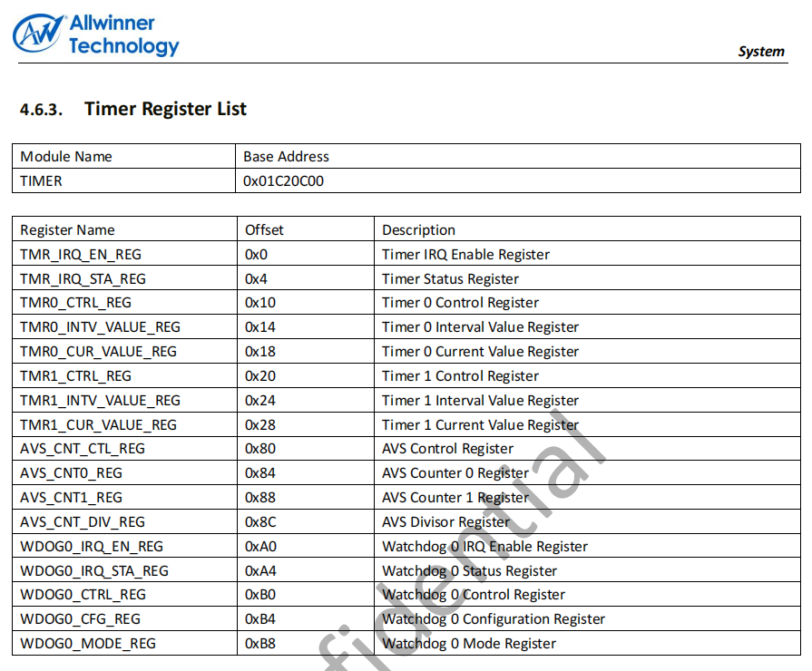
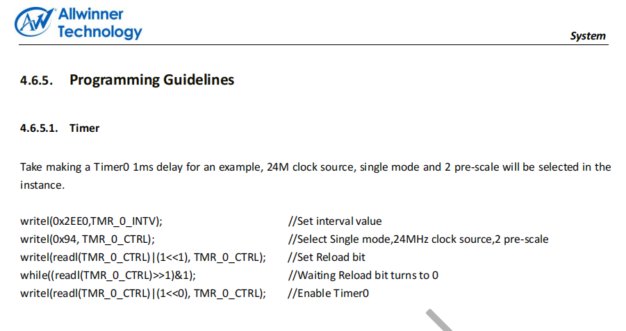
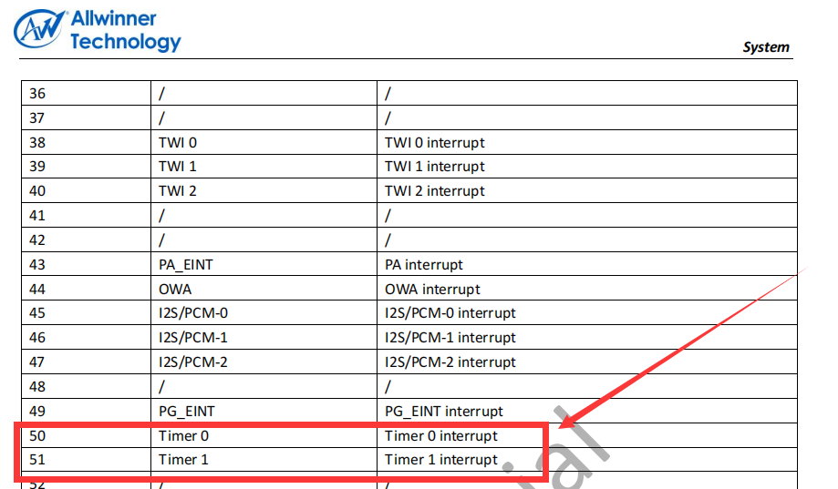
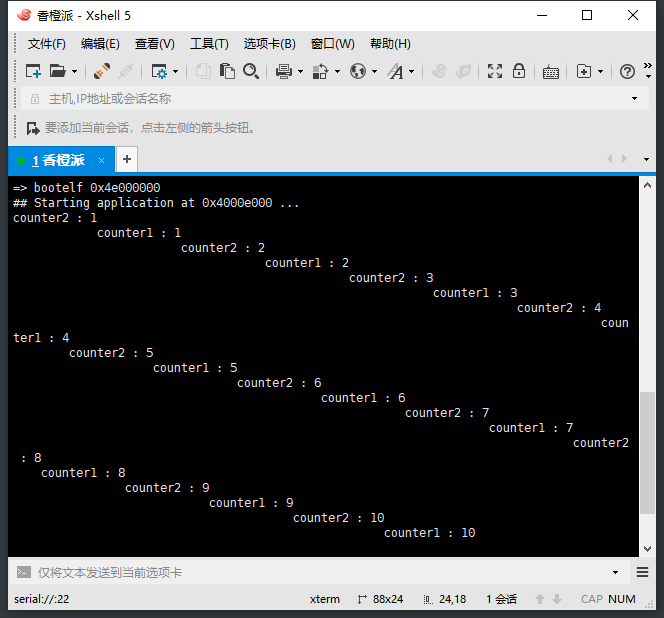

# （三十六）定时器驱动和多任务

需要感谢的参考项目：[trebisky/orangepi: Down and dirty hardware programming on Orange Pi boards (github.com)](https://github.com/trebisky/orangepi)

不说废话，直接开工。

## 1. 定时器驱动开发

根据Allwinner_H3_Datasheet_v1.2.pdf



这是全志H3上硬件定时器的所有寄存器的映射地址（看门狗是特殊的定时器，所以也在里面，实际上不需要理会）。

这个定时器配置起来还是很容易的，官方参考例程：



至于说中断号，这个自然也是看全志官方手册：



所以，直接复制Program_arm的devices下的timer和console（虚拟终端不用适配，直接复制过来就能用）过来，很容易写timer.c：

```c
//
// Created by huangcheng on 2024/7/13.
//

#include "timer.h"

#include "../../kernel/kernel_device/kernel_device.h"
#include "../../kernel/kernel_task/kernel_task.h"

// 注册宏，定义一个驱动结构体，把驱动结构体实例放到驱动段
REGISTER_DRIVER(timer_driver){
        .driver_name = "timer",
        .init = init_timer,
        .exit = exit_timer,
        .irq = 50,              // 根据Allwinner_H3_Datasheet_v1.2.pdf，page 207，Timer 0的中断号是50
        .trigger_mode = 0,
        .irq_interrupt_handler = interrupt_handler_timer,
};

// 这部分内容来自Allwinner_H3_Datasheet_v1.2.pdf，page 156
#define TIMER_BASE 0x01c20c00

#define TIMER_IRQ_EN        (*(volatile uint32_t *)(TIMER_BASE + 0x00)) // 定时器中断使能寄存器
#define TIMER_IRQ_STA       (*(volatile uint32_t *)(TIMER_BASE + 0x04)) // 定时器状态寄存器

// 定时器0寄存器
#define TIMER0_CTRL         (*(volatile uint32_t *)(TIMER_BASE + 0x10)) // 定时器0控制寄存器
#define TIMER0_INTV_VALUE   (*(volatile uint32_t *)(TIMER_BASE + 0x14)) // 定时器0间隔值寄存器
#define TIMER0_CUR_VALUE    (*(volatile uint32_t *)(TIMER_BASE + 0x18)) // 定时器0当前值寄存器

// 定时器1寄存器（暂不使用，仅供参考）
#define TIMER1_CTRL         (*(volatile uint32_t *)(TIMER_BASE + 0x20)) // 定时器1控制寄存器
#define TIMER1_INTV_VALUE   (*(volatile uint32_t *)(TIMER_BASE + 0x24)) // 定时器1间隔值寄存器
#define TIMER1_CUR_VALUE    (*(volatile uint32_t *)(TIMER_BASE + 0x28)) // 定时器1当前值寄存器

// Allwinner H3的硬件定时器的其他寄存器
// AVS控制寄存器
#define AVS_CNT_CTL         (*(volatile uint32_t *)(TIMER_BASE + 0x80)) // AVS控制寄存器
#define AVS_CNT0            (*(volatile uint32_t *)(TIMER_BASE + 0x84)) // AVS计数器0寄存器
#define AVS_CNT1            (*(volatile uint32_t *)(TIMER_BASE + 0x88)) // AVS计数器1寄存器
#define AVS_CNT_DIV         (*(volatile uint32_t *)(TIMER_BASE + 0x8C)) // AVS分频器寄存器

// 看门狗0寄存器
#define WDOG0_IRQ_EN        (*(volatile uint32_t *)(TIMER_BASE + 0xA0)) // 看门狗0中断使能寄存器
#define WDOG0_IRQ_STA       (*(volatile uint32_t *)(TIMER_BASE + 0xA4)) // 看门狗0状态寄存器
#define WDOG0_CTRL          (*(volatile uint32_t *)(TIMER_BASE + 0xB0)) // 看门狗0控制寄存器
#define WDOG0_CFG           (*(volatile uint32_t *)(TIMER_BASE + 0xB4)) // 看门狗0配置寄存器
#define WDOG0_MODE          (*(volatile uint32_t *)(TIMER_BASE + 0xB8)) // 看门狗0模式寄存器

#define TIMER_CTRL_ENABLE (1 << 0)      // 启用定时器
#define TIMER_CTRL_RELOAD (1 << 1)      // 启用重装载
#define TIMER_CTRL_CLK_SRC (1 << 2)     // 时钟源选择
#define TIMER_CTRL_SINGLE_MODE (1 << 7) // 单次模式

// timer初始化函数
void init_timer() {

    // 关于定时器的设备树片段：
    // timer@01c20c00 {
    //     compatible = "allwinner,sun4i-a10-timer";
    //     reg = <0x01c20c00 0x000000a0>;
    //     interrupts = <0x00000000 0x00000012 0x00000004 0x00000000 0x00000013 0x00000004>;
    //     clocks = <0x00000002>;
    //     status = "okay";
    // };
    // 这个定时器是板子上自带的硬件定时器，这个频率是24MHz

    // 停止定时器0
    TIMER0_CTRL = 0;

    // 设置定时器0的初始计数值，这里设置为一个具体的值，可以根据需要调整
    // 定时器频率是24MHz（我没有分频），也就是一秒钟计24 * 1000000次
    // 我要的中断频率是100Hz，也就是一秒钟中断100次
    // 那么计数值直接就是24 * 1000000 / 100 = 240000
    TIMER0_INTV_VALUE = 240000; // 根据需要调整

    // 清除定时器0的当前计数值
    TIMER0_CUR_VALUE = 0;

    // 启用定时器0中断
    TIMER_IRQ_EN |= (1 << 0);

    // 配置定时器0控制寄存器
    // 使用24M时钟源，启用重装载
    TIMER0_CTRL = TIMER_CTRL_CLK_SRC | TIMER_CTRL_RELOAD;

    // 等待重装载设置完毕
    while ( TIMER0_CTRL & TIMER_CTRL_RELOAD );

    // 启用定时器0
    TIMER0_CTRL |= TIMER_CTRL_ENABLE;
}

// timer退出函数
void exit_timer() {
    // 停止定时器0
    TIMER0_CTRL = 0;

    // 禁用定时器0中断
    TIMER_IRQ_EN = 0;
}

// 初始化
uint32_t total_ticks = 0;

// timer中断处理函数
void interrupt_handler_timer() {
    // 逻辑代码
    struct task* cur_task = running_task();
    cur_task->elapsed_ticks++;	  // 记录此线程占用的cpu时间嘀嗒数

    total_ticks++;                // 总时长增加

    if (cur_task->ticks == 0) {	  // 若任务时间片用完就开始调度新的任务上cpu
        task_schedule();
    } else {				  // 将当前任务的时间片-1
        cur_task->ticks--;
    }

    // 清除定时器0中断状态
    TIMER_IRQ_STA = 0x01;
}

```


## 2. 中断管理更正

主要是开发过程中发现的实际问题：

### 2.1 中断触发方式的配置

kernel_interrupt.c

```c
// GICD_ICFGR：中断触发方式寄存器
// 这个寄存器用于指定中断触发方式，每2个比特位表示一种中断的触发方式，0为电平触发（Level Triggered，保持一定的电平值期间触发），2为边缘触发（Edge Triggered，电平变化触发）。
// 之前搞错了，现在明确，两个比特位确定一个中断触发方式，根据Arm官方文档，0b00是电平触发，0b10是边缘触发。文档地址如下：
// https://developer.arm.com/documentation/ddi0601/2022-09/External-Registers/GICD-ICFGR-n---Interrupt-Configuration-Registers?lang=en
#define GICD_ICFGR ((volatile uint8_t *)(GIC_DIST_BASE + 0xc00))

// 添加中断处理函数，参数为中断号，中断处理函数，中断触发方式
bool add_interrupt_handler(uint32_t interrupt_id, void (*handler)(void), uint8_t trigger_mode) {
    if(interrupt_id > 1019 || handler == NULL || trigger_mode > 1) {
        return false;
    }
    if(interrupt_handler_functions[interrupt_id] != NULL) {
        // 该位置已有处理函数，不得再添加
        return false;
    }
    interrupt_handler_functions[interrupt_id] = handler;
    // 然后修改触发方式
    // 找相应的位（注意，一个中断的触发方式用两个位决定）
    uint32_t reg_idx = interrupt_id / 4;
    uint32_t bit_idx = interrupt_id % 4;

    if(trigger_mode) {
        // 已经排除了大于1的问题，所以这里trigger_mode肯定是1
        // 修改这两位为10，因为先前都是0，所以倒是可以不用考虑下标为偶数的位的问题
        // 下标为偶数的位必定是0，只有下标为奇数的位才是1
        GICD_ICFGR[reg_idx] |= (1 << (bit_idx * 2 + 1));
    } else {
        // 已经排除了大于1的问题，所以这里trigger_mode肯定是0
        // 推理方式类似上一个分支
        // 这里主要就是清除对应的奇数位的1就行了，用按位取反后位与即可解决
        GICD_ICFGR[reg_idx] &= (~(1 << (bit_idx * 2 + 1)));
    }
    return true;
}

```

这个我也奇怪arm官方怎么想的，为什么要保留一个0的位？


### 2.2 中断优先级问题

kernel_interrupt.c

```c
void init_interrupt() {
    // 其他都一样
    
    // 实测0xff不行，需要设置为一个比0xff小的值，而且不知道小多少才行，实测是0xa0可以，0xfe就不行
    for(uint32_t i = 0x20; i < 1020; i++) {
        GICD_IPRIORITYR[i] = 0xa0;
    }

}
```

这里我也是奇怪，难道中断优先级是设置好的吗？还是我没看到？


## 3. 测试多任务

kernel.c

```c
//
// Created by huangcheng on 2024/6/24.
//

#include "../lib/lib_kernel/lib_kernel.h"
#include "../kernel/kernel_page/kernel_page.h"
#include "../kernel/kernel_task/kernel_task.h"
#include "../kernel/kernel_memory/kernel_memory.h"
#include "../kernel/kernel_interrupt/kernel_interrupt.h"
#include "../kernel/kernel_device/kernel_device.h"

#include "../devices/console/console.h"

void task_test(void *args);
void task_test2(void *args);

void kernel_main(void) {
    // 页表初始化
    // 实测，由于u-boot的页表设置了扩展地址和很多东西（缓存缓冲等）
    // 导致必须关掉MMU之后才能进行页表的初始化（要不然直接写不进真正的物理内存）
    // 排查那么多天排除出这么个结果我也是没话说了
    // 我非常想把禁用MMU和启用MMU写入init_paging中，但是这样的话直接跳不回来，会直接进入数据错误异常处理程序
    // 果然虚拟机还是不靠谱

    // 先禁用MMU
    // 获取当前SCTLR寄存器值
    SCTLR_t sctlr;
    get_sctlr(&sctlr);
    // 禁用MMU
    sctlr.M = 0; // 禁用MMU
    sctlr.A = 0; // 禁用对齐检查
    sctlr.C = 0; // 禁用数据缓存
    // 更新SCTLR寄存器
    set_sctlr(&sctlr);

    // 现在开始才能初始化页表
    init_paging();

    // 启用MMU
    get_sctlr(&sctlr);
    sctlr.M = 1; // 启用MMU
    sctlr.A = 1; // 启用对齐检查
    sctlr.C = 1; // 启用数据缓存
    // 更新SCTLR寄存器
    set_sctlr(&sctlr);

    // 加载内核栈
    switch_sp(0xc0007000);
    // 初始化task
    init_multitasking();
    // 初始化内存管理（本来这里应该从环境里面获取内存大小，我懒，直接写死了算了）
    init_memory(0x20000000);
    // 初始化中断管理和GIC
    init_interrupt();
    // 初始化设备驱动管理
    init_all_devices();

    // 这里需要清除一下0xc0008080处的值
    // 搞不明白这里哪来的值，难道是上电初始化不为0？还是u-boot把这地方写了？
    *((uint32_t *)0xc0008080) = 0;

    task_create("task_test", 31, task_test, NULL);
    task_create("task_test2", 31, task_test2, NULL);

    // 开启IRQ中断
    intr_enable();
    // 允许定时器中断
    enable_gic_irq_interrupt(50);

    for(;;);
}

void task_test(void *args) {
    uint32_t counter = 0;
    for (;;) {
        counter++;
        console_printf("counter1 : %d\n", counter);
        for(uint32_t i = 0; i < 16 * UINT16_MAX; i++);
    }
}

void task_test2(void *args) {
    uint32_t counter = 0;
    for (;;) {
        counter++;
        console_printf("counter2 : %d\n", counter);
        for(uint32_t i = 0; i < 16 * UINT16_MAX; i++);
    }
}

```

主Makefile把devices也链接上，编译，放到TF卡里，在板子上运行。



顺利运行，好得很！没有在JZ2440上的问题，我的代码根本没有逻辑错误，看起来问题在JZ2440上。

HOS总算顺利在真机上运行了，可以开发LED驱动，无需串口通信就能直接看到多任务的运行成果了。