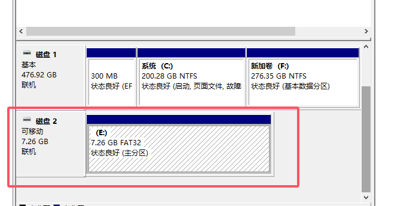

# （三十九）利用Timer1实现高精度延时


## 0. u-boot相关修改

之前自己不懂，后来开发了Linux驱动项目的时候，做Linux系统，才发现原来自己之前的做法都是画蛇添足了。

首先，用Windows的磁盘管理，把TF卡格式化了，只有一个FAT32分区。



然后在Linux系统里面，参照我这篇Linux驱动开发项目做Linux系统的文章

[二：编译烧写Linux到开发板上并移植驱动 - 知乎](https://zhuanlan.zhihu.com/p/717910629)

直接把 `u-boot-sunxi-with-spl.bin` 这个u-boot的二进制文件刷到卡里，并不影响分区。

```bash
sudo dd if=u-boot-sunxi-with-spl.bin of=/dev/sdb bs=1024 seek=8
```

然后上电启动，进入u-boot之后敲空格暂停，设置启动环境参数，直接让u-boot自动启动内核就行了，这样就没必要自己手动输入启动了。

顺便说明一下，因为只有一个FAT32的单独分区，u-boot保存环境参数就是保存在这个单独FAT32的分区里面，可以直接读取。

```bash
setenv bootcmd 'fatload mmc 0:1 0x4e000000 kernel.elf; bootelf 0x4e000000'
saveenv

```

这样以后直接上电等待一下，就能自动进入内核了。


## 1. 重写HOS的timer驱动

在Linux驱动开发项目总结了一套我自认为比较好的范式，因此直接移植到HOS来了。

timer.h

```c
//
// Created by huangcheng on 2024/7/13.
//

#ifndef HOS_TIMER_H
#define HOS_TIMER_H

#include "../../lib/lib_kernel/lib_kernel.h"

// timer初始化函数
void init_timer();
// timer退出函数
void exit_timer();
// timer中断处理函数
void interrupt_handler_timer();

// ticks是内核自中断开启以来总共的嘀嗒数
extern uint32_t total_ticks;

// 设置 timer1 延时（微秒）
void set_timer1_delay_us(uint32_t us);
// 检查 timer1 是否完成倒计时
bool is_timer1_done();

#endif //HOS_TIMER_H

```

timer.c

```c
//
// Created by huangcheng on 2024/7/13.
//

#include "timer.h"

#include "../../kernel/kernel_device/kernel_device.h"
#include "../../kernel/kernel_task/kernel_task.h"

// 注册宏，定义一个驱动结构体，把驱动结构体实例放到驱动段
REGISTER_DRIVER(timer_driver){
        .driver_name = "timer",
        .init = init_timer,
        .exit = exit_timer,
        .irq = 50,              // 根据Allwinner_H3_Datasheet_v1.2.pdf，page 207，Timer 0的中断号是50
        .trigger_mode = 0,
        .irq_interrupt_handler = interrupt_handler_timer,
};

// 这部分内容来自Allwinner_H3_Datasheet_v1.2.pdf，page 156，Timer Register List

// Allwinner H3 Timer 模块基地址
#define TIMER_BASE_ADDR      0x01C20C00

// Timer 寄存器偏移量
#define TMR_IRQ_EN_REG_OFFSET        0x00    // Timer IRQ 使能寄存器
#define TMR_IRQ_STA_REG_OFFSET       0x04    // Timer 状态寄存器
#define TMR0_CTRL_REG_OFFSET         0x10    // Timer 0 控制寄存器
#define TMR0_INTV_VALUE_REG_OFFSET   0x14    // Timer 0 间隔值寄存器
#define TMR0_CUR_VALUE_REG_OFFSET    0x18    // Timer 0 当前值寄存器
#define TMR1_CTRL_REG_OFFSET         0x20    // Timer 1 控制寄存器
#define TMR1_INTV_VALUE_REG_OFFSET   0x24    // Timer 1 间隔值寄存器
#define TMR1_CUR_VALUE_REG_OFFSET    0x28    // Timer 1 当前值寄存器

// AVS（音视频同步）相关寄存器偏移量
#define AVS_CNT_CTL_REG_OFFSET       0x80    // AVS 控制寄存器
#define AVS_CNT0_REG_OFFSET          0x84    // AVS 计数器 0 寄存器
#define AVS_CNT1_REG_OFFSET          0x88    // AVS 计数器 1 寄存器
#define AVS_CNT_DIV_REG_OFFSET       0x8C    // AVS 分频寄存器

// Watchdog（看门狗）相关寄存器偏移量
#define WDOG0_IRQ_EN_REG_OFFSET      0xA0    // Watchdog 0 中断使能寄存器
#define WDOG0_IRQ_STA_REG_OFFSET     0xA4    // Watchdog 0 状态寄存器
#define WDOG0_CTRL_REG_OFFSET        0xB0    // Watchdog 0 控制寄存器
#define WDOG0_CFG_REG_OFFSET         0xB4    // Watchdog 0 配置寄存器
#define WDOG0_MODE_REG_OFFSET        0xB8    // Watchdog 0 模式寄存器

// 完整寄存器地址计算
#define TMR_IRQ_EN_REG        (TIMER_BASE_ADDR + TMR_IRQ_EN_REG_OFFSET)         // Timer IRQ 使能寄存器
#define TMR_IRQ_STA_REG       (TIMER_BASE_ADDR + TMR_IRQ_STA_REG_OFFSET)        // Timer 状态寄存器
#define TMR0_CTRL_REG         (TIMER_BASE_ADDR + TMR0_CTRL_REG_OFFSET)          // Timer 0 控制寄存器
#define TMR0_INTV_VALUE_REG   (TIMER_BASE_ADDR + TMR0_INTV_VALUE_REG_OFFSET)    // Timer 0 间隔值寄存器
#define TMR0_CUR_VALUE_REG    (TIMER_BASE_ADDR + TMR0_CUR_VALUE_REG_OFFSET)     // Timer 0 当前值寄存器
#define TMR1_CTRL_REG         (TIMER_BASE_ADDR + TMR1_CTRL_REG_OFFSET)          // Timer 1 控制寄存器
#define TMR1_INTV_VALUE_REG   (TIMER_BASE_ADDR + TMR1_INTV_VALUE_REG_OFFSET)    // Timer 1 间隔值寄存器
#define TMR1_CUR_VALUE_REG    (TIMER_BASE_ADDR + TMR1_CUR_VALUE_REG_OFFSET)     // Timer 1 当前值寄存器

#define AVS_CNT_CTL_REG       (TIMER_BASE_ADDR + AVS_CNT_CTL_REG_OFFSET)        // AVS 控制寄存器
#define AVS_CNT0_REG          (TIMER_BASE_ADDR + AVS_CNT0_REG_OFFSET)           // AVS 计数器 0 寄存器
#define AVS_CNT1_REG          (TIMER_BASE_ADDR + AVS_CNT1_REG_OFFSET)           // AVS 计数器 1 寄存器
#define AVS_CNT_DIV_REG       (TIMER_BASE_ADDR + AVS_CNT_DIV_REG_OFFSET)        // AVS 分频寄存器

#define WDOG0_IRQ_EN_REG      (TIMER_BASE_ADDR + WDOG0_IRQ_EN_REG_OFFSET)       // Watchdog 0 中断使能寄存器
#define WDOG0_IRQ_STA_REG     (TIMER_BASE_ADDR + WDOG0_IRQ_STA_REG_OFFSET)      // Watchdog 0 状态寄存器
#define WDOG0_CTRL_REG        (TIMER_BASE_ADDR + WDOG0_CTRL_REG_OFFSET)         // Watchdog 0 控制寄存器
#define WDOG0_CFG_REG         (TIMER_BASE_ADDR + WDOG0_CFG_REG_OFFSET)          // Watchdog 0 配置寄存器
#define WDOG0_MODE_REG        (TIMER_BASE_ADDR + WDOG0_MODE_REG_OFFSET)         // Watchdog 0 模式寄存器

// 以下来自于 Allwinner H3 数据手册，p156的 TMR_IRQ_EN_REG Register

// TMR_IRQ_EN_REG 寄存器位域定义
typedef struct {
    uint32_t TMR0_IRQ_EN     : 1;  // [0] Timer 0 中断使能，0=无效，1=使能 Timer 0 到达中断值时触发中断
    uint32_t TMR1_IRQ_EN     : 1;  // [1] Timer 1 中断使能，0=无效，1=使能 Timer 1 到达中断值时触发中断
    uint32_t RESERVED2_31    : 30; // [2:31] 保留未使用，读写时忽略
} TMR_IRQ_EN_REG_t;

// 以下来自于 Allwinner H3 数据手册，p157的 TMR_IRQ_STA_REG Register

// TMR_IRQ_STA_REG 寄存器位域定义
typedef struct {
    uint32_t TMR0_IRQ_PEND   : 1;  // [0] Timer 0 中断挂起状态，0=无效，1=挂起，表示 Timer 0 达到间隔值
    uint32_t TMR1_IRQ_PEND   : 1;  // [1] Timer 1 中断挂起状态，0=无效，1=挂起，表示 Timer 1 达到间隔值
    uint32_t RESERVED2_31    : 30; // [2:31] 保留未使用，读写时忽略
} TMR_IRQ_STA_REG_t;

// 以下来自于 Allwinner H3 数据手册，p157的 TMR0_CTRL_REG Register

// TMR0_CTRL_REG 寄存器位域定义
typedef struct {
    uint32_t TMR0_EN         : 1;  // [0] Timer 0 启动，0=停止/暂停，1=启动
    uint32_t TMR0_RELOAD     : 1;  // [1] Timer 0 重载，0=无效，1=重载 Timer 0 间隔值
    uint32_t TMR0_CLK_SRC    : 2;  // [2:3] Timer 0 时钟源，00=内部OSC/N（约32KHz），01=OSC24M，其他保留
    uint32_t TMR0_CLK_PRES   : 3;  // [4:6] Timer 0 时钟预分频器，000=/1，001=/2，010=/4，011=/8，100=/16，101=/32，110=/64，111=/128
    uint32_t TMR0_MODE       : 1;  // [7] Timer 0 模式，0=连续模式，1=单次模式
    uint32_t RESERVED8_31    : 24; // [8:31] 保留未使用，读写时忽略
} TMR0_CTRL_REG_t;

// 以下来自于 Allwinner H3 数据手册，p158的 TMR0_INTV_VALUE_REG Register

// TMR0_INTV_VALUE_REG 寄存器位域定义
typedef struct {
    uint32_t TMR0_INTV_VALUE : 32; // [0:31] Timer 0 间隔值，定义计数的初始值
} TMR0_INTV_VALUE_REG_t;

// 以下来自于 Allwinner H3 数据手册，p158的 TMR0_CUR_VALUE_REG Register

// TMR0_CUR_VALUE_REG 寄存器位域定义
typedef struct {
    uint32_t TMR0_CUR_VALUE  : 32; // [0:31] Timer 0 当前值，32位递减计数器（从间隔值倒计至 0）
} TMR0_CUR_VALUE_REG_t;

// 以下来自于 Allwinner H3 数据手册，p158的 TMR1_CTRL_REG Register

// TMR1_CTRL_REG 寄存器位域定义
typedef struct {
    uint32_t TMR1_EN         : 1;  // [0] Timer 1 启动，0=停止/暂停，1=启动
    uint32_t TMR1_RELOAD     : 1;  // [1] Timer 1 重载，0=无效，1=重载 Timer 1 间隔值
    uint32_t TMR1_CLK_SRC    : 2;  // [2:3] Timer 1 时钟源，00=内部OSC/N（约32KHz），01=OSC24M，其他保留
    uint32_t TMR1_CLK_PRES   : 3;  // [4:6] Timer 1 时钟预分频器，000=/1，001=/2，010=/4，011=/8，100=/16，101=/32，110=/64，111=/128
    uint32_t TMR1_MODE       : 1;  // [7] Timer 1 模式，0=连续模式，1=单次模式
    uint32_t RESERVED8_31    : 24; // [8:31] 保留未使用，读写时忽略
} TMR1_CTRL_REG_t;

// 以下来自于 Allwinner H3 数据手册，p159的 TMR1_INTV_VALUE_REG Register

// TMR1_INTV_VALUE_REG 寄存器位域定义
typedef struct {
    uint32_t TMR1_INTV_VALUE : 32; // [0:31] Timer 1 间隔值，定义计数的初始值
} TMR1_INTV_VALUE_REG_t;

// 以下来自于 Allwinner H3 数据手册，p159的 TMR1_CUR_VALUE_REG Register

// TMR1_CUR_VALUE_REG 寄存器位域定义
typedef struct {
    uint32_t TMR1_CUR_VALUE  : 32; // [0:31] Timer 1 当前值，32位递减计数器（从间隔值倒计至 0）
} TMR1_CUR_VALUE_REG_t;

// 以下来自于 Allwinner H3 数据手册，p160的 AVS_CNT_CTL_REG Register

// AVS_CNT_CTL_REG 寄存器位域定义
typedef struct {
    uint32_t AVS_CNT0_EN     : 1;  // [0] 音视频同步计数器 0 启动/禁用，0=禁用，1=启用
    uint32_t AVS_CNT1_EN     : 1;  // [1] 音视频同步计数器 1 启动/禁用，0=禁用，1=启用
    uint32_t RESERVED2_6     : 5;  // [2:6] 保留未使用
    uint32_t AVS_CNT0_PS     : 1;  // [7] 音视频同步计数器 0 暂停控制，0=不暂停，1=暂停计数器 0
    uint32_t AVS_CNT1_PS     : 1;  // [8] 音视频同步计数器 1 暂停控制，0=不暂停，1=暂停计数器 1
    uint32_t RESERVED10_31   : 22; // [10:31] 保留未使用
} AVS_CNT_CTL_REG_t;

// 以下来自于 Allwinner H3 数据手册，p160的 AVS_CNT0_REG Register

// AVS_CNT0_REG 寄存器位域定义
typedef struct {
    uint32_t AVS_CNT0        : 32; // [0:31] 音视频同步应用的计数器 0 的高 32 位
} AVS_CNT0_REG_t;

// 以下来自于 Allwinner H3 数据手册，p161的 AVS_CNT1_REG Register

// AVS_CNT1_REG 寄存器位域定义
typedef struct {
    uint32_t AVS_CNT1        : 32; // [0:31] 音视频同步应用的计数器 1 的高 32 位（总 33 位计数器）
} AVS_CNT1_REG_t;

// 以下来自于 Allwinner H3 数据手册，p161的 AVS_CNT_DIV_REG Register

// AVS_CNT_DIV_REG 寄存器位域定义
typedef struct {
    uint32_t AVS_CNT0_D      : 12; // [0:11] AVS 计数器 0 的除数 N0，计算公式：24MHz/ (N0 + 1)
    uint32_t RESERVED12_15   : 4;  // [12:15] 保留未使用
    uint32_t AVS_CNT1_D      : 12; // [16:27] AVS 计数器 1 的除数 N1，计算公式：24MHz/ (N1 + 1)
    uint32_t RESERVED28_31   : 4;  // [28:31] 保留未使用
} AVS_CNT_DIV_REG_t;

// 以下来自于 Allwinner H3 数据手册，p162的 WDOG0_IRQ_EN_REG Register

// WDOG0_IRQ_EN_REG 寄存器位域定义
typedef struct {
    uint32_t WDOG0_IRQ_EN    : 1;  // [0] Watchdog0 中断使能，0=无效，1=使能 Watchdog0 中断
    uint32_t RESERVED1_31    : 31; // [1:31] 保留未使用
} WDOG0_IRQ_EN_REG_t;

// 以下来自于 Allwinner H3 数据手册，p162的 WDOG0_IRQ_STA_REG Register

// WDOG0_IRQ_STA_REG 寄存器位域定义
typedef struct {
    uint32_t WDOG0_IRQ_PEND  : 1;  // [0] Watchdog0 中断挂起，0=无效，1=挂起，表示 Watchdog0 到达间隔值
    uint32_t RESERVED1_31    : 31; // [1:31] 保留未使用
} WDOG0_IRQ_STA_REG_t;

// 以下来自于 Allwinner H3 数据手册，p162的 WDOG0_CTRL_REG Register

// WDOG0_CTRL_REG 寄存器位域定义
typedef struct {
    uint32_t WDOG0_RSTART    : 1;  // [0] Watchdog0 重启，0=无效，1=重启 Watchdog0
    uint32_t RESERVED1_11    : 11; // [1:11] 保留未使用
    uint32_t WDOG0_KEY_FIELD : 20; // [12:31] Watchdog0 密钥字段，需写入 0xA57 以启用写入操作
} WDOG0_CTRL_REG_t;

// timer初始化函数
void init_timer() {

    // 禁用 timer0 和 timer1
    *(volatile uint32_t*)TMR0_CTRL_REG = 0;
    *(volatile uint32_t*)TMR1_CTRL_REG = 0;

    // 初始化 timer1，作为10ms范围以内高精度计时的定时器，但是不触发中断

    TMR1_CTRL_REG_t *timer1_ctrl = (TMR1_CTRL_REG_t *)TMR1_CTRL_REG;

    timer1_ctrl->TMR1_RELOAD = 0;           // 启用重装载（因为是用于计时，每次都不一样，所以不可能重装载）
    timer1_ctrl->TMR1_CLK_SRC = 0;          // 设置时钟源为 24 MHz源
    timer1_ctrl->TMR1_CLK_PRES = 0;         // 不进行预分频
    timer1_ctrl->TMR1_MODE = 1;             // 设置为单次模式（因为是用于计时，每次都不一样，所以不可能设置为连续模式）

    // 设置 timer0 的初始计数值为 10ms 间隔，使用 32kHz 时钟源
    TMR0_CTRL_REG_t *timer0_ctrl = (TMR0_CTRL_REG_t *)TMR0_CTRL_REG;
    timer0_ctrl->TMR0_EN = 0;               // 停止 timer0
    timer0_ctrl->TMR0_RELOAD = 1;           // 启用重装载
    timer0_ctrl->TMR0_CLK_SRC = 0;          // 设置时钟源为内部 32kHz
    timer0_ctrl->TMR0_CLK_PRES = 0;         // 不进行预分频
    timer0_ctrl->TMR0_MODE = 0;             // 设置为连续模式

    // 我要的中断频率是100Hz，也就是一秒钟中断100次
    // 那么计数值就是 32 * 1000 / 100 = 320

    *(volatile uint32_t*)TMR0_INTV_VALUE_REG = 320;  // 10ms 间隔（32kHz 时钟源）

    // 启用 timer0 的中断
    TMR_IRQ_EN_REG_t* irq_en_reg = (TMR_IRQ_EN_REG_t*)TMR_IRQ_EN_REG;
    irq_en_reg->TMR0_IRQ_EN = 1;

    // 启动 timer0
    timer0_ctrl->TMR0_EN = 1;
}

// timer退出函数
void exit_timer() {
    // 禁用 timer0 和 timer1
    TMR0_CTRL_REG_t* timer0_ctrl = (TMR0_CTRL_REG_t*)TMR0_CTRL_REG;
    TMR1_CTRL_REG_t* timer1_ctrl = (TMR1_CTRL_REG_t*)TMR1_CTRL_REG;

    timer0_ctrl->TMR0_EN = 0;  // 禁用 timer0
    timer1_ctrl->TMR1_EN = 0;  // 禁用 timer1

    // 禁用所有 Timer 中断
    TMR_IRQ_EN_REG_t* irq_en_reg = (TMR_IRQ_EN_REG_t*)TMR_IRQ_EN_REG;
    irq_en_reg->TMR0_IRQ_EN = 0;
    irq_en_reg->TMR1_IRQ_EN = 0;
}

// 初始化
uint32_t total_ticks = 0;

// timer中断处理函数
void interrupt_handler_timer() {
    // 逻辑代码
    struct task* cur_task = running_task();
    cur_task->elapsed_ticks++;	  // 记录此线程占用的cpu时间嘀嗒数

    total_ticks++;                // 总时长增加

    if (cur_task->ticks == 0) {	  // 若任务时间片用完就开始调度新的任务上cpu
        task_schedule();
    } else {				  // 将当前任务的时间片-1
        cur_task->ticks--;
    }

    // 清除 Timer 0 中断挂起状态
    TMR_IRQ_STA_REG_t* irq_status = (TMR_IRQ_STA_REG_t*)TMR_IRQ_STA_REG;
    irq_status->TMR0_IRQ_PEND = 1;
}

// 设置 timer1 延时（微秒）
void set_timer1_delay_us(uint32_t us) {
    // 计算倒计时的计数值
    // 如果是1us，那么就是每秒频率10^6次，也就是1M
    // 那么每us计时就是 24MHz / 1MHz = 24
    uint32_t count_value = us * 24;

    // 停止 timer1 并设置倒计时值
    TMR1_CTRL_REG_t *timer1_ctrl = (TMR1_CTRL_REG_t *)TMR1_CTRL_REG;
    timer1_ctrl->TMR1_EN = 0;            // 停止计数

    *(volatile uint32_t *)TMR1_INTV_VALUE_REG = count_value;
    *(volatile uint32_t *)TMR1_CUR_VALUE_REG = 0;

    // 其他参数已经在初始化中配置好，这里不要配置
    timer1_ctrl->TMR1_EN = 1;            // 启动 timer1
}

// 检查 timer1 是否完成倒计时
bool is_timer1_done() {
    return (*(volatile uint32_t *)TMR1_CUR_VALUE_REG == 0);
}

```

可能这不符合代码简洁优雅的要求，但是我更看重的是信息的清晰和全面性，我认为这样直接把数据手册上的各种信息全部搬到注释中，可以减少查阅数据手册的烦恼，是比较适合我自己的工程实践方法论。


## 2. 基于timer1实现kernel_delay

kernel_delay.h

```c
//
// Created by huangcheng on 2024/10/30.
//

#ifndef HOS_KERNEL_DELAY_H
#define HOS_KERNEL_DELAY_H

#include "../../lib/lib_kernel/lib_kernel.h"

// 对于8ms（8000us）以下的延时，该函数直接使用 timer1 的 us 级延时功能，并通过轮询等待直到时间到达目标。该函数只能用于8ms以下的延时。
void kernel_delay(uint32_t us);

#endif //HOS_KERNEL_DELAY_H

```

kernel_delay.c

```c
//
// Created by huangcheng on 2024/10/30.
//

#include "kernel_delay.h"
#include "../../devices/timer/timer.h"

#define MAX_DELAY_US 8000  // 8ms，超过这个值的延时不在此模块处理范围

// 为什么是8ms，timer0划定的时间片就是10ms，害怕又出什么问题，所以还是留一点余量，8ms作为上限

void kernel_delay(uint32_t us) {
    // 检查延时范围
    if (us > MAX_DELAY_US) {
        // 如果延时超过最大值，直接返回。后续可能结合多任务机制处理更长的延时。
        return;
    }

    // 设置 timer1 的延时
    set_timer1_delay_us(us);

    // 轮询等待直到 timer1 倒计时结束
    while (!is_timer1_done()) {
        // 在此处轮询，不进行其他操作
    }
}

```

Makefile

```makefile

# 目录
KERNEL_DIR = ..
KERNEL_DELAY_DIR = .

# 源文件
KERNEL_DELAY_C_SRC = $(KERNEL_DELAY_DIR)/kernel_delay.c

# C 编译标志
CFLAGS = -ffreestanding -nostdlib -Wall -Wextra

# 标签标记所有的任务（输出什么文件），方便修改
KERNEL_OBJS = $(KERNEL_DIR)/kernel_delay.o

.PHONY: all

all: $(KERNEL_OBJS)

# 编出来放到模块文件夹kernel去，别放在这里，方便主Makefile找
$(KERNEL_DIR)/kernel_delay.o: $(KERNEL_DELAY_C_SRC)
	$(GCC) $(CFLAGS) -c -o $@ $<

# 文件不生成于此，无需清理规则

```


kernel文件夹的Makefile

```makefile

# 目录
KERNEL_DIR = .

# 所有组件目录
PAGE_DIR = kernel_page
TASK_DIR = kernel_task
MEMORY_DIR = kernel_memory
INTERRUPT_DIR = kernel_interrupt
BUFFER_DIR = kernel_buffer
DEVICE_DIR = kernel_device
DELAY_DIR = kernel_delay

# 标签标记所有的任务（输出什么文件），方便修改
KERNEL_OBJS = $(KERNEL_DIR)/kernel_page.o \
				$(KERNEL_DIR)/kernel_task.o \
				$(KERNEL_DIR)/kernel_memory.o \
				$(KERNEL_DIR)/kernel_interrupt.o \
				$(KERNEL_DIR)/kernel_buffer.o \
				$(KERNEL_DIR)/kernel_device.o \
				$(KERNEL_DIR)/kernel_delay.o

# C 编译标志
CFLAGS = -ffreestanding -nostdlib -Wall -Wextra

.PHONY: all

all: $(KERNEL_OBJS)

# 执行各子模块编译
$(KERNEL_DIR)/kernel_page.o:
	$(MAKE) -C $(PAGE_DIR) GCC=$(GCC) AS=$(AS) MAKE=$(MAKE)

$(KERNEL_DIR)/kernel_task.o:
	$(MAKE) -C $(TASK_DIR) GCC=$(GCC) AS=$(AS) MAKE=$(MAKE)

$(KERNEL_DIR)/kernel_memory.o:
	$(MAKE) -C $(MEMORY_DIR) GCC=$(GCC) AS=$(AS) MAKE=$(MAKE)

$(KERNEL_DIR)/kernel_interrupt.o:
	$(MAKE) -C $(INTERRUPT_DIR) GCC=$(GCC) AS=$(AS) MAKE=$(MAKE)

$(KERNEL_DIR)/kernel_buffer.o:
	$(MAKE) -C $(BUFFER_DIR) GCC=$(GCC) AS=$(AS) MAKE=$(MAKE)

$(KERNEL_DIR)/kernel_device.o:
	$(MAKE) -C $(DEVICE_DIR) GCC=$(GCC) AS=$(AS) MAKE=$(MAKE)

$(KERNEL_DIR)/kernel_delay.o:
	$(MAKE) -C $(DELAY_DIR) GCC=$(GCC) AS=$(AS) MAKE=$(MAKE)

# 清理规则
clean:
	@if exist $(KERNEL_DIR)\\*.o del $(KERNEL_DIR)\\*.o
	@if exist $(KERNEL_DIR)\\*.elf del $(KERNEL_DIR)\\*.elf

```

如此就能实现毫秒级的高精度延时了。


## 3. 未来计划

最近当学徒事情挺多，虽然有师傅带，很多还是要自己研究，所以没法像之前一样集中精力写码更项目了。

可能十二月底吧，又要考证，又需要刷题。

而且最近还在学英语，想着明年能不能考雅思来着。英语学习现在也进入比较关键的阶段了，每天都需要保持学习。

一来一回，几乎没时间写码了，只能随缘更新了。

虽然说随缘，但是还是有一些粗略的计划的。

目前来说，设想的HOS项目的未来更新计划（不分先后，哪个容易哪个有条件就先做哪个）是：

- Shell的实现（这部分差不多就是照抄《操作系统真象还原》里面的Shell的实现就行了）
- 尝试移植 FAT32 文件系统（因为我自己实现的HCFileSystem只是个玩具，用来学习的，不能实用，我非常清楚这一点，也许可以把HCFileSystem改为FAT32的一种实现形式也可以）。
- 尝试实现 TF 卡槽（MMC）驱动，能结合FAT32文件系统实现真正的文件管理。
- 尝试移植 Linux 驱动开发项目中开发的DMA驱动到 HOS。
- 尝试实现完整的GPIO驱动，并且外接设备，让HOS真正操控外部的设备。