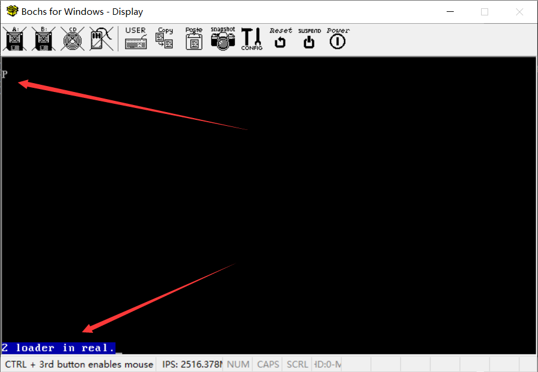

# （三）进入保护模式

## 1. 段式内存管理

### 1.1 实模式下的段式内存管理

在实模式下，x86处理器使用段式内存管理来访问内存。实模式内存管理的核心思想是将内存分为多个段，每个段都有一个段基址（Segment Base Address）和一个段偏移（Segment Offset）。访问内存时，通过段基址和段偏移计算实际的物理地址。 

简单例子：
- 假设段寄存器CS（代码段）中存储的值是0x1000，指令指针寄存器IP（偏移）中存储的值是0x0200。那么，物理地址计算如下：
  - 物理地址 = 段基址 * 16 + 段偏移
  - 物理地址 = 0x1000 * 16 + 0x0200 = 0x10000 + 0x0200 = 0x10200

### 1.2 保护模式下的段式内存管理

保护模式下的段式内存管理更加复杂和灵活，它引入了许多新特性以支持现代操作系统的需求，比如内存保护、多任务处理和更大的内存地址空间。在保护模式下，内存管理涉及到以下几个关键的寄存器和数据结构：

#### 1.2.1 寄存器
- **段寄存器（Segment Registers）**：包括CS（代码段）、DS（数据段）、SS（堆栈段）、ES、FS和GS。这些寄存器不再直接存储段基址，而是存储一个段选择子（Segment Selector）。
- **全局描述符表寄存器（GDTR）**：存储GDT的基址和长度。
- **局部描述符表寄存器（LDTR）**：存储LDT的基址和长度。
- **任务状态段寄存器（TR）**：存储当前任务的TSS段选择子。

#### 1.2.2 段选择子（Segment Selector）
段选择子是一个16位的值，包含以下信息（注意，是从低地址到高地址，比如 `0x12345678` ，其中12就是高地址，78就是低地址）：
- **索引（Index）**：第3到15位，用于索引GDT或LDT中的段描述符。
- **TI位（Table Indicator）**：第2位，表示选择子指向的是GDT（0）还是LDT（1）。
- **请求特权级（RPL，Requested Privilege Level）**：第0和1位，表示请求的特权级别（0-3）。

**请求特权级（RPL）**用于请求特权级别的管理。特权级别的范围是0到3，数值越低表示权限越高，即 **0级具有最高权限，3级具有最低权限** 。保护模式的 “保护” ，就是基于请求特权级来实现的。

RPL用于确定请求访问段时的有效特权级别（Effective Privilege Level，EPL），它与当前任务的特权级（Current Privilege Level，CPL）以及段描述符中的特权级（Descriptor Privilege Level，DPL）共同决定访问权限。

有效特权级（EPL）是CPL和RPL之间的较大值，即 `EPL = max(CPL, RPL)`。

**段选择子示例**

假设段选择子为0x001B，它的16位值如下：

- 段选择子值

  ：0x001B（二进制：0000 0000 0001 1011）

  - **索引（Index）**：第3-15位，值为0x0003（索引3）。
  - **TI位（Table Indicator）**：第2位，值为0（指向GDT）。
  - **RPL（Requested Privilege Level）**：第0-1位，值为3。


#### 1.2.3 段描述符（Segment Descriptor）
在保护模式下，段描述符是一个64位（8字节）的结构，用于定义内存段的属性和权限。每个段描述符包含以下几个关键字段：

**段基址（Base Address）**

段基址用于指明段在内存中的起始地址。段基址是一个32位的值，但它被分散在段描述符的不同位置：

- **Base 0-15**：描述符的第0-15位。
- **Base 16-23**：描述符的第32-39位。
- **Base 24-31**：描述符的第56-63位。

例如，如果段基址是0x00ABCDEF，它会被存储为：

- Base 0-15：0xCDEF
- Base 16-23：0xAB
- Base 24-31：0x00

**段限制（Limit）**

段限制用于指明段的大小（长度）。段限制是一个20位的值，也被分散在描述符的不同位置：

- **Limit 0-15**：描述符的第0-15位。
- **Limit 16-19**：描述符的第48-51位。

段限制的解释取决于粒度（G）位：

- 如果G位为0，段限制表示的是字节数，最大为1MB（2^20 - 1）。
- 如果G位为1，段限制表示的是4KB的块数，最大为4GB（2^20 * 4KB - 1）。

例如，如果段限制是0xFFFFF，在G位为1的情况下，表示段的大小是4GB。

**类型（Type）**

类型字段定义了段的性质和访问权限。它包含以下内容：

- 代码段或数据段
  - 对于代码段：可执行、可读取、不可写入。
  - 对于数据段：可读、可写、不可执行。
- **系统段**：用于特定系统用途，如任务状态段（TSS）。

**描述符特权级（DPL，Descriptor Privilege Level）**

DPL字段位于描述符的第45-46位，表示段的特权级别，范围为0到3。值越小特权级别越高。DPL用于控制段的访问权限。

**段存在位（Present Bit，P）**

P位位于描述符的第47位，用于指示段是否存在于内存中：

- 1：段存在于内存中。
- 0：段不在内存中（无效）。

**其他标志（Flags）**

其他标志字段包括：

- **AVL（Available for use by system software）**：第52位，系统软件可用位，通常未使用（0）。
- **L（64-bit code segment）**：第53位，仅对代码段有效，1表示这是一个64位代码段。
- **D/B（Default operation size/Big）**：第54位，对代码段表示默认操作数大小（0表示16位，1表示32位），对数据段表示段的大小（0表示16位，1表示32位）。
- **G（Granularity）**：第55位，表示段限制的粒度：
  - 0：段限制以字节为单位。
  - 1：段限制以4KB块（就是所谓的 “页” ，保护模式下能管理4GB内存，就是靠页这个机制来实现的，一个单位表示一个页）为单位。

**段描述符示例**

假设有一个段描述符，表示一个代码段，基址为0x00ABCDEF，段限制为0xFFFFF，DPL为0，粒度为4KB。

- 段描述符值：
  - **Base 0-15**：0xCDEF（二进制：1100 1101 1110 1111）
  - **Base 16-23**：0xAB（二进制：1010 1011）
  - **Base 24-31**：0x00（二进制：0000 0000）
  - **Limit 0-15**：0xFFFF（二进制：1111 1111 1111 1111）
  - **Limit 16-19**：0xF（二进制：1111）
  - **Type**：0xA（二进制：1010，表示可执行、不可写、非系统段）
  - **DPL**：0x0（二进制：00）
  - **P**：1（二进制：1）
  - **AVL**：0（二进制：0）
  - **L**：0（二进制：0）
  - **D/B**：1（二进制：1）
  - **G**：1（二进制：1）

**表格化**

| 位范围（二进制） | 位数 | 具体值（二进制）    | 十六进制值 | 含义                             |
| ---------------- | ---- | ------------------- | ---------- | -------------------------------- |
| 0-15             | 16   | 1100 1101 1110 1111 | 0xCDEF     | 段基址 (Base 0-15)               |
| 16-31            | 16   | 1111 1111 1111 1111 | 0xFFFF     | 段限制 (Limit 0-15)              |
| 32-39            | 8    | 1010 1011           | 0xAB       | 段基址 (Base 16-23)              |
| 40-43            | 4    | 1111                | 0xF        | 段限制 (Limit 16-19)             |
| 44               | 1    | 0                   | 0x0        | AVL (Available)                  |
| 45               | 1    | 0                   | 0x0        | L (64-bit code segment)          |
| 46               | 1    | 1                   | 0x1        | D/B (Default/Big)                |
| 47               | 1    | 1                   | 0x1        | G (Granularity)                  |
| 48-51            | 4    | 1010                | 0xA        | Type                             |
| 52-53            | 2    | 00                  | 0x0        | DPL (Descriptor Privilege Level) |
| 54               | 1    | 1                   | 0x1        | P (Present)                      |
| 56-63            | 8    | 0000 0000           | 0x00       | 段基址 (Base 24-31)              |

将段描述符的各部分组合起来，可以得到如下完整的段描述符：

```
63      56       47      40       31      16       15       0
+--------+--------+--------+--------+--------+--------+--------+--------+
|  00    |1100 1101 1110 1111|1111 1111 1111 1111| 1010 1011| 1111| 1010| 
+--------+--------+--------+--------+--------+--------+--------+--------+
|Base 24-31 | Base 0-15      | Limit 0-15      | Base 16-23|Limit|Type | 
|            |               |                 |           |16-19|     |
+--------+--------+--------+--------+--------+--------+--------+--------+
| 00    | 0| 1| 1| 1| 00| 1010|      |  00   |
+--------+--------+--------+--------+--------+--------+--------+--------+
| Base 24-31| G | D/B| L | AVL |  DPL | P  |Type  |
+--------+--------+--------+--------+--------+--------+--------+--------+
```

**详细说明**：
- **Base 0-15**（0-15位）：0xCDEF（二进制：1100 1101 1110 1111），表示段基址的低16位。
- **Limit 0-15**（16-31位）：0xFFFF（二进制：1111 1111 1111 1111），表示段限制的低16位。
- **Base 16-23**（32-39位）：0xAB（二进制：1010 1011），表示段基址的中间8位。
- **Limit 16-19**（40-43位）：0xF（二进制：1111），表示段限制的高4位。
- **AVL**（44位）：0（二进制：0），系统软件可用位，未使用。
- **L**（45位）：0（二进制：0），64位代码段标志，表示非64位代码段。
- **D/B**（46位）：1（二进制：1），默认操作数大小，表示32位操作数。
- **G**（47位）：1（二进制：1），粒度标志，表示段限制以4KB块为单位。
- **Type**（48-51位）：0xA（二进制：1010），表示这是一个可执行、不可写入的代码段。
- **DPL**（52-53位）：0x0（二进制：00），表示段的特权级别为0。
- **P**（54位）：1（二进制：1），表示段存在于内存中。
- **Base 24-31**（56-63位）：0x00（二进制：0000 0000），表示段基址的高8位。


### 1.3 全局描述符表（GDT）和局部描述符表（LDT）

- **全局描述符表（GDT）**：GDT是一个全局的段描述符表，存储系统范围内所有段的描述符。每个系统至少有一个GDT，包含系统段（如代码段、数据段、TSS段）和其他全局段的描述符。
- **局部描述符表（LDT）**：LDT是一个进程或任务特定的段描述符表，存储特定进程或任务的段描述符。LDT允许每个任务有自己独立的段集，增强了内存保护和任务隔离。


## 2. 如何进入保护模式

从实模式进入保护模式需要执行一系列步骤，这些步骤包括设置全局描述符表（GDT）、启用A20地址线、修改控制寄存器等。以下是一个简要的步骤说明：

### 步骤1：设置全局描述符表（GDT）

1. **定义GDT**：
   - 定义一个包含至少三个描述符的GDT：一个空描述符、一个代码段描述符和一个数据段描述符。

2. **加载GDT**：
   - 使用`LGDT`指令将GDT加载到GDTR寄存器中。

### 步骤2：启用A20地址线

A20地址线用于访问1MB以上的内存。启用A20地址线以确保系统能够正确访问所有内存地址。

1. **发送命令**：
   - 向键盘控制器发送命令，启用A20地址线。

### 步骤3：禁用中断

在切换到保护模式之前，禁用中断以防止在转换过程中出现意外中断。

1. **CLI指令**：
   - 使用`CLI`指令禁用中断。

### 步骤4：进入保护模式

1. **设置CR0寄存器**：
   - 设置CR0寄存器的PE（保护模式启用，也就是最低位）位，将实模式转换为保护模式。

```assembly
MOV EAX, CR0
OR EAX, 0x00000001       ; 设置PE位
MOV CR0, EAX
```

### 步骤5：刷新指令队列

在切换到保护模式后，立即进行一次短跳转以刷新指令队列。

```assembly
JMP 08h:ProtectedModeLabel
```

### 步骤6：设置段寄存器

在进入保护模式后，重新加载段寄存器以使用新的GDT段描述符。

```assembly
ProtectedModeLabel:
MOV AX, 10h     ; 数据段选择子
MOV DS, AX
MOV ES, AX
MOV FS, AX
MOV GS, AX
MOV SS, AX

MOV AX, 08h     ; 代码段选择子
JMP AX:NewCodeSegment
```

### 步骤7：启用中断

重新启用中断以恢复正常的系统操作。

```assembly
STI
```

通过上述步骤，系统就可以从实模式成功切换到保护模式。以下是一个汇总的代码示例：

```assembly
; 假设GDT已经定义并加载到GDTR中
; 启用A20地址线（特定硬件实现相关）
; 禁用中断
CLI

; 启用保护模式
MOV EAX, CR0
OR EAX, 1       ; 设置PE位
MOV CR0, EAX

; 刷新指令队列
JMP 08h:ProtectedModeLabel

ProtectedModeLabel:
; 设置段寄存器
MOV AX, 10h     ; 数据段选择子
MOV DS, AX
MOV ES, AX
MOV FS, AX
MOV GS, AX
MOV SS, AX

MOV AX, 08h     ; 代码段选择子
JMP AX:NewCodeSegment

NewCodeSegment:
; 保护模式下的代码
STI
```

以上步骤完成后，系统将处于保护模式，使用新的段描述符和内存管理方式。


## 3. 在Loader中的操作

首先修改boot.inc这个预加载文件

```assembly
; 配置加载Loader和加载内核需要用到的一些宏定义
;-------------	 loader和kernel   ----------
LOADER_BASE_ADDR    equ 0x900   ; 定义加载器的基址
LOADER_START_SECTOR equ 0x2     ; 定义加载器的起始扇区

;---------------    硬盘寄存器   -------------------
; Primary 通道
DATA_REG          equ 0x1f0  ; 数据寄存器
ERROR_REG         equ 0x1f1  ; 错误寄存器/预编译寄存器
SECTOR_COUNT_REG  equ 0x1f2  ; 扇区计数寄存器
SECTOR_NUM_REG    equ 0x1f3  ; 扇区号寄存器
CYL_LOW_REG       equ 0x1f4  ; 柱面号低字节寄存器
CYL_HIGH_REG      equ 0x1f5  ; 柱面号高字节寄存器
DRIVE_HEAD_REG    equ 0x1f6  ; 驱动器/磁头寄存器
STATUS_CMD_REG    equ 0x1f7  ; 状态寄存器/命令寄存器
CONTROL_REG       equ 0x3f6  ; 控制寄存器

; Secondary 通道
SEC_DATA_REG          equ 0x170  ; 数据寄存器
SEC_ERROR_REG         equ 0x171  ; 错误寄存器/预编译寄存器
SEC_SECTOR_COUNT_REG  equ 0x172  ; 扇区计数寄存器
SEC_SECTOR_NUM_REG    equ 0x173  ; 扇区号寄存器
SEC_CYL_LOW_REG       equ 0x174  ; 柱面号低字节寄存器
SEC_CYL_HIGH_REG      equ 0x175  ; 柱面号高字节寄存器
SEC_DRIVE_HEAD_REG    equ 0x176  ; 驱动器/磁头寄存器
SEC_STATUS_CMD_REG    equ 0x177  ; 状态寄存器/命令寄存器
SEC_CONTROL_REG       equ 0x376  ; 控制寄存器

;--------------   gdt描述符属性  -------------
; DESC_G_4K: 4KB 粒度标志
DESC_G_4K   equ	  1_00000000000000000000000b   
; DESC_D_32: 默认操作数大小（32位）
DESC_D_32   equ	   1_0000000000000000000000b
; DESC_L: 64位代码段标志（此处设置为0）
DESC_L	    equ	    0_000000000000000000000b
; DESC_AVL: 系统软件可用位（通常设置为0）
DESC_AVL    equ	     0_00000000000000000000b
; DESC_LIMIT_CODE2: 代码段的段限制高4位
DESC_LIMIT_CODE2  equ 1111_0000000000000000b
; DESC_LIMIT_DATA2: 数据段的段限制高4位，与代码段相同
DESC_LIMIT_DATA2  equ DESC_LIMIT_CODE2
; DESC_LIMIT_VIDEO2: 视频段的段限制高4位
DESC_LIMIT_VIDEO2  equ 0000_000000000000000b
; DESC_P: 段存在标志
DESC_P	    equ		  1_000000000000000b
; DESC_DPL_0: 描述符特权级0
DESC_DPL_0  equ		   00_0000000000000b
; DESC_DPL_1: 描述符特权级1
DESC_DPL_1  equ		   01_0000000000000b
; DESC_DPL_2: 描述符特权级2
DESC_DPL_2  equ		   10_0000000000000b
; DESC_DPL_3: 描述符特权级3
DESC_DPL_3  equ		   11_0000000000000b
; DESC_S_CODE: 代码段
DESC_S_CODE equ		     1_000000000000b
; DESC_S_DATA: 数据段，与代码段相同
DESC_S_DATA equ	  DESC_S_CODE
; DESC_S_sys: 系统段
DESC_S_sys  equ		     0_000000000000b
; DESC_TYPE_CODE: 代码段类型属性（可执行、不可读取、已访问位清0）
DESC_TYPE_CODE  equ	      1000_00000000b	;x=1,c=0,r=0,a=0  
; DESC_TYPE_DATA: 数据段类型属性（不可执行、向上扩展、可写、已访问位清0）
DESC_TYPE_DATA  equ	      0010_00000000b	;x=0,e=0,w=1,a=0 

; DESC_CODE_HIGH4: 代码段描述符的高32位（包括基地址、段限制、标志等）
DESC_CODE_HIGH4 equ (0x00 << 24) + DESC_G_4K + DESC_D_32 + DESC_L + DESC_AVL + DESC_LIMIT_CODE2 + DESC_P + DESC_DPL_0 + DESC_S_CODE + DESC_TYPE_CODE + 0x00
; DESC_DATA_HIGH4: 数据段描述符的高32位（包括基地址、段限制、标志等）
DESC_DATA_HIGH4 equ (0x00 << 24) + DESC_G_4K + DESC_D_32 + DESC_L + DESC_AVL + DESC_LIMIT_DATA2 + DESC_P + DESC_DPL_0 + DESC_S_DATA + DESC_TYPE_DATA + 0x00
; DESC_VIDEO_HIGH4: 视频段描述符的高32位（包括基地址、段限制、标志等）
DESC_VIDEO_HIGH4 equ (0x00 << 24) + DESC_G_4K + DESC_D_32 + DESC_L + DESC_AVL + DESC_LIMIT_VIDEO2 + DESC_P + DESC_DPL_0 + DESC_S_DATA + DESC_TYPE_DATA + 0x0b

;--------------   段选择子属性  ---------------
; RPL0: 请求特权级0
RPL0  equ   00b
; RPL1: 请求特权级1
RPL1  equ   01b
; RPL2: 请求特权级2
RPL2  equ   10b
; RPL3: 请求特权级3
RPL3  equ   11b
; TI_GDT: 表示选择子指向GDT（全局描述符表）
TI_GDT	 equ   000b
; TI_LDT: 表示选择子指向LDT（局部描述符表）
TI_LDT	 equ   100b

```

修改loader.asm如下：

```assembly
;------------------- loader.inc -------------------

%include "boot.inc"

;------------------- loader代码段 -------------------
section loader vstart=LOADER_BASE_ADDR
LOADER_STACK_TOP equ LOADER_BASE_ADDR

jmp loader_start  ; 跳转到loader_start处开始执行代码

;------------------- 构建GDT及其内部的描述符 -------------------
GDT_BASE:   
    dd 0x00000000  ; 第一个描述符（空描述符）
    dd 0x00000000

CODE_DESC:  
    dd 0x0000FFFF  ; 代码段基址低16位和段限制低16位
    dd DESC_CODE_HIGH4  ; 代码段的高32位描述符属性

DATA_STACK_DESC:  
    dd 0x0000FFFF  ; 数据段基址低16位和段限制低16位
    dd DESC_DATA_HIGH4  ; 数据段的高32位描述符属性

VIDEO_DESC: 
    dd 0x80000007  ; 视频段基址低16位和段限制低16位 (limit=(0xbffff-0xb8000)/4k=0x7)
    dd DESC_VIDEO_HIGH4  ; 视频段的高32位描述符属性，此时DPL已改为0

GDT_SIZE equ $ - GDT_BASE
GDT_LIMIT equ GDT_SIZE - 1 
times 60 dq 0  ; 预留60个描述符的空位

; 选择子
SELECTOR_CODE equ (0x0001 << 3) + TI_GDT + RPL0  ; 代码段选择子
SELECTOR_DATA equ (0x0002 << 3) + TI_GDT + RPL0  ; 数据段选择子
SELECTOR_VIDEO equ (0x0003 << 3) + TI_GDT + RPL0  ; 视频段选择子
    
; 定义GDT指针，前2字节是GDT界限，后4字节是GDT起始地址
gdt_ptr:  
    dw GDT_LIMIT
    dd GDT_BASE


loadermsg db '2 loader in real.'

loader_start:

;------------------------------------------------------------
; INT 0x10    功能号:0x13    功能描述:打印字符串
;------------------------------------------------------------
; 输入:
; AH 子功能号=13H
; BH = 页码
; BL = 属性(若AL=00H或01H)
; CX = 字符串长度
; (DH、DL) = 坐标(行、列)
; ES:BP = 字符串地址 
; AL = 显示输出方式
;    0 —— 字符串中只含显示字符，其显示属性在BL中。显示后，光标位置不变
;    1 —— 字符串中只含显示字符，其显示属性在BL中。显示后，光标位置改变
;    2 —— 字符串中含显示字符和显示属性。显示后，光标位置不变
;    3 —— 字符串中含显示字符和显示属性。显示后，光标位置改变
; 无返回值
    mov sp, LOADER_BASE_ADDR  ; 设置栈顶地址
    mov bp, loadermsg  ; 设置BP指向字符串地址
    mov cx, 17  ; 设置字符串长度为17
    mov ax, 0x1301  ; 设置AX为0x1301，AH=0x13 (功能号)，AL=0x01 (显示方式)
    mov bx, 0x001f  ; 设置蓝底粉红字，页号为0 (BH=0)，属性为0x1f (BL=0x1f)
    mov dx, 0x1800  ; 设置显示位置（行=0x18，列=0x00）
    int 0x10  ; 调用BIOS中断0x10打印字符串
    
    jmp enable_p_mode  ; 开启保护模式


enable_p_mode:
;----------------------------------------   开启保护模式   ------------------------------------------
; 1. 打开A20
; 2. 加载GDT
; 3. 将CR0的PE位的值置为1

;-----------------  打开A20  ----------------
    ; 打开A20的方法有好几种，有直接用BIOS中断打开的，还有用键盘控制器打开的
    ; 《30天自制操作系统》里面就是用键盘控制器打开的
    in al,0x92  ; 从端口0x92读取当前值到AL
    or al,0000_0010B  ; 设置A20启用位（第1位）
    out 0x92,al  ; 写回到端口0x92

;-----------------  加载GDT  ----------------
    lgdt [gdt_ptr]  ; 加载GDT指针到GDTR寄存器

;-----------------  将CR0第0位置1  ----------------
    cli            ; 关闭中断
    mov eax, cr0  ; 读取CR0寄存器的值到EAX
    or eax, 0x00000001  ; 设置CR0的PE位（第0位）
    mov cr0, eax  ; 写回CR0寄存器，启用保护模式

    jmp SELECTOR_CODE:p_mode_start  ; 远跳转到保护模式代码段，刷新流水线，避免分支预测的影响


[bits 32]  ; 进入32位模式
p_mode_start:
    mov ax, SELECTOR_DATA  ; 加载数据段选择子到AX
    mov ds, ax  ; 设置DS段寄存器
    mov es, ax  ; 设置ES段寄存器
    mov ss, ax  ; 设置SS段寄存器
    mov esp, LOADER_STACK_TOP  ; 设置ESP为栈顶地址
    mov ax, SELECTOR_VIDEO  ; 加载视频段选择子到AX
    mov gs, ax  ; 设置GS段寄存器

    mov byte [gs:160], 'P'  ; 在屏幕位置(0,10)处写入字符'P'
    
    hlt  ; 停止CPU
    jmp $  ; 无限循环，停在此处

```

另外，把MBR的打印清空。删掉mbr.asm中的这部分代码

```assembly
   ; 输出字符串:MBR
   mov byte [gs:0x00],'1'
   mov byte [gs:0x01],0xA4

   mov byte [gs:0x02],' '
   mov byte [gs:0x03],0xA4

   mov byte [gs:0x04],'M'
   mov byte [gs:0x05],0xA4	   ;A表示绿色背景闪烁，4表示前景色为红色

   mov byte [gs:0x06],'B'
   mov byte [gs:0x07],0xA4

   mov byte [gs:0x08],'R'
   mov byte [gs:0x09],0xA4
```

保存编译烧写运行一条龙。

可以看到顺利进入保护模式。


