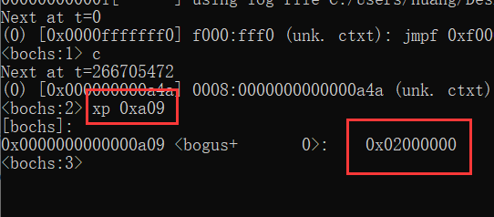
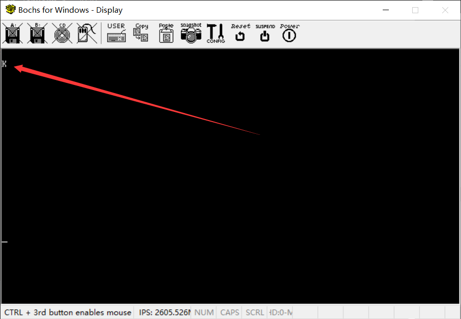

# （四）进入内核

## 1. 内存容量计算

### 1.1 计算代码

我这不知道为什么，《操作系统真象还原》里面给的三种内存检测方法都用不了，我只能移植之前做过的《30天自制操作系统》的计算方法过来了，其实个人感觉《30天自制操作系统》的这个计算逻辑更好。我也不废话直接上代码。

```assembly
; 《30天自制操作系统》里面的内存容量获取方式，完全不用BIOS，但是必须进入32位之后才能执行
[bits 32]
get_memory:
    ; 保存当前的寄存器值
    push edi                     ; 保存 edi 寄存器的值到堆栈
    push esi                     ; 保存 esi 寄存器的值到堆栈
    push ebx                     ; 保存 ebx 寄存器的值到堆栈

    ; 设置测试模式的两个模式字
    mov esi, 0xaa55aa55          ; 将第一个模式字 0xaa55aa55 存入 esi
    mov edi, 0x55aa55aa          ; 将第二个模式字 0x55aa55aa 存入 edi

    ; 开始地址设置为1MB，前1MB也就是0到0x000fffff分配给MBR、Loader、Kernel
    ; 内存小于1MB建议直接写裸机算了要什么操作系统
    mov eax, 0x00100000

.get_memory_loop:
    ; 计算当前测试的内存地址
    mov ebx, eax                 ; 将当前地址复制到 ebx
    add ebx, 0xffc               ; 将 ebx 增加 0xffc（测试 4KB 内存块的最后 4 字节）

    ; 保存当前内存值，并写入测试模式值
    mov edx, [ebx]               ; 将当前内存值存入 edx
    mov [ebx], esi               ; 将第一个模式字写入内存
    xor dword [ebx], 0xffffffff  ; 将内存中的值进行按位取反

    ; 检查是否匹配第一个模式
    cmp edi, [ebx]               ; 将内存值与第二个模式字进行比较
    jne .get_memory_fail         ; 如果不匹配，则跳转到失败处理
    xor dword [ebx], 0xffffffff  ; 如果匹配，则恢复到原始模式字

    ; 检查是否匹配第二个模式
    cmp esi, [ebx]               ; 将内存值与第一个模式字进行比较
    jne .get_memory_fail         ; 如果不匹配，则跳转到失败处理

    ; 恢复原始内存值，并继续测试下一个地址
    mov [ebx], edx               ; 将原始内存值恢复到内存
    add eax, 0x00001000          ; 将地址增加 4KB
    cmp eax, 0x0fffffff          ; 将当前地址与结束地址比较，结束地址设置为4G - 1，也就是0xffffffff
    jbe .get_memory_loop         ; 如果当前地址小于或等于结束地址，则继续测试下一个内存块

    ; 测试成功，恢复寄存器并返回
    pop ebx                      ; 恢复 ebx 寄存器的值
    pop esi                      ; 恢复 esi 寄存器的值
    pop edi                      ; 恢复 edi 寄存器的值
    mov [total_mem_bytes], eax	 ; 将最终的内存容量保存到total_mem_bytes中
    clc                          ; 清除错误标志，表示内存测试成功
    ret                          ; 返回调用者

.get_memory_fail:
    ; 测试失败，保存当前地址到total_mem_bytes，并恢复原始内存值
    mov [total_mem_bytes], eax   ; 将当前地址保存到total_mem_bytes
    pop ebx                      ; 恢复 ebx 寄存器的值
    pop esi                      ; 恢复 esi 寄存器的值
    pop edi                      ; 恢复 edi 寄存器的值
    stc                          ; 设置错误标志，表示内存测试失败
    ret                          ; 返回调用者

```

### 1.2 测试解析

#### 1.2.1 测试步骤

1. **保存寄存器值**：
   - 代码首先保存了 `edi`、`esi` 和 `ebx` 寄存器的当前值，以便在测试结束后恢复。
2. **初始化模式值和测试地址**：
   - `esi` 被设置为第一个模式值 `0xaa55aa55`。
   - `edi` 被设置为第二个模式值 `0x55aa55aa`。
   - `eax` 被初始化为 `0x00100000`，表示测试从1MB（1024 KB）开始。
3. **测试内存页**：
   - 在循环中，代码测试每个内存页的最后4个字节（地址 `ebx = eax + 0xffc`）。
   - 它首先保存当前内存值到 `edx`。
   - 然后将第一个模式值 `0xaa55aa55` 写入内存单元，并进行按位取反操作。
   - 之后，将内存单元的值与第二个模式值 `0x55aa55aa` 进行比较。如果不匹配，则表示内存单元有问题，跳转到失败处理。
   - 如果匹配，再次进行按位取反操作，并将内存单元的值与第一个模式值 `0xaa55aa55` 进行比较。
4. **恢复内存值并继续测试**：
   - 如果内存单元通过了上述检查，代码将原始内存值恢复，并继续测试下一个内存页。
   - 测试地址增加 `0x00001000`（4KB），以移动到下一个内存页。
5. **测试结束**：
   - 测试结束的条件是地址 `eax` 超过 `0x0fffffff`。
   - 如果测试成功，恢复寄存器值，并将最终地址保存到 `total_mem_bytes`，表示可用内存大小。
   - 如果测试失败，将当前地址保存到 `total_mem_bytes`，表示检测到的最大可用内存。

#### 1.2.2 方法原理

为了验证内存页是否有效，使用了两个特定的32位模式值：

- 第一个模式值：0xaa55aa55
- 第二个模式值：0x55aa55aa

这两个模式值被设计成二进制形式下的特殊模式，用于检测内存单元的完整性。二进制表示如下：

- 0xaa55aa55: `10101010010101011010101001010101`
- 0x55aa55aa: `01010101101010100101010110101010`

可以看出，这两个模式值在二进制上是 **互补** 的，也就是每一位正好都是相反的。具体过程如下：

1. **写入第一个模式值**：
   - 将 `0xaa55aa55` 写入内存。
2. **按位取反**：
   - 按位取反操作将内存中的值变为 `0x55aa55aa`（即原值的每个位都翻转）。
3. **验证**：
   - 将内存中的值与第二个模式值 `0x55aa55aa` 比较。如果匹配，则表示内存单元正确存储和取反了值。
   - 再次按位取反，将内存值恢复到 `0xaa55aa55`。
   - 将内存中的值与第一个模式值 `0xaa55aa55` 比较。如果匹配，则表示内存单元在多次操作后仍能正确存储值。

模式值的设计确保了内存单元在被写入和读取过程中，能够有效检测到单个位的错误或翻转。被检测的部分所有位都被测试，从而最大程度地保证了被测试的这部分内存的完整性和有效性。

程序只测试每个4KB内存页的最后4个字节。这个位置的选择主要是基于效率考虑，而非全面检测（全面检测一位一位过去根本行不通，太浪费时间了）。如果这4个字节可以正确存储和读取模式值，那么可以推断整个页面的内存状态 **大概率** 是有效的。


## 2. 调试Loader

bochs 的 Windows 版本有一个单独的调试工具 bochsdbg ，通过 bochsdbg 就可以迅速进行调试。

开启调试的脚本 debug_bochs.bat 如下：

```bash
@echo off
REM 检查当前目录下是否存在Configuration.bxrc文件
if exist Configuration.bxrc (
    
    REM 使用绝对路径启动Bochsdbg
    bochsdbg -q -f %~dp0Configuration.bxrc
    
) else (
    REM 如果不存在Configuration.bxrc文件，输出提示信息并退出
    echo Configuration.bxrc文件不存在，程序将退出。
    exit /b
)

```

这个调试工具的确挺难看，操控性也差，不过查看各种信息还是很方便的。

Loader.asm修改如下所示

```assembly
;------------------- loader.inc -------------------

%include "boot.inc"

;------------------- loader代码段 -------------------
section loader vstart=LOADER_BASE_ADDR

; 补充说明，栈的生长是向低位生长，所以栈顶指针设在高位并不会导致栈的数据覆盖Loader，因为二者写的方向都不一样
LOADER_STACK_TOP equ LOADER_BASE_ADDR

; jmp 指令在 x86 汇编中有多种形式，常见的形式有：
; jmp short：2 字节，距离范围为 -128 到 +127 字节。（jmp本身1字节，距离1字节）
; jmp near： 3 字节，距离范围为 -32768 到 +32767 字节。（jmp本身1字节，距离2字节）
; jmp far：  5 字节，用于跳转到绝对地址，通常是跨段跳转，即改变段寄存器的值。
; jmp far 不仅需要改变 eip，还需要改变段选择子，因此需要 4 字节的目标地址（段选择子 + 偏移量）。
; 编译器会自动计算你的距离，从而决定要用哪个，你也可以强制指定

; 在这里很显然我们的jmp是near，3字节大小
jmp loader_start
; 用jmp的原因是因为我不知道为什么下面的GDT会被当成代码执行，人都麻了

;------------------- 构建GDT及其内部的描述符 -------------------
GDT_BASE:   
    dd 0x00000000  ; 第一个描述符（空描述符）
    dd 0x00000000

CODE_DESC:  
    dd 0x0000FFFF  ; 代码段基址低16位和段限制低16位
    dd DESC_CODE_HIGH4  ; 代码段的高32位描述符属性

DATA_STACK_DESC:  
    dd 0x0000FFFF  ; 数据段基址低16位和段限制低16位
    dd DESC_DATA_HIGH4  ; 数据段的高32位描述符属性

VIDEO_DESC: 
    dd 0x80000007  ; 视频段基址低16位和段限制低16位 (limit=(0xbffff-0xb8000)/4k=0x7)
    dd DESC_VIDEO_HIGH4  ; 视频段的高32位描述符属性，此时DPL已改为0

GDT_SIZE equ $ - GDT_BASE
GDT_LIMIT equ GDT_SIZE - 1 
times 28 dq 0  ; 预留28个描述符空位，加上已有的4个，一共是32个描述符，每个描述符8个字节，总共是32 * 8 = 256字节

; 选择子
SELECTOR_CODE equ (0x0001 << 3) + TI_GDT + RPL0  ; 代码段选择子
SELECTOR_DATA equ (0x0002 << 3) + TI_GDT + RPL0  ; 数据段选择子
SELECTOR_VIDEO equ (0x0003 << 3) + TI_GDT + RPL0  ; 视频段选择子

; 首先，equ指令相当于C的define，就是简单的替换，编译的时候就会清理掉，不占空间
; jmp刚刚说了是3字节
; 很明显GDT位置从0x903开始起算
; GDT之前计算过了 256 字节
; 起始地址是0x900，对应十进制数字是2304，2304 + 3 + 256 = 2563，对应16进制是0xa03
; 也就是说0xa02是gdt空位结束，gdt_ptr的起始地址是下一个字节0xa03，读0xa03指向的值，就知道GDT指针信息

; 定义GDT指针，前2字节是GDT界限，后4字节是GDT起始地址
gdt_ptr:
    dw GDT_LIMIT
    dd GDT_BASE


; gdt_ptr是一个dw和一个dd，dw是2字节，对应C语言的unsigned char，dw是4字节，对应C语言里的unsigned int，一共是6字节空间
; 2563 + 6 = 2569，十六进制为0xa09
; total_mem_bytes的起始地址就是0xa09
total_mem_bytes dd 0

loader_start:
;----------------------------------------   开启保护模式   ------------------------------------------
; 1. 打开A20
; 2. 加载GDT
; 3. 将CR0的PE位的值置为1

;-----------------  打开A20  ----------------
    ; 打开A20的方法有好几种，有直接用BIOS中断打开的，还有用键盘控制器打开的
    ; 《30天自制操作系统》里面就是用键盘控制器打开的
    in al,0x92  ; 从端口0x92读取当前值到AL
    or al,0000_0010B  ; 设置A20启用位（第1位）
    out 0x92,al  ; 写回到端口0x92

;-----------------  加载GDT  ----------------
    lgdt [gdt_ptr]  ; 加载GDT指针到GDTR寄存器

;-----------------  将CR0第0位置1  ----------------
    cli            ; 关闭中断
    mov eax, cr0  ; 读取CR0寄存器的值到EAX
    or eax, 0x00000001  ; 设置CR0的PE位（第0位）
    mov cr0, eax  ; 写回CR0寄存器，启用保护模式

    jmp SELECTOR_CODE:p_mode_start  ; 远跳转到保护模式代码段，刷新流水线，避免分支预测的影响


[bits 32]  ; 进入32位模式
p_mode_start:
    mov ax, SELECTOR_DATA  ; 加载数据段选择子到AX
    mov ds, ax  ; 设置DS段寄存器
    mov es, ax  ; 设置ES段寄存器
    mov ss, ax  ; 设置SS段寄存器
    mov esp, LOADER_STACK_TOP  ; 设置ESP为栈顶地址
    mov ax, SELECTOR_VIDEO  ; 加载视频段选择子到AX
    mov gs, ax  ; 设置GS段寄存器

    call get_memory
    mov byte [gs:160], 'P'  ; 在屏幕位置(0,10)处写入字符'P'
    
    jmp $


; 《30天自制操作系统》里面的内存容量获取方式，完全不用BIOS，但是必须进入32位之后才能执行
[bits 32]
get_memory:
    ; 保存当前的寄存器值
    push edi                     ; 保存 edi 寄存器的值到堆栈
    push esi                     ; 保存 esi 寄存器的值到堆栈
    push ebx                     ; 保存 ebx 寄存器的值到堆栈

    ; 设置测试模式的两个模式字
    mov esi, 0xaa55aa55          ; 将第一个模式字 0xaa55aa55 存入 esi
    mov edi, 0x55aa55aa          ; 将第二个模式字 0x55aa55aa 存入 edi

    ; 开始地址设置为1MB，前1MB也就是0到0x000fffff分配给MBR、Loader、Kernel
    ; 内存小于1MB建议直接写裸机算了要什么操作系统
    mov eax, 0x00100000

.get_memory_loop:
    ; 计算当前测试的内存地址
    mov ebx, eax                 ; 将当前地址复制到 ebx
    add ebx, 0xffc               ; 将 ebx 增加 0xffc（测试 4KB 内存块的最后 4 字节）

    ; 保存当前内存值，并写入测试模式值
    mov edx, [ebx]               ; 将当前内存值存入 edx
    mov [ebx], esi               ; 将第一个模式字写入内存
    xor dword [ebx], 0xffffffff  ; 将内存中的值进行按位取反

    ; 检查是否匹配第一个模式
    cmp edi, [ebx]               ; 将内存值与第二个模式字进行比较
    jne .get_memory_fail         ; 如果不匹配，则跳转到失败处理
    xor dword [ebx], 0xffffffff  ; 如果匹配，则恢复到原始模式字

    ; 检查是否匹配第二个模式
    cmp esi, [ebx]               ; 将内存值与第一个模式字进行比较
    jne .get_memory_fail         ; 如果不匹配，则跳转到失败处理

    ; 恢复原始内存值，并继续测试下一个地址
    mov [ebx], edx               ; 将原始内存值恢复到内存
    add eax, 0x00001000          ; 将地址增加 4KB
    cmp eax, 0x0fffffff          ; 将当前地址与结束地址比较，结束地址设置为4G - 1，也就是0xffffffff
    jbe .get_memory_loop         ; 如果当前地址小于或等于结束地址，则继续测试下一个内存块

    ; 测试成功，恢复寄存器并返回
    pop ebx                      ; 恢复 ebx 寄存器的值
    pop esi                      ; 恢复 esi 寄存器的值
    pop edi                      ; 恢复 edi 寄存器的值
    mov [total_mem_bytes], eax	 ; 将最终的内存容量保存到total_mem_bytes中
    clc                          ; 清除错误标志，表示内存测试成功
    ret                          ; 返回调用者

.get_memory_fail:
    ; 测试失败，保存当前地址到total_mem_bytes，并恢复原始内存值
    mov [total_mem_bytes], eax   ; 将当前地址保存到total_mem_bytes
    pop ebx                      ; 恢复 ebx 寄存器的值
    pop esi                      ; 恢复 esi 寄存器的值
    pop edi                      ; 恢复 edi 寄存器的值
    stc                          ; 设置错误标志，表示内存测试失败
    ret                          ; 返回调用者

```

编译烧写，开启调试，输入`next`或者`s`来步进，输入一次之后可以直接按回车，默认为之前的输入。或者也可以输入c一直运行到进了死循环，然后按下Ctrl + C键直接打断退出，我用的就是这个方法。

打断之后就可以输入查询了，不要再次打断，再次打断真的就退出了，本来就要结束了。

其实你如果能计算出来指令地址，也可以直接设置断点。比如假设我们有内核在0x1500位置。

```bash
<bochs:1> b 0x1500
<bochs:2> c
```

这样就可以一直运行到 0x1500 这个地方才停下，当然也可以打多个断点。

输入`xp 0xa09`，查询我们内存容量计算的结果。为什么是这个地址，我代码的注释里已经计算过了。



计算结果是`0x2000000`，这是十六进制数字，单位是字节。换算一下十进制就是`33554432`。

`33554432 = 32 × 1024 × 1024`，正好是32MB，我们的配置里面给虚拟机配的就是32MB的内存。


## 3. 进入内核

按照《操作系统真象还原》的进程，这里应该还要内存分页，然后启用分页再进入内存。

我是受《30天自制操作系统》的影响，想快点进入内核。而且其实内存分页完全可以在内核里面做，最多就是把页表地址载入到寄存器启用分页的时候需要汇编，但是我想C总比汇编好读，写汇编读汇编都太痛苦了，早日解脱为好，所以现在就要进入内核了。C的内存分页总比汇编的内存分页好读得多。

新建一个与boot平级的kernel文件夹。

先用汇编写一个简单的打印字符函数，写在kernel_func.asm里面，并且对外暴露，方便C编写的内核使用。

```assembly
[bits 32]   ; 显式指定为32位汇编

section .text
global print_char, io_hlt

; 在屏幕上打印字符
; void print_char(char c, uint16_t pos);
print_char:
    ; 函数调用开始时栈布局：
    ; +------------------+
    ; | 参数2            | <-- ESP + 4 + 4 = ESP + 8（这里是栈底，之前ESP在这）
    ; +------------------+
    ; | 参数1            | <-- ESP + 4（以在底层都是指针传递，所以必须是4个字节）
    ; +------------------+
    ; | 返回地址         | <-- ESP（就是所谓的栈顶）
    ; +------------------+
    
    
    push eax                    ; 保存 eax
    push edi                    ; 保存 edi

    ; 压栈后栈布局：
    ; +------------------+
    ; | 参数2            | <-- ESP + 12 + 4 = ESP + 16
    ; +------------------+
    ; | 参数1            | <-- ESP + 8 + 4 = ESP + 12
    ; +------------------+
    ; | 返回地址         | <-- ESP + 4 + 4 = ESP + 8
    ; +------------------+
    ; | 保存的 eax       | <-- ESP + 4 (push eax)
    ; +------------------+
    ; | 保存的 edi       | <-- ESP (push edi)
    ; +------------------+

    mov al, [esp + 12]           ; 获取第一个参数 
    mov di, [esp + 16]          ; 获取第二个参数 

    ; 将字符写入显存
    mov [gs:di], al
    add di, 2                   ; 每个字符占两个字节

    pop edi                     ; 恢复 edi
    pop eax                     ; 恢复 eax
    ret


; 让CPU停下
; void io_hlt();
io_hlt:
    hlt
    ret

```

关于汇编函数的传参问题，从里面可以看到。假设ESP一开始位于100（16进制为 0x64）处，压栈一个四字节大小的数据，ESP就跳到96的地方，原来的100就成了栈底，96就是现在的栈顶（栈指针），也就是ESP的位置。

所以进入保护模式设置ESP的时候，设置ESP为Loader的起始地址并没有问题，**栈的数据不会覆盖到Loader的数据** 。同理，这里计算参数所在的位置也是一样的方法。

由于开发老是碰到类型问题，于是用typedef和define约定了一些类型标准，更容易理解，起名为type.h。

```c
// 移植自stdint.h

typedef signed char int8_t;
typedef unsigned char   uint8_t;
typedef short int int16_t;
typedef unsigned short int uint16_t;
typedef int  int32_t;
typedef unsigned int uint32_t;
typedef long long int int64_t;
typedef unsigned long long int uint64_t;

// 常用的一个表示
typedef uint64_t size_t;

#define INT8_MIN (-128)
#define INT16_MIN (-32768)
#define INT32_MIN (-2147483647 - 1)
#define INT64_MIN  (-9223372036854775807LL - 1)

#define INT8_MAX 127
#define INT16_MAX 32767
#define INT32_MAX 2147483647
#define INT64_MAX 9223372036854775807LL

#define UINT8_MAX 255
#define UINT16_MAX 65535
#define UINT32_MAX 0xffffffffU  /* 4294967295U */
#define UINT64_MAX 0xffffffffffffffffULL /* 18446744073709551615ULL */

```

内核kernel.c就更简单了，打印一个字符。

```c
#include "type.h"

extern void print_char(char c, uint16_t pos);
extern void io_hlt();

void kernel_main(void) {
    print_char('K', 160);
    
    // 进入内核主循环或其它初始化代码
    for(;;) {
        io_hlt();
    }
}

```

修改boot中的include子文件夹里面的boot.inc

```assembly
; 配置加载Loader和加载内核需要用到的一些宏定义
;-------------	 loader和kernel   ----------
LOADER_BASE_ADDR    equ 0x900   ; 定义加载器的基址
LOADER_START_SECTOR equ 0x2     ; 定义加载器的起始扇区

KERNEL_BASE_ADDR    equ 0x1500  ; 定义内核的基址
KERNEL_START_SECTOR equ 0x9     ; 定义内核的起始扇区

```

写链接脚本文件 kernel_linker.ld

```ld
ENTRY(kernel_main)    /* 入口函数，这里将决定编出的程序入口是哪个地方 */

SECTIONS
{
    . = 0x00001500;  /* 内核加载地址，程序各个段物理地址的起算点，也是入口函数所在的地方 */
    .text : { *(.text) }
    .data : { *(.data) }
    .bss : { *(.bss) }
}

```

写好了代码，就要面对一个问题，怎么编译这份C和汇编合并编程的代码？

C我们知道，不管是Windows还是Linux，直接GCC就是了，比如Windows下我用的就是MinGW的GCC。分文件编程也不是问题，编出目标文件.o之后直接链接器链接出一个完整的可执行文件就是了。

但是现在我们相当于裸机编程，面向对象是个x86架构的32位裸机，必须编出二进制文件。

Linux常用的几款GCC为了适配码农的开发需要都提供了可以直接生成二进制文件的功能，但是Windows上的几款支持就不太好了，比如MinGW，直接就不支持生成二进制文件。

我又不想学《操作系统真象还原》还要解析ELF文件头，所以我想直接生成二进制文件。这样就可以直接加载内核了。

但是这意味着我们要用新的编译环境了，这里我用的是 `i386-elf-toolchain`。没错，看名字就知道是个专用于x86架构32位的编译工具系列，它有Windows版本，而且还支持直接链接生成二进制bin文件。

[i386-elf-toolchain的GitHub仓库](https://github.com/nativeos/i386-elf-toolchain/releases)

在i386-elf-toolchain的GitHub仓库的Release版本查到的最新版是2015年的，的确有点老了，但是也不是不能用，将就用着。

我自己的Windows是Win10 64位（估计现在也没多少32位Windows了），所以我下载Windows x86_64 (64 bit)的两个，Binutils 和 GCC两个都要下，都用得到。

下载完成，解压，然后在环境变量的PATH里面加入其路径（最开始配置NASM的时候已经说过了）。

Loader也要修改，加载内核。

这里说明一下，《操作系统真象还原》里面的32位下读取硬盘我实测是无法使用的，我查了资料，应该是因为进入保护模式之后没有设置TSS（任务状态段）的原因，导致没有权限去读硬盘。排查问题发现问题出在

```assembly
;第3步：向0x1f7端口写入读命令，0x20 
      mov dx,0x1f7
      mov al,0x20
      out dx,al

```

这里，在向0x1f7读入的时候就已经不行了。所以我选择土办法解决问题，**在MBR里面还是16位实模式的时候直接加载内核了**，在Loader里面进入保护模式之后做个跳转就行了

```assembly
[bits 32]  ; 进入32位模式
p_mode_start:
    mov ax, SELECTOR_DATA  ; 加载数据段选择子到AX
    mov ds, ax  ; 设置DS段寄存器
    mov es, ax  ; 设置ES段寄存器
    mov ss, ax  ; 设置SS段寄存器
    mov esp, LOADER_STACK_TOP  ; 设置ESP为栈顶地址
    mov ax, SELECTOR_VIDEO  ; 加载视频段选择子到AX
    mov gs, ax  ; 设置GS段寄存器

    call get_memory
    mov byte [gs:160], 'P'  ; 在屏幕位置(0,10)处写入字符'P'

    ; 准备完毕，跳转内核
    jmp KERNEL_BASE_ADDR
```

MBR修改如下：

```assembly
%include "boot.inc"
; 加载配置，这样以后调整都方便
SECTION MBR vstart=0x7c00
; 入口地址0x7c00是MBR的惯例，BIOS只要发现MBR，一律加载到这个地址
; 在开始就设置每个寄存器的初始值
   mov ax,cs
   mov ds,ax
   mov es,ax
   mov ss,ax
   mov fs,ax
; cs一开始是0，设置ds、es、ss、fs四个都是0
   mov sp,0x7c00
; sp存储的是栈顶指针，在MBR一开始必须是0x7c00（这本身也是MBR的加载位置，栈是向低地址处生长的，所以不会覆盖MBR的数据）
   mov ax,0xb800
; 0xb800，VGA时代对应显存的起始位置，放到gs寄存器里面
   mov gs,ax

; 清屏
   mov     ax, 0600h
   mov     bx, 0700h
   mov     cx, 0
   mov     dx, 184fh
   int     10h

; 读入Loader
   mov eax,LOADER_START_SECTOR	 ; 起始扇区lba地址
   mov bx,LOADER_BASE_ADDR       ; 写入的地址
   mov cx,4			 ; 待读入的扇区数
   call rd_disk_m_16		 ; 以下读取程序的起始部分（一个扇区）
   
; 读入Kernel，200个扇区足够大了
   mov eax,KERNEL_START_SECTOR	 ; 起始扇区lba地址
   mov bx,KERNEL_BASE_ADDR       ; 写入的地址
   mov cx,200			 ; 待读入的扇区数
   call rd_disk_m_16		 ; 以下读取程序的起始部分（一个扇区）

   jmp LOADER_BASE_ADDR

;-------------------------------------------------------------------------------
;功能:读取硬盘n个扇区，16位
rd_disk_m_16:
;-------------------------------------------------------------------------------
    ; 参数说明：
    ; eax = LBA扇区号
    ; ebx = 将数据写入的内存地址
    ; ecx = 读入的扇区数

    mov esi, eax          ; 备份eax，保存LBA扇区号
    mov di, cx            ; 备份cx，保存要读取的扇区数

    ; 第1步：设置要读取的扇区数
    mov dx, SECTOR_COUNT_REG ; 选择扇区计数寄存器端口
    mov al, cl            ; 将要读取的扇区数放入al
    out dx, al            ; 输出到扇区计数寄存器

    mov eax, esi          ; 恢复eax，包含LBA扇区号

    ; 第2步：将LBA地址存入0x1f3 ~ 0x1f6

    ; LBA地址7~0位写入端口SECTOR_NUM_REG
    mov dx, SECTOR_NUM_REG
    out dx, al

    ; LBA地址15~8位写入端口CYL_LOW_REG
    mov cl, 8
    shr eax, cl
    mov dx, CYL_LOW_REG
    out dx, al

    ; LBA地址23~16位写入端口CYL_HIGH_REG
    shr eax, cl
    mov dx, CYL_HIGH_REG
    out dx, al

    ; LBA地址27~24位写入端口DRIVE_HEAD_REG
    shr eax, cl
    and al, 0x0f       ; 只保留LBA地址的低4位
    or al, 0xe0        ; 设置7~4位为1110，表示LBA模式
    mov dx, DRIVE_HEAD_REG
    out dx, al

    ; 第3步：向STATUS_CMD_REG端口写入读命令，0x20
    mov dx, STATUS_CMD_REG
    mov al, 0x20
    out dx, al

    ; 第4步：检测硬盘状态
    .not_ready:
        nop
        in al, dx
        and al, 0x88       ; 检查硬盘控制器状态：第4位为1表示准备好数据传输，第7位为1表示硬盘忙
        cmp al, 0x08
        jnz .not_ready     ; 若未准备好，继续等待

    ; 第5步：从DATA_REG端口读数据
    mov ax, di
    mov dx, 256
    mul dx
    mov cx, ax         ; di为要读取的扇区数，一个扇区有512字节，每次读入一个字，共需di*512/2次
    mov dx, DATA_REG
    .go_on_read:
        in ax, dx
        mov [bx], ax
        add bx, 2
        loop .go_on_read
        ret

times 510-($-$$) db 0
; 这行代码的作用是填充当前代码段，使其总长度达到510字节。
; MBR的总大小是512字节，其中最后两个字节是固定的引导标识符 0x55 和 0xAA，所以需要填充前面的字节。
; $ 表示当前地址，$$ 表示当前段的起始地址，($-$$) 计算出当前代码段的大小，然后 510-($-$$) 计算出需要填充的字节数。
; 用 db 0 填充这些字节。

db 0x55,0xaa		; 这两个字节是引导记录的标识符，表示这是一个有效的MBR。

```

修改Makefile：

```makefile
# Makefile 用于编译项目

# 汇编器和编译器、链接器等各种工具
NASM = nasm
GCC = i386-elf-gcc
AS = i386-elf-as
LD = i386-elf-ld

# 目录
BOOT_DIR = boot
KERNEL_DIR = kernel

# 源文件
MBR_SRC = $(BOOT_DIR)/mbr.asm
LOADER_SRC = $(BOOT_DIR)/loader.asm
KERNEL_FUNC_ASM_SRC = $(KERNEL_DIR)/kernel_func.asm
KERNEL_C_SRC = $(KERNEL_DIR)/kernel.c
KERNEL_LINKER_SCRIPT = $(KERNEL_DIR)/kernel_linker.ld

# 头文件
BOOT_INCLUDE_DIR = $(BOOT_DIR)/include
TYPE_H_SRC = $(KERNEL_DIR)/type.h

# 输出文件
MBR_BIN = $(BOOT_DIR)/mbr.bin
LOADER_BIN = $(BOOT_DIR)/loader.bin
KERNEL_BIN = $(KERNEL_DIR)/kernel.bin

# 汇编标志
BOOT_ASM_FLAGS = -f bin -I $(BOOT_INCLUDE_DIR)/
KERNEL_ASM_FLAGS = -f elf32

# C 编译标志
CFLAGS = -ffreestanding -nostdlib -Wall -Wextra

# 链接标志
KERNEL_LDFLAGS = -T $(KERNEL_LINKER_SCRIPT) --oformat binary

.PHONY: all

all: $(MBR_BIN) $(LOADER_BIN) $(KERNEL_BIN)

# 编译 mbr.bin
$(MBR_BIN): $(MBR_SRC) $(BOOT_INCLUDE_DIR)/boot.inc
	$(NASM) $(BOOT_ASM_FLAGS) -o $@ $<

# 编译 loader.bin
$(LOADER_BIN): $(LOADER_SRC) $(BOOT_INCLUDE_DIR)/boot.inc
	$(NASM) $(BOOT_ASM_FLAGS) -o $@ $<

# 生成 kernel.bin
$(KERNEL_BIN): $(KERNEL_DIR)/kernel.o $(KERNEL_DIR)/kernel_func.o
	$(LD) $(KERNEL_LDFLAGS) -o $@ $^

# 汇编文件生成 .o 文件
$(KERNEL_DIR)/kernel_func.o: $(KERNEL_FUNC_ASM_SRC)
	$(NASM) $(KERNEL_ASM_FLAGS) -o $@ $<

# C 文件生成 汇编文件，再汇编生成.o
# 这个GCC不知道用的什么汇编器居然解析不了它自己生成的代码
# 只能另用作者提供的配套的汇编器AS编
# 而且用GCC解析的汇编代码，只能用AS编译，NASM编译不了
$(KERNEL_DIR)/kernel.o: $(KERNEL_C_SRC) $(TYPE_H_SRC)
	$(GCC) $(CFLAGS) -S -o $(KERNEL_DIR)/kernel.asm $<
	$(AS) -o $@ $(KERNEL_DIR)/kernel.asm
	del $(KERNEL_DIR)\\kernel.asm


# 清理规则
clean:
	@if exist $(BOOT_DIR)\\*.bin del $(BOOT_DIR)\\*.bin
	@if exist $(KERNEL_DIR)\\*.o del $(KERNEL_DIR)\\*.o
	@if exist $(KERNEL_DIR)\\*.bin del $(KERNEL_DIR)\\*.bin

```

说明一下：

`KERNEL_ASM_FLAGS = -f elf32` 这一项是因为i386-elf-as编出的是32位的elf格式的目标文件，等待链接就行了，因此我们的NASM也要指定编出32位的elf格式的目标文件，二者才能链接，所以配合其编出elf32格式的目标文件。

一键编译烧写脚本w.bat修改如下：

```bash
@echo off

rem 先执行make操作
make all

setlocal

rem 确定mbr.bin文件的路径
set MBR_BIN=%~dp0boot\mbr.bin
set LOADER_BIN=%~dp0boot\loader.bin
set KERNEL_BIN=%~dp0kernel\kernel.bin

rem 确定目标硬盘映像文件的相对路径
set HD_IMG_REL=..\VM\HOS.raw

rem 计算目标硬盘映像文件的绝对路径
for %%I in (%HD_IMG_REL%) do set HD_IMG=%%~fI

rem 输出涉及各文件的路径信息
echo MBR_BIN=%MBR_BIN%
echo LOADER_BIN=%LOADER_BIN%
echo KERNEL_BIN=%KERNEL_BIN%
echo HD_IMG=%HD_IMG%

rem 切换到脚本所在的目录
cd /d %~dp0

rem 首先清空硬盘
dd if=/dev/zero of=%HD_IMG% bs=1M count=64 conv=notrunc
rem 使用dd将所有文件写入硬盘映像文件
dd if=%MBR_BIN% of=%HD_IMG% bs=512 count=1 conv=notrunc
dd if=%LOADER_BIN% of=%HD_IMG% bs=512 count=1 seek=2 conv=notrunc
dd if=%KERNEL_BIN% of=%HD_IMG% bs=512 count=200 seek=9 conv=notrunc

rem 执行clean操作
make clean

endlocal
pause

```

因为MBR里面我们从9号扇区（从0起算，所以是第十个）开始读取，读取200个扇区，那么相应地，我们烧写也要烧写在9号扇区，连续烧写200个扇区。

编译烧写运行，一键启动。



内核打印的K字符覆盖了Loader打印的P字符，我们顺利进入了内核。

作者到这一步还有内存分页、初始化等操作，我秉着能不用汇编就不用汇编的原则，决定尽量放到C这里执行，实在没办法必须用汇编的，就写成汇编函数暴露给C使用。
