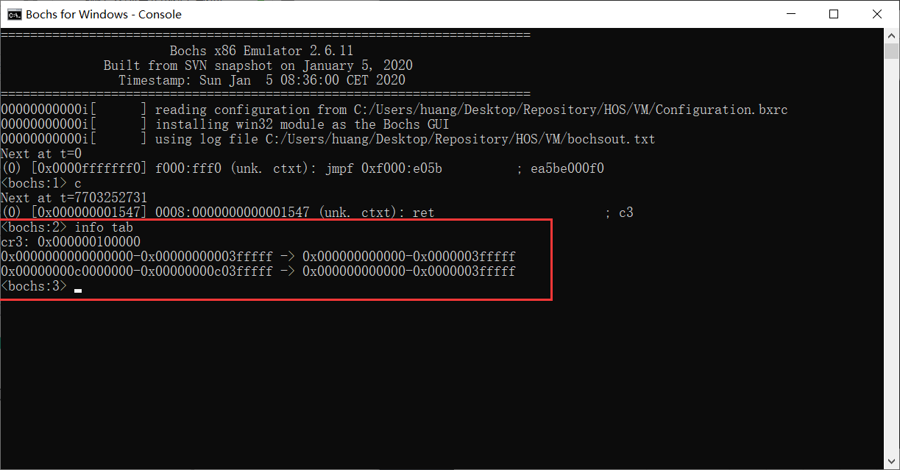
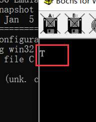
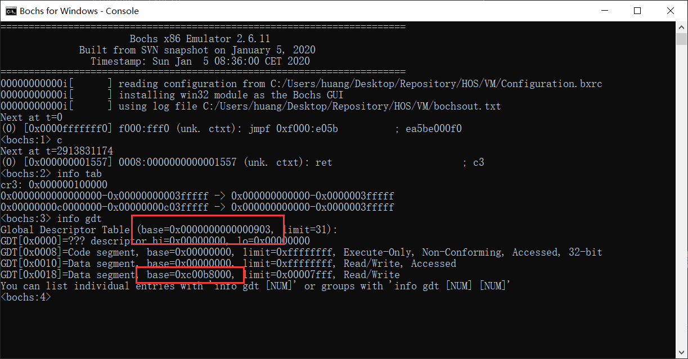
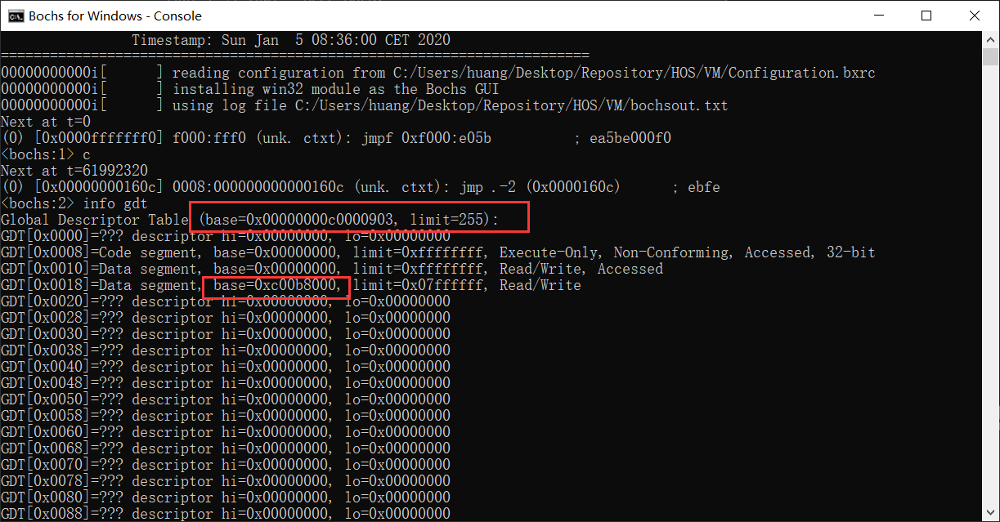

# （五）内核初始化之内存分页

## 1. 重新组织Makefile

现在开发已经有boot和kernel两个部分了，未来可能还有更多的部分，Makefile越来越长实在是太难看又难改。

因此可以把Makefile拆分，项目的Makefile和组件的Makefile。组件的Makefile负责编译各自的部分成目标文件，而后主Makefile将其链接打包为一个完整的程序。

在boot目录下建立Makefile

```makefile

# 目录
BOOT_DIR = .
INCLUDE_DIR = $(BOOT_DIR)/include

# 源文件
MBR_SRC = $(BOOT_DIR)/mbr.asm
LOADER_SRC = $(BOOT_DIR)/loader.asm

# 输出文件
MBR_BIN = $(BOOT_DIR)/mbr.bin
LOADER_BIN = $(BOOT_DIR)/loader.bin

# 汇编标志
ASM_FLAGS = -f bin -I $(INCLUDE_DIR)/

.PHONY: all

all: $(MBR_BIN) $(LOADER_BIN)

# 编译 mbr.bin
$(MBR_BIN): $(MBR_SRC) $(INCLUDE_DIR)/boot.inc
	$(NASM) $(ASM_FLAGS) -o $@ $<

# 编译 loader.bin
$(LOADER_BIN): $(LOADER_SRC) $(INCLUDE_DIR)/boot.inc
	$(NASM) $(ASM_FLAGS) -o $@ $<

# 清理规则
clean:
	@if exist $(BOOT_DIR)\\*.bin del $(BOOT_DIR)\\*.bin

```

在kernel目录下建立Makefile

```makefile

# 目录
KERNEL_DIR = .

# 源文件
KERNEL_FUNC_ASM_SRC = $(KERNEL_DIR)/kernel_func.asm
KERNEL_C_SRC = $(KERNEL_DIR)/kernel.c

# 头文件
TYPE_H_SRC = $(KERNEL_DIR)/type.h

# 汇编标志
ASM_FLAGS = -f elf32

# C 编译标志
CFLAGS = -ffreestanding -nostdlib -Wall -Wextra

# 标签标记所有的任务（输出什么文件），方便修改
KERNEL_OBJS = $(KERNEL_DIR)/kernel_func.o $(KERNEL_DIR)/kernel.o

.PHONY: all

all: $(KERNEL_OBJS)

# 汇编文件生成 .o 文件
$(KERNEL_DIR)/kernel_func.o: $(KERNEL_FUNC_ASM_SRC)
	$(NASM) $(ASM_FLAGS) -o $@ $<

# C 文件生成 汇编文件，再汇编生成.o，为什么这么做之前说过了，这个gcc的汇编器不知道什么问题
$(KERNEL_DIR)/kernel.o: $(KERNEL_C_SRC) $(TYPE_H_SRC)
	$(GCC) $(CFLAGS) -S -o $(KERNEL_DIR)/kernel.asm $<
	$(AS) -o $@ $(KERNEL_DIR)/kernel.asm
	del $(KERNEL_DIR)\\kernel.asm

# 清理规则
clean:
	@if exist $(KERNEL_DIR)\\*.o del $(KERNEL_DIR)\\*.o
	@if exist $(KERNEL_DIR)\\*.bin del $(KERNEL_DIR)\\*.bin

```

将Program目录下的主Makefile修改为

```makefile
# 主Makefile，用于整合各模块操作

# 汇编器和编译器、链接器等各种工具
NASM = nasm
GCC = i386-elf-gcc
AS = i386-elf-as
LD = i386-elf-ld
MAKE = make

# 因为这个操作系统本质上是个宏内核，所有的组件都要打包在一个kernel.bin里面
# 这样烧写起来也方便，所以要在主Makefile这里统一链接

# 所有组件目录
BOOT_DIR = boot
KERNEL_DIR = kernel

# 参与链接的所有文件
ALL_OBJS = $(KERNEL_DIR)/kernel.o $(KERNEL_DIR)/kernel_func.o

# 输出文件
KERNEL_BIN = $(KERNEL_DIR)/kernel.bin

# 链接脚本位置
KERNEL_LINKER_SCRIPT = $(KERNEL_DIR)/kernel_linker.ld

# 链接标志
LDFLAGS = -T $(KERNEL_LINKER_SCRIPT) --oformat binary

.PHONY: all

# 编译各组件，要把工具参数传输过去，然后主Makefile汇总链接生成 kernel.bin
all:
	$(MAKE) -C $(BOOT_DIR) NASM=$(NASM)
	$(MAKE) -C $(KERNEL_DIR) NASM=$(NASM) GCC=$(GCC) AS=$(AS)
	$(LD) $(LDFLAGS) -o $(KERNEL_BIN) $(ALL_OBJS)


clean:
	$(MAKE) -C $(BOOT_DIR) clean
	$(MAKE) -C $(KERNEL_DIR) clean

```

这样，我们每次只需要对主Makefile进行少量的修改，就可以很好地把一些组件加入工程的编译链接了。

## 2. 开始内存分页

作者启用分页是在Loader中，我实在是不想看汇编了，还是看C代码比较好，有助于理解，汇编真的能把人看得发疯。

在Program项目下建立一个lib文件夹，这里将存放所有组件可能用到的东西，比如汇编函数，都可以在这里面找到。另外，命名约定type.h应该放在lib这里，作为项目统一的标准。

因为所有项目都用得到，所以需要防止多次包含问题，因此需要修改type.h.

```c
//
// Created by huangcheng on 2024/5/23.
//

#ifndef HOS_TYPE_H
#define HOS_TYPE_H

// 移植自stdint.h

typedef signed char             int8_t;
typedef unsigned char           uint8_t;
typedef short int               int16_t;
typedef unsigned short int      uint16_t;
typedef int                     int32_t;
typedef unsigned int            uint32_t;
typedef long long int           int64_t;
typedef unsigned long long int  uint64_t;

// 常用的一个表示
typedef uint64_t size_t;

#define INT8_MIN  (-128)
#define INT16_MIN (-32768)
#define INT32_MIN (-2147483647 - 1)
#define INT64_MIN (-9223372036854775807LL - 1)

#define INT8_MAX  127
#define INT16_MAX 32767
#define INT32_MAX 2147483647
#define INT64_MAX 9223372036854775807LL

#define UINT8_MAX  255
#define UINT16_MAX 65535
#define UINT32_MAX 0xffffffffU  /* 4294967295U */
#define UINT64_MAX 0xffffffffffffffffULL /* 18446744073709551615ULL */

#endif //HOS_TYPE_H

```

考虑到可能还有其他汇编写的底层操作函数，所以我在lib文件夹下面建立一个lib.h，目前把type.h包含进去，未来可能还把更多的东西包含进去，为内核作为支持库。

lib.h

```c
//
// Created by huangcheng on 2024/5/23.
//

#ifndef HOS_LIB_H
#define HOS_LIB_H

#include "type.h"

// 这个文件存在的意义主要就是为了声明汇编暴露的函数，加上type.h可以为系统各组件提供统一的支持

#endif //HOS_LIB_H

```


启用内存分页这部分功能属于内核初始化。所以不该包括在其他组件中，应该直接在内核模块也就是kernel中写。

我建议是建立kernel_page文件夹，其中建立kernel_page.h和kernel_page.c，把初始化函数写在这里，kernel.c只是作为一个集成的内核函数入口存在，不实现任何功能，只是集合功能，具体的实现放到各部分去实现。

其实你放到kernel.c写也没事，但是我考虑到后面还有更多操作比如中断设置什么的，还是算了，这样kernel.c看着太乱了。《30天自制操作系统》就有这个问题，它的内核代码文件bootpack.c到最后真的长得吓人，接近一千行代码，还只有四个函数，一个内核入口函数七百多行，看着都头晕。

kernel_page.h

```c
//
// Created by huangcheng on 2024/5/23.
//

#ifndef HOS_KERNEL_PAGE_H
#define HOS_KERNEL_PAGE_H

#include "../../lib/lib.h"

// 这是一个4位（32字节）的结构体，采用了位域的方式，制定了每一部分占多少位（从低地址到高地址）
// 页目录项 (Page Directory Entry, PDE)（这也是《操作系统真象还原》说的一级页表）
typedef struct {
    uint32_t present : 1;    // 位0: 是否存在 (1=存在, 0=不存在)
    uint32_t rw : 1;         // 位1: 读/写权限 (1=可读写, 0=只读)
    uint32_t us : 1;         // 位2: 用户/系统权限 (1=用户, 0=系统)
    uint32_t pwt : 1;        // 位3: 页面写通 (1=启用, 0=禁用)
    uint32_t pcd : 1;        // 位4: 页面缓存禁用 (1=启用, 0=禁用)
    uint32_t accessed : 1;   // 位5: 访问位 (1=已访问, 0=未访问)
    uint32_t reserved : 1;   // 位6: 保留位 (应为0)
    uint32_t page_size : 1;  // 位7: 页大小 (0=4KB, 1=4MB)
    uint32_t ignored : 1;    // 位8: 被忽略位
    uint32_t available : 3;  // 位9-11: 可用位 (操作系统保留)
    uint32_t table : 20;     // 位12-31: 页表地址 (物理地址右移12位)
} page_directory_entry_t;

// 这是一个4位（32字节）的结构体，采用了位域的方式，制定了每一部分占多少位（从低地址到高地址）
// 页表项 (Page Table Entry, PTE)（这也是《操作系统真象还原》说的二级页表）
typedef struct {
    uint32_t present : 1;    // 位0: 是否存在 (1=存在, 0=不存在)
    uint32_t rw : 1;         // 位1: 读/写权限 (1=可读写, 0=只读)
    uint32_t us : 1;         // 位2: 用户/超级用户权限 (1=用户, 0=超级用户)
    uint32_t pwt : 1;        // 位3: 页面写通 (1=启用, 0=禁用)
    uint32_t pcd : 1;        // 位4: 页面缓存禁用 (1=启用, 0=禁用)
    uint32_t accessed : 1;   // 位5: 访问位 (1=已访问, 0=未访问)
    uint32_t dirty : 1;      // 位6: 脏位 (1=已修改, 0=未修改)
    uint32_t pat : 1;        // 位7: 页面属性表 (1=启用, 0=禁用)
    uint32_t global : 1;     // 位8: 全局页 (1=全局, 0=非全局)
    uint32_t available : 3;  // 位9-11: 可用位 (操作系统保留)
    uint32_t frame : 20;     // 位12-31: 页框地址 (物理地址右移12位)
} page_table_entry_t;

#define PAGE_DIR_TABLE_POS 0x100000  // 页目录表的起始物理地址
#define PAGE_TABLE_ENTRIES 1024      // 每个页表中的页表项数量
#define PAGE_DIR_ENTRIES 1024        // 页目录中的页目录项数量
#define PG_PRESENT 1                 // 页表项/页目录项的存在标志位
#define PG_RW 2                      // 页表项/页目录项的读/写标志位
#define PG_USER 4                    // 页表项/页目录项的用户/超级用户标志位

// 内存分页功能初始化
void init_paging();


#endif //HOS_KERNEL_PAGE_H

```

kernel_page.c

```c
//
// Created by huangcheng on 2024/5/23.
//

#include "kernel_page.h"

void setup_page_directory(page_directory_entry_t* page_directory) {
    // 初始化页目录表的所有条目
    for (int i = 0; i < PAGE_DIR_ENTRIES; ++i) {
        // 初始化页目录项 (PDE)
        page_directory[i].present = 0;       // 页目录项不存在
        page_directory[i].rw = 1;            // 页目录项可读写
        page_directory[i].us = 0;            // 页目录项为系统权限
        page_directory[i].pwt = 0;           // 禁用页面写通
        page_directory[i].pcd = 0;           // 禁用页面缓存
        page_directory[i].accessed = 0;      // 页面未被访问
        page_directory[i].reserved = 0;      // 保留位，必须为0
        page_directory[i].page_size = 0;     // 页面大小为4KB
        page_directory[i].ignored = 0;       // 被忽略位
        page_directory[i].available = 0;     // 可用位，操作系统保留
        page_directory[i].table = 0;         // 页表地址
    }

    // 1024个页目录表，每个页目录表都是4字节（1字节8位，一共32位）
    // 那么页目录表占据1024 * 4 = 4096字节，十六进制换算为0x1000。
    // 第一个页表项的位置紧贴着页目录表结束的位置，因此 从PAGE_DIR_TABLE_POS + 0x1000 处开始
    // PAGE_DIR_TABLE_POS 是 0x100000，也就是1MB
    // 页表也是一样的，4096字节，4KB大小，也就是说从1MB开始的两个内存页，就是我们存放分页文件的地方
    page_table_entry_t* first_page_table = (page_table_entry_t*) (PAGE_DIR_TABLE_POS + 0x1000);

    // 设置页目录表的第一个条目，映射低端内存 (第一个4MB)
    page_directory[0].present = 1;           // 页目录项存在
    page_directory[0].rw = 1;                // 页目录项可读写
    page_directory[0].us = 1;                // 页目录项为用户权限
    page_directory[0].table = ((uint32_t) first_page_table) >> 12;  // 页表地址

    // 设置页目录表的第768个条目，映射高地址内存 (从3GB开始)
    // 说清楚就是，768 * 1024 = 3GB = 0xc0000000，从这里开始，低地址和高地址可以很轻易计算了
    page_directory[768].present = 1;         // 页目录项存在
    page_directory[768].rw = 1;              // 页目录项可读写
    page_directory[768].us = 1;              // 页目录项为用户权限
    page_directory[768].table = ((uint32_t) first_page_table) >> 12;  // 页表地址

    // 设置页目录表的最后一个条目，指向页目录表自身，实现自引用
    page_directory[1023].present = 1;        // 页目录项存在
    page_directory[1023].rw = 1;             // 页目录项可读写
    page_directory[1023].us = 1;             // 页目录项为用户权限
    page_directory[1023].table = ((uint32_t) page_directory) >> 12;  // 页目录地址

    // 初始化第一个页表的所有条目
    for (int i = 0; i < PAGE_TABLE_ENTRIES; ++i) {
        // 设置页表项 (PTE)
        first_page_table[i].present = 1;     // 页表项存在
        first_page_table[i].rw = 1;          // 页表项可读写
        first_page_table[i].us = 1;          // 页表项为用户权限
        
        first_page_table[i].frame = (i * 0x1000) >> 12;       // 页框地址，物理地址右移12位
        // 等效于 first_page_table[i].frame = i，但这才是完整的计算逻辑
    }

    // 设置页目录表第768到1023个条目，映射高地址内存 (从3GB开始)
    for (int i = 1; i < 256; ++i) {
        page_directory[768 + i].present = 1;     // 页目录项存在
        page_directory[768 + i].rw = 1;          // 页目录项可读写
        page_directory[768 + i].us = 1;          // 页目录项为用户权限
        // 页表地址，偏移量 i * 0x1000 表示页表的顺序排列
        page_directory[768 + i].table = (((uint32_t) first_page_table) + i * 0x1000) >> 12;
    }
}


void init_paging() {
    // 明确页目录表的起始地址是0x100000（1MB处）
    page_directory_entry_t* page_directory = (page_directory_entry_t*) PAGE_DIR_TABLE_POS;
    // 设置页目录表
    setup_page_directory(page_directory);
    // 载入页目录表，这里要寄存器操作，需要用汇编写
    load_page_directory((uint32_t*) page_directory);
    // 启用分页
    enable_paging();
}

```

kernel_page文件夹下的Makefile：

```makefile

# 目录
KERNEL_DIR = ..
KERNEL_PAGE_DIR = .
LIB_DIR = ../../lib

# 源文件
KERNEL_PAGE_C_SRC = $(KERNEL_PAGE_DIR)/kernel_page.c

# C 编译标志
CFLAGS = -ffreestanding -nostdlib -Wall -Wextra -I$(LIB_DIR)

# 标签标记所有的任务（输出什么文件），方便修改
KERNEL_OBJS = $(KERNEL_DIR)/kernel_page.o

.PHONY: all

all: $(KERNEL_OBJS)

# C 文件生成 汇编文件，再汇编生成.o，为什么这么做之前说过了，这个gcc的汇编器不知道什么问题
# 编出来放到模块文件夹kernel去，别放在这里，方便主Makefile找
$(KERNEL_DIR)/kernel_page.o: $(KERNEL_PAGE_C_SRC)
	$(GCC) $(CFLAGS) -S -o $(KERNEL_PAGE_DIR)/kernel_page.asm $<
	$(AS) -o $@ $(KERNEL_PAGE_DIR)/kernel_page.asm
	del $(KERNEL_PAGE_DIR)\\kernel_page.asm

# 文件不生成于此，无需清理规则

```

在kernel文件夹的kernel.c中添加初始化代码：

```c
#include "../lib/lib.h"
#include "kernel_page/kernel_page.h"

extern void print_char(char c, uint16_t pos);
extern void io_hlt();

void kernel_main(void) {
    print_char('K', 160);

    // 内存分页初始化
    init_paging();

    // 进入内核主循环或其它初始化代码
    for(;;) {
        io_hlt();
    }
}

```

kernel文件夹的Makefile修改：

```makefile

# 目录
KERNEL_DIR = .

# 所有组件目录
PAGE_DIR = kernel_page

# 源文件
KERNEL_FUNC_ASM_SRC = $(KERNEL_DIR)/kernel_func.asm
KERNEL_C_SRC = $(KERNEL_DIR)/kernel.c

# 汇编标志
ASM_FLAGS = -f elf32

# C 编译标志
CFLAGS = -ffreestanding -nostdlib -Wall -Wextra

# 标签标记所有的任务（输出什么文件），方便修改
KERNEL_OBJS = $(KERNEL_DIR)/kernel_func.o $(KERNEL_DIR)/kernel.o $(KERNEL_DIR)/kernel_page.o

.PHONY: all

all: $(KERNEL_OBJS)

# 执行各子模块编译
$(KERNEL_DIR)/kernel_page.o:
	$(MAKE) -C $(PAGE_DIR) GCC=$(GCC) AS=$(AS)

# 汇编文件生成 .o 文件
$(KERNEL_DIR)/kernel_func.o: $(KERNEL_FUNC_ASM_SRC)
	$(NASM) $(ASM_FLAGS) -o $@ $<

# C 文件生成 汇编文件，再汇编生成.o，为什么这么做之前说过了，这个gcc的汇编器不知道什么问题
$(KERNEL_DIR)/kernel.o: $(KERNEL_C_SRC)
	$(GCC) $(CFLAGS) -S -o $(KERNEL_DIR)/kernel.asm $<
	$(AS) -o $@ $(KERNEL_DIR)/kernel.asm
	del $(KERNEL_DIR)\\kernel.asm

# 清理规则
clean:
	@if exist $(KERNEL_DIR)\\*.o del $(KERNEL_DIR)\\*.o
	@if exist $(KERNEL_DIR)\\*.bin del $(KERNEL_DIR)\\*.bin

```

内存分页这个操作需要用到两个汇编函数，一个是把一级页表（页目录表，也就是整个页表的指针）起始地址载入cr3寄存器，另一个是启用分页功能。

在lib文件夹中分别写两个文件，load_page_directory.asm 和 enable_paging.asm。注意必须禁止中断和解除中断，保证这个操作必须是原子操作。

load_page_directory.asm

```assembly
[bits 32]   ; 显式指定为32位汇编

section .text

global load_page_directory

; void load_page_directory(uint32_t* page_directory);
load_page_directory:
    ; 输入：eax - 页目录表的地址
    ; 从栈获取参数
    cli
    push ebp
    mov ebp, esp
    mov eax, [ebp + 8]  ; 从堆栈获取第一个参数，这个计算过程之前讲过
    mov cr3, eax    ; 设置页目录表基地址
    pop ebp
    sti
    ret

```

enable_paging.asm

```assembly
[bits 32]   ; 显式指定为32位汇编

section .text

global enable_paging

; void enable_paging();
enable_paging:
    cli
    push ebp
    mov ebp, esp
    mov eax, cr0
    or eax, 0x80000000  ; 设置分页启用位（CR0的第31位）
    mov cr0, eax
    pop ebp
    sti
    ret

```

lib文件夹下建立Makefile

```assembly
# 目录
LIB_DIR = .

# 汇编标志
ASM_FLAGS = -f elf32

# 定义源文件和目标文件
SRCS = $(wildcard *.asm)
OBJS = $(SRCS:.asm=.o)

# 默认目标，编译所有的 .asm 文件
all: $(OBJS)

# 目标文件生成规则
%.o: %.asm
	$(NASM) $(ASM_FLAGS) -o $@ $<

# 清理目标，删除所有 .o 文件
clean:
	@if exist $(LIB_DIR)\\*.o del $(LIB_DIR)\\*.o

```

在lib.h中修改，加入两个汇编函数的声明。

```c
//
// Created by huangcheng on 2024/5/23.
//

#ifndef HOS_LIB_H
#define HOS_LIB_H

#include "type.h"

// 这个文件存在的意义主要就是为了声明汇编暴露的函数，加上type.h可以为系统各组件提供统一的支持

// 载入页目录
extern void load_page_directory(uint32_t* page_directory);
// 启用分页
extern void enable_paging();

#endif //HOS_LIB_H

```


Program文件夹中的Makefile修改为：

```makefile
# 主Makefile，用于整合各模块操作

# 汇编器和编译器、链接器等各种工具
NASM = nasm
GCC = i386-elf-gcc
AS = i386-elf-as
LD = i386-elf-ld
MAKE = make

# 因为这个操作系统本质上是个宏内核，所有的组件都要打包在一个kernel.bin里面
# 这样烧写起来也方便，所以要在主Makefile这里统一链接

# 所有组件目录
BOOT_DIR = boot
KERNEL_DIR = kernel
LIB_DIR = lib

# 查找 kernel 目录中的所有 .o 文件
KERNEL_OBJS = $(wildcard $(KERNEL_DIR)/*.o)
# 查找 lib 目录中的所有 .o 文件
LIB_OBJS = $(wildcard $(LIB_DIR)/*.o)

# 参与链接的所有文件
ALL_OBJS = $(KERNEL_OBJS) $(LIB_OBJS)

# 输出文件
KERNEL_BIN = $(KERNEL_DIR)/kernel.bin

# 链接脚本位置
KERNEL_LINKER_SCRIPT = $(KERNEL_DIR)/kernel_linker.ld

# 链接标志
LDFLAGS = -T $(KERNEL_LINKER_SCRIPT) --oformat binary

.PHONY: all

# 编译各组件，要把工具参数传输过去，然后主Makefile汇总链接生成 kernel.bin
all:
	$(MAKE) -C $(BOOT_DIR) NASM=$(NASM)
	$(MAKE) -C $(LIB_DIR) NASM=$(NASM)
	$(MAKE) -C $(KERNEL_DIR) NASM=$(NASM) GCC=$(GCC) AS=$(AS) MAKE=$(MAKE)
	$(LD) $(LDFLAGS) -o $(KERNEL_BIN) $(ALL_OBJS)


clean:
	$(MAKE) -C $(BOOT_DIR) clean
	$(MAKE) -C $(KERNEL_DIR) clean
	$(MAKE) -C $(LIB_DIR) clean

```

如此可以实现在主项目下一键make构建整个内核项目，最终得到完整的内核文件kernel.bin。

按照《操作系统真象还原》的调试方法，查看cr3寄存器，就知道我们的页表也没有设置好。

w.bat一键编译烧写，debug_bochs.bat一键启动调试，输入`info tab`。



《操作系统真象还原》的数据在书的204页，图5-24处。Bochs 在 Windows 上的显示和 Linux 上的显示方式似乎不太一样，但是也能看出来，我们的页表载入了cr3，分页功能已经开启了。CPU已经可以按照虚拟地址寻址物理地址了。

这些数据代表的意思：

**cr3: 0x000000100000**:

- `cr3`寄存器存储了页目录表的基地址。在这种情况下，基地址为`0x100000`，表示页目录表位于物理内存的`0x100000`地址。

**0x0000000000000000-0x00000000003fffff -> 0x000000000000-0x0000003fffff**:

- 这个映射表示线性地址空间`0x00000000`到`0x003FFFFF`（即4MB范围）映射到物理地址空间的`0x00000000`到`0x003FFFFF`。换句话说，这段地址空间是直接映射的。
- **低地址内存（0x00000000-0x003FFFFF）直接映射到相同的物理地址**，这确保了实模式和保护模式下的内存访问一致性。

**0x00000000c0000000-0x00000000c03fffff -> 0x000000000000-0x0000003fffff**:

- 这个映射表示线性地址空间`0xC0000000`到`0xC03FFFFF`（也是4MB范围）映射到物理地址空间的`0x00000000`到`0x003FFFFF`。这意味着高地址的这段虚拟地址空间映射到同样的物理地址空间。
- **高地址内存（0xC0000000-0xC03FFFFF）映射到低端物理地址（0x00000000-0x003FFFFF）**，这通常用于内核映射。


一个最简单的检查内存分页是否成功的方式。

kernel.c

```c
#include "../lib/lib.h"
#include "kernel_page/kernel_page.h"

extern void print_char(char c, uint16_t pos);
extern void io_hlt();

void kernel_main(void) {
    print_char('K', 160);

    // 内存分页初始化
    init_paging();

    // 测试是否分页成功，映射是否成功
    uint32_t *addr1 = 0x00001234;
    uint32_t *addr2 = 0xc0001234;

    *addr1 = 0x5555;
    if (*addr2 == 0x5555) {
        // 映射成功
        print_char('T', 160);
    } else {
        // 映射失败
        print_char('F', 160);
    }

    // 进入内核主循环或其它初始化代码
    for(;;) {
        io_hlt();
    }
}

```

看看打出来的T还是F就知道了。



显然成功了。


## 3. 重设GDT（非必须）

作者的重设GDT和内存分页因为是放在汇编里面，是交叉进行的。我这里因为是C，而且还分模块，没办法交叉运行。

在kernel下另开一个文件夹kernel_gdt。

kernel_gdt.h

```c
//
// Created by huangcheng on 2024/5/23.
//

#ifndef HOS_KERNEL_GDT_H
#define HOS_KERNEL_GDT_H

// --------------   gdt描述符属性  -------------
#define DESC_G_4K   0x80000000
#define DESC_D_32   0x40000000
#define DESC_L      0x20000000
#define DESC_AVL    0x10000000
#define DESC_LIMIT_CODE2  0x0F000000
#define DESC_LIMIT_DATA2  DESC_LIMIT_CODE2
#define DESC_LIMIT_VIDEO2 0x00000000
#define DESC_P      0x00008000
#define DESC_DPL_0  0x00000000
#define DESC_DPL_1  0x00002000
#define DESC_DPL_2  0x00004000
#define DESC_DPL_3  0x00006000
#define DESC_S_CODE 0x00001000
#define DESC_S_DATA DESC_S_CODE
#define DESC_S_SYS  0x00000000
#define DESC_TYPE_CODE 0x00000800
#define DESC_TYPE_DATA 0x00000200

#define DESC_CODE_HIGH4 (DESC_G_4K | DESC_D_32 | DESC_L | DESC_AVL | DESC_LIMIT_CODE2 | DESC_P | DESC_DPL_0 | DESC_S_CODE | DESC_TYPE_CODE)
#define DESC_DATA_HIGH4 (DESC_G_4K | DESC_D_32 | DESC_L | DESC_AVL | DESC_LIMIT_DATA2 | DESC_P | DESC_DPL_0 | DESC_S_DATA | DESC_TYPE_DATA)
#define DESC_VIDEO_HIGH4 (DESC_G_4K | DESC_D_32 | DESC_L | DESC_AVL | DESC_LIMIT_VIDEO2 | DESC_P | DESC_DPL_0 | DESC_S_DATA | DESC_TYPE_DATA | 0x0b)

// --------------   段选择子属性  ---------------
#define RPL0  0x0
#define RPL1  0x1
#define RPL2  0x2
#define RPL3  0x3
#define TI_GDT  0x0
#define TI_LDT  0x4

#include "../../lib/lib.h"

// 段描述符结构体形式
typedef struct {
    uint16_t limit_low;  // 段界限 0~15
    uint16_t base_low;   // 段基址 0~15
    uint8_t base_mid;    // 段基址 16~23
    uint8_t access;      // 段存在位、特权级、描述符类型
    uint8_t granularity; // 其他标志、段界限 16~19
    uint8_t base_high;   // 段基址 24~31
} SegmentDescriptor;

// GDT指针结构体形式
typedef struct {
    uint16_t limit;      // 段界限
    uint32_t base;       // 段基址
} GdtPtr;

// 1MB 换算成十六进制是 0x100000，低于这个的我们就预留给内核、MBR、Loader使用
// 在之前的设计里面0到0x900给了栈，0x900到0x1500给了MBR，0x1500往后留给内核


#define GDT_BASE_ADDR 0x903             // gdt在内存中的起始地址
#define GDT_PTR_ADDR 0xa03              // gdt_ptr在内存中的地址
#define HIGH_ADDR_OFFSET 0xc0000000     // 往高地址的偏移量

// 调整GDT到高地址处（内核所在的虚拟地址上）
void setup_gdt();

#endif //HOS_KERNEL_GDT_H

```

从boot.inc里面搬了这么多过来也没什么，声明、宏定义都不占空间，而且说不定以后会用到。

kernel_gdt.c

```c
//
// Created by huangcheng on 2024/5/23.
//

#include "kernel_gdt.h"

void setup_gdt() {

    // 把GDT的值存储好
    store_gdt(GDT_PTR_ADDR);

    // GDT表所在位置
    SegmentDescriptor *gdt = (SegmentDescriptor *)GDT_BASE_ADDR;

    // C语言编程惯例，用指针改，才能接管控制权，直接改内存，否则改不了
    // 改的是第四个描述符 视频段
    (gdt + 3)->limit_low = 0x7fff;
    (gdt + 3)->base_low = 0x8000;
    (gdt + 3)->base_mid = 0x0B;
    (gdt + 3)->access = (0x92); // 数据段, DPL=0, 存在位=1
    (gdt + 3)->granularity = (DESC_G_4K | DESC_D_32);
    (gdt + 3)->base_high = 0xc0;    // 加上偏移量0xc0000000，从虚拟内存可以映射到物理内存，这也是调整视频段的基址

    // 设置GDT指针
    GdtPtr *gdt_ptr = (GdtPtr *)(GDT_PTR_ADDR);
    // limit就别动它了，用不上动它
    gdt_ptr->base += HIGH_ADDR_OFFSET;   // 基地址加上0xC0000000，其实这是非必须的，不这么做也没什么

    // 用虚拟地址重新加载GDT
    load_gdt(GDT_PTR_ADDR + HIGH_ADDR_OFFSET);

}

```

> 在修改完了显存段描述符后，现在可以修改 GDT 基址啦，我们把 GDT 也移到内核空间中。所以第161 行，直接将 gdt_ptr+2 处的 GDT 基址加了 0xc0000000。其实这不是必须的，如果分页后不重复加载GDT 的话，也可以不修改 GDT 基址。

作者原话在《操作系统真象还原》第203页，我个人建议也是别修改，改了容易出事，要改换个地方改，再找地方放一个Gdt_Ptr又不难，修改原来的Gdt_Ptr很容易出事，我排查了两个小时才发现这个问题。

kernel_gdt下的Makefile

```makefile

# 目录
KERNEL_DIR = ..
KERNEL_GDT_DIR = .
LIB_DIR = ../../lib

# 源文件
KERNEL_GDT_C_SRC = $(KERNEL_GDT_DIR)/kernel_gdt.c

# C 编译标志
CFLAGS = -ffreestanding -nostdlib -Wall -Wextra -I$(LIB_DIR)

# 标签标记所有的任务（输出什么文件），方便修改
KERNEL_OBJS = $(KERNEL_DIR)/kernel_gdt.o

.PHONY: all

all: $(KERNEL_OBJS)

# C 文件生成 汇编文件，再汇编生成.o，为什么这么做之前说过了，这个gcc的汇编器不知道什么问题
# 编出来放到模块文件夹kernel去，别放在这里，方便主Makefile找
$(KERNEL_DIR)/kernel_gdt.o: $(KERNEL_GDT_C_SRC)
	$(GCC) $(CFLAGS) -S -o $(KERNEL_GDT_DIR)/kernel_gdt.asm $<
	$(AS) -o $@ $(KERNEL_GDT_DIR)/kernel_gdt.asm
	del $(KERNEL_GDT_DIR)\\kernel_gdt.asm

# 文件不生成于此，无需清理规则

```

修改kernel文件夹下面的Makefile。

```makefile

# 目录
KERNEL_DIR = .

# 所有组件目录
PAGE_DIR = kernel_page
GDT_DIR = kernel_gdt

# 源文件
KERNEL_FUNC_ASM_SRC = $(KERNEL_DIR)/kernel_func.asm
KERNEL_C_SRC = $(KERNEL_DIR)/kernel.c

# 汇编标志
ASM_FLAGS = -f elf32

# C 编译标志
CFLAGS = -ffreestanding -nostdlib -Wall -Wextra

# 标签标记所有的任务（输出什么文件），方便修改
KERNEL_OBJS = $(KERNEL_DIR)/kernel_func.o $(KERNEL_DIR)/kernel.o $(KERNEL_DIR)/kernel_page.o $(KERNEL_DIR)/kernel_gdt.o

.PHONY: all

all: $(KERNEL_OBJS)

# 执行各子模块编译
$(KERNEL_DIR)/kernel_page.o:
	$(MAKE) -C $(PAGE_DIR) GCC=$(GCC) AS=$(AS)

$(KERNEL_DIR)/kernel_gdt.o:
	$(MAKE) -C $(GDT_DIR) GCC=$(GCC) AS=$(AS)

# 汇编文件生成 .o 文件
$(KERNEL_DIR)/kernel_func.o: $(KERNEL_FUNC_ASM_SRC)
	$(NASM) $(ASM_FLAGS) -o $@ $<

# C 文件生成 汇编文件，再汇编生成.o，为什么这么做之前说过了，这个gcc的汇编器不知道什么问题
$(KERNEL_DIR)/kernel.o: $(KERNEL_C_SRC)
	$(GCC) $(CFLAGS) -S -o $(KERNEL_DIR)/kernel.asm $<
	$(AS) -o $@ $(KERNEL_DIR)/kernel.asm
	del $(KERNEL_DIR)\\kernel.asm

# 清理规则
clean:
	@if exist $(KERNEL_DIR)\\*.o del $(KERNEL_DIR)\\*.o
	@if exist $(KERNEL_DIR)\\*.bin del $(KERNEL_DIR)\\*.bin

```

加入子模块的编译命令就很简单了，看起来也非常清晰。

修改kernel.c

```c
#include "../lib/lib.h"
#include "kernel_page/kernel_page.h"
#include "kernel_gdt/kernel_gdt.h"

extern void print_char(char c, uint16_t pos);
extern void io_hlt();

void kernel_main(void) {
    print_char('K', 160);

    // 内存分页初始化
    init_paging();
    // 重新加载gdt
    setup_gdt();
    // 调整ESP，将栈指针切换到高地址
    switch_esp_virtual_addr() ;

    print_char('I', 160);

    // 进入内核主循环或其它初始化代码
    for(;;) {
        io_hlt();
    }
}

```

用到的三个汇编函数，都放到lib文件夹下面，作为整个项目的支持库。

store_gdt.asm

```assembly
[bits 32]   ; 显式指定为32位汇编

section .text
global store_gdt

store_gdt:
    mov eax, [esp + 4]  ; 获取传入的GDT地址
    sgdt [eax]          ; 存储GDT
    ret

```

load_gdt.asm

```assembly
[bits 32]   ; 显式指定为32位汇编

section .text
global load_gdt

load_gdt:
    mov eax, [esp + 4]  ; 获取传入的GDT地址
    lgdt [eax]          ; 加载GDT
    ret

```

switch_esp_virtual_addr.asm

```assembly
[bits 32]   ; 显式指定为32位汇编

section .text

global switch_esp_virtual_addr

switch_esp_virtual_addr:
    add esp, 0xc0000000 ; 将ESP指针放到虚拟地址上
    ret

```

由于之前我们在lib下面放的Makefile是自动把所有的asm编成.o，所以我们完全不用修改lib下面的Makefile了。

lib.h修改

```c
//
// Created by huangcheng on 2024/5/23.
//

#ifndef HOS_LIB_H
#define HOS_LIB_H

#include "type.h"

// 这个文件存在的意义主要就是为了声明汇编暴露的函数，加上type.h可以为系统各组件提供统一的支持

// 载入页目录
extern void load_page_directory(uint32_t* page_directory);
// 启用分页
extern void enable_paging();
// 保存GDT
extern void store_gdt(uint32_t gdt_ptr_addr);
// 加载GDT
extern void load_gdt(uint32_t gdt_ptr_addr);
// 设置esp
extern void switch_esp_virtual_addr();

#endif //HOS_LIB_H

```

用w.bat（这东西估计以后都不会再变化了）一键编译烧写清理，然后debug_bochs.bat启动调试。输入c，运行到等到屏幕上出现字符 `I` 的时候，说明初始化和加载gdt已经完成，已经进入内核的死循环，可以 `Ctrl + C` 打断然后输入调试命令了。



视频段基址改了，0xb8000到0xc00b8000。我没改GDT基址，我实测改了会出事，我也不知道为什么。


## 补：解决GDT重设问题

经排查，重设GDT的过程中涉及到的问题已经明确了。

```c
// GDT指针结构体形式
// 不能直接用，仅供参考，会有编译器自动内存对齐问题。
// 那样我们的base会被补上16位的0，强行加载会直接导致系统崩溃
// 因此要加上禁止内存自动对齐的__attribute__((packed))关键字
typedef struct {
    uint16_t limit;      // 段界限
    uint32_t base;       // 段基址
} __attribute__((packed)) GdtPtr;

```

我们现在用的这个工具支持 `__attribute__((packed))` 关键字，加上就行了。

还有一个方法是修改load_gdt的汇编函数实现，这种方法直接能避免这个问题，而且不用结构体，传递参数更方便，推荐使用。

load_gdt.asm

```assembly
[bits 32]   ; 显式指定为32位汇编

section .text
global load_gdt

; void load_gdt(uint16_t limit, uint32_t base);
load_gdt:
    ; 从栈中获取limit和base
    mov ax, [esp + 4]   ; 获取limit低16位
    mov word [esp + 4], ax
    mov eax, [esp + 8]  ; 获取base
    mov [esp + 6], eax
    lgdt [esp + 4]      ; 加载GDT
    ret

```

修改lib.h中的声明

```c
extern void load_gdt(uint16_t limit, uint32_t base);
```

修改kernel_gdt.c

```c
//
// Created by huangcheng on 2024/5/23.
//

#include "kernel_gdt.h"

void setup_gdt() {

    // GDT表所在位置
    SegmentDescriptor *gdt = (SegmentDescriptor *)GDT_BASE_ADDR;

    // C语言编程惯例，用指针改，才能接管控制权，直接改内存，否则改不了
    // 改的是第四个描述符 视频段
    (gdt + 3)->limit_low = 0x7fff;
    (gdt + 3)->base_low = 0x8000;
    (gdt + 3)->base_mid = 0x0B;
    (gdt + 3)->type = DESC_TYPE_DATA;
    (gdt + 3)->s = DESC_S_CODE_OR_DATA;
    (gdt + 3)->dpl = DESC_DPL0;
    (gdt + 3)->p = DESC_PRESENT;
    (gdt + 3)->limit_high = 0;
    (gdt + 3)->avl = DESC_AVL;
    (gdt + 3)->l = DESC_LONG_MODE;
    (gdt + 3)->db = DESC_DB;
    (gdt + 3)->g = DESC_G_4K;
    (gdt + 3)->base_high = 0xc0;    // 加上偏移量0xc0000000，从虚拟内存可以映射到物理内存，这也是调整视频段的基址

    // 用虚拟地址重新加载GDT
    load_gdt(32 * 8 - 1, GDT_BASE_ADDR + HIGH_ADDR_OFFSET);

}

```

编译烧写运行，顺利实现GDT的重设。




