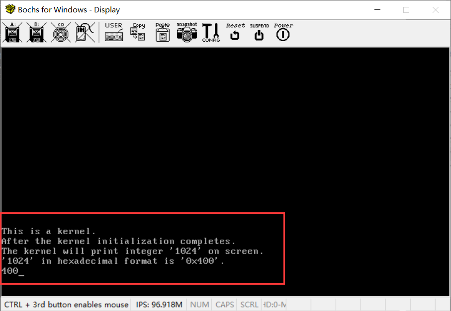
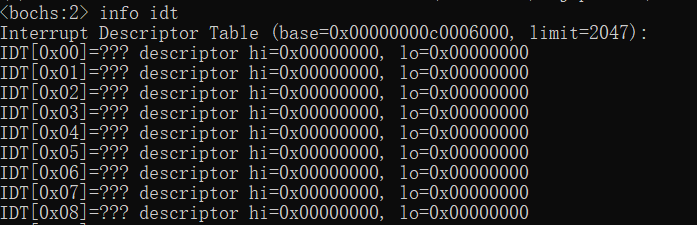
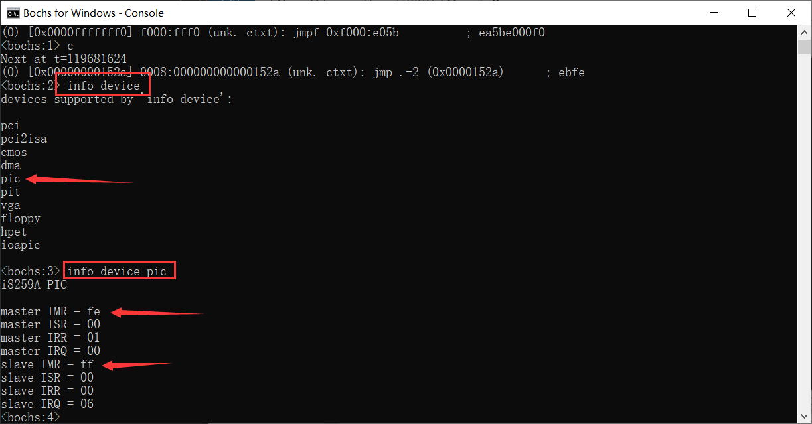

# （七）中断（上）

## 0. 一些修改

kernel_func 光荣下岗了，换上《操作系统真象还原》提供的三个在光标处打印的函数put_char、put_int、put_str。

print.asm，我补了一些注释。

```asm
; 视频段选择子就是为了用于找光标所在位置
; 因为怕你的视频段选择子有改动（后面可能涉及到）
; 所以每次都一律重设为内核的视频段选择子（GDT的第三个）
TI_GDT equ 0
RPL0 equ 0
SELECTOR_VIDEO equ (0x0003 << 3) + TI_GDT + RPL0

section .data
put_int_buffer dq 0     ; 定义8字节缓冲区用于数字到字符的转换（这个要放到数据段，因为是个占据内存的变量）

[bits 32]
section .text

global put_char
global put_str
global put_int

;------------------------   put_char   -----------------------------
; 功能描述: 把栈中的1个字符写入光标所在处
; C声明原型：void put_char(char c);
;-------------------------------------------------------------------
put_char:
    pushad                     ; 备份所有32位寄存器
    mov ax, SELECTOR_VIDEO     ; 设置视频段选择子
    mov gs, ax

    ; 获取当前光标位置高8位
    mov dx, 0x03d4
    mov al, 0x0e
    out dx, al
    mov dx, 0x03d5
    in al, dx
    mov ah, al

    ; 获取当前光标位置低8位
    mov dx, 0x03d4
    mov al, 0x0f
    out dx, al
    mov dx, 0x03d5
    in al, dx

    ; 将光标位置存入bx
    mov bx, ax
    mov ecx, [esp + 36]        ; 获取待打印的字符
    cmp cl, 0xd                ; 检查是否为回车符CR (0x0d)
    jz .is_carriage_return
    cmp cl, 0xa                ; 检查是否为换行符LF (0x0a)
    jz .is_line_feed
    cmp cl, 0x8                ; 检查是否为退格符BS (0x08)
    jz .is_backspace
    jmp .put_other

.is_backspace:
    ; 处理退格符，删除光标前一个字符
    dec bx
    shl bx, 1
    mov byte [gs:bx], 0x20     ; 用空格覆盖退格位置字符
    inc bx
    mov byte [gs:bx], 0x07
    shr bx, 1
    jmp .set_cursor

.put_other:
    ; 打印其他字符
    shl bx, 1
    mov [gs:bx], cl            ; 打印字符
    inc bx
    mov byte [gs:bx], 0x07     ; 设置字符属性
    shr bx, 1
    inc bx
    cmp bx, 2000
    jl .set_cursor             ; 如果光标未超出屏幕范围，设置新的光标位置

.is_line_feed:
.is_carriage_return:
    ; 处理换行和回车符
    xor dx, dx
    mov ax, bx
    mov si, 80
    div si
    sub bx, dx

.is_carriage_return_end:
    add bx, 80
    cmp bx, 2000
.is_line_feed_end:
    jl .set_cursor

.roll_screen:
    ; 滚屏处理
    cld
    mov ecx, 960
    mov esi, 0xb80a0
    mov edi, 0xb8000
    rep movsd

    ; 清空最后一行
    mov ebx, 3840
    mov ecx, 80
.cls:
    mov word [gs:ebx], 0x0720
    add ebx, 2
    loop .cls
    mov bx, 1920

.set_cursor:
    ; 设置光标位置
    mov dx, 0x03d4
    mov al, 0x0e
    out dx, al
    mov dx, 0x03d5
    mov al, bh
    out dx, al

    mov dx, 0x03d4
    mov al, 0x0f
    out dx, al
    mov dx, 0x03d5
    mov al, bl
    out dx, al

.put_char_done:
    popad
    ret

;--------------------------------------------
; put_str 通过put_char来打印以0字符结尾的字符串
; C声明原型：void put_str(const char *str);
;--------------------------------------------
; 输入：栈中参数为打印的字符串
; 输出：无
put_str:
    push ebx                   ; 备份寄存器ebx
    push ecx                   ; 备份寄存器ecx
    xor ecx, ecx               ; 清空ecx用于存储参数
    mov ebx, [esp + 12]        ; 从栈中得到待打印的字符串地址
.goon:
    mov cl, [ebx]              ; 获取字符串中的字符
    cmp cl, 0                  ; 检查是否到字符串结尾
    jz .str_over               ; 如果是字符串结尾，跳转到结束部分
    push ecx                   ; 为put_char函数传递参数
    call put_char
    add esp, 4                 ; 回收参数所占的栈空间
    inc ebx                    ; 使ebx指向下一个字符
    jmp .goon
.str_over:
    pop ecx                    ; 恢复寄存器ecx
    pop ebx                    ; 恢复寄存器ebx
    ret

;--------------------   将小端字节序的数字变成对应的ascii后，倒置   -----------------------
; 功能描述: 将栈中参数中的整数以16进制形式输出，不打印前缀0x
; 输入：栈中参数为待打印的数字
; 输出：在屏幕上打印16进制数字，如输入10进制15，输出字符'f'
; C声明原型：void put_int(int n);
;-----------------------------------------------------------------------------------
put_int:
    pushad                      ; 备份所有寄存器
    mov ebp, esp                ; 设置基指针寄存器
    mov eax, [ebp + 4*9]        ; 获取待打印的数字，位于栈中call的返回地址占4字节+pushad的8个4字节

    mov edx, eax                ; 复制数字到edx，用于转换过程
    mov edi, 7                  ; 指定初始偏移量，从缓冲区的末尾开始
    mov ecx, 8                  ; 16进制数字的位数为8
    mov ebx, put_int_buffer     ; 设置缓冲区指针

.16based_4bits:
    ; 处理每一个16进制数字
    and edx, 0x0000000F         ; 取数字的低4位
    cmp edx, 9
    jg .is_A2F
    add edx, '0'                ; 数字0～9转换为字符
    jmp .store

.is_A2F:
    sub edx, 10
    add edx, 'A'                ; 数字A～F转换为字符

.store:
    mov [ebx + edi], dl         ; 存储字符到缓冲区
    dec edi                     ; 向缓冲区前进一位
    shr eax, 4                  ; 处理下一个16进制数字
    mov edx, eax
    loop .16based_4bits

.ready_to_print:
    ; 去掉高位连续的0
    inc edi
.skip_prefix_0:
    cmp edi, 8
    je .full0
.go_on_skip:
    mov cl, [put_int_buffer + edi]
    inc edi
    cmp cl, '0'
    je .skip_prefix_0
    dec edi
    jmp .put_each_num

.full0:
    mov cl, '0'                 ; 如果全为0，则打印单个0
.put_each_num:
    ; 打印每一个非0字符
    push ecx
    call put_char
    add esp, 4
    inc edi
    mov cl, [put_int_buffer + edi]
    cmp edi, 8
    jl .put_each_num

    popad                       ; 恢复所有寄存器
    ret

```

lib.h增加这三个

```c
// 将一个字符打印在光标处
extern void put_char(char c);
//在光标位置打印字符串（长度不要超过屏幕一行能容纳的最多字符数80）
extern void put_str(const char *str);
//将整数以16进制形式打印在屏幕上，不打印前缀0x
extern void put_int(int n);

```

kernel.c

```c
#include "../lib/lib.h"
#include "kernel_page/kernel_page.h"
#include "kernel_gdt/kernel_gdt.h"


void kernel_main(void) {

    put_str("This is a kernel.\n");
    put_str("After the kernel initialization completes.\n");
    put_str("The kernel will print integer '1024' on screen.\n");
    put_str("'1024' in hexadecimal format is '0x400'.\n");

    // 内存分页初始化
    init_paging();
    // 重新加载gdt
    setup_gdt();
    // 调整ESP，将栈指针切换到高地址
    switch_esp_virtual_addr() ;

    put_int(1024);

    // 进入内核主循环或其它初始化代码
    for(;;) {

    }
}

```

kernel文件夹下的Makefile，删掉kernel_func相关的项目。

```makefile

# 目录
KERNEL_DIR = .

# 所有组件目录
PAGE_DIR = kernel_page
GDT_DIR = kernel_gdt

# 源文件
KERNEL_C_SRC = $(KERNEL_DIR)/kernel.c

# 汇编标志
ASM_FLAGS = -f elf32

# C 编译标志
CFLAGS = -ffreestanding -nostdlib -Wall -Wextra

# 标签标记所有的任务（输出什么文件），方便修改
KERNEL_OBJS = $(KERNEL_DIR)/kernel.o $(KERNEL_DIR)/kernel_page.o $(KERNEL_DIR)/kernel_gdt.o

.PHONY: all

all: $(KERNEL_OBJS)

# 执行各子模块编译
$(KERNEL_DIR)/kernel_page.o:
	$(MAKE) -C $(PAGE_DIR) GCC=$(GCC) AS=$(AS)

$(KERNEL_DIR)/kernel_gdt.o:
	$(MAKE) -C $(GDT_DIR) GCC=$(GCC) AS=$(AS)

# C 文件生成 汇编文件，再汇编生成.o，为什么这么做之前说过了，这个gcc的汇编器不知道什么问题
$(KERNEL_DIR)/kernel.o: $(KERNEL_C_SRC)
	$(GCC) $(CFLAGS) -S -o $(KERNEL_DIR)/kernel.asm $<
	$(AS) -o $@ $(KERNEL_DIR)/kernel.asm
	del $(KERNEL_DIR)\\kernel.asm

# 清理规则
clean:
	@if exist $(KERNEL_DIR)\\*.o del $(KERNEL_DIR)\\*.o
	@if exist $(KERNEL_DIR)\\*.bin del $(KERNEL_DIR)\\*.bin

```

一键编译烧写，运行，这是现在的效果。




## 1. 中断的概念

### 1.1 中断是什么？

中断是计算机系统中的一种机制，用于处理外部或内部事件。这些事件可能会打断正在执行的程序，迫使处理器暂停当前任务，转而处理这些事件。中断可以来源于硬件设备（如键盘、鼠标等）或者软件（如系统调用、异常处理等）。中断的主要作用是提高计算机系统的响应速度和效率，使其能够快速应对突发事件。

### 1.2 中断需要什么？

为了处理中断，系统需要以下支持：

**软件支持**：

- **中断描述表（Interrupt Descriptor Table, IDT）**：IDT 是一个数据结构，用于存储中断向量和中断服务程序的地址。当中断发生时，处理器通过查找 IDT 来确定要执行的中断服务程序。

**硬件支持**：

- **可编程中断控制器（Programmable Interrupt Controller, PIC）**：PIC 是一种硬件设备，负责管理和处理来自不同硬件设备的中断请求。最常见的 PIC 是 **8259A**，它能够处理多个中断源并按照优先级顺序进行管理。

### 1.3 中断发生了，操作系统该怎么做？

当中断发生时，操作系统需要执行以下步骤：

1. **保存现场**：处理器首先保存当前的状态，包括寄存器的内容和程序计数器的值，以便在中断处理结束后能够恢复到中断前的状态。

2. **确定中断源**：处理器查找 IDT，确定引发中断的设备或事件，并找到相应的中断服务程序。

3. **执行中断服务程序**：操作系统调用中断服务程序（Interrupt Service Routine, ISR），处理中断请求。这可能涉及读取数据、更新状态、发送响应等操作。

4. **恢复现场**：中断服务程序执行完毕后，处理器恢复之前保存的状态，包括寄存器和程序计数器的值。

5. **返回正常执行**：处理器恢复中断前的执行状态，继续执行被中断的程序。

通过上述步骤，操作系统能够高效地处理中断事件，确保系统的稳定性和响应速度。


## 2. 启用IDT

### 2.1  IDT是什么

IDT本质上是一个中断描述符（InterruptDescriptor）数组。

中断描述符（Interrupt Descriptor）是操作系统用来处理中断的一种数据结构。它包含了中断处理程序的地址和相关信息。每个中断描述符都是64位（8字节）大小。

**中断描述符的组成：**

1. **偏移量低16位（offset_low）**:
   - **位0到位15**: 中断处理程序的地址（在段中的偏移地址）的低16位。这部分用于定位中断处理程序的起始位置。

2. **段选择子（Segment Selector，就是段寄存器用到的段选择子）**:
   - **请求特权级（RPL）**:
     - **位16到位17**: 段选择子的位0-1，用于请求特权级 (Requested Privilege Level, RPL)。0表示最高特权级，3表示最低特权级。
   - **表指示符（TI）**:
     - **位18**: 段选择子的位2，表指示符 (Table Indicator)。0表示全局描述符表 (GDT)，1表示局部描述符表 (LDT)。
   - **段索引（Index）**:
     - **位19到位31**: 段选择子的位3-15，表示段索引 (Segment Index)，用于定位段描述符。

3. **中断堆栈表索引（IST，基本用不到，一般直接设为0）**:
   - **位32到位34**: 中断堆栈表 (Interrupt Stack Table) 索引，通常设置为0。这部分用于指定处理该中断时使用的堆栈。

4. **保留位（Zero）**:
   - **位35到位39**: 保留位，通常设置为0，用于将来扩展或保留用途。

5. **访问权限或者叫属性（Access Rights/Attribute）**:
   - **描述符类型（Type）**:
     - **位40到位43**: 描述符类型，用于区分中断门和陷阱门等。0xE（1110）表示32位中断门 (Interrupt Gate)，0xF（1111）表示32位陷阱门 (Trap Gate)。
   - **描述符权限（S）**:
     - **位44**: 描述符权限，0表示系统描述符，1表示代码或数据描述符。对于中断和陷阱门，此位通常为0。
   - **描述符特权级（DPL）**:
     - **位45到位46**: 描述符特权级 (Descriptor Privilege Level)，0为最高特权级，3为最低特权级。
   - **段存在位（P）**:
     - **位47**: 段存在位 (Present)，1表示描述符有效。

6. **偏移量高16位（offset_high）**:
   - **位48到位63**: 中断处理程序的地址（在段中的偏移地址）的高16位。这部分与偏移量低16位一起确定中断处理程序的完整地址。

通过上述字段，中断描述符能够全面描述中断处理程序的位置、权限和类型。当中断发生时，处理器会通过查找中断描述符来找到相应的中断处理程序，并执行相应的操作。

```c
// 中断描述符结构体形式
typedef struct {
    uint64_t offset_low : 16;   // 位0到位15: 偏移量低16位，中断处理程序的地址（在段中的偏移地址）的低16位。

    // --------------- 这部分是之前在GDT里面提到的段选择子selector ---------------

    uint16_t rpl : 2;           // 位16到位17: 段选择子的位0-1: 请求特权级 (Requested Privilege Level, RPL，0最高特权级，3最低特权级)
    uint16_t ti : 1;            // 位18: 段选择子的位2: 表指示符 (Table Indicator, 0=GDT, 1=LDT)
    uint16_t index : 13;        // 位19到位31: 段选择子的位3-15: 段索引 (Segment Index)

    // --------------- 这部分是之前在GDT里面提到的段选择子selector ---------------

    // --------------- 这部分是保留信息dcount，一般用不到设置，全都是0 ---------------

    uint64_t ist : 3;           // 位32到位34: 中断堆栈表 (Interrupt Stack Table) 索引，通常为0。
    uint64_t zero : 5;          // 位35到位39: 置零，保留位，设置为0。

    // --------------- 这部分是保留信息dcount，一般用不到设置，全都是0 ---------------

    // --------------- 这部分是access_right，访问权限，《操作系统真象还原》里面叫attribute（属性） ---------------

    uint64_t type : 4;          // 位40到位43: 描述符类型（中断门、陷阱门等）。0xE（1110）: 32位中断门（Interrupt Gate），0xF（1111）: 32位陷阱门（Trap Gate）。
    uint64_t s : 1;             // 位44: 描述符权限，0=系统, 1=代码或数据。对于中断和陷阱门，此位通常为0。
    uint64_t dpl : 2;           // 位45到位46: 描述符特权级 (Descriptor Privilege Level)，0为最高特权级，3为最低特权级。
    uint64_t p : 1;             // 位47: 段存在位 (Present)，1表示描述符有效。

    // --------------- 这部分是access_right，访问权限，《操作系统真象还原》里面叫attribute（属性） ---------------

    uint64_t offset_high : 16;  // 位48到位63: 偏移量高16位，中断处理程序的地址（在段中的偏移地址）的高16位。
} InterruptDescriptor;

```

### 2.2 如何载入IDT

其实IDT的设置、载入几乎和GDT一模一样，基本上就是换了个名字而已，所以这里主要上代码，不废话。

kernel_idt.h

```c
//
// Created by huangcheng on 2024/5/25.
//

#ifndef HOS_KERNEL_IDT_H
#define HOS_KERNEL_IDT_H

#include "../../lib/lib.h"

// 中断描述符结构体形式
typedef struct {
    uint64_t offset_low : 16;   // 位0到位15: 偏移量低16位，中断处理程序的地址（在段中的偏移地址）的低16位。

    // --------------- 这部分是之前在GDT里面提到的段选择子selector ---------------

    uint16_t rpl : 2;           // 位16到位17: 段选择子的位0-1: 请求特权级 (Requested Privilege Level, RPL，0最高特权级，3最低特权级)
    uint16_t ti : 1;            // 位18: 段选择子的位2: 表指示符 (Table Indicator, 0=GDT, 1=LDT)
    uint16_t index : 13;        // 位19到位31: 段选择子的位3-15: 段索引 (Segment Index)

    // --------------- 这部分是之前在GDT里面提到的段选择子selector ---------------

    // --------------- 这部分是保留信息dcount，一般用不到设置，全都是0 ---------------

    uint64_t ist : 3;           // 位32到位34: 中断堆栈表 (Interrupt Stack Table) 索引，通常为0。
    uint64_t zero : 5;          // 位35到位39: 置零，保留位，设置为0。

    // --------------- 这部分是保留信息dcount，一般用不到设置，全都是0 ---------------

    // --------------- 这部分是access_right，访问权限，《操作系统真象还原》里面叫attribute（属性） ---------------

    uint64_t type : 4;          // 位40到位43: 描述符类型（中断门、陷阱门等）。0xE（1110）: 32位中断门（Interrupt Gate），0xF（1111）: 32位陷阱门（Trap Gate）。
    uint64_t s : 1;             // 位44: 描述符权限，0=系统, 1=代码或数据。对于中断和陷阱门，此位通常为0。
    uint64_t dpl : 2;           // 位45到位46: 描述符特权级 (Descriptor Privilege Level)，0为最高特权级，3为最低特权级。
    uint64_t p : 1;             // 位47: 段存在位 (Present)，1表示描述符有效。

    // --------------- 这部分是access_right，访问权限，《操作系统真象还原》里面叫attribute（属性） ---------------

    uint64_t offset_high : 16;  // 位48到位63: 偏移量高16位，中断处理程序的地址（在段中的偏移地址）的高16位。
} InterruptDescriptor;

// IDT指针结构体，和GDT指针完全一样
// 如果要使用，必须禁止自动内存对齐该结构体
typedef struct {
    uint16_t limit;      // IDT界限
    uint32_t base;       // IDT基址
} IdtPtr;

// 1MB 换算成十六进制是 0x100000，低于这个的我们就预留给内核、MBR、Loader使用
// 在之前的设计里面0到0x900给了栈，0x900到0x1500给了MBR，0x1500往后留给内核

// 一个IDT描述符的大小是8字节
// 一般来说中断挺多的，要预留多一些，256个就很多了
// 不过我们也不考虑那么多，预留256个位置已经很充足了
// 那么段界限就是 8 * 256 - 1 = 2047，十六进制下，2048是0x800
// 0x6000 + 0x800 = 0x6800

#define IDT_BASE_ADDR 0x6000            // idt在内存中的起始地址
#define IDT_SIZE 256                    // 预留的IDT描述符个数
#define HIGH_ADDR_OFFSET 0xc0000000     // 往高地址的偏移量

// 段选择子的计算过程
#define	 RPL0  0
#define	 RPL1  1
#define	 RPL2  2
#define	 RPL3  3

#define TI_GDT 0
#define TI_LDT 1

#define SELECTOR_K_CODE	   ((1 << 3) + (TI_GDT << 2) + RPL0)    // 系统代码段
#define SELECTOR_K_DATA	   ((2 << 3) + (TI_GDT << 2) + RPL0)    // 系统数据段
#define SELECTOR_K_STACK   SELECTOR_K_DATA                      // 系统堆栈段
#define SELECTOR_K_GS	   ((3 << 3) + (TI_GDT << 2) + RPL0)    // 系统视频段

// IDT初始化
void init_idt();

#endif //HOS_KERNEL_IDT_H

```

IDT指针和GDT指针结构一模一样，问题也和 `（五）内核初始化之内存分页` 中的问题一模一样，看  `（五）内核初始化之内存分页` 中 `补充` 这部分就知道了。

load_idt.asm

```assembly
[bits 32]   ; 显式指定为32位汇编

section .text
global load_idt

; void load_idt(uint16_t limit, uint32_t base);
load_idt:
    ; 从栈中获取limit和base
    mov ax, [esp + 4]   ; 获取limit低16位
    mov word [esp + 4], ax
    mov eax, [esp + 8]  ; 获取base
    mov [esp + 6], eax
    lidt [esp + 4]      ; 加载GDT
    ret


```

lib.h

```c
// 加载IDT
extern void load_idt(uint16_t limit, uint32_t base);
```

kernel_idt.c

```c
//
// Created by huangcheng on 2024/5/25.
//

#include "kernel_idt.h"

void init_idt() {

    // 初始化 IDT，将所有中断描述符清零
    InterruptDescriptor *idt = (InterruptDescriptor *)IDT_BASE_ADDR;

    for (int i = 0; i < IDT_SIZE; ++i) {
        // 全部清空中断描述符数据
        *((uint64_t *)(idt + i)) = 0;
    }

    // 256 个中断描述符，8 * 256 - 1 = 2047，即0x7ff
    // 虚拟地址加载IDT
    load_idt( 256 * 8 - 1 ,IDT_BASE_ADDR + HIGH_ADDR_OFFSET);

}

```

一键编译烧写debug，输入info idt命令，可以看到IDT的基址和limit都是我们所设置好的，载入IDT的工作顺利完成。




## 3. 初始化PIC

### 3.1 PIC 8259A 介绍

PIC 8259A 是最常用的可编程中断控制器，广泛应用于 x86 平台上。它的设计使得它几乎成为所有 x86 计算机系统中标准的中断管理器。8259A 的功能是管理和处理来自不同硬件设备的中断请求，并将这些请求传递给 CPU，以便进行相应的处理。

8259A 通常以主从配置使用，每个系统可以配置一个主 8259A 和一个从 8259A。每个 8259A 拥有 8 个引脚，因此主从配置总共有 16 个引脚。然而，尽管有 16 个引脚，但系统只能支持 15 个设备中断。这是因为其中一个引脚用于连接主 PIC 和从 PIC，从而占用了一个中断线。具体来说，主 PIC 的第 2 个引脚（IRQ2）用于与从 PIC 进行通信，因此只有 15 个引脚可用于设备中断。这也意味着，实际上 CPU 无法直接得知从 PIC 是否发生了中断，只有主 PIC 的 IRQ2 中断发生的时候，CPU 才会去试图获取从 PIC 的中断信息。

主从 PIC 的硬件端口分别如下：

- **主 PIC**：
  - 控制端口（CTRL）：0x20
  - 数据端口（DATA）：0x21

- **从 PIC**：
  - 控制端口（CTRL）：0xA0
  - 数据端口（DATA）：0xA1

这些端口用于与 PIC 进行通信，控制中断的管理和处理。命令端口用于发送控制命令，而数据端口用于传输数据和配置信息。

### 3.2 初始化命令字（ICW）和操作命令字（OCW）

**初始化命令字（Initialization Command Words, ICW）**用于对 PIC 进行初始化和配置。ICW 共有四个，分别为 ICW1 到 ICW4。每个 ICW 的作用如下：

- **ICW1**：用于配置 PIC 的基本操作模式，如是否需要 ICW4、级联模式等。（对控制端口写入）
- **ICW2**：用于设置中断向量地址。主 PIC 设置起始中断向量地址，从 PIC 设置从属起始中断向量地址。（对数据端口写入）
- **ICW3**：用于配置主从关系。在主 PIC 中，指定哪个 IRQ 连接到从 PIC。在从 PIC 中，指定它连接到哪个主 PIC。（对数据端口写入）
- **ICW4**：用于配置额外的操作模式，如是否使用自动结束中断（AEOI）、是否使用缓冲模式等。（对数据端口写入）

这四个 ICW 的发送必须严格按照顺序，否则无法完成 PIC 的初始化工作。


**操作命令字（Operation Command Words, OCW）**用于在系统运行时对 PIC 进行控制和操作。OCW 共有三个，分别为 OCW1 到 OCW3。每个 OCW 的作用如下：

- **OCW1**：用于设置中断屏蔽寄存器（IMR）。通过 IMR，可以屏蔽特定的中断请求。（对数据端口写入）
- **OCW2**：用于控制中断的优先级和服务结束中断（EOI）的发送。EOI 告诉 PIC 当前中断处理完成，可以处理下一个中断。（对控制端口写入）
- **OCW3**：用于配置 PIC 的特殊操作模式，如读中断请求寄存器（IRR）和中断服务寄存器（ISR），用于调试和状态监视。（对控制端口写入）


### 3.3 PIC的初始化工作

为了向硬件端口写入命令和读出数据，需要直接用汇编写操作逻辑，因此我们写io.asm如下：

```assembly
; 这个汇编是提供向硬件端口读写数据功能的

[bits 32]   ; 显式指定为32位汇编

section .text

global outb
global outsw
global inb
global insw

; 向端口port写入一个字节的数据
; void outb(uint16_t port, uint8_t data)
outb:
    mov edx, [esp + 4]      ; 将 port 移动到 edx
    mov al, [esp + 8]       ; 将 data 移动到 eax
    out dx, al              ; 将一个字节输出到端口
    ret

; 将addr处起始的word_cnt个字写入端口port
; void outsw(uint16_t port, const void* addr, uint32_t word_cnt)
outsw:
    mov edx, [esp + 4]         ; 将 port 移动到 edx
    mov esi, [esp + 8]         ; 将 addr 移动到 esi
    mov ecx, [esp + 12]        ; 将 word_cnt 移动到 ecx
    cld                        ; 清除方向标志
    rep outsw                  ; 重复输出字串
    ret

; 将从端口port读入的一个字节返回
; uint8_t inb(uint16_t port)
inb:
    mov dx, word [esp + 4]     ; 将 port 移动到 dx
    in al, dx                  ; 从端口输入一个字节
    movzx eax, al              ; 将 al 零扩展到 eax
    ret

; 将从端口port读入的word_cnt个字写入addr
; void insw(uint16_t port, void* addr, uint32_t word_cnt)
insw:
    mov edx, [esp + 4]         ; 将 port 移动到 edx
    mov edi, [esp + 8]         ; 将 addr 移动到 edi
    mov ecx, [esp + 12]        ; 将 word_cnt 移动到 ecx
    cld                        ; 清除方向标志
    rep insw                   ; 重复输入字串
    ret

```

在lib.h中添加声明

```c
// 向端口port写入一个字节的数据
extern void outb(uint16_t port, uint8_t data);
// 将addr处起始的word_cnt个字写入端口port
extern void outsw(uint16_t port, const void* addr, uint32_t word_cnt);
// 将从端口port读入的一个字节返回
extern uint8_t inb(uint16_t port);
// 将从端口port读入的word_cnt个字写入addr
extern void insw(uint16_t port, void* addr, uint32_t word_cnt);

```

按照3.2中对于PIC初始化的过程，我们不难得出下面的代码。

首先是宏定义，明确端口。

```c
#define PIC_M_CTRL 0x20	       // 主PIC的控制端口是0x20
#define PIC_M_DATA 0x21	       // 主PIC的数据端口是0x21
#define PIC_S_CTRL 0xa0	       // 从PIC的控制端口是0xa0
#define PIC_S_DATA 0xa1	       // 从PIC的数据端口是0xa1
```

具体的初始化代码：

```c
// 这里发送的关键字大部分情况下都是固定的，而且是一个标准的初始化流程，必须按顺序走完
// 初始化PIC主片
outb (PIC_M_CTRL, 0x11);   // ICW1: 初始化命令
outb (PIC_M_DATA, 0x20);   // ICW2: 主片中断向量偏移量0x20（该PIC最高优先级的IRQ 0中断，中断描述符在IDT[0x20]处）
outb (PIC_M_DATA, 0x04);   // ICW3: 主片IR2连接从片
outb (PIC_M_DATA, 0x01);   // ICW4: 8086模式, 正常EOI

// 初始化PIC从片
outb (PIC_S_CTRL, 0x11);   // ICW1: 初始化命令
outb (PIC_S_DATA, 0x28);   // ICW2: 从片中断向量偏移量0x28（该PIC最高优先级的IRQ 8中断，中断描述符在IDT[0x28]处）
outb (PIC_S_DATA, 0x02);   // ICW3: 从片连接主片IR2
outb (PIC_S_DATA, 0x01);   // ICW4: 8086模式, 正常EOI

```

但是，这些命令为什么能代表这些信息？我们用结构体来描述每个 ICW 就一目了然了。

```c
// PIC_ICW1 结构体形式
typedef struct {
    uint8_t init : 1;               // 开始初始化为1
    uint8_t single : 1;             // 级联模式（0）或单片模式（1）
    uint8_t interval4 : 1;          // 中断向量号的调用地址间隔是否为4，1为4字节，0为8字节（看你的一个中断描述符多大）
    uint8_t level_triggered : 1;    // 边沿触发模式（0）或电平触发模式（1）
    uint8_t needs_icw4 : 1;         // 是否需要ICW4（1表示需要）
    uint8_t reserved : 3;           // 保留位，固定为0
} PIC_ICW1;

// PIC_ICW2 结构体形式
typedef struct {
    uint8_t offset;                 // 中断向量偏移量（在IDT中的下标）
} PIC_ICW2;

// 主 PIC 的 PIC_ICW3 结构体形式
typedef struct {
    uint8_t slave_on_ir0 : 1;       // IR0 连接从 PIC（1 表示连接）
    uint8_t slave_on_ir1 : 1;       // IR1 连接从 PIC（1 表示连接）
    uint8_t slave_on_ir2 : 1;       // IR2 连接从 PIC（1 表示连接）
    uint8_t slave_on_ir3 : 1;       // IR3 连接从 PIC（1 表示连接）
    uint8_t slave_on_ir4 : 1;       // IR4 连接从 PIC（1 表示连接）
    uint8_t slave_on_ir5 : 1;       // IR5 连接从 PIC（1 表示连接）
    uint8_t slave_on_ir6 : 1;       // IR6 连接从 PIC（1 表示连接）
    uint8_t slave_on_ir7 : 1;       // IR7 连接从 PIC（1 表示连接）
} PIC_ICW3_Master;

// 从 PIC 的 PIC_ICW3 结构体形式
typedef struct {
    uint8_t cascade_identity : 3;   // 连接到主 PIC 的 IR 线编号
    uint8_t reserved : 5;           // 保留位，固定为0
} PIC_ICW3_Slave;

// PIC_ICW4 结构体形式
typedef struct {
    uint8_t mode_8086 : 1;              // 8086/88 模式（1 表示使用 8086 模式）
    uint8_t auto_eoi : 1;               // 自动EOI（1 表示使用自动EOI）
    uint8_t buffered : 1;               // 缓冲模式（1 表示使用缓冲模式）
    uint8_t master_slave : 1;           // 主PIC（0）或从PIC（1），仅缓冲模式有效
    uint8_t special_fully_nested : 1;   // 支持特殊全嵌套（1 表示支持）
    uint8_t reserved : 3;               // 保留位，固定为0
} PIC_ICW4;

```

使用结构体形式，改写成以下的内容：

```c
    // 以下是主片初始化数据，都带_m后缀
    PIC_ICW1 icw1_m = {
            .init = 1,                // 开始初始化为1
            .single = 0,              // 级联模式
            .interval4 = 0,           // 中断向量号的调用地址间隔为8字节
            .level_triggered = 0,     // 边沿触发模式
            .needs_icw4 = 1,          // 需要ICW4
            .reserved = 0             // 保留位，固定为0
    }; // 十六进制表示: 0x11

    PIC_ICW2 icw2_m = {
            .offset = 0x20            // 中断向量偏移量为0x20
    }; // 十六进制表示: 0x20

    PIC_ICW3_Master icw3_m = {
            .slave_on_ir0 = 0,        // IR0未连接从PIC
            .slave_on_ir1 = 0,        // IR1未连接从PIC
            .slave_on_ir2 = 1,        // IR2连接从PIC
            .slave_on_ir3 = 0,        // IR3未连接从PIC
            .slave_on_ir4 = 0,        // IR4未连接从PIC
            .slave_on_ir5 = 0,        // IR5未连接从PIC
            .slave_on_ir6 = 0,        // IR6未连接从PIC
            .slave_on_ir7 = 0         // IR7未连接从PIC
    }; // 十六进制表示: 0x04

    PIC_ICW4 icw4_m = {
            .mode_8086 = 1,           // 8086/88模式
            .auto_eoi = 0,            // 非自动EOI
            .buffered = 0,            // 非缓冲模式
            .master_slave = 0,        // 主PIC
            .special_fully_nested = 0,// 不支持特殊全嵌套
            .reserved = 0             // 保留位，固定为0
    }; // 十六进制表示: 0x01


    // 初始化PIC主片
    // 将结构体强制转换为 uint8_t 类型并写入端口
    // 因为任何C编译器都不允许结构体强转基本数据类型，所以需要迂回路线
    // 也就是取址，然后转指针类型，再解引用
    // 或者建立一个联合体，利用联合体共用内存空间的方式来实际上转换类型
    outb (PIC_M_CTRL, *((uint8_t *)&icw1_m));   // ICW1: 初始化命令
    outb (PIC_M_DATA, *((uint8_t *)&icw2_m));   // ICW2: 主片中断向量偏移量0x20（该PIC最高优先级的IRQ 0中断，中断描述符在IDT[0x20]处）
    outb (PIC_M_DATA, *((uint8_t *)&icw3_m));   // ICW3: 主片IR2连接从片
    outb (PIC_M_DATA, *((uint8_t *)&icw4_m));   // ICW4: 8086模式, 正常EOI

    // 以下是从片初始化数据，都带_s后缀
    PIC_ICW1 icw1_s = {
            .init = 1,                // 开始初始化为1
            .single = 0,              // 级联模式
            .interval4 = 0,           // 中断向量号的调用地址间隔为8字节
            .level_triggered = 0,     // 边沿触发模式
            .needs_icw4 = 1,          // 需要ICW4
            .reserved = 0             // 保留位，固定为0
    }; // 十六进制表示: 0x11

    PIC_ICW2 icw2_s = {
            .offset = 0x28            // 中断向量偏移量为0x28
    }; // 十六进制表示: 0x28

    PIC_ICW3_Slave icw3_s = {
            .cascade_identity = 2,    // 连接到主PIC的IR2线
            .reserved = 0             // 保留位，固定为0
    }; // 十六进制表示: 0x02

    PIC_ICW4 icw4_s = {
            .mode_8086 = 1,           // 8086/88模式
            .auto_eoi = 0,            // 非自动EOI
            .buffered = 0,            // 非缓冲模式
            .master_slave = 0,        // 主PIC
            .special_fully_nested = 0,// 不支持特殊全嵌套
            .reserved = 0             // 保留位，固定为0
    }; // 十六进制表示: 0x01

    outb (PIC_S_CTRL, *((uint8_t *)&icw1_s));   // ICW1: 初始化命令
    outb (PIC_S_DATA, *((uint8_t *)&icw2_s));   // ICW2: 从片中断向量偏移量0x28（该PIC最高优先级的IRQ 8中断，中断描述符在IDT[0x28]处）
    outb (PIC_S_DATA, *((uint8_t *)&icw3_s));   // ICW3: 从片连接主片IR2
    outb (PIC_S_DATA, *((uint8_t *)&icw4_s));   // ICW4: 8086模式, 正常EOI

```

这两种写法是完全等价的。初始化完成之后，PIC已经开始在工作了，但是此时它会接受所有的中断信号，我们不想接受这么多中断信号，我们只想接受其中的一两个，或者现在根本不想接受，我们只想先屏蔽掉所有中断信号。

前面3.2我们也提到了

> - **OCW1**：用于设置中断屏蔽寄存器（IMR）。通过 IMR，可以屏蔽特定的中断请求。（对数据端口写入）
> - **OCW2**：用于控制中断的优先级和服务结束中断（EOI）的发送。EOI 告诉 PIC 当前中断处理完成，可以处理下一个中断。（对控制端口写入）
> - **OCW3**：用于配置 PIC 的特殊操作模式，如读中断请求寄存器（IRR）和中断服务寄存器（ISR），用于调试和状态监视。（对控制端口写入）

因此，初始化最后一步，给 PIC 写一个 OCW1 命令字，明确要屏蔽什么中断，放行什么中断。其实也很简单。

```c
// 初始化完成才能设置允许什么中断，屏蔽什么中断
// 对IMR发送屏蔽哪些中断放行哪些中断是直接对数据端口写你的要求

outb (PIC_M_DATA, 0xfe);  // 屏蔽主PIC除了0号中断（IRQ0）外的所有中断
outb (PIC_S_DATA, 0xff);  // 屏蔽从PIC所有中断
```

还是一样的问题，命令字到底是什么意义。老规矩用结构体来展示。

```c
// 给PIC的OCW1写的数据，转换成结构体形式
// 主片OCW1的结构体
typedef struct {
    uint8_t irq0 : 1 ;          // 是否屏蔽 IRQ 0 中断，为1则屏蔽，为0则不屏蔽
    uint8_t irq1 : 1 ;          // 是否屏蔽 IRQ 1 中断，为1则屏蔽，为0则不屏蔽
    uint8_t irq2 : 1 ;          // 是否屏蔽 IRQ 2 中断，为1则屏蔽，为0则不屏蔽
    uint8_t irq3 : 1 ;          // 是否屏蔽 IRQ 3 中断，为1则屏蔽，为0则不屏蔽
    uint8_t irq4 : 1 ;          // 是否屏蔽 IRQ 4 中断，为1则屏蔽，为0则不屏蔽
    uint8_t irq5 : 1 ;          // 是否屏蔽 IRQ 5 中断，为1则屏蔽，为0则不屏蔽
    uint8_t irq6 : 1 ;          // 是否屏蔽 IRQ 6 中断，为1则屏蔽，为0则不屏蔽
    uint8_t irq7 : 1 ;          // 是否屏蔽 IRQ 7 中断，为1则屏蔽，为0则不屏蔽
} PIC_Master_OCW1;

// 从片OCW1的结构体
typedef struct {
    uint8_t irq8 : 1 ;          // 是否屏蔽 IRQ 8 中断，为1则屏蔽，为0则不屏蔽
    uint8_t irq9 : 1 ;          // 是否屏蔽 IRQ 9 中断，为1则屏蔽，为0则不屏蔽
    uint8_t irq10 : 1 ;         // 是否屏蔽 IRQ 10 中断，为1则屏蔽，为0则不屏蔽
    uint8_t irq11 : 1 ;         // 是否屏蔽 IRQ 11 中断，为1则屏蔽，为0则不屏蔽
    uint8_t irq12 : 1 ;         // 是否屏蔽 IRQ 12 中断，为1则屏蔽，为0则不屏蔽
    uint8_t irq13 : 1 ;         // 是否屏蔽 IRQ 13 中断，为1则屏蔽，为0则不屏蔽
    uint8_t irq14 : 1 ;         // 是否屏蔽 IRQ 14 中断，为1则屏蔽，为0则不屏蔽
    uint8_t irq15 : 1 ;         // 是否屏蔽 IRQ 15 中断，为1则屏蔽，为0则不屏蔽
} PIC_Slave_OCW1;

```

同样地改写成等价形式：

```c
    // 初始化完成才能设置允许什么中断，屏蔽什么中断
    // 对IMR发送屏蔽哪些中断放行哪些中断是直接对数据端口写你的要求

    // 初始化主片OCW1数据
    PIC_Master_OCW1 ocw1_m = {
        .irq0 = 0,      // 允许 IRQ0
        .irq1 = 1,      // 屏蔽 IRQ1
        .irq2 = 1,      // 屏蔽 IRQ2
        .irq3 = 1,      // 屏蔽 IRQ3
        .irq4 = 1,      // 屏蔽 IRQ4
        .irq5 = 1,      // 屏蔽 IRQ5
        .irq6 = 1,      // 屏蔽 IRQ6
        .irq7 = 1,      // 屏蔽 IRQ7
    }; // 十六进制表示: 0xfe

    // 初始化从片OCW1数据
    PIC_Slave_OCW1 ocw1_s = {
        .irq8 = 1,       // 屏蔽 IRQ8
        .irq9 = 1,       // 屏蔽 IRQ9
        .irq10 = 1,      // 屏蔽 IRQ10
        .irq11 = 1,      // 屏蔽 IRQ11
        .irq12 = 1,      // 屏蔽 IRQ12
        .irq13 = 1,      // 屏蔽 IRQ13
        .irq14 = 1,      // 屏蔽 IRQ14
        .irq15 = 1,      // 屏蔽 IRQ15
    }; // 十六进制表示: 0xff

    // 对数据端口写入OCW1数据，PIC就知道你要屏蔽哪个中断，允许哪个中断了
    outb (PIC_M_DATA, *((uint8_t*)(&ocw1_m)));   // 屏蔽主PIC除了0号中断（IRQ0）外的所有中断
    outb (PIC_S_DATA, *((uint8_t*)(&ocw1_s)));   // 屏蔽从PIC所有中断

```

现在，PIC 可以按照我们的要求工作，只有我们想知道的中断发生的时候，它才会告诉CPU，CPU才会进行下一步处理工作。

一键编译烧写，通过Bochs的调试功能查看。


