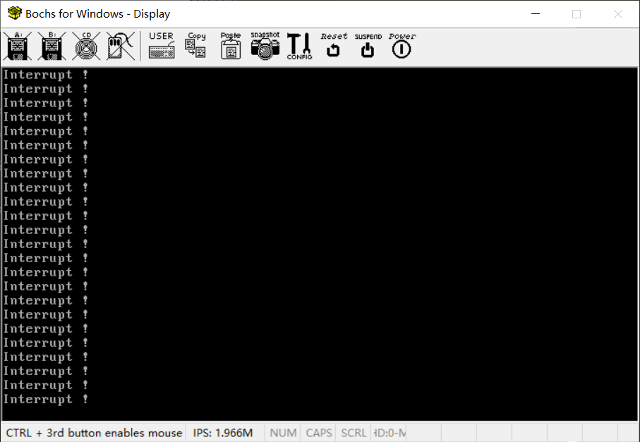

# （八）中断（下）

## 1. 实现调试模式断言

这部分内容其实在《操作系统真象还原》的第八章 `内存管理系统` 里面。但是我觉得这部分内容在实现中断这里也适用，就搬到这里来了。

### 1.1 断言是什么？

断言（Assertion）是一种在程序中用于验证假设或条件的工具。它通常表现为一个布尔表达式，其结果为真或假。当结果为假时，断言失败，通常会引发错误或终止程序执行。断言用于在开发和调试阶段捕捉代码中的逻辑错误和不一致性，确保程序的行为符合预期。

断言在软件开发中具有重要意义，主要体现在以下几个方面：

1. **捕捉逻辑错误** ：断言帮助开发人员在代码执行时验证关键假设是否成立。例如，函数的输入参数是否在预期范围内，数据结构是否保持一致性等。如果这些假设不成立，断言会立即失败，从而在错误传播之前暴露问题。这有助于快速定位和修复逻辑错误，避免错误在代码中扩散。
2. **提高代码质量**：通过在关键位置添加断言，开发人员可以明确表达代码的预期行为和不变量（invariants）。这不仅有助于自我检查，还为其他阅读代码的人提供了重要的文档。这种明确的契约（contract）提高了代码的可读性和维护性，使团队协作更加顺畅。
3. **简化调试过程**：断言失败时，通常会提供有用的调试信息，例如出错的位置和具体的条件。这些信息对调试过程非常有帮助，能够快速定位问题的根源。相比于无提示的崩溃或错误行为，断言提供的直接反馈大大简化了调试过程。
4. **预防未定义行为**：未定义行为是C编程中常见的问题。断言可以有效防止这种情况的发生。例如，访问数组越界、空指针解引用等问题可以通过断言提前捕捉，避免程序进入未定义行为状态，从而提高程序的稳定性和安全性。
5. **支持条件性编译**：在实际开发中，断言通常只在调试模式下启用，而在发布（Release）模式下禁用。这种做法通过条件编译实现，即在调试期间使用断言捕捉问题，而在发布时避免运行时开销。这使得断言成为一种高效的调试工具，而不会影响最终的性能。

断言主要是由编程语言和编译器提供支持，而不是直接依赖于操作系统。例如gcc给C语言提供的标准库文件里面就有 assert.h 这个头文件，提供了断言支持。但是断言的处理，例如输出什么信息，执行什么操作，往往是需要操作系统支持的。

### 1.2 为操作系统实现一个调试模式下的断言

断言的逻辑其实特别简单，就类似于这样（实际上大部分的断言都是依靠宏实现的，因为函数占内存，宏不占内存）：

```c
// 断言失败处理函数
void handle_assertion_failure(const char* condition, const char* file, int line) {
    fprintf(stderr, "Assertion failed: %s, file %s, line %d\n", condition, file, line);
    exit(EXIT_FAILURE);
}

// 断言函数
void my_assert(int condition, const char* condition_str, const char* file, int line) {
#ifdef DEBUG
    if (!condition) {
        handle_assertion_failure(condition_str, file, line);
    }
#else
    (void)condition;  // 避免未使用的变量警告
    (void)condition_str;
    (void)file;
    (void)line;
#endif
}

// 宏仅用于简化调用
#define MY_ASSERT(condition) my_assert((condition), #condition, __FILE__, __LINE__)

// 示例函数
void test_function(int value) {
    MY_ASSERT(value != 0);
    printf("Value is %d\n", value);
}

int main() {
#ifdef DEBUG
    printf("Debug mode enabled\n");
#else
    printf("Debug mode disabled\n");
#endif
    test_function(0);
    return 0;
}

```

在编译这个程序的时候，加上编译标志 `DEBUG`，就可以启用这个断言了，不加上就会直接跳过。

我们的OS已经有了put_char，put_int，put_str的实现，基于此，可以实现一个我们的ASSERT。

《操作系统真象还原》中的断言实现。

debug.h

```c
#ifndef __KERNEL_DEBUG_H
#define __KERNEL_DEBUG_H
void panic_spin(char* filename, int line, const char* func, const char* condition);

/***************************  __VA_ARGS__  *******************************
 * __VA_ARGS__ 是预处理器所支持的专用标识符。
 * 代表所有与省略号相对应的参数. 
 * "..."表示定义的宏其参数可变.*/
#define PANIC(...) panic_spin (__FILE__, __LINE__, __func__, __VA_ARGS__)
 /***********************************************************************/

#ifdef NDEBUG
   #define ASSERT(CONDITION) ((void)0)
#else
   #define ASSERT(CONDITION)                                      \
      if (CONDITION) {} else {                                    \
  /* 符号#让编译器将宏的参数转化为字符串字面量 */		  \
	 PANIC(#CONDITION);                                       \
      }
#endif /*__NDEBUG */

#endif /*__KERNEL_DEBUG_H*/

```

debug.c

```c
#include "debug.h"
#include "print.h"
#include "interrupt.h"

/* 打印文件名,行号,函数名,条件并使程序悬停 */
void panic_spin(char* filename,	       \
	        int line,	       \
		const char* func,      \
		const char* condition) \
{
   intr_disable();	// 因为有时候会单独调用panic_spin,所以在此处关中断。
   put_str("\n\n\n!!!!! error !!!!!\n");
   put_str("filename:");put_str(filename);put_str("\n");
   put_str("line:0x");put_int(line);put_str("\n");
   put_str("function:");put_str((char*)func);put_str("\n");
   put_str("condition:");put_str((char*)condition);put_str("\n");
   while(1);
}

```

我的版本换了个名字，全部改成了宏。

lib文件夹下建立 debug.h 文件。

```c
//
// Created by huangcheng on 2024/5/26.
//

#ifndef HOS_DEBUG_C_H
#define HOS_DEBUG_C_H

/***************************  __VA_ARGS__  *******************************
 * __VA_ARGS__ 是预处理器所支持的专用标识符。
 * 代表所有与省略号相对应的参数。
 * "..."表示定义的宏其参数可变。
 ***********************************************************************/

// 判断条件：编译时有DEBUG编译标记的时候才启用这个宏
#ifdef DEBUG
#define ASSERT(CONDITION, ...)                                                          \
        do {                                                                            \
            if (!(CONDITION)) {                                                         \
                put_str("Assertion failed!\n");                                         \
                put_str("filename:"); put_str(__FILE__); put_str("\n");                 \
                put_str("line:0x"); put_int(__LINE__); put_str("\n");                   \
                put_str("function:"); put_str((char*)__func__); put_str("\n");          \
                put_str("condition:"); put_str((char*)#CONDITION); put_str("\n");       \
                if (*#__VA_ARGS__) {                                                    \
                    put_str("message:"); put_str((char*)__VA_ARGS__); put_str("\n");    \
                }                                                                       \
                while(1);                                                               \
            }                                                                           \
        } while(0)
#else
#define ASSERT(CONDITION, ...) ((void)0)    //让编译器认为这条代码完全没用，直接忽略
#endif // 结束DEBUG判断

#endif //HOS_DEBUG_C_H

```

使用 `do { ... } while(0)` 包裹宏定义中的条件检查，以确保宏在使用时的语法正确性和安全性。之所以要用这个，一个主要原因就是程序逻辑不好替换，预处理器替换后经常因为不符合语法被编译器无法正确解析，但是用一个 do while 包裹的逻辑，编译器能解析出来这是一个完整的循环。因此用一个只执行一次的循环来包裹逻辑，是用宏写一个函数名替换整个逻辑的标准操作。至于 `\` 号，这是C语言预处理器认可的接续符号，有这个符号表示你还没写完，下一行依然属于这个范围。

可变参数是为了输出更多信息。会把这些参数全部按照字符串的方式输出，便于排查问题。

**我现在的断言逻辑目前没包括书里的标准代码里面的关闭中断**，其实原因很简单，还没实现。

最简单的C语言用例：

```c
int main() {
    int x = 5;
    ASSERT(x > 10, "x should be greater than 10, but x = %d", x);  // 如果 x 不大于 10，会触发断言失败，打印相关信息并使程序悬停
    return 0;
}

```

可以放到标准C环境中写个简单的小程序自行测试一下。

我把put_str和put_int换成了C标准库里面对应的printf，编译时加入标记`-DDEBUG` （拆分是，-D，DEBUG，-D是必须的）运行输出为：

```bash
Assertion failed!
filename: main.c
line:13
function: main
condition: x > 10
message: x should be greater than 10, but x = 5

```

在项目中使用的话，Makefile中建立一个单独的DEBUG_CFLAGS。如下所示：

```makefile
# C 编译标志
CFLAGS = -ffreestanding -nostdlib -Wall -Wextra
DEBUG_CFLAGS = -ffreestanding -g -DDEBUG

```

个人推荐这么用。


## 2. 中断处理的实现

完成 PIC 初始化之后，PIC已经正常为我们工作了。

在 `（七）中断（上）` 的 `1.3 中断发生了，操作系统该怎么做？` 中我们明确提到：

> 当中断发生时，操作系统需要执行以下步骤：
>
> 1. **保存现场**：处理器首先保存当前的状态，包括寄存器的内容和程序计数器的值，以便在中断处理结束后能够恢复到中断前的状态。
>
> 2. **确定中断源**：处理器查找 IDT，确定引发中断的设备或事件，并找到相应的中断服务程序。
>
> 3. **执行中断服务程序**：操作系统调用中断服务程序（Interrupt Service Routine, ISR），处理中断请求。这可能涉及读取数据、更新状态、发送响应等操作。
>
> 4. **恢复现场**：中断服务程序执行完毕后，处理器恢复之前保存的状态，包括寄存器和程序计数器的值。
>
> 5. **返回正常执行**：处理器恢复中断前的执行状态，继续执行被中断的程序。
>
> 通过上述步骤，操作系统能够高效地处理中断事件，确保系统的稳定性和响应速度。

因此，我们需要解决这个问题，在中断发生的时候，让CPU自动选择对应的逻辑进行处理，这个逻辑就是所谓的中断处理函数（ISR）。


### 2.1 编写一个最简单的中断处理

其实中断处理函数不太好写，又要用汇编写了，其中涉及到底层操作不得不用汇编写。

在lib.h下面建立一个isr.asm，放这里纯粹是因为懒，不想改Makefile。这个isr函数就是一个最简单的中断处理函数了。

```assembly
[bits 32]
section .text

global isr
extern put_str

isr:
    cli                     ; 禁用中断，防止中断嵌套
    pushad                  ; 保存所有通用寄存器，也就是所谓的保存现场

    ; 调用put_str函数，这里是开始执行逻辑（如果根据中断源找到对应的中断处理逻辑这部分工作已经被CPU完成了，不然也不可能进入这个函数）
    push dword str_interrupt ; 将字符串地址压入栈
    call put_str            ; 调用 put_str 函数输出字符串
    add esp, 4              ; 清理栈上参数

    ; 通知PIC中断处理结束
    mov al, 0x20            ; 准备服务结束信号 (EOI)
    out 0x20, al            ; 发送 EOI 到主 PIC 的命令端口
    out 0xa0, al            ; 发送 EOI 到从 PIC 的命令端口

    popad                   ; 恢复所有通用寄存器，也就是恢复现场
    sti                     ; 启用中断
    iretd                   ; 返回到中断前的状态，恢复EFLAGS, CS, EIP

section .data
str_interrupt db 'Interrupt !', 0x0A, 0 ; 定义中断信息字符串，0x0A表示换行，0表示字符串结束

```

把函数写出来之后，还要把它写到IDT里面对应的中断描述符去，不然CPU不知道你要拿这个逻辑去应对这个中断。

所以写一个设置中断描述符函数如下：

```c
void set_interrupt_descriptor(uint32_t index, void (*interrupt_handler)()) {

    InterruptDescriptor *idt = (InterruptDescriptor *)IDT_BASE_ADDR;

    // 一种用结构体和联合体快速分离高位和低位信息的方法（对分离其他位信息同样适用）
    typedef struct {
        uint16_t offset_low;
        uint16_t offset_high;
    } temp_interrupt_handler_struct;
    typedef union {
        void *ptr;              // 32位平台上所有指针本质上都是uin32_t，64位平台上所有指针都是uint64_t
        temp_interrupt_handler_struct value;
    } temp_interrupt_handler_union;

    temp_interrupt_handler_union tempUnion;
    tempUnion.ptr = interrupt_handler;

    (idt + index)->offset_low = tempUnion.value.offset_low;
    (idt + index)->offset_high = tempUnion.value.offset_high;

    (idt + index)->rpl = 0;     // 内核当然要最高特权
    (idt + index)->ti = 0;      // 毫无疑问GDT
    (idt + index)->index = 1;   // 内核代码段在GDT里面的index是1

    (idt + index)->ist = 0;     // 通常设置为0
    (idt + index)->zero = 0;    // 保留位，设置为0

    (idt + index)->type = 0xE;  // 固定为中断门类型
    (idt + index)->s = 0;       // 描述符类型，0=系统
    (idt + index)->dpl = 0;     // 固定为0
    (idt + index)->p = 1;       // 固定为存在

}

```

顺便解释一下。在 `set_interrupt_descriptor` 这个函数中，之所以我默认了这些参数，是因为中断处理是一种专属于内核的特权，本来就不该下放给用户态。所以我直接把中断的特权级等参数写死了，一律定为最高特权级，段选择子都是内核代码段。

CPU使用IDT是根据中断索引来寻找是哪个描述符的，方法很简单，`IDT[index]`。

（七）中断（上）中，初始化PIC的时候，有一段代码：

```c
outb (PIC_M_DATA, 0x20);   // ICW2: 主片中断向量偏移量0x20（该PIC最高优先级的IRQ 0中断，中断描述符在IDT[0x20]处）
```

也就是说，IRQ 0中断的 index 是0x20，当0x20号中断发生的时候，CPU就会找 `IDT[0x20]` ，如果它有中断处理函数就调用处理，没有就算了。

顺便说一下，0x20的十进制表示是32，也就是说，0 到 31号中断都被预留了，其实一般是预留给CPU自己用的。

比如我们要把 `isr` 这个中断处理函数注册到 IRQ 0中断，并且让 PIC 允许 IRQ 0 中断，就可以了。

```c
    // 初始化主片OCW1数据
    PIC_Master_OCW1 ocw1_m = {
        .irq0 = 0,      // 允许 IRQ0
        .irq1 = 1,      // 屏蔽 IRQ1
        .irq2 = 1,      // 屏蔽 IRQ2
        .irq3 = 1,      // 屏蔽 IRQ3
        .irq4 = 1,      // 屏蔽 IRQ4
        .irq5 = 1,      // 屏蔽 IRQ5
        .irq6 = 1,      // 屏蔽 IRQ6
        .irq7 = 1,      // 屏蔽 IRQ7
    }; // 十六进制表示: 0xff

    // 对数据端口写入OCW1数据，PIC就知道你要屏蔽哪个中断，允许哪个中断了
    outb (PIC_M_DATA, *((uint8_t*)(&ocw1_m)));   // 屏蔽主PIC所有中断

    extern void isr();

    set_interrupt_descriptor(0x20, isr);

    // 256 个中断描述符，8 * 256 - 1 = 2047，即0x7ff
    // 虚拟地址加载IDT
    load_idt( 256 * 8 - 1 ,IDT_BASE_ADDR + HIGH_ADDR_OFFSET);

```

这样就可以了。

而后在kernel.c里面，添加一句临时的内联汇编。

```c
#include "../lib/lib.h"
#include "kernel_page/kernel_page.h"
#include "kernel_gdt/kernel_gdt.h"
#include "kernel_idt/kernel_idt.h"

void kernel_main(void) {

    // 内存分页初始化
    init_paging();
    // 重新加载gdt
    setup_gdt();
    // 调整ESP，将栈指针切换到高地址
    switch_esp_virtual_addr() ;
    // 初始化idt
    init_idt();
    //为演示中断处理,在此临时用内联汇编开启中断
    asm volatile("sti");

    // 进入内核主循环或其它初始化代码
    for(;;) {

    }
}

```

一键编译烧写调试，如下所示：



可以看到屏幕上源源不断地打出我们在中断处理函数 `isr` 里面指定的 `Interrupt !` 这个字符串，说明我们的中断处理逻辑编写成功了，能被 CPU 正确识别并执行之。


### 2.2 用C编写中断处理逻辑

对于我这种看汇编就头昏脑胀的人来说，我真不觉得汇编好。但是没办法，只能这么做了。

```assembly
[bits 32]
section .text

global isr
extern function             ; C中写的处理函数

isr:
    cli                     ; 禁用中断，防止中断嵌套
    pushad                  ; 保存所有通用寄存器，也就是所谓的保存现场

    call function           ; 调用C中的处理函数，如果有参数的话要手动压栈和清理

    ; 通知PIC中断处理结束
    mov al, 0x20            ; 准备服务结束信号 (EOI)
    out 0x20, al            ; 发送 EOI 到主 PIC 的控制端口（IRQ 0在主PIC）

    popad                   ; 恢复所有通用寄存器，也就是恢复现场
    sti                     ; 启用中断
    iretd                   ; 返回到中断前的状态，恢复EFLAGS, CS, EIP

```

但是，为什么不能用C写？C不能完成的操作我们完全可以封装起来，作为汇编函数对外暴露。

其实我还真是这么想的，我就写出了如下代码。

```assembly
[bits 32]   ; 显式指定为32位汇编

TI_GDT equ 0
RPL0 equ 0
SELECTOR_CODE equ (0x0001 << 3) + TI_GDT + RPL0
SELECTOR_DATA equ (0x0002 << 3) + TI_GDT + RPL0
SELECTOR_VIDEO equ (0x0003 << 3) + TI_GDT + RPL0

section .text

; 主要工作是保存上下文和恢复上下文
global interrupt_handler_start
global interrupt_handler_end

; void interrupt_handler_start();
interrupt_handler_start:
    cli                     ; 禁用中断，防止中断嵌套
    pushad                  ; 保存所有通用寄存器，也就是所谓的保存现场
    pushfd                  ; 保存EFLAGS
    push cs                 ; 保存代码段寄存器
    push ds                 ; 保存数据段寄存器
    push es
    push fs
    push gs                 ; 保存视频段寄存器
    mov ax, SELECTOR_CODE   ; 加载代码段选择子
    mov cs, ax
    mov ax, SELECTOR_DATA   ; 加载数据段选择子
    mov ds, ax
    mov es, ax
    mov fs, ax
    mov ax, SELECTOR_VIDEO  ; 加载视频段选择子
    mov gs, ax
    ret

; void interrupt_handler_end();
interrupt_handler_end:
    pop gs                  ; 恢复各个段寄存器
    pop fs
    pop es
    pop ds
    pop cs
    popfd                   ; 恢复EFLAGS
    popad                   ; 恢复所有通用寄存器，也就是恢复现场
    sti                     ; 启用中断
    ret

```

然后我才想到这个问题。

首先，进入汇编的函数的时候，栈顶是返回地址，然后是参数一，参数二等等。

在 `interrupt_handler_start` 中我们压栈了所有的寄存器来保存上下文，返回地址被压到最下面了，此时返回能返回什么呢？

在 `interrupt_handler_end` 中也一样，弹栈第一个弹走的就是返回地址。此时返回ret返回哪里？

所以这个想法只能宣告破产。

没办法，只能搞一个类似于模板的东西吧，能用就行。

interrupt_handler.asm

```assembly
[bits 32]   ; 显式指定为32位汇编

TI_GDT equ 0
RPL0 equ 0
SELECTOR_CODE equ (0x0001 << 3) + TI_GDT + RPL0
SELECTOR_DATA equ (0x0002 << 3) + TI_GDT + RPL0
SELECTOR_VIDEO equ (0x0003 << 3) + TI_GDT + RPL0

section .text

global interrupt_handler_0x20
; 在C里面编写的逻辑处理代码，叫什么都可以
extern interrupt_0x20_function

; void interrupt_handler_0x20();
interrupt_handler_0x20:
    cli                     ; 禁用中断，防止中断嵌套
    pushad                  ; 保存所有通用寄存器，也就是所谓的保存现场
    push ds                 ; 保存数据段寄存器
    push es
    push fs
    push gs                 ; 保存视频段寄存器
    mov ax, SELECTOR_DATA   ; 加载数据段选择子
    mov ds, ax
    mov es, ax
    mov fs, ax
    mov ax, SELECTOR_VIDEO  ; 加载视频段选择子
    mov gs, ax

    call interrupt_0x20_function ; 调用C里面的处理代码

    pop gs                  ; 恢复各个段寄存器
    pop fs
    pop es
    pop ds
    popad                   ; 恢复所有通用寄存器，也就是恢复现场
    sti                     ; 启用中断
    iretd                   ; 恢复调用前的cs、eflags、eip

```

由于我们的系统只有唯一的一个代码段和数据段、视频段，所以 `cs`、`ds`、`gs` 寄存器里面的选择子其实应该是永远不变的。也可以简化为一下代码，但是推荐为了保险还是按照上面的完整代码来。简化代码仅供参考：

```assembly
[bits 32]   ; 显式指定为32位汇编

TI_GDT equ 0
RPL0 equ 0
SELECTOR_CODE equ (0x0001 << 3) + TI_GDT + RPL0
SELECTOR_DATA equ (0x0002 << 3) + TI_GDT + RPL0
SELECTOR_VIDEO equ (0x0003 << 3) + TI_GDT + RPL0

section .text

global interrupt_handler_0x20
; 在C里面编写的逻辑处理代码，叫什么都可以
extern interrupt_0x20_function

; void interrupt_handler_0x20();
interrupt_handler_0x20:
    cli                     ; 禁用中断，防止中断嵌套
    pushad                  ; 保存所有通用寄存器，也就是所谓的保存现场

    call interrupt_0x20_function ; 调用C里面的处理代码

    popad                   ; 恢复所有通用寄存器，也就是恢复现场
    sti                     ; 启用中断
    iretd                   ; 恢复调用前的cs、eflags、eip

```

kernel.c

```c
#include "../lib/lib.h"
#include "kernel_page/kernel_page.h"
#include "kernel_gdt/kernel_gdt.h"
#include "kernel_idt/kernel_idt.h"

void kernel_main(void) {
    // 内存分页初始化
    init_paging();
    // 重新加载gdt
    setup_gdt();
    // 调整ESP，将栈指针切换到高地址
    switch_esp_virtual_addr() ;
    // 初始化idt
    init_idt();

    extern void interrupt_handler_0x20();
    set_interrupt_descriptor(0x20, interrupt_handler_0x20);

    asm volatile("sti");   //为演示中断处理,在此临时开中断

    // 进入内核主循环或其它初始化代码
    for(;;) {

    }
}

void interrupt_0x20_function() {
    put_str("This is a interrupt handler\n");
    outb(PIC_M_CTRL, 0x20); // 给主PIC控制端口发送一个OCW2命令字告知中断处理完毕
}

```

这样也是可以顺利运行的。但是注意：

1. **kernel_main** 是内核的入口，它必须位于整个内核所有内容的最前面，因此它的前面不能放任何变量、常量、函数，可以放宏（宏不占内存），否则就没法把 kernel_main 的地址固定在0x1500处。
2. IDT和GDT加载成功之后都可以重设描述符而不用重新加载，但是重设描述符的时候必须先关闭中断，特别是IDT！我这里没有关闭中断，是因为我都没有开启中断，但是为了保险起见还是建议先关闭中断。


## 补充 ：OCW2和OCW3

之前我们已经接触到了OCW1命令字，用于设置开启哪些中断关闭哪些中断。但是OCW命令字还有两种，分别是OCW2和OCW3。

```c
outb(PIC_M_CTRL, 0x20); // 给主PIC控制端口发送一个OCW2命令字告知中断处理完毕
```

在这句代码中，已经接触到了一个最常用的OCW2命令字，0x20，但是OCW2和OCW3未来可能都会用到。因此，补充OCW2和OCW3的结构体形式，方便理解。

```c
// PIC_OCW2 结构体
typedef struct {
    uint8_t irq_level : 3;  // 中断请求级别（IR2-IR0），如果要选择中断的级别，sl位必须同时为1
    uint8_t reserved : 2;   // 保留位，通常为0
    uint8_t eoi : 1;        // 服务结束中断（EOI），1表示发送EOI
    uint8_t sl : 1;         // 选择（Select），1表示选择中断级别
    uint8_t r : 1;          // 旋转优先级（Rotate Priority），1表示启用旋转优先级
} PIC_OCW2;

// PIC_OCW3 结构体
typedef struct {
    uint8_t ris  : 1;       // 读哪种中断状态。1: 读中断服务寄存器 (ISR)，0: 读中断请求寄存器 (IRR)
    uint8_t rr   : 1;       // 是否允许读寄存器。1: 允许读取状态寄存器，0: 不允许读取状态寄存器
    uint8_t p    : 1;       // 轮询。1: 启用轮询命令，0: 不启用轮询
    uint8_t reserved1: 1;   // 固定为 1，指示这是一个 OCW3 命令字
    uint8_t reserved2: 1;   // 固定为 0，指示这是一个 OCW3 命令字
    uint8_t smm  : 1;       // 特殊屏蔽模式。当 esmm = 1 时有效。0: 禁用特殊屏蔽模式，恢复正常屏蔽模式。1: 启用特殊屏蔽模式，允许特定中断屏蔽。
    uint8_t esmm : 1;       // 是否启用特殊屏蔽模式。0: 不启用特殊屏蔽模式，1: 启用特殊屏蔽模式，此时 SMM 位起作用。
    uint8_t reserved3: 1;   // 保留位，通常设置为 0
} PIC_OCW3;

```

其中，0x20与这样的OCW2结构体数据等价。

```c
PIC_OCW2 pic_ocw2 = {
    .irq_level = 0,         // 不设置优先级，填0
    .reserved = 0,          // 保留位为0
    .eoi = 1,               // 服务完毕，发送EOI
    .sl = 0,                // 不选择中断级别
    .r = 0,                 // 不启用旋转优先级
};
```

关于PIC的指令，推荐大家直接看国外的详细资料，国内也可以打开，里面的英文还是比较简单的，不用翻译也基本上都能看懂：

[8259 可编程中断控制器 (eeeguide.com)](https://www.eeeguide.com/8259-programmable-interrupt-controller/)
