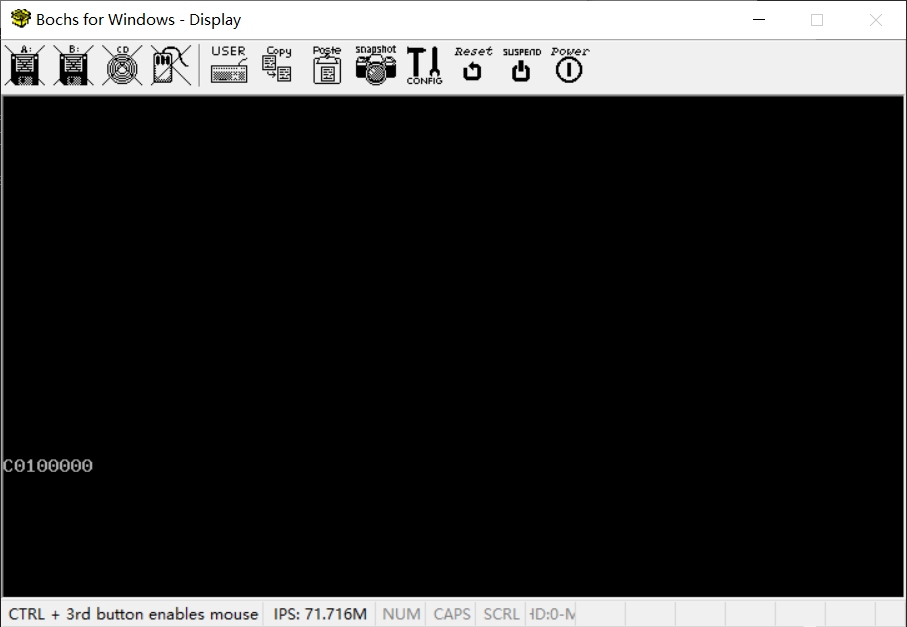
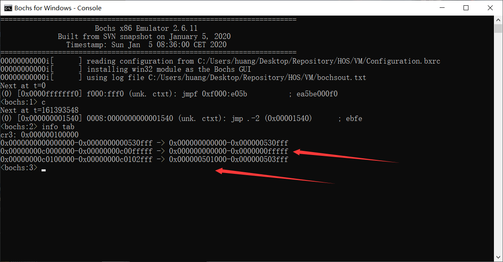
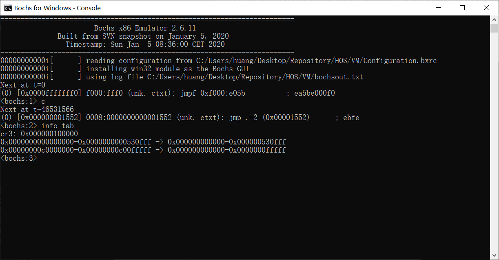

# （九）内存管理机制

首先说明一下，《操作系统真象还原》里面，在 `第7章 中断` 这部分还有一个小节  `7.8 提高时钟中断的频率，让中断来得更猛烈一些` 。这部分讲的其实是硬件设备可编程计时器（PIT）的初始化设置。我觉得应该放在设备那部分比较好，就先跳过了。

补充的内容其实是关于中断状态的管理机制，防止多次开/关中断，以及一些常用的字符串/内存操作函数。变动主要是变动项目文件位置。

## 0. 补充和变动

### 0.1 项目文件变动

**变动项**：

1. kernel文件夹下新建 `interrupt_handler` 文件夹，以后把用汇编写的调用具体中断处理逻辑的中断处理函数都放在这里，并建立相应的makefile。
2. lib文件夹中新建一个 `lib_kernel` 文件夹，把目前写的所有汇编都放进去，相应地修改makefile。
3. lib文件夹中的 `lib.h` 相应地改名 `lib_kernel.h` ，一并挪到 `lib_kernel` 文件夹中。因为我用的是CLion管理项目文件，改名倒是会连带一起改了，不用操心，如果IDE不支持连带改名就有点麻烦了。

**原因解释**：

1. 未来可能要实现多个中断，至少计时器中断（IRQ 0）、键盘中断（IRQ 1）、缺页中断（这个是CPU自己报中断的）是必须要实现的，放在统一的文件夹里面好管理。
2. 未来还有用户空间需要用的依赖，比如系统调用什么的，这么做是提前隔离。
3. `type.h` 用户空间应该也用得到，所以不要放进 `lib_kernel` 里面。

涉及到的Makefile变更。

统一的变更：

所有的

```makefile
# C 编译标志
CFLAGS = -ffreestanding -nostdlib -Wall -Wextra -I$(LIB_DIR)
```

链接库目录标志 `-I$(LIB_DIR)` 其实都不用加上了。完全可以删掉，因为我们在每个头文件里面都inlucde了正确路径。

单独的变更：

1. `interrupt_handler` 中interrupt_handler.h

```c
//
// Created by huangcheng on 2024/5/27.
//

#ifndef HOS_INTERRUPT_HANDLER_H
#define HOS_INTERRUPT_HANDLER_H

// 这个头文件是为了给所有的中断处理函数写声明的地方

#endif //HOS_INTERRUPT_HANDLER_H

```

Makefile

```makefile
# 目录
KERNEL_DIR = ..
INTERRUPT_HANDLER = .

# 汇编标志
ASM_FLAGS = -f elf32

# 定义源文件和目标文件
SRCS = $(wildcard *.asm)
OBJS = $(SRCS:.asm=.o)

# 默认目标，编译所有的 .asm 文件
all: $(OBJS)

# 目标文件生成规则
%.o: %.asm
	$(NASM) $(ASM_FLAGS) -o $(KERNEL_DIR)/$@ $<

# 不在此处生成文件无需清理

```

2. kernel中的Makefile：

```makefile

# 目录
KERNEL_DIR = .

# 所有组件目录
PAGE_DIR = kernel_page
GDT_DIR = kernel_gdt
IDT_DIR = kernel_idt
DEVICE_DIR = kernel_device
INTERRUPT_DIR = kernel_interrupt
INTERRUPT_HANDLER_DIR = interrupt_handler

# 源文件
KERNEL_C_SRC = $(KERNEL_DIR)/kernel.c

# 汇编标志
ASM_FLAGS = -f elf32

# C 编译标志
CFLAGS = -ffreestanding -nostdlib -Wall -Wextra

# 标签标记所有的任务（输出什么文件），方便修改
KERNEL_OBJS = $(KERNEL_DIR)/kernel.o \
				$(KERNEL_DIR)/kernel_page.o \
				$(KERNEL_DIR)/kernel_gdt.o \
				$(KERNEL_DIR)/kernel_idt.o \
				$(KERNEL_DIR)/kernel_device.o \
				$(KERNEL_DIR)/kernel_interrupt.o\
				$(KERNEL_DIR)/interrupt_handler.o

.PHONY: all

all: $(KERNEL_OBJS)

# 执行各子模块编译
$(KERNEL_DIR)/kernel_page.o:
	$(MAKE) -C $(PAGE_DIR) GCC=$(GCC) AS=$(AS)

$(KERNEL_DIR)/kernel_gdt.o:
	$(MAKE) -C $(GDT_DIR) GCC=$(GCC) AS=$(AS)

$(KERNEL_DIR)/kernel_idt.o:
	$(MAKE) -C $(IDT_DIR) GCC=$(GCC) AS=$(AS)

$(KERNEL_DIR)/kernel_device.o:
	$(MAKE) -C $(DEVICE_DIR) GCC=$(GCC) AS=$(AS)

$(KERNEL_DIR)/kernel_interrupt.o:
	$(MAKE) -C $(INTERRUPT_DIR) GCC=$(GCC) AS=$(AS)

$(KERNEL_DIR)/interrupt_handler.o:
#	$(MAKE) -C $(INTERRUPT_HANDLER_DIR) NASM=$(NASM)

# C 文件生成 汇编文件，再汇编生成.o，为什么这么做之前说过了，这个gcc的汇编器不知道什么问题
$(KERNEL_DIR)/kernel.o: $(KERNEL_C_SRC)
	$(GCC) $(CFLAGS) -S -o $(KERNEL_DIR)/kernel.asm $<
	$(AS) -o $@ $(KERNEL_DIR)/kernel.asm
	del $(KERNEL_DIR)\\kernel.asm

# 清理规则
clean:
	@if exist $(KERNEL_DIR)\\*.o del $(KERNEL_DIR)\\*.o
	@if exist $(KERNEL_DIR)\\*.bin del $(KERNEL_DIR)\\*.bin

```

3. lib_kernel中的Makefile

```makefile
# 目录
LIB_DIR = ..
LIB_KERNEL = .

# 汇编标志
ASM_FLAGS = -f elf32

# 定义源文件和目标文件
SRCS = $(wildcard *.asm)
OBJS = $(SRCS:.asm=.o)

# 默认目标，编译所有的 .asm 文件
all: $(OBJS)

# 目标文件生成规则
%.o: %.asm
	$(NASM) $(ASM_FLAGS) -o $(LIB_DIR)/$@ $<

# 文件不在这里生成，无需清理

```

4. lib中的Makefile

```makefile
# 目录
LIB_DIR = .
LIB_KERNEL = lib_kernel

OBJS = $(LIB_DIR)/kernel.o

# 默认目标
all: $(OBJS)

# 目标文件生成规则
$(LIB_DIR)/kernel.o:
	$(MAKE) -C $(LIB_KERNEL) GCC=$(GCC) AS=$(AS) NASM=$(NASM) MAKE=$(MAKE)

# 清理目标，删除所有 .o 文件
clean:
	@if exist $(LIB_DIR)\\*.o del $(LIB_DIR)\\*.o

```

5. 主Makefile

```makefile
# 主Makefile，用于整合各模块操作

# 汇编器和编译器、链接器等各种工具
NASM = nasm
GCC = i386-elf-gcc
AS = i386-elf-as
LD = i386-elf-ld
MAKE = make

# 因为这个操作系统本质上是个宏内核，所有的组件都要打包在一个kernel.bin里面
# 这样烧写起来也方便，所以要在主Makefile这里统一链接

# 所有组件目录
BOOT_DIR = boot
KERNEL_DIR = kernel
LIB_DIR = lib

# 输出文件
KERNEL_BIN = $(KERNEL_DIR)/kernel.bin

# 链接脚本位置
KERNEL_LINKER_SCRIPT = $(KERNEL_DIR)/kernel_linker.ld

# 链接标志
LDFLAGS = -T $(KERNEL_LINKER_SCRIPT) --oformat binary

.PHONY: all

# 编译各组件，要把工具参数传输过去，然后主Makefile汇总链接生成 kernel.bin
all: compile link

# 编译各组件
compile:
	$(MAKE) -C $(BOOT_DIR) NASM=$(NASM)
	$(MAKE) -C $(LIB_DIR) NASM=$(NASM) GCC=$(GCC) AS=$(AS) MAKE=$(MAKE)
	$(MAKE) -C $(KERNEL_DIR) NASM=$(NASM) GCC=$(GCC) AS=$(AS) MAKE=$(MAKE)

# 链接生成 kernel.bin
link:
	$(LD) $(LDFLAGS) -o $(KERNEL_BIN) $(wildcard $(KERNEL_DIR)/*.o) $(wildcard $(LIB_DIR)/*.o)


clean:
	$(MAKE) -C $(BOOT_DIR) clean
	$(MAKE) -C $(KERNEL_DIR) clean
	$(MAKE) -C $(LIB_DIR) clean

```

说明一下，为什么Make到LIB的时候要增加传入GCC和AS两个参数，是因为接下来我们要建立一些内核中用到的通用的数据结构，放到lib_kernel中，需要用到C来写。

### 0.2 中断补充

首先是封装 `cli` 和 `sti` 两个汇编指令。

clisti.asm

```assembly
; 就两个中断操作函数

[bits 32]

section .text

global disable_interrupts
global enable_interrupts

; void disable_interrupts();
disable_interrupts:
    cli
    ret

; void enable_interrupts();
enable_interrupts:
    sti
    ret

```

判断是否当前处于中断状态，看的是 eflags 寄存器里面的值。

get_eflags.asm

```assembly
[bits 32]

section .text

global get_eflags

; void get_eflags(uint32_t *eflag_var);
get_eflags:
    pushfd              ; 将EFLAGS寄存器的值压入堆栈
    pop eax             ; 将堆栈顶的值弹出到EAX寄存器
    mov ecx, [esp + 4]  ; 获取传入的变量地址，存储到ECX寄存器
    mov [ecx], eax      ; 将EAX寄存器的值存储到变量地址中
    ret                 ; 返回

```

kernel文件夹下建立一个文件夹 kernel_interrupt，建立 kernel_interrupt.h 和 kernel_interrupt.c 。

kernel_interrupt.h

```c
//
// Created by huangcheng on 2024/5/27.
//

#ifndef HOS_INTERRUPT_H
#define HOS_INTERRUPT_H

// 用枚举定义两个中断状态量（用常量也行，不过枚举的在编程习惯上更好）
enum intr_status {      // 中断状态
    INTR_OFF = 0,       // 中断关闭
    INTR_ON             // 中断打开
};

enum intr_status intr_get_status(void);
enum intr_status intr_set_status (enum intr_status);
enum intr_status intr_enable (void);
enum intr_status intr_disable (void);

#endif //HOS_INTERRUPT_H

```

kernel_interrupt.c

```c
//
// Created by huangcheng on 2024/5/27.
//

#include "kernel_interrupt.h"

#include "../../lib/lib.h"

// 这么大费周章的主要原因其实就一个，防止多次开/关中断
// 如果开了中断就不要开了，如果关了中断就不要关了

// 封装了cli
extern void disable_interrupts();
// 封装了sti
extern void enable_interrupts();

// 汇编写的取eflags函数
extern void get_eflags(uint32_t* eflags);

// 使用宏进行第二次封装
#define GET_EFLAGS(var) do { get_eflags(&var); } while (0)

// eflags寄存器中的if位为1（表示中断此时处于开启状态）
#define EFLAGS_IF   0x00000200

// 开中断,并且返回开中断前的状态，即允许中断
enum intr_status intr_enable() {
    enum intr_status old_status;
    if (INTR_ON == intr_get_status()) {
        old_status = INTR_ON;
        return old_status;
    } else {
        old_status = INTR_OFF;
        enable_interrupts();    // 开启中断
        return old_status;
    }
}

// 关中断,并且返回关中断前的状态，即不允许中断
enum intr_status intr_disable() {
    enum intr_status old_status;
    if (INTR_ON == intr_get_status()) {
        old_status = INTR_ON;
        disable_interrupts();   // 关闭中断
        return old_status;
    } else {
        old_status = INTR_OFF;
        return old_status;
    }
}

// 将中断状态设置为status
enum intr_status intr_set_status(enum intr_status status) {
    return status & INTR_ON ? intr_enable() : intr_disable();
}

// 获取当前中断状态
enum intr_status intr_get_status() {
    uint32_t eflags = 0;
    GET_EFLAGS(eflags);
    return (EFLAGS_IF & eflags) ? INTR_ON : INTR_OFF;
}

```

实现了中断管理之后，就可以补充完整 debug.h 了。

```c
//
// Created by huangcheng on 2024/5/26.
//

#ifndef HOS_DEBUG_C_H
#define HOS_DEBUG_C_H

#include "kernel_interrupt/kernel_interrupt.h"

/***************************  __VA_ARGS__  *******************************
 * __VA_ARGS__ 是预处理器所支持的专用标识符。
 * 代表所有与省略号相对应的参数。
 * "..."表示定义的宏其参数可变。
 ***********************************************************************/

// 补充说明，断言发生报错的时候，多半逻辑已经不能再执行下去，再执行下去反而要系统崩溃
// 这时候如果中断又来，又调用个中断处理函数，说不大直接系统就崩溃了
// 干脆就直接禁止中断、输出信息，然后空转就行了

// 判断条件：编译时有DEBUG编译标记的时候才启用这个宏
#ifdef DEBUG
#define ASSERT(CONDITION, ...)                                                          \
        do {                                                                            \
            if (!(CONDITION)) {                                                         \
                intr_disable();                                                         \
                put_str("Assertion failed!\n");                                         \
                put_str("filename:"); put_str(__FILE__); put_str("\n");                 \
                put_str("line:0x"); put_int(__LINE__); put_str("\n");                   \
                put_str("function:"); put_str((char*)__func__); put_str("\n");          \
                put_str("condition:"); put_str((char*)#CONDITION); put_str("\n");       \
                if (*#__VA_ARGS__) {                                                    \
                    put_str("message:"); put_str((char*)__VA_ARGS__); put_str("\n");    \
                }                                                                       \
                while(1);                                                               \
            }                                                                           \
        } while(0)
#else
#define ASSERT(CONDITION, ...) ((void)0)    //让编译器认为这条代码完全没用，直接忽略
#endif // 结束DEBUG判断

#endif //HOS_DEBUG_C_H

```

### 0.3 内核的字符串/内存操作函数补充

在lib_kernel中建立文件夹string。

string.h

```c
//
// Created by huangcheng on 2024/5/28.
//

#ifndef HOS_STRING_H
#define HOS_STRING_H

void memset(void* dst_, uint8_t value, uint32_t size);
void memcpy(void* dst_, const void* src_, uint32_t size);
int memcmp(const void* a_, const void* b_, uint32_t size);
char* strcpy(char* dst_, const char* src_);
uint32_t strlen(const char* str);
int8_t strcmp (const char *a, const char *b);
char* strchr(const char* string, const uint8_t ch);
char* strrchr(const char* string, const uint8_t ch);
char* strcat(char* dst_, const char* src_);
uint32_t strchrs(const char* filename, uint8_t ch);

#endif //HOS_STRING_H

```

string.c

```c
//
// Created by huangcheng on 2024/5/28.
//

#include "string.h"
#include "../../type.h"
#include "../../../kernel/debug.h"

/* 将dst_起始的size个字节置为value */
void memset(void* dst_, uint8_t value, uint32_t size) {
    ASSERT(dst_ != NULL);
    uint8_t* dst = (uint8_t*)dst_;
    while (size-- > 0)
        *dst++ = value;
}

/* 将src_起始的size个字节复制到dst_ */
void memcpy(void* dst_, const void* src_, uint32_t size) {
    ASSERT(dst_ != NULL && src_ != NULL);
    uint8_t* dst = dst_;
    const uint8_t* src = src_;
    while (size-- > 0)
        *dst++ = *src++;
}

/* 连续比较以地址a_和地址b_开头的size个字节,若相等则返回0,若a_大于b_返回+1,否则返回-1 */
int memcmp(const void* a_, const void* b_, uint32_t size) {
    const char* a = a_;
    const char* b = b_;
    ASSERT(a != NULL || b != NULL);
    while (size-- > 0) {
        if(*a != *b) {
            return *a > *b ? 1 : -1;
        }
        a++;
        b++;
    }
    return 0;
}

/* 将字符串从src_复制到dst_ */
char* strcpy(char* dst_, const char* src_) {
    ASSERT(dst_ != NULL && src_ != NULL);
    char* r = dst_;		       // 用来返回目的字符串起始地址
    while((*dst_++ = *src_++));
    return r;
}

/* 返回字符串长度 */
uint32_t strlen(const char* str) {
    ASSERT(str != NULL);
    const char* p = str;
    while(*p++);
    return (p - str - 1);
}

/* 比较两个字符串,若a_中的字符大于b_中的字符返回1,相等时返回0,否则返回-1. */
int8_t strcmp (const char* a, const char* b) {
    ASSERT(a != NULL && b != NULL);
    while (*a != 0 && *a == *b) {
        a++;
        b++;
    }
/* 如果*a小于*b就返回-1,否则就属于*a大于等于*b的情况。在后面的布尔表达式"*a > *b"中,
 * 若*a大于*b,表达式就等于1,否则就表达式不成立,也就是布尔值为0,恰恰表示*a等于*b */
    return *a < *b ? -1 : *a > *b;
}

/* 从左到右查找字符串str中首次出现字符ch的地址(不是下标,是地址) */
char* strchr(const char* str, const uint8_t ch) {
    ASSERT(str != NULL);
    while (*str != 0) {
        if (*str == ch) {
            return (char*)str;	    // 需要强制转化成和返回值类型一样,否则编译器会报const属性丢失,下同.
        }
        str++;
    }
    return NULL;
}

/* 从后往前查找字符串str中首次出现字符ch的地址(不是下标,是地址) */
char* strrchr(const char* str, const uint8_t ch) {
    ASSERT(str != NULL);
    const char* last_char = NULL;
    /* 从头到尾遍历一次,若存在ch字符,last_char总是该字符最后一次出现在串中的地址(不是下标,是地址)*/
    while (*str != 0) {
        if (*str == ch) {
            last_char = str;
        }
        str++;
    }
    return (char*)last_char;
}

/* 将字符串src_拼接到dst_后,将回拼接的串地址 */
char* strcat(char* dst_, const char* src_) {
    ASSERT(dst_ != NULL && src_ != NULL);
    char* str = dst_;
    while (*str++);
    --str;      // 别看错了，--str是独立的一句，并不是while的循环体
    while((*str++ = *src_++));	 // 当*str被赋值为0时,此时表达式不成立,正好添加了字符串结尾的0.
    return dst_;
}

/* 在字符串str中查找指定字符ch出现的次数 */
uint32_t strchrs(const char* str, uint8_t ch) {
    ASSERT(str != NULL);
    uint32_t ch_cnt = 0;
    const char* p = str;
    while(*p != 0) {
        if (*p == ch) {
            ch_cnt++;
        }
        p++;
    }
    return ch_cnt;
}

```

string中的Makefile

```makefile

# 目录
LIB_DIR = ../..
LIB_KERNEL_DIR = ..
STRING_DIR = .

# 源文件
STRING_C_SRC = $(STRING_DIR)/string.c

# C 编译标志
CFLAGS = -ffreestanding -nostdlib -Wall -Wextra

# 标签标记所有的任务（输出什么文件），方便修改
OBJS = $(LIB_DIR)/string.o

.PHONY: all

all: $(OBJS)

# C 文件生成 汇编文件，再汇编生成.o，为什么这么做之前说过了，这个gcc的汇编器不知道什么问题
# 编出来放到模块文件夹kernel去，别放在这里，方便主Makefile找
$(LIB_DIR)/string.o: $(STRING_C_SRC)
	$(GCC) $(CFLAGS) -S -o $(STRING_DIR)/string.asm $<
	$(AS) -o $@ $(STRING_DIR)/string.asm
	del $(STRING_DIR)\\string.asm

# 文件不生成于此，无需清理规则

```

lib_kernel.h中，把string.h也包含进来。

```c
#include "string/string.h"
```

lib_kernel中的Makefile

```makefile
# 目录
LIB_DIR = ..
LIB_KERNEL = .
STRING_DIR = string

# 汇编标志
ASM_FLAGS = -f elf32

# 定义源文件和目标文件
SRCS = $(wildcard *.asm)
OBJS = $(SRCS:.asm=.o)

# 默认目标，编译所有的 .asm 文件
all: $(OBJS) $(LIB_DIR)/string.o

# 目标文件生成规则
%.o: %.asm
	$(NASM) $(ASM_FLAGS) -o $(LIB_DIR)/$@ $<

$(LIB_DIR)/string.o:
	$(MAKE) -C $(STRING_DIR) GCC=$(GCC) AS=$(AS)

# 文件不在这里生成，无需清理

```

type.h中增加一个常用的表示：

```c
// 常用的NULL表示
#define NULL (void *)(0)
```


## 1. 位图

### 1.1 位图简介

位图（Bitmap）是一种高效的空间管理数据结构，使用一个或多个字节来记录某一组元素的状态。每个位（bit）代表一个元素的状态，通常是二进制的两个状态：0或1。由于位图使用位来表示状态，因此在内存和处理时间上非常高效。

**位图相比较于其他数据结构的优点**：

1. **高效利用内存**：在处理只有两种状态（有和无、真和假、空闲和占用等）的场景时，使用位图可以大大减少内存消耗。例如，用一个字节可以表示8个状态，而使用字符（每个字符通常占用一个字节）则会显得非常浪费。
2. **快速操作**：位图可以通过位操作（如按位与、按位或、按位非等）快速地进行状态的设置、清除和测试。这些操作通常比处理更复杂的数据结构要快得多。（在理解上，位运算可能比较难理解，但是计算机执行位运算其实更快，比我们在复杂数据结构里面微操还快）
3. **简单实现**：位图的数据结构和相关操作实现起来相对简单，易于理解和使用。

位图广泛应用于多种需要高效管理有限状态的场景，以下是一些常见的应用：

1. **内存管理**：在操作系统中，位图常用于内存管理，特别是用于管理空闲和已分配的内存块。每个位代表内存的一个单元（如一页、一块），通过位图可以高效地跟踪内存的使用情况。
2. **文件系统**：文件系统中，位图用于管理磁盘块的分配状态。每个位表示一个磁盘块的状态（已使用或未使用），从而方便快速分配和释放磁盘空间。
3. **资源分配**：位图可用于管理系统中其他有限资源的分配，如处理器的任务管理、网络地址的分配等。
4. **布隆过滤器**：布隆过滤器（Bloom Filter）是一种基于位图的概率数据结构，用于快速检测元素是否属于一个集合，虽然有一定误判率，但空间效率极高。
5. **图像处理**：在某些简单图像处理中，位图用于表示二值图像（黑白图像），每个像素用一位表示，从而节省存储空间。
6. **数据库**：在数据库系统中，位图索引用于加速对某些字段（如布尔字段）的查询操作，通过位操作实现快速筛选。


### 1.2 位图的实现

在lib_kernel文件夹下面新建文件夹bitmap，并创建bitmap.c和bitmap.h，以及Makefile。

bitmap.h

```c
//
// Created by huangcheng on 2024/5/28.
//

#ifndef HOS_BITMAP_H
#define HOS_BITMAP_H

#include "../../type.h"

typedef struct {
    // 位图长度（字节数）
    uint32_t btmp_bytes_len;
    // 位图起始地址
    uint8_t* bits;
}BitMap;

// 位图初始化
void bitmap_init(BitMap* btmp);
// 判断bit_idx位是否为1（即已经被设置）
int32_t bitmap_is_bit_set(BitMap* btmp, uint32_t bit_idx);
// 将位图btmp的bit_idx位设置为value
void bitmap_set(BitMap* btmp, uint32_t bit_idx, int8_t value);
// 在位图中申请连续cnt个位,成功则返回其起始位下标，失败返回-1
int32_t bitmap_scan(BitMap* btmp, uint32_t cnt);
// 从指定起始位开始，在位图中申请连续cnt个位, 成功则返回其起始位下标，失败返回-1
int32_t bitmap_scan_in_range(BitMap* btmp, uint32_t start_bit_idx, uint32_t end_bit_idx, uint32_t cnt);
// 连续设置位图
void bitmap_set_range(BitMap* btmp, uint32_t start_idx, uint32_t cnt, int8_t value);

#endif //HOS_BITMAP_H

```

bitmap.c

```c
//
// Created by huangcheng on 2024/5/28.
//

#include "bitmap.h"
#include "../string/string.h"

// 位图一律初始化，所有位全部置0
void bitmap_init(BitMap* btmp) {
    memset(btmp->bits, 0, btmp->btmp_bytes_len);
}

// 判断bit_idx位是否为1（即已经被设置）
int32_t bitmap_is_bit_set(BitMap* btmp, uint32_t bit_idx) {
    /*
    uint32_t byte_idx = bit_idx / 8;    // 向下取整用于索引数组下标
    uint32_t bit_odd  = bit_idx % 8;    // 取余用于索引数组内的位
    // 核心就是被检测位的位与运算
    // 位与数是1左移到那个位，比如1左移3位，二进制表示为00001000
    // 其他位和这个数的位与结果肯定都是0，被检测位如果是0那就自然是0，否则就是1
    int32_t result = (btmp->bits[byte_idx] & (1 << bit_odd));
    */

    if (bit_idx >= btmp->btmp_bytes_len * 8) {
        // 越界了，无论如何都是1
        return 1;  // 越界处理
    }

    return (btmp->bits[bit_idx / 8] & (1 << (bit_idx % 8)));
}

// 将位图btmp的bit_idx位设置为value
void bitmap_set(BitMap* btmp, uint32_t bit_idx, int8_t value) {
    ASSERT((value == 0) || (value == 1));

    if (bit_idx >= btmp->btmp_bytes_len * 8) {
        return;  // 越界处理
    }

    // 核心逻辑，如果设置数是0，那么直接对那一位位与就行了
    // 但是怕误伤其他位，所以参与位于的数据，其他位的位于必须是1，只能有该位是0
    // 假设还是和检测一样，位与数是1左移到那个位，比如1左移3位，二进制表示为00001000
    // 只要按位取反就好了，就可以得到11110111，正好符合我们的要求，按位取反运算符是波浪号

    // 如果设置数是1就要用位或了，直接00001000，该位位或，位或符号是单竖线，普通的或是双竖线

    if (value) {
        btmp->bits[bit_idx / 8] = btmp->bits[bit_idx / 8] | (1 << (bit_idx % 8));
    } else {
        btmp->bits[bit_idx / 8] = btmp->bits[bit_idx / 8] & (~(1 << (bit_idx % 8)));
    }
}

// 在位图中申请连续cnt个位,成功则返回其起始位下标，失败返回-1
int32_t bitmap_scan(BitMap* btmp, uint32_t cnt) {
    uint32_t idx_byte = 0;	 // 用于记录空闲位所在的字节
    // 首先逐个字节比较，如果值为0xff（255）意味着全部占满，那就没必要检测了，直接计数跳过即可
    while ((idx_byte < btmp->btmp_bytes_len) && ( 0xff == btmp->bits[idx_byte])) {
        idx_byte++;
    }

    if (idx_byte >= btmp->btmp_bytes_len) {
        // 若找不到可用空间，那就真没办法了
        return -1;
    }

    // 找到一个空闲位的字节，逐位比较，查找连续的空闲位
    int32_t bit_idx_start = -1;
    uint32_t count = 0;
    uint32_t bit_left = btmp->btmp_bytes_len * 8;  // 总位数

    for (uint32_t i = idx_byte * 8; i < bit_left; i++) {
        if ( bitmap_is_bit_set(btmp, i) ) {
            // 还没找到足够的空位就被中断了，重置计数器和起点
            bit_idx_start = -1;
            count = 0;

        } else {
            // 找到第一个空闲位
            if (bit_idx_start == -1) {
                bit_idx_start = i;
            }
            count++;
            if (count == cnt) {
                return bit_idx_start;  // 找到连续的cnt个空闲位
            }

        }
    }
    return -1;  // 找不到连续的cnt个空闲位
}

// 从指定起始位开始，在位图中申请连续cnt个位, 成功则返回其起始位下标，失败返回-1
int32_t bitmap_scan_in_range(BitMap* btmp, uint32_t start_bit_idx, uint32_t end_bit_idx, uint32_t cnt) {
    if (start_bit_idx >= end_bit_idx || end_bit_idx > btmp->btmp_bytes_len * 8) {
        return -1;  // 无效的范围
    }

    uint32_t idx_byte = start_bit_idx / 8; // 从起点所在的字节开始

    // 首先逐个字节比较，如果值为0xff（255）意味着全部占满，那就没必要检测了，直接计数跳过即可
    while (idx_byte < btmp->btmp_bytes_len && idx_byte * 8 < end_bit_idx && 0xff == btmp->bits[idx_byte]) {
        idx_byte++;
    }

    if (idx_byte >= btmp->btmp_bytes_len || idx_byte * 8 >= end_bit_idx) {
        // 若找不到可用空间，那就真没办法了
        return -1;
    }

    // 找到一个空闲位的字节，逐位比较，查找连续的空闲位
    int32_t bit_idx_start = -1;
    uint32_t count = 0;

    for (uint32_t i = idx_byte * 8; i < end_bit_idx; i++) {
        if (bitmap_is_bit_set(btmp, i)) {
            // 还没找到足够的空位就被中断了，重置计数器和起点
            bit_idx_start = -1;
            count = 0;
        } else {
            // 找到第一个空闲位
            if (bit_idx_start == -1) {
                bit_idx_start = i;
            }
            count++;
            if (count == cnt) {
                return bit_idx_start;  // 找到连续的cnt个空闲位
            }
        }
    }
    return -1;  // 找不到连续的cnt个空闲位
}


void bitmap_set_range(BitMap* btmp, uint32_t start_idx, uint32_t cnt, int8_t value) {
    if (start_idx + cnt > btmp->btmp_bytes_len * 8) {
        return;  // 越界处理
    }
    if (cnt == 0) {
        return;
    }

    ASSERT((value == 0) || (value == 1));

    uint32_t byte_idx = start_idx / 8;
    uint32_t bit_idx = start_idx % 8;
    uint32_t bits_left = cnt;

    // 处理第一个字节中的剩余位
    for(;bits_left > 0 && bit_idx < 8; bit_idx++){
        bitmap_set(btmp, byte_idx * 8 + bit_idx, value);
        bits_left--;
    }

    // 如果第一个字节处理完毕，更新 byte_idx
    if (bit_idx == 8) {
        byte_idx++;
        bit_idx = 0;
    }

    // 处理完整的字节
    while (bits_left >= 8) {
        btmp->bits[byte_idx] = value ? 0xff : 0x00;
        bits_left -= 8;
        byte_idx++;
    }

    // 处理最后一个字节中的剩余位
    while (bits_left > 0) {
        bitmap_set(btmp, byte_idx * 8 + bit_idx, value);
        bits_left--;
        bit_idx++;
    }
}

```

Makefile

```makefile

# 目录
LIB_DIR = ../..
LIB_KERNEL_DIR = ..
BITMAP_DIR = .

# 源文件
BITMAP_C_SRC = $(BITMAP_DIR)/bitmap.c

# C 编译标志
CFLAGS = -ffreestanding -nostdlib -Wall -Wextra

# 标签标记所有的任务（输出什么文件），方便修改
OBJS = $(LIB_DIR)/bitmap.o

.PHONY: all

all: $(OBJS)

# C 文件生成 汇编文件，再汇编生成.o，为什么这么做之前说过了，这个gcc的汇编器不知道什么问题
# 编出来放到模块文件夹kernel去，别放在这里，方便主Makefile找
$(LIB_DIR)/bitmap.o: $(BITMAP_C_SRC)
	$(GCC) $(CFLAGS) -S -o $(BITMAP_DIR)/bitmap.asm $<
	$(AS) -o $@ $(BITMAP_DIR)/bitmap.asm
	del $(BITMAP_DIR)\\bitmap.asm

# 文件不生成于此，无需清理规则

```

lib_kernel中的Makefile

```makefile
# 目录
LIB_DIR = ..
LIB_KERNEL = .
STRING_DIR = string
BITMAP_DIR = bitmap

# 汇编标志
ASM_FLAGS = -f elf32

# 定义源文件和目标文件
SRCS = $(wildcard *.asm)
OBJS = $(SRCS:.asm=.o)

# 默认目标，编译所有的 .asm 文件
all: $(OBJS) $(LIB_DIR)/string.o $(LIB_DIR)/bitmap.o

# 目标文件生成规则
%.o: %.asm
	$(NASM) $(ASM_FLAGS) -o $(LIB_DIR)/$@ $<

$(LIB_DIR)/string.o:
	$(MAKE) -C $(STRING_DIR) GCC=$(GCC) AS=$(AS)

$(LIB_DIR)/bitmap.o:
	$(MAKE) -C $(BITMAP_DIR) GCC=$(GCC) AS=$(AS)

# 文件不在这里生成，无需清理

```


## 2. 实现内存管理

### 2.1 最简单的基于位图的内存管理

这一例子仅供演示其基本过程。直接分配物理页，也没有建立虚拟页和物理页之间的映射。

```c
//
// Created by huangcheng on 2024/5/28.
//

#include "kernel_memory.h"
#include "../../lib/lib_kernel/lib_kernel.h"

// 位图基址
#define BITMAP_BASE 0x20000
// 一页大小4096字节，4KB
#define PG_SIZE 4096

uint32_t kernel_pages;
uint32_t user_pages;

BitMap bitmap_memory;

// 内存管理初始化
void init_memory() {
    // 最少8MB，8MB等于2048页（暂不考虑扩充事项）
    kernel_pages = 2048;
    // 之前计算多少字节，现在直接换算成页（4K）
    user_pages = *((uint32_t *)(0xa09)) / PG_SIZE - kernel_pages;

    bitmap_memory.bits = (uint8_t *)BITMAP_BASE;
    // 一页是一位，一字节8位
    bitmap_memory.btmp_bytes_len = (kernel_pages + user_pages) / 8;

    // 初始化位图
    bitmap_init(&bitmap_memory);

    // 0 到 0x1ffff 是留给内核的，0x20000到0x3ffff是留给位图的（这部分不能动）
    bitmap_set_range(&bitmap_memory, 0, 0x40000 / PG_SIZE, 1);
    // 0x100000到0x500fff是留给页表的（这部分不能动）
    bitmap_set_range(&bitmap_memory, 0x100000 / PG_SIZE , (0x501000 - 0x100000) / PG_SIZE, 1);

}
// 内核申请以页为单位的内存
void* malloc_page(enum pool_flags pf, uint32_t pg_cnt){
    int bit_idx_start = bitmap_scan(&bitmap_memory, pg_cnt);  // 扫描位图，找到连续的空闲页
    if (bit_idx_start == -1) {
        return NULL;  // 没有足够的连续空闲页
    }

    bitmap_set_range(&bitmap_memory, bit_idx_start, pg_cnt, 1); // 标记这些页为已使用

    uint32_t vaddr_start = bit_idx_start * PG_SIZE + 0xc0000000;  // 计算虚拟地址
    return (void*)vaddr_start;

}
// 内核以页为单位归还内存
void free_page(enum pool_flags pf, void *ptr, uint32_t pg_cnt) {
    uint32_t vaddr_start = (uint32_t)ptr;
    uint32_t bit_idx_start = (vaddr_start - 0xc0000000) / PG_SIZE;  // 计算位图索引

    bitmap_set_range(&bitmap_memory, bit_idx_start, pg_cnt, 0); // 标记这些页为未使用

}

```


### 2.2 增加虚拟地址位图

kernel_memory.h

```c
//
// Created by huangcheng on 2024/5/28.
//

#ifndef HOS_KERNEL_MEMORY_H
#define HOS_KERNEL_MEMORY_H

#include "../kernel_page/kernel_page.h"
#include "../../lib/lib_kernel/lib_kernel.h"

// 区分是内核申请还是非内核申请
typedef enum {
    KERNEL_FLAG = 1,
    USER_FLAG = 2
}MemoryRequesterType;

// 管理所有进程（包括内核的）虚拟地址的结构
typedef struct {
    uint32_t virtual_addr_start;    // 该虚拟地址池管理的虚拟内存起始地址
    BitMap bitmap_virtual_memory;   // 虚拟地址位图
} Virtual_Addr;

// 内存管理初始化
void init_memory();
// 申请以页为单位的内存
void* malloc_page(MemoryRequesterType type, uint32_t pg_cnt);
// 以页为单位归还内存
void free_page(MemoryRequesterType type, void* vaddr, uint32_t pg_cnt);


#endif //HOS_KERNEL_MEMORY_H

```

kernel_memory.c

```c
//
// Created by huangcheng on 2024/5/28.
//

#include "kernel_memory.h"

#include "../kernel_page/kernel_page.h"

// 目前的内存分配设想
// 1. 0到0x900作为栈使用
// 2. 0x900（Loader入口）到0x1500（内核入口）虽然用过了，但是里面还有个内存容量数据，不能覆盖
// 3. 0x100000是页目录表起点，如果管理的内存是4GB，页目录表+页表要4KB+4MB
// 4. 内核无论如何预留最少8MB，根据内存容量来，如果内存容量大，就收多一点，但是无论再小起码8MB，不然不够用。
// 所以，0到0x7fffff给内核的内存，0x800000开始才是给用户的内存
// 0x100000到0x500fff必须标记为已使用（这4MB+4KB是页表和页目录表）
// 如果内存容量超过3GB，接触到映射低端内存的虚拟地址了。用户内存池初始化的时候要注意这一段。
// 管理4G内存的物理地址位图，至少要128KB。因此要划分出一块区域。
// 考虑到未来的扩充，暂定内核最多占据2GB内存，那么至少内核虚拟地址位图需要64KB内存，即0x10000字节。
// 0xa0000到0xfffff是硬件保留位置。不能使用。
// 干脆紧跟着页表数据
// 暂时选择0x501000到0x520fff存放物理位图，0x521000到0x530ffff存放内核虚拟位图，反正不够再挪

// 全局物理地址位图基址
#define GLOBAL_BITMAP_PHYSICAL_BASE 0x501000
// 内核虚拟地址位图基址
#define KERNEL_BITMAP_VIRTUAL_BASE 0x521000
// 管理4G内存时位图占据的内存最大长度（128KB）
#define MAX_BITMAP_BYTE_LENGTH 0x20000

// 一页大小4096字节，4KB
#define PG_SIZE 0x1000

// 页表结束的地方，就是内核堆内存开始的地方（物理位置）
#define KERNEL_PHYSICAL_ADDR_START 0x00501000
// 用户堆内存开始的地方就是内核堆内存结束的地方（物理位置）
#define USER_PHYSICAL_ADDR_START 0x00800000
// 内核虚拟地址起点（1MB以下全部被内核使用了，无法再用做堆内存了）
#define KERNEL_VIRTUAL_ADDR_START 0xc0100000


BitMap global_bitmap_physical_memory;  // 全局物理内存位图

//管理内核的虚拟地址
Virtual_Addr kernel_virtual_addr;

//  在32位系统中，虚拟地址通常分为三部分：
//  高10位：页目录索引（PDE Index）
//  中10位：页表索引（PTE Index）
//  低12位：页内偏移（Offset within the page）
typedef union {
    uint32_t addr_value;
    struct Part {
        uint32_t offset : 12;       // 低12位：页内偏移
        uint32_t pte_index : 10;    // 中10位：页表索引
        uint32_t pde_index : 10;    // 高10位：页目录索引
    }part;
}VaddrPart;

// 内存管理初始化
void init_memory() {

    uint32_t total_physical_memory = *((uint32_t *)(0xa09));
    // 已经被占用的就不用管理了，比如页表、比如位图，这两个动不得
    // 物理地址位图，一页是一位，一字节8位
    global_bitmap_physical_memory.bits = (uint8_t *)GLOBAL_BITMAP_PHYSICAL_BASE;
    global_bitmap_physical_memory.btmp_bytes_len = total_physical_memory / PG_SIZE / 8;
    // 初始化物理位图
    bitmap_init(&global_bitmap_physical_memory);
    // 物理地址上已经占据了的置为1
    // 低端1MB全部被内核占据了，还有页表和页目录表
    bitmap_set_range(&global_bitmap_physical_memory, 0, (KERNEL_PHYSICAL_ADDR_START - 0) / PG_SIZE, 1);

    // 虚拟地址管理的设置
    kernel_virtual_addr.virtual_addr_start = KERNEL_VIRTUAL_ADDR_START;
    // 内核虚拟地址和物理地址一一对应，因此长度上也要和内核堆内存相同
    kernel_virtual_addr.bitmap_virtual_memory.bits = (uint8_t *)KERNEL_BITMAP_VIRTUAL_BASE;
    kernel_virtual_addr.bitmap_virtual_memory.btmp_bytes_len = (USER_PHYSICAL_ADDR_START - KERNEL_PHYSICAL_ADDR_START) / PG_SIZE / 8;

}

// 根据位图分配连续的虚拟页
void* alloc_virtual_pages(Virtual_Addr virtualaddr , uint32_t pg_cnt){

    int32_t bit_idx_start = bitmap_scan(&virtualaddr.bitmap_virtual_memory, pg_cnt);  // 扫描位图，找到连续的空闲页
    if (bit_idx_start == -1) {
        return NULL;  // 没有足够的连续空闲页
    }
    bitmap_set_range(&virtualaddr.bitmap_virtual_memory, bit_idx_start, pg_cnt, 1); // 标记这些页为已使用

    uint32_t vaddr_start = bit_idx_start * PG_SIZE + virtualaddr.virtual_addr_start;  // 计算虚拟地址

    return (void*)vaddr_start;
}

// 释放虚拟页
void free_virtual_pages(Virtual_Addr virtualaddr, void* vaddr, uint32_t pg_cnt){
    if(vaddr == NULL || pg_cnt == 0) {
        return;
    }
    // 更新虚拟地址位图，将虚拟页标记为未使用
    uint32_t bit_idx_start = ((uint32_t)vaddr - virtualaddr.virtual_addr_start) / PG_SIZE;
    bitmap_set_range(&kernel_virtual_addr.bitmap_virtual_memory, bit_idx_start, pg_cnt, 0);
}

// 获取一个物理页
void* alloc_physical_pages(MemoryRequesterType type) {
    int32_t bit_idx = -1;
    uint32_t page_phyaddr = 0;
    if(type == KERNEL_FLAG) {
        bit_idx = bitmap_scan_in_range(&global_bitmap_physical_memory, KERNEL_PHYSICAL_ADDR_START / PG_SIZE, USER_PHYSICAL_ADDR_START / PG_SIZE ,1);    // 找一个物理页面
    } else {
        bit_idx = bitmap_scan_in_range(&global_bitmap_physical_memory, USER_PHYSICAL_ADDR_START / PG_SIZE, global_bitmap_physical_memory.btmp_bytes_len * 8 ,1);    // 找一个物理页面
    }
    if (bit_idx == -1 ) {
        return NULL;
    }
    bitmap_set(&global_bitmap_physical_memory, bit_idx, 1);	// 将此位bit_idx置1
    page_phyaddr = (bit_idx * PG_SIZE);


    return (void*)page_phyaddr;
}
// 释放一个物理页
void free_physical_pages(void *page_phyaddr) {
    if(page_phyaddr == NULL) {
        return;
    }
    uint32_t bit_idx = (uint32_t)page_phyaddr / PG_SIZE;
    if (bit_idx >= global_bitmap_physical_memory.btmp_bytes_len * 8 ) {
        // 越界处理
        return;
    }
    bitmap_set(&global_bitmap_physical_memory, bit_idx, 0);	// 将此位bit_idx置0

}

// 添加映射
int8_t add_page_mapping(uint32_t virtual_address, uint32_t physical_address) {

    VaddrPart info = {.addr_value = virtual_address};
    // 所有目录项在初始化的时候都已经存在了，不用管了
    // 只是页表项地址还没有解决而已
    uint32_t *page_table = (uint32_t *)(PAGE_DIR_TABLE_POS + 0x1000 + info.part.pde_index * 0x1000 + sizeof(uint32_t) * info.part.pte_index);

    typedef union {
        uint32_t value;
        page_table_entry_t page_table_entry;
    } TableTransfer;

    TableTransfer tableTransfer = {.value = *page_table};

    if (tableTransfer.page_table_entry.present) {
        // 如果已经存在映射，可以选择返回错误或覆盖旧映射
        // 这里选择直接失败返回
        return 0;
    }

    // 设置页表项
    tableTransfer.page_table_entry.present = 1;
    tableTransfer.page_table_entry.rw = 1;
    tableTransfer.page_table_entry.us = 0;
    tableTransfer.page_table_entry.frame = physical_address >> 12;

    // 写入，建立映射
    *(page_table) = tableTransfer.value;

    return 1;
}
// 移除映射，返回对应的物理页表地址
void *remove_page_mapping(uint32_t virtual_address) {

    VaddrPart info = {.addr_value = virtual_address};
    // 所有目录项在初始化的时候都已经存在了，不用管了
    // 只是页表项地址还没有解决而已
    uint32_t *page_table = (uint32_t *)(PAGE_DIR_TABLE_POS + 0x1000 + info.part.pde_index * 0x1000 + sizeof(uint32_t) * info.part.pte_index);
    typedef union {
        uint32_t value;
        page_table_entry_t page_table_entry;
    } TableTransfer;
    TableTransfer tableTransfer = {.value = *page_table};
    uint32_t physical_address = tableTransfer.page_table_entry.frame >> 12;
    // 直接移除全部数据
    *(page_table) = 0;

    return (void *)physical_address;
}

// 申请以页为单位的内存
void* malloc_page(MemoryRequesterType type, uint32_t pg_cnt){

    if(type == KERNEL_FLAG) {
        // 首先申请虚拟页
        void *vaddr = alloc_virtual_pages(kernel_virtual_addr, pg_cnt);
        if(vaddr == NULL) {
            return NULL;
        }
        // 然后再一个个申请做映射
        // 因为要做到原子操作，所以申请失败必须全部回滚
        // 我这里用时间换空间，直接用数组把页数据存起来，如果执行不了就全部回滚
        uint8_t success = 1;
        void *pages[pg_cnt];
        for(uint32_t i = 0; i < pg_cnt; i++) {
            pages[i] = NULL;
        }
        for(uint32_t i = 0; i < pg_cnt; i++) {
            pages[i] = alloc_physical_pages(KERNEL_FLAG);
            if(pages[i] == NULL) {
                success = 0;
                break;
            }
        }
        if (!success) {
            // 失败回滚，删除虚拟页，释放物理页
            free_virtual_pages(kernel_virtual_addr, vaddr, pg_cnt);
            for (uint32_t i = 0; i < pg_cnt; i++) {
                if (pages[i] != NULL) {
                    free_physical_pages(pages[i]);
                }
            }
            return NULL;
        }
        // 到这里还没失败说明都成功了，逐个建立映射
        for (uint32_t i = 0; i < pg_cnt; i++) {

            success = add_page_mapping((uint32_t)vaddr + i * PG_SIZE, (uint32_t)pages[i]);

            if (!success) {
                // 失败回滚，删除已建立的映射，释放物理页
                for (uint32_t j = 0; j < i; j++) {
                    remove_page_mapping((uint32_t)vaddr + j * PG_SIZE);
                    free_physical_pages(pages[j]);
                }
                free_virtual_pages(kernel_virtual_addr, vaddr, pg_cnt);
                return NULL;
            }
        }

        return vaddr;

    } else {
        // 用户级实现等进程实现了再说
        return NULL;
    }

}

void free_page(MemoryRequesterType type, void* vaddr, uint32_t pg_cnt) {
    if (vaddr == NULL || pg_cnt == 0) {
        return;
    }

    if(type == KERNEL_FLAG) {
        // 逐个释放页表中的物理页
        for (uint32_t i = 0; i < pg_cnt; i++) {
            // 计算虚拟地址
            uint32_t virtual_address = (uint32_t)vaddr + i * PG_SIZE;
            // 移除映射关系
            void* page_phyaddr = remove_page_mapping(virtual_address);
            // 释放物理页
            if (page_phyaddr != NULL) {
                free_physical_pages(page_phyaddr);
            }
        }

        free_virtual_pages(kernel_virtual_addr, vaddr, pg_cnt);

    } else {
        // 等实现了用户进程再说
        return;
    }
}

```

Makefile

```makefile

# 目录
KERNEL_DIR = ..
KERNEL_MEMORY_DIR = .


# 源文件
KERNEL_MEMORY_C_SRC = $(KERNEL_MEMORY_DIR)/kernel_memory.c

# C 编译标志
CFLAGS = -ffreestanding -nostdlib -Wall -Wextra

# 标签标记所有的任务（输出什么文件），方便修改
KERNEL_OBJS = $(KERNEL_DIR)/kernel_memory.o

.PHONY: all

all: $(KERNEL_OBJS)

# C 文件生成 汇编文件，再汇编生成.o，为什么这么做之前说过了，这个gcc的汇编器不知道什么问题
$(KERNEL_DIR)/kernel_memory.o: $(KERNEL_MEMORY_C_SRC)
	$(GCC) $(CFLAGS) -S -o $(KERNEL_MEMORY_DIR)/kernel_memory.asm $<
	$(AS) -o $@ $(KERNEL_MEMORY_DIR)/kernel_memory.asm
	del $(KERNEL_MEMORY_DIR)\\kernel_memory.asm

# 文件不生成于此，无需清理规则

```

kernel的Makefile

```makefile

# 目录
KERNEL_DIR = .

# 所有组件目录
PAGE_DIR = kernel_page
GDT_DIR = kernel_gdt
IDT_DIR = kernel_idt
DEVICE_DIR = kernel_device
INTERRUPT_DIR = kernel_interrupt
INTERRUPT_HANDLER_DIR = interrupt_handler
MEMORY_DIR = kernel_memory

# 源文件
KERNEL_C_SRC = $(KERNEL_DIR)/kernel.c

# 汇编标志
ASM_FLAGS = -f elf32

# C 编译标志
CFLAGS = -ffreestanding -nostdlib -Wall -Wextra

# 标签标记所有的任务（输出什么文件），方便修改
KERNEL_OBJS = $(KERNEL_DIR)/kernel.o \
				$(KERNEL_DIR)/kernel_page.o \
				$(KERNEL_DIR)/kernel_gdt.o \
				$(KERNEL_DIR)/kernel_idt.o \
				$(KERNEL_DIR)/kernel_device.o \
				$(KERNEL_DIR)/kernel_interrupt.o \
				$(KERNEL_DIR)/interrupt_handler.o \
				$(KERNEL_DIR)/kernel_memory.o

.PHONY: all

all: $(KERNEL_OBJS)

# 执行各子模块编译
$(KERNEL_DIR)/kernel_page.o:
	$(MAKE) -C $(PAGE_DIR) GCC=$(GCC) AS=$(AS)

$(KERNEL_DIR)/kernel_gdt.o:
	$(MAKE) -C $(GDT_DIR) GCC=$(GCC) AS=$(AS)

$(KERNEL_DIR)/kernel_idt.o:
	$(MAKE) -C $(IDT_DIR) GCC=$(GCC) AS=$(AS)

$(KERNEL_DIR)/kernel_device.o:
	$(MAKE) -C $(DEVICE_DIR) GCC=$(GCC) AS=$(AS)

$(KERNEL_DIR)/kernel_interrupt.o:
	$(MAKE) -C $(INTERRUPT_DIR) GCC=$(GCC) AS=$(AS)

$(KERNEL_DIR)/interrupt_handler.o:
	$(MAKE) -C $(INTERRUPT_HANDLER_DIR) NASM=$(NASM)

$(KERNEL_DIR)/kernel_memory.o:
	$(MAKE) -C $(MEMORY_DIR) GCC=$(GCC) AS=$(AS)

# C 文件生成 汇编文件，再汇编生成.o，为什么这么做之前说过了，这个gcc的汇编器不知道什么问题
$(KERNEL_DIR)/kernel.o: $(KERNEL_C_SRC)
	$(GCC) $(CFLAGS) -S -o $(KERNEL_DIR)/kernel.asm $<
	$(AS) -o $@ $(KERNEL_DIR)/kernel.asm
	del $(KERNEL_DIR)\\kernel.asm

# 清理规则
clean:
	@if exist $(KERNEL_DIR)\\*.o del $(KERNEL_DIR)\\*.o
	@if exist $(KERNEL_DIR)\\*.bin del $(KERNEL_DIR)\\*.bin

```

由于最重要的一个问题：**内存分页初始化之后，没有被建立映射关系是无法被MMU寻址到的，哪怕你用的是物理地址也不行，MMU都会当成虚拟地址来处理，就寻址不到了**。

因此，kernel_page.c也必须相应修改，**低端一对一映射范围覆盖到页表和位图区域**。

0x531这个数是怎么算出来的？

主要是我们的页表区域是从0x100000到0x501000（4MB + 4KB），然后物理位图占了0x20000，虚拟位图占了0x10000。

0x501000 + 0x20000 + 0x10000 = 0x531000。

一页的大小是0x1000（十进制是4096）字节。

那么页数就是 0x531000 / 0x1000，简单计算直接去掉末尾三个零，得到0x531。

至于为什么高端映射区域，只映射前1MB？

**一个是和作者保持一致，二个是避开页表区域和位图区域，这些地方不能作为数据操作区域使用。**

因此，只映射前1MB，是为了后面能让内核的内存在逻辑地址上连贯，避开页表区域和位图区域。

```c
//
// Created by huangcheng on 2024/5/23.
//

#include "kernel_page.h"

void setup_page_directory(page_directory_entry_t* page_directory) {

    // 1024个页目录表，每个页目录表都是4字节（1字节8位，一共32位）
    // 那么页目录表占据1024 * 4 = 4096字节，十六进制换算为0x1000。
    // 第一个页表项的位置紧贴着页目录表结束的位置，因此 从PAGE_DIR_TABLE_POS + 0x1000 处开始
    // PAGE_DIR_TABLE_POS 是 0x100000，也就是1MB
    // 页表也是一样的，4096字节，4KB大小，也就是说从1MB开始的两个内存页，就是我们存放分页文件的地方
    page_table_entry_t* first_page_table = (page_table_entry_t*) (PAGE_DIR_TABLE_POS + 0x1000);

    // 初始化0x531个页表条目（对应内核已使用的包括整个页表的部分还有位图）
    for (int i = 0; i < 0x531; ++i) {
        // 设置页表项 (PTE)
        first_page_table[i].present = 1;     // 页表项存在
        first_page_table[i].rw = 1;          // 页表项可读写
        first_page_table[i].us = 0;          // 页表项为超级用户权限

        first_page_table[i].frame = (i * 0x1000) >> 12;       // 页框地址，物理地址右移12位
        // 等效于 first_page_table[i].frame = i，但这才是完整的计算逻辑
    }

    // 初始化页目录表的所有条目
    // 配合内存管理，修改存在位和读写位
    for (int i = 0; i < PAGE_DIR_ENTRIES; ++i) {
        // 初始化页目录项 (PDE)
        page_directory[i].present = 1;       // 页目录项不存在
        page_directory[i].rw = 1;            // 页目录项可读写
        page_directory[i].us = 0;            // 页目录项为系统权限
        page_directory[i].pwt = 0;           // 禁用页面写通
        page_directory[i].pcd = 0;           // 禁用页面缓存
        page_directory[i].accessed = 0;      // 页面未被访问
        page_directory[i].reserved = 0;      // 保留位，必须为0
        page_directory[i].page_size = 0;     // 页面大小为4KB
        page_directory[i].ignored = 0;       // 被忽略位
        page_directory[i].available = 0;     // 可用位，操作系统保留
        page_directory[i].table = (((uint32_t) first_page_table) + i * 0x1000) >> 12;         // 页表地址
    }

    // 设置页目录表的第768个条目，映射高地址内存 (从3GB开始)
    // 说清楚就是，768 * 1024 = 3GB = 0xc0000000，从这里开始，低地址和高地址可以很轻易计算了
    // 高地址映射要改一下，只有前0xc0100000
    page_table_entry_t* page_table = (page_table_entry_t*) (PAGE_DIR_TABLE_POS + 0x1000 + 768  * 0x1000);
    // 初始化256个页表条目（对应低端1MB）
    for (int i = 0; i < 256; ++i) {
        // 设置页表项 (PTE)
        page_table[i].present = 1;     // 页表项存在
        page_table[i].rw = 1;          // 页表项可读写
        page_table[i].us = 0;          // 页表项为超级用户权限

        page_table[i].frame = (i * 0x1000) >> 12;       // 页框地址，物理地址右移12位
    }
    page_directory[768].table = ((uint32_t) page_table) >> 12;  // 页表地址

}


void init_paging() {
    // 明确页目录表的起始地址是0x100000（1MB处）
    page_directory_entry_t* page_directory = (page_directory_entry_t*) PAGE_DIR_TABLE_POS;
    // 设置页目录表
    setup_page_directory(page_directory);
    // 载入页目录表，这里要寄存器操作，需要用汇编写
    load_page_directory((uint32_t*) page_directory);
    // 启用分页
    enable_paging();
}

```


目前还没想到有什么好总结的，后续想到再补充吧。

目前只实现了对内核的内存分配，对于用户进程的内存分配，等到了进线程之后再补充，现在没有实现必要。


### 2.3 具体效果

kernel.c

```c
#include "../lib/lib_kernel/lib_kernel.h"
#include "kernel_page/kernel_page.h"
#include "kernel_gdt/kernel_gdt.h"
#include "kernel_idt/kernel_idt.h"
#include "kernel_memory/kernel_memory.h"

void kernel_main(void) {

    // 内存分页初始化
    init_paging();
    // 重新加载gdt
    setup_gdt();
    // 调整ESP，将栈指针切换到高地址
    switch_esp_virtual_addr() ;
    // 初始化idt
    init_idt();
    // 初始化内存管理
    init_memory();

    void *temp = malloc_page(KERNEL_FLAG, 3);

    put_int((uint32_t)temp);

    // 进入内核主循环或其它初始化代码
    for(;;) {

    }
}

```

一键编译烧写，调试。



看看页表。



可以看到两部分在逻辑地址上连贯的映射已经建立起来了。

kernel.c中在输出后加入释放代码。

```c
free_page(KERNEL_FLAG, temp, 3);
```

再次烧写编译调试。



可以看到，malloc_page建立的映射被删除了。
