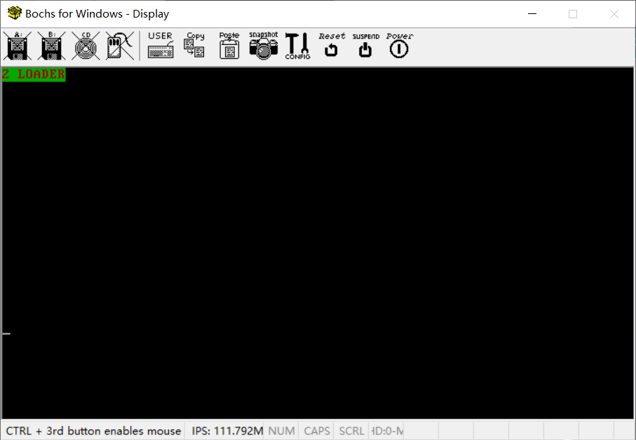

# （二）MBR启动加载器Loader

## 1. 实模式和保护模式

### 1.1 实模式（Real Mode）

**实模式**是x86处理器上电后的默认模式，**实模式其实就是x86架构最早的16位处理器的运行模式**。它有以下特点：

1. **地址空间**：实模式使用20位地址总线，这意味着它只能访问1MB的内存（2^20 = 1MB）。
2. **内存管理**：没有内存保护和虚拟内存的概念，所有程序可以直接访问所有的内存。这意味着一个程序可以轻易覆盖另一个程序的内存区域，导致系统崩溃。
3. **段式内存管理**：使用段寄存器和偏移量的方式（计算内存地址就是最简单的**段基址 + 偏移量**）来访问内存，最大可访问64KB的段。
4. **简单的多任务处理**：没有硬件支持的多任务处理，操作系统需要自己管理任务切换。


### 1.2 保护模式（Protected Mode）

**保护模式**是为了克服实模式的局限而引入的。它有以下特点：

1. **地址空间**：保护模式使用32位地址总线，理论上可以访问4GB的内存（2^32 = 4GB）。
2. **内存保护**：引入了内存保护机制，操作系统可以设定不同内存区域的访问权限，防止程序之间相互干扰。
3. **虚拟内存**：支持虚拟内存技术，可以通过分页机制扩展内存使用，提供比实际物理内存更多的地址空间。
4. **段式和分页式内存管理**：支持复杂的内存管理，包括段式（比实模式中段式内存管理更复杂）和分页式管理，提供更灵活的内存使用方式。
5. **硬件支持的多任务处理**：支持硬件级别的多任务处理，操作系统可以更高效地管理多个进程的切换。


### 1.3 实模式和保护模式之间的主要区别

1. **地址空间**：实模式只能访问1MB的内存，而保护模式可以访问4GB甚至更多的内存。
2. **内存保护**：实模式没有内存保护机制，所有程序可以随意访问内存（也就是说相互之间是平等的，没有特权之分）。保护模式则有严格的内存保护（这是基于特权级机制来实现的），防止程序之间互相干扰。
3. **内存管理**：实模式只能使用简单的段式内存管理（段式内存管理机制是所有x86架构的CPU出厂默认自带的，在实模式下只能用这个），保护模式则支持复杂的段式和分页式内存管理。
4. **多任务处理**：实模式不支持硬件级别的多任务处理，而保护模式支持，通过硬件帮助操作系统更高效地管理多个任务。
5. **启动方式**：计算机上电后进入实模式，操作系统需要显式地切换到保护模式才能利用其优势。


### 1.4 实模式和保护模式中的寻址（计算真实物理地址的公式）

#### 1.4.1 实模式的寻址方式

在实模式下，地址是通过段基址和偏移量的组合来计算的。这种方式称为**段式内存管理**。具体来说：

- **段基址**：由段寄存器（例如CS、DS、SS、ES）存储，表示段的起始地址。
- **偏移量**：是段内的偏移值，表示在段内的具体位置。

计算物理地址的公式是：物理地址 = 段基址 × 16 + 偏移量

#### 1.4.2 保护模式的寻址方式

在保护模式下，寻址方式更加复杂和灵活，主要有两种方式：**段式寻址**和**分页寻址**。

##### 1.4.2.1 段式寻址

1. **段选择子**：段寄存器存储的是一个段选择子（Selector），它指向全局描述符表（GDT）或局部描述符表（LDT）中的一个段描述符。
2. **段描述符**：段描述符包含段的基址、段的限制（大小）、权限等信息。
3. **段基址 + 偏移量**：最终的物理地址通过段基址加上偏移量来计算。

具体计算步骤：

- 从段寄存器获取段选择子。
- 使用段选择子从GDT或LDT中找到段描述符。
- 从段描述符中提取段基址。
- 物理地址 = 段基址 + 偏移量。

##### 1.4.2.2 分页寻址

分页寻址将线性地址分成页目录、页表和页内偏移三个部分：

1. **页目录**：包含页目录表，每个表项指向一个页表。
2. **页表**：每个表项指向一个具体的物理页框。
3. **页内偏移**：确定页框内的具体位置。

具体计算步骤：

- 线性地址通过页目录基址找到对应的页目录表项。
- 从页目录表项中获取页表的基址。
- 通过线性地址找到对应的页表表项。
- 从页表表项中获取物理页框的基址。
- 物理地址 = 页框基址 + 页内偏移。

#### 1.4.3 计算实例

**实模式**：

- 段基址 = 0x1234
- 偏移量 = 0x5678
- 物理地址 = 0x12340 + 0x5678 = 0x179B8

**保护模式（段式寻址）**：

- 段选择子 = 0x08
- GDT中段描述符基址 = 0x00400000
- 偏移量 = 0x00123456
- 物理地址 = 0x00400000 + 0x00123456 = 0x00523456

**保护模式（分页寻址）**：

- 线性地址 = 0x12345678
- 页目录表基址 = 0x00100000
- 页目录表项 = 页目录表基址 + (线性地址的高10位) = 0x00100000 + 0x00048 = 0x00100480
- 页表基址 = 页目录表项指向的地址 = 0x00200000
- 页表表项 = 页表基址 + (线性地址的中间10位) = 0x00200000 + 0x00023 = 0x00200230
- 页框基址 = 页表表项指向的地址 = 0x00300000
- 页内偏移 = 线性地址的低12位 = 0x678
- 物理地址 = 页框基址 + 页内偏移 = 0x00300000 + 0x678 = 0x00300678

通过这种方式，可以清晰地看到实模式和保护模式下寻址方式的差异。


## 2. MBR的完善之直接操作显卡

还是作者的简单MBR，这是第一个，**3.3.4  改进 MBR，直接操作显卡** 这一章节里面的。

```assembly
;主引导程序 
;
;LOADER_BASE_ADDR equ 0xA000 
;LOADER_START_SECTOR equ 0x2
;------------------------------------------------------------
SECTION MBR vstart=0x7c00         
   mov ax,cs      
   mov ds,ax
   mov es,ax
   mov ss,ax
   mov fs,ax
   mov sp,0x7c00
   mov ax,0xb800
   mov gs,ax

; 清屏
;利用0x06号功能，上卷全部行，则可清屏。
; -----------------------------------------------------------
;INT 0x10   功能号:0x06	   功能描述:上卷窗口
;------------------------------------------------------
;输入：
;AH 功能号= 0x06
;AL = 上卷的行数(如果为0,表示全部)
;BH = 上卷行属性
;(CL,CH) = 窗口左上角的(X,Y)位置
;(DL,DH) = 窗口右下角的(X,Y)位置
;无返回值：
   mov     ax, 0600h
   mov     bx, 0700h
   mov     cx, 0               ; 左上角: (0, 0)
   mov     dx, 184fh	       ; 右下角: (80,25),
			       ; 因为VGA文本模式中，一行只能容纳80个字符,共25行。
			       ; 下标从0开始，所以0x18=24,0x4f=79
   int     10h                 ; int 10h

   ; 输出背景色绿色，前景色红色，并且跳动的字符串"1 MBR"
   mov byte [gs:0x00],'1'
   mov byte [gs:0x01],0xA4     ; A表示绿色背景闪烁，4表示前景色为红色

   mov byte [gs:0x02],' '
   mov byte [gs:0x03],0xA4

   mov byte [gs:0x04],'M'
   mov byte [gs:0x05],0xA4   

   mov byte [gs:0x06],'B'
   mov byte [gs:0x07],0xA4

   mov byte [gs:0x08],'R'
   mov byte [gs:0x09],0xA4

   jmp $		       ; 通过死循环使程序悬停在此

   times 510-($-$$) db 0
   db 0x55,0xaa

```

用 mbr.bat 烧写，用 vdi和raw相互转换工具 转换，再在virtualbox中打开。


和书中描述的效果一模一样。


## 3. MBR的完善之使用硬盘

### 3.0 为什么有了MBR又要有BootLoader

**MBR（主引导记录）**和**BootLoader（引导加载程序 或者也叫 启动加载器）**是计算机启动过程中两个关键的步骤，它们各自承担不同的任务。简单来说：

1. **MBR的作用**：
   - **大小限制**：MBR只有512字节，这个大小非常有限。
   - **任务**：MBR的主要任务是引导计算机启动。它包含了非常基本的启动代码，其功能非常有限，只能执行一些简单的操作。
   - **作用范围**：主要是加载和执行更复杂的BootLoader。
2. **为什么需要BootLoader**：
   - **功能需求**：计算机启动需要执行很多复杂的操作，比如加载操作系统内核、初始化硬件设备、设置内存等。这些操作需要更多的空间和更复杂的代码，512字节的MBR根本无法容纳这些内容。
   - **大小优势**：BootLoader通常可以占用更多的空间（如64KB），这使得它可以包含更多的功能和更复杂的逻辑。
   - **任务**：BootLoader负责完成MBR之后的启动过程，比如加载操作系统内核、进行硬件初始化等。它可以执行更复杂的任务，并为操作系统的加载和运行做准备。

总的来说就是：

- **MBR**负责启动过程的第一步，它检查并加载BootLoader，因为它只有512字节，功能非常有限。
- **BootLoader**接手后，继续完成更复杂的启动任务，因为它有更多的空间（如64KB），可以包含更多功能。

通过这种方式，计算机的启动过程被分成了两个阶段：MBR处理简单的初始启动，BootLoader处理复杂的后续启动任务。

当然，如果你的系统没什么功能，你也完全可以不用BootLoader，直接在MBR把所有启动任务干完了也可以，这时候MBR和BootLoader就是一体的，CPU根本不知道你这是MBR还是BootLoader，它只管跳转。

### 3.1 MBR怎么操作硬盘

#### 3.1.1 硬盘的主要端口寄存器

以下是硬盘控制器（IDE/ATA接口）的主要端口寄存器：

**Primary 通道**

| 端口地址（IO Port） | 寄存器名称              | 用途解释                                                     |
| ------------------- | ----------------------- | ------------------------------------------------------------ |
| 0x1F0               | 数据寄存器              | 读/写数据（16位）                                            |
| 0x1F1               | 错误寄存器/预编译寄存器 | 读取时：错误寄存器（包含错误信息）<br>写入时：预编译寄存器（传输模式） |
| 0x1F2               | 扇区计数寄存器          | 要读/写的扇区数                                              |
| 0x1F3               | 扇区号寄存器            | 起始扇区号（LBA模式下的7-0位）                               |
| 0x1F4               | 柱面号低字节寄存器      | 柱面号低8位（LBA模式下的15-8位）                             |
| 0x1F5               | 柱面号高字节寄存器      | 柱面号高8位（LBA模式下的23-16位）                            |
| 0x1F6               | 驱动器/磁头寄存器       | 选择驱动器和磁头（LBA模式下的27-24位和驱动器号）             |
| 0x1F7               | 状态寄存器/命令寄存器   | 读取时：状态寄存器（包含状态信息）<br>写入时：命令寄存器（发送命令） |
| 0x3F6               | 控制寄存器              | 控制硬盘中断和复位硬盘                                       |

**Secondary 通道**

| 端口地址（IO Port） | 寄存器名称              | 用途解释                                                     |
| ------------------- | ----------------------- | ------------------------------------------------------------ |
| 0x170               | 数据寄存器              | 读/写数据（16位）                                            |
| 0x171               | 错误寄存器/预编译寄存器 | 读取时：错误寄存器（包含错误信息）<br>写入时：预编译寄存器（传输模式） |
| 0x172               | 扇区计数寄存器          | 要读/写的扇区数                                              |
| 0x173               | 扇区号寄存器            | 起始扇区号（LBA模式下的7-0位）                               |
| 0x174               | 柱面号低字节寄存器      | 柱面号低8位（LBA模式下的15-8位）                             |
| 0x175               | 柱面号高字节寄存器      | 柱面号高8位（LBA模式下的23-16位）                            |
| 0x176               | 驱动器/磁头寄存器       | 选择驱动器和磁头（LBA模式下的27-24位和驱动器号）             |
| 0x177               | 状态寄存器/命令寄存器   | 读取时：状态寄存器（包含状态信息）<br>写入时：命令寄存器（发送命令） |
| 0x376               | 控制寄存器              | 控制硬盘中断和复位硬盘                                       |

**端口寄存器用途解释**

- **数据寄存器（Data Register）**：
  - 端口：Primary (0x1F0)，Secondary (0x170)
  - 用途：用于读/写数据（16位）。

- **错误寄存器/预编译寄存器（Error Register/Features Register）**：
  - 端口：Primary (0x1F1)，Secondary (0x171)
  - 用途：读取时为错误寄存器，包含错误信息；写入时为预编译寄存器，设置传输模式等。

- **扇区计数寄存器（Sector Count Register）**：
  - 端口：Primary (0x1F2)，Secondary (0x172)
  - 用途：设置要读/写的扇区数。

- **扇区号寄存器（Sector Number Register）**：
  - 端口：Primary (0x1F3)，Secondary (0x173)
  - 用途：设置起始扇区号（LBA模式下的7-0位）。

- **柱面号低字节寄存器（Cylinder Low Register）**：
  - 端口：Primary (0x1F4)，Secondary (0x174)
  - 用途：设置柱面号的低8位（LBA模式下的15-8位）。

- **柱面号高字节寄存器（Cylinder High Register）**：
  - 端口：Primary (0x1F5)，Secondary (0x175)
  - 用途：设置柱面号的高8位（LBA模式下的23-16位）。

- **驱动器/磁头寄存器（Drive/Head Register）**：
  - 端口：Primary (0x1F6)，Secondary (0x176)
  - 用途：选择驱动器和磁头（LBA模式下的27-24位和驱动器号）。

- **状态寄存器/命令寄存器（Status Register/Command Register）**：
  - 端口：Primary (0x1F7)，Secondary (0x177)
  - 用途：读取时为状态寄存器，包含状态信息；写入时为命令寄存器，发送命令。

- **控制寄存器（Control Register）**：
  - 端口：Primary (0x3F6)，Secondary (0x376)
  - 用途：控制硬盘中断和复位硬盘。

这些寄存器用于与硬盘控制器进行通信，通过这些端口，可以实现对硬盘的读写操作和状态检测。


## 3.2 操作硬盘

这里主要是对作者的MBR中的 `rd_disk_m_16` 这个函数搞的一个注释版。

```assembly
;-------------------------------------------------------------------------------
;功能:读取硬盘n个扇区
rd_disk_m_16:
;-------------------------------------------------------------------------------
; Primary 通道
%define DATA_REG          0x1F0  ; 数据寄存器
%define ERROR_REG         0x1F1  ; 错误寄存器/预编译寄存器
%define SECTOR_COUNT_REG  0x1F2  ; 扇区计数寄存器
%define SECTOR_NUM_REG    0x1F3  ; 扇区号寄存器
%define CYL_LOW_REG       0x1F4  ; 柱面号低字节寄存器
%define CYL_HIGH_REG      0x1F5  ; 柱面号高字节寄存器
%define DRIVE_HEAD_REG    0x1F6  ; 驱动器/磁头寄存器
%define STATUS_CMD_REG    0x1F7  ; 状态寄存器/命令寄存器
%define CONTROL_REG       0x3F6  ; 控制寄存器

; Secondary 通道
%define SEC_DATA_REG          0x170  ; 数据寄存器
%define SEC_ERROR_REG         0x171  ; 错误寄存器/预编译寄存器
%define SEC_SECTOR_COUNT_REG  0x172  ; 扇区计数寄存器
%define SEC_SECTOR_NUM_REG    0x173  ; 扇区号寄存器
%define SEC_CYL_LOW_REG       0x174  ; 柱面号低字节寄存器
%define SEC_CYL_HIGH_REG      0x175  ; 柱面号高字节寄存器
%define SEC_DRIVE_HEAD_REG    0x176  ; 驱动器/磁头寄存器
%define SEC_STATUS_CMD_REG    0x177  ; 状态寄存器/命令寄存器
%define SEC_CONTROL_REG       0x376  ; 控制寄存器


    ; 参数说明：
    ; eax = LBA扇区号
    ; ebx = 将数据写入的内存地址
    ; ecx = 读入的扇区数

    mov esi, eax          ; 备份eax，保存LBA扇区号
    mov di, cx            ; 备份cx，保存要读取的扇区数

    ; 第1步：设置要读取的扇区数
    mov dx, SECTOR_COUNT_REG ; 选择扇区计数寄存器端口
    mov al, cl            ; 将要读取的扇区数放入al
    out dx, al            ; 输出到扇区计数寄存器

    mov eax, esi          ; 恢复eax，包含LBA扇区号

    ; 第2步：将LBA地址存入0x1f3 ~ 0x1f6

    ; LBA地址7~0位写入端口SECTOR_NUM_REG
    mov dx, SECTOR_NUM_REG
    out dx, al

    ; LBA地址15~8位写入端口CYL_LOW_REG
    mov cl, 8
    shr eax, cl
    mov dx, CYL_LOW_REG
    out dx, al

    ; LBA地址23~16位写入端口CYL_HIGH_REG
    shr eax, cl
    mov dx, CYL_HIGH_REG
    out dx, al

    ; LBA地址27~24位写入端口DRIVE_HEAD_REG
    shr eax, cl
    and al, 0x0f       ; 只保留LBA地址的低4位
    or al, 0xe0        ; 设置7~4位为1110，表示LBA模式
    mov dx, DRIVE_HEAD_REG
    out dx, al

    ; 第3步：向STATUS_CMD_REG端口写入读命令，0x20
    mov dx, STATUS_CMD_REG
    mov al, 0x20
    out dx, al

    ; 第4步：检测硬盘状态
    .not_ready:
        nop
        in al, dx
        and al, 0x88       ; 检查硬盘控制器状态：第4位为1表示准备好数据传输，第7位为1表示硬盘忙
        cmp al, 0x08
        jnz .not_ready     ; 若未准备好，继续等待

    ; 第5步：从DATA_REG端口读数据
    mov ax, di
    mov dx, 256
    mul dx
    mov cx, ax         ; di为要读取的扇区数，一个扇区有512字节，每次读入一个字，共需di*512/2次
    mov dx, DATA_REG
    .go_on_read:
        in ax, dx
        mov [bx], ax
        add bx, 2
        loop .go_on_read
        ret

```

在mbr.asm的目录中新建一个文件夹 `include`，里面放一个预处理文件boot.inc，内容很简单

```assembly
; 配置加载Loader和加载内核需要用到的一些宏定义
;-------------	 loader和kernel   ----------
LOADER_BASE_ADDR    equ 0x900   ; 定义加载器的基址
LOADER_START_SECTOR equ 0x2     ; 定义加载器的起始扇区

;---------------    硬盘寄存器   -------------------
; Primary 通道
DATA_REG          equ 0x1f0  ; 数据寄存器
ERROR_REG         equ 0x1f1  ; 错误寄存器/预编译寄存器
SECTOR_COUNT_REG  equ 0x1f2  ; 扇区计数寄存器
SECTOR_NUM_REG    equ 0x1f3  ; 扇区号寄存器
CYL_LOW_REG       equ 0x1f4  ; 柱面号低字节寄存器
CYL_HIGH_REG      equ 0x1f5  ; 柱面号高字节寄存器
DRIVE_HEAD_REG    equ 0x1f6  ; 驱动器/磁头寄存器
STATUS_CMD_REG    equ 0x1f7  ; 状态寄存器/命令寄存器
CONTROL_REG       equ 0x3f6  ; 控制寄存器

; Secondary 通道
SEC_DATA_REG          equ 0x170  ; 数据寄存器
SEC_ERROR_REG         equ 0x171  ; 错误寄存器/预编译寄存器
SEC_SECTOR_COUNT_REG  equ 0x172  ; 扇区计数寄存器
SEC_SECTOR_NUM_REG    equ 0x173  ; 扇区号寄存器
SEC_CYL_LOW_REG       equ 0x174  ; 柱面号低字节寄存器
SEC_CYL_HIGH_REG      equ 0x175  ; 柱面号高字节寄存器
SEC_DRIVE_HEAD_REG    equ 0x176  ; 驱动器/磁头寄存器
SEC_STATUS_CMD_REG    equ 0x177  ; 状态寄存器/命令寄存器
SEC_CONTROL_REG       equ 0x376  ; 控制寄存器

```

然后建立一个loader.asm

```assembly
%include "boot.inc"
; 加载配置，这样以后调整都方便
section loader vstart=LOADER_BASE_ADDR

; 输出背景色绿色，前景色红色，并且跳动的字符串"1 MBR"
mov byte [gs:0x00],'2'
mov byte [gs:0x01],0xA4     ; A表示绿色背景闪烁，4表示前景色为红色

mov byte [gs:0x02],' '
mov byte [gs:0x03],0xA4

mov byte [gs:0x04],'L'
mov byte [gs:0x05],0xA4   

mov byte [gs:0x06],'O'
mov byte [gs:0x07],0xA4

mov byte [gs:0x08],'A'
mov byte [gs:0x09],0xA4

mov byte [gs:0x0a],'D'
mov byte [gs:0x0b],0xA4

mov byte [gs:0x0c],'E'
mov byte [gs:0x0d],0xA4

mov byte [gs:0x0e],'R'
mov byte [gs:0x0f],0xA4

jmp $		       ; 通过死循环使程序悬停在此


```

mbr.asm整体修改如下：

```assembly
%include "boot.inc"
; 加载配置，这样以后调整都方便
SECTION MBR vstart=0x7c00
; 入口地址0x7c00是MBR的惯例，BIOS只要发现MBR，一律加载到这个地址
; 在开始就设置每个寄存器的初始值
   mov ax,cs
   mov ds,ax
   mov es,ax
   mov ss,ax
   mov fs,ax
; cs一开始是0，设置ds、es、ss、fs四个都是0
   mov sp,0x7c00
; sp存储的是栈顶指针，在MBR一开始必须是0x7c00（这本身也是MBR的加载位置，栈是向低地址处生长的，所以不会覆盖MBR的数据）
   mov ax,0xb800
; 0xb800，VGA时代对应显存的起始位置，放到gs寄存器里面
   mov gs,ax

; 清屏
   mov     ax, 0600h
   mov     bx, 0700h
   mov     cx, 0
   mov     dx, 184fh
   int     10h

; 读入Loader
   mov eax,LOADER_START_SECTOR	 ; 起始扇区lba地址
   mov bx,LOADER_BASE_ADDR       ; 写入的地址
   mov cx,4			 ; 待读入的扇区数
   call rd_disk_m_16		 ; 以下读取程序的起始部分（一个扇区）
   

   jmp LOADER_BASE_ADDR

;-------------------------------------------------------------------------------
;功能:读取硬盘n个扇区，16位
rd_disk_m_16:
;-------------------------------------------------------------------------------
    ; 参数说明：
    ; eax = LBA扇区号
    ; ebx = 将数据写入的内存地址
    ; ecx = 读入的扇区数

    mov esi, eax          ; 备份eax，保存LBA扇区号
    mov di, cx            ; 备份cx，保存要读取的扇区数

    ; 第1步：设置要读取的扇区数
    mov dx, SECTOR_COUNT_REG ; 选择扇区计数寄存器端口
    mov al, cl            ; 将要读取的扇区数放入al
    out dx, al            ; 输出到扇区计数寄存器

    mov eax, esi          ; 恢复eax，包含LBA扇区号

    ; 第2步：将LBA地址存入0x1f3 ~ 0x1f6

    ; LBA地址7~0位写入端口SECTOR_NUM_REG
    mov dx, SECTOR_NUM_REG
    out dx, al

    ; LBA地址15~8位写入端口CYL_LOW_REG
    mov cl, 8
    shr eax, cl
    mov dx, CYL_LOW_REG
    out dx, al

    ; LBA地址23~16位写入端口CYL_HIGH_REG
    shr eax, cl
    mov dx, CYL_HIGH_REG
    out dx, al

    ; LBA地址27~24位写入端口DRIVE_HEAD_REG
    shr eax, cl
    and al, 0x0f       ; 只保留LBA地址的低4位
    or al, 0xe0        ; 设置7~4位为1110，表示LBA模式
    mov dx, DRIVE_HEAD_REG
    out dx, al

    ; 第3步：向STATUS_CMD_REG端口写入读命令，0x20
    mov dx, STATUS_CMD_REG
    mov al, 0x20
    out dx, al

    ; 第4步：检测硬盘状态
    .not_ready:
        nop
        in al, dx
        and al, 0x88       ; 检查硬盘控制器状态：第4位为1表示准备好数据传输，第7位为1表示硬盘忙
        cmp al, 0x08
        jnz .not_ready     ; 若未准备好，继续等待

    ; 第5步：从DATA_REG端口读数据
    mov ax, di
    mov dx, 256
    mul dx
    mov cx, ax         ; di为要读取的扇区数，一个扇区有512字节，每次读入一个字，共需di*512/2次
    mov dx, DATA_REG
    .go_on_read:
        in ax, dx
        mov [bx], ax
        add bx, 2
        loop .go_on_read
        ret

times 510-($-$$) db 0
; 这行代码的作用是填充当前代码段，使其总长度达到510字节。
; MBR的总大小是512字节，其中最后两个字节是固定的引导标识符 0x55 和 0xAA，所以需要填充前面的字节。
; $ 表示当前地址，$$ 表示当前段的起始地址，($-$$) 计算出当前代码段的大小，然后 510-($-$$) 计算出需要填充的字节数。
; 用 db 0 填充这些字节。

db 0x55,0xaa		; 这两个字节是引导记录的标识符，表示这是一个有效的MBR。

```

Makefile 修改如下：

```Makefile
# Makefile 用于编译项目

# 汇编器和编译器
NASM = nasm

# 目录
BOOT_DIR = boot

# 源文件
MBR_SRC = $(BOOT_DIR)/mbr.asm
LOADER_SRC = $(BOOT_DIR)/loader.asm

# 头文件
BOOT_INCLUDE_DIR = $(BOOT_DIR)/include

# 输出文件
MBR_BIN = $(BOOT_DIR)/mbr.bin
LOADER_BIN = $(BOOT_DIR)/loader.bin

# 汇编标志
ASM_FLAGS = -f bin -I $(BOOT_INCLUDE_DIR)/

.PHONY: all

all: $(MBR_BIN) $(LOADER_BIN)

# 编译 mbr.bin
$(MBR_BIN): $(MBR_SRC) $(BOOT_INCLUDE_DIR)/boot.inc
	$(NASM) $(ASM_FLAGS) -o $@ $<

# 编译 loader.bin
$(LOADER_BIN): $(LOADER_SRC) $(BOOT_INCLUDE_DIR)/boot.inc
	$(NASM) $(ASM_FLAGS) -o $@ $<

# 清理规则
clean:
	@if exist $(BOOT_DIR)\\*.bin del $(BOOT_DIR)\\*.bin

```

一键编译烧写脚本w.bat修改如下：

```bash
@echo off

rem 先执行make操作
make all

setlocal

rem 确定mbr.bin文件的路径
set MBR_BIN=%~dp0boot\mbr.bin
set LOADER_BIN=%~dp0boot\loader.bin

rem 确定目标硬盘映像文件的相对路径
set HD_IMG_REL=..\VM\HOS.raw

rem 计算目标硬盘映像文件的绝对路径
for %%I in (%HD_IMG_REL%) do set HD_IMG=%%~fI

rem 输出涉及各文件的路径信息
echo MBR_BIN=%MBR_BIN%
echo LOADER_BIN=%LOADER_BIN%
echo HD_IMG=%HD_IMG%

rem 切换到脚本所在的目录
cd /d %~dp0

rem 首先清空硬盘
dd if=/dev/zero of=%HD_IMG% bs=1M count=64 conv=notrunc
rem 使用dd将mbr.bin写入硬盘映像文件
dd if=%MBR_BIN% of=%HD_IMG% bs=512 count=1 conv=notrunc
dd if=%LOADER_BIN% of=%HD_IMG% bs=512 count=1 seek=2 conv=notrunc

rem 执行clean操作
make clean

endlocal
pause

```

烧写之后直接start_bochs.bat一键开启运行。



